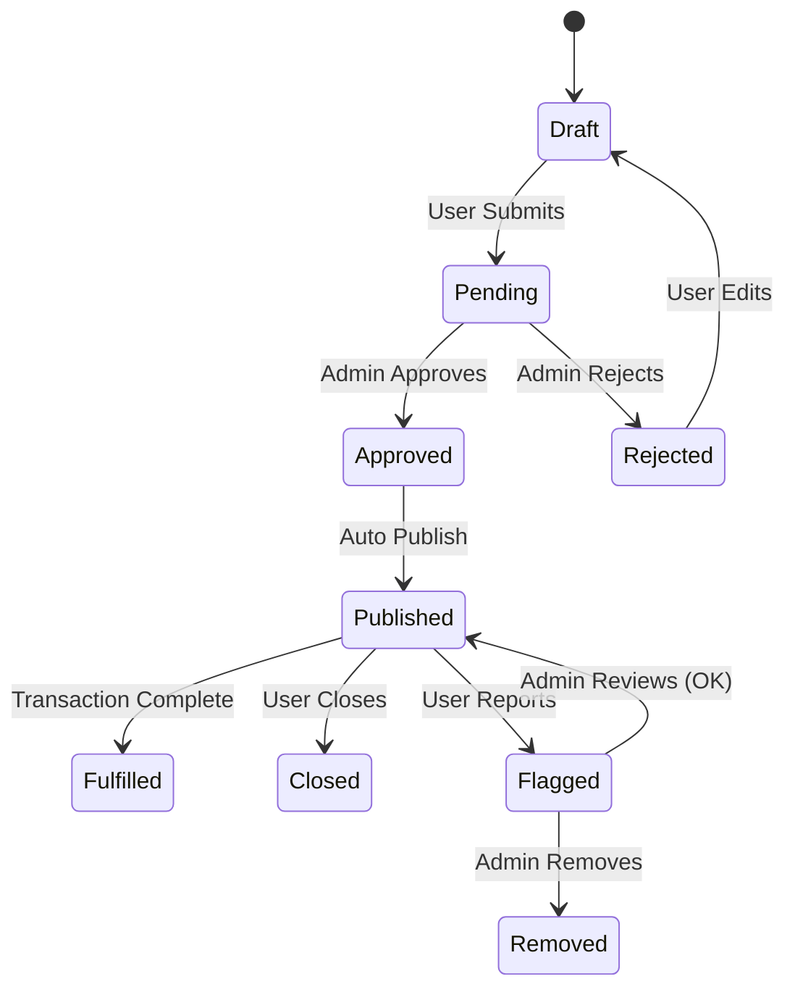

# WytWall API Reference

## Overview

WytWall is WytNet's social commerce platform that connects buyers and sellers through a dynamic feed of **Needs** and **Offers**. The WytWall API provides endpoints for creating, managing, and interacting with posts, as well as admin moderation features.

---

## Base URL

```
Production: https://wytnet.com
Development: https://your-replit-dev-domain.replit.dev
```

---

## Authentication

Most WytWall endpoints require authentication via WytPass session cookie:

```http
Cookie: wytpass.sid=<session-id>
```

Public feed endpoints (GET /api/wytwall/posts) are accessible without authentication, but authenticated users get personalized results.

---

## Post Types

WytWall supports two types of posts:

| Type | Description | Purpose |
|------|-------------|---------|
| **Need** | Something the user is looking for | Buyers post their requirements |
| **Offer** | Something the user is offering to sell/provide | Sellers post their products/services |

---

## Post Lifecycle States



| State | Description |
|-------|-------------|
| `draft` | Post being composed (not yet submitted) |
| `pending` | Awaiting admin approval |
| `approved` | Admin approved, ready to publish |
| `published` | Live on feed, visible to users |
| `fulfilled` | Transaction completed successfully |
| `closed` | User manually closed the post |
| `flagged` | Reported by users for review |
| `removed` | Admin removed from platform |
| `rejected` | Admin rejected the post |

---

## Public Feed Endpoints

### GET /api/wytwall/posts

Get the public WytWall feed with filtering and pagination.

**Authentication**: Optional (returns personalized results if authenticated)

**Request**

```http
GET /api/wytwall/posts?type=all&category=all&page=1&limit=20&location=Chennai&radius=50&search=laptop
```

**Query Parameters**

| Parameter | Type | Default | Description |
|-----------|------|---------|-------------|
| type | string | 'all' | Post type filter: 'all', 'needs', 'offers' |
| category | string | 'all' | Category filter (see categories below) |
| page | number | 1 | Page number |
| limit | number | 20 | Items per page (max 100) |
| location | string | - | Filter by location |
| radius | number | - | Radius in km from location |
| search | string | - | Search in title and description |
| sortBy | string | 'recent' | Sort order: 'recent', 'relevant', 'popular' |

**Example Request**

```bash
curl -X GET "https://wytnet.com/api/wytwall/posts?type=needs&category=product_for_use&page=1&limit=20"
```

**Success Response (200 OK)**

```typescript
{
  posts: Array<{
    id: string;                    // Post UUID
    displayId: string;             // P0001, P0002, etc.
    postType: 'need' | 'offer';
    
    // User Information
    userId: string;
    userName: string;
    userAvatar?: string;
    
    // Post Content
    title: string;
    description: string;
    category: string;
    tags: string[];
    
    // Location
    location?: string;
    radius?: number;               // In km
    
    // Pricing
    price?: number;                // For offers
    budget?: number;               // For needs
    currency: string;              // 'INR', 'USD'
    priceNegotiable: boolean;
    
    // Media
    images: string[];              // Array of image URLs
    
    // Engagement Metrics
    likeCount: number;
    commentCount: number;
    viewCount: number;
    shareCount: number;
    
    // User Actions (if authenticated)
    isLiked?: boolean;
    isSaved?: boolean;
    
    // Status
    status: string;                // 'published', 'pending', 'closed', etc.
    visibility: 'public' | 'private';
    
    // Timestamps
    createdAt: string;             // ISO 8601
    updatedAt: string;
    expiresAt?: string;            // Optional expiration
  }>;
  
  pagination: {
    page: number;
    limit: number;
    total: number;
    totalPages: number;
    hasNext: boolean;
    hasPrev: boolean;
  };
  
  // Metadata
  metadata: {
    categories: string[];          // Available categories
    locations: string[];           // Popular locations
    priceRange: {
      min: number;
      max: number;
    };
  };
}
```

**Categories**

```typescript
[
  'product_for_use',       // Products for personal use
  'product_for_business',  // Products for business
  'property',              // Real estate
  'services',              // Professional services
  'jobs',                  // Job postings
  'events',                // Events and activities
  'community',             // Community requests
  'all'                    // All categories
]
```

---

### GET /api/wytwall/posts/:id

Get a specific post by ID.

**Authentication**: Optional

**Request**

```http
GET /api/wytwall/posts/:id
```

**Success Response (200 OK)**

```typescript
{
  post: {
    id: string;
    displayId: string;
    postType: 'need' | 'offer';
    
    // User Information (full details)
    user: {
      id: string;
      displayId: string;
      name: string;
      avatar?: string;
      bio?: string;
      location?: string;
      joinedAt: string;
      verifiedSeller: boolean;     // For offers
      responseRate?: number;       // 0-100
      responseTime?: string;       // 'Within 1 hour', etc.
    };
    
    // Full Post Content
    title: string;
    description: string;
    category: string;
    subCategory?: string;
    tags: string[];
    
    // Detailed Specifications (if provided)
    specifications?: Record<string, any>;
    
    // Location
    location?: string;
    radius?: number;
    coordinates?: {
      lat: number;
      lng: number;
    };
    
    // Pricing
    price?: number;
    budget?: number;
    currency: string;
    priceNegotiable: boolean;
    paymentMethods?: string[];   // ['cash', 'upi', 'card']
    
    // Media
    images: string[];
    videos?: string[];
    documents?: string[];
    
    // Engagement
    likeCount: number;
    commentCount: number;
    viewCount: number;
    shareCount: number;
    
    // Comments (recent 5)
    recentComments: Array<{
      id: string;
      userId: string;
      userName: string;
      userAvatar?: string;
      comment: string;
      createdAt: string;
    }>;
    
    // User Actions (if authenticated)
    isLiked?: boolean;
    isSaved?: boolean;
    isOwner?: boolean;
    canEdit?: boolean;
    
    // Status
    status: string;
    visibility: 'public' | 'private';
    
    // Timestamps
    createdAt: string;
    updatedAt: string;
    expiresAt?: string;
    
    // Related Posts (algorithm-based)
    relatedPosts?: Array<{
      id: string;
      displayId: string;
      title: string;
      postType: string;
      thumbnail?: string;
    }>;
  }
}
```

**Error Responses**

```typescript
// 404 Not Found
{
  success: false;
  message: "Post not found"
}
```

---

## User Post Management

### POST /api/wytwall/posts

Create a new post (Need or Offer).

**Authentication**: Required

**Request**

```typescript
POST /api/wytwall/posts
Content-Type: application/json
Cookie: wytpass.sid=<session-id>

{
  postType: 'need' | 'offer';    // Required
  title: string;                 // Required, max 255 chars
  description: string;           // Required, max 5000 chars
  category: string;              // Required
  subCategory?: string;
  tags?: string[];               // Optional, max 10 tags
  
  // Location (optional)
  location?: string;
  radius?: number;               // In km, default 10
  coordinates?: {
    lat: number;
    lng: number;
  };
  
  // Pricing (one of these based on postType)
  price?: number;                // For offers
  budget?: number;               // For needs
  currency?: string;             // Default 'INR'
  priceNegotiable?: boolean;     // Default true
  paymentMethods?: string[];
  
  // Media (upload first via /api/media/upload)
  images?: string[];             // Array of URLs
  videos?: string[];
  documents?: string[];
  
  // Specifications (optional key-value pairs)
  specifications?: Record<string, any>;
  
  // Visibility
  visibility?: 'public' | 'private';
  
  // Expiration (optional)
  expiresAt?: string;            // ISO 8601 datetime
}
```

**Example Request**

```bash
curl -X POST https://wytnet.com/api/wytwall/posts \
  -H "Content-Type: application/json" \
  -H "Cookie: wytpass.sid=<session-id>" \
  -d '{
    "postType": "need",
    "title": "Looking for a laptop under 50k",
    "description": "Need a good laptop for programming. Budget 50,000 INR. Prefer Dell or HP with i5 processor minimum.",
    "category": "product_for_use",
    "tags": ["laptop", "programming", "dell", "hp"],
    "location": "Chennai",
    "radius": 10,
    "budget": 50000,
    "currency": "INR",
    "priceNegotiable": true,
    "visibility": "public"
  }'
```

**Success Response (201 Created)**

```typescript
{
  success: true;
  message: "Post created successfully";
  post: {
    id: string;
    displayId: string;
    postType: string;
    title: string;
    description: string;
    category: string;
    status: 'pending';           // Awaiting moderation
    createdAt: string;
  };
  pointsAwarded: number;         // WytPoints earned
  wytStarContribution: boolean;  // WytStar level contribution
}
```

**Validation Rules**

- Title: 10-255 characters
- Description: 50-5000 characters
- Tags: Max 10, each 2-30 characters
- Price/Budget: Positive number
- Images: Max 10, each max 5MB
- Videos: Max 3, each max 50MB

**WytPoints Reward**

- Need post: 5 points
- Offer post: 10 points
- Post with images: +5 points
- Complete details: +10 points

---

### PATCH /api/wytwall/posts/:id

Update an existing post.

**Authentication**: Required (must be post owner or admin)

**Request**

```typescript
PATCH /api/wytwall/posts/:id
Content-Type: application/json
Cookie: wytpass.sid=<session-id>

{
  // All fields are optional
  title?: string;
  description?: string;
  category?: string;
  tags?: string[];
  price?: number;
  budget?: number;
  location?: string;
  radius?: number;
  images?: string[];
  visibility?: 'public' | 'private';
  status?: 'published' | 'closed' | 'fulfilled';
}
```

**Success Response (200 OK)**

```typescript
{
  success: true;
  message: "Post updated successfully";
  post: {
    // Updated post object
    id: string;
    displayId: string;
    // ... all fields
    updatedAt: string;
  }
}
```

**Error Responses**

```typescript
// 403 Forbidden - Not post owner
{
  success: false;
  message: "You don't have permission to edit this post"
}

// 404 Not Found
{
  success: false;
  message: "Post not found"
}

// 400 Bad Request - Post is closed/fulfilled
{
  success: false;
  message: "Cannot edit a closed or fulfilled post"
}
```

---

### DELETE /api/wytwall/posts/:id

Delete a post.

**Authentication**: Required (must be post owner or admin)

**Request**

```http
DELETE /api/wytwall/posts/:id
Cookie: wytpass.sid=<session-id>
```

**Success Response (200 OK)**

```typescript
{
  success: true;
  message: "Post deleted successfully";
}
```

**Note**: Posts are soft-deleted and moved to trash. They can be recovered within 30 days.

---

## User's Posts

### GET /api/wytwall/my-posts

Get posts created by the authenticated user.

**Authentication**: Required

**Request**

```http
GET /api/wytwall/my-posts?status=all&page=1&limit=20
```

**Query Parameters**

| Parameter | Type | Default | Description |
|-----------|------|---------|-------------|
| status | string | 'all' | Filter by status: 'all', 'pending', 'published', 'closed', 'fulfilled' |
| type | string | 'all' | 'all', 'needs', 'offers' |
| page | number | 1 | Page number |
| limit | number | 20 | Items per page |

**Success Response (200 OK)**

```typescript
{
  posts: Array<{
    // Same as GET /api/wytwall/posts response
    id: string;
    displayId: string;
    postType: string;
    title: string;
    description: string;
    status: string;
    likeCount: number;
    commentCount: number;
    viewCount: number;
    createdAt: string;
    updatedAt: string;
  }>;
  pagination: {
    page: number;
    limit: number;
    total: number;
    totalPages: number;
  };
  statistics: {
    totalPosts: number;
    activeNeeds: number;
    activeOffers: number;
    fulfilledCount: number;
    pendingCount: number;
  };
}
```

---

## Post Interactions

### POST /api/wytwall/posts/:id/like

Like or unlike a post.

**Authentication**: Required

**Request**

```http
POST /api/wytwall/posts/:id/like
Cookie: wytpass.sid=<session-id>
```

**Success Response (200 OK)**

```typescript
{
  success: true;
  message: "Post liked successfully";  // or "Post unliked successfully"
  isLiked: boolean;
  likeCount: number;
}
```

**WytPoints Reward**: 1 point per like (max 10 per day)

---

### POST /api/wytwall/posts/:id/save

Save or unsave a post to bookmarks.

**Authentication**: Required

**Request**

```http
POST /api/wytwall/posts/:id/save
Cookie: wytpass.sid=<session-id>
```

**Success Response (200 OK)**

```typescript
{
  success: true;
  message: "Post saved successfully";  // or "Post removed from saved"
  isSaved: boolean;
}
```

---

### POST /api/wytwall/posts/:id/comment

Add a comment to a post.

**Authentication**: Required

**Request**

```typescript
POST /api/wytwall/posts/:id/comment
Content-Type: application/json
Cookie: wytpass.sid=<session-id>

{
  comment: string;               // Required, 1-500 chars
  parentCommentId?: string;      // For replies
}
```

**Success Response (201 Created)**

```typescript
{
  success: true;
  message: "Comment added successfully";
  comment: {
    id: string;
    postId: string;
    userId: string;
    userName: string;
    userAvatar?: string;
    comment: string;
    parentCommentId?: string;
    createdAt: string;
  };
  pointsAwarded: 2;              // WytPoints earned
}
```

---

### GET /api/wytwall/posts/:id/comments

Get comments for a post.

**Authentication**: Optional

**Request**

```http
GET /api/wytwall/posts/:id/comments?page=1&limit=20
```

**Success Response (200 OK)**

```typescript
{
  comments: Array<{
    id: string;
    postId: string;
    userId: string;
    userName: string;
    userAvatar?: string;
    comment: string;
    parentCommentId?: string;
    replies: Array<Comment>;     // Nested replies
    likeCount: number;
    createdAt: string;
  }>;
  pagination: {
    page: number;
    limit: number;
    total: number;
  };
}
```

---

### POST /api/wytwall/posts/:id/report

Report a post for moderation.

**Authentication**: Required

**Request**

```typescript
POST /api/wytwall/posts/:id/report
Content-Type: application/json
Cookie: wytpass.sid=<session-id>

{
  reason: string;                // Required
  category: string;              // 'spam', 'inappropriate', 'scam', 'duplicate'
  details?: string;              // Optional additional details
}
```

**Success Response (200 OK)**

```typescript
{
  success: true;
  message: "Post reported successfully. Our team will review it.";
}
```

---

## Admin Moderation Endpoints

### GET /api/admin/wytwall/pending

Get pending posts awaiting moderation.

**Authentication**: Required (Admin only)

**Permission**: `wytwall:moderate`

**Request**

```http
GET /api/admin/wytwall/pending?page=1&limit=20&category=all&sortBy=oldest
Cookie: wytpass.sid=<session-id>
```

**Success Response (200 OK)**

```typescript
{
  posts: Array<{
    id: string;
    displayId: string;
    postType: string;
    
    // User Info
    userId: string;
    userName: string;
    userAvatar?: string;
    userTrustScore: number;      // 0-100
    
    // Post Content
    title: string;
    description: string;
    category: string;
    tags: string[];
    
    // Media
    images: string[];
    
    // Pricing
    price?: number;
    budget?: number;
    currency: string;
    
    // Location
    location?: string;
    
    // Moderation Info
    reportCount: number;
    reportReasons?: string[];
    flaggedKeywords?: string[];  // AI-detected issues
    riskScore: number;           // 0-100 (AI assessment)
    
    // Timestamps
    createdAt: string;
    submittedAt: string;
  }>;
  
  pagination: {
    page: number;
    limit: number;
    total: number;
    queuePosition: number;
  };
  
  statistics: {
    pendingCount: number;
    todayApproved: number;
    todayRejected: number;
    avgReviewTime: string;       // '5 minutes'
  };
}
```

---

### PATCH /api/admin/wytwall/posts/:id/approve

Approve a pending post.

**Authentication**: Required (Admin only)

**Permission**: `wytwall:moderate`

**Request**

```typescript
PATCH /api/admin/wytwall/posts/:id/approve
Content-Type: application/json
Cookie: wytpass.sid=<session-id>

{
  notes?: string;                // Optional admin notes
  featuredUntil?: string;        // Optional: feature post until this date
}
```

**Success Response (200 OK)**

```typescript
{
  success: true;
  message: "Post approved and published successfully";
  post: {
    id: string;
    displayId: string;
    status: 'published';
    approvedBy: string;
    approvedAt: string;
  }
}
```

---

### PATCH /api/admin/wytwall/posts/:id/reject

Reject a pending post.

**Authentication**: Required (Admin only)

**Permission**: `wytwall:moderate`

**Request**

```typescript
PATCH /api/admin/wytwall/posts/:id/reject
Content-Type: application/json
Cookie: wytpass.sid=<session-id>

{
  reason: string;                // Required
  notifyUser: boolean;           // Default true
  banDuration?: number;          // Optional ban in days
}
```

**Success Response (200 OK)**

```typescript
{
  success: true;
  message: "Post rejected successfully";
  post: {
    id: string;
    displayId: string;
    status: 'rejected';
    rejectedBy: string;
    rejectedAt: string;
    rejectionReason: string;
  }
}
```

---

### GET /api/admin/wytwall/flagged

Get flagged posts (user reports).

**Authentication**: Required (Admin only)

**Permission**: `wytwall:moderate`

**Request**

```http
GET /api/admin/wytwall/flagged?page=1&limit=20
```

**Success Response (200 OK)**

```typescript
{
  posts: Array<{
    // Same as pending posts
    id: string;
    displayId: string;
    // ... post details
    
    // Report Details
    reports: Array<{
      reportedBy: string;
      reportedByName: string;
      reason: string;
      category: string;
      details?: string;
      reportedAt: string;
    }>;
    totalReports: number;
    severityScore: number;       // 0-100
  }>;
  
  pagination: {
    page: number;
    limit: number;
    total: number;
  };
}
```

---

### POST /api/admin/wytwall/posts/:id/remove

Remove a post from the platform.

**Authentication**: Required (Admin only)

**Permission**: `wytwall:moderate`

**Request**

```typescript
POST /api/admin/wytwall/posts/:id/remove
Content-Type: application/json
Cookie: wytpass.sid=<session-id>

{
  reason: string;
  permanent: boolean;            // Default false (soft delete)
  notifyUser: boolean;
  banUser?: boolean;
  banDuration?: number;          // Days
}
```

**Success Response (200 OK)**

```typescript
{
  success: true;
  message: "Post removed successfully";
}
```

---

## Analytics & Statistics

### GET /api/wytwall/stats

Get platform-wide WytWall statistics (public).

**Authentication**: Optional

**Request**

```http
GET /api/wytwall/stats
```

**Success Response (200 OK)**

```typescript
{
  totalPosts: number;
  activeNeeds: number;
  activeOffers: number;
  fulfilledToday: number;
  categoriesBreakdown: Array<{
    category: string;
    count: number;
    percentage: number;
  }>;
  topLocations: Array<{
    location: string;
    count: number;
  }>;
  priceRanges: {
    needs: { min: number; max: number; avg: number; };
    offers: { min: number; max: number; avg: number; };
  };
}
```

---

## Frontend Integration

### React Example

```typescript
import { useQuery, useMutation } from '@tanstack/react-query';
import { apiRequest, queryClient } from '@/lib/queryClient';

// Get WytWall feed
const { data: feed, isLoading } = useQuery({
  queryKey: ['/api/wytwall/posts', { type: 'all', category: 'all', page: 1 }],
});

// Create post
const createPostMutation = useMutation({
  mutationFn: async (postData: CreatePostRequest) => {
    const res = await apiRequest('/api/wytwall/posts', 'POST', postData);
    return await res.json();
  },
  onSuccess: () => {
    queryClient.invalidateQueries({ queryKey: ['/api/wytwall/posts'] });
    queryClient.invalidateQueries({ queryKey: ['/api/wytwall/my-posts'] });
  },
});

// Like post
const likePostMutation = useMutation({
  mutationFn: async (postId: string) => {
    const res = await apiRequest(`/api/wytwall/posts/${postId}/like`, 'POST');
    return await res.json();
  },
  onSuccess: (data, postId) => {
    queryClient.invalidateQueries({ queryKey: ['/api/wytwall/posts'] });
  },
});

// Comment on post
const commentMutation = useMutation({
  mutationFn: async ({ postId, comment }: { postId: string; comment: string }) => {
    const res = await apiRequest(
      `/api/wytwall/posts/${postId}/comment`,
      'POST',
      { comment }
    );
    return await res.json();
  },
  onSuccess: (data, { postId }) => {
    queryClient.invalidateQueries({ 
      queryKey: [`/api/wytwall/posts/${postId}/comments`] 
    });
  },
});

// Usage
function WytWallFeed() {
  const handleCreatePost = async (data: any) => {
    await createPostMutation.mutateAsync(data);
  };

  const handleLike = async (postId: string) => {
    await likePostMutation.mutateAsync(postId);
  };

  return (
    <div>
      {feed?.posts.map(post => (
        <PostCard 
          key={post.id} 
          post={post} 
          onLike={() => handleLike(post.id)}
        />
      ))}
    </div>
  );
}
```

---

## Error Handling

### Common Error Codes

| Status Code | Meaning | Common Causes |
|-------------|---------|---------------|
| 400 | Bad Request | Invalid input, validation error |
| 401 | Unauthorized | Not authenticated |
| 403 | Forbidden | Insufficient permissions, not post owner |
| 404 | Not Found | Post not found |
| 409 | Conflict | Duplicate post, already liked |
| 429 | Too Many Requests | Rate limit exceeded |
| 500 | Internal Server Error | Server-side error |

---

## Rate Limiting

| Endpoint | Limit | Window |
|----------|-------|--------|
| POST /api/wytwall/posts | 10 posts | 1 hour |
| POST /api/wytwall/posts/:id/like | 100 likes | 1 minute |
| POST /api/wytwall/posts/:id/comment | 20 comments | 5 minutes |
| POST /api/wytwall/posts/:id/report | 5 reports | 1 hour |

---

## Best Practices

1. **Always include location and radius** for better matching
2. **Use clear, descriptive titles** (increases visibility by 40%)
3. **Add multiple high-quality images** (posts with images get 3x more engagement)
4. **Use relevant tags** (max 10, helps with search)
5. **Set realistic prices/budgets**
6. **Respond quickly to comments** (improves trust score)
7. **Mark posts as fulfilled** when transaction completes
8. **Close inactive posts** to keep feed fresh

---

## Testing

### cURL Examples

**Get Feed**

```bash
curl -X GET "https://wytnet.com/api/wytwall/posts?type=needs&category=product_for_use"
```

**Create Post**

```bash
curl -X POST https://wytnet.com/api/wytwall/posts \
  -H "Content-Type: application/json" \
  -H "Cookie: wytpass.sid=<session-id>" \
  -d '{
    "postType": "need",
    "title": "Looking for iPhone 15",
    "description": "Need iPhone 15 128GB in good condition",
    "category": "product_for_use",
    "budget": 70000,
    "location": "Mumbai"
  }'
```

**Like Post**

```bash
curl -X POST https://wytnet.com/api/wytwall/posts/P0001/like \
  -H "Cookie: wytpass.sid=<session-id>"
```
