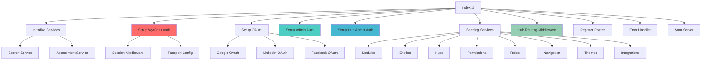
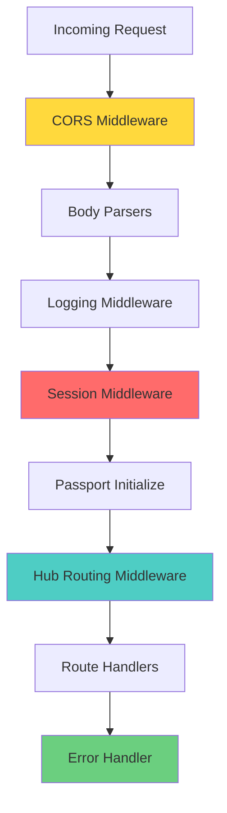

# Backend Architecture

:::danger PRODUCTION BACKEND STANDARDS
All backend code MUST implement:
- ✅ **Input Validation** - Validate ALL inputs with Zod schemas before processing
- 🔒 **Error Handling** - Wrap all async operations in try-catch blocks
- 📊 **Logging** - Use structured logging (never console.log in production)
- ⚠️ **Performance** - Monitor response times, optimize slow endpoints (<200ms target)
- 🎯 **Security** - Rate limiting, CSRF protection, SQL injection prevention
- 🔍 **Scalability** - Design for horizontal scaling (stateless where possible)

See [Production Standards](/en/production-standards/) for complete requirements.
:::

## Overview

WytNet's backend is built with **Express.js** and follows a **layered architecture** pattern that separates concerns into middleware, routes, services, and storage layers. The architecture emphasizes:

- **Type Safety**: Full TypeScript with Drizzle ORM
- **Security**: Multi-layer authentication and authorization
- **Scalability**: Service-based architecture with clear separation
- **Maintainability**: Storage interface pattern for database abstraction
- **Extensibility**: Plugin/module system for features

---

## Tech Stack

| Technology | Purpose | Version |
|------------|---------|---------|
| **Node.js** | Runtime | 20.x LTS |
| **Express.js** | Web Framework | Latest |
| **TypeScript** | Type Safety | 5.x |
| **Drizzle ORM** | Database ORM | Latest |
| **PostgreSQL** | Database | 15.x |
| **Passport.js** | Authentication | Latest |
| **express-session** | Session Management | Latest |
| **connect-pg-simple** | Session Store | Latest |
| **bcryptjs** | Password Hashing | Latest |
| **Zod** | Schema Validation | Latest |
| **Vite** | Development Server | Latest |

---

## Project Structure

```
server/
├── index.ts                     # Server entry point & initialization
├── vite.ts                      # Vite dev server setup
├── db.ts                        # Database connection & Drizzle client
├── storage.ts                   # Storage interface & implementation
│
├── routes/                      # Route handlers
│   ├── index.ts                # Route registration
│   ├── integrations.ts
│   ├── media.ts
│   ├── organizations.ts
│   ├── platform-hubs.ts
│   ├── platform-settings.ts
│   ├── roles.ts
│   ├── support.ts
│   ├── themes.ts
│   ├── trash.ts
│   └── wytai.ts
│
├── services/                    # Business logic services
│   ├── aiService.ts
│   ├── appInstallService.ts
│   ├── auditLogService.ts
│   ├── backupService.ts
│   ├── datasetSeedingService.ts
│   ├── entitySeedingService.ts
│   ├── integrationsSeedingService.ts
│   ├── moduleActivationService.ts
│   ├── moduleDependencyService.ts
│   ├── moduleSeedingService.ts
│   ├── msg91Service.ts
│   ├── navigationMenusSeedingService.ts
│   ├── permissionsSeedingService.ts
│   ├── platformHubsSeedingService.ts
│   ├── platformSettingsSeedingService.ts
│   ├── pointsService.ts
│   ├── profileCompletionService.ts
│   ├── razorpayService.ts
│   ├── searchIndexer.ts
│   ├── searchService.ts
│   └── socialAuth.ts
│
├── constants/                   # Constants & configuration
│   └── permissions.ts
│
├── helpers/                     # Helper functions
│   └── displayIdGenerator.ts
│
├── utils/                       # Utility functions
│   └── ...
│
├── scripts/                     # Database scripts & utilities
│   └── ...
│
├── wytpass-identity.ts          # WytPass unified auth
├── wytpass-auth.ts              # OAuth integrations
├── admin-auth.ts                # Engine admin auth
├── hub-admin-auth.ts            # Hub admin auth
└── hub-routing-middleware.ts    # Multi-domain routing

shared/
└── schema.ts                    # Shared database schema & types
```

---

## Server Initialization Flow



### Server Entry Point

```typescript
// server/index.ts
import express from "express";
import { createServer } from "http";
import cors from "cors";
import { registerRoutes } from "./routes";
import { setupVite, serveStatic, log } from "./vite";

const app = express();

// CORS configuration
app.use(cors({
  origin: process.env.NODE_ENV === 'production' 
    ? ['https://wytnet.com', 'https://www.wytnet.com']
    : true,
  credentials: true,
  methods: ['GET', 'POST', 'PUT', 'DELETE', 'OPTIONS'],
  allowedHeaders: ['Content-Type', 'Authorization', 'x-api-key'],
}));

app.use(express.json());
app.use(express.urlencoded({ extended: false }));

(async () => {
  // 1. Initialize services (search, assessment, etc.)
  await initializeServices();
  
  // 2. Setup WytPass Unified Identity (MUST be first - creates session middleware)
  const { setupWytPassAuth } = await import('./wytpass-identity');
  setupWytPassAuth(app);
  
  // 3. Setup OAuth (Google, LinkedIn, Facebook)
  const { setupWytPassAuth: setupOAuth } = await import('./wytpass-auth');
  setupOAuth(app);
  
  // 4. Setup Engine Admin Auth
  const { setupAdminAuth } = await import('./admin-auth');
  setupAdminAuth(app);
  
  // 5. Setup Hub Admin Auth
  const { setupHubAdminAuth } = await import('./hub-admin-auth');
  setupHubAdminAuth(app);
  
  // 6. Seed platform data (modules, permissions, roles, etc.)
  await seedPlatformData();
  
  // 7. Setup Hub Routing Middleware (multi-domain support)
  const { hubRoutingMiddleware } = await import('./hub-routing-middleware');
  app.use(hubRoutingMiddleware());
  
  // 8. Register API routes
  await registerRoutes(app);
  
  // 9. Error handler
  app.use(errorHandler);
  
  // 10. Setup Vite (dev) or static serving (prod)
  const server = createServer(app);
  if (app.get("env") === "development") {
    await setupVite(app, server);
  } else {
    serveStatic(app);
  }
  
  // 11. Start server
  const port = parseInt(process.env.PORT || '5000', 10);
  server.listen({ port, host: "0.0.0.0" }, () => {
    log(`serving on port ${port}`);
  });
})();
```

---

## Middleware Layers

WytNet uses multiple middleware layers for security, authentication, and request processing:



### 1. CORS Middleware

```typescript
app.use(cors({
  origin: process.env.NODE_ENV === 'production' 
    ? ['https://wytnet.com', 'https://www.wytnet.com', 'http://localhost:5000']
    : true,
  credentials: true, // Allow cookies
  methods: ['GET', 'POST', 'PUT', 'DELETE', 'OPTIONS'],
  allowedHeaders: ['Content-Type', 'Authorization', 'x-api-key'],
}));
```

### 2. Body Parsers

```typescript
app.use(express.json()); // Parse JSON bodies
app.use(express.urlencoded({ extended: false })); // Parse URL-encoded bodies
```

### 3. Logging Middleware

```typescript
app.use((req, res, next) => {
  const start = Date.now();
  
  res.on("finish", () => {
    const duration = Date.now() - start;
    if (req.path.startsWith("/api")) {
      log(`${req.method} ${req.path} ${res.statusCode} in ${duration}ms`);
    }
  });
  
  next();
});
```

### 4. Session Middleware

```typescript
import session from 'express-session';
import connectPgSimple from 'connect-pg-simple';
import { pool } from './db';

const PgSession = connectPgSimple(session);

app.use(session({
  store: new PgSession({
    pool,
    tableName: 'sessions',
    createTableIfMissing: false,
  }),
  secret: process.env.SESSION_SECRET!,
  resave: false,
  saveUninitialized: false,
  cookie: {
    httpOnly: true,
    secure: process.env.NODE_ENV === 'production',
    sameSite: 'strict',
    maxAge: 7 * 24 * 60 * 60 * 1000, // 7 days
  },
}));
```

### 5. Authentication Middleware

```typescript
import passport from 'passport';

app.use(passport.initialize());
app.use(passport.session());

// Serialize user to session
passport.serializeUser((user: any, done) => {
  done(null, user.id);
});

// Deserialize user from session
passport.deserializeUser(async (id: string, done) => {
  try {
    const user = await storage.getUser(id);
    done(null, user);
  } catch (error) {
    done(error, null);
  }
});
```

### 6. Hub Routing Middleware

```typescript
export function hubRoutingMiddleware() {
  return async (req: Request, res: Response, next: NextFunction) => {
    const hostname = req.hostname;
    
    // Method 1: Subdomain routing (e.g., acme.wytnet.com)
    if (hostname.endsWith('.wytnet.com')) {
      const subdomain = hostname.split('.')[0];
      const tenant = await getTenantBySubdomain(subdomain);
      if (tenant) {
        req.tenant = tenant;
        return next();
      }
    }
    
    // Method 2: Custom domain (e.g., acme.com)
    const tenantByDomain = await getTenantByDomain(hostname);
    if (tenantByDomain) {
      req.tenant = tenantByDomain;
      return next();
    }
    
    // Method 3: Path-based routing (e.g., /t/acme/*)
    const pathMatch = req.path.match(/^\/t\/([^\/]+)/);
    if (pathMatch) {
      const slug = pathMatch[1];
      const tenant = await getTenantBySlug(slug);
      if (tenant) {
        req.tenant = tenant;
        return next();
      }
    }
    
    // No tenant context
    next();
  };
}
```

### 7. Error Handler

```typescript
app.use((err: any, req: Request, res: Response, next: NextFunction) => {
  const status = err.status || err.statusCode || 500;
  const message = err.message || "Internal Server Error";
  
  // Log error
  console.error('Error:', err);
  
  if (!res.headersSent) {
    res.status(status).json({ 
      error: message,
      ...(process.env.NODE_ENV === 'development' && { stack: err.stack })
    });
  }
});
```

---

## Route Organization

### Route Registration

```typescript
// server/routes/index.ts
import express, { type Express } from "express";
import { db } from "../db";
import { DatabaseStorage } from "../storage";

export async function registerRoutes(app: Express) {
  const storage = new DatabaseStorage();
  
  // Health check
  app.get('/api/health', (req, res) => {
    res.json({ status: 'ok', timestamp: new Date().toISOString() });
  });
  
  // Authentication routes (handled by wytpass-identity.ts)
  // /api/auth/login
  // /api/auth/register
  // /api/auth/logout
  // /api/auth/user
  
  // User management
  app.get('/api/users', requireAuth(), requirePermission('users', 'view'), async (req, res) => {
    const users = await storage.getUsers();
    res.json(users);
  });
  
  app.post('/api/users', requireAuth(), requirePermission('users', 'create'), async (req, res) => {
    const user = await storage.createUser(req.body);
    res.json(user);
  });
  
  // Tenant/Organization management
  app.get('/api/tenants', requireAuth(), requirePermission('organizations', 'view'), async (req, res) => {
    const tenants = await storage.getTenants();
    res.json(tenants);
  });
  
  // App management
  app.get('/api/apps', requireAuth(), requirePermission('apps', 'view'), async (req, res) => {
    const apps = await storage.getAppsByTenant(req.tenant?.id);
    res.json(apps);
  });
  
  app.post('/api/apps', requireAuth(), requirePermission('apps', 'create'), async (req, res) => {
    const app = await storage.createApp(req.body);
    res.json(app);
  });
  
  // Hub management
  app.get('/api/hubs', requireAuth(), requirePermission('hubs', 'view'), async (req, res) => {
    const hubs = await storage.getAllHubs();
    res.json(hubs);
  });
  
  // Module routes
  const moduleRoutes = await import('./modules');
  app.use('/api/modules', moduleRoutes.default);
  
  // Integration routes
  const integrationRoutes = await import('./integrations');
  app.use('/api/integrations', integrationRoutes.default);
  
  // Trash/soft delete routes
  const trashRoutes = await import('./trash');
  app.use('/api/trash', trashRoutes.default);
  
  // ... more routes
}
```

### Protected Route Pattern

```typescript
import { requireAuth } from '../middleware/auth';
import { requirePermission } from '../middleware/permissions';

// Authentication required
app.get('/api/protected', 
  requireAuth(), 
  (req, res) => {
    res.json({ message: 'Authenticated', user: req.user });
  }
);

// Permission required
app.get('/api/admin/users',
  requireAuth(),
  requirePermission('users', 'view'),
  async (req, res) => {
    const users = await storage.getUsers();
    res.json(users);
  }
);

// Multiple permissions
app.delete('/api/admin/users/:id',
  requireAuth(),
  requirePermission('users', 'delete'),
  async (req, res) => {
    await storage.deleteUser(req.params.id);
    res.json({ success: true });
  }
);
```

---

## Storage Interface Pattern

WytNet uses a **storage interface pattern** to abstract database operations and enable easy testing/swapping of storage backends.

### Storage Interface

```typescript
// server/storage.ts
export interface IStorage {
  // User operations
  getUser(id: string): Promise<User | undefined>;
  getUserByEmail(email: string): Promise<User | undefined>;
  upsertUser(user: UpsertUser): Promise<User>;
  
  // Trash management
  getDeletedUsers(): Promise<User[]>;
  softDeleteUser(id: string, deletedBy: string, reason?: string): Promise<User | undefined>;
  restoreUser(id: string, restoredBy: string): Promise<User | undefined>;
  permanentlyDeleteUser(id: string, deletedBy: string): Promise<boolean>;
  
  // Tenant operations
  getTenant(id: string): Promise<Tenant | undefined>;
  getTenantBySlug(slug: string): Promise<Tenant | undefined>;
  createTenant(data: any): Promise<Tenant>;
  
  // App operations
  getAppsByTenant(tenantId?: string): Promise<App[]>;
  getApp(id: string): Promise<App | undefined>;
  createApp(data: InsertApp): Promise<App>;
  updateApp(id: string, data: any): Promise<App | undefined>;
  deleteApp(id: string): Promise<boolean>;
  
  // Hub operations
  getAllHubs(): Promise<Hub[]>;
  getHub(id: string): Promise<Hub | undefined>;
  createHub(data: InsertHub): Promise<Hub>;
  
  // Roles & Permissions
  getRoles(scope?: "engine" | "hub" | "app"): Promise<Role[]>;
  getPermissions(scope?: "engine" | "hub" | "app"): Promise<Permission[]>;
  getUserRoles(userId: string): Promise<Role[]>;
  assignRoleToUser(userId: string, roleId: string): Promise<void>;
  
  // ... more operations
}
```

### Storage Implementation

```typescript
export class DatabaseStorage implements IStorage {
  async getUser(id: string): Promise<User | undefined> {
    const [user] = await db
      .select()
      .from(users)
      .where(
        and(
          eq(users.id, id),
          isNull(users.deletedAt) // Exclude soft-deleted
        )
      );
    return user;
  }
  
  async getUserByEmail(email: string): Promise<User | undefined> {
    const [user] = await db
      .select()
      .from(users)
      .where(
        and(
          eq(users.email, email),
          isNull(users.deletedAt)
        )
      );
    return user;
  }
  
  async upsertUser(userData: UpsertUser): Promise<User> {
    // Check if user exists
    const [existingUser] = await db
      .select()
      .from(users)
      .where(eq(users.id, userData.id!));
    
    if (existingUser) {
      // Update existing user
      const [user] = await db
        .update(users)
        .set({ ...userData, updatedAt: new Date() })
        .where(eq(users.id, userData.id!))
        .returning();
      return user;
    }
    
    // Create new user with tenant
    const [user] = await db
      .insert(users)
      .values(userData)
      .returning();
    
    return user;
  }
  
  async softDeleteUser(
    id: string,
    deletedBy: string,
    reason?: string
  ): Promise<User | undefined> {
    const [user] = await db
      .update(users)
      .set({
        deletedAt: new Date(),
        deletedBy,
        deleteReason: reason,
      })
      .where(eq(users.id, id))
      .returning();
    
    return user;
  }
  
  // ... more methods
}
```

### Usage in Routes

```typescript
import { DatabaseStorage } from './storage';

const storage = new DatabaseStorage();

app.get('/api/users/:id', requireAuth(), async (req, res) => {
  const user = await storage.getUser(req.params.id);
  
  if (!user) {
    return res.status(404).json({ error: 'User not found' });
  }
  
  res.json(user);
});
```

---

## Business Logic Services

Complex business logic is extracted into **service classes** for reusability and testability.

### Service Example: Profile Completion

```typescript
// server/services/profileCompletionService.ts
export class ProfileCompletionService {
  async calculateProfileCompletion(userId: string): Promise<number> {
    // Get user profile
    const profile = await this.getUserProfile(userId);
    
    // Get field weights from admin configuration
    const weights = await this.getFieldWeights();
    
    // Calculate completion percentage
    let totalWeight = 0;
    let completedWeight = 0;
    
    for (const weight of weights) {
      totalWeight += weight.weightPercentage;
      
      const fieldValue = profile[weight.fieldName];
      if (fieldValue && fieldValue !== '') {
        completedWeight += weight.weightPercentage;
      }
    }
    
    const percentage = totalWeight > 0 
      ? Math.round((completedWeight / totalWeight) * 100)
      : 0;
    
    // Update profile
    await this.updateProfileCompletion(userId, percentage);
    
    return percentage;
  }
  
  private async getUserProfile(userId: string) {
    const [profile] = await db
      .select()
      .from(userProfiles)
      .where(eq(userProfiles.userId, userId));
    return profile;
  }
  
  private async getFieldWeights() {
    return await db
      .select()
      .from(profileFieldWeights)
      .orderBy(profileFieldWeights.fieldName);
  }
  
  private async updateProfileCompletion(userId: string, percentage: number) {
    await db
      .update(userProfiles)
      .set({ profileCompletionPercentage: percentage })
      .where(eq(userProfiles.userId, userId));
  }
}

// Usage in routes
const profileService = new ProfileCompletionService();

app.post('/api/profile', requireAuth(), async (req, res) => {
  await storage.updateUserProfile(req.user.id, req.body);
  
  const completion = await profileService.calculateProfileCompletion(req.user.id);
  
  res.json({ 
    success: true,
    profileCompletion: completion 
  });
});
```

### Service Example: Module Activation

```typescript
// server/services/moduleActivationService.ts
export class ModuleActivationService {
  async activateModule(
    moduleId: string,
    context: 'platform' | 'hub' | 'app',
    contextId?: string,
    activatedBy?: string
  ) {
    // Get module
    const module = await this.getModule(moduleId);
    
    if (!module) {
      throw new Error('Module not found');
    }
    
    // Check if module supports this context
    if (!module.contexts.includes(context)) {
      throw new Error(`Module does not support ${context} context`);
    }
    
    // Check dependencies
    await this.checkDependencies(module, context, contextId);
    
    // Activate module
    if (context === 'platform') {
      return await this.activatePlatformModule(moduleId, activatedBy);
    } else if (context === 'hub') {
      return await this.activateHubModule(moduleId, contextId!, activatedBy);
    } else {
      return await this.activateAppModule(moduleId, contextId!, activatedBy);
    }
  }
  
  private async checkDependencies(
    module: PlatformModule,
    context: string,
    contextId?: string
  ) {
    if (!module.dependencies || module.dependencies.length === 0) {
      return;
    }
    
    for (const depId of module.dependencies) {
      const isActivated = await this.isDependencyActivated(depId, context, contextId);
      
      if (!isActivated) {
        throw new Error(`Missing dependency: ${depId}`);
      }
    }
  }
  
  // ... more methods
}
```

---

## Authentication & Authorization

### WytPass Unified Identity

```typescript
// server/wytpass-identity.ts
export function setupWytPassAuth(app: Express) {
  // Session middleware (MUST be first)
  app.use(session({
    // ... session config
  }));
  
  app.use(passport.initialize());
  app.use(passport.session());
  
  // Login with email/password
  app.post('/api/auth/login', passport.authenticate('local'), (req, res) => {
    res.json({ success: true, user: req.user });
  });
  
  // Login with email OTP
  app.post('/api/auth/send-otp', async (req, res) => {
    const { email } = req.body;
    const otp = generateOTP();
    
    // Store OTP in database with 5-minute expiry
    await storeOTP(email, otp);
    
    // Send OTP via MSG91
    await sendOTPEmail(email, otp);
    
    res.json({ success: true });
  });
  
  app.post('/api/auth/verify-otp', async (req, res) => {
    const { email, otp } = req.body;
    
    const isValid = await verifyOTP(email, otp);
    
    if (!isValid) {
      return res.status(401).json({ error: 'Invalid or expired OTP' });
    }
    
    // Get or create user
    let user = await storage.getUserByEmail(email);
    if (!user) {
      user = await storage.createUser({ email });
    }
    
    // Login user
    req.login(user, (err) => {
      if (err) return res.status(500).json({ error: 'Login failed' });
      res.json({ success: true, user });
    });
  });
  
  // Get current user
  app.get('/api/auth/user', (req, res) => {
    if (!req.isAuthenticated()) {
      return res.status(401).json({ error: 'Not authenticated' });
    }
    res.json(req.user);
  });
  
  // Logout
  app.post('/api/auth/logout', (req, res) => {
    req.logout(() => {
      res.json({ success: true });
    });
  });
}
```

### OAuth Integration

```typescript
// server/wytpass-auth.ts
import passport from 'passport';
import { Strategy as GoogleStrategy } from 'passport-google-oauth20';

export function setupWytPassAuth(app: Express) {
  // Google OAuth
  passport.use(new GoogleStrategy({
    clientID: process.env.GOOGLE_CLIENT_ID!,
    clientSecret: process.env.GOOGLE_CLIENT_SECRET!,
    callbackURL: '/api/auth/google/callback',
  }, async (accessToken, refreshToken, profile, done) => {
    try {
      // Get or create user from Google profile
      const user = await storage.upsertUser({
        id: profile.id,
        email: profile.emails?.[0]?.value,
        name: profile.displayName,
        profileImageUrl: profile.photos?.[0]?.value,
        authMethods: ['google'],
        socialProviders: ['google'],
        socialIds: { google: profile.id },
      });
      
      done(null, user);
    } catch (error) {
      done(error);
    }
  }));
  
  // Google OAuth routes
  app.get('/api/auth/google',
    passport.authenticate('google', { 
      scope: ['profile', 'email'] 
    })
  );
  
  app.get('/api/auth/google/callback',
    passport.authenticate('google', { failureRedirect: '/login' }),
    (req, res) => {
      res.redirect('/dashboard');
    }
  );
}
```

### Permission Middleware

```typescript
// server/middleware/permissions.ts
export function requirePermission(resource: string, action: string) {
  return async (req: Request, res: Response, next: NextFunction) => {
    const user = req.user;
    
    if (!user) {
      return res.status(401).json({ error: 'Unauthorized' });
    }
    
    // Super admins bypass all checks
    if (user.isSuperAdmin) {
      return next();
    }
    
    // Get user permissions
    const hasPermission = await checkUserPermission(user.id, resource, action);
    
    if (!hasPermission) {
      return res.status(403).json({ 
        error: 'Forbidden',
        message: `Missing permission: ${resource}:${action}` 
      });
    }
    
    next();
  };
}

async function checkUserPermission(
  userId: string,
  resource: string,
  action: string
): Promise<boolean> {
  const permissions = await db
    .select({ permission: permissions })
    .from(userRoles)
    .innerJoin(roles, eq(userRoles.roleId, roles.id))
    .innerJoin(rolePermissions, eq(roles.id, rolePermissions.roleId))
    .innerJoin(permissions, eq(rolePermissions.permissionId, permissions.id))
    .where(
      and(
        eq(userRoles.userId, userId),
        eq(permissions.resource, resource),
        eq(permissions.action, action),
        eq(permissions.isActive, true)
      )
    );
  
  return permissions.length > 0;
}
```

---

## Request Validation with Zod

```typescript
import { z } from 'zod';
import { createInsertSchema } from 'drizzle-zod';
import { users } from '@shared/schema';

// Base schema from Drizzle
const insertUserSchema = createInsertSchema(users);

// Extend with custom validation
const createUserSchema = insertUserSchema
  .omit({ id: true, createdAt: true, updatedAt: true })
  .extend({
    email: z.string().email('Invalid email address'),
    password: z.string().min(8, 'Password must be at least 8 characters'),
  });

// Validation middleware
function validateBody(schema: z.ZodSchema) {
  return (req: Request, res: Response, next: NextFunction) => {
    try {
      req.body = schema.parse(req.body);
      next();
    } catch (error) {
      if (error instanceof z.ZodError) {
        return res.status(400).json({ 
          error: 'Validation failed',
          details: error.errors 
        });
      }
      next(error);
    }
  };
}

// Usage in routes
app.post('/api/users',
  requireAuth(),
  requirePermission('users', 'create'),
  validateBody(createUserSchema),
  async (req, res) => {
    const user = await storage.createUser(req.body);
    res.json(user);
  }
);
```

---

## Error Handling

### Custom Error Classes

```typescript
// server/errors.ts
export class AppError extends Error {
  constructor(
    public statusCode: number,
    message: string,
    public isOperational = true
  ) {
    super(message);
    Object.setPrototypeOf(this, AppError.prototype);
  }
}

export class NotFoundError extends AppError {
  constructor(resource: string, id?: string) {
    super(404, id 
      ? `${resource} with id ${id} not found`
      : `${resource} not found`
    );
  }
}

export class UnauthorizedError extends AppError {
  constructor(message = 'Unauthorized') {
    super(401, message);
  }
}

export class ForbiddenError extends AppError {
  constructor(message = 'Forbidden') {
    super(403, message);
  }
}

export class ValidationError extends AppError {
  constructor(message: string) {
    super(400, message);
  }
}
```

### Error Handler Middleware

```typescript
app.use((err: Error, req: Request, res: Response, next: NextFunction) => {
  // Log error
  console.error('Error:', {
    message: err.message,
    stack: err.stack,
    path: req.path,
    method: req.method,
  });
  
  // Handle known errors
  if (err instanceof AppError) {
    return res.status(err.statusCode).json({
      error: err.message,
      ...(process.env.NODE_ENV === 'development' && { stack: err.stack }),
    });
  }
  
  // Handle Zod validation errors
  if (err instanceof z.ZodError) {
    return res.status(400).json({
      error: 'Validation failed',
      details: err.errors,
    });
  }
  
  // Handle unknown errors
  res.status(500).json({
    error: 'Internal Server Error',
    ...(process.env.NODE_ENV === 'development' && { 
      message: err.message,
      stack: err.stack 
    }),
  });
});
```

### Usage in Routes

```typescript
app.get('/api/users/:id', requireAuth(), async (req, res, next) => {
  try {
    const user = await storage.getUser(req.params.id);
    
    if (!user) {
      throw new NotFoundError('User', req.params.id);
    }
    
    res.json(user);
  } catch (error) {
    next(error); // Pass to error handler
  }
});
```

---

## Security Measures

### 1. HTTPS & Secure Cookies

```typescript
// Production only
if (process.env.NODE_ENV === 'production') {
  app.set('trust proxy', 1); // Trust first proxy
  
  // Force HTTPS
  app.use((req, res, next) => {
    if (req.header('x-forwarded-proto') !== 'https') {
      return res.redirect(`https://${req.header('host')}${req.url}`);
    }
    next();
  });
}

// Secure session cookies
app.use(session({
  cookie: {
    httpOnly: true, // Prevent XSS
    secure: process.env.NODE_ENV === 'production', // HTTPS only
    sameSite: 'strict', // Prevent CSRF
    maxAge: 7 * 24 * 60 * 60 * 1000, // 7 days
  },
}));
```

### 2. Rate Limiting

```typescript
import rateLimit from 'express-rate-limit';

const loginLimiter = rateLimit({
  windowMs: 15 * 60 * 1000, // 15 minutes
  max: 5, // 5 attempts
  message: 'Too many login attempts, please try again later',
});

app.post('/api/auth/login', loginLimiter, async (req, res) => {
  // Login logic
});
```

### 3. Helmet Security Headers

```typescript
import helmet from 'helmet';

app.use(helmet({
  contentSecurityPolicy: {
    directives: {
      defaultSrc: ["'self'"],
      scriptSrc: ["'self'", "'unsafe-inline'"],
      styleSrc: ["'self'", "'unsafe-inline'"],
      imgSrc: ["'self'", "data:", "https:"],
    },
  },
  hsts: {
    maxAge: 31536000,
    includeSubDomains: true,
    preload: true,
  },
}));
```

### 4. SQL Injection Prevention

```typescript
// ✅ Good: Parameterized queries with Drizzle
const user = await db
  .select()
  .from(users)
  .where(eq(users.email, userEmail)); // Safe

// ❌ Bad: String interpolation (vulnerable to SQL injection)
const user = await db.execute(
  sql`SELECT * FROM users WHERE email = '${userEmail}'` // NEVER DO THIS
);
```

---

## Best Practices

### ✅ DO

1. **Use TypeScript** for all server code
2. **Validate all inputs** with Zod schemas
3. **Use storage interface** instead of direct DB access
4. **Implement permission checks** on all admin routes
5. **Log all errors** with context
6. **Use transactions** for multi-step operations
7. **Return appropriate HTTP status codes**
8. **Sanitize error messages** in production

### ❌ DON'T

1. **Don't expose stack traces** in production
2. **Don't trust client input** - always validate
3. **Don't skip authentication** on protected routes
4. **Don't log sensitive data** (passwords, tokens)
5. **Don't use string interpolation** in SQL queries
6. **Don't hardcode credentials** - use environment variables
7. **Don't return detailed errors** to clients
8. **Don't skip CORS configuration** in production

---

## Conclusion

WytNet's backend architecture provides:

- **Type Safety**: Full TypeScript with Drizzle ORM
- **Security**: Multi-layer auth, permission checks, rate limiting
- **Scalability**: Service-based architecture with clear separation
- **Maintainability**: Storage interface pattern for testability
- **Extensibility**: Plugin/module system for new features
- **Robustness**: Comprehensive error handling and logging

This architecture ensures a secure, scalable, and maintainable backend for the WytNet platform.
