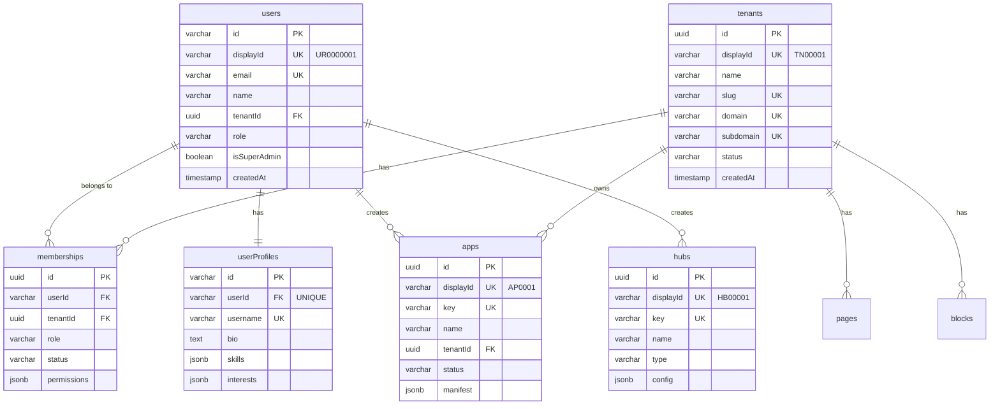
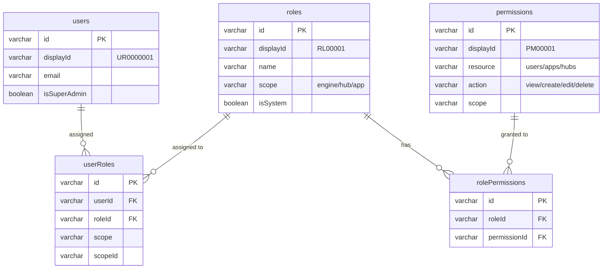

# Database Schema

## Overview

WytNet uses **PostgreSQL** as its primary database with **Drizzle ORM** for type-safe database operations. The schema is designed to support multi-tenancy, soft deletes, comprehensive audit trails, and a global Display ID system for human-readable entity references.

## Core Design Principles

1. **Multi-Tenancy**: Every tenant-scoped table includes a `tenant_id` foreign key
2. **Soft Deletes**: Critical tables support soft deletion with `deleted_at`, `deleted_by`, and `delete_reason` columns
3. **Display IDs**: Human-readable, sequential IDs (e.g., `UR0000001`, `HB00001`) for all major entities
4. **Timestamps**: All tables include `created_at` and `updated_at` for audit trails
5. **JSONB Flexibility**: Settings, metadata, and dynamic configurations stored as JSONB
6. **Type Safety**: Drizzle ORM provides full TypeScript type inference

---

## Global Display ID System

WytNet uses a unified display ID system for human-readable entity references across the platform:

| Prefix | Entity Type | Format | Example | Sequence |
|--------|-------------|---------|---------|----------|
| `UR` | User | UR + 7 digits | `UR0000001` | `ur_seq` |
| `TN` | Tenant/Organization | TN + 5 digits | `TN00001` | `tn_seq` |
| `RL` | Role | RL + 5 digits | `RL00001` | `rl_seq` |
| `PM` | Permission | PM + 5 digits | `PM00001` | `pm_seq` |
| `HB` | Hub | HB + 5 digits | `HB00001` | `hb_seq` |
| `AP` | App | AP + 4 digits | `AP0001` | `ap_seq` |
| `MD` | Module | MD + 4 digits | `MD0001` | `md_seq` |
| `OR` | Order | OR + 8 digits | `OR00000001` | `or_seq` |
| `MOD` | Moderation Item | MOD + 6 digits | `MOD000001` | `mod_seq` |

### Display ID Generation

Display IDs are generated using PostgreSQL sequences:

```sql
-- Create sequence
CREATE SEQUENCE IF NOT EXISTS ur_seq START 1;

-- Generate next ID
SELECT 'UR' || LPAD(nextval('ur_seq')::text, 7, '0');
-- Result: UR0000001
```

**Benefits**:
- Human-readable and memorable
- Easy to reference in support tickets
- Prevents UUID exposure
- Sequential for easy tracking
- Unique across the platform

---

## Core Tables

### 1. Users

**Primary user table** supporting multiple authentication methods (Google OAuth, email/password, OTP).

```typescript
users {
  id: varchar (PK)                    // UUID from auth provider
  displayId: varchar UNIQUE           // UR0000001
  email: varchar UNIQUE
  name: varchar
  firstName: varchar
  lastName: varchar
  whatsappNumber: varchar UNIQUE
  profileImageUrl: varchar
  passwordHash: varchar               // bcrypt hash for email/password auth
  tenantId: uuid FK → tenants         // Primary organization
  
  // Role & Permissions
  role: userRoleEnum                  // super_admin, admin, manager, user, guest
  isSuperAdmin: boolean
  isVerified: boolean
  permissions: jsonb                  // Additional user-specific permissions
  
  // Social Auth
  socialProviders: jsonb              // ['google', 'linkedin', 'facebook']
  socialIds: jsonb                    // {google: 'id123', linkedin: 'id456'}
  authMethods: jsonb                  // ['password', 'google', 'email_otp']
  
  // Referral System
  referralCode: varchar UNIQUE        // User's referral code
  referredBy: varchar                 // Who referred this user
  
  // Profile Tracking
  profileComplete: boolean
  lastLoginAt: timestamp
  
  // Soft Delete
  deletedAt: timestamp
  deletedBy: varchar
  deleteReason: text
  
  // Timestamps
  createdAt: timestamp
  updatedAt: timestamp
}
```

**Indexes**:
- `idx_users_display_id` on `displayId`
- `idx_users_deleted_at` on `deletedAt`
- Unique constraint on `email`
- Unique constraint on `whatsappNumber`
- Unique constraint on `referralCode`

**Relationships**:
- `users.tenantId` → `tenants.id` (many-to-one)
- `users` → `memberships` (one-to-many)
- `users` → `userProfiles` (one-to-one)

---

### 2. Tenants (Organizations)

**Multi-tenancy foundation** - each tenant is an isolated organization or workspace.

```typescript
tenants {
  id: uuid (PK)                       // Auto-generated UUID
  displayId: varchar UNIQUE           // TN00001
  name: varchar NOT NULL              // Organization name
  slug: varchar UNIQUE NOT NULL       // URL-friendly identifier
  domain: varchar UNIQUE              // Custom domain (e.g., acme.com)
  subdomain: varchar UNIQUE           // Subdomain (e.g., acme.wytnet.com)
  status: varchar                     // active, suspended, inactive
  settings: jsonb                     // Tenant-specific configuration
  
  // Soft Delete
  deletedAt: timestamp
  deletedBy: varchar
  deleteReason: text
  
  // Timestamps
  createdAt: timestamp
  updatedAt: timestamp
}
```

**Indexes**:
- `idx_tenants_display_id` on `displayId`
- `idx_tenants_deleted_at` on `deletedAt`
- Unique on `slug`, `domain`, `subdomain`

**Relationships**:
- `tenants` → `users` (one-to-many)
- `tenants` → `memberships` (one-to-many)
- `tenants` → `apps`, `pages`, `blocks` (one-to-many)

---

### 3. Memberships

**Bridges users and tenants** with role-based access control.

```typescript
memberships {
  id: uuid
  userId: varchar FK → users          // User member
  tenantId: uuid FK → tenants         // Organization
  role: varchar                       // owner, admin, member, viewer
  status: varchar                     // active, suspended, pending
  permissions: jsonb                  // Role-specific permissions override
  
  createdAt: timestamp
  updatedAt: timestamp
  
  PRIMARY KEY (userId, tenantId)      // Composite primary key
}
```

**Purpose**:
- Users can belong to multiple organizations
- Each membership has a specific role and permissions
- Tenant-level access control

---

### 4. User Profiles

**Extended user information** beyond basic authentication data.

```typescript
userProfiles {
  id: varchar (PK)
  userId: varchar FK → users UNIQUE
  username: varchar UNIQUE
  
  // Personal Information
  profilePhoto: varchar
  nickName: varchar
  bio: text
  mobileNumber: varchar
  gender: varchar
  dateOfBirth: timestamp
  maritalStatus: varchar
  motherTongue: varchar               // Default: Tamil
  homeLocation: varchar
  livingIn: varchar
  languagesKnown: jsonb               // [{code: 'en', name: 'English', speak: true, write: true}]
  
  // Professional
  location: varchar
  website: varchar
  company: varchar
  jobTitle: varchar
  skills: jsonb                       // ["JavaScript", "React", "Node.js"]
  interests: jsonb                    // ["AI", "SaaS", "Web3"]
  socialLinks: jsonb                  // {linkedin: 'url', github: 'url'}
  phone: varchar
  address: text
  city: varchar
  state: varchar
  country: varchar                    // Default: IN
  zipCode: varchar
  
  // Privacy Settings
  privacySettings: jsonb              // {email: 'private', mobileNumber: 'public'}
  
  // Profile Completion
  profileCompletionPercentage: integer
  
  createdAt: timestamp
  updatedAt: timestamp
}
```

**Purpose**:
- Separation of concerns (auth vs. profile data)
- Privacy controls per field
- Profile completion tracking
- Rich user data for social features

---

### 5. Roles & Permissions (RBAC)

**Role-Based Access Control** tables for fine-grained permissions.

#### Roles

```typescript
roles {
  id: varchar (PK)                    // UUID
  displayId: varchar UNIQUE           // RL00001
  name: varchar NOT NULL              // Super Admin, Hub Manager, etc.
  description: text
  scope: varchar                      // engine, hub, app, global
  isSystem: boolean                   // System role (cannot be deleted)
  isActive: boolean
  
  createdBy: varchar FK → users
  createdAt: timestamp
  updatedAt: timestamp
}
```

#### Permissions

```typescript
permissions {
  id: varchar (PK)                    // UUID
  displayId: varchar UNIQUE           // PM00001
  resource: varchar NOT NULL          // users, apps, hubs, modules, etc.
  action: varchar NOT NULL            // view, create, edit, delete
  scope: varchar                      // engine, hub, app, global
  description: text
  isActive: boolean
  
  createdAt: timestamp
  updatedAt: timestamp
  
  UNIQUE (resource, action, scope)
}
```

#### Role Permissions (Junction Table)

```typescript
rolePermissions {
  id: varchar (PK)
  roleId: varchar FK → roles
  permissionId: varchar FK → permissions
  
  createdAt: timestamp
}
```

#### User Roles (Junction Table)

```typescript
userRoles {
  id: varchar (PK)
  userId: varchar FK → users
  roleId: varchar FK → roles
  scope: varchar                      // engine, hub, app
  scopeId: varchar                    // Hub ID, App ID (if scope-specific)
  
  assignedBy: varchar FK → users
  assignedAt: timestamp
  expiresAt: timestamp                // Optional role expiration
  
  createdAt: timestamp
}
```

**RBAC System Features**:
- 64 permissions (16 resources × 4 CRUD actions)
- 8 default engine roles
- Multi-scope support (engine, hub, app)
- Temporary role assignments with expiration
- Permission inheritance through roles

---

### 6. Apps

**Applications** that can be installed in hubs or used independently.

```typescript
apps {
  id: uuid (PK)
  displayId: varchar UNIQUE           // AP0001
  tenantId: uuid FK → tenants         // Optional tenant ownership
  key: varchar UNIQUE NOT NULL        // Unique identifier (e.g., 'wytwall')
  name: varchar NOT NULL
  description: text
  version: varchar NOT NULL
  manifest: jsonb NOT NULL            // App configuration
  icon: varchar                       // Icon URL
  categories: jsonb                   // ["social", "marketplace"]
  status: varchar                     // draft, published, archived
  isPublic: boolean
  pricing: jsonb                      // Pricing model
  
  // Route & Context
  route: varchar                      // App route/URL
  contexts: jsonb                     // ['hub', 'app'] - where it can run
  
  // Version Control
  versionHistory: jsonb               // [{version: '1.0.0', changes: '...', date: '...'}]
  changelog: text
  
  // Access Control
  restrictedTo: jsonb                 // ['engine-only', 'hub-only', 'specific-tenant']
  
  // Soft Delete
  deletedAt: timestamp
  deletedBy: varchar
  deleteReason: text
  
  createdBy: varchar FK → users
  createdAt: timestamp
  updatedAt: timestamp
}
```

**Indexes**:
- Unique on `key`
- Unique on `displayId`
- Index on `deletedAt`

---

### 7. Hubs

**Platform hubs** - independent portals built on the engine.

```typescript
hubs {
  id: uuid (PK)
  displayId: varchar UNIQUE           // HB00001
  key: varchar UNIQUE NOT NULL        // Unique identifier
  name: varchar NOT NULL
  description: text
  type: varchar NOT NULL              // marketplace, social, community, etc.
  config: jsonb NOT NULL              // Hub configuration
  aggregationRules: jsonb             // Cross-hub aggregation rules
  moderationSettings: jsonb           // Content moderation settings
  revenueModel: jsonb                 // Revenue/pricing model
  status: varchar                     // draft, active, suspended
  
  // Soft Delete
  deletedAt: timestamp
  deletedBy: varchar
  deleteReason: text
  
  createdBy: varchar FK → users
  createdAt: timestamp
  updatedAt: timestamp
}
```

**Examples**:
- WytNet.com Hub (social network)
- OwnerNET Hub (property management)
- MarketPlace Hub (e-commerce)

---

### 8. Platform Modules

**Context-aware plugins** that can be activated in different contexts (platform, hub, app, game).

```typescript
platformModules {
  id: varchar (PK)                    // 'razorpay-payment', 'calendar', 'wytpass-auth'
  displayId: varchar UNIQUE           // MD0001
  name: varchar NOT NULL
  description: text
  category: varchar                   // platform, payment, auth, ai, etc.
  type: varchar NOT NULL              // plugin type
  status: varchar                     // enabled, disabled, deprecated
  
  // Context Support
  contexts: jsonb NOT NULL            // ['platform', 'hub', 'app', 'game']
  
  // Dependencies
  dependencies: jsonb                 // ['payment-core', 'user-auth']
  
  // API Endpoints
  apiEndpoints: jsonb                 // [{method: 'POST', path: '/api/razorpay/...', auth: true}]
  
  // Module Settings
  settings: jsonb                     // {apiKeyRequired: true, webhookUrl: string}
  
  // Compatibility
  compatibilityMatrix: jsonb          // {minVersion: '1.0.0', conflicts: ['stripe-payment']}
  
  // Pricing
  pricing: varchar                    // free, paid, freemium
  price: decimal
  currency: varchar                   // INR, USD, EUR
  
  // UI Display
  icon: varchar
  color: varchar
  route: varchar
  
  // Version Control
  version: varchar
  versionHistory: jsonb
  changelog: text
  
  // Access Restrictions
  restrictedTo: jsonb                 // ['engine-only', 'hub-only']
  
  // Soft Delete
  deletedAt: timestamp
  deletedBy: varchar
  deleteReason: text
  
  tenantId: uuid FK → tenants
  createdBy: varchar FK → users
  createdAt: timestamp
  updatedAt: timestamp
}
```

---

### 9. CMS Tables

#### Pages

```typescript
pages {
  id: uuid (PK)
  tenantId: uuid FK → tenants
  title: varchar NOT NULL
  slug: varchar NOT NULL
  path: varchar NOT NULL              // Full URL path
  locale: varchar                     // en-IN, ta-IN, etc.
  content: jsonb NOT NULL             // Page content blocks
  status: varchar                     // draft, published, archived
  publishedAt: timestamp
  themeRef: varchar                   // Theme identifier
  
  // Soft Delete
  deletedAt: timestamp
  deletedBy: varchar
  deleteReason: text
  
  createdBy: varchar FK → users
  createdAt: timestamp
  updatedAt: timestamp
}
```

#### Blocks

```typescript
blocks {
  id: uuid (PK)
  tenantId: uuid FK → tenants
  type: varchar NOT NULL              // header, footer, hero, cta, etc.
  name: varchar NOT NULL
  content: jsonb NOT NULL             // Block content
  settings: jsonb                     // Block-specific settings
  isGlobal: boolean                   // Reusable across pages
  
  // Soft Delete
  deletedAt: timestamp
  deletedBy: varchar
  deleteReason: text
  
  createdBy: varchar FK → users
  createdAt: timestamp
  updatedAt: timestamp
}
```

---

### 10. Session Storage

**Express session storage** for authentication and session management.

```typescript
sessions {
  sid: varchar (PK)                   // Session ID (cookie value)
  sess: jsonb NOT NULL                // Session data
  expire: timestamp NOT NULL          // Session expiration
}
```

**Index**:
- `IDX_session_expire` on `expire` for cleanup

**Session Data Structure**:
```json
{
  "userId": "UR0000001",
  "email": "user@example.com",
  "role": "user",
  "contexts": ["user", "hub_admin", "super_admin"],
  "createdAt": "2025-01-20T10:00:00Z",
  "expiresAt": "2025-01-27T10:00:00Z"
}
```

---

## Entity Relationship Diagram

### Core Relationships



### RBAC Relationships



---

## Indexes & Performance Optimization

### Primary Indexes

All tables have:
- **Primary Key Index**: Automatically created on `id` column
- **Unique Indexes**: On unique constraints (email, displayId, slug, etc.)
- **Foreign Key Indexes**: On FK columns for JOIN performance

### Custom Indexes

```sql
-- Users
CREATE INDEX idx_users_display_id ON users(display_id);
CREATE INDEX idx_users_deleted_at ON users(deleted_at);

-- Tenants
CREATE INDEX idx_tenants_display_id ON tenants(display_id);
CREATE INDEX idx_tenants_deleted_at ON tenants(deleted_at);

-- Apps
CREATE INDEX idx_apps_deleted_at ON apps(deleted_at);

-- Hubs
CREATE INDEX idx_hubs_display_id ON hubs(display_id);
CREATE INDEX idx_hubs_deleted_at ON hubs(deleted_at);

-- Sessions
CREATE INDEX IDX_session_expire ON sessions(expire);

-- Module Activations
CREATE INDEX platform_module_context_idx ON platform_module_activations(module_id, context);
CREATE INDEX hub_module_idx ON hub_module_activations(hub_id, module_id);
CREATE INDEX app_module_idx ON app_module_activations(app_id, module_id);
```

### Query Optimization Strategies

1. **Soft Delete Queries**: Always filter by `deleted_at IS NULL`
2. **Tenant Isolation**: Always filter by `tenant_id` in multi-tenant queries
3. **Display ID Lookups**: Use indexed `display_id` for user-facing searches
4. **Session Cleanup**: Periodic cleanup of expired sessions using `expire` index
5. **JSONB Queries**: Use GIN indexes for JSONB columns with frequent searches

---

## Data Integrity Rules

### Referential Integrity

```sql
-- Cascade deletes for dependent data
hub_module_activations.hubId → hubs.id ON DELETE CASCADE
app_module_activations.appId → apps.id ON DELETE CASCADE

-- Restrict deletes for critical data
entities.entityTypeId → entityTypes.id ON DELETE RESTRICT
```

### Constraints

```typescript
// Unique Constraints
users: email, displayId, whatsappNumber, referralCode
tenants: slug, domain, subdomain, displayId
apps: key, displayId
hubs: key, displayId
roles: displayId, (name + scope)
permissions: (resource + action + scope), displayId

// Composite Primary Keys
memberships: (userId, tenantId)
rolePermissions: (roleId, permissionId)

// Check Constraints
users.role IN ('super_admin', 'admin', 'manager', 'user', 'guest')
tenants.status IN ('active', 'suspended', 'inactive')
apps.status IN ('draft', 'published', 'archived')
```

---

## Example Queries

### 1. Get User with Profile

```typescript
import { db } from "./db";
import { users, userProfiles } from "@shared/schema";
import { eq, and, isNull } from "drizzle-orm";

// Get user with profile (excluding soft-deleted)
const user = await db
  .select()
  .from(users)
  .leftJoin(userProfiles, eq(users.id, userProfiles.userId))
  .where(
    and(
      eq(users.id, userId),
      isNull(users.deletedAt)
    )
  );
```

### 2. Get User's Roles and Permissions

```typescript
import { userRoles, roles, rolePermissions, permissions } from "@shared/schema";

// Get all permissions for a user
const userPermissions = await db
  .select({
    permission: permissions,
    role: roles,
  })
  .from(userRoles)
  .innerJoin(roles, eq(userRoles.roleId, roles.id))
  .innerJoin(rolePermissions, eq(roles.id, rolePermissions.roleId))
  .innerJoin(permissions, eq(rolePermissions.permissionId, permissions.id))
  .where(eq(userRoles.userId, userId));
```

### 3. Get Tenant's Active Apps

```typescript
import { apps, appInstalls } from "@shared/schema";

// Get all active apps for a tenant
const tenantApps = await db
  .select({
    app: apps,
    install: appInstalls,
  })
  .from(appInstalls)
  .innerJoin(apps, eq(appInstalls.appId, apps.id))
  .where(
    and(
      eq(appInstalls.tenantId, tenantId),
      eq(appInstalls.status, 'active'),
      isNull(apps.deletedAt)
    )
  );
```

### 4. Get Hub with Activated Modules

```typescript
import { hubs, hubModuleActivations, platformModules } from "@shared/schema";

// Get hub with all active modules
const hubWithModules = await db
  .select({
    hub: hubs,
    module: platformModules,
    activation: hubModuleActivations,
  })
  .from(hubs)
  .leftJoin(hubModuleActivations, eq(hubs.id, hubModuleActivations.hubId))
  .leftJoin(platformModules, eq(hubModuleActivations.moduleId, platformModules.id))
  .where(
    and(
      eq(hubs.id, hubId),
      eq(hubModuleActivations.isActive, true),
      isNull(hubs.deletedAt),
      isNull(platformModules.deletedAt)
    )
  );
```

### 5. Soft Delete User

```typescript
// Soft delete user (mark as deleted)
await db
  .update(users)
  .set({
    deletedAt: new Date(),
    deletedBy: adminUserId,
    deleteReason: "User requested account deletion",
  })
  .where(eq(users.id, userId));
```

### 6. Get Deleted Items (Trash)

```typescript
// Get all soft-deleted users
const deletedUsers = await db
  .select()
  .from(users)
  .where(isNotNull(users.deletedAt))
  .orderBy(desc(users.deletedAt));
```

### 7. Restore Soft-Deleted Item

```typescript
// Restore user from trash
await db
  .update(users)
  .set({
    deletedAt: null,
    deletedBy: null,
    deleteReason: null,
  })
  .where(eq(users.id, userId));
```

---

## Migration Strategy

WytNet uses **Drizzle Kit** for database migrations with a push-based workflow:

```bash
# Push schema changes to database
npm run db:push

# Force push (for data-loss scenarios)
npm run db:push --force
```

**Important Notes**:
- Never manually write SQL migrations
- Use Drizzle schema definitions in `shared/schema.ts`
- Test migrations in development before production
- Always backup database before force pushes
- Use soft deletes to prevent accidental data loss

---

## Type Safety with Drizzle

Every table has TypeScript types auto-generated:

```typescript
// Select types (reading from database)
export type User = typeof users.$inferSelect;
export type Tenant = typeof tenants.$inferSelect;
export type App = typeof apps.$inferSelect;

// Insert types (creating new records)
export type InsertUser = z.infer<typeof insertUserSchema>;
export type InsertTenant = z.infer<typeof insertTenantSchema>;
export type InsertApp = z.infer<typeof insertAppSchema>;

// Usage
const user: User = await storage.getUser(userId);
const newUser: InsertUser = {
  id: "user-123",
  email: "user@example.com",
  name: "John Doe",
  // TypeScript ensures all required fields are present
};
```

---

## Best Practices

### 1. Always Use Type-Safe Queries

```typescript
// ✅ Good: Type-safe with Drizzle
const users = await db.select().from(users).where(eq(users.email, email));

// ❌ Bad: Raw SQL (loses type safety)
const users = await db.execute(sql`SELECT * FROM users WHERE email = ${email}`);
```

### 2. Filter Soft-Deleted Records

```typescript
// ✅ Good: Exclude deleted
const user = await db
  .select()
  .from(users)
  .where(and(
    eq(users.id, userId),
    isNull(users.deletedAt)
  ));

// ❌ Bad: May return deleted records
const user = await db.select().from(users).where(eq(users.id, userId));
```

### 3. Use Transactions for Multi-Step Operations

```typescript
await db.transaction(async (tx) => {
  // Create user
  const [user] = await tx.insert(users).values(userData).returning();
  
  // Create profile
  await tx.insert(userProfiles).values({
    userId: user.id,
    ...profileData,
  });
  
  // If any step fails, entire transaction rolls back
});
```

### 4. Leverage Display IDs for User-Facing Features

```typescript
// ✅ Good: Use display ID in UI
const userDisplayId = "UR0000001"; // Show this to users

// ❌ Bad: Show internal UUID
const userId = "550e8400-e29b-41d4-a716-446655440000"; // Never show this
```

---

## Conclusion

The WytNet database schema is designed for:
- **Scalability**: Multi-tenancy with proper isolation
- **Flexibility**: JSONB columns for dynamic configuration
- **Safety**: Soft deletes, audit trails, type safety
- **Usability**: Human-readable Display IDs
- **Performance**: Strategic indexes and query optimization

The schema evolves with the platform while maintaining backward compatibility and data integrity.
