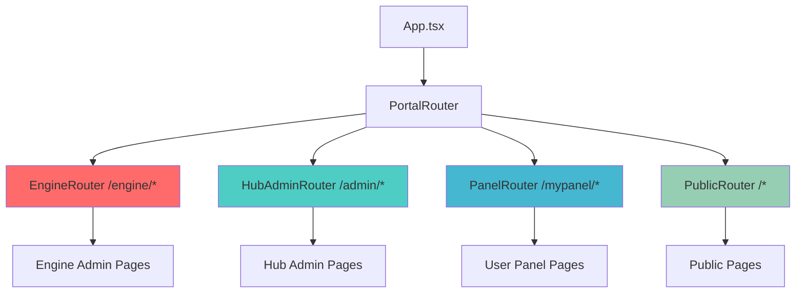

# Frontend Architecture

:::danger PRODUCTION FRONTEND STANDARDS
All frontend code MUST implement:
- ✅ **Input Validation** - Validate user input client-side AND server-side
- 🔒 **XSS Prevention** - Sanitize all user-generated content before rendering
- 📊 **Error Boundaries** - Catch and handle React errors gracefully
- ⚠️ **Performance** - Code splitting, lazy loading, optimize bundle size
- 🎯 **Accessibility** - WCAG 2.1 AA compliance, keyboard navigation, screen readers
- 🔍 **State Management** - Proper cleanup, prevent memory leaks

See [Production Standards](/en/production-standards/) for complete requirements.
:::

## Overview

WytNet's frontend is built with modern React patterns optimized for performance, type safety, and developer experience. The stack includes:

- **React 18** with TypeScript for type-safe component development
- **Wouter** for lightweight client-side routing
- **TanStack Query v5** for server state management
- **shadcn/ui** for accessible, customizable UI components
- **React Hook Form + Zod** for type-safe form validation
- **Tailwind CSS** for utility-first styling
- **Vite** for fast development and optimized builds

---

## Tech Stack

| Technology | Purpose | Version |
|------------|---------|---------|
| **React** | UI Library | 18.x |
| **TypeScript** | Type Safety | 5.x |
| **Wouter** | Client Routing | Latest |
| **TanStack Query** | Server State | v5 |
| **shadcn/ui** | Component Library | Latest |
| **React Hook Form** | Form Management | Latest |
| **Zod** | Schema Validation | Latest |
| **Tailwind CSS** | Styling | 3.x |
| **Vite** | Build Tool | Latest |
| **Lucide React** | Icons | Latest |

---

## Project Structure

```
client/
├── public/                      # Static assets
│   ├── manifest.json           # PWA manifest
│   ├── sw.js                   # Service worker
│   └── icons/                  # PWA icons
│
├── src/
│   ├── main.tsx                # Application entry point
│   ├── App.tsx                 # Root router & providers
│   ├── index.css               # Global styles & Tailwind
│   │
│   ├── components/             # Reusable components
│   │   ├── ui/                 # shadcn/ui components
│   │   │   ├── button.tsx
│   │   │   ├── dialog.tsx
│   │   │   ├── form.tsx
│   │   │   ├── input.tsx
│   │   │   ├── select.tsx
│   │   │   └── ...
│   │   │
│   │   ├── layout/             # Layout components
│   │   │   ├── header.tsx
│   │   │   ├── footer.tsx
│   │   │   ├── sidebar.tsx
│   │   │   └── MobileLayout.tsx
│   │   │
│   │   ├── admin/              # Admin-specific components
│   │   │   ├── ProtectedAdminRoute.tsx
│   │   │   ├── AdminDetailWorkspace.tsx
│   │   │   └── DevAuthButton.tsx
│   │   │
│   │   ├── auth/               # Authentication components
│   │   │   ├── WytPassLoginForm.tsx
│   │   │   ├── EmailOTPForm.tsx
│   │   │   └── AuthMethodSelector.tsx
│   │   │
│   │   └── shared/             # Shared components
│   │       ├── ContextAwareLogo.tsx
│   │       └── TrashView.tsx
│   │
│   ├── pages/                  # Page components
│   │   ├── admin/              # Engine admin pages
│   │   │   ├── AdminDashboard.tsx
│   │   │   ├── users.tsx
│   │   │   ├── apps.tsx
│   │   │   ├── hubs.tsx
│   │   │   └── ...
│   │   │
│   │   ├── hub-admin/          # Hub admin pages
│   │   │   └── ...
│   │   │
│   │   ├── account/            # User account pages
│   │   │   └── MyAccountPage.tsx
│   │   │
│   │   └── ...                 # Public pages
│   │
│   ├── portals/                # Portal routers (isolated sections)
│   │   ├── public/             # Public portal (WytNet.com hub)
│   │   │   └── PublicRouter.tsx
│   │   ├── panel/              # User panel
│   │   │   └── PanelRouter.tsx
│   │   ├── admin/              # Engine admin portal
│   │   │   └── AdminRouter.tsx
│   │   └── hub-admin/          # Hub admin portal
│   │       └── HubAdminRouter.tsx
│   │
│   ├── contexts/               # React Context providers
│   │   ├── AuthContext.tsx
│   │   ├── AdminAuthContext.tsx
│   │   └── HubAdminAuthContext.tsx
│   │
│   ├── hooks/                  # Custom React hooks
│   │   ├── use-toast.ts
│   │   ├── use-mobile.tsx
│   │   ├── useAuth.ts
│   │   ├── useDeviceDetection.ts
│   │   └── useEnabledModules.ts
│   │
│   ├── lib/                    # Utility functions & configs
│   │   ├── queryClient.ts      # TanStack Query config
│   │   ├── utils.ts            # General utilities
│   │   ├── api.ts              # API helpers
│   │   └── authUtils.ts        # Auth utilities
│   │
│   └── utils/                  # Additional utilities
│       └── ...
│
└── package.json                # Dependencies & scripts
```

---

## Routing with Wouter

WytNet uses **Wouter** for lightweight, hook-based routing with **portal-based architecture**.

### Portal Router Pattern

The application is divided into distinct **portals**, each with its own routing and layout:

```typescript
// client/src/App.tsx
import { Switch, Route, Redirect } from "wouter";

function PortalRouter() {
  return (
    <Switch>
      {/* Engine Portal - Super Admin Panel */}
      <Route path="/engine" component={EngineRouter} />
      <Route path="/engine/:rest*" component={EngineRouter} />
      
      {/* Hub Admin Portal - WytNet.com Hub Admin */}
      <Route path="/admin" component={HubAdminRouter} />
      <Route path="/admin/:rest*" component={HubAdminRouter} />

      {/* User Panel Portal */}
      <Route path="/mypanel" component={PanelRouter} />
      <Route path="/mypanel/:rest*" component={PanelRouter} />
      
      {/* Public Portal - WytNet.com Hub */}
      <Route>
        {(params) => <PublicRouter />}
      </Route>
    </Switch>
  );
}

function App() {
  return (
    <QueryClientProvider client={queryClient}>
      <AuthProvider>
        <AdminAuthProvider>
          <HubAdminAuthProvider>
            <TooltipProvider>
              <Toaster />
              <PortalRouter />
            </TooltipProvider>
          </HubAdminAuthProvider>
        </AdminAuthProvider>
      </AuthProvider>
    </QueryClientProvider>
  );
}
```

### Portal Structure



### Route Examples

```typescript
// Engine Portal Router (Admin)
function EngineRouter() {
  return (
    <Switch>
      <Route path="/engine" component={AdminDashboard} />
      <Route path="/engine/users" component={UsersPage} />
      <Route path="/engine/apps" component={AppsPage} />
      <Route path="/engine/hubs" component={HubsPage} />
      <Route path="/engine/modules" component={ModulesPage} />
      <Route path="/engine/settings" component={SettingsPage} />
    </Switch>
  );
}

// Public Portal Router (WytNet.com)
function PublicRouter() {
  return (
    <Switch>
      <Route path="/" component={HomePage} />
      <Route path="/features" component={FeaturesPage} />
      <Route path="/pricing" component={PricingPage} />
      <Route path="/login" component={LoginPage} />
      <Route path="/register" component={RegisterPage} />
      <Route path="/wytwall" component={WytWallPage} />
      <Route path="/ai-directory" component={AIDirectoryPage} />
    </Switch>
  );
}
```

### Navigation

```typescript
import { Link, useLocation } from 'wouter';

function Navigation() {
  const [location] = useLocation();
  
  return (
    <nav>
      {/* Use Link for internal navigation */}
      <Link href="/engine/users">
        <a className={location === '/engine/users' ? 'active' : ''}>
          Users
        </a>
      </Link>
      
      <Link href="/engine/apps">
        <a className={location === '/engine/apps' ? 'active' : ''}>
          Apps
        </a>
      </Link>
    </nav>
  );
}
```

### Programmatic Navigation

```typescript
import { useLocation } from 'wouter';

function LoginForm() {
  const [, setLocation] = useLocation();
  
  const handleLogin = async () => {
    await login();
    setLocation('/dashboard'); // Programmatic navigation
  };
  
  return <form onSubmit={handleLogin}>...</form>;
}
```

---

## Server State Management with TanStack Query

WytNet uses **TanStack Query v5** for efficient server state management, caching, and synchronization.

### Query Client Configuration

```typescript
// client/src/lib/queryClient.ts
import { QueryClient, QueryFunction } from "@tanstack/react-query";

// Custom error handler
async function throwIfResNotOk(res: Response) {
  if (!res.ok) {
    const text = (await res.text()) || res.statusText;
    throw new Error(`${res.status}: ${text}`);
  }
}

// API request helper
export async function apiRequest(
  url: string,
  method: string,
  data?: unknown,
): Promise<Response> {
  const res = await fetch(url, {
    method,
    headers: data ? { "Content-Type": "application/json" } : {},
    body: data ? JSON.stringify(data) : undefined,
    credentials: "include", // Include cookies for auth
  });

  await throwIfResNotOk(res);
  return res;
}

// Default query function
export const getQueryFn: <T>(options: {
  on401: "returnNull" | "throw";
}) => QueryFunction<T> =
  ({ on401: unauthorizedBehavior }) =>
  async ({ queryKey }) => {
    const res = await fetch(queryKey.join("/") as string, {
      credentials: "include",
    });

    if (unauthorizedBehavior === "returnNull" && res.status === 401) {
      return null;
    }

    await throwIfResNotOk(res);
    return await res.json();
  };

// Query client with defaults
export const queryClient = new QueryClient({
  defaultOptions: {
    queries: {
      queryFn: getQueryFn({ on401: "throw" }),
      refetchInterval: false,
      refetchOnWindowFocus: false,
      staleTime: Infinity,
      retry: false,
    },
    mutations: {
      retry: false,
    },
  },
});
```

### QueryKey Conventions

WytNet uses **array-based queryKeys** for hierarchical caching and easy invalidation:

```typescript
// ✅ Good: Array-based queryKey (hierarchical)
const { data: user } = useQuery({
  queryKey: ['/api/users', userId],
});

const { data: apps } = useQuery({
  queryKey: ['/api/apps'],
});

const { data: app } = useQuery({
  queryKey: ['/api/apps', appId],
});

// ❌ Bad: String interpolation (harder to invalidate)
const { data: user } = useQuery({
  queryKey: [`/api/users/${userId}`], // Don't do this
});
```

**Benefits of Array QueryKeys**:
- Hierarchical cache invalidation
- Easy to match partial keys
- Better TypeScript support
- Consistent pattern

### Query Examples

#### Fetch Data

```typescript
import { useQuery } from '@tanstack/react-query';

function UsersList() {
  const { data: users, isLoading, error } = useQuery({
    queryKey: ['/api/users'],
    // queryFn automatically uses default fetcher
  });
  
  if (isLoading) return <Skeleton />;
  if (error) return <ErrorMessage error={error} />;
  
  return (
    <div>
      {users.map(user => (
        <UserCard key={user.id} user={user} />
      ))}
    </div>
  );
}
```

#### Fetch with Parameters

```typescript
function UserDetail({ userId }: { userId: string }) {
  const { data: user, isLoading } = useQuery({
    queryKey: ['/api/users', userId],
    // Fetches from /api/users/${userId}
  });
  
  if (isLoading) return <Skeleton />;
  
  return <UserProfile user={user} />;
}
```

### Mutation Examples

#### Create/Update/Delete

```typescript
import { useMutation } from '@tanstack/react-query';
import { apiRequest, queryClient } from '@/lib/queryClient';

function CreateUserForm() {
  const mutation = useMutation({
    mutationFn: async (data: CreateUserData) => {
      const res = await apiRequest('/api/users', 'POST', data);
      return res.json();
    },
    onSuccess: () => {
      // Invalidate users list to refetch
      queryClient.invalidateQueries({ queryKey: ['/api/users'] });
      toast.success('User created successfully');
    },
    onError: (error) => {
      toast.error(`Failed to create user: ${error.message}`);
    },
  });
  
  const handleSubmit = (data: CreateUserData) => {
    mutation.mutate(data);
  };
  
  return (
    <form onSubmit={handleSubmit}>
      {/* Form fields */}
      <Button type="submit" disabled={mutation.isPending}>
        {mutation.isPending ? 'Creating...' : 'Create User'}
      </Button>
    </form>
  );
}
```

#### Update with Optimistic Update

```typescript
function UpdateUserForm({ userId }: { userId: string }) {
  const mutation = useMutation({
    mutationFn: async (data: UpdateUserData) => {
      const res = await apiRequest(`/api/users/${userId}`, 'PUT', data);
      return res.json();
    },
    onMutate: async (newData) => {
      // Cancel outgoing refetches
      await queryClient.cancelQueries({ queryKey: ['/api/users', userId] });
      
      // Snapshot previous value
      const previousUser = queryClient.getQueryData(['/api/users', userId]);
      
      // Optimistically update
      queryClient.setQueryData(['/api/users', userId], newData);
      
      return { previousUser };
    },
    onError: (err, newData, context) => {
      // Rollback on error
      queryClient.setQueryData(['/api/users', userId], context.previousUser);
      toast.error('Update failed');
    },
    onSettled: () => {
      // Always refetch after error or success
      queryClient.invalidateQueries({ queryKey: ['/api/users', userId] });
    },
  });
  
  return <form onSubmit={(data) => mutation.mutate(data)}>...</form>;
}
```

### Cache Invalidation Strategies

```typescript
// Invalidate specific query
queryClient.invalidateQueries({ queryKey: ['/api/users', userId] });

// Invalidate all users queries
queryClient.invalidateQueries({ queryKey: ['/api/users'] });

// Invalidate all queries starting with /api/users
queryClient.invalidateQueries({ 
  queryKey: ['/api/users'],
  exact: false // Match all queries starting with this key
});

// Remove query from cache
queryClient.removeQueries({ queryKey: ['/api/users', userId] });

// Reset all queries
queryClient.resetQueries();
```

---

## UI Components with shadcn/ui

WytNet uses **shadcn/ui** for accessible, customizable React components built on **Radix UI**.

### Component Import Pattern

```typescript
// All components imported from @/components/ui
import { Button } from "@/components/ui/button";
import { Dialog, DialogContent, DialogHeader, DialogTitle } from "@/components/ui/dialog";
import { Input } from "@/components/ui/input";
import { Label } from "@/components/ui/label";
import { Select, SelectContent, SelectItem, SelectTrigger, SelectValue } from "@/components/ui/select";
```

### Common Components

| Component | Usage |
|-----------|-------|
| `Button` | Primary actions, CTAs |
| `Dialog` | Modals, confirmations |
| `Form` | Form wrapper with validation |
| `Input` | Text inputs |
| `Select` | Dropdown selections |
| `Table` | Data tables |
| `Card` | Content containers |
| `Tabs` | Tab navigation |
| `Toast` | Notifications |
| `Dropdown Menu` | Action menus |
| `Sheet` | Side panels |

### Example: Dialog

```typescript
import { Dialog, DialogContent, DialogHeader, DialogTitle } from "@/components/ui/dialog";
import { Button } from "@/components/ui/button";

function CreateUserDialog({ open, onClose }: { open: boolean; onClose: () => void }) {
  return (
    <Dialog open={open} onOpenChange={onClose}>
      <DialogContent>
        <DialogHeader>
          <DialogTitle>Create New User</DialogTitle>
        </DialogHeader>
        
        <form>
          {/* Form content */}
        </form>
      </DialogContent>
    </Dialog>
  );
}
```

---

## Form Handling with React Hook Form + Zod

WytNet uses **React Hook Form** with **Zod** for type-safe, validated forms.

### Form Pattern

```typescript
import { useForm } from "react-hook-form";
import { zodResolver } from "@hookform/resolvers/zod";
import { z } from "zod";
import {
  Form,
  FormControl,
  FormField,
  FormItem,
  FormLabel,
  FormMessage,
} from "@/components/ui/form";
import { Input } from "@/components/ui/input";
import { Button } from "@/components/ui/button";

// Define Zod schema
const userSchema = z.object({
  email: z.string().email("Invalid email address"),
  name: z.string().min(2, "Name must be at least 2 characters"),
  password: z.string().min(8, "Password must be at least 8 characters"),
});

type UserFormData = z.infer<typeof userSchema>;

function UserForm() {
  const form = useForm<UserFormData>({
    resolver: zodResolver(userSchema),
    defaultValues: {
      email: "",
      name: "",
      password: "",
    },
  });
  
  const onSubmit = async (data: UserFormData) => {
    try {
      await createUser(data);
      toast.success("User created successfully");
    } catch (error) {
      toast.error("Failed to create user");
    }
  };
  
  return (
    <Form {...form}>
      <form onSubmit={form.handleSubmit(onSubmit)} className="space-y-4">
        <FormField
          control={form.control}
          name="email"
          render={({ field }) => (
            <FormItem>
              <FormLabel>Email</FormLabel>
              <FormControl>
                <Input type="email" placeholder="user@example.com" {...field} />
              </FormControl>
              <FormMessage />
            </FormItem>
          )}
        />
        
        <FormField
          control={form.control}
          name="name"
          render={({ field }) => (
            <FormItem>
              <FormLabel>Name</FormLabel>
              <FormControl>
                <Input placeholder="John Doe" {...field} />
              </FormControl>
              <FormMessage />
            </FormItem>
          )}
        />
        
        <FormField
          control={form.control}
          name="password"
          render={({ field }) => (
            <FormItem>
              <FormLabel>Password</FormLabel>
              <FormControl>
                <Input type="password" placeholder="••••••••" {...field} />
              </FormControl>
              <FormMessage />
            </FormItem>
          )}
        />
        
        <Button type="submit" disabled={form.formState.isSubmitting}>
          {form.formState.isSubmitting ? "Creating..." : "Create User"}
        </Button>
      </form>
    </Form>
  );
}
```

### Extend Drizzle Schema

```typescript
import { createInsertSchema } from "drizzle-zod";
import { users } from "@shared/schema";

// Base schema from Drizzle
const insertUserSchema = createInsertSchema(users);

// Extend with custom validation
const userFormSchema = insertUserSchema
  .omit({ id: true, createdAt: true, updatedAt: true })
  .extend({
    password: z.string()
      .min(8, "Password must be at least 8 characters")
      .regex(/[A-Z]/, "Password must contain uppercase")
      .regex(/[a-z]/, "Password must contain lowercase")
      .regex(/[0-9]/, "Password must contain number"),
    confirmPassword: z.string(),
  })
  .refine((data) => data.password === data.confirmPassword, {
    message: "Passwords don't match",
    path: ["confirmPassword"],
  });

type UserFormData = z.infer<typeof userFormSchema>;
```

---

## State Management

### Context-Based Auth

WytNet uses **React Context** for authentication state:

```typescript
// client/src/contexts/AuthContext.tsx
import { createContext, useContext, ReactNode } from 'react';
import { useQuery } from '@tanstack/react-query';
import { User } from '@shared/schema';

interface AuthContextType {
  user: User | null;
  isLoading: boolean;
  isAuthenticated: boolean;
}

const AuthContext = createContext<AuthContextType | undefined>(undefined);

export function AuthProvider({ children }: { children: ReactNode }) {
  const { data: user, isLoading } = useQuery({
    queryKey: ['/api/auth/user'],
  });
  
  return (
    <AuthContext.Provider 
      value={{
        user: user || null,
        isLoading,
        isAuthenticated: !!user,
      }}
    >
      {children}
    </AuthContext.Provider>
  );
}

export function useAuth() {
  const context = useContext(AuthContext);
  if (!context) {
    throw new Error('useAuth must be used within AuthProvider');
  }
  return context;
}
```

### Custom Hooks

```typescript
// client/src/hooks/usePermission.ts
export function usePermission(resource: string, action: string) {
  const { user } = useAuth();
  const { data: permissions } = useQuery({
    queryKey: ['/api/auth/permissions'],
    enabled: !!user,
  });
  
  if (!user) return false;
  if (user.isSuperAdmin) return true;
  
  return permissions?.some(
    (p: any) => p.resource === resource && p.action === action
  ) ?? false;
}

// Usage in components
function UserManagement() {
  const canViewUsers = usePermission('users', 'view');
  const canCreateUsers = usePermission('users', 'create');
  
  if (!canViewUsers) {
    return <AccessDenied />;
  }
  
  return (
    <div>
      <h1>Users</h1>
      {canCreateUsers && (
        <Button onClick={handleCreate}>Create User</Button>
      )}
    </div>
  );
}
```

---

## Styling with Tailwind CSS

### Tailwind Configuration

```typescript
// tailwind.config.ts
export default {
  darkMode: ["class"],
  content: [
    "./client/index.html",
    "./client/src/**/*.{ts,tsx,js,jsx}",
  ],
  theme: {
    extend: {
      colors: {
        border: "hsl(var(--border))",
        input: "hsl(var(--input))",
        ring: "hsl(var(--ring))",
        background: "hsl(var(--background))",
        foreground: "hsl(var(--foreground))",
        primary: {
          DEFAULT: "hsl(var(--primary))",
          foreground: "hsl(var(--primary-foreground))",
        },
        // ... more colors
      },
    },
  },
  plugins: [require("tailwindcss-animate")],
};
```

### CSS Variables

```css
/* client/src/index.css */
@tailwind base;
@tailwind components;
@tailwind utilities;

@layer base {
  :root {
    --background: 0 0% 100%;
    --foreground: 222.2 84% 4.9%;
    --primary: 221.2 83.2% 53.3%;
    --primary-foreground: 210 40% 98%;
    /* ... more variables */
  }
  
  .dark {
    --background: 222.2 84% 4.9%;
    --foreground: 210 40% 98%;
    --primary: 217.2 91.2% 59.8%;
    --primary-foreground: 222.2 47.4% 11.2%;
    /* ... more dark mode variables */
  }
}
```

### Utility Classes

```typescript
import { cn } from "@/lib/utils"; // Class name merger

function MyComponent({ className }: { className?: string }) {
  return (
    <div className={cn("flex items-center gap-4 p-4", className)}>
      {/* Responsive classes */}
      <div className="w-full md:w-1/2 lg:w-1/3">
        {/* Dark mode classes */}
        <div className="bg-white dark:bg-black text-black dark:text-white">
          {/* Hover, focus states */}
          <button className="hover:bg-gray-100 focus:ring-2 focus:ring-primary">
            Click me
          </button>
        </div>
      </div>
    </div>
  );
}
```

---

## Testing & Data Attributes

WytNet uses `data-testid` attributes for testing:

```typescript
function UserList() {
  return (
    <div data-testid="user-list">
      <Button data-testid="button-create-user" onClick={handleCreate}>
        Create User
      </Button>
      
      {users.map(user => (
        <div key={user.id} data-testid={`card-user-${user.id}`}>
          <span data-testid={`text-username-${user.id}`}>
            {user.name}
          </span>
          <Button data-testid={`button-edit-${user.id}`} onClick={() => handleEdit(user.id)}>
            Edit
          </Button>
        </div>
      ))}
    </div>
  );
}
```

**Naming Convention**:
- Interactive elements: `{action}-{target}` (e.g., `button-submit`, `input-email`)
- Display elements: `{type}-{content}` (e.g., `text-username`, `img-avatar`)
- Dynamic elements: `{type}-{description}-{id}` (e.g., `card-product-${productId}`)

---

## Performance Optimization

### Code Splitting

```typescript
import { lazy, Suspense } from 'react';

// Lazy load heavy components
const AdminDashboard = lazy(() => import('@/pages/admin/AdminDashboard'));
const AIDirectory = lazy(() => import('@/pages/ai-directory'));

function App() {
  return (
    <Suspense fallback={<LoadingSpinner />}>
      <Route path="/admin" component={AdminDashboard} />
      <Route path="/ai-directory" component={AIDirectory} />
    </Suspense>
  );
}
```

### Memo & Callbacks

```typescript
import { memo, useMemo, useCallback } from 'react';

const UserCard = memo(({ user }: { user: User }) => {
  return <div>{user.name}</div>;
});

function UserList() {
  const [filter, setFilter] = useState('');
  
  // Memoize expensive computations
  const filteredUsers = useMemo(() => {
    return users.filter(u => u.name.includes(filter));
  }, [users, filter]);
  
  // Memoize callbacks
  const handleEdit = useCallback((id: string) => {
    // Edit logic
  }, []);
  
  return (
    <div>
      {filteredUsers.map(user => (
        <UserCard key={user.id} user={user} />
      ))}
    </div>
  );
}
```

---

## Best Practices

### ✅ DO

1. **Use TypeScript** for all components and utilities
2. **Follow queryKey conventions** with arrays
3. **Invalidate cache** after mutations
4. **Use shadcn/ui components** instead of custom UI
5. **Implement loading states** for all async operations
6. **Add data-testid** to interactive and display elements
7. **Use React Hook Form + Zod** for all forms
8. **Memoize** expensive computations and callbacks

### ❌ DON'T

1. **Don't import React** explicitly (Vite handles it)
2. **Don't use string queryKeys** (`/api/users/${id}`)
3. **Don't skip error handling** in mutations
4. **Don't write custom UI** when shadcn/ui has it
5. **Don't forget to show loading states**
6. **Don't mutate cache** directly (use invalidate)
7. **Don't create inline objects** in dependencies

---

## Conclusion

WytNet's frontend architecture provides:

- **Type Safety**: Full TypeScript coverage with Zod validation
- **Performance**: Optimized with code splitting, memoization, caching
- **Developer Experience**: Modern tools (Vite, React Query, shadcn/ui)
- **Accessibility**: Built on Radix UI primitives
- **Maintainability**: Clear patterns, separation of concerns
- **Testability**: data-testid attributes for reliable testing

This architecture ensures a fast, type-safe, and maintainable frontend for the WytNet platform.
