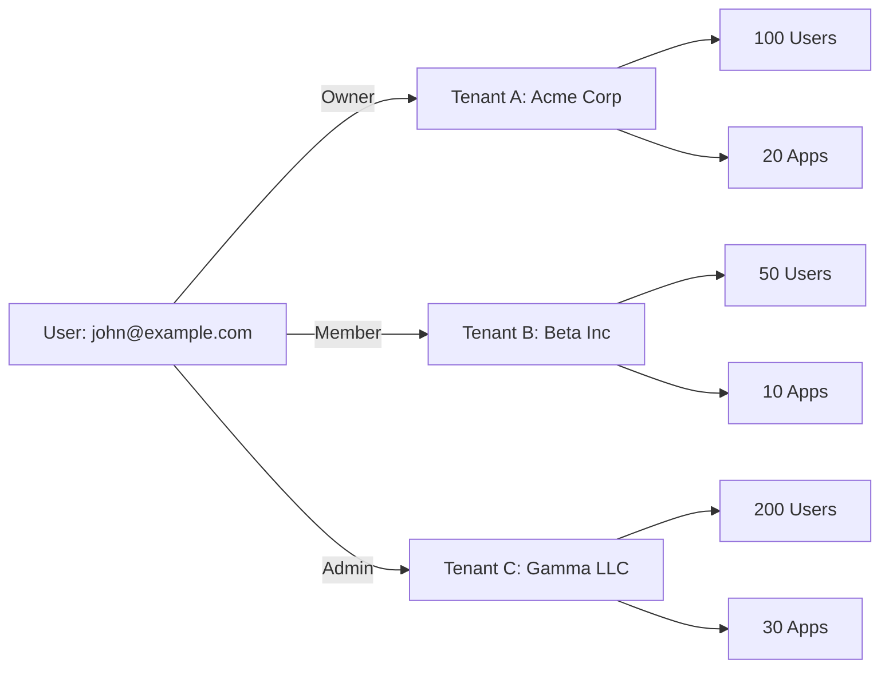
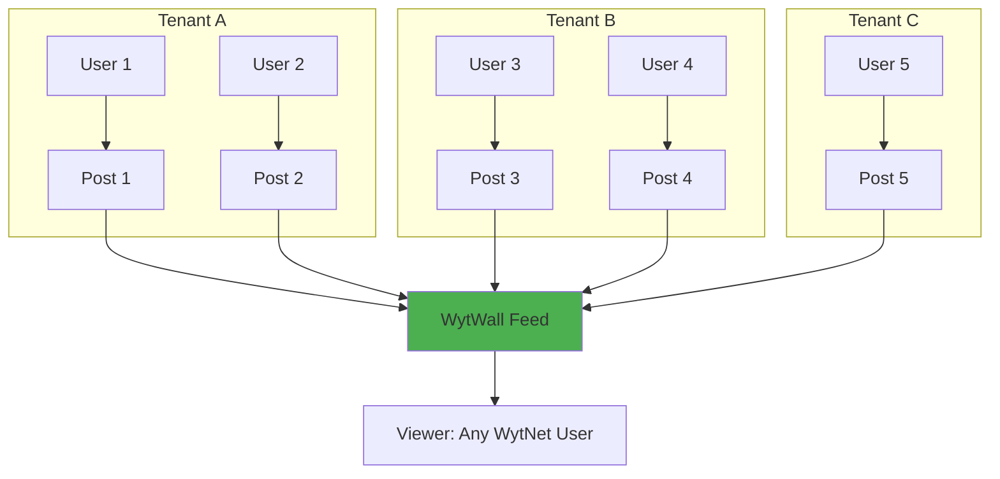
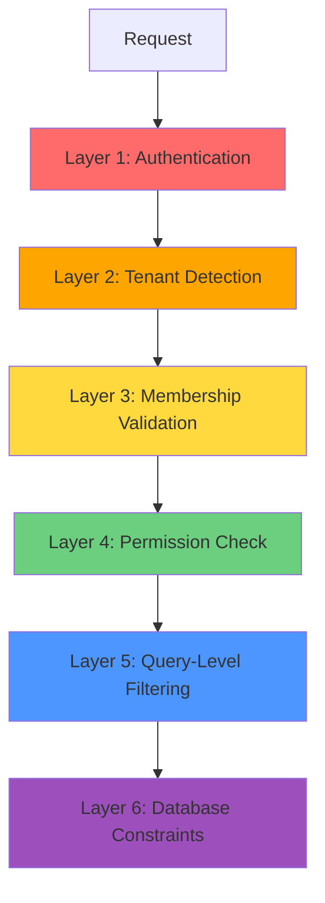

# Multi-Tenancy Architecture

## Overview

WytNet implements a **multi-tenant SaaS architecture** where multiple organizations (tenants) share the same infrastructure and codebase while maintaining complete data isolation. This approach provides:

- **Cost Efficiency**: Shared infrastructure reduces operational costs
- **Scalability**: Easy onboarding of new tenants without infrastructure changes
- **Data Isolation**: Complete separation of tenant data with security guarantees
- **Customization**: Per-tenant configuration and branding
- **Cross-Tenant Hubs**: Special hubs (like WytNet.com) aggregate data across tenants

---

## Multi-Tenancy Model

WytNet uses a **shared database, shared schema** model with tenant-level row isolation:

```
┌─────────────────────────────────────────────────┐
│         Single PostgreSQL Database              │
│                                                 │
│  ┌──────────────┐  ┌──────────────┐  ┌────┐   │
│  │ Tenant A     │  │ Tenant B     │  │... │   │
│  │ tenant_id: 1 │  │ tenant_id: 2 │  │    │   │
│  │              │  │              │  │    │   │
│  │ - 100 users  │  │ - 50 users   │  │    │   │
│  │ - 10 apps    │  │ - 5 apps     │  │    │   │
│  │ - 20 pages   │  │ - 15 pages   │  │    │   │
│  └──────────────┘  └──────────────┘  └────┘   │
└─────────────────────────────────────────────────┘
```

### Benefits of This Model

| Aspect | Benefit |
|--------|---------|
| **Cost** | Single database = lower infrastructure costs |
| **Maintenance** | One schema to manage, easier migrations |
| **Scaling** | Add tenants without provisioning new databases |
| **Backups** | Single backup strategy for all tenants |
| **Querying** | Cross-tenant analytics possible (when allowed) |

### Trade-offs

| Consideration | Mitigation |
|---------------|------------|
| **Data Isolation** | Strict `tenant_id` filtering + application-level RLS |
| **Performance** | Indexed `tenant_id` columns + query optimization |
| **Compliance** | Geo-regulatory controls + data residency rules |
| **Security** | Multiple layers of tenant validation |

---

## Tenant Isolation Strategy

### 1. Database-Level Isolation

Every tenant-scoped table includes a `tenant_id` foreign key:

```typescript
// Example: Apps table
apps {
  id: uuid (PK)
  displayId: varchar
  tenantId: uuid FK → tenants    // Tenant ownership
  name: varchar
  description: text
  status: varchar
  // ... other columns
}

// Example: Pages table
pages {
  id: uuid (PK)
  tenantId: uuid FK → tenants    // Tenant ownership
  title: varchar
  slug: varchar
  content: jsonb
  // ... other columns
}
```

**Tables with `tenant_id`**:
- `apps` - Application instances
- `pages` - CMS pages
- `blocks` - CMS blocks
- `models` - CRUD models
- `media` - Uploaded media files
- `appInstalls` - App installations
- `memberships` - User-tenant relationships

**Tables WITHOUT `tenant_id`** (global/shared):
- `users` - Users can belong to multiple tenants
- `hubs` - Platform-level hubs
- `platformModules` - Shared module library
- `roles` - Role definitions (can be global or scoped)
- `permissions` - Permission definitions

---

### 2. Application-Level Row Level Security (RLS)

While PostgreSQL supports native RLS, WytNet implements **application-level RLS** for flexibility and performance:

#### Automatic Tenant Filtering

Every database query automatically filters by `tenant_id`:

```typescript
// ✅ Good: Tenant-scoped query
const apps = await db
  .select()
  .from(apps)
  .where(
    and(
      eq(apps.tenantId, currentTenantId),
      isNull(apps.deletedAt)
    )
  );

// ❌ Bad: Missing tenant filter (security risk!)
const apps = await db.select().from(apps);
```

#### Storage Interface Enforcement

The `IStorage` interface enforces tenant isolation:

```typescript
export interface IStorage {
  // All tenant-scoped methods require tenantId
  getAppsByTenant(tenantId: string): Promise<App[]>;
  getPagesByTenant(tenantId: string): Promise<Page[]>;
  getModelsByTenant(tenantId: string): Promise<Model[]>;
  
  // Methods that work across tenants are explicitly named
  getAllHubs(): Promise<Hub[]>; // Cross-tenant allowed
}

// Implementation with tenant validation
class DatabaseStorage implements IStorage {
  async getAppsByTenant(tenantId: string): Promise<App[]> {
    // Validate tenantId exists
    const tenant = await this.getTenant(tenantId);
    if (!tenant) {
      throw new Error('Invalid tenant');
    }
    
    return await db
      .select()
      .from(apps)
      .where(
        and(
          eq(apps.tenantId, tenantId),
          isNull(apps.deletedAt)
        )
      );
  }
}
```

---

### 3. Request-Level Tenant Detection

WytNet supports multiple ways to identify the current tenant:

```mermaid
graph TD
    A[Incoming Request] --> B{Tenant Detection}
    
    B -->|Subdomain| C[acme.wytnet.com]
    B -->|Custom Domain| D[acme.com]
    B -->|Path Prefix| E[/t/acme/*]
    B -->|User Session| F[req.session.tenantId]
    
    C --> G[Lookup tenant by subdomain]
    D --> H[Lookup tenant by domain]
    E --> I[Extract tenant from path]
    F --> J[Get tenant from session]
    
    G --> K[Set req.tenant]
    H --> K
    I --> K
    J --> K
    
    K --> L[Proceed with tenant context]
```

#### Hub Routing Middleware

```typescript
// server/hub-routing-middleware.ts
export function hubRoutingMiddleware() {
  return async (req: Request, res: Response, next: NextFunction) => {
    const hostname = req.hostname;
    const path = req.path;
    
    // Method 1: Subdomain routing (e.g., acme.wytnet.com)
    if (hostname.endsWith('.wytnet.com')) {
      const subdomain = hostname.split('.')[0];
      const tenant = await db
        .select()
        .from(tenants)
        .where(eq(tenants.subdomain, subdomain))
        .limit(1);
      
      if (tenant) {
        req.tenant = tenant[0];
        return next();
      }
    }
    
    // Method 2: Custom domain (e.g., acme.com)
    const tenantByDomain = await db
      .select()
      .from(tenants)
      .where(eq(tenants.domain, hostname))
      .limit(1);
    
    if (tenantByDomain) {
      req.tenant = tenantByDomain[0];
      return next();
    }
    
    // Method 3: Path-based routing (e.g., /t/acme/*)
    const pathMatch = path.match(/^\/t\/([^\/]+)/);
    if (pathMatch) {
      const slug = pathMatch[1];
      const tenant = await db
        .select()
        .from(tenants)
        .where(eq(tenants.slug, slug))
        .limit(1);
      
      if (tenant) {
        req.tenant = tenant[0];
        return next();
      }
    }
    
    // Default: No tenant context (public routes)
    next();
  };
}
```

---

### 4. User-Tenant Membership

Users can belong to multiple tenants with different roles:



#### Memberships Table

```typescript
memberships {
  userId: varchar FK → users
  tenantId: uuid FK → tenants
  role: varchar                    // owner, admin, member, viewer
  status: varchar                  // active, suspended, pending
  permissions: jsonb               // Role-specific overrides
  
  PRIMARY KEY (userId, tenantId)   // One membership per user-tenant pair
}
```

#### Switching Tenant Context

```typescript
// API: Switch to a different tenant
POST /api/tenants/switch

Request:
{
  "tenantId": "tenant-uuid"
}

// Backend validation
async function switchTenant(userId: string, tenantId: string) {
  // Verify user has membership
  const membership = await db
    .select()
    .from(memberships)
    .where(
      and(
        eq(memberships.userId, userId),
        eq(memberships.tenantId, tenantId),
        eq(memberships.status, 'active')
      )
    )
    .limit(1);
  
  if (!membership) {
    throw new Error('User is not a member of this tenant');
  }
  
  // Update session
  req.session.currentTenantId = tenantId;
  req.session.currentRole = membership.role;
  
  return { success: true };
}
```

---

## Cross-Tenant Hubs

Some hubs (like **WytNet.com**) aggregate content across tenants while respecting privacy and permissions.

### WytWall Example

WytWall is a social feed that shows posts from users across all tenants:



#### Implementation

```typescript
// Cross-tenant query (explicitly allowed)
async function getWytWallFeed() {
  const posts = await db
    .select()
    .from(wytWallPosts)
    .where(
      and(
        eq(wytWallPosts.status, 'approved'),
        eq(wytWallPosts.visibility, 'public'),
        isNull(wytWallPosts.deletedAt)
      )
    )
    .orderBy(desc(wytWallPosts.createdAt))
    .limit(50);
  
  return posts; // Posts from all tenants
}
```

**Key Points**:
- Cross-tenant aggregation is **explicitly allowed** for specific hubs
- Only **public, approved** content is shown
- Privacy settings are always respected
- Users can opt out of cross-tenant visibility

---

## Data Separation Guarantees

### 1. Query-Level Guarantees

```typescript
// Every tenant-scoped query MUST include tenant_id filter
async function getApps(tenantId: string): Promise<App[]> {
  // ✅ Guaranteed tenant isolation
  return await db
    .select()
    .from(apps)
    .where(
      and(
        eq(apps.tenantId, tenantId),
        isNull(apps.deletedAt)
      )
    );
}

// Helper function to validate tenant access
function validateTenantAccess(userId: string, tenantId: string): Promise<boolean> {
  const membership = await db
    .select()
    .from(memberships)
    .where(
      and(
        eq(memberships.userId, userId),
        eq(memberships.tenantId, tenantId),
        eq(memberships.status, 'active')
      )
    );
  
  return membership.length > 0;
}
```

### 2. Middleware-Level Guarantees

```typescript
// Tenant access middleware
export function requireTenant() {
  return async (req: Request, res: Response, next: NextFunction) => {
    const tenantId = req.params.tenantId || req.session.currentTenantId;
    
    if (!tenantId) {
      return res.status(400).json({ error: 'Tenant required' });
    }
    
    // Validate user has access to this tenant
    const hasAccess = await validateTenantAccess(req.user.id, tenantId);
    
    if (!hasAccess) {
      return res.status(403).json({ error: 'Access denied to this tenant' });
    }
    
    req.tenant = await getTenant(tenantId);
    next();
  };
}

// Usage in routes
app.get('/api/tenants/:tenantId/apps', requireTenant(), async (req, res) => {
  const apps = await storage.getAppsByTenant(req.tenant.id);
  res.json(apps);
});
```

### 3. Soft Delete Guarantees

Soft deletes prevent accidental data loss and maintain audit trails:

```typescript
// Soft delete (data remains in database)
async function softDeleteApp(appId: string, tenantId: string, deletedBy: string) {
  const [app] = await db
    .update(apps)
    .set({
      deletedAt: new Date(),
      deletedBy,
      deleteReason: 'User requested deletion',
    })
    .where(
      and(
        eq(apps.id, appId),
        eq(apps.tenantId, tenantId) // Tenant validation
      )
    )
    .returning();
  
  return app;
}

// Queries automatically exclude soft-deleted records
const activeApps = await db
  .select()
  .from(apps)
  .where(
    and(
      eq(apps.tenantId, tenantId),
      isNull(apps.deletedAt) // Exclude deleted
    )
  );
```

---

## Security Model

### Defense-in-Depth Strategy

WytNet implements multiple layers of tenant isolation:



#### Layer 1: Authentication
- WytPass unified identity system
- Session management with httpOnly cookies
- Multi-factor authentication support

#### Layer 2: Tenant Detection
- Hub routing middleware
- Domain/subdomain mapping
- Path-based tenant resolution

#### Layer 3: Membership Validation
- Verify user belongs to tenant
- Check membership status (active/suspended)
- Validate membership permissions

#### Layer 4: Permission Check
- RBAC permission validation
- Role-based access control
- Resource-specific permissions

#### Layer 5: Query-Level Filtering
- Automatic `tenant_id` filtering
- Soft delete exclusion
- Status-based filtering

#### Layer 6: Database Constraints
- Foreign key constraints
- Unique constraints per tenant
- Check constraints on enums

---

## Tenant Configuration

Each tenant can have custom configuration:

```typescript
tenants {
  id: uuid
  displayId: varchar              // TN00001
  name: varchar                   // Organization name
  slug: varchar                   // URL slug
  domain: varchar                 // Custom domain
  subdomain: varchar              // wytnet.com subdomain
  status: varchar                 // active, suspended, inactive
  settings: jsonb                 // Custom configuration
}

// Example settings JSON
{
  "theme": {
    "primaryColor": "#4CAF50",
    "logo": "https://cdn.wytnet.com/tenants/acme/logo.png",
    "favicon": "https://cdn.wytnet.com/tenants/acme/favicon.ico"
  },
  "features": {
    "enabledModules": ["calendar", "payment", "analytics"],
    "enabledApps": ["wytwall", "ai-directory"],
    "customDomain": true,
    "sso": true
  },
  "limits": {
    "maxUsers": 100,
    "maxStorage": "50GB",
    "maxApiCalls": 10000
  },
  "integrations": {
    "payment": "razorpay",
    "email": "sendgrid",
    "storage": "gcs"
  },
  "branding": {
    "companyName": "Acme Corporation",
    "website": "https://acme.com",
    "supportEmail": "support@acme.com"
  }
}
```

---

## Multi-Tenant Query Patterns

### Pattern 1: Single Tenant Query

```typescript
// Get all apps for a specific tenant
const apps = await db
  .select()
  .from(apps)
  .where(
    and(
      eq(apps.tenantId, tenantId),
      isNull(apps.deletedAt)
    )
  );
```

### Pattern 2: User's Multi-Tenant Query

```typescript
// Get all tenants a user belongs to
const userTenants = await db
  .select({
    tenant: tenants,
    membership: memberships,
  })
  .from(memberships)
  .innerJoin(tenants, eq(memberships.tenantId, tenants.id))
  .where(
    and(
      eq(memberships.userId, userId),
      eq(memberships.status, 'active'),
      isNull(tenants.deletedAt)
    )
  );
```

### Pattern 3: Cross-Tenant Aggregation (Explicit)

```typescript
// Get all public WytWall posts across tenants
const publicPosts = await db
  .select()
  .from(wytWallPosts)
  .where(
    and(
      eq(wytWallPosts.visibility, 'public'),
      eq(wytWallPosts.status, 'approved'),
      isNull(wytWallPosts.deletedAt)
    )
  )
  .orderBy(desc(wytWallPosts.createdAt));
```

### Pattern 4: Tenant-Scoped Join

```typescript
// Get apps with their installations for a tenant
const appsWithInstalls = await db
  .select({
    app: apps,
    install: appInstalls,
  })
  .from(apps)
  .leftJoin(appInstalls, 
    and(
      eq(apps.id, appInstalls.appId),
      eq(appInstalls.tenantId, tenantId) // Tenant filter on join
    )
  )
  .where(
    and(
      eq(apps.tenantId, tenantId),
      isNull(apps.deletedAt)
    )
  );
```

---

## Tenant Lifecycle Management

### 1. Tenant Creation

```typescript
async function createTenant(data: {
  name: string;
  slug: string;
  ownerId: string;
}) {
  // Create tenant
  const [tenant] = await db
    .insert(tenants)
    .values({
      name: data.name,
      slug: data.slug,
      subdomain: data.slug,
      status: 'active',
      settings: {
        theme: 'default',
        features: ['crud', 'cms', 'apps'],
      },
    })
    .returning();
  
  // Create owner membership
  await db.insert(memberships).values({
    userId: data.ownerId,
    tenantId: tenant.id,
    role: 'owner',
    status: 'active',
    permissions: {
      admin: true,
      manage_users: true,
      manage_apps: true,
      manage_billing: true,
    },
  });
  
  return tenant;
}
```

### 2. Tenant Suspension

```typescript
async function suspendTenant(tenantId: string, reason: string) {
  const [tenant] = await db
    .update(tenants)
    .set({
      status: 'suspended',
      settings: sql`
        jsonb_set(
          settings,
          '{suspension}',
          '{"reason": "${reason}", "date": "${new Date().toISOString()}"}'
        )
      `,
    })
    .where(eq(tenants.id, tenantId))
    .returning();
  
  return tenant;
}
```

### 3. Tenant Deletion (Soft)

```typescript
async function softDeleteTenant(
  tenantId: string,
  deletedBy: string,
  reason: string
) {
  const [tenant] = await db
    .update(tenants)
    .set({
      deletedAt: new Date(),
      deletedBy,
      deleteReason: reason,
      status: 'inactive',
    })
    .where(eq(tenants.id, tenantId))
    .returning();
  
  return tenant;
}
```

---

## Compliance & Data Residency

### Geo-Regulatory Controls

WytNet supports data residency and compliance requirements:

```typescript
geoRegulatoryRules {
  id: uuid
  country: varchar                // IN, US, EU, etc.
  state: varchar                  // Optional state/province
  ruleType: varchar               // data_residency, gdpr, ccpa, etc.
  restrictions: jsonb             // Rule-specific restrictions
  isActive: boolean
}

// Example: GDPR compliance for EU tenants
{
  "country": "EU",
  "ruleType": "gdpr",
  "restrictions": {
    "dataRetention": "2 years",
    "rightToForget": true,
    "dataPortability": true,
    "consentRequired": true,
    "dataProcessingAgreement": true
  }
}

// Example: Data residency for Indian tenants
{
  "country": "IN",
  "ruleType": "data_residency",
  "restrictions": {
    "storageLocation": "IN",
    "backupLocation": "IN",
    "crossBorderTransfer": false,
    "localProcessingRequired": true
  }
}
```

---

## Performance Optimization

### Indexed Tenant Queries

All tenant-scoped tables have indexes on `tenant_id`:

```sql
CREATE INDEX idx_apps_tenant ON apps(tenant_id);
CREATE INDEX idx_pages_tenant ON pages(tenant_id);
CREATE INDEX idx_blocks_tenant ON blocks(tenant_id);

-- Composite indexes for common queries
CREATE INDEX idx_apps_tenant_status ON apps(tenant_id, status);
CREATE INDEX idx_pages_tenant_locale ON pages(tenant_id, locale);
```

### Query Performance

```typescript
// ✅ Efficient: Uses index on (tenant_id, status)
EXPLAIN ANALYZE
SELECT * FROM apps 
WHERE tenant_id = 'tenant-uuid' 
  AND status = 'published'
  AND deleted_at IS NULL;

// Result: Index Scan using idx_apps_tenant_status (cost=0.29..8.31 rows=1)
```

### Connection Pooling

```typescript
// Database connection pool configuration
const db = drizzle(
  new Pool({
    connectionString: process.env.DATABASE_URL,
    max: 20, // Maximum pool size
    idleTimeoutMillis: 30000,
    connectionTimeoutMillis: 2000,
  })
);
```

---

## Best Practices

### ✅ DO

1. **Always filter by tenant_id** in tenant-scoped queries
2. **Validate user membership** before granting tenant access
3. **Use soft deletes** for tenant data to prevent accidental loss
4. **Index tenant_id columns** for query performance
5. **Respect cross-tenant privacy** settings
6. **Implement audit logging** for tenant operations
7. **Use transactions** for multi-table tenant operations

### ❌ DON'T

1. **Never expose tenant UUIDs** in public URLs (use slugs/subdomains)
2. **Don't skip tenant validation** assuming middleware handled it
3. **Avoid cross-tenant queries** unless explicitly allowed
4. **Don't store tenant-specific secrets** in shared config
5. **Never hard-delete** tenant data without explicit approval
6. **Don't assume single tenancy** in any business logic
7. **Avoid global queries** without tenant filters

---

## Conclusion

WytNet's multi-tenancy architecture provides:

- **Complete Data Isolation**: Tenant data is strictly separated at multiple levels
- **Flexible Access**: Users can belong to multiple tenants with different roles
- **Cross-Tenant Hubs**: Special hubs can aggregate public content
- **Security**: Defense-in-depth with multiple validation layers
- **Compliance**: Support for data residency and regulatory requirements
- **Performance**: Optimized queries with proper indexing
- **Scalability**: Easy tenant onboarding without infrastructure changes

This architecture ensures secure, scalable, and compliant multi-tenant SaaS operations.
