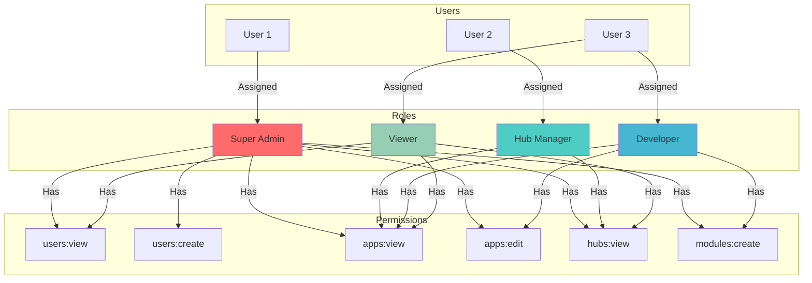
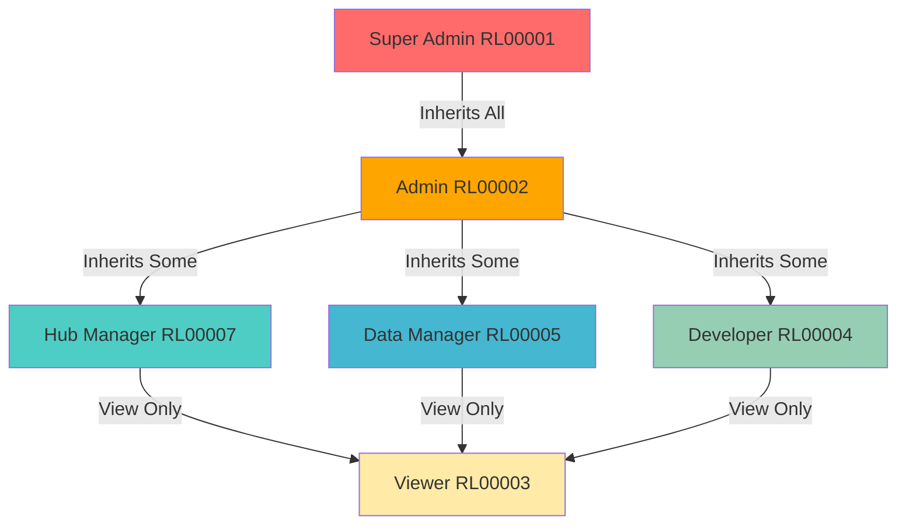

# Role-Based Access Control (RBAC)

## Overview

WytNet implements a comprehensive **Role-Based Access Control (RBAC)** system that provides fine-grained permissions across the entire platform. The system supports:

- **64 Permissions** across 16 resource sections
- **8 Default Engine Roles** with pre-configured permissions
- **Multi-Scope RBAC**: Engine, Hub, and App-level roles
- **Permission Inheritance**: Roles inherit permissions
- **Temporary Assignments**: Roles can have expiration dates
- **Audit Trails**: Complete logging of role and permission changes

---

## RBAC Architecture



---

## Permission System

### Permission Structure

Each permission consists of:

```typescript
permission {
  id: varchar (PK)                    // UUID
  displayId: varchar UNIQUE           // PM00001
  resource: varchar NOT NULL          // users, apps, hubs, modules, etc.
  action: varchar NOT NULL            // view, create, edit, delete
  scope: varchar                      // engine, hub, app, global
  description: text                   // Human-readable description
  isActive: boolean
  
  createdAt: timestamp
  updatedAt: timestamp
  
  UNIQUE (resource, action, scope)
}
```

### 16 Resource Sections

| Resource | Key | Description |
|----------|-----|-------------|
| Users | `users` | Platform user management |
| Organizations | `organizations` | Tenant/organization management |
| Entities | `entities` | Entity type and data management |
| DataSets | `datasets` | Data collection management |
| Media | `media` | Media file management |
| Modules | `modules` | Module library management |
| Apps | `apps` | Application management |
| Hubs | `hubs` | Hub platform management |
| CMS | `cms` | Content management system |
| Themes | `themes` | Theme management |
| Integrations | `integrations` | Integration management |
| Pricing | `pricing` | Pricing and plan management |
| Help & Support | `help-support` | Help content management |
| Analytics | `analytics` | Analytics and reporting |
| Roles & Permissions | `roles-permissions` | RBAC management |
| System & Security | `system-security` | System settings and security |

### 4 CRUD Actions

| Action | Description | Example |
|--------|-------------|---------|
| `view` | Read access to resource | View user list |
| `create` | Create new resource | Add new user |
| `edit` | Modify existing resource | Update user profile |
| `delete` | Remove resource | Delete user |

### 64 Permissions Matrix

**16 resources × 4 actions = 64 permissions**

| Resource | view | create | edit | delete |
|----------|------|--------|------|--------|
| users | PM00001 | PM00002 | PM00003 | PM00004 |
| organizations | PM00005 | PM00006 | PM00007 | PM00008 |
| entities | PM00009 | PM00010 | PM00011 | PM00012 |
| datasets | PM00013 | PM00014 | PM00015 | PM00016 |
| media | PM00017 | PM00018 | PM00019 | PM00020 |
| modules | PM00021 | PM00022 | PM00023 | PM00024 |
| apps | PM00025 | PM00026 | PM00027 | PM00028 |
| hubs | PM00029 | PM00030 | PM00031 | PM00032 |
| cms | PM00033 | PM00034 | PM00035 | PM00036 |
| themes | PM00037 | PM00038 | PM00039 | PM00040 |
| integrations | PM00041 | PM00042 | PM00043 | PM00044 |
| pricing | PM00045 | PM00046 | PM00047 | PM00048 |
| help-support | PM00049 | PM00050 | PM00051 | PM00052 |
| analytics | PM00053 | PM00054 | PM00055 | PM00056 |
| roles-permissions | PM00057 | PM00058 | PM00059 | PM00060 |
| system-security | PM00061 | PM00062 | PM00063 | PM00064 |

---

## Role System

### Role Structure

```typescript
role {
  id: varchar (PK)                    // UUID
  displayId: varchar UNIQUE           // RL00001
  name: varchar NOT NULL              // Super Admin, Hub Manager, etc.
  description: text
  scope: varchar                      // engine, hub, app, global
  isSystem: boolean                   // System role (protected)
  isActive: boolean
  
  createdBy: varchar FK → users
  createdAt: timestamp
  updatedAt: timestamp
}
```

### 8 Default Engine Roles

| Role | Display ID | Description | Permissions |
|------|-----------|-------------|-------------|
| **Super Admin** | RL00001 | Full access to all engine features and settings | All 64 permissions |
| **Admin** | RL00002 | Administrative access with limited system-level permissions | Selected permissions |
| **Viewer** | RL00003 | Read-only access to engine resources | All `view` permissions (16) |
| **Developer** | RL00004 | Access to modules, apps, themes, and integrations | modules:*, apps:*, themes:*, integrations:* |
| **Data Manager** | RL00005 | Access to datasets, entities, and media management | datasets:*, entities:*, media:* |
| **Finance Manager** | RL00006 | Access to finance, billing, pricing, and analytics | pricing:*, analytics:*, users:view, organizations:view |
| **Hub Manager** | RL00007 | Access to platform hubs and CMS management | hubs:*, cms:* |
| **Analyst** | RL00008 | View-only access to analytics and reporting | All `view` permissions (16) |

### Role Permission Details

#### RL00001: Super Admin

```typescript
{
  displayId: "RL00001",
  name: "Super Admin",
  description: "Full access to all engine features and settings",
  scope: "engine",
  isSystem: true,
  permissions: [
    // ALL 64 permissions assigned
    "users:view", "users:create", "users:edit", "users:delete",
    "organizations:view", "organizations:create", "organizations:edit", "organizations:delete",
    // ... (all resources × all actions)
    "system-security:view", "system-security:create", "system-security:edit", "system-security:delete"
  ]
}
```

#### RL00002: Admin

```typescript
{
  displayId: "RL00002",
  name: "Admin",
  description: "Administrative access with limited system-level permissions",
  scope: "engine",
  isSystem: true,
  permissions: [
    // Most permissions except critical system operations
    "users:view", "users:create", "users:edit",
    "organizations:view", "organizations:create", "organizations:edit",
    // ... (excluded: users:delete, system-security:delete, etc.)
  ]
}
```

#### RL00003: Viewer

```typescript
{
  displayId: "RL00003",
  name: "Viewer",
  description: "Read-only access to engine resources",
  scope: "engine",
  isSystem: true,
  permissions: [
    // Only view permissions
    "users:view",
    "organizations:view",
    "entities:view",
    "datasets:view",
    "media:view",
    "modules:view",
    "apps:view",
    "hubs:view",
    "cms:view",
    "themes:view",
    "integrations:view",
    "pricing:view",
    "help-support:view",
    "analytics:view",
    "roles-permissions:view",
    "system-security:view"
  ]
}
```

#### RL00004: Developer

```typescript
{
  displayId: "RL00004",
  name: "Developer",
  description: "Access to modules, apps, themes, and integrations for development",
  scope: "engine",
  isSystem: true,
  permissions: [
    // Full access to development resources
    "modules:view", "modules:create", "modules:edit", "modules:delete",
    "apps:view", "apps:create", "apps:edit", "apps:delete",
    "themes:view", "themes:create", "themes:edit", "themes:delete",
    "integrations:view", "integrations:create", "integrations:edit", "integrations:delete"
  ]
}
```

#### RL00005: Data Manager

```typescript
{
  displayId: "RL00005",
  name: "Data Manager",
  description: "Access to datasets, entities, and media management",
  scope: "engine",
  isSystem: true,
  permissions: [
    // Full access to data resources
    "datasets:view", "datasets:create", "datasets:edit", "datasets:delete",
    "entities:view", "entities:create", "entities:edit", "entities:delete",
    "media:view", "media:create", "media:edit", "media:delete"
  ]
}
```

#### RL00006: Finance Manager

```typescript
{
  displayId: "RL00006",
  name: "Finance Manager",
  description: "Access to finance, billing, pricing, and analytics",
  scope: "engine",
  isSystem: true,
  permissions: [
    // Full access to finance
    "pricing:view", "pricing:create", "pricing:edit", "pricing:delete",
    "analytics:view", "analytics:create", "analytics:edit", "analytics:delete",
    
    // View-only for users and organizations
    "users:view",
    "organizations:view"
  ]
}
```

#### RL00007: Hub Manager

```typescript
{
  displayId: "RL00007",
  name: "Hub Manager",
  description: "Access to platform hubs and CMS management",
  scope: "engine",
  isSystem: true,
  permissions: [
    // Full access to hubs and CMS
    "hubs:view", "hubs:create", "hubs:edit", "hubs:delete",
    "cms:view", "cms:create", "cms:edit", "cms:delete"
  ]
}
```

#### RL00008: Analyst

```typescript
{
  displayId: "RL00008",
  name: "Analyst",
  description: "View-only access to analytics and reporting across all resources",
  scope: "engine",
  isSystem: true,
  permissions: [
    // Same as Viewer - all view permissions
    "users:view",
    "organizations:view",
    "entities:view",
    // ... (all resources:view)
  ]
}
```

---

## Permission Checking Logic

### Backend Permission Check

```typescript
// Middleware: Check if user has permission
export function requirePermission(resource: string, action: string) {
  return async (req: Request, res: Response, next: NextFunction) => {
    const user = req.user;
    
    if (!user) {
      return res.status(401).json({ error: 'Unauthorized' });
    }
    
    // Super admins bypass all permission checks
    if (user.isSuperAdmin) {
      return next();
    }
    
    // Get user's roles
    const userRoles = await db
      .select({ role: roles })
      .from(userRoles)
      .innerJoin(roles, eq(userRoles.roleId, roles.id))
      .where(
        and(
          eq(userRoles.userId, user.id),
          eq(roles.scope, 'engine'),
          eq(roles.isActive, true)
        )
      );
    
    // Get all permissions from user's roles
    const permissions = await db
      .select({ permission: permissions })
      .from(rolePermissions)
      .innerJoin(permissions, eq(rolePermissions.permissionId, permissions.id))
      .where(
        and(
          sql`${rolePermissions.roleId} IN (${userRoles.map(r => r.role.id).join(',')})`,
          eq(permissions.resource, resource),
          eq(permissions.action, action),
          eq(permissions.scope, 'engine'),
          eq(permissions.isActive, true)
        )
      );
    
    if (permissions.length === 0) {
      return res.status(403).json({ 
        error: 'Forbidden',
        message: `Missing permission: ${resource}:${action}` 
      });
    }
    
    next();
  };
}

// Usage in routes
app.get('/api/users', 
  requireAuth(), 
  requirePermission('users', 'view'),
  async (req, res) => {
    const users = await storage.getUsers();
    res.json(users);
  }
);

app.post('/api/users',
  requireAuth(),
  requirePermission('users', 'create'),
  async (req, res) => {
    const user = await storage.createUser(req.body);
    res.json(user);
  }
);

app.delete('/api/users/:id',
  requireAuth(),
  requirePermission('users', 'delete'),
  async (req, res) => {
    await storage.deleteUser(req.params.id);
    res.json({ success: true });
  }
);
```

### Frontend Permission Check

```typescript
// Custom hook: Check permission
import { useQuery } from '@tanstack/react-query';

export function usePermission(resource: string, action: string) {
  const { data: user } = useQuery({ queryKey: ['/api/auth/user'] });
  
  if (!user) return false;
  
  // Super admins have all permissions
  if (user.isSuperAdmin) return true;
  
  // Fetch user permissions
  const { data: permissions } = useQuery({
    queryKey: ['/api/auth/permissions'],
  });
  
  if (!permissions) return false;
  
  // Check if permission exists
  return permissions.some(
    (p: any) => p.resource === resource && p.action === action
  );
}

// Usage in components
function UserManagement() {
  const canViewUsers = usePermission('users', 'view');
  const canCreateUsers = usePermission('users', 'create');
  const canEditUsers = usePermission('users', 'edit');
  const canDeleteUsers = usePermission('users', 'delete');
  
  if (!canViewUsers) {
    return <div>Access Denied</div>;
  }
  
  return (
    <div>
      <h1>User Management</h1>
      
      {canCreateUsers && (
        <Button onClick={handleCreateUser}>
          Create User
        </Button>
      )}
      
      <Table>
        {users.map(user => (
          <TableRow key={user.id}>
            <TableCell>{user.name}</TableCell>
            <TableCell>
              {canEditUsers && (
                <Button onClick={() => handleEdit(user.id)}>
                  Edit
                </Button>
              )}
              {canDeleteUsers && (
                <Button onClick={() => handleDelete(user.id)}>
                  Delete
                </Button>
              )}
            </TableCell>
          </TableRow>
        ))}
      </Table>
    </div>
  );
}
```

---

## API Endpoint Protection

### Protected Routes

All admin routes are protected with permission checks:

```typescript
// server/routes.ts
import express from 'express';
import { requireAuth } from './middleware/auth';
import { requirePermission } from './middleware/permissions';

const router = express.Router();

// User Management Routes
router.get('/api/users', 
  requireAuth(), 
  requirePermission('users', 'view'),
  getUsersHandler
);

router.post('/api/users',
  requireAuth(),
  requirePermission('users', 'create'),
  createUserHandler
);

router.put('/api/users/:id',
  requireAuth(),
  requirePermission('users', 'edit'),
  updateUserHandler
);

router.delete('/api/users/:id',
  requireAuth(),
  requirePermission('users', 'delete'),
  deleteUserHandler
);

// App Management Routes
router.get('/api/apps',
  requireAuth(),
  requirePermission('apps', 'view'),
  getAppsHandler
);

router.post('/api/apps',
  requireAuth(),
  requirePermission('apps', 'create'),
  createAppHandler
);

// Hub Management Routes
router.get('/api/hubs',
  requireAuth(),
  requirePermission('hubs', 'view'),
  getHubsHandler
);

router.post('/api/hubs',
  requireAuth(),
  requirePermission('hubs', 'create'),
  createHubHandler
);

// System Security Routes (Super Admin only)
router.get('/api/system/settings',
  requireAuth(),
  requirePermission('system-security', 'view'),
  getSystemSettingsHandler
);

router.put('/api/system/settings',
  requireAuth(),
  requirePermission('system-security', 'edit'),
  updateSystemSettingsHandler
);
```

---

## Role Assignment

### Assign Role to User

```typescript
async function assignRoleToUser(
  userId: string,
  roleId: string,
  scope: 'engine' | 'hub' | 'app' = 'engine',
  scopeId?: string,
  assignedBy: string
) {
  // Validate role exists
  const role = await db
    .select()
    .from(roles)
    .where(eq(roles.id, roleId))
    .limit(1);
  
  if (!role.length) {
    throw new Error('Role not found');
  }
  
  // Check if assignment already exists
  const existing = await db
    .select()
    .from(userRoles)
    .where(
      and(
        eq(userRoles.userId, userId),
        eq(userRoles.roleId, roleId),
        eq(userRoles.scope, scope),
        scopeId ? eq(userRoles.scopeId, scopeId) : sql`scope_id IS NULL`
      )
    )
    .limit(1);
  
  if (existing.length > 0) {
    throw new Error('Role already assigned to user');
  }
  
  // Create role assignment
  const [userRole] = await db
    .insert(userRoles)
    .values({
      userId,
      roleId,
      scope,
      scopeId,
      assignedBy,
      assignedAt: new Date(),
    })
    .returning();
  
  return userRole;
}
```

### Remove Role from User

```typescript
async function removeRoleFromUser(
  userId: string,
  roleId: string,
  scope: 'engine' | 'hub' | 'app' = 'engine'
) {
  const result = await db
    .delete(userRoles)
    .where(
      and(
        eq(userRoles.userId, userId),
        eq(userRoles.roleId, roleId),
        eq(userRoles.scope, scope)
      )
    );
  
  return result.rowCount > 0;
}
```

---

## Permission Inheritance

### Role Hierarchy



### Permission Priority

When a user has multiple roles with conflicting permissions:

1. **Super Admin**: Always granted (bypasses all checks)
2. **Most Permissive Wins**: If any role grants permission, access is allowed
3. **Explicit Denials**: Can be implemented via permission metadata (future enhancement)

```typescript
async function checkUserPermission(
  userId: string,
  resource: string,
  action: string
): Promise<boolean> {
  const user = await getUser(userId);
  
  // Super admin bypass
  if (user.isSuperAdmin) return true;
  
  // Get all user roles and their permissions
  const userPermissions = await db
    .select({ permission: permissions })
    .from(userRoles)
    .innerJoin(roles, eq(userRoles.roleId, roles.id))
    .innerJoin(rolePermissions, eq(roles.id, rolePermissions.roleId))
    .innerJoin(permissions, eq(rolePermissions.permissionId, permissions.id))
    .where(
      and(
        eq(userRoles.userId, userId),
        eq(permissions.resource, resource),
        eq(permissions.action, action),
        eq(permissions.isActive, true),
        eq(roles.isActive, true)
      )
    );
  
  // If any role grants permission, access is allowed
  return userPermissions.length > 0;
}
```

---

## Custom Roles

### Create Custom Role

```typescript
async function createCustomRole(data: {
  name: string;
  description: string;
  scope: 'engine' | 'hub' | 'app';
  permissionIds: string[];
  createdBy: string;
}) {
  // Generate display ID
  const displayId = await generateRoleDisplayId();
  
  // Create role
  const [role] = await db
    .insert(roles)
    .values({
      displayId,
      name: data.name,
      description: data.description,
      scope: data.scope,
      isSystem: false, // Not a system role
      isActive: true,
      createdBy: data.createdBy,
    })
    .returning();
  
  // Assign permissions to role
  await db.insert(rolePermissions).values(
    data.permissionIds.map(permissionId => ({
      roleId: role.id,
      permissionId,
    }))
  );
  
  return role;
}
```

### Update Role Permissions

```typescript
async function updateRolePermissions(
  roleId: string,
  permissionIds: string[]
) {
  // Remove all existing permissions
  await db
    .delete(rolePermissions)
    .where(eq(rolePermissions.roleId, roleId));
  
  // Add new permissions
  await db.insert(rolePermissions).values(
    permissionIds.map(permissionId => ({
      roleId,
      permissionId,
    }))
  );
  
  return { success: true };
}
```

---

## Temporary Role Assignments

Roles can be assigned with expiration dates:

```typescript
userRoles {
  id: varchar
  userId: varchar
  roleId: varchar
  scope: varchar
  scopeId: varchar
  assignedBy: varchar
  assignedAt: timestamp
  expiresAt: timestamp           // Optional expiration
  createdAt: timestamp
}

// Assign temporary role
async function assignTemporaryRole(
  userId: string,
  roleId: string,
  expiresAt: Date
) {
  const [userRole] = await db
    .insert(userRoles)
    .values({
      userId,
      roleId,
      scope: 'engine',
      assignedBy: 'system',
      assignedAt: new Date(),
      expiresAt, // Role expires after this date
    })
    .returning();
  
  return userRole;
}

// Permission check includes expiration
async function getUserActiveRoles(userId: string) {
  return await db
    .select({ role: roles })
    .from(userRoles)
    .innerJoin(roles, eq(userRoles.roleId, roles.id))
    .where(
      and(
        eq(userRoles.userId, userId),
        eq(roles.isActive, true),
        or(
          sql`${userRoles.expiresAt} IS NULL`,
          sql`${userRoles.expiresAt} > NOW()`
        )
      )
    );
}
```

---

## Audit Trail

All role and permission changes are logged:

```typescript
auditLogs {
  id: varchar
  userId: varchar
  action: varchar               // role_assigned, role_removed, permission_changed
  resource: varchar              // roles, permissions
  resourceId: varchar
  details: jsonb                 // Change details
  ipAddress: varchar
  userAgent: varchar
  createdAt: timestamp
}

// Log role assignment
await db.insert(auditLogs).values({
  userId: assignedBy,
  action: 'role_assigned',
  resource: 'roles',
  resourceId: roleId,
  details: {
    assignedTo: userId,
    roleName: role.name,
    scope,
    scopeId,
  },
  ipAddress: req.ip,
  userAgent: req.headers['user-agent'],
});
```

---

## Best Practices

### ✅ DO

1. **Always check permissions** at both frontend and backend
2. **Use system roles** for common access patterns
3. **Create custom roles** for specific organizational needs
4. **Log all permission changes** for audit trails
5. **Use least privilege principle** - grant minimum required permissions
6. **Test permission logic** thoroughly before deployment
7. **Document custom roles** and their purposes

### ❌ DON'T

1. **Don't hardcode permissions** in business logic
2. **Don't bypass permission checks** for "trusted" users
3. **Don't delete system roles** (they're protected)
4. **Don't grant Super Admin** lightly - use specific roles instead
5. **Don't forget to check permissions** in API routes
6. **Don't expose permission internals** to frontend
7. **Don't cache permissions** too aggressively (check expiration)

---

## Conclusion

WytNet's RBAC system provides:

- **Fine-Grained Control**: 64 permissions across 16 resources
- **Flexible Roles**: 8 default roles + custom role creation
- **Multi-Scope Support**: Engine, Hub, and App-level permissions
- **Audit Trails**: Complete logging of all changes
- **Temporary Access**: Role assignments with expiration
- **Scalability**: Efficient permission checking with proper indexing

This comprehensive RBAC system ensures secure, scalable, and manageable access control across the entire WytNet platform.
