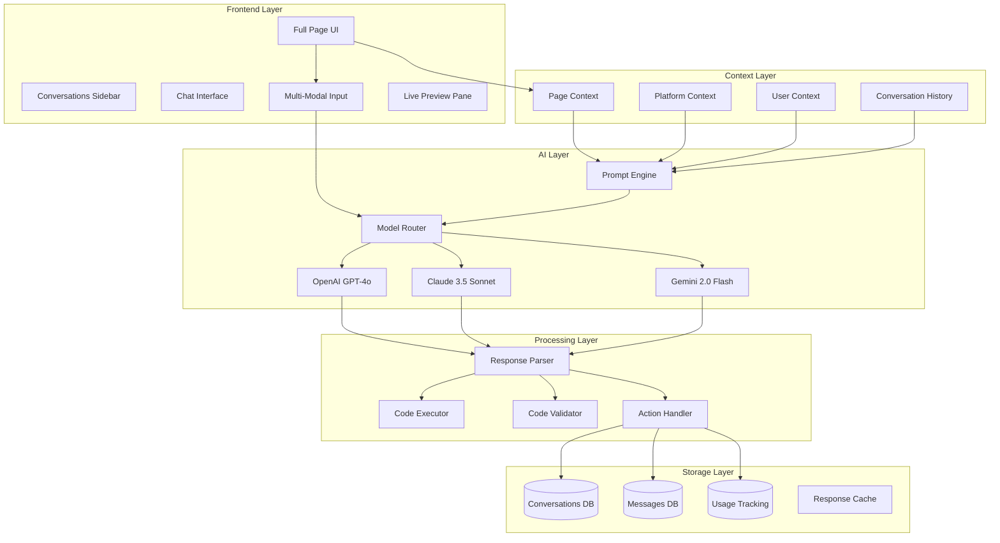
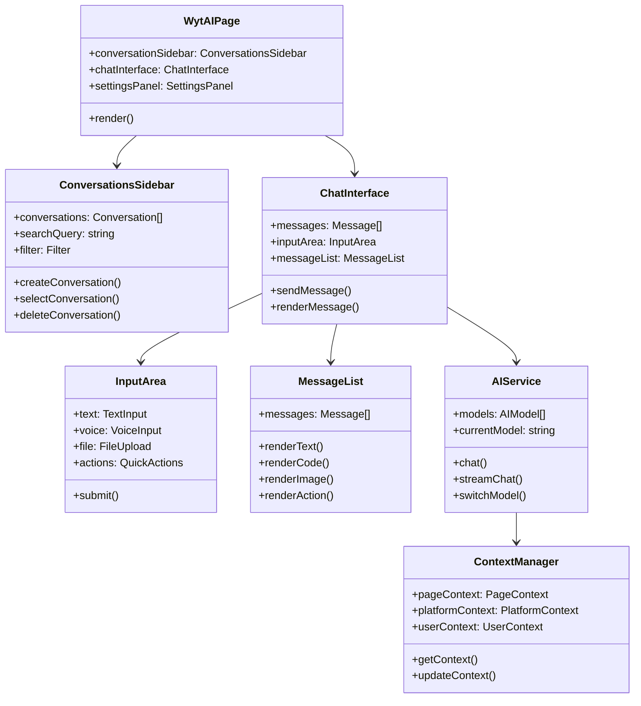

# WytAI Agent Full Page Architecture

**Version**: 1.0  
**Last Updated**: October 2025  
**Status**: Design Phase

---

## Overview

**WytAI Agent** is an intelligent AI assistant deeply integrated into the WytNet Engine Admin Panel, providing context-aware help, code generation, and autonomous feature creation through natural language interaction.

### Evolution

**Current State** (Phase 1):
- Floating chat widget
- Basic chat functionality
- Limited context awareness
- Simple Q&A interactions

**Target State** (Phase 2):
- Full-page dedicated interface
- Advanced chat features (voice, files, code execution)
- Deep Engine context integration
- Conversation management system
- Multi-model AI support

### Key Capabilities

1. **Context-Aware Assistance**: Understands current page, user action, platform state
2. **Code Generation**: Produces production-ready code from natural language
3. **Multi-Modal Input**: Text, voice, files, screen capture
4. **Interactive Execution**: Run code, preview changes, deploy features
5. **Conversation Management**: History, search, sharing, templates

---

## System Architecture

### High-Level Architecture



### Component Architecture



---

## Frontend Architecture

### Page Layout Structure

```typescript
interface WytAIPageLayout {
  header: HeaderSection;
  sidebar: ConversationsSidebar;
  main: ChatArea;
  inspector?: InspectorPanel; // Optional right panel
}

interface HeaderSection {
  title: string;
  modelSelector: ModelSelector;
  quickActions: QuickAction[];
  settings: SettingsButton;
}

interface ConversationsSidebar {
  width: number; // Adjustable
  collapsible: boolean;
  sections: {
    newChat: NewChatButton;
    search: SearchBar;
    groups: ConversationGroup[];
  };
}

interface ChatArea {
  messages: MessageThread;
  input: InputArea;
  preview?: PreviewPane;
}
```

### Responsive Layout

```css
/* Desktop (> 1024px) */
.wytai-page {
  display: grid;
  grid-template-columns: 300px 1fr 300px; /* Sidebar, Chat, Inspector */
  grid-template-rows: 60px 1fr; /* Header, Content */
}

/* Tablet (768px - 1024px) */
@media (max-width: 1024px) {
  .wytai-page {
    grid-template-columns: 250px 1fr; /* Hide inspector by default */
  }
}

/* Mobile (< 768px) */
@media (max-width: 768px) {
  .wytai-page {
    grid-template-columns: 1fr; /* Full width chat */
  }
  
  .conversations-sidebar {
    position: fixed;
    transform: translateX(-100%);
    transition: transform 0.3s;
  }
  
  .conversations-sidebar.open {
    transform: translateX(0);
  }
}
```

### Component Hierarchy

```tsx
<WytAIPage>
  <PageHeader>
    <Logo />
    <Title>WytAI Agent</Title>
    <ModelSelector 
      models={['GPT-4o', 'Claude 3.5', 'Gemini 2.0']}
      selected={currentModel}
      onChange={handleModelChange}
    />
    <VoiceButton />
    <SettingsButton />
  </PageHeader>
  
  <ConversationsSidebar>
    <NewChatButton onClick={createNewConversation} />
    <SearchBar 
      placeholder="Search conversations..."
      onChange={handleSearch}
    />
    <ConversationGroups>
      <ConversationGroup title="Today">
        {todayConversations.map(conv => (
          <ConversationItem 
            key={conv.id}
            conversation={conv}
            isActive={conv.id === activeConversation}
            onClick={() => selectConversation(conv.id)}
          />
        ))}
      </ConversationGroup>
      {/* More groups... */}
    </ConversationGroups>
  </ConversationsSidebar>
  
  <ChatArea>
    <MessageThread>
      {messages.map(msg => (
        <Message
          key={msg.id}
          role={msg.role}
          content={msg.content}
          timestamp={msg.timestamp}
          renderContent={renderMessageContent}
        />
      ))}
    </MessageThread>
    
    <InputArea>
      <FileUploadButton />
      <TextInput 
        placeholder="Ask WytAI anything..."
        value={inputText}
        onChange={setInputText}
        onKeyPress={handleKeyPress}
      />
      <VoiceInputButton />
      <SendButton onClick={sendMessage} />
    </InputArea>
  </ChatArea>
  
  {showInspector && (
    <InspectorPanel>
      <ConversationInfo />
      <TokenUsage />
      <ModelStats />
    </InspectorPanel>
  )}
</WytAIPage>
```

---

## Context Management System

### Context Aggregation

```typescript
interface ContextManager {
  getFullContext(): FullContext;
}

interface FullContext {
  page: PageContext;
  platform: PlatformContext;
  user: UserContext;
  conversation: ConversationContext;
  timestamp: Date;
}

interface PageContext {
  path: string;
  pageName: string;
  entity?: string;
  entityId?: string;
  action?: 'create' | 'edit' | 'view' | 'list';
  formData?: Record<string, any>;
  errors?: ValidationError[];
}

interface PlatformContext {
  stats: {
    modulesCount: number;
    appsCount: number;
    hubsCount: number;
    usersCount: number;
  };
  recentModules: ModuleSummary[];
  recentApps: AppSummary[];
  recentHubs: HubSummary[];
  recentActivity: ActivityLog[];
}

interface UserContext {
  userId: string;
  name: string;
  email: string;
  roles: string[];
  permissions: string[];
  preferences: UserPreferences;
  recentActions: UserAction[];
  usageStats: UsageStats;
}

interface ConversationContext {
  conversationId: string;
  title: string;
  messagesCount: number;
  startedAt: Date;
  lastMessageAt: Date;
  mode: 'free' | 'guided';
  topic?: string;
}
```

### Context Provider Implementation

```typescript
class ContextProvider {
  private pageContext: PageContext | null = null;
  private platformContext: PlatformContext | null = null;
  private userContext: UserContext | null = null;
  
  async getPageContext(): Promise<PageContext> {
    // Get current page from router
    const location = window.location.pathname;
    const pageName = this.getPageName(location);
    
    // Extract entity info if on entity page
    const entityMatch = location.match(/\/admin\/(\w+)(?:\/(\w+))?/);
    const entity = entityMatch?.[1];
    const entityId = entityMatch?.[2];
    
    // Get form data if on create/edit page
    const formData = this.getFormData();
    
    return {
      path: location,
      pageName,
      entity,
      entityId,
      action: this.detectAction(location),
      formData,
    };
  }
  
  async getPlatformContext(): Promise<PlatformContext> {
    // Fetch platform stats and recent data
    const [stats, modules, apps, hubs, activity] = await Promise.all([
      fetch('/api/admin/stats').then(r => r.json()),
      fetch('/api/admin/modules?limit=10').then(r => r.json()),
      fetch('/api/admin/apps?limit=10').then(r => r.json()),
      fetch('/api/admin/hubs?limit=10').then(r => r.json()),
      fetch('/api/admin/activity?limit=20').then(r => r.json()),
    ]);
    
    return {
      stats: stats.data,
      recentModules: modules.data,
      recentApps: apps.data,
      recentHubs: hubs.data,
      recentActivity: activity.data,
    };
  }
  
  async getUserContext(): Promise<UserContext> {
    // Get from authenticated user session
    const user = await fetch('/api/auth/me').then(r => r.json());
    const usage = await fetch('/api/admin/wytai/usage').then(r => r.json());
    
    return {
      userId: user.id,
      name: user.name,
      email: user.email,
      roles: user.roles,
      permissions: user.permissions,
      preferences: user.preferences,
      recentActions: user.recentActions,
      usageStats: usage.stats,
    };
  }
}
```

---

## AI Integration Layer

### Model Router

```typescript
class ModelRouter {
  private models: Map<string, AIProvider>;
  
  constructor() {
    this.models = new Map([
      ['gpt-4o', new OpenAIProvider('gpt-4o')],
      ['gpt-4o-mini', new OpenAIProvider('gpt-4o-mini')],
      ['claude-3.5-sonnet', new ClaudeProvider('claude-3-5-sonnet-20241022')],
      ['gemini-2.0-flash', new GeminiProvider('gemini-2.0-flash-exp')],
    ]);
  }
  
  async chat(
    model: string,
    messages: ChatMessage[],
    context: FullContext
  ): Promise<AIResponse> {
    const provider = this.models.get(model);
    if (!provider) {
      throw new Error(`Model ${model} not found`);
    }
    
    // Add context to system message
    const contextualMessages = this.addContext(messages, context);
    
    // Route to appropriate provider
    return await provider.chat(contextualMessages);
  }
  
  async streamChat(
    model: string,
    messages: ChatMessage[],
    context: FullContext,
    onChunk: (chunk: string) => void
  ): Promise<void> {
    const provider = this.models.get(model);
    if (!provider) {
      throw new Error(`Model ${model} not found`);
    }
    
    const contextualMessages = this.addContext(messages, context);
    
    await provider.streamChat(contextualMessages, onChunk);
  }
  
  private addContext(
    messages: ChatMessage[],
    context: FullContext
  ): ChatMessage[] {
    const systemMessage = this.buildSystemMessage(context);
    
    return [
      { role: 'system', content: systemMessage },
      ...messages,
    ];
  }
  
  private buildSystemMessage(context: FullContext): string {
    return `You are WytAI Agent, an intelligent assistant for WytNet Engine Admin Panel.

**Current Context:**
- Page: ${context.page.pageName} (${context.page.path})
- User: ${context.user.name} (${context.user.roles.join(', ')})
- Platform: ${context.platform.stats.modulesCount} modules, ${context.platform.stats.appsCount} apps

${context.page.entity ? `
**Current Entity: ${context.page.entity}**
Action: ${context.page.action}
${context.page.formData ? `Form Data: ${JSON.stringify(context.page.formData, null, 2)}` : ''}
` : ''}

**Your Capabilities:**
- Answer questions about WytNet platform
- Generate code for modules, apps, pages
- Help with debugging and troubleshooting
- Suggest improvements and best practices
- Execute code and preview changes

**Communication Style:**
- Be concise and actionable
- Support Tamil and English
- Always ask before making destructive changes
- Provide code snippets when helpful

**Important:**
- User's daily AI usage: ${context.user.usageStats.daily.used}/${context.user.usageStats.daily.limit}
- Never expose API keys or secrets
- Always validate user input
- Follow WytNet coding conventions`;
  }
}
```

### Prompt Engineering

```typescript
class PromptEngine {
  generateCodePrompt(
    task: string,
    context: FullContext
  ): string {
    return `
Generate production-ready TypeScript code for the following task:

**Task:** ${task}

**Context:**
- Framework: React 18, Express.js, TypeScript
- Database: PostgreSQL with Drizzle ORM
- UI: shadcn/ui components
- Validation: Zod schemas

**Requirements:**
1. Follow WytNet coding conventions
2. Include proper TypeScript types
3. Add error handling
4. Include loading states
5. Add ARIA labels for accessibility
6. Use existing components where possible

**Current Entity:** ${context.page.entity}
**Available Components:** ${this.getAvailableComponents(context)}

Please provide:
1. Complete code solution
2. File paths where code should be placed
3. Any dependencies that need to be installed
4. Migration commands if database changes needed

Format your response as:

\`\`\`typescript
// File: path/to/file.ts
[code here]
\`\`\`

Dependencies:
- package-name@version

Migrations:
\`\`\`bash
npm run db:push
\`\`\`
    `.trim();
  }
  
  generateDebugPrompt(
    error: string,
    code: string,
    context: FullContext
  ): string {
    return `
Help debug this error in WytNet platform:

**Error:**
\`\`\`
${error}
\`\`\`

**Code:**
\`\`\`typescript
${code}
\`\`\`

**Context:**
- Page: ${context.page.pageName}
- User Action: ${context.page.action}

Please:
1. Identify the root cause
2. Explain why it's happening
3. Provide a fix
4. Suggest how to prevent similar errors

Be specific and provide working code.
    `.trim();
  }
}
```

---

## Advanced Features

### Voice Input/Output

```typescript
class VoiceService {
  private recognition: SpeechRecognition;
  private synthesis: SpeechSynthesis;
  
  startListening(onTranscript: (text: string) => void): void {
    this.recognition = new webkitSpeechRecognition();
    this.recognition.continuous = true;
    this.recognition.interimResults = true;
    
    this.recognition.onresult = (event) => {
      const transcript = Array.from(event.results)
        .map(result => result[0].transcript)
        .join('');
      
      onTranscript(transcript);
    };
    
    this.recognition.start();
  }
  
  stopListening(): void {
    this.recognition?.stop();
  }
  
  speak(text: string, options?: SpeechOptions): void {
    const utterance = new SpeechSynthesisUtterance(text);
    utterance.lang = options?.lang || 'en-US';
    utterance.rate = options?.rate || 1.0;
    utterance.pitch = options?.pitch || 1.0;
    
    this.synthesis.speak(utterance);
  }
}
```

### File Upload & Processing

```typescript
interface FileUploadHandler {
  supportedTypes: string[];
  maxSize: number;
  handleUpload(file: File): Promise<UploadResult>;
}

class ImageUploadHandler implements FileUploadHandler {
  supportedTypes = ['image/png', 'image/jpeg', 'image/gif', 'image/webp'];
  maxSize = 10 * 1024 * 1024; // 10MB
  
  async handleUpload(file: File): Promise<UploadResult> {
    // Validate
    if (!this.supportedTypes.includes(file.type)) {
      throw new Error('Unsupported image type');
    }
    
    if (file.size > this.maxSize) {
      throw new Error('Image too large');
    }
    
    // Upload to storage
    const formData = new FormData();
    formData.append('file', file);
    
    const response = await fetch('/api/admin/media/upload', {
      method: 'POST',
      body: formData,
    });
    
    const result = await response.json();
    
    // Extract text from image (OCR) if needed
    const text = await this.extractText(file);
    
    return {
      url: result.url,
      type: 'image',
      metadata: {
        width: result.width,
        height: result.height,
        format: file.type,
      },
      extractedText: text,
    };
  }
  
  private async extractText(file: File): Promise<string> {
    // Use Tesseract.js or similar OCR library
    // For MVP, can skip OCR
    return '';
  }
}

class CodeFileUploadHandler implements FileUploadHandler {
  supportedTypes = [
    'text/typescript',
    'text/javascript',
    'application/json',
    'text/plain',
  ];
  maxSize = 1 * 1024 * 1024; // 1MB
  
  async handleUpload(file: File): Promise<UploadResult> {
    const content = await file.text();
    
    // Parse and validate code
    const analysis = await this.analyzeCode(content, file.name);
    
    return {
      url: null, // Code not stored in media
      type: 'code',
      content,
      metadata: {
        language: this.detectLanguage(file.name),
        linesCount: content.split('\n').length,
        ...analysis,
      },
    };
  }
  
  private async analyzeCode(
    content: string,
    filename: string
  ): Promise<CodeAnalysis> {
    // Basic code analysis
    return {
      hasErrors: false,
      imports: this.extractImports(content),
      exports: this.extractExports(content),
      functions: this.extractFunctions(content),
    };
  }
}
```

### Code Execution Sandbox

```typescript
class CodeExecutor {
  private sandbox: VM;
  
  constructor() {
    this.sandbox = new VM({
      timeout: 5000,
      sandbox: {
        console: {
          log: (...args) => this.captureLog('log', args),
          error: (...args) => this.captureLog('error', args),
          warn: (...args) => this.captureLog('warn', args),
        },
        // Whitelist safe globals
        Math,
        JSON,
        Date,
        Array,
        Object,
        String,
        Number,
        Boolean,
      },
    });
  }
  
  async execute(code: string): Promise<ExecutionResult> {
    const logs: LogEntry[] = [];
    
    this.onLog = (level, args) => {
      logs.push({ level, args, timestamp: Date.now() });
    };
    
    try {
      const result = await this.sandbox.run(code);
      
      return {
        success: true,
        result,
        logs,
      };
    } catch (error: any) {
      return {
        success: false,
        error: error.message,
        logs,
      };
    }
  }
  
  private onLog?: (level: string, args: any[]) => void;
  
  private captureLog(level: string, args: any[]): void {
    this.onLog?.(level, args);
  }
}
```

---

## Conversation Management

### Data Model

```typescript
interface Conversation {
  id: string;
  userId: string;
  title: string;
  mode: 'free' | 'guided';
  model: string;
  context: ConversationContext;
  messagesCount: number;
  createdAt: Date;
  updatedAt: Date;
  lastMessageAt: Date;
  isArchived: boolean;
  isPinned: boolean;
  tags: string[];
  folder?: string;
}

interface Message {
  id: string;
  conversationId: string;
  role: 'user' | 'assistant' | 'system';
  content: string;
  metadata: MessageMetadata;
  createdAt: Date;
  editedAt?: Date;
}

interface MessageMetadata {
  model?: string;
  tokens?: {
    prompt: number;
    completion: number;
    total: number;
  };
  responseTime?: number;
  codeBlocks?: CodeBlock[];
  files?: FileAttachment[];
  actions?: ActionItem[];
}
```

### Conversation Search

```typescript
class ConversationSearch {
  async search(query: string, filters?: SearchFilters): Promise<Conversation[]> {
    // Full-text search across conversations and messages
    const results = await db
      .select()
      .from(wytaiConversations)
      .leftJoin(
        wytaiMessages,
        eq(wytaiConversations.id, wytaiMessages.conversationId)
      )
      .where(
        and(
          or(
            sql`${wytaiConversations.title} ILIKE ${`%${query}%`}`,
            sql`${wytaiMessages.content} ILIKE ${`%${query}%`}`
          ),
          filters?.dateFrom ? gte(wytaiConversations.createdAt, filters.dateFrom) : undefined,
          filters?.model ? eq(wytaiConversations.model, filters.model) : undefined,
          filters?.folder ? eq(wytaiConversations.folder, filters.folder) : undefined
        )
      )
      .groupBy(wytaiConversations.id)
      .limit(50);
    
    return results.map(r => r.conversations);
  }
  
  async semanticSearch(query: string): Promise<Conversation[]> {
    // Use AI embeddings for semantic search
    const embedding = await this.getEmbedding(query);
    
    // Find similar conversations using vector similarity
    const results = await db.execute(sql`
      SELECT c.*, 
             (c.embedding <-> ${embedding}) as distance
      FROM wytai_conversations c
      ORDER BY distance ASC
      LIMIT 20
    `);
    
    return results.rows as Conversation[];
  }
  
  private async getEmbedding(text: string): Promise<number[]> {
    // Use OpenAI embeddings API
    const response = await openai.embeddings.create({
      model: 'text-embedding-3-small',
      input: text,
    });
    
    return response.data[0].embedding;
  }
}
```

---

## Performance Optimization

### Lazy Loading & Code Splitting

```typescript
// Lazy load AI providers
const OpenAIProvider = lazy(() => import('./providers/OpenAIProvider'));
const ClaudeProvider = lazy(() => import('./providers/ClaudeProvider'));
const GeminiProvider = lazy(() => import('./providers/GeminiProvider'));

// Lazy load Monaco Editor for code blocks
const CodeEditor = lazy(() => import('@monaco-editor/react'));

// Lazy load file upload components
const FileUploader = lazy(() => import('./FileUploader'));
```

### Response Streaming

```typescript
async function streamChatResponse(
  messages: ChatMessage[],
  onChunk: (chunk: string) => void,
  onComplete: () => void
): Promise<void> {
  const response = await fetch('/api/admin/wytai/chat/stream', {
    method: 'POST',
    headers: { 'Content-Type': 'application/json' },
    body: JSON.stringify({ messages }),
  });
  
  const reader = response.body?.getReader();
  const decoder = new TextDecoder();
  
  if (!reader) throw new Error('No reader available');
  
  while (true) {
    const { done, value } = await reader.read();
    
    if (done) {
      onComplete();
      break;
    }
    
    const chunk = decoder.decode(value);
    const lines = chunk.split('\n').filter(line => line.trim());
    
    for (const line of lines) {
      if (line.startsWith('data: ')) {
        const data = JSON.parse(line.slice(6));
        if (data.content) {
          onChunk(data.content);
        }
      }
    }
  }
}
```

### Caching Strategy

```typescript
interface CacheConfig {
  // Cache AI responses for common questions
  responses: LRUCache<string, AIResponse>;
  
  // Cache platform context (refresh every 5 minutes)
  platformContext: TimedCache<PlatformContext>;
  
  // Cache user context (refresh on session)
  userContext: SessionCache<UserContext>;
  
  // Cache conversation list (refresh on new message)
  conversations: InvalidatableCache<Conversation[]>;
}

class ResponseCache {
  private cache = new LRUCache<string, AIResponse>({
    max: 100,
    ttl: 1000 * 60 * 60, // 1 hour
  });
  
  getCacheKey(messages: ChatMessage[], model: string): string {
    // Create deterministic cache key
    const messagesHash = createHash('sha256')
      .update(JSON.stringify(messages))
      .digest('hex');
    
    return `${model}:${messagesHash}`;
  }
  
  async get(
    messages: ChatMessage[],
    model: string
  ): Promise<AIResponse | null> {
    const key = this.getCacheKey(messages, model);
    return this.cache.get(key) || null;
  }
  
  set(
    messages: ChatMessage[],
    model: string,
    response: AIResponse
  ): void {
    const key = this.getCacheKey(messages, model);
    this.cache.set(key, response);
  }
}
```

---

## Security

### Rate Limiting

```typescript
interface RateLimits {
  daily: number;    // 100 requests per day
  monthly: number;  // 2000 requests per month
  perMinute: number; // 10 requests per minute
}

class RateLimiter {
  async checkLimit(userId: string): Promise<RateLimitResult> {
    const now = Date.now();
    const minute = 60 * 1000;
    const day = 24 * 60 * minute;
    
    // Check per-minute limit
    const minuteCount = await this.getRequestCount(
      userId,
      now - minute,
      now
    );
    
    if (minuteCount >= 10) {
      return {
        allowed: false,
        reason: 'rate_limit_minute',
        retryAfter: minute - (now % minute),
      };
    }
    
    // Check daily limit
    const dayCount = await this.getRequestCount(
      userId,
      now - day,
      now
    );
    
    if (dayCount >= 100) {
      return {
        allowed: false,
        reason: 'rate_limit_daily',
        retryAfter: day - (now % day),
      };
    }
    
    return { allowed: true };
  }
}
```

### Input Sanitization

```typescript
class InputSanitizer {
  sanitize(input: string): string {
    // Remove potentially harmful content
    return input
      .replace(/<script[^>]*>.*?<\/script>/gi, '')
      .replace(/<iframe[^>]*>.*?<\/iframe>/gi, '')
      .replace(/javascript:/gi, '')
      .replace(/on\w+\s*=\s*["'][^"']*["']/gi, '');
  }
  
  validateCodeInput(code: string): ValidationResult {
    const forbidden = [
      'eval(',
      'Function(',
      '__proto__',
      'constructor',
      'process.env',
      'require(',
      'import(',
    ];
    
    const errors: string[] = [];
    
    for (const pattern of forbidden) {
      if (code.includes(pattern)) {
        errors.push(`Forbidden pattern detected: ${pattern}`);
      }
    }
    
    return {
      valid: errors.length === 0,
      errors,
    };
  }
}
```

---

## Testing Strategy

### Unit Tests

```typescript
describe('ContextManager', () => {
  it('should aggregate all context sources', async () => {
    const manager = new ContextManager();
    const context = await manager.getFullContext();
    
    expect(context.page).toBeDefined();
    expect(context.platform).toBeDefined();
    expect(context.user).toBeDefined();
    expect(context.conversation).toBeDefined();
  });
  
  it('should handle missing page context gracefully', async () => {
    const manager = new ContextManager();
    manager.pageContext = null;
    
    const context = await manager.getFullContext();
    expect(context.page).toBeNull();
  });
});

describe('ModelRouter', () => {
  it('should route to correct AI provider', async () => {
    const router = new ModelRouter();
    const response = await router.chat('gpt-4o', [], context);
    
    expect(response.model).toBe('gpt-4o');
    expect(response.provider).toBe('openai');
  });
  
  it('should add context to messages', async () => {
    const router = new ModelRouter();
    const messages = [{ role: 'user', content: 'Hello' }];
    const contextual = router.addContext(messages, context);
    
    expect(contextual[0].role).toBe('system');
    expect(contextual[0].content).toContain('WytAI Agent');
  });
});
```

### Integration Tests

```typescript
describe('WytAI Full Flow', () => {
  it('should handle complete chat interaction', async () => {
    // 1. Create conversation
    const conv = await createConversation();
    
    // 2. Send message
    const userMessage = 'Create a blog module';
    await sendMessage(conv.id, userMessage);
    
    // 3. Get AI response
    const response = await waitForResponse(conv.id);
    expect(response.content).toContain('blog');
    
    // 4. Verify conversation updated
    const updated = await getConversation(conv.id);
    expect(updated.messagesCount).toBe(2);
  });
});
```

---

## Future Enhancements

### Phase 3+ Features

1. **Multi-Agent Collaboration**:
   - Multiple AI agents working together
   - Specialized agents for different tasks
   - Agent orchestration system

2. **Visual Context**:
   - Screenshot analysis
   - UI mockup to code
   - Diagram understanding

3. **Code Repository Integration**:
   - GitHub/GitLab integration
   - Pull request generation
   - Code review assistance

4. **Advanced Analytics**:
   - Conversation insights
   - Usage patterns
   - Success metrics
   - ROI tracking

---

## References

- [PRD: Self-Service Platform](/en/prd/self-service-platform)
- [WytBuilder Architecture](/en/architecture/wytbuilder)
- [AI Service Implementation](/en/implementation/ai-service)
- [Context Management](/en/implementation/context-management)
