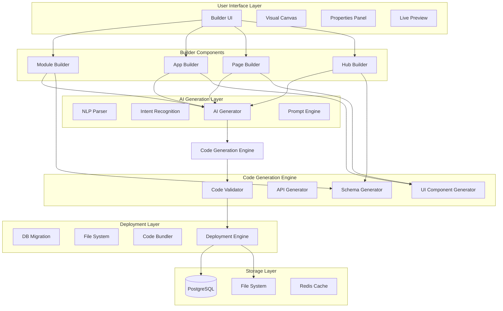
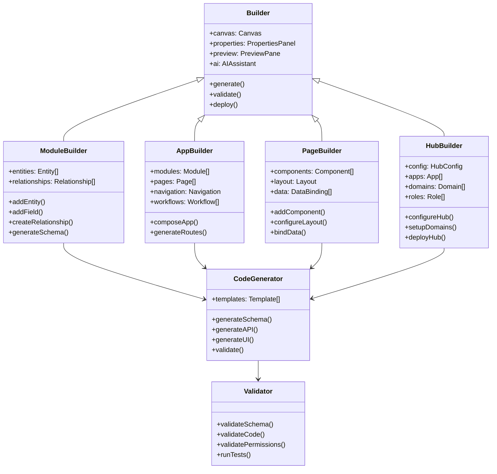

# WytBuilder System Architecture

**Version**: 1.0  
**Last Updated**: October 2025  
**Status**: Design Phase

---

## Overview

**WytBuilder** is a comprehensive no-code platform that enables Super Admins to create complete features (modules, apps, pages, hubs) through visual drag-drop interfaces and AI-powered natural language generation.

### Core Principles

1. **Zero-Code Creation**: Build complete features without writing code
2. **AI-First**: Natural language to production-ready features
3. **Visual Development**: Drag-drop interface for all components
4. **Production-Ready**: Generated code meets quality standards
5. **Instant Deployment**: Live changes with validation

### Architectural Goals

- **Modularity**: Each builder is independent but composable
- **Extensibility**: Easy to add new component types
- **Performance**: Sub-second generation for simple features
- **Safety**: Multiple validation layers before deployment
- **Reversibility**: All changes can be undone

---

## System Architecture

### High-Level Architecture



### Component Diagram



---

## Module Builder Architecture

### Entity-Relationship Model

```typescript
interface Entity {
  id: string;
  name: string;
  displayName: string;
  description?: string;
  icon: string;
  color: string;
  fields: Field[];
  relationships: Relationship[];
  permissions: EntityPermissions;
  ui: UIConfiguration;
}

interface Field {
  id: string;
  name: string;
  type: FieldType;
  displayName: string;
  description?: string;
  validation: ValidationRules;
  defaultValue?: any;
  isRequired: boolean;
  isUnique: boolean;
  isPrimary: boolean;
  permissions: FieldPermissions;
}

type FieldType = 
  | 'text' 
  | 'number' 
  | 'boolean' 
  | 'date' 
  | 'datetime'
  | 'email'
  | 'url'
  | 'phone'
  | 'textarea'
  | 'richtext'
  | 'select'
  | 'multiselect'
  | 'file'
  | 'image'
  | 'video'
  | 'json'
  | 'relation';

interface Relationship {
  id: string;
  type: 'oneToOne' | 'oneToMany' | 'manyToMany';
  sourceEntity: string;
  targetEntity: string;
  sourceField: string;
  targetField: string;
  cascadeDelete: boolean;
  required: boolean;
}

interface ValidationRules {
  min?: number;
  max?: number;
  minLength?: number;
  maxLength?: number;
  pattern?: string;
  custom?: string; // Custom validation function
}
```

### Drag-Drop Implementation

**Technology**: `@dnd-kit/core` for drag-drop functionality

**Components**:

1. **Component Palette** (Draggable Source):
```typescript
interface ComponentPalette {
  categories: {
    entities: EntityTemplate[];
    fields: FieldTemplate[];
    relationships: RelationshipTemplate[];
    actions: ActionTemplate[];
  };
}

// Draggable Entity
<Draggable id="entity-template" data={{ type: 'entity' }}>
  <EntityCard icon="📦" name="New Entity" />
</Draggable>
```

2. **Canvas** (Drop Zone):
```typescript
interface Canvas {
  entities: PlacedEntity[];
  relationships: RenderedRelationship[];
  zoom: number;
  pan: { x: number; y: number };
}

// Droppable Canvas
<Droppable id="canvas">
  {entities.map(entity => (
    <EntityNode 
      key={entity.id} 
      entity={entity}
      position={entity.position}
      onConnect={handleRelationship}
    />
  ))}
</Droppable>
```

3. **Visual Relationship Connectors**:
```typescript
// SVG-based relationship lines
<svg className="relationships-layer">
  {relationships.map(rel => (
    <RelationshipLine
      key={rel.id}
      from={rel.source}
      to={rel.target}
      type={rel.type}
      style={rel.style}
    />
  ))}
</svg>
```

### Schema Generation Pipeline

**Input**: Visual entity model  
**Output**: Drizzle ORM schema + Zod validation

```typescript
class SchemaGenerator {
  generateDrizzleSchema(entities: Entity[]): string {
    return entities.map(entity => {
      const fields = entity.fields.map(field => 
        this.generateDrizzleField(field)
      ).join(',\n  ');
      
      return `
export const ${entity.name} = pgTable('${toSnakeCase(entity.name)}', {
  id: uuid('id').defaultRandom().primaryKey(),
  ${fields},
  createdAt: timestamp('created_at').defaultNow().notNull(),
  updatedAt: timestamp('updated_at').defaultNow().notNull(),
});
      `.trim();
    }).join('\n\n');
  }
  
  generateDrizzleField(field: Field): string {
    const typeMap = {
      text: 'text',
      number: 'integer',
      boolean: 'boolean',
      date: 'date',
      datetime: 'timestamp',
      email: 'text',
      // ... more mappings
    };
    
    let code = `${field.name}: ${typeMap[field.type]}('${toSnakeCase(field.name)}')`;
    
    if (field.isRequired) code += '.notNull()';
    if (field.isUnique) code += '.unique()';
    if (field.defaultValue) code += `.default(${JSON.stringify(field.defaultValue)})`;
    
    return code;
  }
  
  generateZodSchema(entities: Entity[]): string {
    return entities.map(entity => {
      const fields = entity.fields.map(field =>
        this.generateZodField(field)
      ).join(',\n  ');
      
      return `
export const insert${pascalCase(entity.name)}Schema = createInsertSchema(${entity.name}).extend({
  ${fields}
});

export type Insert${pascalCase(entity.name)} = z.infer<typeof insert${pascalCase(entity.name)}Schema>;
export type ${pascalCase(entity.name)} = typeof ${entity.name}.$inferSelect;
      `.trim();
    }).join('\n\n');
  }
  
  generateZodField(field: Field): string {
    const typeMap = {
      text: 'z.string()',
      number: 'z.number()',
      boolean: 'z.boolean()',
      email: 'z.string().email()',
      url: 'z.string().url()',
      // ... more mappings
    };
    
    let zodType = typeMap[field.type] || 'z.string()';
    
    if (field.validation.minLength) {
      zodType += `.min(${field.validation.minLength})`;
    }
    if (field.validation.maxLength) {
      zodType += `.max(${field.validation.maxLength})`;
    }
    if (field.validation.pattern) {
      zodType += `.regex(/${field.validation.pattern}/)`;
    }
    
    return `${field.name}: ${zodType}`;
  }
}
```

### API Generation Pipeline

**Input**: Entity model  
**Output**: Express.js CRUD routes

```typescript
class APIGenerator {
  generateCRUDRoutes(entity: Entity): string {
    const entityName = entity.name;
    const tableName = toSnakeCase(entity.name);
    
    return `
import { Router } from 'express';
import { db } from '../db';
import { ${entityName}, insert${pascalCase(entityName)}Schema } from '@shared/schema';
import { eq } from 'drizzle-orm';
import { adminAuthMiddleware, requirePermission } from '../customAuth';

const router = Router();

// GET /${tableName} - List all
router.get('/${tableName}', adminAuthMiddleware, requirePermission('${entityName}', 'view'), async (req, res) => {
  try {
    const items = await db.select().from(${entityName});
    res.json({ success: true, data: items });
  } catch (error) {
    console.error('Error fetching ${tableName}:', error);
    res.status(500).json({ success: false, error: 'Failed to fetch ${tableName}' });
  }
});

// GET /${tableName}/:id - Get by ID
router.get('/${tableName}/:id', adminAuthMiddleware, requirePermission('${entityName}', 'view'), async (req, res) => {
  try {
    const [item] = await db
      .select()
      .from(${entityName})
      .where(eq(${entityName}.id, req.params.id))
      .limit(1);
      
    if (!item) {
      return res.status(404).json({ success: false, error: '${entityName} not found' });
    }
    
    res.json({ success: true, data: item });
  } catch (error) {
    console.error('Error fetching ${entityName}:', error);
    res.status(500).json({ success: false, error: 'Failed to fetch ${entityName}' });
  }
});

// POST /${tableName} - Create
router.post('/${tableName}', adminAuthMiddleware, requirePermission('${entityName}', 'create'), async (req, res) => {
  try {
    const validatedData = insert${pascalCase(entityName)}Schema.parse(req.body);
    const [newItem] = await db.insert(${entityName}).values(validatedData).returning();
    res.status(201).json({ success: true, data: newItem });
  } catch (error: any) {
    console.error('Error creating ${entityName}:', error);
    if (error.name === 'ZodError') {
      return res.status(400).json({ success: false, error: 'Invalid data', details: error.errors });
    }
    res.status(500).json({ success: false, error: 'Failed to create ${entityName}' });
  }
});

// PUT /${tableName}/:id - Update
router.put('/${tableName}/:id', adminAuthMiddleware, requirePermission('${entityName}', 'edit'), async (req, res) => {
  try {
    const validatedData = insert${pascalCase(entityName)}Schema.partial().parse(req.body);
    const [updatedItem] = await db
      .update(${entityName})
      .set(validatedData)
      .where(eq(${entityName}.id, req.params.id))
      .returning();
      
    if (!updatedItem) {
      return res.status(404).json({ success: false, error: '${entityName} not found' });
    }
    
    res.json({ success: true, data: updatedItem });
  } catch (error: any) {
    console.error('Error updating ${entityName}:', error);
    if (error.name === 'ZodError') {
      return res.status(400).json({ success: false, error: 'Invalid data', details: error.errors });
    }
    res.status(500).json({ success: false, error: 'Failed to update ${entityName}' });
  }
});

// DELETE /${tableName}/:id - Delete
router.delete('/${tableName}/:id', adminAuthMiddleware, requirePermission('${entityName}', 'delete'), async (req, res) => {
  try {
    const [deletedItem] = await db
      .delete(${entityName})
      .where(eq(${entityName}.id, req.params.id))
      .returning();
      
    if (!deletedItem) {
      return res.status(404).json({ success: false, error: '${entityName} not found' });
    }
    
    res.json({ success: true, message: '${entityName} deleted successfully' });
  } catch (error) {
    console.error('Error deleting ${entityName}:', error);
    res.status(500).json({ success: false, error: 'Failed to delete ${entityName}' });
  }
});

export default router;
    `.trim();
  }
}
```

### UI Component Generation

**Input**: Entity model  
**Output**: React components (List, Form, Detail views)

```typescript
class UIComponentGenerator {
  generateListComponent(entity: Entity): string {
    const componentName = `${pascalCase(entity.name)}List`;
    
    return `
import { useQuery, useMutation } from '@tanstack/react-query';
import { queryClient, apiRequest } from '@/lib/queryClient';
import { Button } from '@/components/ui/button';
import { Plus, Edit, Trash } from 'lucide-react';
import { DataTable } from '@/components/ui/data-table';
import type { ${pascalCase(entity.name)} } from '@shared/schema';

export function ${componentName}() {
  const { data, isLoading } = useQuery<{ data: ${pascalCase(entity.name)}[] }>({
    queryKey: ['/api/admin/${toKebabCase(entity.name)}'],
  });
  
  const deleteMutation = useMutation({
    mutationFn: (id: string) => apiRequest(\`/api/admin/${toKebabCase(entity.name)}/\${id}\`, {
      method: 'DELETE',
    }),
    onSuccess: () => {
      queryClient.invalidateQueries({ queryKey: ['/api/admin/${toKebabCase(entity.name)}'] });
    },
  });
  
  const columns = [
    ${entity.fields.slice(0, 5).map(field => `
    {
      accessorKey: '${field.name}',
      header: '${field.displayName}',
    },
    `).join('')}
    {
      id: 'actions',
      cell: ({ row }) => (
        <div className="flex gap-2">
          <Button size="sm" variant="ghost">
            <Edit className="h-4 w-4" />
          </Button>
          <Button 
            size="sm" 
            variant="ghost"
            onClick={() => deleteMutation.mutate(row.original.id)}
          >
            <Trash className="h-4 w-4" />
          </Button>
        </div>
      ),
    },
  ];
  
  if (isLoading) return <div>Loading...</div>;
  
  return (
    <div className="space-y-4">
      <div className="flex justify-between items-center">
        <h1 className="text-2xl font-bold">${entity.displayName}</h1>
        <Button>
          <Plus className="h-4 w-4 mr-2" />
          Add ${entity.displayName}
        </Button>
      </div>
      <DataTable columns={columns} data={data?.data || []} />
    </div>
  );
}
    `.trim();
  }
}
```

---

## App Builder Architecture

### App Composition Model

```typescript
interface App {
  id: string;
  name: string;
  description: string;
  icon: string;
  modules: ModuleReference[];
  pages: Page[];
  navigation: NavigationConfig;
  workflows: Workflow[];
  pricing: PricingConfig;
  branding: BrandingConfig;
}

interface ModuleReference {
  moduleId: string;
  isIncluded: boolean;
  customization?: ModuleCustomization;
  permissions?: ModulePermissions;
}

interface NavigationConfig {
  structure: 'sidebar' | 'top' | 'bottom' | 'custom';
  items: NavigationItem[];
  branding: {
    logo: string;
    name: string;
    tagline?: string;
  };
}

interface Workflow {
  id: string;
  name: string;
  trigger: WorkflowTrigger;
  actions: WorkflowAction[];
  conditions: WorkflowCondition[];
}
```

### Module Integration System

**Challenge**: Compose independent modules into cohesive app

**Solution**: Module Adapter Pattern

```typescript
class ModuleAdapter {
  adaptModule(module: Module, app: App): AdaptedModule {
    return {
      ...module,
      routes: this.adaptRoutes(module.routes, app.basePath),
      navigation: this.adaptNavigation(module.navigation, app.navigation),
      permissions: this.mergePermissions(module.permissions, app.permissions),
      data: this.setupDataIntegration(module, app),
    };
  }
  
  adaptRoutes(routes: Route[], basePath: string): Route[] {
    return routes.map(route => ({
      ...route,
      path: `${basePath}${route.path}`,
      component: this.wrapWithAppContext(route.component),
    }));
  }
  
  setupDataIntegration(module: Module, app: App): DataIntegration {
    // Enable cross-module data access
    return {
      sharedEntities: this.findSharedEntities(module, app),
      dataFlows: this.setupDataFlows(module, app),
      eventBridge: this.setupEventBridge(module, app),
    };
  }
}
```

---

## Page Builder Architecture

### Component System

**Component Library**: 50+ pre-built components

**Categories**:
1. **Layout**: Container, Grid, Flex, Stack, Divider
2. **Typography**: Heading, Text, Quote, Code
3. **Forms**: Input, Select, Checkbox, Radio, Switch, Slider
4. **Data Display**: Table, Card, List, Avatar, Badge
5. **Feedback**: Alert, Toast, Progress, Skeleton
6. **Media**: Image, Video, Audio, Icon
7. **Navigation**: Link, Button, Breadcrumb, Tabs, Menu

**Component Schema**:
```typescript
interface Component {
  id: string;
  type: ComponentType;
  props: ComponentProps;
  children: Component[];
  style: StyleConfig;
  data: DataBinding;
  events: EventHandler[];
  conditions: RenderCondition[];
}

interface ComponentProps {
  [key: string]: any;
  className?: string;
  testId?: string;
}

interface DataBinding {
  source: 'static' | 'api' | 'module' | 'context';
  path?: string;
  transform?: string; // JavaScript expression
}

interface RenderCondition {
  type: 'show' | 'hide' | 'enable' | 'disable';
  expression: string; // Boolean expression
}
```

### Layout Engine

**Responsive Grid System**:
```typescript
interface Layout {
  desktop: GridLayout;
  tablet: GridLayout;
  mobile: GridLayout;
}

interface GridLayout {
  columns: number;
  rows: number;
  gap: number;
  areas: GridArea[];
}

interface GridArea {
  id: string;
  component: Component;
  position: {
    row: { start: number; end: number };
    column: { start: number; end: number };
  };
}
```

**Breakpoints**:
- Mobile: < 768px
- Tablet: 768px - 1024px
- Desktop: > 1024px

---

## Hub Builder Architecture

### Multi-Domain Routing

```typescript
interface HubDomainConfig {
  primaryDomain: string; // hub-name.wytnet.com
  customDomains: CustomDomain[];
  aliases: string[];
}

interface CustomDomain {
  domain: string;
  verified: boolean;
  sslStatus: 'pending' | 'active' | 'failed';
  dnsRecords: DNSRecord[];
}

class DomainRouter {
  routeRequest(req: Request): Hub {
    const hostname = req.hostname;
    
    // Check custom domains first
    const hubByCustomDomain = this.findByCustomDomain(hostname);
    if (hubByCustomDomain) return hubByCustomDomain;
    
    // Check primary domains
    const hubByPrimaryDomain = this.findByPrimaryDomain(hostname);
    if (hubByPrimaryDomain) return hubByPrimaryDomain;
    
    // Default hub
    return this.getDefaultHub();
  }
}
```

### Hub Isolation

**Tenant Isolation at Hub Level**:
```typescript
interface HubContext {
  hubId: string;
  tenantId: string;
  domain: string;
  config: HubConfig;
  theme: Theme;
  apps: App[];
}

// Middleware to set hub context
function hubContextMiddleware(req: Request, res: Response, next: Next) {
  const hub = domainRouter.routeRequest(req);
  req.hubContext = hub;
  next();
}
```

---

## Code Validation System

### Multi-Layer Validation

```typescript
class CodeValidator {
  async validate(generatedCode: GeneratedCode): Promise<ValidationResult> {
    const results = await Promise.all([
      this.validateSyntax(generatedCode),
      this.validateTypes(generatedCode),
      this.validateSecurity(generatedCode),
      this.validatePerformance(generatedCode),
      this.validateAccessibility(generatedCode),
    ]);
    
    return this.aggregateResults(results);
  }
  
  async validateSyntax(code: GeneratedCode): Promise<ValidationResult> {
    // Use ESLint to check syntax
    const linter = new ESLint();
    const results = await linter.lintText(code.content);
    
    return {
      passed: results.every(r => r.errorCount === 0),
      errors: results.flatMap(r => r.messages),
    };
  }
  
  async validateTypes(code: GeneratedCode): Promise<ValidationResult> {
    // Use TypeScript compiler API
    const program = ts.createProgram([code.filePath], {
      strict: true,
      noEmit: true,
    });
    
    const diagnostics = ts.getPreEmitDiagnostics(program);
    
    return {
      passed: diagnostics.length === 0,
      errors: diagnostics.map(d => d.messageText),
    };
  }
  
  async validateSecurity(code: GeneratedCode): Promise<ValidationResult> {
    const issues: string[] = [];
    
    // Check for SQL injection vulnerabilities
    if (code.content.includes('${') && code.content.includes('sql`')) {
      issues.push('Potential SQL injection: Use parameterized queries');
    }
    
    // Check for XSS vulnerabilities
    if (code.content.includes('dangerouslySetInnerHTML')) {
      issues.push('XSS risk: Avoid dangerouslySetInnerHTML');
    }
    
    // Check for exposed secrets
    if (code.content.match(/api[_-]?key|secret|password/i)) {
      issues.push('Potential secret exposure: Use environment variables');
    }
    
    return {
      passed: issues.length === 0,
      errors: issues,
    };
  }
}
```

---

## Deployment System

### Safe Deployment Pipeline

```typescript
class DeploymentEngine {
  async deploy(generatedCode: GeneratedCode): Promise<DeploymentResult> {
    try {
      // 1. Backup current state
      const backup = await this.createBackup();
      
      // 2. Validate code
      const validation = await this.validator.validate(generatedCode);
      if (!validation.passed) {
        throw new Error('Validation failed', validation.errors);
      }
      
      // 3. Run database migrations (in transaction)
      await this.runMigrations(generatedCode.migrations);
      
      // 4. Write files
      await this.writeFiles(generatedCode.files);
      
      // 5. Update server configuration
      await this.updateConfig(generatedCode.config);
      
      // 6. Restart services if needed
      if (generatedCode.requiresRestart) {
        await this.restartServices();
      }
      
      // 7. Verify deployment
      const health = await this.healthCheck();
      if (!health.healthy) {
        // Rollback
        await this.rollback(backup);
        throw new Error('Health check failed');
      }
      
      return {
        success: true,
        deployedAt: new Date(),
        files: generatedCode.files.map(f => f.path),
      };
      
    } catch (error) {
      console.error('Deployment failed:', error);
      await this.rollback(backup);
      throw error;
    }
  }
  
  async createBackup(): Promise<Backup> {
    return {
      timestamp: new Date(),
      database: await this.backupDatabase(),
      files: await this.backupFiles(),
      config: await this.backupConfig(),
    };
  }
  
  async rollback(backup: Backup): Promise<void> {
    await this.restoreDatabase(backup.database);
    await this.restoreFiles(backup.files);
    await this.restoreConfig(backup.config);
    await this.restartServices();
  }
}
```

---

## Performance Optimization

### Code Splitting

```typescript
// Lazy load builder components
const ModuleBuilder = lazy(() => import('./builders/ModuleBuilder'));
const AppBuilder = lazy(() => import('./builders/AppBuilder'));
const PageBuilder = lazy(() => import('./builders/PageBuilder'));
const HubBuilder = lazy(() => import('./builders/HubBuilder'));
```

### Caching Strategy

```typescript
interface CacheStrategy {
  // Cache generated code templates
  templates: LRUCache<string, Template>;
  
  // Cache component metadata
  components: Map<string, ComponentMetadata>;
  
  // Cache AI responses for common prompts
  aiResponses: LRUCache<string, AIResponse>;
  
  // Cache validation results
  validations: Map<string, ValidationResult>;
}
```

---

## Security Considerations

### Code Execution Sandbox

```typescript
class SandboxExecutor {
  async execute(code: string, timeout: number = 5000): Promise<any> {
    const vm = new VM({
      timeout,
      sandbox: {
        // Whitelist safe APIs only
        console: { log: (...args) => this.log(...args) },
        Math,
        JSON,
        Date,
      },
    });
    
    try {
      return await vm.run(code);
    } catch (error) {
      if (error.message.includes('timeout')) {
        throw new Error('Code execution timeout');
      }
      throw error;
    }
  }
}
```

### Permission Enforcement

```typescript
// Every generated API route includes permission check
router.get('/api/entity', adminAuthMiddleware, requirePermission('entity', 'view'), handler);
```

---

## Technology Stack

### Frontend
- **React 18**: UI framework
- **TypeScript**: Type safety
- **@dnd-kit/core**: Drag-drop functionality
- **Monaco Editor**: Code editing
- **React Flow**: Visual graph editor
- **TanStack Query**: Data fetching
- **Zod**: Runtime validation

### Backend
- **Node.js**: Runtime
- **Express.js**: Web framework
- **Drizzle ORM**: Database ORM
- **TypeScript Compiler API**: Code generation
- **ESLint**: Code linting
- **ts-morph**: TypeScript manipulation

### AI Integration
- **OpenAI GPT-4o**: Code generation
- **Claude 3.5 Sonnet**: Complex logic
- **Custom prompts**: Domain-specific generation

---

## Future Enhancements

### Phase 4 Possibilities

1. **Version Control Integration**:
   - Git integration for all changes
   - Branch-based development
   - Pull request workflow

2. **Collaborative Building**:
   - Real-time collaboration
   - Shared builder sessions
   - Comments and reviews

3. **Marketplace**:
   - Share custom modules
   - Template marketplace
   - Community components

4. **Advanced AI**:
   - Voice commands
   - Screen mockup to code
   - Natural language debugging

---

## References

- [PRD: Self-Service Platform](/en/prd/self-service-platform)
- [Module System](/en/core-concepts)
- [RBAC Architecture](/en/architecture/rbac)
- [Database Schema](/en/architecture/database)
