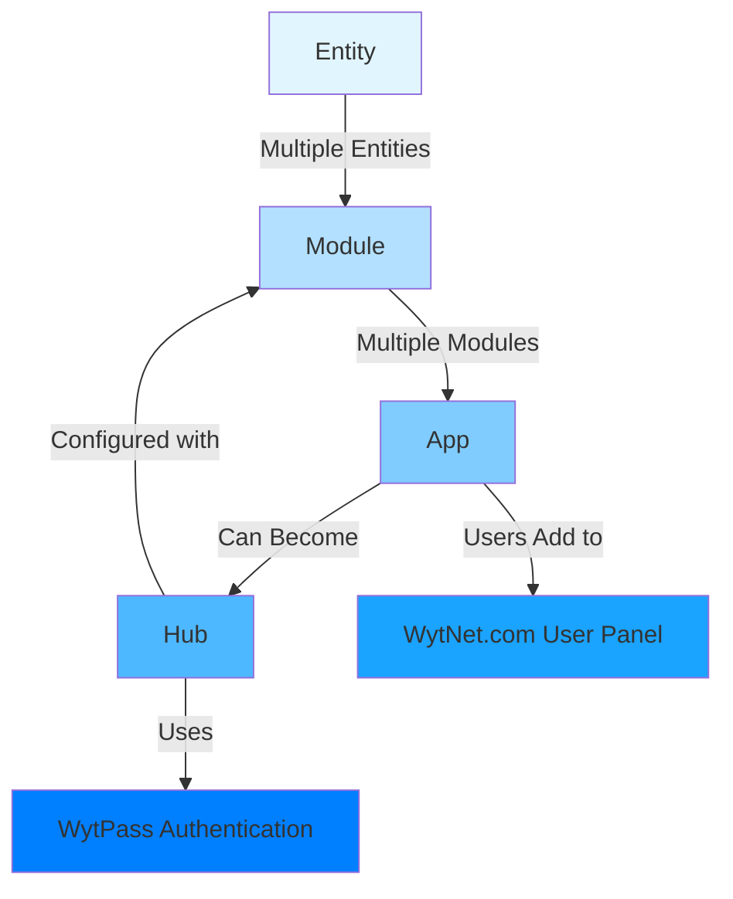
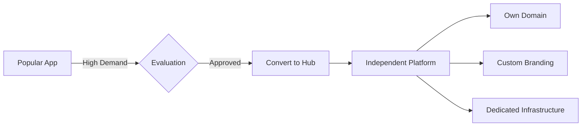
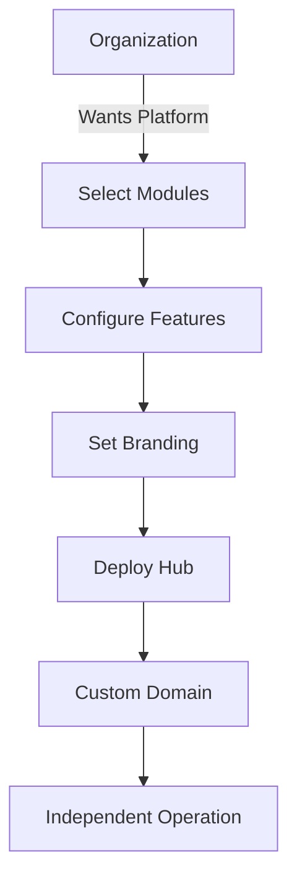
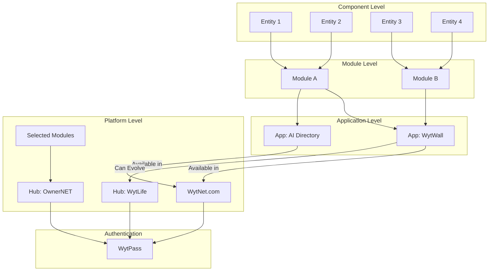

# Core Concepts

## Platform Architecture Hierarchy

WytNet follows a hierarchical architecture that builds from the smallest components to fully independent platforms:



## 1. Entity (பாகம்)

**Definition**: The smallest functional component of the platform.

- **What it is**: A single, self-contained piece of functionality or data structure
- **Examples**:
  - User Profile Form
  - Comment Section
  - Like Button
  - Post Card
  - Image Upload Widget
  - Date Picker

**Characteristics**:
- Reusable across different contexts
- Single responsibility
- Can be configured with properties
- Database table representation

---

## 2. Module (தொகுப்பு)

**Definition**: A collection of related Entities that work together to provide a complete feature.

- **What it is**: Multiple Entities combined to create a cohesive functionality
- **Examples**:
  - **User Management Module**:
    - User Profile Entity
    - User Settings Entity
    - User Avatar Entity
    - User Preferences Entity
  
  - **Social Feed Module**:
    - Post Entity
    - Comment Entity
    - Like Entity
    - Share Entity
    - Media Entity

**Characteristics**:
- Contains multiple related Entities
- Provides a complete feature set
- Can be used across different Apps
- Has its own API endpoints
- Manages related database tables

**Module Structure**:
```
Module
├── Entities (multiple)
├── Business Logic
├── API Routes
├── Database Schema
└── UI Components
```

---

## 3. App (பயன்பாடு)

**Definition**: A collection of Modules that together create a user-facing application within WytNet.com.

- **What it is**: Multiple Modules combined to provide a complete user application
- **Where it lives**: Inside WytNet.com platform
- **How users interact**: Users can "Add" Apps to their "MyWyt Apps" panel

**Examples**:

### **WytWall App**
```
WytWall
├── Social Feed Module
│   ├── Post Entity
│   ├── Comment Entity
│   ├── Like Entity
│   └── Share Entity
├── Media Module
│   ├── Image Upload Entity
│   ├── Video Upload Entity
│   └── Media Gallery Entity
├── Moderation Module
│   ├── Admin Approval Entity
│   ├── Content Filter Entity
│   └── Report Entity
└── Notification Module
    ├── Real-time Notification Entity
    └── Notification History Entity
```

### **AI Directory App**
```
AI Directory
├── Directory Listing Module
│   ├── Tool Card Entity
│   ├── Search Entity
│   └── Filter Entity
├── Category Module
│   ├── Category Browser Entity
│   └── Tag Entity
└── User Interaction Module
    ├── Rating Entity
    ├── Review Entity
    └── Bookmark Entity
```

**Characteristics**:
- Composed of multiple Modules
- Available in WytNet.com user panel
- Users can enable/disable Apps
- Each App has its own dedicated section
- Shares WytPass authentication
- Can access shared user data

**App Lifecycle**:
1. **Development**: Built using Modules and Entities
2. **Publishing**: Made available in WytNet App Store
3. **Discovery**: Users browse available Apps
4. **Installation**: Users add App to their panel
5. **Usage**: Users access App features
6. **Evolution**: Popular Apps can become Hubs

---

## 4. Hub (தன்னிச்சையான போர்டல்)

**Definition**: A fully independent web portal or mobile application that operates autonomously.

- **What it is**: A standalone platform that can exist independently
- **Authentication**: Uses WytPass authentication system
- **Configuration**: Built using Modules

**Hub Creation Methods**:

### **Method 1: App Evolution**
When an App gains significant user adoption and demand:



**Example**: 
- WytLife starts as an App within WytNet.com
- Gains 100,000+ active users
- High feature request demand
- Platform decides to promote it to Hub status
- Becomes life.wytnet.com or wytlife.com
- Operates independently but uses WytPass

### **Method 2: Custom Hub Creation**
Developers, companies, or organizations create custom Hubs:



**Examples**:
- **OwnerNET Hub**: Property management platform
  - Property Management Module
  - Tenant Management Module
  - Maintenance Module
  - Payment Module

- **MarketPlace Hub**: E-commerce platform
  - Product Catalog Module
  - Shopping Cart Module
  - Payment Gateway Module
  - Order Management Module

**Hub Characteristics**:
- Fully independent operation
- Own domain name (custom or subdomain)
- Custom branding and theming
- Uses WytPass for authentication
- Can have Hub-specific features
- Multi-tenant capable
- Own admin panel
- Can integrate select WytNet Apps

**Hub vs App**:

| Aspect | App | Hub |
|--------|-----|-----|
| **Location** | Inside WytNet.com | Independent platform |
| **Domain** | wytnet.com/app-name | custom.com or hub.wytnet.com |
| **Branding** | WytNet branding | Custom branding |
| **Admin** | WytNet Admin | Hub Admin + WytNet Super Admin |
| **Independence** | Depends on WytNet.com | Fully autonomous |
| **Users** | WytNet users | Own user base (via WytPass) |
| **Deployment** | Part of WytNet | Separate deployment |

---

## Architecture Flow

Here's how the components flow from smallest to largest:



---

## Real-World Example: Social Post Feature

Let's trace a social post feature through all levels:

### Level 1: Entities
```
- Post Text Entity (input field, character counter)
- Post Media Entity (image upload, video upload)
- Post Privacy Entity (public/private selector)
- Post Actions Entity (edit, delete buttons)
```

### Level 2: Module
```
Social Feed Module
├── Post Creation
│   ├── Post Text Entity
│   ├── Post Media Entity
│   └── Post Privacy Entity
├── Post Display
│   ├── Post Card Entity
│   ├── Author Info Entity
│   └── Timestamp Entity
└── Post Interaction
    ├── Like Entity
    ├── Comment Entity
    └── Share Entity
```

### Level 3: App
```
WytWall App (inside WytNet.com)
├── Social Feed Module
├── User Profile Module
├── Notification Module
└── Media Gallery Module

Users can add WytWall to their MyWyt Apps panel
```

### Level 4: Hub
```
If WytWall becomes very popular:
→ Converts to WytWall Hub
→ Own domain: wytwall.com
→ Independent operation
→ Still uses WytPass authentication
→ Custom features for social networking
```

---

## Key Principles

1. **Composability**: Smaller components build into larger systems
2. **Reusability**: Entities and Modules can be reused across Apps and Hubs
3. **Scalability**: Apps can evolve into Hubs as demand grows
4. **Flexibility**: Organizations can build custom Hubs from existing Modules
5. **Unified Authentication**: All levels use WytPass authentication
6. **Multi-tenancy**: Each Hub operates independently but shares infrastructure

---

## Next Steps

- [WytPass Authentication →](/en/features/wytpass)
- [Database Schema →](/en/architecture/database-schema)
- [Module System →](/en/architecture/system-overview)
- [Hub Management →](/en/admin/hub-panel)
