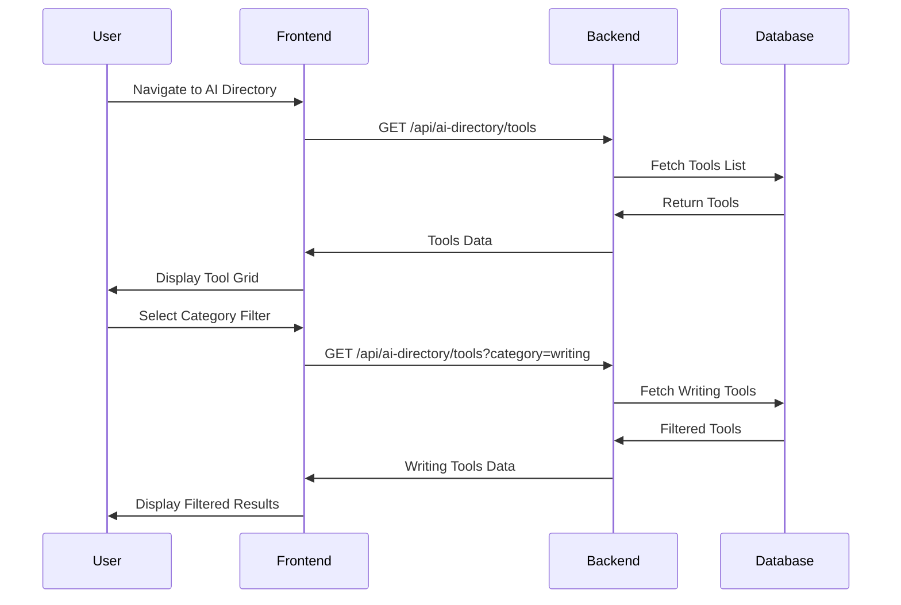
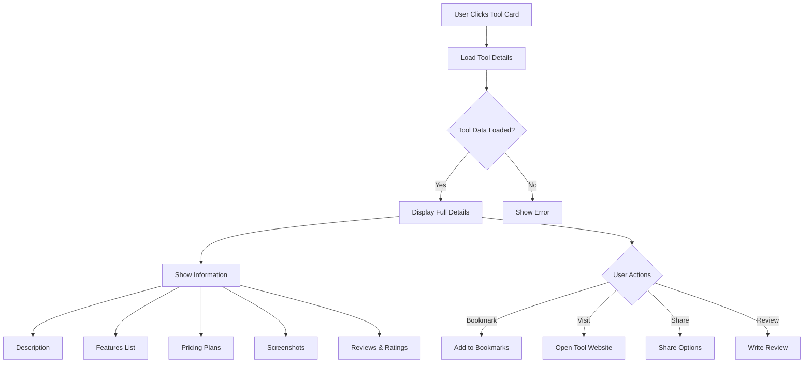
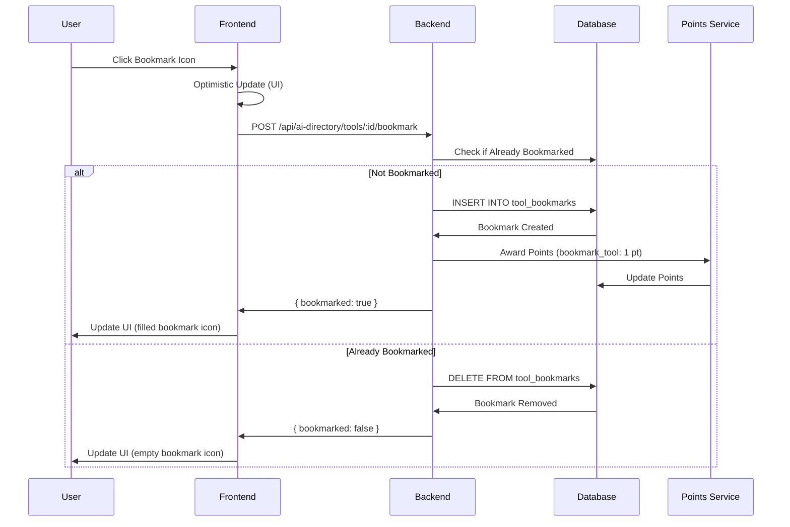
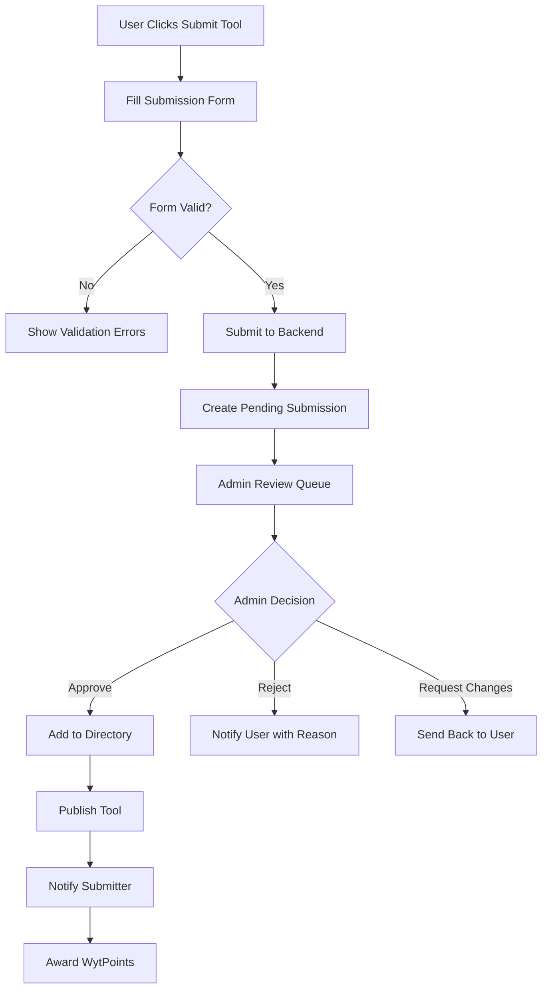

# AI Directory - Curated AI Tools Database

## Overview

**AI Directory** is a comprehensive, curated directory of AI tools and platforms within WytNet. It helps users discover, explore, and save AI tools across various categories, from productivity to creativity, with detailed information, ratings, and direct links to each tool.

### Key Features

- **Curated Collection**: Hand-picked AI tools across 20+ categories
- **Advanced Search**: Find tools by category, features, pricing, and use case
- **Tool Ratings & Reviews**: Community ratings and detailed reviews
- **Bookmark System**: Save favorite tools to personal collection
- **Comparison Tool**: Compare multiple AI tools side-by-side
- **Submission System**: Users can submit new AI tools for review
- **Integration Links**: Direct links to tool websites and documentation
- **Regular Updates**: New tools added weekly

---

## Use Cases

### For Different User Types

**1. Business Professionals**
- Find AI tools for automation
- Discover productivity enhancers
- Compare pricing plans
- Read real user reviews

**2. Content Creators**
- Explore creative AI tools
- Find image/video generators
- Discover writing assistants
- Compare features

**3. Developers**
- Find AI APIs and SDKs
- Explore development tools
- Compare technical specs
- Access documentation

**4. Students & Educators**
- Discover learning AI tools
- Find research assistants
- Explore educational platforms
- Access free tools

---

## User Workflow

### 1. Browsing the Directory



**Directory Page Layout**:

```
┌──────────────────────────────────────────────────┐
│  AI Directory                    [Submit Tool] [My Bookmarks]│
│  Discover the best AI tools for any task        │
├──────────────────────────────────────────────────┤
│                                                  │
│  [Search: "Search tools..."]                    │
│                                                  │
│  Categories:                                     │
│  [All] [Writing] [Image Gen] [Video] [Code]    │
│  [Data] [Marketing] [Design] [Audio] [More...]  │
│                                                  │
│  Filters:                                        │
│  Pricing: [All] [Free] [Freemium] [Paid]       │
│  Platform: [Web] [API] [Desktop] [Mobile]       │
│                                                  │
├──────────────────────────────────────────────────┤
│                                                  │
│  Featured AI Tools (24 tools found)              │
│                                                  │
│  ┌────────────────────────────────────────┐    │
│  │ 🤖 ChatGPT                  [Bookmark] │    │
│  │ Conversational AI Assistant             │    │
│  │ OpenAI • Writing, Chat, Code            │    │
│  │ ⭐⭐⭐⭐⭐ 4.9 (12.5k reviews)            │    │
│  │ Pricing: Freemium • Platform: Web       │    │
│  │ [View Details] [Visit Tool →]          │    │
│  └────────────────────────────────────────┘    │
│                                                  │
│  ┌────────────────────────────────────────┐    │
│  │ 🎨 Midjourney                [Bookmark] │    │
│  │ AI Image Generation                     │    │
│  │ Midjourney • Design, Art                │    │
│  │ ⭐⭐⭐⭐ 4.7 (8.2k reviews)              │    │
│  │ Pricing: Paid • Platform: Web + Discord │    │
│  │ [View Details] [Visit Tool →]          │    │
│  └────────────────────────────────────────┘    │
│                                                  │
└──────────────────────────────────────────────────┘
```

---

### 2. Tool Detail View



**Tool Detail Page Layout**:

```
┌──────────────────────────────────────────────────┐
│  🤖 ChatGPT                                      │
│  by OpenAI                          [Bookmark ⭐]│
├──────────────────────────────────────────────────┤
│                                                  │
│  🏷️ Categories: Writing, Chat, Code, Research  │
│  💰 Pricing: Freemium (Free + $20/mo Pro)       │
│  🌐 Platform: Web, iOS, Android, API            │
│  📅 Added: Jan 2023 • Updated: Oct 2025         │
│                                                  │
│  ⭐⭐⭐⭐⭐ 4.9/5 (12,543 reviews)                 │
│                                                  │
│  [Visit Tool →] [Read Documentation] [Compare]  │
│                                                  │
├──────────────────────────────────────────────────┤
│                                                  │
│  ## About                                        │
│  ChatGPT is a conversational AI assistant        │
│  powered by GPT-4. It can help with writing,     │
│  coding, research, and creative tasks...         │
│                                                  │
│  ## Key Features                                 │
│  ✓ Natural language conversations                │
│  ✓ Code generation and debugging                 │
│  ✓ Content creation and editing                  │
│  ✓ Data analysis and visualization               │
│  ✓ Multiple languages support                    │
│  ✓ Custom instructions                           │
│                                                  │
│  ## Pricing Plans                                │
│  ┌─────────────────────────────────────┐       │
│  │ Free Plan                           │       │
│  │ • Basic GPT-3.5 access              │       │
│  │ • Standard response time            │       │
│  │ • Web access                        │       │
│  └─────────────────────────────────────┘       │
│                                                  │
│  ┌─────────────────────────────────────┐       │
│  │ Plus Plan - $20/month               │       │
│  │ • GPT-4 access                      │       │
│  │ • Priority access                   │       │
│  │ • Faster response times             │       │
│  │ • Advanced features                 │       │
│  └─────────────────────────────────────┘       │
│                                                  │
│  ## Screenshots                                  │
│  [Image Gallery]                                 │
│                                                  │
│  ## User Reviews (12,543)                        │
│  ⭐⭐⭐⭐⭐ "Game changer for productivity!"      │
│  by @john_doe • 2 days ago                      │
│                                                  │
│  ⭐⭐⭐⭐ "Great but can be slow sometimes"       │
│  by @jane_smith • 1 week ago                    │
│                                                  │
│  [Write a Review]                                │
│                                                  │
└──────────────────────────────────────────────────┘
```

---

### 3. Search & Filter

**Advanced Search Capabilities**:

```typescript
interface SearchFilters {
  query?: string;                  // Text search
  category?: string[];             // Multiple categories
  pricing?: "free" | "freemium" | "paid";
  platform?: string[];             // "web", "api", "mobile"
  minRating?: number;              // 0-5
  features?: string[];             // Required features
  sortBy?: "rating" | "popular" | "recent" | "name";
}
```

**API Endpoint**: `GET /api/ai-directory/tools`

**Query Parameters Example**:
```http
GET /api/ai-directory/tools?
  category=writing,code&
  pricing=freemium&
  platform=web&
  minRating=4.0&
  sortBy=rating&
  page=1&
  limit=20
```

---

### 4. Bookmarking Tools



**View Bookmarks**: `GET /api/ai-directory/my-bookmarks`

---

### 5. Submitting a New Tool

Users can submit new AI tools for review and approval.



**Submission Form Fields**:

```typescript
interface ToolSubmission {
  name: string;
  description: string;
  longDescription?: string;
  websiteUrl: string;
  logoUrl?: string;
  categories: string[];            // Max 3
  pricing: "free" | "freemium" | "paid";
  pricingDetails?: string;
  platforms: string[];             // "web", "api", "mobile", etc.
  features: string[];
  screenshots?: string[];          // Max 5
  submitterEmail: string;
  submitterNotes?: string;
}
```

**API Endpoint**: `POST /api/ai-directory/submit-tool`

**Admin Review**: `GET /api/admin/ai-directory/pending-submissions`

---

## Data Model

### Database Schema

```typescript
// AI Tools
interface AITool {
  id: string;                      // UUID
  displayId: string;               // AIT0001
  
  // Basic Info
  name: string;
  slug: string;                    // URL-friendly: "chatgpt"
  description: string;             // Short description (200 chars)
  longDescription?: string;        // Full description
  
  // Company/Creator
  company: string;                 // "OpenAI"
  websiteUrl: string;
  documentationUrl?: string;
  apiUrl?: string;
  
  // Classification
  categories: string[];            // ["writing", "chat", "code"]
  tags: string[];
  
  // Pricing
  pricing: "free" | "freemium" | "paid";
  pricingDetails: {
    plans: Array<{
      name: string,
      price: number,
      currency: string,
      interval: "month" | "year" | "one-time",
      features: string[]
    }>
  };
  
  // Platform Support
  platforms: string[];             // ["web", "ios", "android", "api"]
  
  // Media
  logoUrl: string;
  screenshots: string[];
  videoUrl?: string;
  
  // Features
  features: string[];
  
  // Stats
  rating: number;                  // 0-5
  ratingCount: number;
  bookmarkCount: number;
  viewCount: number;
  clickCount: number;              // Clicks to website
  
  // Status
  status: "active" | "beta" | "deprecated";
  featured: boolean;
  verified: boolean;               // Verified by admins
  
  // SEO
  metaTitle?: string;
  metaDescription?: string;
  
  // Submission Info
  submittedBy?: string;            // User ID
  approvedBy?: string;             // Admin ID
  
  createdAt: Date;
  updatedAt: Date;
  publishedAt?: Date;
}

// Tool Bookmarks
interface ToolBookmark {
  id: string;
  toolId: string;
  userId: string;
  notes?: string;                  // Personal notes
  createdAt: Date;
}

// Tool Reviews
interface ToolReview {
  id: string;
  toolId: string;
  userId: string;
  rating: number;                  // 1-5
  title?: string;
  review: string;
  pros?: string[];
  cons?: string[];
  helpfulCount: number;
  createdAt: Date;
  updatedAt: Date;
}

// Tool Submissions (pending review)
interface ToolSubmission {
  id: string;
  displayId: string;               // TS0001
  
  // Tool data (same as AITool)
  toolData: Partial<AITool>;
  
  // Submission info
  submittedBy: string;             // User ID
  submitterEmail: string;
  submitterNotes?: string;
  
  // Review
  status: "pending" | "approved" | "rejected";
  reviewedBy?: string;             // Admin ID
  reviewNotes?: string;
  
  createdAt: Date;
  reviewedAt?: Date;
}
```

---

## API Endpoints

### Get Tools
```http
GET /api/ai-directory/tools
```

**Query Parameters**:
```typescript
{
  category?: string,
  pricing?: string,
  platform?: string,
  minRating?: number,
  search?: string,
  featured?: boolean,
  sortBy?: "rating" | "popular" | "recent",
  page?: number,
  limit?: number
}
```

### Get Single Tool
```http
GET /api/ai-directory/tools/:slug
```

### Bookmark Tool
```http
POST /api/ai-directory/tools/:id/bookmark
```

### Get Bookmarks
```http
GET /api/ai-directory/my-bookmarks
```

### Submit Tool
```http
POST /api/ai-directory/submit-tool
Content-Type: application/json

{
  "name": "New AI Tool",
  "description": "...",
  "websiteUrl": "https://...",
  "categories": ["writing"],
  "pricing": "freemium"
}
```

### Write Review
```http
POST /api/ai-directory/tools/:id/reviews
Content-Type: application/json

{
  "rating": 5,
  "title": "Excellent tool!",
  "review": "This tool has transformed my workflow...",
  "pros": ["Easy to use", "Great results"],
  "cons": ["Can be expensive"]
}
```

### Compare Tools
```http
GET /api/ai-directory/compare?tools=chatgpt,claude,gemini
```

---

## Frontend Components

### Tool Card Component

```tsx
import { Card } from "@/components/ui/card";
import { Button } from "@/components/ui/button";
import { Badge } from "@/components/ui/badge";
import { Star, Bookmark, ExternalLink } from "lucide-react";
import { Link } from "wouter";

interface ToolCardProps {
  tool: {
    id: string;
    slug: string;
    name: string;
    description: string;
    company: string;
    logoUrl: string;
    categories: string[];
    rating: number;
    ratingCount: number;
    pricing: string;
    platforms: string[];
    isBookmarked: boolean;
  };
}

export function ToolCard({ tool }: ToolCardProps) {
  return (
    <Card className="p-4 hover:shadow-lg transition-shadow">
      <div className="flex items-start gap-4">
        
        
        <div className="flex-1">
          <div className="flex items-start justify-between mb-2">
            <div>
              <Link href={`/ai-directory/${tool.slug}`}>
                <h3 className="text-lg font-semibold hover:underline">
                  {tool.name}
                </h3>
              </Link>
              <p className="text-sm text-muted-foreground">
                by {tool.company}
              </p>
            </div>
            <Button variant="ghost" size="icon">
              <Bookmark className={tool.isBookmarked ? "fill-current" : ""} />
            </Button>
          </div>
          
          <p className="text-sm mb-3 line-clamp-2">{tool.description}</p>
          
          <div className="flex flex-wrap gap-2 mb-3">
            {tool.categories.slice(0, 3).map(cat => (
              <Badge key={cat} variant="secondary">{cat}</Badge>
            ))}
          </div>
          
          <div className="flex items-center justify-between">
            <div className="flex items-center gap-2">
              <div className="flex items-center">
                {[...Array(5)].map((_, i) => (
                  <Star
                    key={i}
                    className={`w-4 h-4 ${
                      i < Math.floor(tool.rating)
                        ? "fill-yellow-400 text-yellow-400"
                        : "text-gray-300"
                    }`}
                  />
                ))}
              </div>
              <span className="text-sm">
                {tool.rating} ({tool.ratingCount})
              </span>
            </div>
            
            <div className="flex gap-2">
              <Badge variant="outline">{tool.pricing}</Badge>
              <Link href={`/ai-directory/${tool.slug}`}>
                <Button variant="default" size="sm">
                  View Details
                </Button>
              </Link>
            </div>
          </div>
        </div>
      </div>
    </Card>
  );
}
```

---

## Integration with Platform

### WytPoints Integration

| Action | Points |
|--------|--------|
| Submit Tool (approved) | 50 |
| Write Review | 5 |
| Bookmark Tool | 1 |
| Tool Featured | 100 bonus |

### Search Integration

AI Directory tools are indexed in the global WytNet search, allowing users to find tools from anywhere on the platform.

---

## Categories

AI Directory organizes tools into 20+ categories:

- **Writing & Content** - AI writing assistants, content generators
- **Image Generation** - AI art, image creation tools
- **Video Creation** - Video editing, generation
- **Code & Development** - Code assistants, debugging tools
- **Data & Analytics** - Data analysis, visualization
- **Marketing** - SEO, ad copy, social media
- **Design** - UI/UX, graphic design
- **Audio & Music** - Music generation, voice synthesis
- **Research** - Academic tools, research assistants
- **Productivity** - Task automation, workflow tools
- **Customer Service** - Chatbots, support tools
- **Sales** - Lead generation, outreach
- **Education** - Learning platforms, tutoring
- **Healthcare** - Medical AI, diagnosis support
- **Finance** - Trading, financial analysis
- **Legal** - Contract analysis, legal research
- **HR & Recruiting** - Resume screening, candidate matching
- **Translation** - Language translation tools
- **Gaming** - Game AI, NPCs
- **Other** - Miscellaneous AI tools

---

## Related Documentation

- [MyWyt Apps](./mywyt-apps.md)
- [Search System](../architecture/search.md)
- [Points System](../architecture/points-system.md)
- [User Reviews System](../features/reviews.md)
