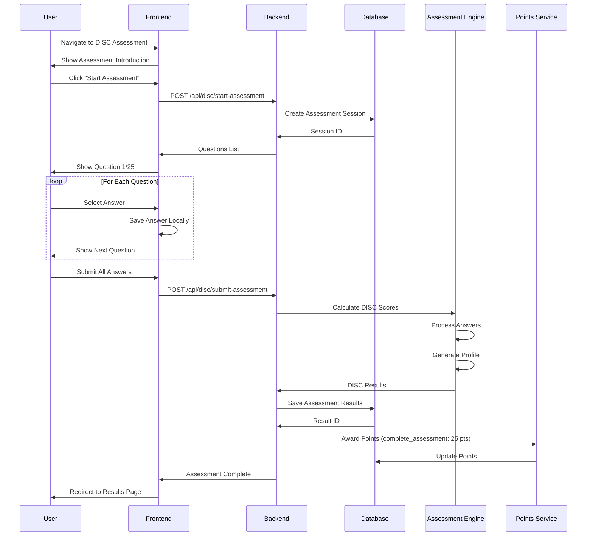
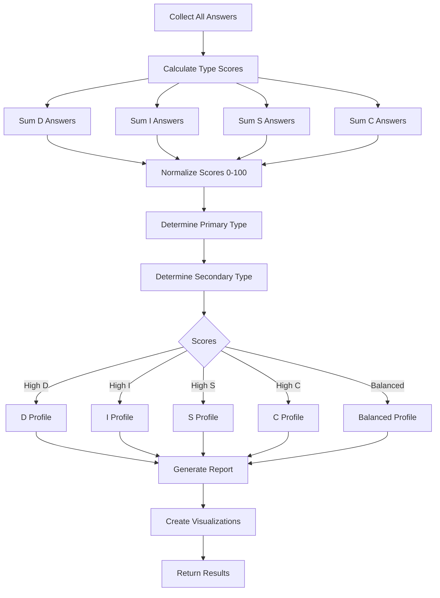
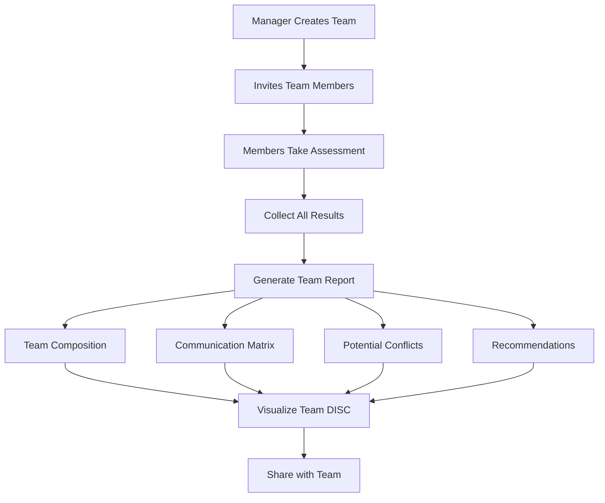

# DISC Assessment - Personality Profiling Tool

## Overview

**DISC Assessment** is a comprehensive personality assessment tool within WytNet based on the DISC personality model. It helps users understand their behavioral styles, improve communication, and enhance team collaboration. The assessment categorizes personalities into four main types: Dominance, Influence, Steadiness, and Conscientiousness.

### What is DISC?

DISC is a behavior assessment tool based on the DISC theory of psychologist William Moulton Marston. It centers on four different personality traits:

- **D - Dominance**: Direct, results-oriented, decisive, problem-solvers
- **I - Influence**: Outgoing, enthusiastic, optimistic, persuasive
- **S - Steadiness**: Even-tempered, accommodating, patient, humble
- **C - Conscientiousness**: Analytical, reserved, precise, systematic

### Key Features

- **25-Question Assessment**: Quick and accurate personality evaluation
- **Detailed Reports**: Comprehensive personality breakdown
- **Visual Graphs**: DISC profile visualization
- **Strengths & Weaknesses**: Identify personal traits
- **Career Guidance**: Suitable career paths based on profile
- **Compatibility Analysis**: Compare profiles with others
- **Team Reports**: Aggregate team DISC profiles
- **PDF Export**: Download and share results
- **Progress Tracking**: Retake assessment to track changes

---

## DISC Personality Types

### D - Dominance

**Characteristics**:
- Results-oriented
- Direct and decisive
- Problem-solver
- Risk-taker
- Competitive
- Strong-willed

**Strengths**:
- Gets things done
- Takes initiative
- Makes quick decisions
- Accepts challenges

**Weaknesses**:
- Can be impatient
- May seem insensitive
- Can be demanding
- Dislikes routine

**Ideal Roles**: CEO, Entrepreneur, Sales Manager, Project Manager

---

### I - Influence

**Characteristics**:
- Outgoing and enthusiastic
- Optimistic
- Persuasive
- Trusting
- Impulsive
- Creative

**Strengths**:
- Excellent communicator
- Motivates others
- Creates enthusiasm
- Builds relationships

**Weaknesses**:
- Can be disorganized
- May overcommit
- Dislikes being ignored
- Can be too trusting

**Ideal Roles**: Marketing, Public Relations, Sales, Event Planning

---

### S - Steadiness

**Characteristics**:
- Dependable and consistent
- Patient and calm
- Loyal and supportive
- Good listener
- Team player
- Resistant to change

**Strengths**:
- Excellent listener
- Team-oriented
- Patient and calm
- Reliable and consistent

**Weaknesses**:
- Resists change
- Can be indecisive
- Avoids conflict
- May lack initiative

**Ideal Roles**: Customer Service, HR, Teaching, Healthcare

---

### C - Conscientiousness

**Characteristics**:
- Analytical and systematic
- Detail-oriented
- High standards
- Cautious
- Diplomatic
- Accurate

**Strengths**:
- High quality work
- Analytical thinking
- Organized and systematic
- Follows procedures

**Weaknesses**:
- Can be overly critical
- Slow to make decisions
- May seem detached
- Fears criticism

**Ideal Roles**: Accounting, Engineering, Quality Assurance, Research

---

## User Workflow

### 1. Taking the Assessment



**API Endpoint**: `POST /api/disc/start-assessment`

**Response**:
```typescript
{
  success: true,
  sessionId: string,
  questions: [
    {
      id: string,
      questionNumber: number,
      question: string,
      options: [
        { id: "a", text: "I am very direct and to the point" },
        { id: "b", text: "I am enthusiastic and persuasive" },
        { id: "c", text: "I am patient and a good listener" },
        { id: "d", text: "I am analytical and detail-oriented" }
      ]
    }
  ]
}
```

---

### 2. Assessment Questions

Questions are designed to measure behavioral preferences:

```typescript
interface AssessmentQuestion {
  id: string;
  questionNumber: number;
  question: string;
  options: Array<{
    id: string;              // "a", "b", "c", "d"
    text: string;
    discType: "D" | "I" | "S" | "C";
    weight: number;          // 1-4 (how strongly it indicates the type)
  }>;
}
```

**Example Questions**:

1. **"When working on a team project, I typically..."**
   - A) Take charge and make decisions (D)
   - B) Motivate team members and create enthusiasm (I)
   - C) Support others and maintain harmony (S)
   - D) Analyze details and ensure accuracy (C)

2. **"In stressful situations, I tend to..."**
   - A) Take action immediately (D)
   - B) Talk it through with others (I)
   - C) Remain calm and patient (S)
   - D) Analyze the situation carefully (C)

3. **"My ideal work environment would be..."**
   - A) Fast-paced and challenging (D)
   - B) Collaborative and social (I)
   - C) Stable and supportive (S)
   - D) Structured and organized (C)

---

### 3. Scoring Algorithm



**Scoring Logic**:

```typescript
function calculateDISCScores(answers: Answer[]): DISCScores {
  const scores = { D: 0, I: 0, S: 0, C: 0 };
  
  // Sum scores for each type
  answers.forEach(answer => {
    const option = findOption(answer.questionId, answer.selectedOption);
    scores[option.discType] += option.weight;
  });
  
  // Normalize to 0-100 scale
  const maxPossibleScore = answers.length * 4; // If all answers were max weight
  const normalized = {
    D: (scores.D / maxPossibleScore) * 100,
    I: (scores.I / maxPossibleScore) * 100,
    S: (scores.S / maxPossibleScore) * 100,
    C: (scores.C / maxPossibleScore) * 100
  };
  
  // Determine primary and secondary types
  const sorted = Object.entries(normalized).sort((a, b) => b[1] - a[1]);
  const primary = sorted[0][0];
  const secondary = sorted[1][0];
  
  return {
    scores: normalized,
    primary,
    secondary,
    profile: determineProfile(normalized)
  };
}

function determineProfile(scores: Record<string, number>): string {
  const threshold = 70;
  
  if (scores.D > threshold) return "Dominant";
  if (scores.I > threshold) return "Influential";
  if (scores.S > threshold) return "Steady";
  if (scores.C > threshold) return "Conscientious";
  
  // Combined profiles
  if (scores.D > 60 && scores.I > 60) return "DI - Driver/Influencer";
  if (scores.I > 60 && scores.S > 60) return "IS - Influencer/Supporter";
  if (scores.S > 60 && scores.C > 60) return "SC - Supporter/Analyst";
  if (scores.C > 60 && scores.D > 60) return "CD - Analyst/Driver";
  
  return "Balanced";
}
```

---

### 4. Results Display

```
┌──────────────────────────────────────────────────┐
│  Your DISC Assessment Results                    │
│  Completed on October 20, 2025                   │
├──────────────────────────────────────────────────┤
│                                                  │
│  Your Profile: DI - Driver/Influencer            │
│  Primary: Dominance (D) - 78%                    │
│  Secondary: Influence (I) - 65%                  │
│                                                  │
│  ┌────────────────────────────────────────┐    │
│  │        DISC Profile Graph              │    │
│  │                                        │    │
│  │  D ████████████████████░░░░ 78%       │    │
│  │  I ████████████████░░░░░░░░ 65%       │    │
│  │  S ████████░░░░░░░░░░░░░░░░ 35%       │    │
│  │  C ███████░░░░░░░░░░░░░░░░░ 28%       │    │
│  │                                        │    │
│  └────────────────────────────────────────┘    │
│                                                  │
│  📊 Interpretation                               │
│  You are a natural leader who gets results       │
│  while inspiring and motivating others. You      │
│  are direct, enthusiastic, and persuasive.       │
│                                                  │
│  ✅ Your Strengths                               │
│  • Takes initiative and drives results           │
│  • Excellent communicator and motivator          │
│  • Embraces challenges and change                │
│  • Builds strong relationships                   │
│                                                  │
│  ⚠️ Areas for Development                        │
│  • May need to slow down and listen more         │
│  • Can be impatient with details                 │
│  • May come across as too aggressive             │
│  • Needs to follow through on commitments        │
│                                                  │
│  💼 Ideal Career Paths                           │
│  • Sales & Business Development                  │
│  • Entrepreneurship                              │
│  • Marketing & PR                                │
│  • Team Leadership                               │
│                                                  │
│  🤝 Communication Tips                           │
│  With D: Be direct, focus on results             │
│  With I: Be friendly, allow time for discussion  │
│  With S: Be patient, provide support             │
│  With C: Provide data, respect need for accuracy │
│                                                  │
│  [Download PDF] [Share Results] [Retake]        │
│                                                  │
└──────────────────────────────────────────────────┘
```

---

### 5. Team Assessment

Organizations can use DISC for team building:



**Team DISC Distribution**:

```
┌──────────────────────────────────────────────────┐
│  Team DISC Assessment - Marketing Team           │
│  12 members • Completed Oct 20, 2025             │
├──────────────────────────────────────────────────┤
│                                                  │
│  Team Composition:                               │
│  🔴 D: 3 members (25%) - Drivers                 │
│  🟡 I: 5 members (42%) - Influencers             │
│  🟢 S: 2 members (17%) - Supporters              │
│  🔵 C: 2 members (16%) - Analysts                │
│                                                  │
│  ┌────────────────────────────────────────┐    │
│  │   Team DISC Radar Chart                │    │
│  │                                        │    │
│  │        D (25%)                         │    │
│  │          •                             │    │
│  │         / \                            │    │
│  │        /   \                           │    │
│  │  C (16%)   I (42%)                     │    │
│  │       \   /                            │    │
│  │        \ /                             │    │
│  │         •                              │    │
│  │      S (17%)                           │    │
│  │                                        │    │
│  └────────────────────────────────────────┘    │
│                                                  │
│  Team Strengths:                                 │
│  ✅ High energy and enthusiasm (I)               │
│  ✅ Strong communication skills                  │
│  ✅ Good balance of drivers and supporters       │
│                                                  │
│  Potential Challenges:                           │
│  ⚠️ May lack attention to detail (low C)         │
│  ⚠️ Could benefit from more analytical thinking  │
│                                                  │
│  Recommendations:                                │
│  💡 Assign detail work to C-types                │
│  💡 Leverage I-types for client communication    │
│  💡 Use D-types to drive project completion      │
│  💡 Rely on S-types for team harmony             │
│                                                  │
└──────────────────────────────────────────────────┘
```

---

## Data Model

### Database Schema

```typescript
// Assessment Sessions
interface AssessmentSession {
  id: string;
  userId: string;
  status: "in_progress" | "completed" | "abandoned";
  startedAt: Date;
  completedAt?: Date;
}

// Assessment Answers
interface AssessmentAnswer {
  id: string;
  sessionId: string;
  questionId: string;
  selectedOption: string;          // "a", "b", "c", "d"
  answeredAt: Date;
}

// Assessment Results
interface AssessmentResult {
  id: string;
  displayId: string;               // DISC0001
  userId: string;
  sessionId: string;
  
  // Scores
  scoreD: number;                  // 0-100
  scoreI: number;
  scoreS: number;
  scoreC: number;
  
  // Profile
  primaryType: "D" | "I" | "S" | "C";
  secondaryType?: "D" | "I" | "S" | "C";
  profileName: string;             // "DI - Driver/Influencer"
  
  // Report Data
  interpretation: string;
  strengths: string[];
  weaknesses: string[];
  careerPaths: string[];
  communicationTips: string[];
  
  // Metadata
  questionCount: number;
  completionTime: number;          // Seconds
  
  // Sharing
  isPublic: boolean;
  shareToken?: string;
  
  createdAt: Date;
}

// Team Assessments
interface TeamAssessment {
  id: string;
  teamId: string;
  name: string;
  description?: string;
  
  // Members
  memberIds: string[];
  
  // Aggregate Results
  avgScoreD: number;
  avgScoreI: number;
  avgScoreS: number;
  avgScoreC: number;
  
  distribution: {
    D: number,                     // Percentage
    I: number,
    S: number,
    C: number
  };
  
  // Report
  teamStrengths: string[];
  teamChallenges: string[];
  recommendations: string[];
  
  createdAt: Date;
  updatedAt: Date;
}
```

---

## API Endpoints

### Start Assessment
```http
POST /api/disc/start-assessment
```

**Response**: Session ID + Questions

### Submit Assessment
```http
POST /api/disc/submit-assessment
Content-Type: application/json

{
  "sessionId": "sess_123",
  "answers": [
    { "questionId": "q1", "selectedOption": "a" },
    { "questionId": "q2", "selectedOption": "c" }
  ]
}
```

### Get My Results
```http
GET /api/disc/my-results
```

### Get Single Result
```http
GET /api/disc/results/:id
```

### Download PDF Report
```http
GET /api/disc/results/:id/download-pdf
```

### Share Result
```http
POST /api/disc/results/:id/share
```

### Create Team Assessment
```http
POST /api/disc/teams
Content-Type: application/json

{
  "name": "Marketing Team",
  "memberIds": ["user1", "user2", "user3"]
}
```

### Get Team Report
```http
GET /api/disc/teams/:id/report
```

---

## Frontend Components

### Assessment Question Component

```tsx
import { Card } from "@/components/ui/card";
import { Button } from "@/components/ui/button";
import { RadioGroup, RadioGroupItem } from "@/components/ui/radio-group";
import { Label } from "@/components/ui/label";

interface QuestionProps {
  question: {
    id: string;
    questionNumber: number;
    question: string;
    options: Array<{
      id: string;
      text: string;
    }>;
  };
  selectedAnswer?: string;
  onAnswer: (optionId: string) => void;
  onNext: () => void;
  onPrevious: () => void;
  isFirst: boolean;
  isLast: boolean;
}

export function AssessmentQuestion({
  question,
  selectedAnswer,
  onAnswer,
  onNext,
  onPrevious,
  isFirst,
  isLast
}: QuestionProps) {
  return (
    <Card className="p-6 max-w-2xl mx-auto">
      <div className="mb-4">
        <span className="text-sm text-muted-foreground">
          Question {question.questionNumber} of 25
        </span>
        <div className="w-full bg-gray-200 rounded-full h-2 mt-2">
          <div
            className="bg-blue-600 h-2 rounded-full transition-all"
            style={{ width: `${(question.questionNumber / 25) * 100}%` }}
          />
        </div>
      </div>
      
      <h3 className="text-xl font-semibold mb-6">{question.question}</h3>
      
      <RadioGroup value={selectedAnswer} onValueChange={onAnswer}>
        {question.options.map((option) => (
          <div
            key={option.id}
            className="flex items-center space-x-3 p-4 border rounded-lg hover:bg-gray-50 cursor-pointer"
          >
            <RadioGroupItem value={option.id} id={option.id} />
            <Label htmlFor={option.id} className="cursor-pointer flex-1">
              {option.text}
            </Label>
          </div>
        ))}
      </RadioGroup>
      
      <div className="flex justify-between mt-6">
        <Button
          variant="outline"
          onClick={onPrevious}
          disabled={isFirst}
        >
          Previous
        </Button>
        
        <Button
          onClick={onNext}
          disabled={!selectedAnswer}
        >
          {isLast ? "Submit" : "Next"}
        </Button>
      </div>
    </Card>
  );
}
```

---

## Integration with Platform

### WytPoints Integration

| Action | Points |
|--------|--------|
| Complete Assessment | 25 |
| Share Results | 5 |
| Retake Assessment (after 30 days) | 10 |
| Join Team Assessment | 5 |

### Profile Integration

DISC results appear on user profiles:

```typescript
{
  userId: "UR0001",
  profile: {
    discType: "DI",
    discScores: {
      D: 78,
      I: 65,
      S: 35,
      C: 28
    },
    lastAssessment: "2025-10-20"
  }
}
```

---

## Use Cases

### 1. Personal Development
- Understand your communication style
- Identify strengths and blind spots
- Plan career development
- Improve self-awareness

### 2. Team Building
- Understand team dynamics
- Improve team communication
- Assign roles based on strengths
- Resolve conflicts

### 3. Hiring & Recruitment
- Assess candidate fit
- Understand work style preferences
- Build balanced teams
- Predict job performance

### 4. Leadership Development
- Adapt leadership style
- Improve team management
- Enhance communication
- Build diverse teams

---

## Related Documentation

- [MyWyt Apps](./mywyt-apps.md)
- [User Profile](./user-registration.md)
- [Points System](../architecture/points-system.md)
- [PDF Generation](../architecture/pdf-generation.md)
