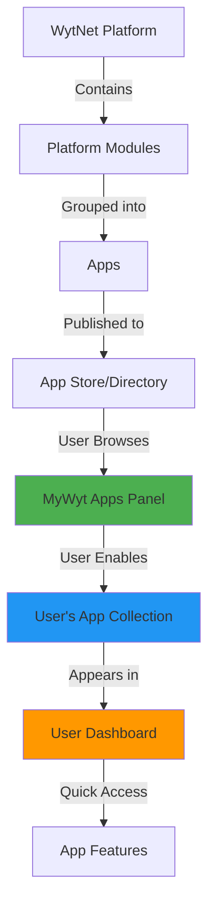
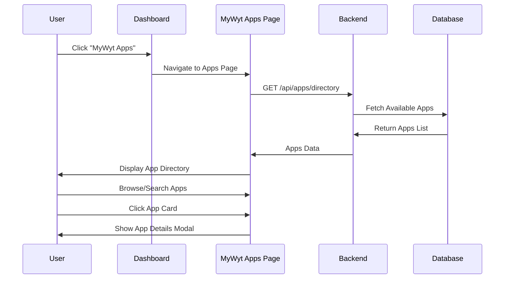
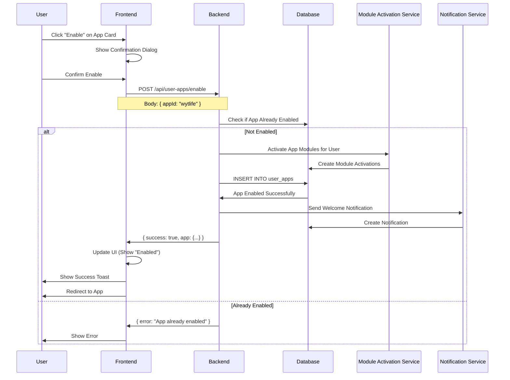
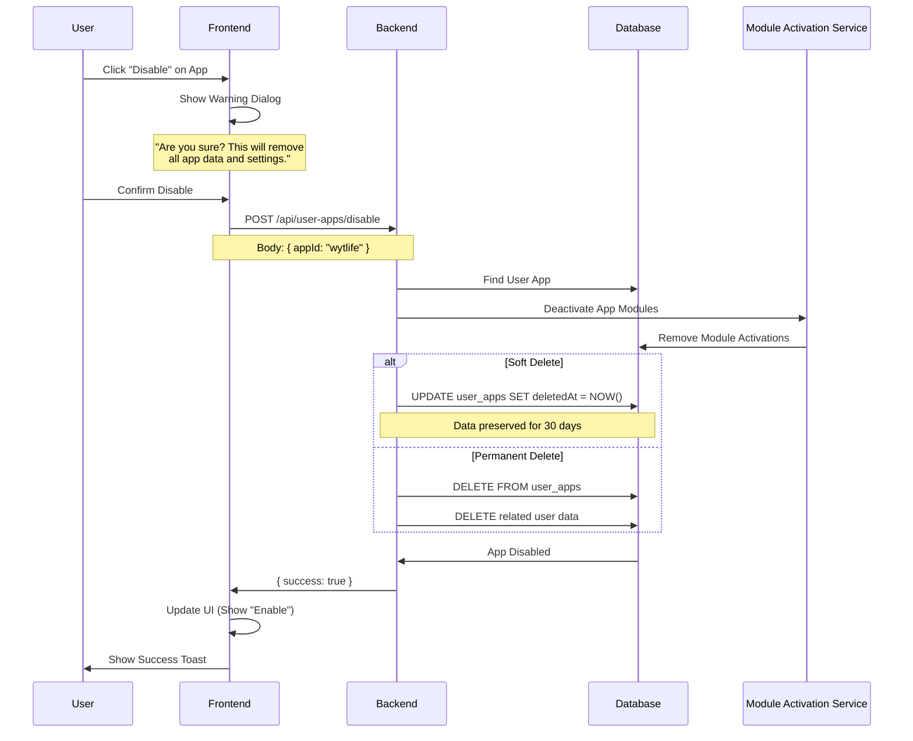
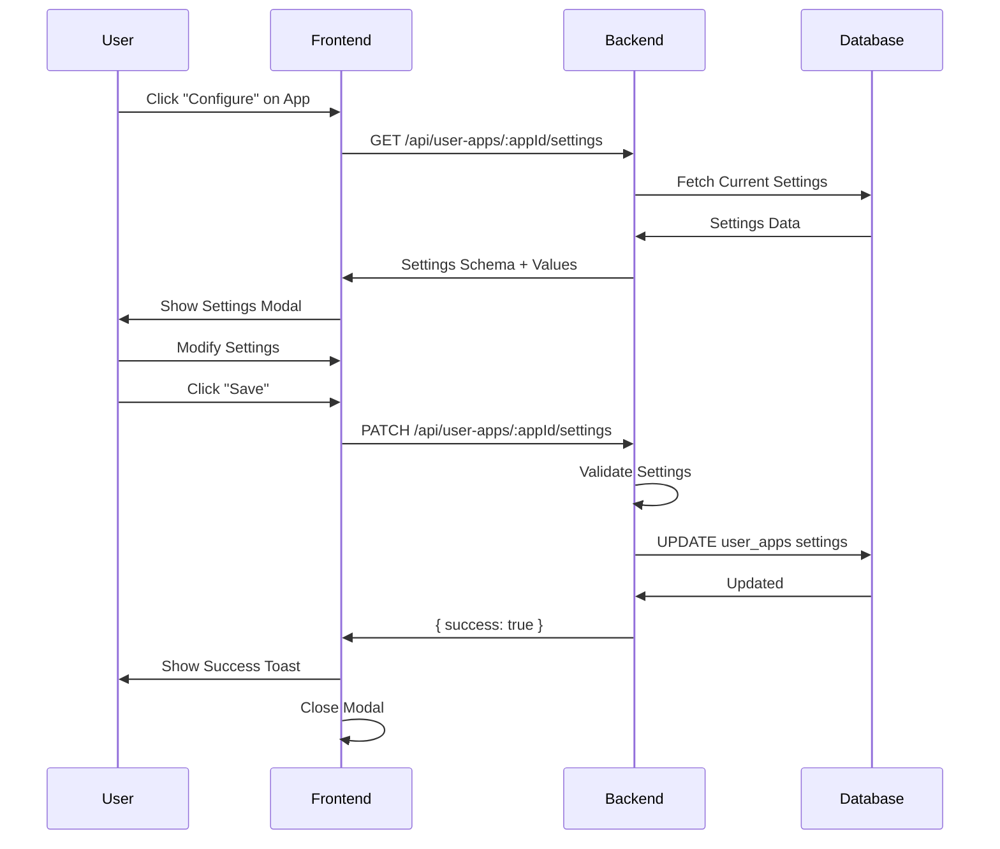

# MyWyt Apps - Personal App Dashboard

## Overview

**MyWyt Apps** is the personal application dashboard within WytNet.com where users can discover, enable, and manage their collection of applications. It serves as a centralized control panel for all apps available on the WytNet platform, allowing users to customize their experience by choosing which apps they want to use.

### Key Concepts

- **App Discovery**: Browse and search available apps in the WytNet ecosystem
- **Enable/Disable**: Turn apps on or off in your personal panel
- **App Configuration**: Customize settings for each enabled app
- **Dashboard Integration**: Seamless access to all your active apps
- **Module-based**: Apps are built from platform modules

---

## Architecture Overview



**Flow**:
1. Platform Modules are developed by admins
2. Modules are grouped to create Apps
3. Apps are published to the App Directory
4. Users browse apps in MyWyt Apps panel
5. Users enable apps they want
6. Enabled apps appear in user dashboard
7. Users access app features from dashboard

---

## User Workflow

### 1. Discovering Apps



**App Directory Page Layout**:

```
┌──────────────────────────────────────────────────┐
│  MyWyt Apps                                      │
│  Discover and manage your applications           │
├──────────────────────────────────────────────────┤
│                                                  │
│  [Search: "Search apps..."]  [Filter ▼]         │
│                                                  │
│  Categories:                                     │
│  [All] [Social] [Business] [Productivity]       │
│  [Communication] [Tools] [Games]                 │
│                                                  │
├──────────────────────────────────────────────────┤
│                                                  │
│  🌐 WytWall         [✓ Enabled]  [Configure]    │
│  Social Commerce Feed                            │
│  Post needs, discover offers, connect locally    │
│  ⭐⭐⭐⭐⭐ 4.8 (1.2k users)                       │
│                                                  │
├──────────────────────────────────────────────────┤
│                                                  │
│  🤖 AI Directory    [+ Enable]                   │
│  Curated AI Tools Database                       │
│  Explore and discover AI tools for your needs    │
│  ⭐⭐⭐⭐ 4.6 (850 users)                          │
│                                                  │
├──────────────────────────────────────────────────┤
│                                                  │
│  📋 DISC Assessment [+ Enable]                   │
│  Personality Assessment Tool                     │
│  Discover your DISC personality profile          │
│  ⭐⭐⭐⭐⭐ 4.9 (2.3k users)                       │
│                                                  │
└──────────────────────────────────────────────────┘
```

---

### 2. Enabling an App



**API Endpoint**: `POST /api/user-apps/enable`

**Request Body**:
```typescript
{
  appId: string // e.g., "wytwall", "ai-directory"
}
```

**Response**:
```typescript
{
  success: true,
  app: {
    id: string,
    appId: string,
    userId: string,
    enabledAt: Date,
    settings: {
      // App-specific settings
      notifications: boolean,
      visibility: "public" | "private"
    }
  },
  modulesActivated: string[] // List of module IDs activated
}
```

---

### 3. Disabling an App



**API Endpoint**: `POST /api/user-apps/disable`

**Request Body**:
```typescript
{
  appId: string,
  permanent?: boolean // Default: false (soft delete)
}
```

**Response**:
```typescript
{
  success: true,
  message: "App disabled successfully",
  dataRetentionDays: 30 // If soft delete
}
```

---

### 4. Configuring an App

Each app can have its own configuration settings.



**Get Settings**: `GET /api/user-apps/:appId/settings`

**Response**:
```typescript
{
  success: true,
  settings: {
    notifications: {
      type: "boolean",
      label: "Enable Notifications",
      description: "Receive notifications for app activities",
      value: true
    },
    visibility: {
      type: "select",
      label: "Visibility",
      description: "Who can see your app activities",
      options: ["public", "private", "connections"],
      value: "public"
    },
    theme: {
      type: "select",
      label: "Theme",
      options: ["light", "dark", "auto"],
      value: "auto"
    }
  }
}
```

**Update Settings**: `PATCH /api/user-apps/:appId/settings`

**Request Body**:
```typescript
{
  notifications: true,
  visibility: "private",
  theme: "dark"
}
```

---

## Dashboard Integration

### User Dashboard with Apps

```
┌──────────────────────────────────────────────────┐
│  Welcome back, John! (UR0001)                    │
│  Wednesday, October 20, 2025                     │
├──────────────────────────────────────────────────┤
│                                                  │
│  📊 Quick Stats                                  │
│  ┌──────┬──────┬──────┬──────┐                 │
│  │ Posts│ Apps │Points│ Level│                 │
│  │  12  │  5   │ 245  │Silver│                 │
│  └──────┴──────┴──────┴──────┘                 │
│                                                  │
├──────────────────────────────────────────────────┤
│                                                  │
│  🚀 My Apps                    [Manage Apps →]  │
│                                                  │
│  ┌─────────┬─────────┬─────────┬─────────┐    │
│  │🌐       │🤖       │📋       │💼       │    │
│  │WytWall  │AI Dir   │DISC     │WytLife │    │
│  │         │         │         │         │    │
│  │[Open]   │[Open]   │[Open]   │[Open]   │    │
│  └─────────┴─────────┴─────────┴─────────┘    │
│                                                  │
│  ┌─────────┬─────────┐                         │
│  │📱       │         │                         │
│  │QR Gen   │ + Add   │                         │
│  │         │ More    │                         │
│  │[Open]   │ Apps    │                         │
│  └─────────┴─────────┘                         │
│                                                  │
├──────────────────────────────────────────────────┤
│                                                  │
│  📰 Recent Activity                              │
│  • Posted a Need in WytWall - 2h ago           │
│  • Completed DISC Assessment - 1d ago           │
│  • Saved 3 AI tools in AI Directory - 2d ago    │
│                                                  │
└──────────────────────────────────────────────────┘
```

---

## App Card Component

### Frontend Implementation

```tsx
import { Card, CardHeader, CardTitle, CardDescription, CardContent } from "@/components/ui/card";
import { Button } from "@/components/ui/button";
import { Badge } from "@/components/ui/badge";
import { Star, Settings } from "lucide-react";
import { useMutation } from "@tanstack/react-query";
import { apiRequest, queryClient } from "@/lib/queryClient";

interface AppCardProps {
  app: {
    id: string;
    name: string;
    description: string;
    icon: string;
    category: string;
    rating: number;
    userCount: number;
    isEnabled: boolean;
  };
}

export function AppCard({ app }: AppCardProps) {
  const enableApp = useMutation({
    mutationFn: () => apiRequest("/api/user-apps/enable", "POST", { appId: app.id }),
    onSuccess: () => {
      queryClient.invalidateQueries({ queryKey: ["/api/apps/directory"] });
      queryClient.invalidateQueries({ queryKey: ["/api/user-apps"] });
    }
  });
  
  const disableApp = useMutation({
    mutationFn: () => apiRequest("/api/user-apps/disable", "POST", { appId: app.id }),
    onSuccess: () => {
      queryClient.invalidateQueries({ queryKey: ["/api/apps/directory"] });
      queryClient.invalidateQueries({ queryKey: ["/api/user-apps"] });
    }
  });
  
  return (
    <Card>
      <CardHeader>
        <div className="flex items-start justify-between">
          <div className="flex items-center gap-3">
            <div className="text-4xl">{app.icon}</div>
            <div>
              <CardTitle>{app.name}</CardTitle>
              <CardDescription>{app.category}</CardDescription>
            </div>
          </div>
          {app.isEnabled && (
            <Badge variant="default" className="bg-green-500">
              Enabled
            </Badge>
          )}
        </div>
      </CardHeader>
      
      <CardContent>
        <p className="text-sm text-muted-foreground mb-4">
          {app.description}
        </p>
        
        <div className="flex items-center gap-2 mb-4">
          <div className="flex items-center">
            {[...Array(5)].map((_, i) => (
              <Star
                key={i}
                className={`w-4 h-4 ${
                  i < Math.floor(app.rating)
                    ? "fill-yellow-400 text-yellow-400"
                    : "text-gray-300"
                }`}
              />
            ))}
          </div>
          <span className="text-sm text-muted-foreground">
            {app.rating} ({app.userCount.toLocaleString()} users)
          </span>
        </div>
        
        <div className="flex gap-2">
          {app.isEnabled ? (
            <>
              <Button variant="outline" size="sm" onClick={() => disableApp.mutate()}>
                Disable
              </Button>
              <Button variant="default" size="sm">
                <Settings className="w-4 h-4 mr-1" />
                Configure
              </Button>
            </>
          ) : (
            <Button
              variant="default"
              size="sm"
              onClick={() => enableApp.mutate()}
              disabled={enableApp.isPending}
            >
              {enableApp.isPending ? "Enabling..." : "+ Enable"}
            </Button>
          )}
        </div>
      </CardContent>
    </Card>
  );
}
```

---

## Data Model

### Database Schema

```typescript
// Apps Catalog (Platform-wide available apps)
interface App {
  id: string;                      // UUID
  appId: string;                   // Unique identifier: "wytwall", "ai-directory"
  displayId: string;               // APP0001
  name: string;
  description: string;
  longDescription?: string;
  icon: string;                    // Emoji or image URL
  category: string;                // "social", "business", "productivity"
  version: string;                 // "1.0.0"
  status: "active" | "beta" | "deprecated";
  
  // Modules that make up this app
  moduleIds: string[];             // ["social-feed", "post-management", "moderation"]
  
  // Ratings & Stats
  rating: number;                  // 0-5
  userCount: number;
  installCount: number;
  
  // Pricing
  pricing: "free" | "freemium" | "premium";
  price?: number;
  currency?: string;
  
  // Configuration
  configSchema?: object;           // JSON Schema for app settings
  defaultSettings?: object;
  
  // Publishing
  publishedAt?: Date;
  publishedBy?: string;            // Admin ID
  
  createdAt: Date;
  updatedAt: Date;
}

// User's Enabled Apps
interface UserApp {
  id: string;                      // UUID
  userId: string;                  // FK to users
  appId: string;                   // FK to apps.appId
  
  // Settings
  settings: object;                // User-specific app configuration
  
  // State
  isActive: boolean;
  enabledAt: Date;
  lastUsedAt?: Date;
  usageCount: number;
  
  // Soft Delete
  deletedAt?: Date;
  
  createdAt: Date;
  updatedAt: Date;
}

// Module Activations (what modules are active for this user)
interface ModuleActivation {
  id: string;
  userId: string;
  moduleId: string;
  context: "user" | "hub" | "app";
  contextId?: string;              // appId if context is "app"
  isActive: boolean;
  settings?: object;
  activatedAt: Date;
}
```

---

## API Reference

### Get App Directory

**Endpoint**: `GET /api/apps/directory`

**Query Parameters**:
```typescript
{
  category?: string,
  search?: string,
  status?: "all" | "enabled" | "disabled",
  page?: number,
  limit?: number
}
```

**Response**:
```typescript
{
  success: true,
  apps: [
    {
      id: string,
      appId: string,
      name: string,
      description: string,
      icon: string,
      category: string,
      rating: number,
      userCount: number,
      pricing: string,
      isEnabled: boolean, // For current user
      isNew: boolean,
      isBeta: boolean
    }
  ],
  pagination: {
    page: number,
    limit: number,
    total: number,
    hasMore: boolean
  }
}
```

---

### Get User's Enabled Apps

**Endpoint**: `GET /api/user-apps`

**Response**:
```typescript
{
  success: true,
  apps: [
    {
      id: string,
      appId: string,
      name: string,
      icon: string,
      category: string,
      enabledAt: Date,
      lastUsedAt: Date,
      usageCount: number,
      settings: object
    }
  ],
  total: number
}
```

---

### Enable App

**Endpoint**: `POST /api/user-apps/enable`

**Request Body**:
```typescript
{
  appId: string
}
```

**Response**:
```typescript
{
  success: true,
  app: UserApp,
  modulesActivated: string[]
}
```

---

### Disable App

**Endpoint**: `POST /api/user-apps/disable`

**Request Body**:
```typescript
{
  appId: string,
  permanent?: boolean
}
```

**Response**:
```typescript
{
  success: true,
  message: string,
  dataRetentionDays?: number
}
```

---

### Get App Settings

**Endpoint**: `GET /api/user-apps/:appId/settings`

**Response**:
```typescript
{
  success: true,
  settings: {
    [key: string]: {
      type: "boolean" | "string" | "number" | "select",
      label: string,
      description?: string,
      options?: any[],
      value: any
    }
  }
}
```

---

### Update App Settings

**Endpoint**: `PATCH /api/user-apps/:appId/settings`

**Request Body**:
```typescript
{
  [key: string]: any
}
```

**Response**:
```typescript
{
  success: true,
  settings: object
}
```

---

## Module Activation System

When a user enables an app, the system automatically activates the required modules.

```typescript
// Example: Enabling WytWall app
async function enableApp(userId: string, appId: string) {
  // 1. Get app details
  const app = await db.select().from(apps).where(eq(apps.appId, appId));
  
  // 2. Get required modules
  const moduleIds = app.moduleIds; // ["social-feed", "post-management"]
  
  // 3. Activate each module for the user
  for (const moduleId of moduleIds) {
    await db.insert(moduleActivations).values({
      userId,
      moduleId,
      context: "user",
      contextId: appId,
      isActive: true,
      activatedAt: new Date()
    });
  }
  
  // 4. Create user_app record
  await db.insert(userApps).values({
    userId,
    appId,
    isActive: true,
    enabledAt: new Date(),
    settings: app.defaultSettings || {}
  });
  
  return { success: true };
}
```

---

## App Categories

Apps in MyWyt are organized into categories:

| Category | Description | Examples |
|----------|-------------|----------|
| **Social** | Social networking and community | WytWall, Social Circles |
| **Business** | Business management tools | Invoicing, CRM, Leads |
| **Productivity** | Tools to improve efficiency | Task Manager, Calendar |
| **Communication** | Messaging and communication | Chat, Video Call |
| **Tools** | Utility applications | QR Generator, Image Editor |
| **Entertainment** | Games and fun apps | Trivia, Puzzles |
| **Learning** | Educational content | DISC Assessment, Courses |
| **Finance** | Financial management | Expense Tracker, Budget |

---

## User Permissions

| Action | Public User | Logged-in User | Admin |
|--------|-------------|----------------|-------|
| Browse App Directory | ✓ | ✓ | ✓ |
| Enable App | ✗ | ✓ | ✓ |
| Disable App | ✗ | ✓ | ✓ |
| Configure App | ✗ | ✓ (own apps) | ✓ |
| Publish App | ✗ | ✗ | ✓ |
| Delete App | ✗ | ✗ | ✓ |

---

## Screenshots Description

### 1. MyWyt Apps Directory
**Layout**: Grid of app cards with filters
**Elements**:
- Search bar at top
- Category tabs (All, Social, Business, etc.)
- App cards in grid layout (3-4 columns on desktop)
- Each card shows: icon, name, description, rating, user count, Enable/Disable button

### 2. App Detail Modal
**Layout**: Modal overlay with detailed app information
**Elements**:
- Large app icon
- App name and category
- Long description with features list
- Screenshots carousel
- Ratings and reviews section
- Enable/Configure buttons
- "What's New" version notes

### 3. My Apps Dashboard Widget
**Layout**: Grid of enabled apps with quick access
**Elements**:
- App icons in grid (2x3 or 3x3)
- App names below icons
- "Open" button on hover
- "+ Add More Apps" card at the end

### 4. App Settings Modal
**Layout**: Form with app-specific settings
**Elements**:
- Settings sections (Notifications, Privacy, Appearance)
- Toggle switches for boolean settings
- Dropdown selects for options
- Save/Cancel buttons

---

## Related Documentation

- [Core Concepts](../core-concepts.md)
- [Platform Modules](../architecture/modules.md)
- [WytWall App](./wytwall.md)
- [AI Directory App](./ai-directory.md)
- [DISC Assessment App](./disc-assessment.md)
- [QR Generator App](./qr-generator.md)
- [WytLife App](./wytlife.md)
