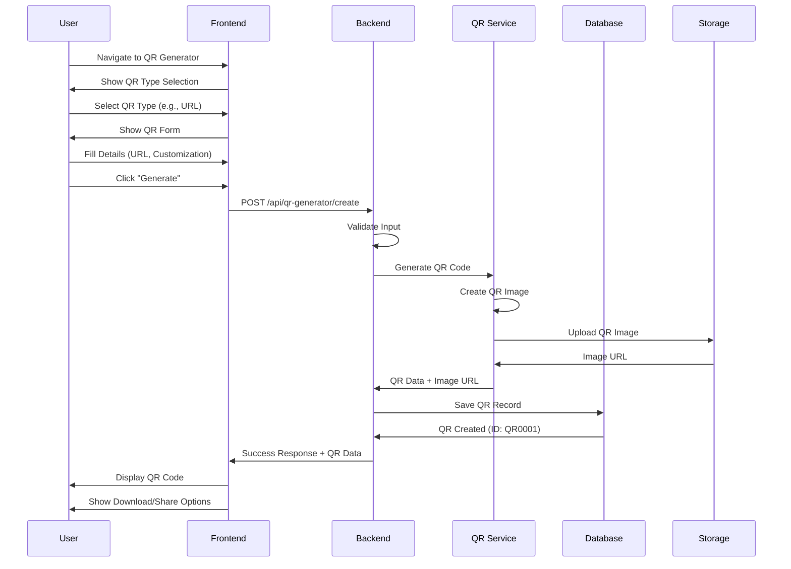
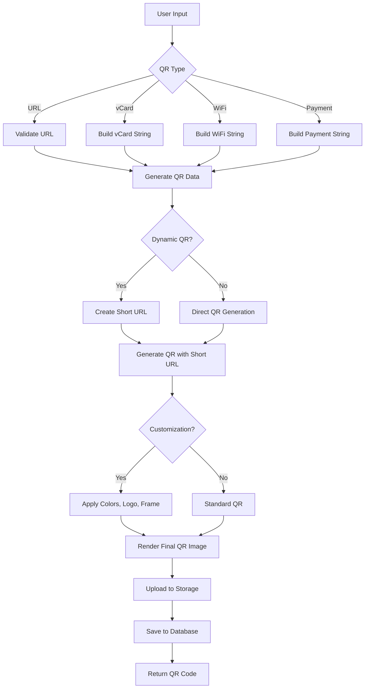
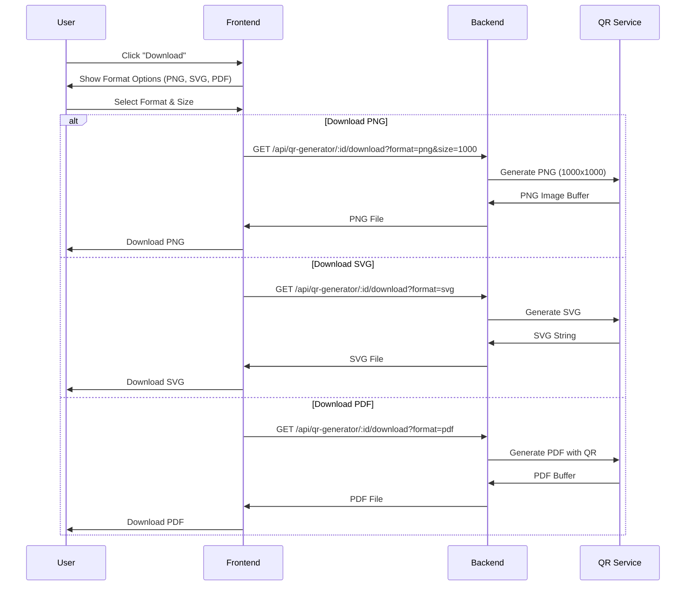
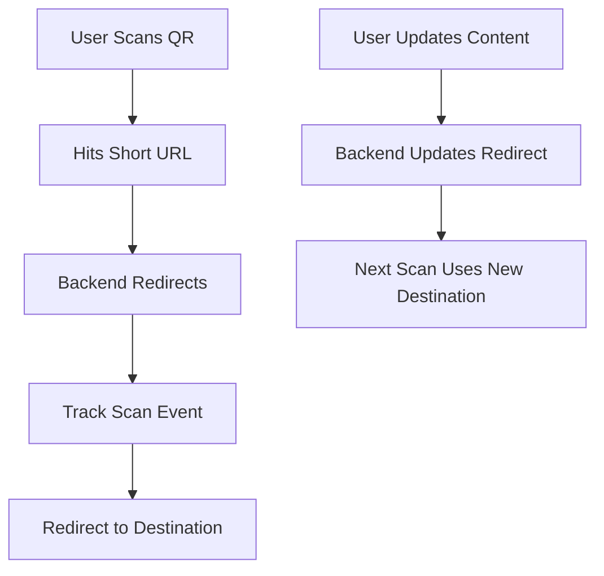
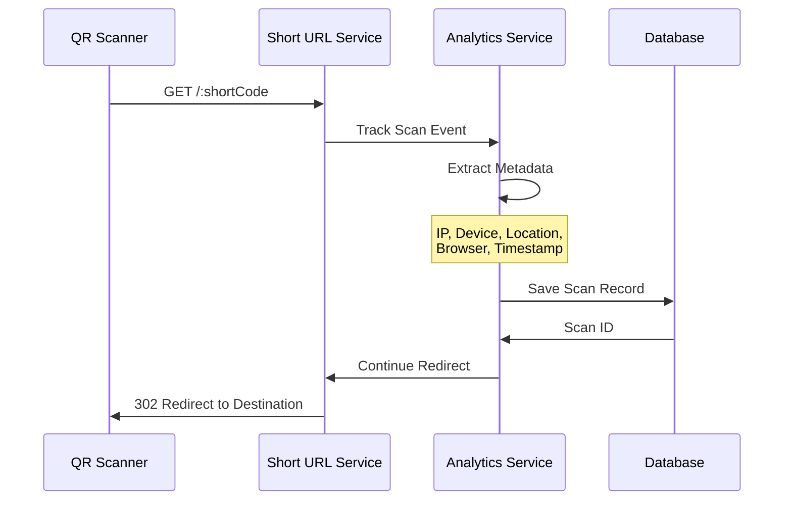

# QR Generator - QR Code Creation Tool

## Overview

**QR Generator** is a versatile QR code creation tool within WytNet that allows users to generate, customize, and manage QR codes for various purposes. From simple URL links to complex vCards, WiFi credentials, and payment information, QR Generator makes it easy to create professional QR codes with tracking and analytics.

### Key Features

- **Multiple QR Types**: URLs, Text, vCards, WiFi, Email, SMS, Payments
- **Customization**: Colors, logos, frames, shapes
- **Batch Generation**: Create multiple QR codes at once
- **Analytics & Tracking**: Track scans, locations, devices
- **Download Formats**: PNG, SVG, PDF
- **Dynamic QR Codes**: Edit content without changing the QR code
- **QR Code Management**: Organize and manage all your QR codes
- **Shareable Links**: Share QR codes via link

---

## QR Code Types

### 1. URL QR Code
Create QR codes that link to websites

**Use Cases**:
- Business websites
- Social media profiles
- Product pages
- Event registrations

### 2. Text QR Code
Plain text information

**Use Cases**:
- Instructions
- Messages
- Serial numbers
- Product info

### 3. vCard QR Code
Digital business card

**Use Cases**:
- Contact information
- Professional networking
- Event attendees

### 4. WiFi QR Code
WiFi network credentials

**Use Cases**:
- Cafes & restaurants
- Hotels
- Offices
- Home networks

### 5. Email QR Code
Pre-filled email

**Use Cases**:
- Customer support
- Feedback collection
- Contact forms

### 6. SMS QR Code
Pre-filled text message

**Use Cases**:
- Opt-in campaigns
- Customer service
- Voting/polling

### 7. Payment QR Code
Payment information (UPI, PayPal, etc.)

**Use Cases**:
- Merchant payments
- Donations
- Bill splitting
- Tips

---

## User Workflow

### 1. Creating a QR Code



**API Endpoint**: `POST /api/qr-generator/create`

**Request Body**:
```typescript
{
  type: "url" | "text" | "vcard" | "wifi" | "email" | "sms" | "payment",
  data: {
    // For URL type
    url?: string,
    
    // For vCard type
    firstName?: string,
    lastName?: string,
    phone?: string,
    email?: string,
    company?: string,
    title?: string,
    
    // For WiFi type
    ssid?: string,
    password?: string,
    encryption?: "WPA" | "WEP" | "none",
    
    // For Payment type
    upiId?: string,
    amount?: number,
    note?: string,
    
    // Generic
    text?: string
  },
  customization: {
    foregroundColor?: string,     // Hex color
    backgroundColor?: string,
    logoUrl?: string,             // Center logo
    frameStyle?: "none" | "simple" | "rounded",
    dotStyle?: "square" | "rounded" | "dots",
    size?: number                 // 300-2000 px
  },
  settings: {
    isDynamic?: boolean,          // Can edit content later
    expiresAt?: Date,
    maxScans?: number,
    trackingEnabled?: boolean
  },
  name?: string,                  // Internal name for organization
  description?: string
}
```

**Response**:
```typescript
{
  success: true,
  qrCode: {
    id: string,
    displayId: "QR0001",
    type: "url",
    imageUrl: string,             // PNG image URL
    shortUrl: string,             // Short tracking URL
    data: object,                 // Original data
    customization: object,
    scanCount: 0,
    createdAt: Date
  }
}
```

---

### 2. QR Code Generation Process



---

### 3. Downloading QR Codes



---

### 4. Dynamic QR Codes

Dynamic QR codes allow you to change the destination without reprinting the QR code.



**Update Dynamic QR Content**:
```http
PATCH /api/qr-generator/:id/content
Content-Type: application/json

{
  "url": "https://new-destination.com",
  "expiresAt": "2026-01-01T00:00:00Z"
}
```

---

### 5. Tracking & Analytics



**Scan Data Collected**:
```typescript
interface QRScan {
  id: string;
  qrCodeId: string;
  timestamp: Date;
  ip: string;
  country?: string;
  city?: string;
  device: string;              // "mobile", "desktop", "tablet"
  os: string;                  // "iOS", "Android", "Windows"
  browser: string;             // "Chrome", "Safari", etc.
  referer?: string;
}
```

**Analytics API**: `GET /api/qr-generator/:id/analytics`

**Response**:
```typescript
{
  success: true,
  analytics: {
    totalScans: 245,
    uniqueScans: 189,
    scansByDate: [
      { date: "2025-10-20", scans: 15 },
      { date: "2025-10-19", scans: 23 }
    ],
    scansByDevice: {
      mobile: 180,
      desktop: 50,
      tablet: 15
    },
    scansByCountry: {
      "India": 200,
      "USA": 30,
      "UK": 15
    },
    topCities: [
      { city: "Chennai", scans: 85 },
      { city: "Mumbai", scans: 60 }
    ]
  }
}
```

---

## QR Code Management

### My QR Codes Dashboard

```
┌──────────────────────────────────────────────────┐
│  My QR Codes                    [+ Create New]   │
├──────────────────────────────────────────────────┤
│                                                  │
│  [Search QR codes...]  [Filter ▼]  [Sort ▼]    │
│                                                  │
│  Active QR Codes (12)                            │
│                                                  │
│  ┌────────────────────────────────────────┐    │
│  │ [QR Image]  Website Homepage             │    │
│  │             URL • Dynamic                │    │
│  │             245 scans • Created Oct 1    │    │
│  │             [View Analytics] [Edit] [⋮]  │    │
│  └────────────────────────────────────────┘    │
│                                                  │
│  ┌────────────────────────────────────────┐    │
│  │ [QR Image]  WiFi - Office Network        │    │
│  │             WiFi • Static                │    │
│  │             89 scans • Created Sep 15    │    │
│  │             [View Details] [Download] [⋮]│    │
│  └────────────────────────────────────────┘    │
│                                                  │
│  ┌────────────────────────────────────────┐    │
│  │ [QR Image]  My Business Card             │    │
│  │             vCard • Static               │    │
│  │             156 scans • Created Aug 20   │    │
│  │             [View Details] [Download] [⋮]│    │
│  └────────────────────────────────────────┘    │
│                                                  │
└──────────────────────────────────────────────────┘
```

---

## Data Model

### Database Schema

```typescript
// QR Codes
interface QRCode {
  id: string;                      // UUID
  displayId: string;               // QR0001
  userId: string;                  // FK to users
  
  // QR Details
  type: "url" | "text" | "vcard" | "wifi" | "email" | "sms" | "payment";
  name?: string;                   // User-defined name
  description?: string;
  
  // QR Data
  data: object;                    // Type-specific data
  
  // QR Image
  imageUrl: string;                // URL to generated QR image
  shortUrl?: string;               // For dynamic QRs
  shortCode?: string;              // Short code part
  
  // Customization
  customization: {
    foregroundColor: string,
    backgroundColor: string,
    logoUrl?: string,
    frameStyle: string,
    dotStyle: string,
    size: number
  };
  
  // Settings
  isDynamic: boolean;
  trackingEnabled: boolean;
  expiresAt?: Date;
  maxScans?: number;
  
  // Stats
  scanCount: number;
  uniqueScanCount: number;
  lastScannedAt?: Date;
  
  // Status
  status: "active" | "expired" | "disabled";
  
  createdAt: Date;
  updatedAt: Date;
}

// QR Scans
interface QRScan {
  id: string;
  qrCodeId: string;                // FK to qr_codes
  
  // Scan metadata
  timestamp: Date;
  ip: string;
  country?: string;
  city?: string;
  latitude?: number;
  longitude?: number;
  
  // Device info
  device: string;                  // mobile, desktop, tablet
  os: string;
  browser: string;
  userAgent: string;
  
  // Referrer
  referer?: string;
  
  createdAt: Date;
}
```

---

## API Endpoints

### Create QR Code
```http
POST /api/qr-generator/create
Content-Type: application/json

{
  "type": "url",
  "data": { "url": "https://example.com" },
  "customization": {
    "foregroundColor": "#000000",
    "backgroundColor": "#FFFFFF"
  },
  "settings": {
    "isDynamic": true,
    "trackingEnabled": true
  }
}
```

### Get My QR Codes
```http
GET /api/qr-generator/my-codes?page=1&limit=20
```

### Get Single QR Code
```http
GET /api/qr-generator/:id
```

### Update QR Code
```http
PATCH /api/qr-generator/:id
Content-Type: application/json

{
  "name": "Updated Name",
  "data": { "url": "https://new-url.com" }
}
```

### Delete QR Code
```http
DELETE /api/qr-generator/:id
```

### Download QR Code
```http
GET /api/qr-generator/:id/download?format=png&size=1000
```

### Get Analytics
```http
GET /api/qr-generator/:id/analytics
```

### Track Scan (Short URL redirect)
```http
GET /qr/:shortCode
```

---

## Frontend Components

### QR Generator Form Component

```tsx
import { useState } from "react";
import { Card } from "@/components/ui/card";
import { Button } from "@/components/ui/button";
import { Input } from "@/components/ui/input";
import { Label } from "@/components/ui/label";
import { Select } from "@/components/ui/select";
import { useMutation } from "@tanstack/react-query";
import { apiRequest } from "@/lib/queryClient";

export function QRGeneratorForm() {
  const [qrType, setQRType] = useState("url");
  const [url, setUrl] = useState("");
  const [foregroundColor, setForegroundColor] = useState("#000000");
  const [backgroundColor, setBackgroundColor] = useState("#FFFFFF");
  
  const generateQR = useMutation({
    mutationFn: (data) => apiRequest("/api/qr-generator/create", "POST", data),
    onSuccess: (result) => {
      // Show generated QR code
      console.log("QR Generated:", result.qrCode);
    }
  });
  
  const handleGenerate = () => {
    generateQR.mutate({
      type: qrType,
      data: { url },
      customization: {
        foregroundColor,
        backgroundColor,
        size: 500
      },
      settings: {
        isDynamic: true,
        trackingEnabled: true
      }
    });
  };
  
  return (
    <Card className="p-6">
      <h2 className="text-2xl font-bold mb-4">Generate QR Code</h2>
      
      <div className="space-y-4">
        <div>
          <Label>QR Type</Label>
          <Select value={qrType} onValueChange={setQRType}>
            <option value="url">URL</option>
            <option value="text">Text</option>
            <option value="vcard">vCard</option>
            <option value="wifi">WiFi</option>
          </Select>
        </div>
        
        {qrType === "url" && (
          <div>
            <Label>URL</Label>
            <Input
              type="url"
              value={url}
              onChange={(e) => setUrl(e.target.value)}
              placeholder="https://example.com"
            />
          </div>
        )}
        
        <div className="grid grid-cols-2 gap-4">
          <div>
            <Label>Foreground Color</Label>
            <Input
              type="color"
              value={foregroundColor}
              onChange={(e) => setForegroundColor(e.target.value)}
            />
          </div>
          <div>
            <Label>Background Color</Label>
            <Input
              type="color"
              value={backgroundColor}
              onChange={(e) => setBackgroundColor(e.target.value)}
            />
          </div>
        </div>
        
        <Button
          onClick={handleGenerate}
          disabled={generateQR.isPending}
          className="w-full"
        >
          {generateQR.isPending ? "Generating..." : "Generate QR Code"}
        </Button>
      </div>
    </Card>
  );
}
```

---

## Integration with Platform

### WytPoints Integration

| Action | Points |
|--------|--------|
| Create QR Code | 2 |
| QR Scanned (per 10 scans) | 1 |
| Share QR Code | 1 |

### WytWall Integration

Users can share their QR codes on WytWall:
```typescript
{
  postType: "qr_code",
  title: "Check out my new website!",
  description: "Scan to visit",
  media: [qrCode.imageUrl],
  metadata: {
    qrCodeId: qrCode.id,
    qrType: qrCode.type
  }
}
```

---

## Use Case Examples

### 1. Restaurant Menu
```typescript
{
  type: "url",
  data: {
    url: "https://restaurant.com/menu"
  },
  name: "Restaurant Menu QR",
  customization: {
    foregroundColor: "#8B4513",
    logoUrl: "https://restaurant.com/logo.png"
  },
  settings: {
    isDynamic: true,  // Update menu seasonally
    trackingEnabled: true
  }
}
```

### 2. WiFi Access
```typescript
{
  type: "wifi",
  data: {
    ssid: "CafeWiFi",
    password: "coffee123",
    encryption: "WPA"
  },
  name: "Cafe WiFi QR",
  customization: {
    foregroundColor: "#4A90E2",
    frameStyle: "rounded"
  }
}
```

### 3. Business Card
```typescript
{
  type: "vcard",
  data: {
    firstName: "John",
    lastName: "Doe",
    phone: "+91-9876543210",
    email: "john@example.com",
    company: "Tech Corp",
    title: "CEO",
    website: "https://johndoe.com"
  },
  name: "My Business Card",
  customization: {
    logoUrl: "https://johndoe.com/photo.jpg"
  }
}
```

---

## Related Documentation

- [MyWyt Apps](./mywyt-apps.md)
- [Media Upload](../architecture/media-upload.md)
- [Analytics System](../architecture/analytics.md)
- [Points System](../architecture/points-system.md)
