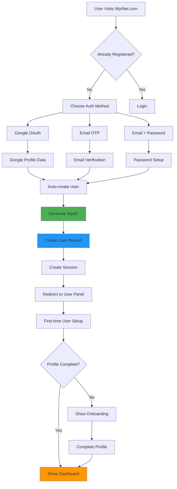
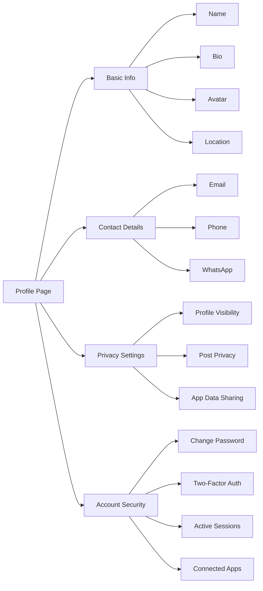
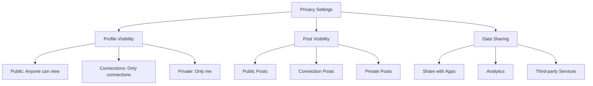
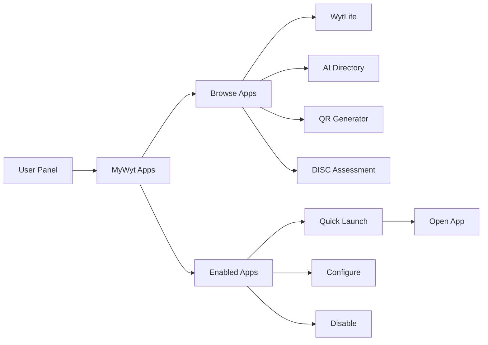

# User Registration & User Panel

## User Registration Workflow

### Complete Registration Flow



### Registration Data Flow

**Step 1: Choose Authentication Method**
```typescript
// User selects one of three methods
type AuthMethod = 'google' | 'email_otp' | 'email_password';
```

**Step 2: Collect User Information**
```typescript
interface RegistrationData {
  // From Google OAuth
  email: string;
  name?: string;
  avatar?: string;
  googleId?: string;
  
  // For Email/Password
  password?: string;
  
  // Generated by system
  displayId: string; // e.g., UR0000001
  authProvider: AuthMethod;
  emailVerified: boolean;
}
```

**Step 3: Create User Record**
```sql
INSERT INTO users (
  id,
  display_id,
  email,
  name,
  avatar,
  auth_provider,
  email_verified,
  created_at
) VALUES (
  gen_random_uuid(),
  generate_display_id('UR'), -- UR0000001
  'user@example.com',
  'John Doe',
  'https://avatar.url',
  'google',
  true,
  NOW()
);
```

**Step 4: Create Session**
- Session stored in PostgreSQL
- httpOnly cookie set
- 7-day expiration
- User redirected to dashboard

---

## User Panel Overview

The User Panel is the main dashboard for registered users after logging in.

### Panel Layout

```
┌─────────────────────────────────────────────────┐
│  Header: Logo | Search | Notifications | Avatar │
├─────────────────────────────────────────────────┤
│ ┌─────────┬─────────────────────────────────┐  │
│ │         │                                 │  │
│ │ Sidebar │      Main Content Area          │  │
│ │         │                                 │  │
│ │  Menu   │  - Dashboard / Home             │  │
│ │  Items  │  - MyWyt Apps                   │  │
│ │         │  - WytWall Feed                 │  │
│ │         │  - Profile Settings             │  │
│ │         │  - Notifications                │  │
│ └─────────┴─────────────────────────────────┘  │
├─────────────────────────────────────────────────┤
│  Footer: Links | Copyright | Social             │
└─────────────────────────────────────────────────┘
```

### Desktop Navigation (Sidebar)
```
📊 Dashboard
📱 MyWyt Apps
🌐 WytWall
🔔 Notifications
⚙️ Settings
👤 Profile
📝 Posts
❤️ Saved Items
🚪 Logout
```

### Mobile Navigation (Bottom Nav)
```
🏠 Home    📱 Apps    🌐 Wall    👤 Profile
```

---

## User Dashboard Features

### 1. Profile Overview Card

```typescript
interface UserProfile {
  displayId: string;          // UR0000001
  name: string;
  email: string;
  phoneNumber?: string;
  whatsappNumber?: string;
  avatar?: string;
  bio?: string;
  location?: string;
  joinedDate: Date;
  
  // Stats
  stats: {
    postsCount: number;
    appsEnabled: number;
    connectionsCount: number;
  }
}
```

**Display Example**:
```
┌─────────────────────────────────────┐
│  [Avatar]  John Doe (UR0000001)    │
│            user@example.com         │
│            +91 98765 43210          │
│                                     │
│  Bio: Full-stack developer          │
│  Location: Chennai, India           │
│  Joined: Jan 20, 2025               │
│                                     │
│  📝 12 Posts  📱 5 Apps  👥 24 Conn │
└─────────────────────────────────────┘
```

### 2. Quick Actions

- **Edit Profile**: Update personal information
- **Manage Apps**: Enable/disable MyWyt Apps
- **Create Post**: Quick post to WytWall
- **View Notifications**: Recent activity
- **Settings**: Account and privacy settings

### 3. Recent Activity

- Latest WytWall posts
- App interactions
- Connection requests
- System notifications

### 4. Enabled Apps Widget

Shows currently active MyWyt Apps with quick access:
- WytLife
- AI Directory
- QR Generator
- DISC Assessment

---

## Profile Management

### Personal Information



### Profile Update Flow

```typescript
// Update profile API
PATCH /api/user/profile

Request:
{
  "name": "John Doe",
  "bio": "Full-stack developer",
  "phoneNumber": "+919876543210",
  "avatar": "https://cdn.wytnet.com/avatars/user.jpg"
}

Response:
{
  "success": true,
  "user": { /* updated user object */ }
}
```

---

## Notification System

### Notification Types

```typescript
type NotificationType =
  | 'post_approved'      // Your WytWall post was approved
  | 'post_rejected'      // Your post was rejected
  | 'post_liked'         // Someone liked your post
  | 'post_commented'     // New comment on your post
  | 'new_follower'       // Someone followed you
  | 'app_enabled'        // New app enabled
  | 'system_update'      // Platform announcement
  | 'security_alert';    // Security-related notification

interface Notification {
  id: string;
  type: NotificationType;
  title: string;
  message: string;
  read: boolean;
  actionUrl?: string;
  createdAt: Date;
}
```

### Notification Display

**Unread Count Badge**:
```
🔔 (3)  ← Shows unread count
```

**Notification List**:
```
┌──────────────────────────────────────┐
│ 🎉 Post Approved                     │
│    Your post "Welcome..." is live    │
│    2 hours ago                   [×] │
├──────────────────────────────────────┤
│ ❤️ New Like                          │
│    John liked your post              │
│    5 hours ago                   [×] │
├──────────────────────────────────────┤
│ 💬 New Comment                       │
│    Sarah commented on your post      │
│    1 day ago                     [×] │
└──────────────────────────────────────┘
```

### Real-time Updates
- WebSocket connection for live notifications
- Browser push notifications (PWA)
- Email notifications (configurable)

---

## Settings & Preferences

### Account Settings

```typescript
interface UserSettings {
  // Privacy
  profileVisibility: 'public' | 'connections' | 'private';
  showEmail: boolean;
  showPhone: boolean;
  
  // Notifications
  emailNotifications: boolean;
  pushNotifications: boolean;
  notificationTypes: NotificationType[];
  
  // App Preferences
  enabledApps: string[]; // App IDs
  defaultLandingPage: '/dashboard' | '/apps' | '/wall';
  
  // Display
  theme: 'light' | 'dark' | 'auto';
  language: 'en' | 'ta';
}
```

### Privacy Controls



---

## Session Management

### Active Sessions

Users can view and manage all active login sessions:

```
┌─────────────────────────────────────────┐
│ Current Session (You)                   │
│ 🖥️ Chrome on Windows                    │
│ Chennai, India                          │
│ Last active: Just now              [×] │
├─────────────────────────────────────────┤
│ 📱 Mobile Safari                        │
│ Mumbai, India                           │
│ Last active: 2 hours ago           [×] │
└─────────────────────────────────────────┘

[Logout All Other Sessions]
```

### Session Security
- View IP addresses
- See device and browser info
- Last active timestamps
- Revoke individual sessions
- Logout from all devices

---

## App Integration

### MyWyt Apps Access

From the User Panel, users can:

1. **Discover Apps**: Browse available MyWyt Apps
2. **Enable Apps**: Activate apps for their account
3. **Configure Apps**: Set app-specific preferences
4. **Launch Apps**: Quick access to enabled apps



---

## Mobile Experience

### Responsive Design

**Mobile Layout**:
- Bottom navigation bar (fixed)
- Swipeable panels
- Touch-optimized controls
- Optimized images and lazy loading

**Touch Gestures**:
- Swipe right: Open menu
- Swipe left: Close menu
- Pull down: Refresh
- Swipe up on posts: Load more

### PWA Features

- **Install to Home Screen**: Add WytNet as app
- **Offline Mode**: Cache key pages
- **Push Notifications**: Real-time alerts
- **Background Sync**: Upload when back online

---

## API Endpoints

### Get User Profile
```http
GET /api/user/profile

Response 200:
{
  "id": "uuid",
  "displayId": "UR0000001",
  "name": "John Doe",
  "email": "user@example.com",
  ...
}
```

### Update Profile
```http
PATCH /api/user/profile
Content-Type: application/json

{
  "name": "John Doe",
  "bio": "Developer",
  "phoneNumber": "+919876543210"
}

Response 200:
{
  "success": true,
  "user": { ... }
}
```

### Get Notifications
```http
GET /api/user/notifications?page=1&limit=20

Response 200:
{
  "notifications": [...],
  "total": 45,
  "unread": 3
}
```

### Mark Notification as Read
```http
PATCH /api/user/notifications/:id/read

Response 200:
{
  "success": true
}
```

### Get User Settings
```http
GET /api/user/settings

Response 200:
{
  "profileVisibility": "public",
  "emailNotifications": true,
  ...
}
```

### Update Settings
```http
PATCH /api/user/settings
Content-Type: application/json

{
  "profileVisibility": "connections",
  "pushNotifications": true
}

Response 200:
{
  "success": true,
  "settings": { ... }
}
```

---

## Next Steps

- [WytWall Feature →](/en/features/wytwall)
- [MyWyt Apps →](/en/features/mywyt-apps)
- [API Reference →](/en/api/user)
