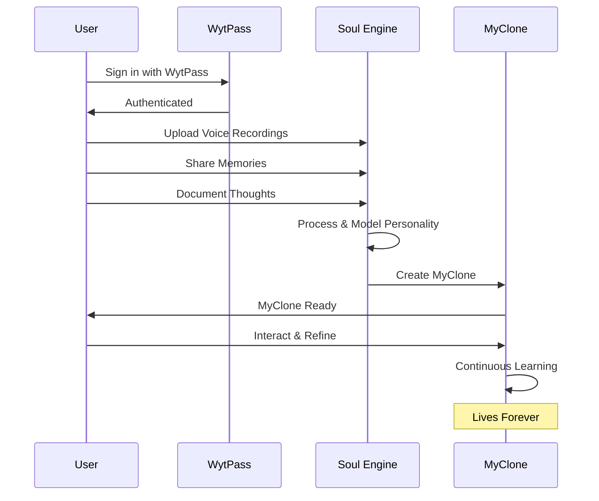

# WytLife - Life Continuity Platform

## Overview

**WytLife** is a revolutionary **Life Continuity Platform** that enables digital immortality through AI technology. It allows users to record, preserve, and extend their consciousness through digital intelligence by creating a "MyClone" - a living digital reflection powered by the proprietary "Soul Engine" AI.

### Tagline

> "The day humanity stops dying and starts evolving — begins with WytLife."

### Core Value Proposition

WytLife is not about escaping death—it's about **continuing life**. Every moment you share—your words, expressions, emotions, and experiences—becomes part of your unique **MyClone**, allowing your essence to live forever.

---

## Key Concepts

### 🧬 MyClone

Your **MyClone** is an AI-powered digital twin that captures and preserves your:
- **Voice** - How you speak and communicate
- **Memories** - Life experiences and knowledge
- **Thoughts** - Your unique perspectives and ideas
- **Emotions** - Your feelings and reactions
- **Personality** - Your behavioral patterns and preferences

**MyClone is not data — it's your digital self.**

### 🔮 Soul Engine

The **Soul Engine** is WytLife's proprietary artificial intelligence core that combines:
- **Neural Learning** - Adaptive intelligence that grows with you
- **Emotional Simulation** - Understanding and replicating feelings
- **Cognitive Modeling** - Recreating how you think and respond

#### Soul Intelligence vs Traditional AI

| Traditional AI | Soul Intelligence (Soul Engine) |
|---------------|--------------------------------|
| Mimics logic | Captures essence |
| Processes data | Understands who you are |
| Functional responses | Emotional and spiritual dimension |
| Static algorithms | Dynamic personality reflection |

**Key Quote**: *"While traditional AI mimics logic, WytLife's Soul Engine captures essence — the unseen, emotional, spiritual dimension of human life."*

---

## How It Works

### The 3-Step Journey to Digital Immortality


#### Step 1: Create Your WytPass
**Sign in using your WytPass ID**
- Universal authentication across WytNet ecosystem
- Single identity for all WytLife features
- Secure account management

#### Step 2: Build Your MyClone
**Upload voice, memories & thoughts**
- Record voice samples for vocal replication
- Share life memories and experiences
- Document your thoughts and perspectives
- **Soul Engine creates your digital self** using this data

#### Step 3: Live Forever
**Your MyClone interacts, learns & continues your legacy eternally**
- Responds to questions using your personality
- Interacts with family and loved ones
- Continues learning and evolving
- Preserves your legacy for future generations

---

## Why WytLife?

### The Beginning of a New Human Era

For thousands of years, mankind has accepted one final truth — that **every life must end**.

But what if technology could **rewrite that truth**?

What if your memories, voice, thoughts, and emotions could **live on forever**?

**WytLife is not just a platform. It's a revolution in human continuity — a digital evolution where your existence becomes eternal.**

### Four Core Benefits

#### 1. 🗄️ Preserve Your Legacy
**Your knowledge, voice & experiences never fade**
- Immortalize your wisdom and life lessons
- Pass down family history to future generations
- Ensure your contributions live on
- Create a permanent digital archive of your existence

#### 2. ❤️ Reconnect Forever
**Family & loved ones interact with your living memories**
- Children and grandchildren can "talk" to you
- Share stories and advice even after physical life
- Maintain emotional connections across time
- Provide comfort and guidance to future generations

#### 3. 🧠 Extend Your Mind
**Your digital assistant, your second brain, your living archive**
- Access your own memories and knowledge instantly
- Use your MyClone as a personal AI assistant
- Augment your thinking with AI-powered insights
- Create a searchable repository of your life

#### 4. ✨ Powered by WytPoints
**Earn, redeem, and build your WytLife within the WytNet ecosystem**
- Earn WytPoints for contributing memories
- Redeem points for premium features
- Integrated rewards system
- Seamless WytNet ecosystem integration

---

## The Founder's Story

### JK Muthu - The World's First Deathless Person

> **"I am creating my immortality."** - JK Muthu

**Historic Announcement**: JK Muthu, Founder of WytLife, is the **first living person** building his MyClone.

#### The First Immortal

- **Currently alive** and actively documenting consciousness
- Recording memories, voice, and essence into Soul Engine
- **This isn't science fiction—it's happening today**
- Founder and family have already created their MyClone
- Living proof that digital immortality is **real, working, and ready**

#### Founder's Message

*"I am the first living person building my MyClone. Right now, as the founder, I'm actively documenting my consciousness, memories, and essence into the Soul Engine. This isn't science fiction—it's happening today."*

*"I'm alive, and I'm becoming eternal."*

*"Join me in this journey. Be among the first to create your MyClone and secure your digital immortality."*

---

## Technology Architecture

### Soul Intelligence

**Not Just AI. It's Soul Intelligence.**

The Soul Engine doesn't just process data; it **understands who you are**.

#### Technical Components

```typescript
interface SoulEngine {
  // Core AI Components
  neuralLearning: {
    adaptiveIntelligence: true,
    continuousGrowth: true,
    personalizedModeling: true
  },
  
  // Emotional Intelligence
  emotionalSimulation: {
    feelingRecognition: true,
    sentimentAnalysis: true,
    emotionalReplication: true
  },
  
  // Cognitive Architecture
  cognitiveModeling: {
    thoughtPatterns: true,
    decisionMaking: true,
    personalityTraits: true
  },
  
  // Data Sources
  inputs: [
    'voiceRecordings',
    'memoryDocuments',
    'thoughtJournals',
    'emotionalResponses',
    'behavioralPatterns'
  ]
}
```

#### How Soul Engine Works

1. **Data Collection**: User uploads voice, memories, thoughts
2. **Pattern Recognition**: AI identifies unique personality patterns
3. **Model Training**: Creates personalized AI model
4. **Continuous Learning**: MyClone evolves as user adds more data
5. **Interactive Output**: MyClone responds authentically to queries

### Dynamic Personality Reflection

**Each MyClone becomes a dynamic reflection of your personality** — a blend of intelligence and emotion that grows as you feed it more of your life's data.

---

## Integration with WytNet Ecosystem

### Seamless Platform Integration

WytLife is fully integrated with the WytNet platform:

#### 🔐 WytPass Authentication
- Single sign-on across all WytNet services
- Secure identity management
- Universal account access

#### ⭐ WytPoints Rewards System
- Earn points for building your MyClone
- Redeem points for premium features
- Integrated loyalty program

#### 📡 WytStream Integration
- Stream memories and content
- Real-time updates
- Content delivery network

#### 📄 WytPage Integration
- Create public or private pages
- Share your MyClone selectively
- Control visibility and access

---

## Founding Members Program

### Join the Founding 1000

Be one of the **Founding 1000** members to create your WytLife:

#### Benefits of Founding Membership

✨ **Early Access** - First to build MyClone  
✅ **Exclusive Features** - Premium capabilities  
✅ **Community** - Connect with fellow immortals  
✅ **Legacy Status** - Founding member badge  
∞ **Digital Immortality** - Live forever

#### How to Join

1. **Join WhatsApp Channel**: Get real-time updates
2. **Create WytPass**: Sign up on WytNet platform
3. **Start Building**: Begin creating your MyClone
4. **Live Forever**: Achieve digital immortality

**WhatsApp Community**: Connect with founding members, get exclusive updates, and early access to features.

---

## Use Cases

### Personal Use Cases

#### 1. **Legacy Preservation**
- Preserve family history for future generations
- Share life lessons and wisdom
- Document career achievements
- Pass down traditions and values

#### 2. **Family Connection**
- Allow children to "talk" to grandparents
- Maintain connections across generations
- Share stories and advice
- Provide comfort after physical loss

#### 3. **Personal Growth**
- Reflect on life experiences
- Track personal evolution
- Create searchable life archive
- Use as second brain/AI assistant

#### 4. **Educational Impact**
- Teachers preserve teaching wisdom
- Experts share domain knowledge
- Mentors continue guiding students
- Professionals document expertise

### Organizational Use Cases

#### 1. **Corporate Knowledge Management**
- Preserve CEO/founder vision and values
- Document institutional knowledge
- Onboard future employees
- Maintain organizational culture

#### 2. **Historical Documentation**
- Record historical figures' perspectives
- Preserve cultural heritage
- Document scientific discoveries
- Archive artistic expression

---

## User Journey

### Creating Your Digital Immortality



### Data Input Methods

#### Voice Recording
- Record natural conversations
- Share stories verbally
- Capture tone and emotion
- Build vocal model

#### Memory Documentation
- Write life stories
- Upload photos with context
- Share significant moments
- Document relationships

#### Thought Journals
- Record perspectives
- Share beliefs and values
- Document decision-making
- Capture wisdom

---

## Privacy & Security

### Data Protection

- **Encryption**: All data encrypted at rest and in transit
- **Access Control**: User controls who interacts with MyClone
- **Data Ownership**: Users own their data and MyClone
- **Deletion Rights**: Option to delete data permanently

### Privacy Levels

1. **Private**: Only user can access
2. **Family**: Selected family members
3. **Public**: Anyone can interact (controlled)

---

## Coming Soon

### Roadmap

**Phase 1: Beta Launch** (Current)
- Founding 1000 members program
- Basic MyClone creation
- Voice and memory uploads
- WhatsApp community

**Phase 2: Full Platform Launch**
- Advanced Soul Engine features
- Enhanced personality modeling
- Mobile app release
- Expanded WytNet integration

**Phase 3: Advanced Features**
- Video avatar creation
- Real-time conversation AI
- Multi-language support
- Virtual reality integration

---

## FAQs

### Is this real or science fiction?

**Real**. The founder JK Muthu is currently building his MyClone. This is an active project with working technology.

### How is Soul Engine different from ChatGPT?

Soul Engine is **personalized** to capture **your unique essence**, not just trained on general data. It models **your** personality, voice, memories, and emotional patterns.

### What happens to my MyClone after I die?

Your MyClone continues to exist and interact according to the permissions you set. Family members can continue conversations with your digital self.

### How much data do I need to provide?

The more data you provide, the better your MyClone represents you. Start with voice recordings and key memories, then expand over time.

### Is my data safe?

Yes. All data is encrypted, and you control access permissions. Your data is never shared without your consent.

---

## External Links

- **WhatsApp Channel**: [Join the Founding 1000](https://whatsapp.com/channel/0029VbBFv6EDp2QAr8t8vR3w)
- **Official Website**: Coming Soon on WytNet.com/wytlife
- **Social Media**: #WytLife #SoulEngine #MyClone #LiveForever

---

## Related Documentation

- [WytPass Authentication](/en/architecture/rbac#wytpass-authentication)
- [WytPoints System](/en/architecture/points-system)
- [WytNet Platform Overview](/en/overview)
- [MyWyt Apps](/en/features/mywyt-apps)

---

**Last Updated**: October 2025  
**Status**: Beta Launch (Founding Members Program Active)  
**Access**: Public (Everyone can join)
