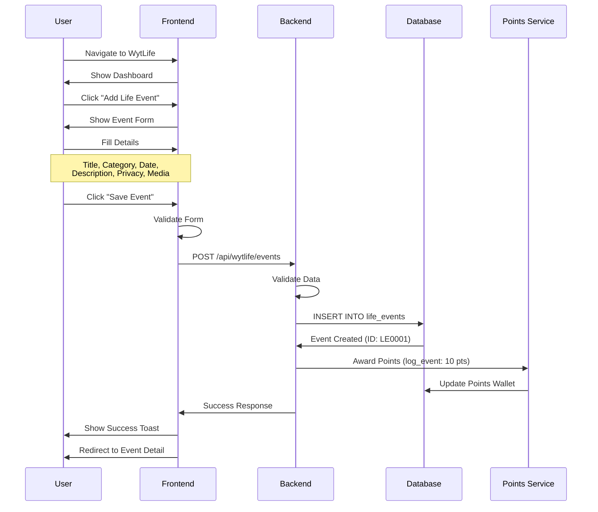
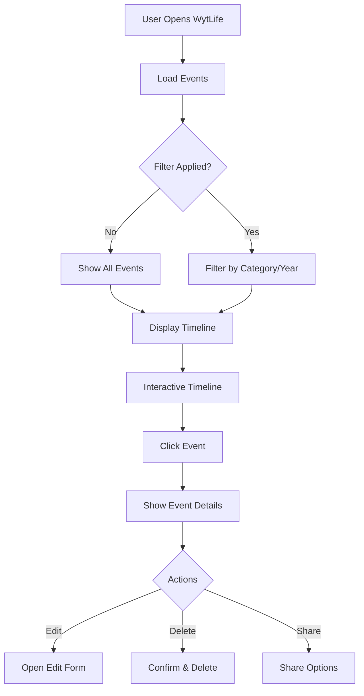
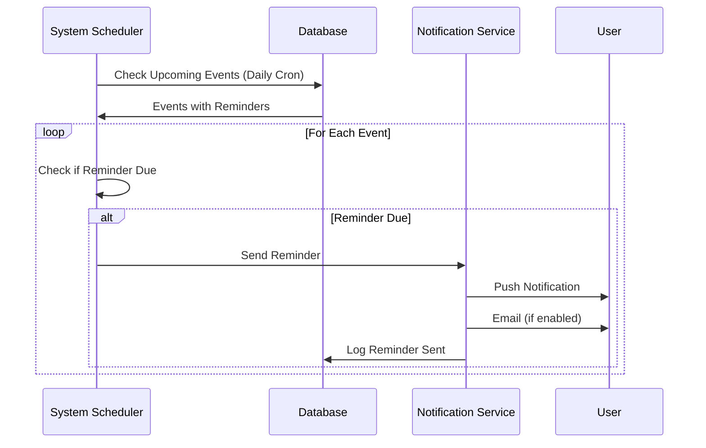
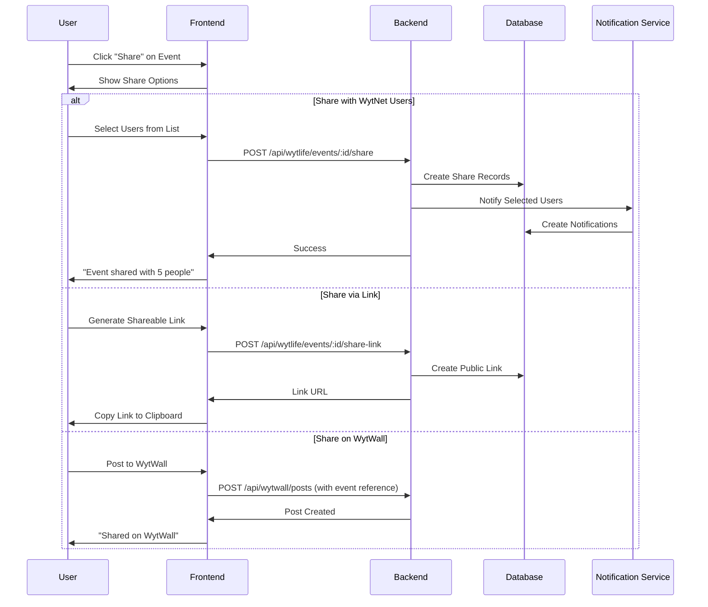

# WytLife - Lifestyle & Life Events Management

## Overview

**WytLife** is a comprehensive lifestyle and life events management app within WytNet that helps users organize, celebrate, and remember important moments in their lives. It serves as a digital journal combined with event planning and milestone tracking, all integrated with the social features of WytNet.

### Key Features

- **Life Events Tracking**: Record and categorize major life events
- **Milestone Management**: Set and track personal and family milestones
- **Event Planning**: Plan celebrations, gatherings, and special occasions
- **Memory Timeline**: Visual timeline of life's important moments
- **Shared Events**: Collaborate with family and friends on events
- **Reminders & Notifications**: Never forget important dates
- **Photo & Media Integration**: Attach photos, videos, and documents to events
- **WytPoints Integration**: Earn points for logging life events

---

## Use Cases

### Personal Use Cases

1. **Life Milestones**
   - Marriage
   - Birth of children
   - Graduation
   - Job changes
   - Home purchase
   - Retirement

2. **Family Events**
   - Birthdays
   - Anniversaries
   - Reunions
   - Holidays
   - Vacations

3. **Health & Wellness**
   - Medical appointments
   - Fitness milestones
   - Diet tracking
   - Wellness goals

4. **Financial Milestones**
   - First salary
   - Debt payoff
   - Investment milestones
   - Property acquisitions

5. **Personal Growth**
   - Learning achievements
   - Skill development
   - Certifications
   - Awards & recognition

---

## User Workflow

### 1. Creating a Life Event



**API Endpoint**: `POST /api/wytlife/events`

**Request Body**:
```typescript
{
  title: string,                   // "My Wedding Day"
  category: string,                // "marriage", "birth", "graduation"
  eventDate: Date,                 // Date of the event
  description?: string,            // Details about the event
  location?: string,               // Where it happened
  tags?: string[],                 // ["wedding", "family", "celebration"]
  media?: string[],                // URLs to uploaded photos/videos
  privacy: "private" | "family" | "public",
  participants?: string[],         // User IDs of people involved
  reminderDays?: number[],         // [7, 1] (remind 7 days and 1 day before)
  isRecurring?: boolean,           // For annual events like birthdays
  recurrencePattern?: string       // "yearly", "monthly", etc.
}
```

**Response**:
```typescript
{
  success: true,
  event: {
    id: string,
    displayId: "LE0001",
    userId: string,
    title: "My Wedding Day",
    category: "marriage",
    eventDate: "2025-10-20T00:00:00Z",
    description: "...",
    location: "Chennai",
    tags: ["wedding", "family"],
    media: ["https://..."],
    privacy: "family",
    participants: ["UR0001", "UR0002"],
    createdAt: "2025-10-20T10:30:00Z"
  },
  pointsAwarded: 10
}
```

---

### 2. Timeline View

Users can view their life events in a chronological timeline.



**Timeline Layout**:

```
┌──────────────────────────────────────────────────┐
│  My Life Timeline                    [+ Add Event] │
│                                                  │
│  Filters: [All] [Family] [Career] [Health]      │
│  Years: [2025] [2024] [2023] [Earlier]          │
├──────────────────────────────────────────────────┤
│                                                  │
│  2025                                            │
│  ━━━━━━━━━━━━━━━━━━━━━━━━━━━━━━━━━━━━━━━━━━━━   │
│                                                  │
│  Oct 20 │ 💍 My Wedding Day                     │
│         │ Marriage • Private                    │
│         │ [View] [Edit] [Share]                 │
│         │ [Photo Gallery 📷 12 photos]          │
│                                                  │
│  Sep 15 │ 🎓 MBA Graduation                     │
│         │ Education • Public                    │
│         │ [View] [Edit] [Share]                 │
│                                                  │
│  2024                                            │
│  ━━━━━━━━━━━━━━━━━━━━━━━━━━━━━━━━━━━━━━━━━━━━   │
│                                                  │
│  Dec 31 │ 🏠 Bought Our First Home              │
│         │ Property • Family                     │
│         │ [View] [Edit] [Share]                 │
│                                                  │
└──────────────────────────────────────────────────┘
```

**API Endpoint**: `GET /api/wytlife/events`

**Query Parameters**:
```typescript
{
  category?: string,
  year?: number,
  startDate?: Date,
  endDate?: Date,
  privacy?: "private" | "family" | "public",
  page?: number,
  limit?: number
}
```

**Response**:
```typescript
{
  success: true,
  events: [
    {
      id: string,
      displayId: string,
      title: string,
      category: string,
      eventDate: Date,
      description: string,
      location: string,
      tags: string[],
      media: string[],
      privacy: string,
      participantCount: number,
      createdAt: Date
    }
  ],
  stats: {
    totalEvents: number,
    categoryCounts: {
      marriage: 1,
      birth: 2,
      graduation: 1,
      career: 5
    }
  },
  pagination: {
    page: number,
    limit: number,
    total: number
  }
}
```

---

### 3. Event Categories

WytLife organizes events into predefined categories for better organization:

| Category | Icon | Examples |
|----------|------|----------|
| **Marriage** | 💍 | Wedding, Anniversary |
| **Birth** | 👶 | Child birth, Adoption |
| **Education** | 🎓 | Graduation, Degree completion |
| **Career** | 💼 | Job start, Promotion, Retirement |
| **Property** | 🏠 | Home purchase, Real estate |
| **Travel** | ✈️ | Vacations, Trips |
| **Health** | 🏥 | Medical milestones, Recovery |
| **Achievement** | 🏆 | Awards, Recognition |
| **Loss** | 🕊️ | Passing of loved ones (private) |
| **Other** | 📌 | Custom events |

---

### 4. Reminders & Notifications



**Reminder Types**:

1. **Pre-Event Reminders**
   - 30 days before
   - 7 days before
   - 1 day before
   - On the day

2. **Annual Reminders** (for recurring events)
   - Birthdays
   - Anniversaries
   - Yearly milestones

**Notification Example**:
```
📅 Upcoming Event Reminder
Your wedding anniversary is in 7 days (Oct 20, 2025)
[View Event] [Add to Calendar]
```

---

### 5. Sharing Events

Users can share special events with family and friends.



---

## Technical Implementation

### Data Model

```typescript
// Life Events Table
interface LifeEvent {
  id: string;                      // UUID
  displayId: string;               // LE0001
  userId: string;                  // FK to users
  
  // Event Details
  title: string;
  category: string;
  eventDate: Date;
  description?: string;
  location?: string;
  tags: string[];
  
  // Media
  media: string[];                 // Array of URLs
  
  // Privacy & Sharing
  privacy: "private" | "family" | "public";
  participants: string[];          // User IDs
  sharedWith: string[];            // User IDs who can view
  
  // Reminders
  isRecurring: boolean;
  recurrencePattern?: string;      // "yearly", "monthly"
  reminderDays: number[];          // [30, 7, 1]
  lastReminderSent?: Date;
  
  // Stats
  views: number;
  likes: number;
  comments: number;
  
  // Soft Delete
  deletedAt?: Date;
  
  createdAt: Date;
  updatedAt: Date;
}

// Event Shares
interface EventShare {
  id: string;
  eventId: string;                 // FK to life_events
  sharedBy: string;                // User ID
  sharedWith: string;              // User ID
  message?: string;                // Optional message
  createdAt: Date;
}

// Event Comments
interface EventComment {
  id: string;
  eventId: string;
  userId: string;
  content: string;
  createdAt: Date;
}

// Event Likes
interface EventLike {
  id: string;
  eventId: string;
  userId: string;
  createdAt: Date;
}
```

---

## API Endpoints

### Create Event
```http
POST /api/wytlife/events
Content-Type: application/json

{
  "title": "My Wedding Day",
  "category": "marriage",
  "eventDate": "2025-10-20",
  "description": "...",
  "privacy": "family",
  "media": ["url1", "url2"]
}
```

### Get Events (Timeline)
```http
GET /api/wytlife/events?category=marriage&year=2025
```

### Get Single Event
```http
GET /api/wytlife/events/:id
```

### Update Event
```http
PATCH /api/wytlife/events/:id
Content-Type: application/json

{
  "title": "Updated Title",
  "description": "New description"
}
```

### Delete Event
```http
DELETE /api/wytlife/events/:id
```

### Share Event
```http
POST /api/wytlife/events/:id/share
Content-Type: application/json

{
  "userIds": ["UR0001", "UR0002"],
  "message": "Sharing this special moment with you!"
}
```

### Like Event
```http
POST /api/wytlife/events/:id/like
```

### Comment on Event
```http
POST /api/wytlife/events/:id/comments
Content-Type: application/json

{
  "content": "Congratulations!"
}
```

---

## Frontend Components

### Event Card Component

```tsx
import { Card } from "@/components/ui/card";
import { Button } from "@/components/ui/button";
import { Badge } from "@/components/ui/badge";
import { Calendar, MapPin, Eye, Heart, MessageCircle, Share2 } from "lucide-react";

interface EventCardProps {
  event: LifeEvent;
}

export function EventCard({ event }: EventCardProps) {
  const categoryIcons: Record<string, string> = {
    marriage: "💍",
    birth: "👶",
    graduation: "🎓",
    career: "💼",
    property: "🏠"
  };
  
  return (
    <Card className="p-4 hover:shadow-lg transition-shadow">
      <div className="flex items-start gap-4">
        <div className="text-4xl">
          {categoryIcons[event.category] || "📌"}
        </div>
        
        <div className="flex-1">
          <div className="flex items-start justify-between mb-2">
            <div>
              <h3 className="text-lg font-semibold">{event.title}</h3>
              <div className="flex items-center gap-2 text-sm text-muted-foreground">
                <Calendar className="w-4 h-4" />
                <span>{new Date(event.eventDate).toLocaleDateString()}</span>
                {event.location && (
                  <>
                    <MapPin className="w-4 h-4 ml-2" />
                    <span>{event.location}</span>
                  </>
                )}
              </div>
            </div>
            <Badge variant="secondary">{event.privacy}</Badge>
          </div>
          
          {event.description && (
            <p className="text-sm mb-3 line-clamp-2">{event.description}</p>
          )}
          
          {event.media && event.media.length > 0 && (
            <div className="flex gap-2 mb-3">
              {event.media.slice(0, 3).map((url, i) => (
                
              ))}
              {event.media.length > 3 && (
                <div className="w-20 h-20 bg-gray-200 rounded flex items-center justify-center text-sm">
                  +{event.media.length - 3}
                </div>
              )}
            </div>
          )}
          
          <div className="flex items-center gap-4 text-sm text-muted-foreground">
            <span className="flex items-center gap-1">
              <Eye className="w-4 h-4" />
              {event.views}
            </span>
            <span className="flex items-center gap-1">
              <Heart className="w-4 h-4" />
              {event.likes}
            </span>
            <span className="flex items-center gap-1">
              <MessageCircle className="w-4 h-4" />
              {event.comments}
            </span>
            <Button variant="ghost" size="sm" className="ml-auto">
              <Share2 className="w-4 h-4" />
            </Button>
          </div>
        </div>
      </div>
    </Card>
  );
}
```

---

## Integration with Platform

### WytPoints Integration

Users earn WytPoints for WytLife activities:

| Action | Points |
|--------|--------|
| Log Life Event | 10 |
| Add Photos | 2 per photo (max 10) |
| Share Event | 5 |
| Comment on Event | 2 |
| Complete Profile Timeline | 50 bonus |

### WytWall Integration

Events can be shared on WytWall as posts, appearing in users' feeds:

```typescript
// When sharing event to WytWall
{
  postType: "life_event",
  title: event.title,
  description: event.description,
  media: event.media,
  metadata: {
    eventId: event.id,
    category: event.category,
    eventDate: event.eventDate
  }
}
```

---

## Privacy & Security

### Privacy Levels

1. **Private**: Only visible to the user
2. **Family**: Visible to users added as family members
3. **Public**: Visible to all WytNet users

### Data Protection

- All sensitive events (e.g., health, loss) default to private
- Users can bulk-change privacy settings
- Events can be permanently deleted (not recoverable)
- Media is stored securely with access control

---

## Screenshots Description

### 1. WytLife Dashboard
**Layout**: Timeline view with events chronologically ordered
**Elements**:
- Filter buttons (All, Family, Career, etc.)
- Year selector
- Event cards in timeline format
- "+ Add Event" floating action button

### 2. Add Event Modal
**Layout**: Multi-step form
**Elements**:
- Event title input
- Category selector with icons
- Date picker
- Description textarea
- Location input with map
- Photo upload area
- Privacy selector
- Participants selector
- Reminder settings

### 3. Event Detail Page
**Layout**: Full-page event view
**Elements**:
- Large category icon
- Event title and date
- Location with map preview
- Full description
- Photo gallery with lightbox
- Participants avatars
- Like, comment, share buttons
- Comments section

---

## Related Documentation

- [MyWyt Apps](./mywyt-apps.md)
- [WytWall Integration](./wytwall.md)
- [Points System](../architecture/points-system.md)
- [User Profile](./user-registration.md)
