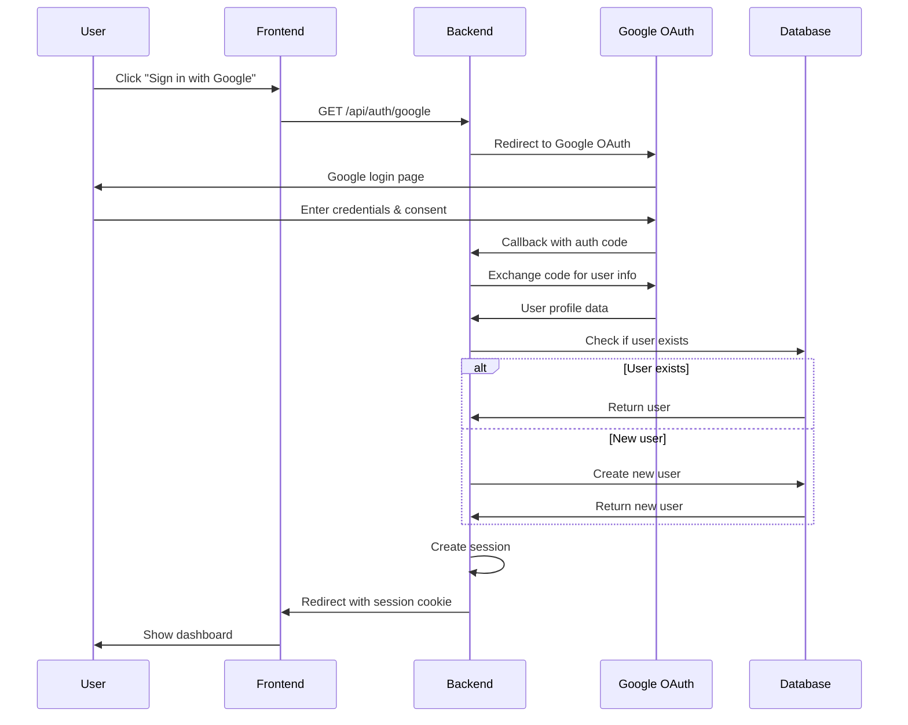
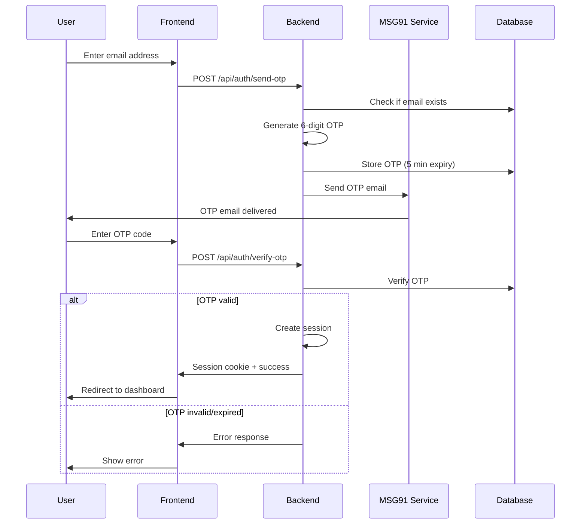
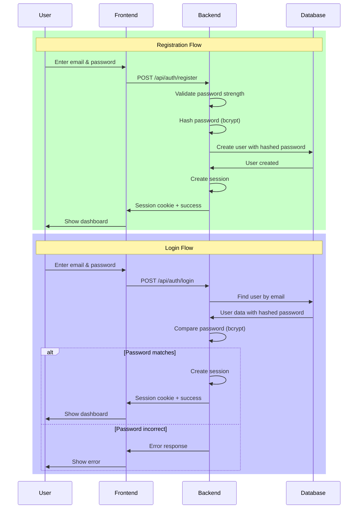
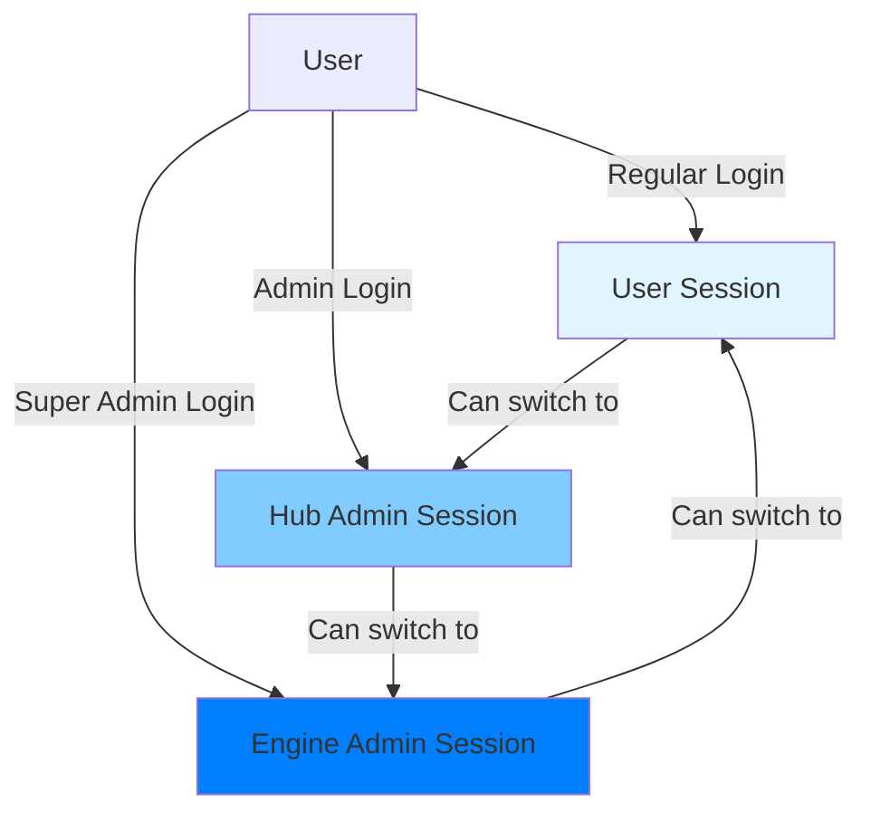

# WytPass Authentication

## Overview

**WytPass** is WytNet's unified authentication system that provides seamless identity management across all platforms, apps, and hubs. It supports multiple authentication methods while maintaining a single user identity.

## Authentication Methods

### 1. Google OAuth

Quick signup/login using Google account.



**Flow Steps**:
1. User clicks "Sign in with Google"
2. Frontend redirects to `/api/auth/google`
3. Backend redirects to Google OAuth consent screen
4. User authenticates with Google
5. Google redirects to callback URL with authorization code
6. Backend exchanges code for user profile
7. System checks if user exists in database
8. If new user, creates account automatically
9. Creates session and sets httpOnly cookie
10. Redirects to user dashboard

---

### 2. Email OTP (Passwordless)

One-time password sent to email for secure, password-free authentication.



**Flow Steps**:
1. User enters email address
2. Backend generates 6-digit OTP
3. OTP stored in database with 5-minute expiry
4. OTP sent via MSG91 email service
5. User receives email with OTP code
6. User enters OTP in frontend
7. Backend validates OTP against database
8. If valid and not expired, creates session
9. User logged in

**Security Features**:
- OTP expires after 5 minutes
- Rate limiting (max 3 attempts per 15 minutes)
- OTP is single-use only
- Secure random generation

---

### 3. Email & Password

Traditional email/password authentication with secure password hashing.



**Password Requirements**:
- Minimum 8 characters
- At least one uppercase letter
- At least one lowercase letter
- At least one number
- At least one special character

**Security Features**:
- Passwords hashed using bcrypt (cost factor 10)
- Never stored in plain text
- Rate limiting on login attempts
- Account lockout after 5 failed attempts

---

## Session Management

### Session Creation

```javascript
// Session stored in PostgreSQL using connect-pg-simple
{
  sid: "session-uuid",
  sess: {
    userId: "UR0000001",
    email: "user@example.com",
    role: "user",
    contexts: ["user"], // Can be: user, hub_admin, super_admin
    createdAt: "2025-01-20T10:00:00Z",
    expiresAt: "2025-01-27T10:00:00Z" // 7 days
  },
  expire: "2025-01-27T10:00:00Z"
}
```

### Session Storage
- **Engine**: PostgreSQL `session` table
- **Cookie**: httpOnly, secure, sameSite=strict
- **Duration**: 7 days (configurable)
- **Renewal**: Auto-renewed on activity

### Multi-Context Sessions

WytPass supports multiple simultaneous contexts for users with elevated permissions:



**Context Types**:
1. **User Context**: Regular user access to WytNet.com
2. **Hub Admin Context**: Admin access to specific hub
3. **Super Admin Context**: Full Engine-level admin access

**Context Switching**:
- Users can switch between contexts without re-authentication
- Each context has its own session
- Permissions validated per context

---

## Unified User Identity

### WytID System

Every user gets a unique identifier:
- **Format**: `UR` + 7-digit number (e.g., UR0000001)
- **Global**: Works across all hubs and apps
- **Permanent**: Never changes
- **Human-readable**: Easy to reference

### User Profile

```typescript
interface User {
  id: string;                    // Database UUID
  displayId: string;              // WytID (e.g., UR0000001)
  email: string;                  // Primary email
  phoneNumber?: string;           // Optional phone
  whatsappNumber?: string;        // Optional WhatsApp
  name?: string;                  // Full name
  avatar?: string;                // Profile picture URL
  authProvider: 'google' | 'email' | 'otp';
  emailVerified: boolean;
  phoneVerified: boolean;
  createdAt: Date;
  updatedAt: Date;
}
```

### Profile Sync
- Single profile across all platforms
- Changes reflect everywhere instantly
- Consistent user experience

---

## Security Features

### 1. CSRF Protection
- Synchronizer token pattern
- Validated on every state-changing request
- Auto-generated per session

### 2. Secure Cookies
```javascript
{
  httpOnly: true,      // Not accessible via JavaScript
  secure: true,        // HTTPS only
  sameSite: 'strict',  // Prevents CSRF
  maxAge: 7 * 24 * 60 * 60 * 1000  // 7 days
}
```

### 3. Rate Limiting
- Login attempts: 5 per 15 minutes per IP
- OTP requests: 3 per 15 minutes per email
- Registration: 10 per hour per IP

### 4. Session Security
- Sessions stored in PostgreSQL, not memory
- Auto-expiration after inactivity
- Secure session ID generation
- Session hijacking prevention

---

## API Endpoints

### Register with Email/Password
```http
POST /api/auth/register
Content-Type: application/json

{
  "email": "user@example.com",
  "password": "SecureP@ss123",
  "name": "John Doe"
}

Response 201:
{
  "success": true,
  "user": {
    "id": "uuid",
    "displayId": "UR0000001",
    "email": "user@example.com",
    "name": "John Doe"
  }
}
```

### Login with Email/Password
```http
POST /api/auth/login
Content-Type: application/json

{
  "email": "user@example.com",
  "password": "SecureP@ss123"
}

Response 200:
{
  "success": true,
  "user": { ... }
}
```

### Send OTP
```http
POST /api/auth/send-otp
Content-Type: application/json

{
  "email": "user@example.com"
}

Response 200:
{
  "success": true,
  "message": "OTP sent to email"
}
```

### Verify OTP
```http
POST /api/auth/verify-otp
Content-Type: application/json

{
  "email": "user@example.com",
  "otp": "123456"
}

Response 200:
{
  "success": true,
  "user": { ... }
}
```

### Google OAuth
```http
GET /api/auth/google
Redirects to Google OAuth consent screen

Callback:
GET /api/auth/google/callback?code=...
Creates session and redirects to dashboard
```

### Logout
```http
POST /api/auth/logout

Response 200:
{
  "success": true,
  "message": "Logged out successfully"
}
```

### Get Current User
```http
GET /api/auth/user

Response 200:
{
  "id": "uuid",
  "displayId": "UR0000001",
  "email": "user@example.com",
  "name": "John Doe",
  ...
}
```

---

## Implementation Example

### Frontend (React)
```typescript
// Login with Email/Password
const handleLogin = async (email: string, password: string) => {
  const response = await apiRequest('/api/auth/login', {
    method: 'POST',
    body: JSON.stringify({ email, password }),
    headers: { 'Content-Type': 'application/json' }
  });
  
  if (response.success) {
    // Session cookie automatically set
    navigate('/dashboard');
  }
};

// Check authentication status
const { data: user, isLoading } = useQuery({
  queryKey: ['/api/auth/user'],
  retry: false
});

if (isLoading) return <Loading />;
if (!user) return <Redirect to="/login" />;
```

### Backend (Express)
```typescript
// Authentication middleware
app.use('/api/protected/*', requireAuth);

function requireAuth(req, res, next) {
  if (!req.session?.userId) {
    return res.status(401).json({ message: 'Not authenticated' });
  }
  next();
}
```

---

## Best Practices

1. **Always use HTTPS** in production
2. **Never log passwords** or sensitive data
3. **Validate inputs** on both client and server
4. **Rate limit** authentication endpoints
5. **Monitor** for suspicious login patterns
6. **Implement** account recovery flows
7. **Use secure** session storage (PostgreSQL)
8. **Rotate** session secrets regularly

---

## Next Steps

- [User Registration Workflow →](/en/features/user-registration)
- [Database Schema →](/en/architecture/database-schema)
- [API Reference →](/en/api/authentication)
