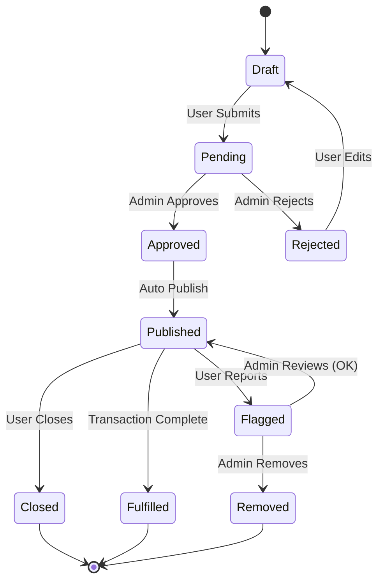
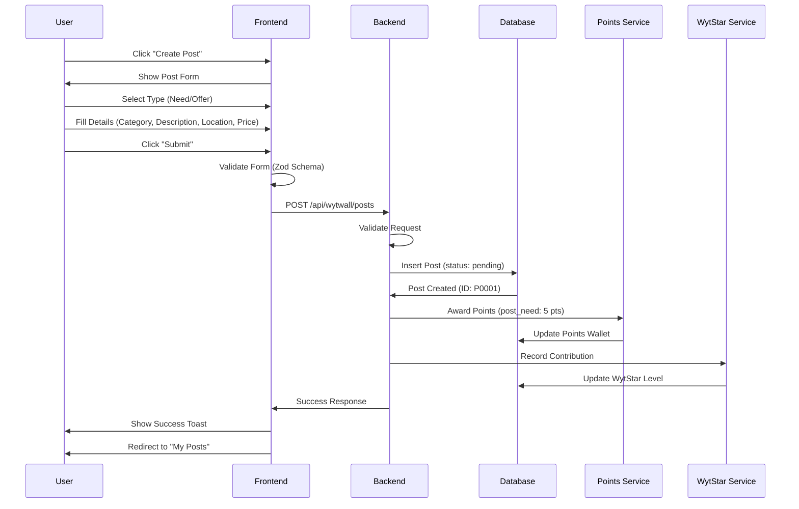
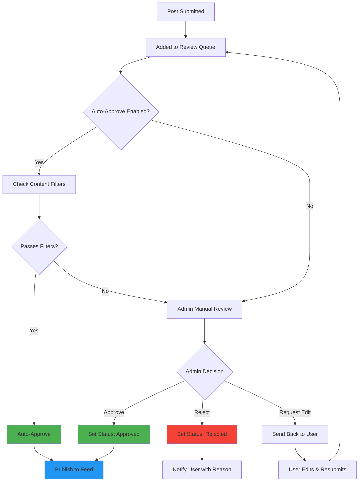
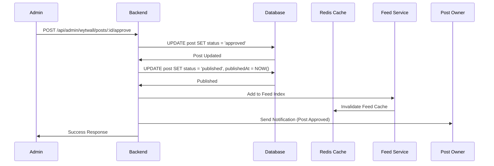
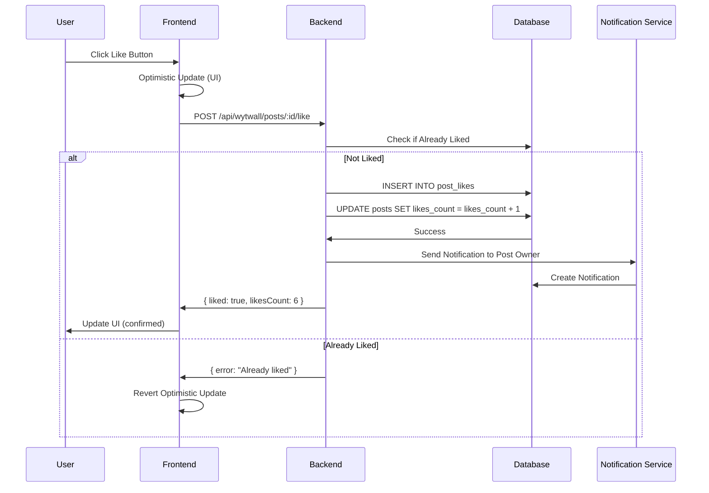
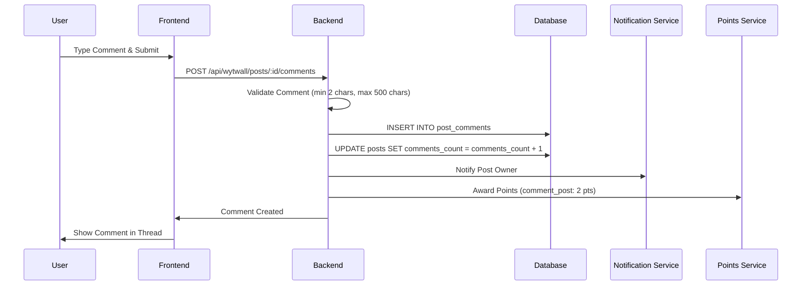
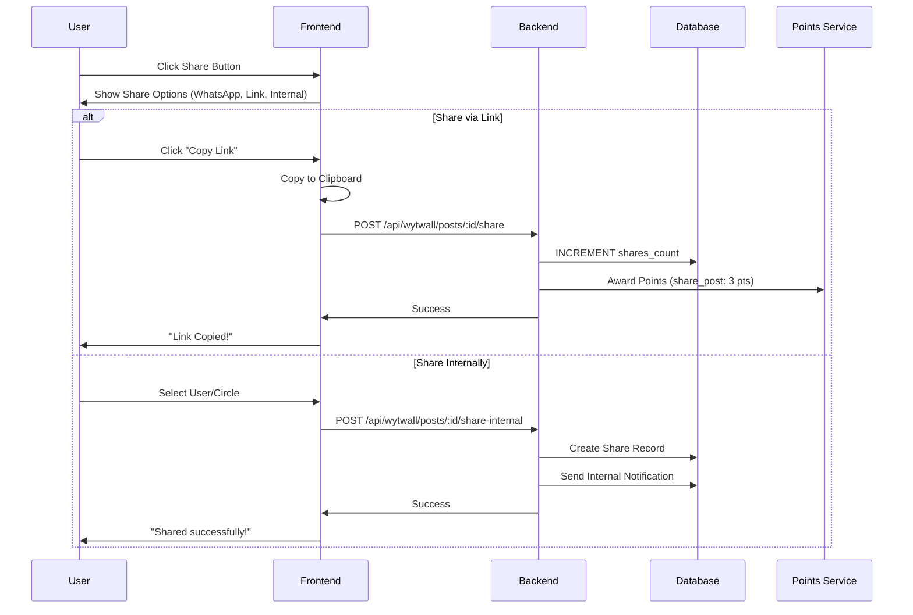
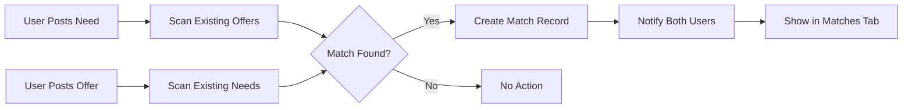

# WytWall - Social Commerce Feed

## Overview

**WytWall** is WytNet's social commerce platform that connects buyers and sellers through a dynamic feed of Needs and Offers. It combines social networking with marketplace functionality, enabling users to post what they need or what they're offering, and discover relevant opportunities through an intelligent feed algorithm.

### Key Features

- **Dual Post Types**: Users can create "Need" or "Offer" posts
- **Smart Matching**: Algorithm matches Needs with Offers (WytMatch)
- **Social Interactions**: Like, comment, share, and save posts
- **Admin Moderation**: Review queue with approval workflow
- **Gamification**: Earn WytPoints and WytStars for posting and engagement
- **Location-based**: Posts can be filtered by location and radius
- **Category System**: Organized by product/service categories

---

## Post Lifecycle & States

### Post States



**State Descriptions**:

| State | Description | User Actions | Admin Actions |
|-------|-------------|--------------|---------------|
| `draft` | Post being composed (not yet submitted) | Edit, Submit, Delete | None |
| `pending` | Awaiting admin approval | Cancel, View | Approve, Reject, Edit |
| `approved` | Admin approved, ready to publish | None (auto-published) | Unpublish |
| `published` | Live on feed, visible to users | Mark Fulfilled, Close, Edit | Unpublish, Flag |
| `fulfilled` | Transaction completed successfully | None | Archive |
| `closed` | User manually closed the post | Reopen | Archive |
| `flagged` | Reported by users for review | None | Remove, Restore |
| `removed` | Admin removed from platform | None | Restore |
| `rejected` | Admin rejected the post | Edit & Resubmit | Archive |

---

## Complete Workflow: Post Creation to Feed

### 1. User Creates Post



**API Endpoint**: `POST /api/wytwall/posts`

**Request Body**:
```typescript
{
  postType: "need" | "offer",
  category: string,
  description: string,
  location?: string,
  radius?: number, // km
  price?: number,
  currency?: string,
  tags?: string[],
  media?: string[], // URLs to uploaded images
  visibility: "public" | "private",
  circleIds?: string[] // For private posts
}
```

**Response**:
```typescript
{
  success: true,
  post: {
    id: "P0001",
    displayId: "P0001",
    userId: "UR0001",
    postType: "need",
    category: "product_for_use",
    description: "Looking for a laptop under 50k",
    location: "Chennai",
    radius: 10,
    price: null,
    budget: 50000,
    currency: "INR",
    status: "pending",
    createdAt: "2025-10-20T10:30:00Z"
  },
  pointsAwarded: 5,
  wytStarContribution: true
}
```

---

### 2. Admin Moderation Workflow



**Admin Review Panel**:

The admin sees a queue of pending posts with the following information:

```
┌─────────────────────────────────────────────────┐
│ Pending Posts Queue (FIFO)                     │
├─────────────────────────────────────────────────┤
│                                                 │
│ [P0001] Need - Product for Use                 │
│ User: John Doe (UR0001)                        │
│ Description: "Looking for a laptop under 50k"  │
│ Location: Chennai (10km radius)                │
│ Budget: ₹50,000                                │
│ Created: 2 mins ago                            │
│                                                 │
│ [✓ Approve] [✗ Reject] [✏️ Request Edit]      │
│                                                 │
├─────────────────────────────────────────────────┤
│                                                 │
│ [P0002] Offer - Service Provider               │
│ User: Jane Smith (UR0002)                      │
│ ...                                            │
│                                                 │
└─────────────────────────────────────────────────┘
```

**API Endpoints**:

**Get Pending Posts**:
```http
GET /api/admin/wytwall/pending-posts
```

**Response**:
```typescript
{
  success: true,
  posts: [
    {
      id: "P0001",
      displayId: "P0001",
      userId: "UR0001",
      userName: "John Doe",
      userAvatar: "https://...",
      postType: "need",
      category: "product_for_use",
      description: "Looking for a laptop under 50k",
      location: "Chennai",
      radius: 10,
      budget: 50000,
      currency: "INR",
      status: "pending",
      createdAt: "2025-10-20T10:30:00Z",
      reportCount: 0
    }
  ],
  total: 15,
  page: 1,
  limit: 10
}
```

**Approve Post**:
```http
POST /api/admin/wytwall/posts/:id/approve
```

**Reject Post**:
```http
POST /api/admin/wytwall/posts/:id/reject

Body: {
  reason: string
}
```

---

### 3. Publishing to Feed

Once approved, the post is automatically published to the WytWall feed.



**Feed Indexing**: The post is added to the feed index with relevance scoring based on:
- **Location proximity** (if user has location)
- **Category preferences** (user's browsing history)
- **Freshness** (newer posts score higher)
- **Engagement** (posts with more likes/comments surface more)
- **WytMatch potential** (Needs matched with relevant Offers)

---

## Feed Algorithm

### Feed Ranking Factors

```typescript
interface FeedScore {
  locationScore: number;    // 0-10 (based on km distance)
  categoryScore: number;    // 0-10 (user preferences)
  freshnessScore: number;   // 0-10 (time decay)
  engagementScore: number;  // 0-10 (likes, comments, shares)
  matchScore: number;       // 0-10 (Need-Offer matching)
  totalScore: number;       // Weighted sum
}
```

**Scoring Algorithm**:

```javascript
function calculateFeedScore(post, user) {
  const scores = {
    location: calculateLocationScore(post.location, user.location, post.radius),
    category: calculateCategoryScore(post.category, user.preferences),
    freshness: calculateFreshnessScore(post.publishedAt),
    engagement: calculateEngagementScore(post.likes, post.comments, post.shares),
    match: calculateMatchScore(post, user.posts)
  };
  
  // Weighted scoring
  const weights = {
    location: 0.25,
    category: 0.20,
    freshness: 0.15,
    engagement: 0.20,
    match: 0.20
  };
  
  return Object.keys(scores).reduce((total, key) => {
    return total + (scores[key] * weights[key]);
  }, 0);
}

// Location scoring: Closer = Higher score
function calculateLocationScore(postLocation, userLocation, radius) {
  if (!postLocation || !userLocation) return 5; // Neutral
  
  const distance = getDistance(postLocation, userLocation); // in km
  
  if (distance > radius) return 0;
  if (distance < 1) return 10;
  
  // Linear decay within radius
  return 10 * (1 - (distance / radius));
}

// Freshness scoring: Exponential decay
function calculateFreshnessScore(publishedAt) {
  const hoursOld = (Date.now() - new Date(publishedAt)) / (1000 * 60 * 60);
  
  if (hoursOld < 1) return 10;
  if (hoursOld > 168) return 1; // 1 week old
  
  // Exponential decay: score = 10 * e^(-0.02 * hours)
  return Math.max(1, 10 * Math.exp(-0.02 * hoursOld));
}

// Engagement scoring
function calculateEngagementScore(likes, comments, shares) {
  const engagementPoints = (likes * 1) + (comments * 3) + (shares * 5);
  
  // Logarithmic scale for engagement
  return Math.min(10, Math.log10(engagementPoints + 1) * 2);
}

// Match scoring: Does this Offer match my Needs?
function calculateMatchScore(post, userPosts) {
  if (!userPosts || userPosts.length === 0) return 5;
  
  const myNeeds = userPosts.filter(p => p.postType === 'need' && p.status === 'published');
  const myOffers = userPosts.filter(p => p.postType === 'offer' && p.status === 'published');
  
  if (post.postType === 'offer' && myNeeds.length > 0) {
    // Check if this offer matches any of my needs
    const matchingNeeds = myNeeds.filter(need => 
      need.category === post.category &&
      (!post.price || !need.budget || post.price <= need.budget)
    );
    
    return matchingNeeds.length > 0 ? 10 : 3;
  }
  
  if (post.postType === 'need' && myOffers.length > 0) {
    // Check if this need matches any of my offers
    const matchingOffers = myOffers.filter(offer => 
      offer.category === post.category &&
      (!post.budget || !offer.price || offer.price <= post.budget)
    );
    
    return matchingOffers.length > 0 ? 10 : 3;
  }
  
  return 5; // Neutral
}
```

**Feed API Endpoint**: `GET /api/wytwall/feed`

**Query Parameters**:
```typescript
{
  page?: number,
  limit?: number, // default: 20
  postType?: "need" | "offer" | "all",
  category?: string,
  location?: string,
  radius?: number, // km
  sortBy?: "relevance" | "recent" | "popular"
}
```

**Response**:
```typescript
{
  success: true,
  posts: [
    {
      id: "P0001",
      displayId: "P0001",
      user: {
        id: "UR0001",
        name: "John Doe",
        avatar: "https://...",
        wytStarLevel: "silver"
      },
      postType: "need",
      category: "product_for_use",
      categoryLabel: "Product for my Use",
      description: "Looking for a laptop under 50k",
      location: "Chennai",
      radius: 10,
      budget: 50000,
      currency: "INR",
      media: ["https://..."],
      tags: ["laptop", "electronics"],
      stats: {
        likes: 5,
        comments: 2,
        shares: 1,
        views: 45
      },
      userInteraction: {
        liked: false,
        saved: false,
        commented: false
      },
      relevanceScore: 8.5,
      distance: 2.3, // km from user
      publishedAt: "2025-10-20T11:00:00Z",
      expiresAt: null
    }
  ],
  pagination: {
    page: 1,
    limit: 20,
    total: 156,
    hasMore: true
  }
}
```

---

## Social Interactions

### 1. Like a Post



**API Endpoint**: `POST /api/wytwall/posts/:id/like`

**Response**:
```typescript
{
  success: true,
  liked: true,
  likesCount: 6
}
```

**Unlike**: `DELETE /api/wytwall/posts/:id/like`

---

### 2. Comment on Post



**API Endpoint**: `POST /api/wytwall/posts/:id/comments`

**Request Body**:
```typescript
{
  content: string, // 2-500 characters
  parentId?: string // For reply to comment
}
```

**Response**:
```typescript
{
  success: true,
  comment: {
    id: "C0001",
    postId: "P0001",
    userId: "UR0002",
    user: {
      id: "UR0002",
      name: "Jane Smith",
      avatar: "https://..."
    },
    content: "I have a Dell laptop in good condition, interested?",
    parentId: null,
    likes: 0,
    replies: [],
    createdAt: "2025-10-20T11:15:00Z"
  },
  pointsAwarded: 2
}
```

**Get Comments**: `GET /api/wytwall/posts/:id/comments?page=1&limit=10`

**Delete Comment**: `DELETE /api/wytwall/posts/:id/comments/:commentId` (own comments only)

---

### 3. Share Post



**API Endpoint**: `POST /api/wytwall/posts/:id/share`

**Request Body**:
```typescript
{
  medium: "link" | "whatsapp" | "internal",
  targetUserId?: string, // For internal shares
  targetCircleId?: string // For circle shares
}
```

---

### 4. Save Post

Users can save posts to view later.

**API Endpoint**: `POST /api/wytwall/posts/:id/save`

**Response**:
```typescript
{
  success: true,
  saved: true
}
```

**Get Saved Posts**: `GET /api/wytwall/saved-posts`

**Unsave**: `DELETE /api/wytwall/posts/:id/save`

---

## WytMatch Feature

**WytMatch** automatically suggests relevant connections between Needs and Offers.



**Match Criteria**:
1. Same category
2. Location within radius (if specified)
3. Price ≤ Budget (if both specified)
4. Both posts are published
5. Users haven't blocked each other

**API Endpoint**: `GET /api/wytwall/matches`

**Response**:
```typescript
{
  success: true,
  matches: [
    {
      id: "M0001",
      yourPost: {
        id: "P0001",
        postType: "need",
        description: "Looking for a laptop under 50k"
      },
      matchedPost: {
        id: "P0055",
        postType: "offer",
        description: "Selling Dell Latitude 5000 series - 45k",
        user: {
          id: "UR0042",
          name: "Tech Store",
          avatar: "https://...",
          wytStarLevel: "gold"
        }
      },
      matchScore: 95, // out of 100
      matchReasons: [
        "Same category",
        "Within budget",
        "Location: 3km away"
      ],
      createdAt: "2025-10-20T11:05:00Z"
    }
  ],
  total: 3
}
```

**Contact Matched User**: `POST /api/wytwall/matches/:id/contact`

This creates a chat thread between the two users.

---

## Data Model

### Database Schema

```typescript
// Posts Table
interface Post {
  id: string;                    // UUID
  displayId: string;             // P0001, P0002, etc.
  userId: string;                // FK to users
  postType: "need" | "offer";
  category: string;
  description: string;
  location?: string;
  latitude?: number;
  longitude?: number;
  radius?: number;               // km
  price?: number;
  budget?: number;
  currency: string;              // INR, USD, etc.
  media: string[];               // Array of image URLs
  tags: string[];
  visibility: "public" | "private";
  circleIds: string[];           // For private posts
  status: "draft" | "pending" | "approved" | "published" | "fulfilled" | "closed" | "flagged" | "removed" | "rejected";
  rejectionReason?: string;
  publishedAt?: Date;
  expiresAt?: Date;
  
  // Stats
  views: number;
  likes: number;
  comments: number;
  shares: number;
  
  // Moderation
  moderatedBy?: string;          // Admin ID
  moderatedAt?: Date;
  flagCount: number;
  
  // Soft Delete
  deletedAt?: Date;
  deletedBy?: string;
  
  createdAt: Date;
  updatedAt: Date;
}

// Post Likes
interface PostLike {
  id: string;
  postId: string;
  userId: string;
  createdAt: Date;
}

// Post Comments
interface PostComment {
  id: string;
  displayId: string;             // C0001
  postId: string;
  userId: string;
  content: string;
  parentId?: string;             // For nested replies
  likes: number;
  deletedAt?: Date;
  createdAt: Date;
  updatedAt: Date;
}

// Post Shares
interface PostShare {
  id: string;
  postId: string;
  userId: string;                // Who shared
  medium: "link" | "whatsapp" | "internal";
  targetUserId?: string;
  targetCircleId?: string;
  createdAt: Date;
}

// Saved Posts
interface SavedPost {
  id: string;
  postId: string;
  userId: string;
  createdAt: Date;
}

// WytMatch
interface WytMatch {
  id: string;
  displayId: string;             // M0001
  needPostId: string;
  offerPostId: string;
  needUserId: string;
  offerUserId: string;
  matchScore: number;            // 0-100
  matchReasons: string[];
  status: "pending" | "contacted" | "accepted" | "rejected" | "completed";
  contactedAt?: Date;
  createdAt: Date;
}
```

---

## Code Examples

### Frontend: Post Card Component

```tsx
import { Card } from "@/components/ui/card";
import { Avatar } from "@/components/ui/avatar";
import { Button } from "@/components/ui/button";
import { Heart, MessageCircle, Share2, Bookmark } from "lucide-react";
import { useMutation } from "@tanstack/react-query";
import { apiRequest, queryClient } from "@/lib/queryClient";

interface PostCardProps {
  post: Post;
}

export function PostCard({ post }: PostCardProps) {
  const likePost = useMutation({
    mutationFn: () => apiRequest(`/api/wytwall/posts/${post.id}/like`, "POST"),
    onSuccess: () => {
      queryClient.invalidateQueries({ queryKey: ["/api/wytwall/feed"] });
    }
  });
  
  return (
    <Card className="p-4">
      {/* User Info */}
      <div className="flex items-center gap-3 mb-3">
        <Avatar src={post.user.avatar} alt={post.user.name} />
        <div>
          <p className="font-semibold">{post.user.name}</p>
          <p className="text-sm text-muted-foreground">{post.location}</p>
        </div>
      </div>
      
      {/* Post Content */}
      <p className="mb-3">{post.description}</p>
      
      {post.postType === "offer" && post.price && (
        <p className="text-lg font-bold text-green-600">₹{post.price}</p>
      )}
      
      {post.postType === "need" && post.budget && (
        <p className="text-lg font-bold text-blue-600">Budget: ₹{post.budget}</p>
      )}
      
      {/* Actions */}
      <div className="flex items-center gap-4 mt-4 pt-4 border-t">
        <Button 
          variant="ghost" 
          size="sm"
          onClick={() => likePost.mutate()}
          className={post.userInteraction.liked ? "text-red-500" : ""}
        >
          <Heart className="w-4 h-4 mr-1" />
          {post.stats.likes}
        </Button>
        
        <Button variant="ghost" size="sm">
          <MessageCircle className="w-4 h-4 mr-1" />
          {post.stats.comments}
        </Button>
        
        <Button variant="ghost" size="sm">
          <Share2 className="w-4 h-4 mr-1" />
          {post.stats.shares}
        </Button>
        
        <Button variant="ghost" size="sm" className="ml-auto">
          <Bookmark className="w-4 h-4" />
        </Button>
      </div>
    </Card>
  );
}
```

---

## Screenshots Description

### 1. WytWall Feed
**Layout**: Vertical scrolling feed with post cards
**Elements**:
- Filter tabs at top (All, Needs, Offers)
- Category dropdown filter
- Location radius slider
- Post cards with user info, description, price/budget, and interaction buttons

### 2. Create Post Modal
**Layout**: Modal dialog with form
**Elements**:
- Toggle buttons for Need/Offer selection (highlighted)
- Category dropdown (styled select)
- Description textarea with character counter (200 max)
- Location input with map picker
- Radius slider (1-50 km)
- Price/Budget number input (shown based on type)
- Media upload area (drag & drop or click)
- Submit button (disabled during submission)

### 3. Admin Moderation Panel
**Layout**: Table/queue view with post previews
**Elements**:
- Pending posts list (FIFO order)
- Post preview cards showing all details
- Three action buttons: Approve (green), Reject (red), Request Edit (yellow)
- Reject modal with reason textarea
- Stats at top: Pending (15), Approved Today (42), Rejected (3)

### 4. Post Detail Page
**Layout**: Single post view with comments section
**Elements**:
- Full post content with all details
- User profile section with WytStar level badge
- Interaction buttons (Like, Comment, Share, Save)
- Comments section below with nested replies
- Related posts section at bottom

### 5. WytMatch Tab
**Layout**: List of matched needs/offers
**Elements**:
- Match cards showing both posts side-by-side
- Match score badge (e.g., "95% Match")
- Match reasons list
- "Contact User" button
- Distance indicator

---

## User Permissions

| Action | Public User | Logged-in User | Post Owner | Admin |
|--------|-------------|----------------|------------|-------|
| View Feed | ✓ | ✓ | ✓ | ✓ |
| Like Post | ✗ | ✓ | ✓ | ✓ |
| Comment | ✗ | ✓ | ✓ | ✓ |
| Create Post | ✗ | ✓ | ✓ | ✓ |
| Edit Own Post | ✗ | ✗ | ✓ (if draft/pending) | ✓ |
| Delete Own Post | ✗ | ✗ | ✓ | ✓ |
| Approve Post | ✗ | ✗ | ✗ | ✓ |
| Reject Post | ✗ | ✗ | ✗ | ✓ |
| Flag Post | ✗ | ✓ | ✓ | ✓ |
| Remove Post | ✗ | ✗ | ✗ | ✓ |

---

## Gamification Integration

### WytPoints

Users earn WytPoints for WytWall activities:

| Action | Points |
|--------|--------|
| Post Need | 5 |
| Post Offer | 3 |
| Verify Need | 10 |
| Verify Offer | 10 |
| Comment on Post | 2 |
| Share Post | 3 |
| Daily Login Bonus | 1 |

### WytStars

Contributions to WytWall increase WytStar level:

- **Bronze**: 0-99 points
- **Silver**: 100-499 points
- **Gold**: 500-1999 points
- **Platinum**: 2000-9999 points
- **Diamond**: 10000+ points

Higher WytStar levels increase post visibility in feed algorithm.

---

## Future Enhancements

1. **Video Posts**: Allow users to upload short videos
2. **Live Chat**: Real-time chat when match is accepted
3. **Payment Integration**: Complete transactions within platform
4. **Verified Sellers Badge**: For trusted sellers
5. **Advanced Filters**: Filter by price range, verified only, WytStar level
6. **AI-Powered Descriptions**: Auto-suggest descriptions using AI
7. **Voice Posts**: Record audio descriptions
8. **Stories**: 24-hour disappearing posts

---

## Related Documentation

- [WytPass Authentication](./wytpass.md)
- [User Registration](./user-registration.md)
- [MyWyt Apps](./mywyt-apps.md)
- [Points System](../architecture/points-system.md)
- [WytStar Gamification](../architecture/wytstar.md)
