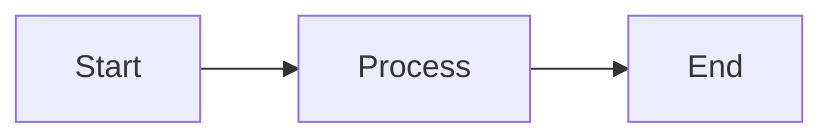

# VitePress DevDoc Editing Guide

This guide covers how to edit, update, and maintain the WytNet DevDoc documentation built with VitePress.

## Quick Start

### Viewing the Documentation

#### Development Mode (Live Preview)
```bash
# Start VitePress dev server with live reload
npm run docs:dev
```

Then open: `http://localhost:5173/devdoc/`

**Features**:
- ✅ Live reload on file changes
- ✅ Instant preview
- ✅ Hot module replacement (HMR)
- ✅ No build required

#### Production Build
```bash
# Build static documentation site
npm run docs:build

# Preview built site
npm run docs:preview
```

The built site is in `docs/.vitepress/dist/` directory.

---

## Documentation Structure

### Directory Layout

```
docs/
├── .vitepress/
│   ├── config.ts          # Main configuration (navigation, sidebar, locales)
│   ├── dist/              # Built documentation (static HTML)
│   └── theme/             # Custom theme (if needed)
├── public/                # Static assets (images, favicons, logos)
│   ├── wytnet-logo.png
│   ├── favicon.ico
│   └── ...
├── en/                    # English documentation
│   ├── overview.md
│   ├── core-concepts.md
│   ├── wytapps/
│   │   ├── index.md
│   │   └── apps-catalog.md
│   ├── wytsuites/
│   │   ├── index.md
│   │   ├── wytworks.md
│   │   ├── wytstax.md
│   │   └── wytcrm.md
│   ├── wytmodules/
│   │   ├── index.md
│   │   └── modules-catalog.md
│   ├── wyth hubs/
│   │   └── index.md
│   ├── features/
│   │   ├── wytpass.md
│   │   ├── wytai-agent.md
│   │   ├── audit-logs.md
│   │   └── pwa-support.md
│   ├── architecture/
│   │   ├── database-schema.md
│   │   ├── multi-tenancy.md
│   │   ├── rbac.md
│   │   ├── frontend.md
│   │   └── backend.md
│   ├── api/
│   │   ├── authentication.md
│   │   ├── users.md
│   │   ├── wytwall.md
│   │   └── admin.md
│   ├── admin/
│   │   ├── engine-admin.md
│   │   └── hub-admin.md
│   ├── implementation/
│   │   ├── replit-guide.md
│   │   └── vitepress-guide.md (this file)
│   └── project/
│       ├── features-checklist.md
│       └── documentation-status.md
├── ta/                    # Tamil documentation (mirrors /en/ structure)
│   └── ...
└── index.md               # Homepage
```

---

## Editing Content

### Creating a New Page

1. **Create markdown file** in appropriate directory:
   ```bash
   # Example: New WytApps documentation
   touch docs/en/wytapps/wytcalendar.md
   ```

2. **Add front matter** (optional):
   ```markdown
   ---
   title: WytCalendar - Event Scheduling App
   description: Comprehensive calendar and event management application
   ---

   # WytCalendar
   
   Your content here...
   ```

3. **Add to navigation** in `docs/.vitepress/config.ts`:
   ```typescript
   {
     text: 'WytApps',
     collapsed: false,
     items: [
       { text: 'WytApps Overview', link: '/en/wytapps/' },
       { text: 'Apps Catalog', link: '/en/wytapps/apps-catalog' },
       { text: 'WytCalendar', link: '/en/wytapps/wytcalendar' }  // NEW
     ]
   }
   ```

### Editing Existing Pages

Simply edit the `.md` file in `docs/en/` or `docs/ta/` directory. Changes are automatically reflected in dev mode (`npm run docs:dev`).

### Markdown Features

VitePress supports enhanced Markdown:

#### Basic Formatting
```markdown
**Bold text**
*Italic text*
`inline code`
[Link text](https://example.com)

```

#### Code Blocks with Syntax Highlighting
````markdown
```typescript
const example = "Supports 100+ languages";
```

```sql
SELECT * FROM users WHERE hub_id = 'HB00001';
```
````

#### Info Boxes
```markdown
::: info
This is an info box.
:::

::: tip
Helpful tip goes here.
:::

::: warning
Warning message.
:::

::: danger
Critical information.
:::
```

#### Mermaid Diagrams
````markdown

````

#### Tables
```markdown
| Column 1 | Column 2 | Column 3 |
|----------|----------|----------|
| Data 1   | Data 2   | Data 3   |
```

#### Internal Links
```markdown
[Link to WytApps](/en/wytapps/)
[Link to specific section](#heading-id)
```

---

## Changing Branding

### Logo

1. **Prepare logo**:
   - Format: PNG with transparent background
   - Size: 512×512px recommended
   - File: `wytnet-logo.png`

2. **Replace logo**:
   ```bash
   # Copy new logo to public directory
   cp new-logo.png docs/public/wytnet-logo.png
   ```

3. **Verify in config** (`docs/.vitepress/config.ts`):
   ```typescript
   themeConfig: {
     logo: '/wytnet-logo.png',
     // ...
   }
   ```

### Favicon

1. **Prepare favicon**:
   - Format: ICO or PNG
   - Sizes: 16×16px, 32×32px, 48×48px (multi-size ICO recommended)
   - File: `favicon.ico`

2. **Replace favicon**:
   ```bash
   cp new-favicon.ico docs/public/favicon.ico
   ```

3. **Verify in config** (`docs/.vitepress/config.ts`):
   ```typescript
   head: [
     ['link', { rel: 'icon', type: 'image/x-icon', href: '/devdoc/favicon.ico' }],
     ['link', { rel: 'icon', type: 'image/png', sizes: '32x32', href: '/devdoc/wytnet-logo.png' }]
   ]
   ```

### Site Title & Description

Edit `docs/.vitepress/config.ts`:

```typescript
export default defineConfig({
  title: 'WytNet DevDoc',        // Browser tab title
  description: 'Complete Developer Documentation for WytNet Platform',
  // ...
})
```

---

## Navigation & Sidebar

### Top Navigation Bar

Edit `docs/.vitepress/config.ts` → `themeConfig.nav`:

```typescript
nav: [
  { text: 'Home', link: '/' },
  { text: 'Core Concepts', link: '/en/core-concepts' },
  { text: 'Features', link: '/en/features/' },
  { text: 'WytApps', link: '/en/wytapps/' },      // Simple link
  { 
    text: 'Resources',                              // Dropdown menu
    items: [
      { text: 'GitHub', link: 'https://github.com/wytnet' },
      { text: 'API Reference', link: '/en/api/' }
    ]
  }
]
```

### Sidebar Menu

Edit `docs/.vitepress/config.ts` → `themeConfig.sidebar`:

```typescript
sidebar: {
  '/en/': [
    {
      text: 'Introduction',
      items: [
        { text: 'Platform Overview', link: '/en/overview' },
        { text: 'Core Concepts', link: '/en/core-concepts' }
      ]
    },
    {
      text: 'WytApps',
      collapsed: false,  // Expanded by default
      items: [
        { text: 'Overview', link: '/en/wytapps/' },
        { text: 'Apps Catalog', link: '/en/wytapps/apps-catalog' }
      ]
    }
  ]
}
```

**Collapsed vs Expanded**:
- `collapsed: false` → Section expanded by default
- `collapsed: true` → Section collapsed by default
- No `collapsed` → Section expanded by default

---

## Localization (English + Tamil)

### Adding Content in Both Languages

1. **English** (`docs/en/`):
   ```markdown
   # WytPass Authentication
   
   Universal identity system...
   ```

2. **Tamil** (`docs/ta/`):
   ```markdown
   # WytPass அங்கீகாரம்
   
   உலகளாவிய அடையாள அமைப்பு...
   ```

3. **Update navigation for both locales** in `config.ts`:

```typescript
locales: {
  root: {
    label: 'English',
    lang: 'en',
    themeConfig: {
      sidebar: {
        '/en/': [
          { text: 'WytPass Authentication', link: '/en/features/wytpass' }
        ]
      }
    }
  },
  ta: {
    label: 'தமிழ்',
    lang: 'ta',
    themeConfig: {
      sidebar: {
        '/ta/': [
          { text: 'WytPass அங்கீகாரம்', link: '/ta/features/wytpass' }
        ]
      }
    }
  }
}
```

---

## Building & Deployment

### Development Build

```bash
# Live preview with hot reload
npm run docs:dev
```

Access at: `http://localhost:5173/devdoc/`

### Production Build

```bash
# Build static site
npm run docs:build
```

Output: `docs/.vitepress/dist/`

The built site is pure static HTML/CSS/JS that can be deployed anywhere.

### Preview Built Site

```bash
# Preview production build locally
npm run docs:preview
```

Access at: `http://localhost:4173/devdoc/`

### Deployment

WytNet DevDoc is automatically served by the Express server at `/devdoc/` route:

```typescript
// server/index.ts
app.use('/devdoc', serveDocSite);  // Serves docs/.vitepress/dist/
```

**Authentication**:
- External developers: Password-protected (`DOC_SITE_PASSWORD`)
- Super Admins: Auto-access via WytPass session
- Replit Agent: API token (`DOC_SITE_API_TOKEN`)

---

## Adding Images & Assets

### Images in Documentation

1. **Store in `docs/public/`**:
   ```bash
   # Add image
   cp screenshot.png docs/public/images/screenshot.png
   ```

2. **Reference in markdown**:
   ```markdown
   
   ```

**Note**: Images in `docs/public/` are accessible at `/devdoc/` base path.

### Images in Same Directory

1. **Store beside markdown file**:
   ```
   docs/en/wytapps/
   ├── index.md
   └── wytcalendar-screenshot.png
   ```

2. **Reference with relative path**:
   ```markdown
   
   ```

---

## Search Configuration

VitePress includes built-in search:

```typescript
// docs/.vitepress/config.ts
themeConfig: {
  search: {
    provider: 'local'  // Local search (no external service needed)
  }
}
```

**Features**:
- ✅ Full-text search across all pages
- ✅ Instant results
- ✅ Keyboard shortcuts (Ctrl+K / Cmd+K)
- ✅ Supports Tamil and English

---

## Troubleshooting

### Build Errors

#### Dead Links
```
Error: Found dead link /en/wrong-link
```

**Fix**: Update broken link or add to `ignoreDeadLinks`:
```typescript
export default defineConfig({
  ignoreDeadLinks: true,  // Ignore all dead links (not recommended)
  // OR
  ignoreDeadLinks: [
    /^\/api\//,  // Ignore links matching regex
  ]
})
```

#### Port Already in Use
```
Error: Port 5173 is already in use
```

**Fix**: Kill process or use different port:
```bash
# Kill process on port 5173
lsof -ti:5173 | xargs kill -9

# Or change port
vite --port 3000
```

### Dev Server Not Reloading

**Fix**: Clear VitePress cache:
```bash
rm -rf docs/.vitepress/cache
rm -rf docs/.vitepress/dist
npm run docs:dev
```

### Missing Sidebar

**Check**:
1. Is page path in `sidebar` config?
2. Is `collapsed` setting correct?
3. Is link path correct (starts with `/en/` or `/ta/`)?

### Mermaid Diagrams Not Rendering

VitePress natively supports Mermaid. Ensure:
```markdown

```

No plugins needed!

---

## Best Practices

### File Naming

✅ **Good**:
- `wytapps/index.md`
- `wytapps/apps-catalog.md`
- `features/wytai-agent.md`

❌ **Avoid**:
- `WytApps/Index.md` (capital letters)
- `wytapps/Apps Catalog.md` (spaces)
- `features/WytAI-Agent.md` (inconsistent casing)

### Link Paths

✅ **Good**:
- `/en/wytapps/` (absolute from docs root)
- `./apps-catalog` (relative in same directory)
- `../features/wytpass` (relative to parent)

❌ **Avoid**:
- `wytapps/` (missing `/en/` prefix)
- `/docs/en/wytapps/` (includes `docs/` directory)

### Content Organization

- **Keep related content together**: All WytApps docs in `/en/wytapps/`
- **Use index.md for section overviews**: `/en/wytapps/index.md` = overview page
- **Detailed pages separately**: Individual app docs as separate files
- **Avoid deep nesting**: Max 2-3 levels deep

---

## Quick Reference Commands

```bash
# Development
npm run docs:dev          # Live preview with hot reload

# Building
npm run docs:build        # Build static site to dist/
npm run docs:preview      # Preview production build

# Cleanup
rm -rf docs/.vitepress/cache
rm -rf docs/.vitepress/dist

# Check build
npm run docs:build && npm run docs:preview
```

---

## Related Documentation

- [VitePress Official Docs](https://vitepress.dev/)
- [Markdown Guide](https://www.markdownguide.org/)
- [Mermaid Diagram Syntax](https://mermaid.js.org/)
- [Replit Assistant Implementation Guide](/en/implementation/replit-guide)
