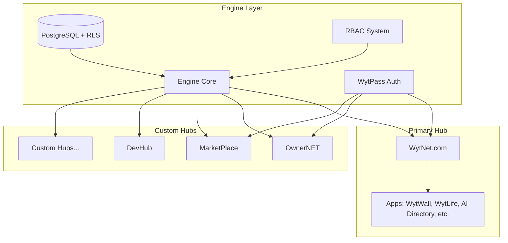

# Platform Overview

## What is WytNet?

**WytNet.com** is an all-in-one digital platform for a better lifestyle and best workstyle — for individuals and organizations everywhere.

**Tagline:** *"Get In. Get Done."*

**Mission:** Create a connected digital ecosystem powered by **Speed | Security | Scale**. WytNet unifies productivity, social networking, and intelligent automation.

**Vision:** Build a world where every task, connection, and opportunity happens in one smart environment powered by technology and trust.

## Technical Foundation

WytNet is a **white-label, multi-tenant SaaS platform** built on the "Engine" architecture — a central framework that creates, connects, and controls all components through a modular architecture: **Modules → Apps → Hubs**.

## Platform Purpose

WytNet addresses three core needs:

1. **For End Users**: A unified platform to access multiple applications with a single identity (WytPass)
2. **For Developers**: A modular system to build and deploy applications quickly using pre-built components
3. **For Organizations**: A framework to create custom, branded platforms (Hubs) tailored to specific needs

## Core Components

### Engine
The foundational layer that powers everything:
- Multi-tenancy architecture with Row Level Security
- WytPass Universal Identity & Validation
- Module management and composition
- RBAC (Role-Based Access Control)
- Audit logging and platform settings

### WytNet.com
The primary hub showcasing platform capabilities:
- User dashboard with app management
- Social features (WytWall)
- Life Continuity Platform (WytLife)
- AI tools directory
- Utility apps (QR Generator, DISC Assessment)

### Custom Hubs
Independent platforms built on the Engine:
- OwnerNET (Property Management)
- MarketPlace (E-commerce)
- DevHub (Developer Tools)
- Custom client hubs

## Key Capabilities

### 1. Modular Architecture
```
Entity → Module → App → Hub
```
Build from reusable components that scale from simple features to complete platforms.

### 2. Universal Authentication
**WytPass** provides unified identity across all platforms:
- Google OAuth
- Email OTP (passwordless)
- Email/Password
- Session management
- Multi-context support (User, Hub Admin, Super Admin)

### 3. Multi-Tenancy
Complete data isolation and tenant management:
- Row Level Security (RLS) in PostgreSQL
- Tenant-specific configurations
- Isolated data and resources
- Global Display IDs

### 4. White-Label Capability
Every hub can be fully customized:
- Custom branding and theming
- Own domain names
- Platform-specific features
- Independent operation

### 5. Low-Code Tools
- CRUD builders
- Content Management System (CMS)
- App composition tools
- Hub aggregation

## Platform Hierarchy



## Technology Stack

### Frontend
- **Framework**: React 18 with TypeScript
- **Build Tool**: Vite
- **Routing**: Wouter
- **State Management**: TanStack Query
- **UI Library**: shadcn/ui (Radix UI + Tailwind CSS)
- **Forms**: React Hook Form + Zod validation

### Backend
- **Runtime**: Node.js
- **Framework**: Express.js with TypeScript
- **API Pattern**: RESTful APIs
- **Authentication**: Passport.js + Custom WytPass
- **Session Store**: connect-pg-simple (PostgreSQL)

### Database
- **Database**: PostgreSQL (Neon serverless)
- **ORM**: Drizzle ORM
- **Schema**: Multi-tenant with RLS
- **Migrations**: Drizzle Kit

### Infrastructure
- **Deployment**: Replit
- **CI/CD**: Automated workflows
- **Monitoring**: Audit logs and analytics
- **PWA**: Full Progressive Web App support

## Short-Term Goals

1. **Phase 1: User Management** (Current)
   - User registration & authentication
   - User profile management
   - MyWyt Apps dashboard

2. **Phase 2: WytWall** (Next)
   - Post creation and management
   - Admin approval workflow
   - Public feed with interactions
   - User engagement features

3. **Phase 3: App Ecosystem**
   - WytLife features
   - AI Directory
   - QR Generator
   - DISC Assessment
   - App marketplace

## Long-Term Vision

### Platform Evolution
- **Scale**: Support thousands of custom hubs
- **Marketplace**: App and module marketplace
- **Ecosystem**: Developer community and documentation
- **Intelligence**: AI-powered platform management

### Feature Expansion
- Mobile applications (iOS & Android)
- Real-time collaboration tools
- Advanced analytics and reporting
- Blockchain integration for identity validation
- API marketplace for third-party integrations

### Business Model
- **Free Tier**: Basic WytNet.com access
- **Pro Tier**: Advanced apps and features
- **Hub License**: Custom hub creation
- **Enterprise**: White-label solutions with SLA

## Value Propositions

### For End Users
- ✅ Single identity across multiple platforms
- ✅ Personalized app dashboard
- ✅ Privacy and data control
- ✅ Seamless experience across hubs

### For Developers
- ✅ Pre-built modules and components
- ✅ Type-safe development (TypeScript)
- ✅ Comprehensive API documentation
- ✅ Fast deployment and scaling

### For Organizations
- ✅ Rapid platform development
- ✅ Complete customization
- ✅ Multi-tenant architecture
- ✅ Built-in security and compliance

## Security & Compliance

- **Authentication**: Multi-factor, session-based
- **Authorization**: Fine-grained RBAC (64 permissions)
- **Data Protection**: Row Level Security
- **Audit**: Complete activity logging
- **Privacy**: GDPR-compliant design
- **Security**: CSRF protection, secure cookies

## Getting Started

1. [Understand Core Concepts](/en/core-concepts) - Learn the architecture
2. [Explore Features](/en/features/wytpass) - See what's possible
3. [Review Database Schema](/en/architecture/database-schema) - Understand data structure
4. [Follow Implementation Guide](/en/implementation/getting-started) - Start building

## Support & Resources

- **Documentation**: This site (docs.wytnet.com)
- **API Reference**: [API Documentation](/en/api/authentication)
- **Community**: Developer forums and discussions
- **Support**: Email and chat support for Enterprise

---

**Next**: [Core Concepts →](/en/core-concepts)
