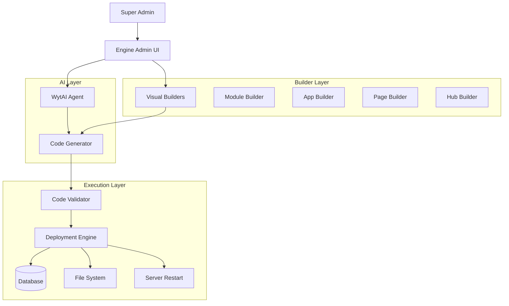

# PRD: WytNet Self-Service Platform

**Document Version**: 1.0  
**Last Updated**: October 2025  
**Status**: Planning Phase  
**Priority**: P0 (Critical - Strategic Initiative)

---

## Executive Summary

The **WytNet Self-Service Platform** is a strategic initiative to transform WytNet from a developer-dependent platform into a **fully autonomous, AI-powered, no-code platform** where Super Admins can create and manage all features without external developer assistance (Replit Agent/Assistant).

**Vision**: Enable platform growth and feature development through natural language AI chat and visual drag-drop builders, eliminating dependency on development resources.

**Impact**: Reduce feature development time from days/weeks to minutes/hours, enabling rapid iteration and business agility.

---

## Problem Statement

### Current State Challenges

**Dependency on Developers**:
- All new features require Replit Agent or developer intervention
- Feature requests have long lead times
- Changes require technical expertise
- Platform evolution is bottlenecked by development capacity

**Limited Self-Service Capabilities**:
- Existing builders (Module, App, Hub, CMS) are incomplete
- No drag-drop CRUD functionality
- No visual interface for creating pages
- No AI-assisted feature generation

**Fragmented Admin Experience**:
- Engine Admin Panel has 53+ API endpoints but inconsistent UI
- Navigation structure is role-based but not optimally organized
- WytAI Agent is a floating widget with limited functionality
- No unified workflow for feature creation

**Technical Debt**:
- Existing builder components exist but lack core functionality
- No standardized CRUD generation system
- No code generation engine
- Limited AI integration beyond basic chat

---

## Solution Overview

### Three-Phase Transformation

#### **Phase 1: Engine Panel Consolidation** (Foundation)
Organize and standardize all existing Engine Admin functionality to create a solid foundation for self-service capabilities.

#### **Phase 2: WytAI Agent Full Page** (Intelligence)
Transform the AI assistant from a floating widget into a comprehensive full-page interface with advanced capabilities.

#### **Phase 3: WytBuilder Self-Service Platform** (Autonomy)
Build complete visual drag-drop CRUD builders that enable Super Admins to create features without code.

### Ultimate Goal

**Super Admin Self-Sufficiency**: After Phase 3 completion, Super Admins can:
- Create new modules, apps, pages, and hubs through visual builders
- Generate features using natural language AI chat
- Manage all platform aspects without developer dependency
- Deploy changes instantly with built-in validation and testing

---

## Phase 1: Engine Panel Consolidation

**Timeline**: 1-2 weeks  
**Priority**: P0 (Must complete before Phase 2)

### Objectives

1. **Standardize Navigation**: Create consistent, intuitive menu structure
2. **Organize APIs**: Group and document all 53+ endpoints
3. **Optimize Routing**: Implement efficient page routing and lazy loading
4. **Establish Patterns**: Define standard CRUD patterns for all entities

### Requirements

#### FR1.1: Navigation Restructuring

**Description**: Reorganize Engine Admin sidebar into logical, task-oriented sections.

**Current Structure**:
```
🦸‍♂️ Super Admin
  - Dashboard
  - System Overview  
  - Global Settings

Core Platform
  - Tenants
  - All Users
  - WytPass Management

Builders
  - Modules (CRUD)
  - CMS Builder
  - App Builder
  - Hub Builder
  - DataSets

Business
  - Plan Management
  - Payment Methods
  - Analytics

System
  - Search
  - Audit Logs
  - API Keys
  - Integrations
```

**Proposed New Structure**:
```
📊 Dashboard & Overview
  - Platform Dashboard
  - System Health
  - Real-time Analytics
  - Quick Actions

🏗️ Platform Management
  - Tenants & Organizations
  - User Management
  - WytPass Authentication
  - Roles & Permissions
  - Hubs Management

🔨 Content & Builders
  - Module Builder
  - App Builder
  - CMS Builder
  - Page Builder
  - Hub Builder
  - DataSets Management

💰 Business & Commerce
  - Pricing Plans
  - Subscriptions
  - Payment Methods
  - Revenue Analytics
  - WytPoints Management

🎨 Design & Themes
  - Theme Manager
  - Branding Settings
  - Media Library
  - UI Customization

🔌 Integrations & APIs
  - Third-party Integrations
  - API Management
  - Webhooks
  - Custom Connectors

🤖 AI & Automation
  - WytAI Agent
  - AI Models Configuration
  - Automation Rules
  - Workflow Builder

⚙️ System & Settings
  - Global Settings
  - Platform Settings
  - Security & Compliance
  - Audit Logs
  - Trash Management
  - Database Tools

📚 Help & Documentation
  - DevDoc Access
  - Support Tickets
  - Knowledge Base
  - Features Checklist
  - QA Testing Tracker

🧪 Developer Tools
  - API Explorer
  - Webhook Tester
  - Database Query Tool
  - Log Viewer
```

**Acceptance Criteria**:
- ✅ Navigation is grouped by functional areas, not technical structure
- ✅ Each section has max 5-8 items for cognitive load management
- ✅ Icons are consistent and meaningful
- ✅ Role-based visibility is maintained
- ✅ Mobile responsive navigation
- ✅ Search functionality across all pages
- ✅ Breadcrumb navigation on all pages

#### FR1.2: API Organization & Documentation

**Description**: Categorize all 53+ API endpoints and create unified documentation.

**API Categories**:

1. **Platform Management APIs** (28 endpoints)
   - Hubs: 12 endpoints
   - Roles & Permissions: 14 endpoints
   - Users: Covered in user management
   - Tenants: Part of trash management

2. **Content & Configuration APIs** (18 endpoints)
   - Platform Settings: 7 endpoints
   - Themes: 6 endpoints
   - Integrations: 2 endpoints
   - Media: 3 endpoints

3. **Business & Commerce APIs** (5 endpoints)
   - Organizations: 5 endpoints
   - Pricing: To be added
   - Subscriptions: To be added

4. **AI & Automation APIs** (10 endpoints)
   - WytAI Chat: 10 endpoints
   - Workflows: To be added

5. **System & Utilities APIs** (20 endpoints)
   - Trash Management: 12 endpoints
   - Features Checklist: 9 endpoints
   - QA Testing: 8 endpoints
   - Audit Logs: Existing
   - DevDocs: 2 endpoints

**Acceptance Criteria**:
- ✅ All endpoints categorized in OpenAPI/Swagger format
- ✅ Consistent request/response patterns
- ✅ Standard error handling across all APIs
- ✅ Rate limiting documented
- ✅ Permission requirements listed for each endpoint
- ✅ Example requests/responses provided
- ✅ API versioning strategy defined

#### FR1.3: Routing & Performance Optimization

**Description**: Implement code splitting, lazy loading, and route-based chunking.

**Technical Requirements**:
- Route-based code splitting for all admin pages
- Lazy loading of heavy components (charts, editors)
- Prefetching of likely next routes
- Service worker for offline capability
- Progressive enhancement

**Performance Targets**:
- Initial page load: < 2 seconds
- Route transitions: < 500ms
- Time to Interactive (TTI): < 3 seconds
- First Contentful Paint (FCP): < 1.5 seconds
- Lighthouse score: > 90

**Acceptance Criteria**:
- ✅ All admin pages use lazy loading
- ✅ Bundle size < 500KB for initial load
- ✅ Route prefetching implemented
- ✅ Performance metrics tracked
- ✅ Offline fallback for critical pages

#### FR1.4: CRUD Pattern Standardization

**Description**: Establish consistent patterns for all Create, Read, Update, Delete operations.

**Standard CRUD Flow**:
```typescript
interface StandardCRUDProps<T> {
  // List View
  columns: ColumnDef<T>[];
  filters: FilterConfig[];
  sortOptions: SortOption[];
  bulkActions: BulkAction[];
  
  // Form
  schema: ZodSchema<T>;
  formFields: FormField[];
  validation: ValidationRules;
  
  // Actions
  onCreate: (data: T) => Promise<Response>;
  onUpdate: (id: string, data: Partial<T>) => Promise<Response>;
  onDelete: (id: string) => Promise<Response>;
  onBulkAction: (ids: string[], action: string) => Promise<Response>;
  
  // Permissions
  canCreate: boolean;
  canEdit: boolean;
  canDelete: boolean;
}
```

**Components to Standardize**:
- DataTable with server-side pagination
- FilterBar with advanced filters
- CreateForm with validation
- EditForm with optimistic updates
- DeleteDialog with confirmation
- BulkActions with progress tracking

**Acceptance Criteria**:
- ✅ Reusable CRUD components library
- ✅ Standard form validation patterns
- ✅ Consistent error handling
- ✅ Loading states standardized
- ✅ Success/error notifications
- ✅ Undo functionality for destructive actions

### Success Metrics (Phase 1)

**User Experience**:
- Navigation tasks complete 50% faster
- Reduce clicks to common actions by 30%
- Zero navigation confusion in user testing

**Developer Experience**:
- New admin pages can be created in < 30 minutes
- Code reuse increased by 60%
- Bug rate decreased by 40%

**Performance**:
- Page load time reduced by 40%
- API response times < 200ms (95th percentile)
- Zero timeout errors

---

## Phase 2: WytAI Agent Full Page

**Timeline**: 2-3 weeks  
**Priority**: P0 (Enables Phase 3)

### Objectives

1. **Full Page Interface**: Transform floating widget into comprehensive page
2. **Advanced Features**: Add code execution, file uploads, multi-modal input
3. **Context Awareness**: Deep integration with Engine Admin state
4. **Conversation Management**: Advanced history, bookmarks, sharing

### Requirements

#### FR2.1: Full Page Layout & Design

**Description**: Create dedicated `/engine/wytai` page with professional chat interface.

**Layout Structure**:
```
┌─────────────────────────────────────────────────────┐
│ Header                                              │
│ [WytAI Agent] [Model: GPT-4o ▼] [Voice 🎤] [•••]  │
├──────────────┬──────────────────────────────────────┤
│              │                                      │
│ Conversations│  Chat Area                          │
│ Sidebar      │  ┌────────────────────────────────┐ │
│              │  │ AI: How can I help you today? │ │
│ 📝 New Chat  │  └────────────────────────────────┘ │
│              │                                      │
│ Today        │  ┌────────────────────────────────┐ │
│  • Module    │  │ User: Create a new module for  │ │
│    Builder   │  │ product reviews                │ │
│  • Fix Bug   │  └────────────────────────────────┘ │
│              │                                      │
│ Yesterday    │  ┌────────────────────────────────┐ │
│  • API       │  │ AI: I'll help you create that │ │
│    Design    │  │ [Show Code] [Apply Changes]    │ │
│              │  └────────────────────────────────┘ │
│ Last 7 Days  │                                      │
│  • Hub Setup │  Input Area                         │
│  • User RBAC │  ┌────────────────────────────────┐ │
│              │  │ Type your message...           │ │
│ [🔍 Search]  │  │ [📎 Upload] [🎤 Voice] [Send] │ │
│              │  └────────────────────────────────┘ │
└──────────────┴──────────────────────────────────────┘
```

**Key Features**:
- Collapsible conversation sidebar
- Multi-tab support (different contexts)
- Split-screen mode (chat + preview)
- Full-screen mode
- Dark mode optimized

**Acceptance Criteria**:
- ✅ Responsive layout (desktop, tablet, mobile)
- ✅ Keyboard shortcuts for common actions
- ✅ Accessibility (WCAG 2.1 AA compliant)
- ✅ Real-time typing indicators
- ✅ Message timestamps and read receipts
- ✅ Smooth scrolling and animations

#### FR2.2: Advanced Chat Features

**Description**: Implement professional-grade chat capabilities.

**Features**:

1. **Multi-Modal Input**:
   - Text input with markdown support
   - Voice input (speech-to-text)
   - File uploads (images, documents, code files)
   - Screen capture
   - URL/link parsing

2. **Rich Message Formatting**:
   - Code syntax highlighting (100+ languages)
   - Mermaid diagrams rendering
   - Table formatting
   - LaTeX math equations
   - Embedded media (images, videos)

3. **Interactive Elements**:
   - Quick action buttons
   - Suggested prompts
   - Code execution preview
   - Form builders within chat
   - Interactive decision trees

4. **Code Features**:
   - Copy code button
   - Run code button (sandboxed execution)
   - Export to file
   - Diff view for changes
   - Version history

**Acceptance Criteria**:
- ✅ Voice input works with 95%+ accuracy
- ✅ File upload supports 20+ file types
- ✅ Code highlighting for all major languages
- ✅ Markdown rendering is GitHub-compatible
- ✅ Code execution is secure (sandboxed)

#### FR2.3: Context-Aware AI

**Description**: Deep integration with Engine Admin state for intelligent assistance.

**Context Sources**:

1. **Current Page Context**:
```typescript
interface PageContext {
  path: string;                    // Current admin page
  pageName: string;                // Human-readable name
  entity: string;                  // e.g., 'modules', 'apps'
  entityId?: string;               // If viewing specific item
  action?: 'create' | 'edit' | 'view' | 'list';
  formData?: Record<string, any>; // Current form values
}
```

2. **Platform State**:
```typescript
interface PlatformContext {
  modules: ModuleSummary[];
  apps: AppSummary[];
  hubs: HubSummary[];
  roles: RoleSummary[];
  permissions: PermissionSummary[];
  stats: PlatformStats;
  recentActivity: ActivityLog[];
}
```

3. **User Context**:
```typescript
interface UserContext {
  userId: string;
  roles: string[];
  permissions: string[];
  preferences: UserPreferences;
  recentActions: UserAction[];
}
```

**AI Capabilities with Context**:
- Auto-suggest based on current page
- Prefill forms with intelligent defaults
- Detect errors and suggest fixes
- Recommend next actions
- Provide contextual help

**Example Scenarios**:

*Scenario 1: Module Creation*
```
User is on: /engine/modules/create
AI detects: Creating new module
AI suggests:
  - "What should this module do?"
  - "Need help choosing entities?"
  - "Want me to generate from description?"
```

*Scenario 2: Error Detection*
```
User has: Form validation error
AI detects: Missing required field
AI suggests:
  - "The 'description' field is required"
  - "Here's a good description: [suggestion]"
  - "Should I auto-fill this for you?"
```

**Acceptance Criteria**:
- ✅ AI knows current page context 100% of time
- ✅ Suggestions are relevant to user's task
- ✅ Context updates in real-time
- ✅ AI can access platform state safely
- ✅ Permissions are enforced for suggestions

#### FR2.4: Conversation Management

**Description**: Advanced features for managing chat history and collaboration.

**Features**:

1. **Conversation Organization**:
   - Folders/categories
   - Tags and labels
   - Starred/bookmarked chats
   - Archive functionality
   - Search across all conversations

2. **Sharing & Collaboration**:
   - Share conversation with team
   - Export chat as markdown/PDF
   - Embed chat in documentation
   - Public links for specific chats
   - Team templates library

3. **History & Analytics**:
   - Full conversation history
   - Usage statistics
   - Token consumption tracking
   - Response time metrics
   - Model performance comparison

4. **Advanced Search**:
   - Full-text search
   - Filter by date/model/topic
   - Semantic search (find similar chats)
   - Search within code blocks
   - Saved search queries

**Acceptance Criteria**:
- ✅ Can find any past conversation in < 3 seconds
- ✅ Export works for all message types
- ✅ Shared links have proper access control
- ✅ Search returns relevant results
- ✅ Analytics provide actionable insights

#### FR2.5: AI Model Management

**Description**: Configure and switch between multiple AI models seamlessly.

**Supported Models**:
- OpenAI: GPT-4o, GPT-4o-mini, GPT-3.5-turbo
- Anthropic: Claude 3.5 Sonnet, Claude 3 Opus, Claude 3 Haiku
- Google: Gemini 2.0 Flash, Gemini 1.5 Pro

**Model Selection UI**:
```
┌────────────────────────────────┐
│ Select AI Model                │
├────────────────────────────────┤
│ 🤖 OpenAI                      │
│   ● GPT-4o (Recommended)      │
│   ○ GPT-4o-mini (Faster)      │
│   ○ GPT-3.5-turbo (Economical)│
│                                │
│ 🧠 Anthropic                   │
│   ○ Claude 3.5 Sonnet (Best)  │
│   ○ Claude 3 Opus (Balanced)  │
│   ○ Claude 3 Haiku (Fast)     │
│                                │
│ 💎 Google                      │
│   ○ Gemini 2.0 Flash (Latest) │
│   ○ Gemini 1.5 Pro (Accurate) │
└────────────────────────────────┘

Model Stats:
• Speed: ████░ 4/5
• Cost: ███░░ 3/5  
• Quality: █████ 5/5
• Context: 128K tokens
```

**Features**:
- Model comparison tool
- Cost estimation per chat
- Performance benchmarks
- Auto-switch on model unavailability
- Custom model parameters

**Acceptance Criteria**:
- ✅ Switch models mid-conversation
- ✅ Model stats are accurate
- ✅ Graceful fallback on errors
- ✅ Cost tracking per model
- ✅ Model preferences saved per user

### Success Metrics (Phase 2)

**Usage**:
- 80% of Super Admins use WytAI daily
- Average 20+ messages per session
- 70% of feature requests start with AI chat

**Effectiveness**:
- 60% of AI suggestions are accepted
- Task completion time reduced by 50%
- Zero critical errors from AI suggestions

**Satisfaction**:
- 4.5+ stars average rating
- 90%+ would recommend to team
- 80% prefer AI over manual methods

---

## Phase 3: WytBuilder Self-Service Platform

**Timeline**: 4-6 weeks  
**Priority**: P0 (Ultimate Goal)

### Objectives

1. **Visual Drag-Drop Builders**: Complete no-code interface
2. **AI-Powered Generation**: Natural language to features
3. **Full CRUD Automation**: Zero-code database operations
4. **Instant Deployment**: Live changes with validation

### Requirements

#### FR3.1: Module Builder (Drag-Drop CRUD)

**Description**: Visual interface to create modules with entities, fields, and relationships.

**Builder Interface**:
```
┌─────────────────────────────────────────────────────────────┐
│ Module Builder                               [Save] [Deploy]│
├──────────────┬──────────────────────────────────────────────┤
│ Components   │ Canvas                                       │
│              │                                              │
│ 📊 Entities  │  ┌──────────────────────────────────────┐  │
│ 📝 Fields    │  │ Module: Product Reviews              │  │
│ 🔗 Relations │  │                                      │  │
│ ⚙️ Actions   │  │ Entities:                            │  │
│ 🎨 UI        │  │ ┌────────┐    ┌────────┐           │  │
│              │  │ │ Review │───>│ Rating │           │  │
│ AI Generate  │  │ └────────┘    └────────┘           │  │
│ [Chat 💬]    │  │     │              │                │  │
│              │  │     ↓              ↓                │  │
│ Templates    │  │ ┌────────┐    ┌────────┐           │  │
│ • Blog       │  │ │ User   │    │Product │           │  │
│ • E-commerce │  │ └────────┘    └────────┘           │  │
│ • CRM        │  │                                      │  │
│              │  │ Drag entities from left panel →     │  │
│ History      │  └──────────────────────────────────────┘  │
│ [Undo][Redo] │                                              │
│              │  Properties Panel                            │
│              │  ┌──────────────────────────────────────┐  │
│              │  │ Entity: Review                       │  │
│              │  │ Fields:                              │  │
│              │  │ • title (text, required)             │  │
│              │  │ • content (textarea)                 │  │
│              │  │ • rating (number, 1-5)              │  │
│              │  │ • userId (relation → User)          │  │
│              │  │ [+ Add Field]                       │  │
│              │  └──────────────────────────────────────┘  │
└──────────────┴──────────────────────────────────────────────┘
```

**Drag-Drop Components**:

1. **Entities**:
   - Drag from palette onto canvas
   - Visual representation with icon
   - Automatically generate CRUD UI
   - Configure display name, icon, color

2. **Fields**:
   - 20+ field types (text, number, date, relation, file, etc.)
   - Validation rules (required, unique, min/max, regex)
   - Default values
   - Field-level permissions

3. **Relationships**:
   - One-to-One
   - One-to-Many
   - Many-to-Many
   - Cascade delete options
   - Relationship visualization

4. **Actions**:
   - Custom buttons/actions
   - Workflow triggers
   - API calls
   - Email notifications

5. **UI Customization**:
   - List view configuration
   - Form layout designer
   - Detail view customization
   - Custom CSS/styling

**AI Integration**:
```
User: "Create a module for managing product reviews with ratings and comments"

AI Response:
✅ I'll create a Product Reviews module with:

Entities:
• Review (main entity)
  - title (text)
  - content (long text)
  - rating (number, 1-5 stars)
  - userId (relation to User)
  - productId (relation to Product)
  - status (enum: pending/approved/rejected)
  - createdAt, updatedAt

• ReviewComment (nested comments)
  - content (text)
  - reviewId (relation to Review)
  - userId (relation to User)
  - createdAt

Would you like me to:
1. Generate this module?
2. Show you the schema first?
3. Customize the fields?

[Generate Now] [Customize] [Show Schema]
```

**Code Generation**:
- Drizzle ORM schema
- Zod validation schemas
- React components (list, form, detail)
- API routes (CRUD + custom)
- Database migrations

**Acceptance Criteria**:
- ✅ Create complete module in < 5 minutes via drag-drop
- ✅ AI can generate from natural language description
- ✅ Generated code is production-ready
- ✅ All fields types supported
- ✅ Relationships work correctly
- ✅ Undo/redo functionality
- ✅ Real-time preview
- ✅ One-click deployment

#### FR3.2: App Builder (Multi-Module Composition)

**Description**: Compose multiple modules into complete applications.

**Builder Interface**:
```
┌─────────────────────────────────────────────────────────────┐
│ App Builder: MyStore                        [Save] [Deploy] │
├──────────────┬──────────────────────────────────────────────┤
│ Modules      │ App Structure                                │
│              │                                              │
│ Available    │  ┌──────────────────────────────────────┐  │
│ ✅ Products  │  │ MyStore App                         │  │
│ ✅ Orders    │  │                                      │  │
│ ✅ Customers │  │  Navigation:                         │  │
│ ✅ Reviews   │  │  ┌─────────────────────────────┐   │  │
│ ❌ Inventory │  │  │ Home                        │   │  │
│ ❌ Shipping  │  │  │ ├─ Products (ProductModule)│   │  │
│              │  │  │ ├─ Orders (OrderModule)    │   │  │
│ Pages        │  │  │ ├─ Customers (UserModule) │   │  │
│ • Home       │  │  │ └─ Reviews (ReviewModule) │   │  │
│ • Dashboard  │  │  └─────────────────────────────┘   │  │
│ • Settings   │  │                                      │  │
│              │  │  Features:                           │  │
│ Workflows    │  │  • Shopping Cart                     │  │
│ • New Order  │  │  • Checkout Process                  │  │
│ • Email      │  │  • Payment Integration               │  │
│              │  │  • Review System                     │  │
│ AI Generate  │  │  • User Dashboard                    │  │
│ [Chat 💬]    │  │                                      │  │
│              │  │  Pricing: Free                       │  │
│              │  └──────────────────────────────────────┘  │
└──────────────┴──────────────────────────────────────────────┘
```

**Features**:
- Select modules to include
- Define navigation structure
- Configure module integration
- Add custom pages
- Set app-level permissions
- Configure pricing/subscription
- Branding customization

**AI Capabilities**:
```
User: "Create an e-commerce app with products, orders, and reviews"

AI Response:
🛍️ I'll create a complete e-commerce app:

Modules Selected:
✅ Products Module (catalog, search, filters)
✅ Orders Module (cart, checkout, tracking)
✅ Customers Module (profiles, addresses)
✅ Reviews Module (ratings, comments)
✅ Payments Module (Razorpay integration)

Additional Features:
• Shopping cart with real-time updates
• Multi-step checkout
• Email notifications (order confirmation, shipping)
• Admin dashboard for order management
• Analytics & reports

Would you like me to:
1. Generate this app now?
2. Add more features?
3. Customize modules first?

[Generate App] [Add Features] [Customize]
```

**Acceptance Criteria**:
- ✅ Compose 10+ modules into single app
- ✅ Navigation auto-generated from modules
- ✅ Module integration works seamlessly
- ✅ AI generates complete app from description
- ✅ One-click deployment to hub
- ✅ App versioning supported

#### FR3.3: Page Builder (No-Code UI Designer)

**Description**: Visual page designer for custom admin pages and public pages.

**Builder Interface**:
```
┌─────────────────────────────────────────────────────────────┐
│ Page Builder                                 [Save] [Preview]│
├──────────────┬──────────────────────────────────────────────┤
│ Components   │ Canvas (Desktop Preview)                     │
│              │                                              │
│ Layout       │  ┌──────────────────────────────────────┐  │
│ • Container  │  │ [Header]                            │  │
│ • Grid       │  │  Logo    Navigation    [Login]      │  │
│ • Flex       │  │                                      │  │
│ • Stack      │  ├──────────────────────────────────────┤  │
│              │  │ [Hero Section]                      │  │
│ Content      │  │  Welcome to WytStore!               │  │
│ • Text       │  │  Your one-stop shop                 │  │
│ • Image      │  │  [Shop Now Button]                  │  │
│ • Video      │  ├──────────────────────────────────────┤  │
│ • Button     │  │ [Products Grid - 3 columns]        │  │
│              │  │  [Product 1] [Product 2] [Product 3]│  │
│ Data         │  │  [Product 4] [Product 5] [Product 6]│  │
│ • Table      │  ├──────────────────────────────────────┤  │
│ • Form       │  │ [Footer]                            │  │
│ • Chart      │  │  © 2025 WytStore                    │  │
│ • Card       │  └──────────────────────────────────────┘  │
│              │                                              │
│ Input        │  Properties                                  │
│ • TextField  │  ┌──────────────────────────────────────┐  │
│ • Select     │  │ Component: Button                   │  │
│ • Checkbox   │  │ Text: "Shop Now"                    │  │
│ • Radio      │  │ Variant: Primary                    │  │
│              │  │ Size: Large                         │  │
│ AI Generate  │  │ Action: Navigate to /products       │  │
│ [Chat 💬]    │  │ [Update]                           │  │
│              │  └──────────────────────────────────────┘  │
│              │                                              │
│ [Mobile] [Tablet] [Desktop]   [Undo] [Redo]              │
└──────────────┴──────────────────────────────────────────────┘
```

**Features**:
- 50+ pre-built components
- Responsive design (mobile, tablet, desktop)
- Live preview with hot reload
- Component styling (Tailwind classes)
- Data binding to modules
- Form builder with validation
- Conditional rendering
- Custom code blocks

**AI Page Generation**:
```
User: "Create a product landing page with hero, features, pricing, and CTA"

AI Response:
📄 Generating landing page...

Structure:
1. Hero Section
   - Background image
   - Headline: "Transform Your Business"
   - Subheadline
   - CTA buttons

2. Features Section (3 columns)
   - Icon + Title + Description
   - Auto-populated from product data

3. Pricing Section
   - 3 pricing tiers
   - Feature comparison table
   - CTA buttons

4. Testimonials
   - Carousel with customer reviews

5. Final CTA
   - Email capture form
   - Button to get started

Would you like me to:
[Generate Page] [Customize] [Use Template]
```

**Acceptance Criteria**:
- ✅ Build complete page in < 10 minutes
- ✅ AI generates from text description
- ✅ Responsive on all devices
- ✅ Components are reusable
- ✅ SEO optimized (meta tags, schema)
- ✅ Performance optimized (lazy loading)
- ✅ Accessibility compliant

#### FR3.4: Hub Builder (Multi-Domain Platform Creation)

**Description**: Create complete white-label platforms with custom domains.

**Builder Interface**:
```
┌─────────────────────────────────────────────────────────────┐
│ Hub Builder: OwnerNET                       [Save] [Deploy] │
├──────────────┬──────────────────────────────────────────────┤
│ Configuration│ Hub Preview                                  │
│              │                                              │
│ Basic Info   │  ┌──────────────────────────────────────┐  │
│ • Name       │  │ OwnerNET                            │  │
│ • Description│  │ Property Management Platform        │  │
│ • Logo       │  │                                      │  │
│ • Favicon    │  │  Apps Installed:                     │  │
│              │  │  ✅ Property Listings                │  │
│ Domains      │  │  ✅ Tenant Management               │  │
│ • Primary    │  │  ✅ Maintenance Requests            │  │
│ • Custom     │  │  ✅ Rent Collection                 │  │
│ • Aliases    │  │  ✅ Document Storage                │  │
│              │  │                                      │  │
│ Apps         │  │  Features:                           │  │
│ [Select Apps]│  │  • Multi-property management         │  │
│              │  │  • Online rent payment              │  │
│ Theme        │  │  • Maintenance tracking             │  │
│ [Pick Theme] │  │  • Tenant portal                    │  │
│              │  │                                      │  │
│ Roles        │  │  Users: 150 landlords, 500 tenants  │  │
│ [Configure]  │  └──────────────────────────────────────┘  │
│              │                                              │
│ SEO          │  DNS Configuration                           │
│ [Optimize]   │  ┌──────────────────────────────────────┐  │
│              │  │ Custom Domain: ownernet.com         │  │
│ AI Generate  │  │ Status: ⚠️ DNS records not verified │  │
│ [Chat 💬]    │  │                                      │  │
│              │  │ Required Records:                    │  │
│              │  │ A     @    76.76.21.21             │  │
│              │  │ CNAME www  cname.wytnet.com        │  │
│              │  │ [Verify DNS]                        │  │
│              │  └──────────────────────────────────────┘  │
└──────────────┴──────────────────────────────────────────────┘
```

**Features**:
- Hub configuration (name, logo, branding)
- Multi-domain support (subdomain + custom)
- App selection and installation
- Theme selection/customization
- Role and permission management
- SEO optimization
- Analytics integration
- Custom code injection (head/body)

**AI Hub Generation**:
```
User: "Create a property management platform with landlord and tenant portals"

AI Response:
🏢 Creating OwnerNET property management hub...

Configuration:
• Hub Name: OwnerNET
• Primary Domain: ownernet.wytnet.com
• Custom Domain: (you can add later)

Apps to Install:
✅ Property Listings
✅ Tenant Management  
✅ Maintenance Requests
✅ Rent Collection (Razorpay)
✅ Document Storage
✅ Analytics Dashboard

Roles Created:
• Super Admin (full access)
• Landlord (manage properties)
• Property Manager (operations)
• Tenant (view only, requests)
• Maintenance Staff (tickets)

Theme: Professional Blue

Would you like to:
[Deploy Hub] [Customize Apps] [Configure Roles]
```

**Acceptance Criteria**:
- ✅ Create complete hub in < 15 minutes
- ✅ AI generates from business description
- ✅ Multi-domain routing works
- ✅ Apps install correctly
- ✅ Roles enforce permissions
- ✅ Custom branding applied
- ✅ SEO optimized
- ✅ SSL certificates auto-issued

#### FR3.5: Universal Code Generator

**Description**: AI-powered code generation engine that produces production-ready code.

**Capabilities**:

1. **Database Schema Generation**:
```typescript
Input: Natural language or drag-drop
Output: 
  - Drizzle ORM schema
  - Zod validation schemas
  - TypeScript types
  - Database migrations
```

2. **API Endpoint Generation**:
```typescript
Input: Entity definition + operations
Output:
  - Express.js routes
  - CRUD operations
  - Validation middleware
  - Error handling
  - Permission checks
```

3. **React Component Generation**:
```typescript
Input: UI requirements + data model
Output:
  - List component with pagination
  - Form component with validation
  - Detail view component
  - Delete confirmation dialog
  - shadcn/ui compatible
```

4. **Full-Stack Feature Generation**:
```typescript
Input: "Create blog post management"
Output:
  - Complete backend (schema, APIs, validation)
  - Complete frontend (components, forms, views)
  - Integration code
  - Tests
  - Documentation
```

**Quality Standards**:
- TypeScript with strict mode
- ESLint compliant
- Prettier formatted
- Follows project conventions
- Includes JSDoc comments
- Error handling
- Loading states
- Accessibility

**Code Preview & Validation**:
```
┌────────────────────────────────────────────────┐
│ Generated Code Review                          │
├────────────────────────────────────────────────┤
│ Files to Create:                               │
│ ✅ shared/schema.ts (Blog module)             │
│ ✅ server/routes/blog.ts (API routes)         │
│ ✅ client/src/pages/admin/blog.tsx (UI)       │
│ ✅ client/src/components/blog/* (Components)  │
│                                                │
│ Changes to Existing Files:                    │
│ ⚠️ server/index.ts (add routes)               │
│ ⚠️ client/src/App.tsx (add page routing)     │
│                                                │
│ Database Migration:                            │
│ ✅ Create blog_posts table                    │
│ ✅ Create blog_categories table               │
│ ✅ Add foreign keys and indexes               │
│                                                │
│ [Preview Code] [Run Tests] [Deploy]           │
└────────────────────────────────────────────────┘
```

**Acceptance Criteria**:
- ✅ Generated code passes all linting
- ✅ Type-safe (zero TypeScript errors)
- ✅ Follows project conventions
- ✅ Includes comprehensive error handling
- ✅ Has proper loading states
- ✅ Accessible UI (ARIA labels, keyboard nav)
- ✅ 90%+ code coverage in tests
- ✅ Performance optimized

### Success Metrics (Phase 3)

**Adoption**:
- 90% of new features created via builders
- 80% of Super Admins create at least one module
- 50+ modules created in first month

**Speed**:
- Module creation: < 5 minutes (vs 2+ hours manually)
- App creation: < 15 minutes (vs 1+ day manually)
- Hub creation: < 30 minutes (vs 1+ week manually)

**Quality**:
- Zero critical bugs in generated code
- 95% of generated code used without modification
- Performance equal to hand-written code

**Self-Sufficiency**:
- 70% reduction in developer support requests
- Zero dependency on Replit Agent for routine tasks
- Platform evolution speed increased by 10x

---

## Technical Architecture

### System Components



### Technology Stack

**Frontend**:
- React 18 with TypeScript
- TanStack Query for state management
- React DnD / dnd-kit for drag-drop
- Monaco Editor for code editing
- Mermaid for diagrams
- shadcn/ui components

**Backend**:
- Express.js with TypeScript
- Drizzle ORM for database
- Zod for validation
- Code generation templates
- Safe code execution sandbox

**AI Integration**:
- OpenAI GPT-4o for code generation
- Claude 3.5 Sonnet for complex logic
- Gemini 2.0 Flash for fast responses
- Custom prompts for each builder

**Database**:
- PostgreSQL with Row Level Security
- Schema versioning with migrations
- Automatic backup before changes

### Security Considerations

**Code Generation Safety**:
- Sandboxed execution environment
- Code review before deployment
- Automatic rollback on errors
- Version control integration
- Audit logging

**Permission Enforcement**:
- Only Super Admins can use builders
- Generated code inherits RBAC rules
- Database permissions validated
- API endpoints protected

**Data Protection**:
- Automatic backups before changes
- Transaction-based deployments
- Validation at multiple layers
- SQL injection prevention

---

## Dependencies & Prerequisites

### Phase 1 Prerequisites
- ✅ Existing Engine Admin Panel
- ✅ 53+ API endpoints functional
- ✅ RBAC system in place
- ✅ Role-based routing

### Phase 2 Prerequisites
- ✅ Phase 1 completed
- ✅ AI service configured (OpenAI/Claude/Gemini)
- ✅ Conversation storage implemented
- ✅ WebSocket infrastructure

### Phase 3 Prerequisites
- ✅ Phase 1 & 2 completed
- ✅ Code generation templates
- ✅ Safe execution sandbox
- ✅ File system access (controlled)
- ✅ Database migration system

### External Dependencies
- OpenAI API (GPT-4o)
- Anthropic API (Claude 3.5)
- Google AI API (Gemini 2.0)
- GitHub API (optional, for version control)

---

## Risk Assessment

### Technical Risks

**Risk 1: Code Generation Quality**
- **Probability**: Medium
- **Impact**: High
- **Mitigation**: 
  - Extensive testing framework
  - Code review step before deployment
  - Gradual rollout with validation
  - Fallback to manual creation

**Risk 2: Performance at Scale**
- **Probability**: Medium
- **Impact**: Medium
- **Mitigation**:
  - Lazy loading and code splitting
  - Caching strategies
  - Rate limiting on AI requests
  - Optimization monitoring

**Risk 3: Security Vulnerabilities**
- **Probability**: Low
- **Impact**: Critical
- **Mitigation**:
  - Sandboxed code execution
  - Multiple validation layers
  - Security audit before launch
  - Automatic vulnerability scanning

### Business Risks

**Risk 4: User Adoption**
- **Probability**: Low
- **Impact**: High
- **Mitigation**:
  - Comprehensive training program
  - Video tutorials and documentation
  - Gradual feature rollout
  - User feedback integration

**Risk 5: AI Cost Escalation**
- **Probability**: Medium
- **Impact**: Medium
- **Mitigation**:
  - Rate limiting per user
  - Model selection optimization
  - Caching of common responses
  - Cost monitoring and alerts

---

## Implementation Timeline

### Phase 1: Engine Panel Consolidation (Weeks 1-2)
- Week 1: Navigation restructuring, API documentation
- Week 2: Routing optimization, CRUD standardization

### Phase 2: WytAI Agent Full Page (Weeks 3-5)
- Week 3: Full page layout, basic chat features
- Week 4: Advanced features (voice, files, code execution)
- Week 5: Context integration, conversation management

### Phase 3: WytBuilder Platform (Weeks 6-11)
- Week 6-7: Module Builder (drag-drop, AI generation)
- Week 8: App Builder (module composition)
- Week 9: Page Builder (UI designer)
- Week 10: Hub Builder (platform creation)
- Week 11: Testing, refinement, documentation

### Total Timeline: 11 weeks (~3 months)

---

## Success Criteria

### Overall Success Metrics

**Quantitative**:
- ✅ 90% of new features created without developer help
- ✅ Feature creation time reduced by 90%
- ✅ Super Admin satisfaction: 4.5+ stars
- ✅ Zero critical bugs in generated code
- ✅ 80% adoption rate among Super Admins

**Qualitative**:
- ✅ Platform evolution speed increases 10x
- ✅ Business agility dramatically improved
- ✅ Developer team focuses on innovation, not maintenance
- ✅ WytNet becomes truly self-service platform

---

## Next Steps

1. **Approve PRD**: Get stakeholder sign-off
2. **Create Detailed Design Docs**: Architecture and implementation guides
3. **Set Up Development Environment**: Tools and frameworks
4. **Begin Phase 1 Implementation**: Engine Panel consolidation
5. **Weekly Progress Reviews**: Track against timeline

---

## Appendix

### Glossary

- **CRUD**: Create, Read, Update, Delete operations
- **RBAC**: Role-Based Access Control
- **PRD**: Product Requirements Document
- **MVP**: Minimum Viable Product
- **AI**: Artificial Intelligence
- **No-Code**: Visual development without writing code
- **Drag-Drop**: Visual interface for arranging components

### References

- [WytNet Platform Overview](/en/overview)
- [Engine Admin Architecture](/en/architecture/backend)
- [RBAC System](/en/architecture/rbac)
- [Module System](/en/core-concepts)
- [WytAI Agent Current State](/en/features/wytai-agent)

---

**Document Control**:
- Created: October 2025
- Author: JK Muthu (Platform Founder)
- Reviewers: Development Team, Product Team
- Approval Status: Pending
- Next Review: After Phase 1 completion
