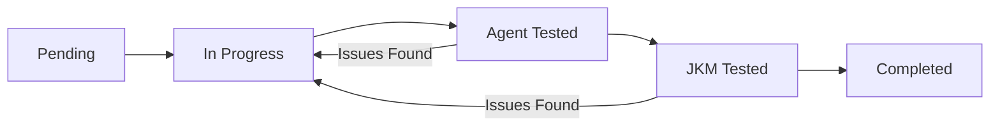

# Features Checklist System

## Overview

The **Features Checklist System** is a comprehensive project management tool built into the WytNet Engine Admin Portal for tracking platform development progress. It implements a dual-stage testing workflow to ensure features are thoroughly validated before deployment.

**Live System**: [Engine Admin → Features Checklist](/engine/features-checklist)

---

## Purpose

- **Track Development Progress**: Monitor all WytNet platform features and their implementation status
- **Dual-Testing Workflow**: Two-stage validation (Agent Testing → JKM Testing) ensures quality
- **Task Management**: Break down features into actionable tasks with clear success criteria
- **URL Tracking**: Link features to live implementations for easy verification
- **Progress Visibility**: Real-time progress tracking across all features

---

## System Architecture

### Data Model

**Features Table**:
```typescript
{
  id: UUID
  displayId: string        // FT0001, FT0002, etc.
  title: string            // Feature name
  description: string      // Feature description
  category: string         // Feature category
  priority: number         // 1-5 priority level
  status: enum             // pending | in_progress | agent_tested | jkm_tested | completed
  url: string             // Live feature URL (optional)
  agentTestedAt: timestamp
  jkmTestedAt: timestamp
  createdAt: timestamp
  updatedAt: timestamp
}
```

**Tasks Table**:
```typescript
{
  id: UUID
  featureId: UUID         // Foreign key to features
  title: string           // Task title
  description: string     // Task details
  status: enum            // pending | in_progress | completed
  order: number           // Display order
  url: string            // Task-specific URL (optional)
  createdAt: timestamp
}
```

---

## Dual-Testing Workflow

The system implements a rigorous two-stage testing process:

### Stage 1: Agent Testing
- **Who**: Replit AI Agent performs initial validation
- **Purpose**: Verify technical implementation, code quality, and basic functionality
- **Status**: `agent_tested`
- **Timestamp**: Recorded in `agentTestedAt`

### Stage 2: JKM Testing
- **Who**: Project Manager (JKM) performs user acceptance testing
- **Purpose**: Validate business requirements, user experience, and real-world usage
- **Status**: `jkm_tested`
- **Timestamp**: Recorded in `jkmTestedAt`

### Status Flow



**Status Values**:
1. `pending` - Feature not yet started
2. `in_progress` - Active development
3. `agent_tested` - Passed AI Agent validation
4. `jkm_tested` - Passed Project Manager validation
5. `completed` - Fully deployed and verified

---

## User Interface

### Features List View

The main view displays all features in an expandable accordion layout:

**Features Card Components**:
- **Feature Title** - Prominent display with status badge
- **Display ID** - Unique identifier (e.g., FT0001)
- **Description** - Feature overview
- **Priority Badge** - Visual priority indicator (1-5)
- **Status Badge** - Color-coded status
- **URL Link** - Clickable link to live feature (if available)
- **Testing Timestamps** - When Agent/JKM testing completed
- **Progress Bar** - Task completion percentage
- **Action Buttons** - Edit, Delete, Mark as Tested

### Tasks Section (Expandable)

Each feature can expand to show its tasks:

**Task Card Components**:
- **Task Title** - Clear task name
- **Description** - Task details
- **Status Checkbox** - Mark as complete
- **URL Link** - Task-specific URL (if applicable)
- **Order Number** - Task sequence

---

## Features

### Core Capabilities

1. **Feature Management**
   - Create new features with title, description, category, priority
   - Edit existing features
   - Delete features (with confirmation)
   - Set feature URLs for live implementations

2. **Task Management**
   - Add multiple tasks per feature
   - Mark tasks as complete
   - Reorder tasks with drag-drop (future enhancement)
   - Link tasks to specific URLs

3. **Testing Workflow**
   - Mark feature as "Agent Tested" (captures timestamp)
   - Mark feature as "JKM Tested" (captures timestamp)
   - Move to "Completed" status after both tests pass

4. **Progress Tracking**
   - Real-time progress bars for each feature
   - Global progress statistics (total features, completed count)
   - Category-wise filtering
   - Priority-based filtering

5. **URL Validation**
   - Valid URL pattern checking
   - Support for internal paths (`/engine/...`) and external URLs
   - Clickable links for easy verification

---

## Usage Guide

### Creating a New Feature

1. Navigate to **Engine Admin → Features Checklist**
2. Click **"+ Add Feature"** button
3. Fill in the form:
   - **Title**: Clear, descriptive feature name
   - **Description**: Detailed feature overview
   - **Category**: Select appropriate category
   - **Priority**: Set priority level (1-5)
   - **URL** (optional): Link to live implementation
4. Click **"Create Feature"**

### Adding Tasks to a Feature

1. Click on a feature card to expand it
2. Click **"+ Add Task"** button
3. Enter task details:
   - **Title**: Specific task name
   - **Description**: Task requirements and acceptance criteria
   - **URL** (optional): Task-specific link
4. Click **"Add Task"**

### Testing Workflow

**Agent Testing** (Replit AI Agent):
1. Complete feature implementation
2. Click **"Mark as Agent Tested"** button
3. System records timestamp and updates status to `agent_tested`
4. Agent reviews code and functionality

**JKM Testing** (Project Manager):
1. Feature must be in `agent_tested` status
2. Click **"Mark as JKM Tested"** button
3. System records timestamp and updates status to `jkm_tested`
4. PM validates business requirements and UX

**Completion**:
1. Once both tests pass, feature status automatically becomes `completed`
2. Feature appears in "Completed" filter
3. Progress statistics update

---

## Technical Implementation

### Frontend Stack

- **React 18** with TypeScript
- **react-hook-form** for form validation
- **TanStack Query** for state management
- **shadcn/ui** components (Accordion, Card, Badge, etc.)
- **Tailwind CSS** for styling
- **Lucide Icons** for visual elements

### Backend Stack

- **Express.js** REST API
- **PostgreSQL** database (Neon)
- **Drizzle ORM** for type-safe queries
- **Zod** schema validation

### API Endpoints

```typescript
// Features Management
GET    /api/admin/features-checklist           // List all features
POST   /api/admin/features-checklist           // Create feature
PATCH  /api/admin/features-checklist/:id       // Update feature
DELETE /api/admin/features-checklist/:id       // Delete feature

// Tasks Management
GET    /api/admin/features-checklist/:id/tasks // List feature tasks
POST   /api/admin/features-checklist/:id/tasks // Create task
PATCH  /api/admin/features-checklist/tasks/:id // Update task
DELETE /api/admin/features-checklist/tasks/:id // Delete task

// Testing Workflow
PATCH  /api/admin/features-checklist/:id/agent-tested  // Mark Agent Tested
PATCH  /api/admin/features-checklist/:id/jkm-tested    // Mark JKM Tested
```

---

## Best Practices

### Feature Creation

1. **Clear Titles**: Use descriptive, action-oriented feature names
   - ✅ Good: "User Profile Management System"
   - ❌ Bad: "Profile stuff"

2. **Detailed Descriptions**: Include scope, benefits, and acceptance criteria
   - What the feature does
   - Why it's needed
   - How users will interact with it

3. **Proper Categorization**: Group related features for easier filtering
   - Authentication
   - Admin Tools
   - User Features
   - API Enhancements

4. **Priority Setting**: Use priority levels strategically
   - **Priority 1**: Critical, must-have features
   - **Priority 2**: Important features
   - **Priority 3**: Nice-to-have features
   - **Priority 4-5**: Future enhancements

### Task Breakdown

1. **Atomic Tasks**: Each task should be independently completable
2. **Clear Acceptance Criteria**: Define what "done" means
3. **Logical Ordering**: Arrange tasks in implementation sequence
4. **URL Links**: Add links to relevant code, docs, or live pages

### Testing Workflow

1. **Agent Testing First**: Always get AI validation before human review
2. **Documented Issues**: If testing fails, document issues in task descriptions
3. **Iterative Fixes**: Move back to "In Progress" if issues found
4. **Final Verification**: JKM testing ensures business value delivered

---

## Mobile Optimization

The Features Checklist system is fully responsive and optimized for mobile devices:

- **Accordion Cards**: Easy tap-to-expand on mobile
- **Scrollable Task Lists**: Vertical scroll for tasks
- **Touch-Friendly Buttons**: Large touch targets
- **Responsive Layout**: Adapts to all screen sizes

---

## Future Enhancements

- **Drag-Drop Task Reordering**: Visual task organization
- **Team Collaboration**: Multiple testers, comments, attachments
- **Automated Testing Integration**: CI/CD pipeline integration
- **Analytics Dashboard**: Feature velocity, testing metrics
- **Export Capabilities**: PDF, CSV, JSON exports
- **Custom Workflows**: Configurable testing stages

---

## Related Documentation

- [Engine Admin Panel Overview](/en/admin/engine-admin)
- [RBAC System](/en/architecture/rbac)
- [Database Schema](/en/architecture/database-schema)
- [API Reference](/en/api/admin)

---

## Access Control

**Required Permission**: `features_checklist.manage` (Super Admin only)

Only users with Super Admin privileges can access the Features Checklist system.
