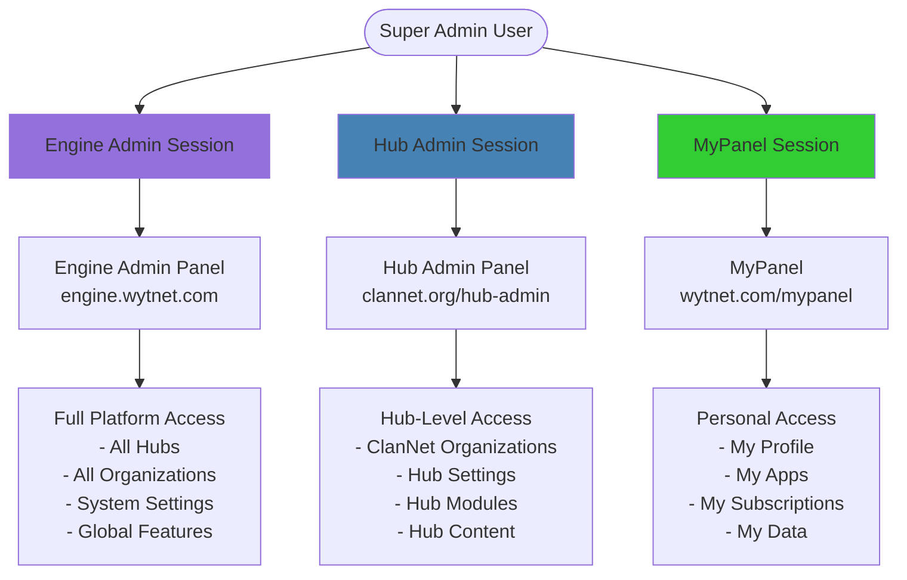
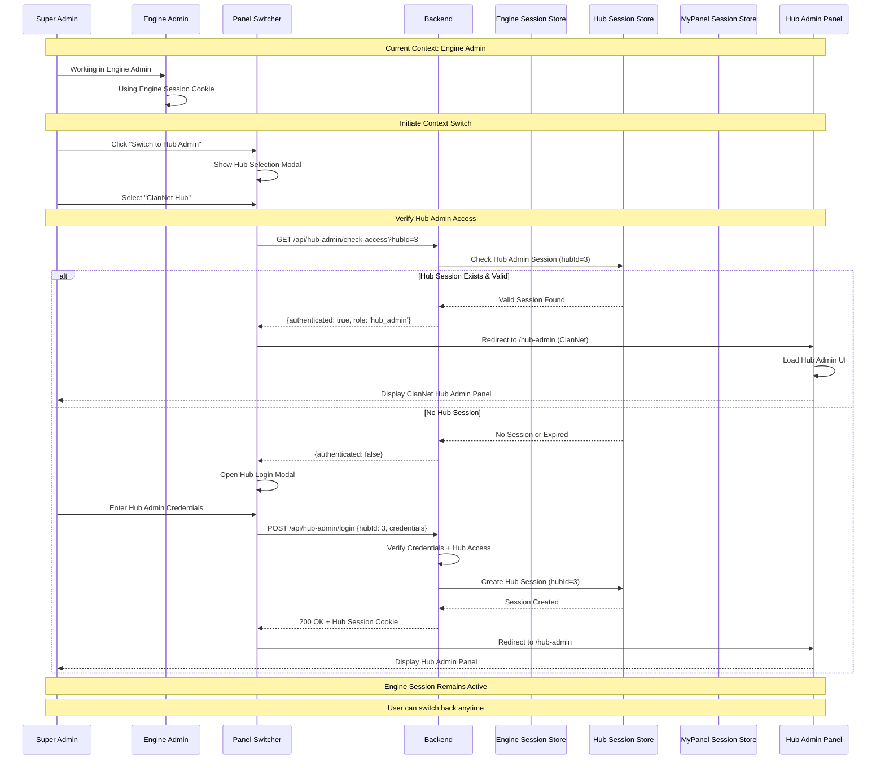
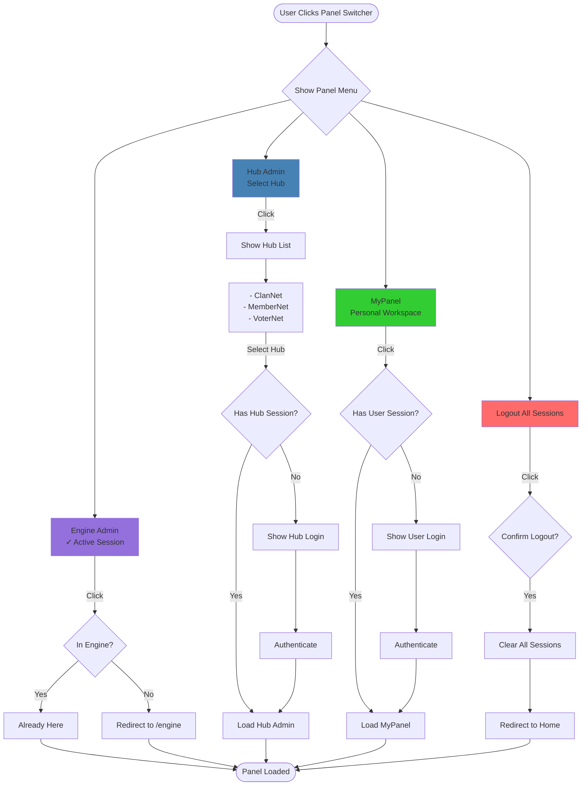
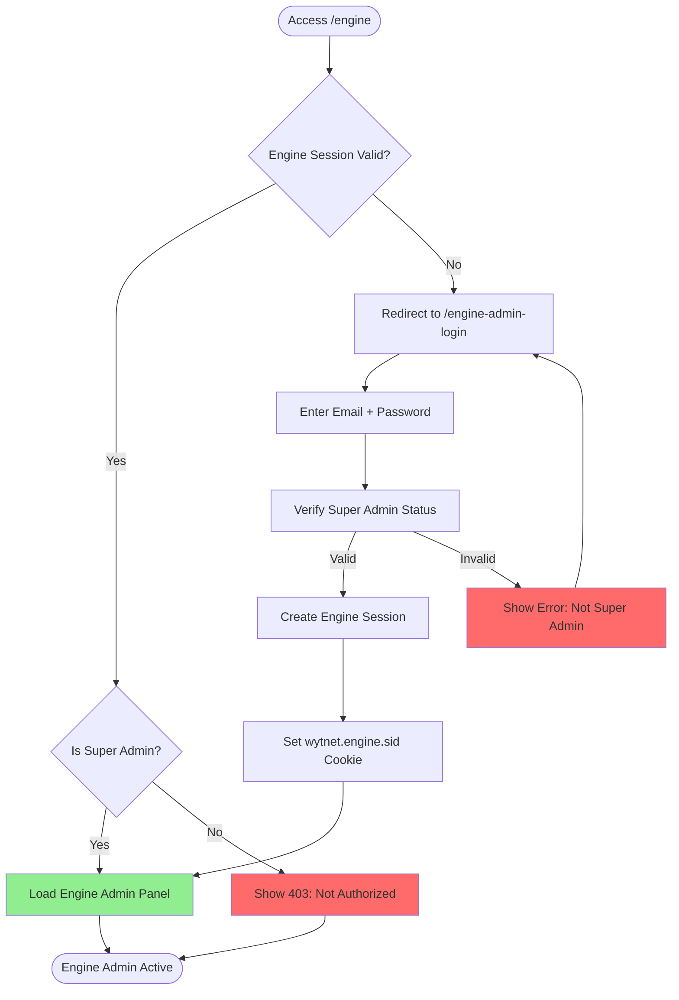
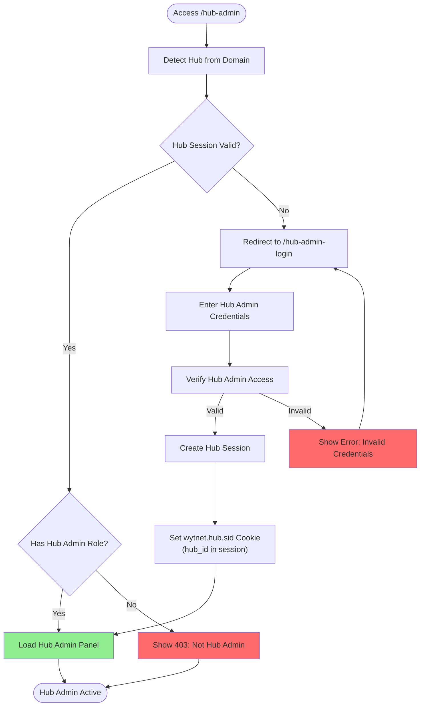
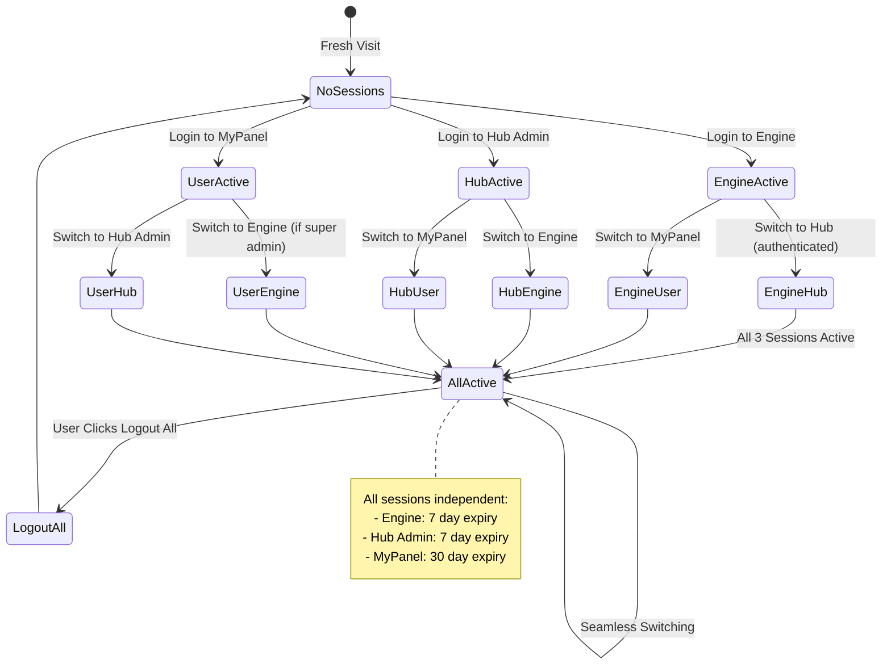

# Super Admin Panel Switching

## Overview

WytNet's **Triple Session Management System** allows Super Admins to seamlessly switch between three distinct admin contexts without losing their work or requiring re-authentication.

**Three Admin Contexts:**
1. **Engine Admin** (Platform Control) - engine.wytnet.com
2. **Hub Admin** (Hub Management) - Each hub's admin panel
3. **MyPanel** (Personal Workspace) - User's personal dashboard

**Key Features:**
- Isolated session management per context
- Seamless context switching with preserved state
- Role-based access control per panel
- Independent authentication flows
- Protected route guards per context

---

## Triple Session Architecture

### Session Isolation Model



---

## Context Switching Flow

### Complete Panel Switching Workflow



---

## Panel Switcher UI Component

### Interactive Switcher Menu



---

## Session Cookie Management

### Cookie Isolation Strategy

```typescript
// Three separate session cookies
const SESSION_CONFIGS = {
  engine: {
    name: 'wytnet.engine.sid',
    secret: process.env.SESSION_SECRET,
    cookie: {
      httpOnly: true,
      secure: true,
      sameSite: 'lax',
      maxAge: 7 * 24 * 60 * 60 * 1000,  // 7 days
      domain: '.wytnet.com'
    },
    store: engineSessionStore
  },
  
  hubAdmin: {
    name: 'wytnet.hub.sid',
    secret: process.env.SESSION_SECRET,
    cookie: {
      httpOnly: true,
      secure: true,
      sameSite: 'lax',
      maxAge: 7 * 24 * 60 * 60 * 1000,  // 7 days
      domain: undefined  // Hub-specific domain
    },
    store: hubSessionStore
  },
  
  user: {
    name: 'wytnet.sid',
    secret: process.env.SESSION_SECRET,
    cookie: {
      httpOnly: true,
      secure: true,
      sameSite: 'lax',
      maxAge: 30 * 24 * 60 * 60 * 1000,  // 30 days
      domain: '.wytnet.com'
    },
    store: userSessionStore
  }
};
```

---

## Authentication Workflow Per Context

### Engine Admin Authentication



### Hub Admin Authentication



---

## Database Session Storage

### PostgreSQL Session Tables

```sql
-- Engine Admin Sessions
CREATE TABLE engine_sessions (
  sid VARCHAR PRIMARY KEY,
  sess JSON NOT NULL,
  expire TIMESTAMP NOT NULL,
  created_at TIMESTAMP DEFAULT NOW()
);
CREATE INDEX idx_engine_session_expire ON engine_sessions(expire);

-- Hub Admin Sessions
CREATE TABLE hub_admin_sessions (
  sid VARCHAR PRIMARY KEY,
  sess JSON NOT NULL,
  hub_id INTEGER NOT NULL,
  expire TIMESTAMP NOT NULL,
  created_at TIMESTAMP DEFAULT NOW()
);
CREATE INDEX idx_hub_session_expire ON hub_admin_sessions(expire);
CREATE INDEX idx_hub_session_hub ON hub_admin_sessions(hub_id);

-- User Sessions (Regular + MyPanel)
CREATE TABLE user_sessions (
  sid VARCHAR PRIMARY KEY,
  sess JSON NOT NULL,
  expire TIMESTAMP NOT NULL,
  created_at TIMESTAMP DEFAULT NOW()
);
CREATE INDEX idx_user_session_expire ON user_sessions(expire);

-- Session Data Structure (JSON)
{
  "userId": 123,
  "email": "admin@wytnet.com",
  "displayId": "UR0000001",
  "role": "super_admin",
  "hubId": 3,  // Only for Hub Admin sessions
  "tenantId": 5,  // Organization context if any
  "createdAt": "2025-10-21T10:00:00Z",
  "lastActivity": "2025-10-21T16:30:00Z"
}
```

---

## Frontend Implementation

### Panel Switcher Component

```typescript
// components/PanelSwitcher.tsx
export function PanelSwitcher() {
  const { adminUser } = useAdminAuth();  // Engine session
  const { hubAdminUser } = useHubAdminAuth();  // Hub session
  const { user } = useAuth();  // User session
  
  const [showSwitcher, setShowSwitcher] = useState(false);
  const [currentPanel, setCurrentPanel] = useState<'engine' | 'hub' | 'mypanel'>('engine');
  
  async function switchToEngine() {
    if (adminUser) {
      window.location.href = '/engine';
    } else {
      window.location.href = '/engine-admin-login?returnUrl=/engine';
    }
  }
  
  async function switchToHubAdmin(hubId: number) {
    const res = await fetch(`/api/hub-admin/check-access?hubId=${hubId}`);
    const { authenticated } = await res.json();
    
    if (authenticated) {
      window.location.href = `/hub-admin`;
    } else {
      window.location.href = `/hub-admin-login?hubId=${hubId}`;
    }
  }
  
  async function switchToMyPanel() {
    if (user) {
      window.location.href = '/mypanel';
    } else {
      window.location.href = '/login?returnUrl=/mypanel';
    }
  }
  
  async function logoutAll() {
    await fetch('/api/auth/logout-all', { method: 'POST' });
    window.location.href = '/';
  }
  
  return (
    <DropdownMenu>
      <DropdownMenuTrigger>
        <Button variant="outline">
          <PanelIcon /> {getCurrentPanelName()}
        </Button>
      </DropdownMenuTrigger>
      
      <DropdownMenuContent>
        <DropdownMenuItem onClick={switchToEngine}>
          <Shield className="mr-2" />
          Engine Admin
          {adminUser && <CheckCircle className="ml-auto text-green-500" />}
        </DropdownMenuItem>
        
        <DropdownMenuItem onClick={() => setShowHubSelector(true)}>
          <Building className="mr-2" />
          Hub Admin
          {hubAdminUser && <CheckCircle className="ml-auto text-green-500" />}
        </DropdownMenuItem>
        
        <DropdownMenuItem onClick={switchToMyPanel}>
          <User className="mr-2" />
          MyPanel
          {user && <CheckCircle className="ml-auto text-green-500" />}
        </DropdownMenuItem>
        
        <DropdownMenuSeparator />
        
        <DropdownMenuItem onClick={logoutAll} className="text-red-600">
          <LogOut className="mr-2" />
          Logout All Sessions
        </DropdownMenuItem>
      </DropdownMenuContent>
    </DropdownMenu>
  );
}
```

---

## Session State Management

### Multi-Session State Diagram



---

## Backend API Routes

### Session Management Endpoints

```typescript
// Engine Admin Session
GET /api/admin/session
Response: { authenticated: true, user: {...}, role: 'super_admin' }

POST /api/admin/login
Body: { email, password }
Response: 200 OK + wytnet.engine.sid cookie

POST /api/admin/logout
Response: 200 OK (clears engine session)

// Hub Admin Session
GET /api/hub-admin/session
Response: { authenticated: true, user: {...}, hubId: 3, role: 'hub_admin' }

POST /api/hub-admin/login
Body: { email, password, hubId }
Response: 200 OK + wytnet.hub.sid cookie

POST /api/hub-admin/logout
Response: 200 OK (clears hub session)

GET /api/hub-admin/check-access?hubId=3
Response: { authenticated: boolean, role?: string }

// User Session
GET /api/auth/user
Response: { id, email, displayId, name, role }

POST /api/auth/logout
Response: 200 OK (clears user session)

// Logout All
POST /api/auth/logout-all
Response: 200 OK (clears all 3 sessions)
```

---

## Security Considerations

### 1. Session Isolation
- Each context has independent session cookie
- No cross-session data leakage
- Separate session stores in database

### 2. Role Verification
```typescript
// Verify Super Admin for Engine access
if (!user.isSuperAdmin) {
  return res.status(403).json({ error: 'Engine Admin access requires Super Admin role' });
}

// Verify Hub Admin for specific hub
const hasHubAccess = await checkHubAdminRole(userId, hubId);
if (!hasHubAccess) {
  return res.status(403).json({ error: 'Not authorized for this hub' });
}
```

### 3. CSRF Protection
- SameSite cookie attribute
- Different cookie names per context
- Session token validation

---

## Common Use Cases

### Use Case 1: Super Admin Daily Workflow

1. **Morning:** Login to Engine Admin → Review platform analytics
2. **Midday:** Switch to ClanNet Hub Admin → Approve new organizations
3. **Afternoon:** Switch to MyPanel → Check personal subscriptions
4. **All Day:** Seamlessly switch between panels without re-login

### Use Case 2: Hub Admin (Non-Super Admin)

1. User is Hub Admin for ClanNet only
2. Cannot access Engine Admin (403 Forbidden)
3. Can access ClanNet Hub Admin panel
4. Can access MyPanel for personal use
5. Panel Switcher shows only available panels

---

## Performance Optimization

### 1. Session Caching
- Cache session data in memory (Redis)
- Reduce database lookups per request
- TTL matches cookie expiry

### 2. Lazy Session Checks
- Don't check all 3 sessions on every page load
- Check only current context session
- Verify other sessions only when switching

### 3. Connection Pooling
- Separate connection pools per session store
- Optimize for concurrent session access
- Auto-scaling based on active sessions

---

## Related Flows

- [RBAC Role-Based Access Control](/en/use-case-flows/rbac-permissions) - Role verification
- [WytPass Authentication System](/en/use-case-flows/wytpass-authentication) - Authentication methods
- [Multi-Tenant Architecture](/en/use-case-flows/multi-tenant-architecture) - Context isolation
- [Audit Logs System](/en/use-case-flows/audit-logs-system) - Session activity tracking

---

**Next:** Explore [WytAI Agent Workflow](/en/use-case-flows/wytai-agent-workflow) for AI assistant integration.
