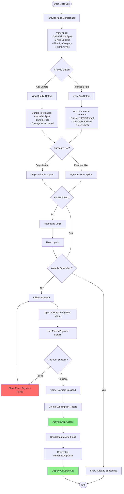
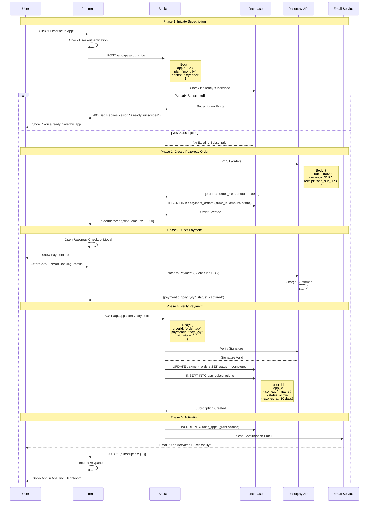
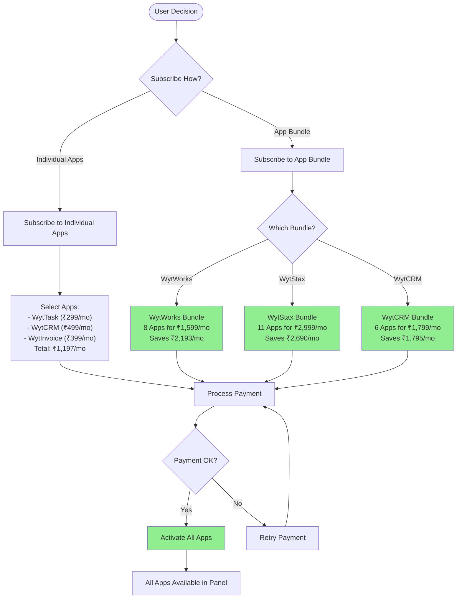
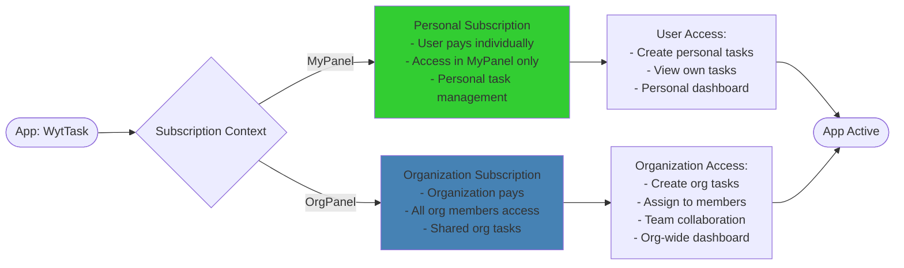
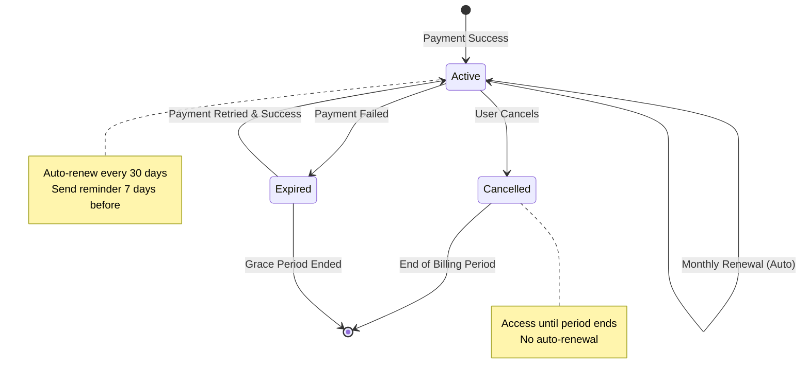

# App Subscription Flow

:::warning PRODUCTION QUALITY REQUIREMENTS
Subscription & Payment operations MUST include:
- ✅ **Payment Verification** - Always verify payment with Razorpay before activation
- 🔒 **Webhook Security** - Validate Razorpay webhook signatures
- 📊 **Transaction Logging** - Log all payment attempts (success & failure)
- ⚠️ **Idempotency** - Prevent duplicate subscriptions for same payment
- 🎯 **Error Recovery** - Handle failed payments gracefully with retry options

See [Production Standards](/en/production-standards/) for complete requirements.
:::

## Overview

WytNet's **App Subscription System** enables users to browse, subscribe to, and activate applications for personal (MyPanel) or organizational (OrgPanel) use with integrated Razorpay payment processing.

**Key Features:**
- 39 apps across 17 categories
- Individual app subscriptions OR app bundles (WytWorks, WytStax, WytCRM)
- Razorpay payment integration
- Instant activation after payment
- MyPanel and OrgPanel availability
- Subscription management

---

## App Subscription Journey

### Complete User Flow



---

## Razorpay Payment Integration

### Payment Processing Flow



---

## App Bundle Subscription

### Bundle vs Individual Apps



---

## MyPanel vs OrgPanel Subscription

### Context-Based App Access



---

## Database Schema

### App Subscription Tables

```sql
-- Apps Table
CREATE TABLE apps (
  id SERIAL PRIMARY KEY,
  slug VARCHAR(100) UNIQUE NOT NULL,
  name VARCHAR(255) NOT NULL,
  description TEXT,
  category VARCHAR(100),
  price_monthly DECIMAL(10,2),
  is_free BOOLEAN DEFAULT false,
  available_in_mypanel BOOLEAN DEFAULT true,
  available_in_orgpanel BOOLEAN DEFAULT true,
  features JSONB,
  screenshots TEXT[],
  created_at TIMESTAMP DEFAULT NOW()
);

-- App Bundles
CREATE TABLE app_bundles (
  id SERIAL PRIMARY KEY,
  slug VARCHAR(100) UNIQUE NOT NULL,
  name VARCHAR(255) NOT NULL,
  description TEXT,
  price_monthly DECIMAL(10,2),
  included_apps INTEGER[] NOT NULL,  -- Array of app IDs
  savings DECIMAL(10,2),
  created_at TIMESTAMP DEFAULT NOW()
);

-- App Subscriptions
CREATE TABLE app_subscriptions (
  id SERIAL PRIMARY KEY,
  user_id INTEGER REFERENCES users(id),
  org_id INTEGER REFERENCES organizations(id),
  app_id INTEGER REFERENCES apps(id),
  bundle_id INTEGER REFERENCES app_bundles(id),
  context VARCHAR(20) NOT NULL,  -- 'mypanel' or 'orgpanel'
  status VARCHAR(50) DEFAULT 'active',  -- 'active', 'cancelled', 'expired'
  payment_id VARCHAR(255),
  amount DECIMAL(10,2) NOT NULL,
  starts_at TIMESTAMP DEFAULT NOW(),
  expires_at TIMESTAMP,
  created_at TIMESTAMP DEFAULT NOW(),
  CHECK ((user_id IS NOT NULL AND context = 'mypanel') OR (org_id IS NOT NULL AND context = 'orgpanel'))
);
CREATE INDEX idx_app_subs_user ON app_subscriptions(user_id, status);
CREATE INDEX idx_app_subs_org ON app_subscriptions(org_id, status);

-- Payment Orders (Razorpay)
CREATE TABLE payment_orders (
  id SERIAL PRIMARY KEY,
  order_id VARCHAR(255) UNIQUE NOT NULL,
  payment_id VARCHAR(255),
  user_id INTEGER NOT NULL REFERENCES users(id),
  amount DECIMAL(10,2) NOT NULL,
  currency VARCHAR(10) DEFAULT 'INR',
  status VARCHAR(50) DEFAULT 'created',  -- 'created', 'completed', 'failed'
  receipt VARCHAR(255),
  created_at TIMESTAMP DEFAULT NOW()
);
CREATE INDEX idx_payment_orders_user ON payment_orders(user_id);
CREATE INDEX idx_payment_orders_status ON payment_orders(status);
```

---

## API Endpoints

### App Subscription Routes

```typescript
// Browse Apps
GET /api/apps
Query: ?category=productivity&context=mypanel
Response: List of apps

GET /api/apps/:slug
Response: App details

GET /api/app-bundles
Response: List of app bundles

GET /api/app-bundles/:slug
Response: Bundle details with included apps

// Subscribe to App
POST /api/apps/subscribe
Body: {
  appId: number,
  plan: 'monthly' | 'yearly',
  context: 'mypanel' | 'orgpanel',
  orgId?: number
}
Response: {orderId, amount, appName}

// Subscribe to Bundle
POST /api/app-bundles/subscribe
Body: {
  bundleId: number,
  context: 'mypanel' | 'orgpanel',
  orgId?: number
}
Response: {orderId, amount, bundleName, apps}

// Verify Payment & Activate
POST /api/apps/verify-payment
Body: {
  orderId: string,
  paymentId: string,
  signature: string
}
Response: {subscription: {...}, activated: true}

// User's Active Subscriptions
GET /api/apps/subscriptions
Query: ?context=mypanel
Response: List of active app subscriptions

// Cancel Subscription
POST /api/apps/:id/cancel
Response: {message: "Subscription cancelled"}
```

---

## Frontend Implementation

### App Subscription Component

```typescript
// components/AppSubscribe.tsx
function AppSubscribe({ app }: { app: App }) {
  const { user } = useAuth();
  const [context, setContext] = useState<'mypanel' | 'orgpanel'>('mypanel');
  
  const subscribeMutation = useMutation({
    mutationFn: async () => {
      // Create Razorpay order
      const res = await apiRequest('/api/apps/subscribe', {
        method: 'POST',
        body: {
          appId: app.id,
          plan: 'monthly',
          context
        }
      });
      
      return res;
    },
    onSuccess: async (data) => {
      // Open Razorpay checkout
      const options = {
        key: import.meta.env.VITE_RAZORPAY_KEY_ID,
        amount: data.amount,
        currency: 'INR',
        order_id: data.orderId,
        name: 'WytNet',
        description: `Subscribe to ${data.appName}`,
        handler: async (response: any) => {
          // Verify payment
          try {
            const verification = await apiRequest('/api/apps/verify-payment', {
              method: 'POST',
              body: {
                orderId: response.razorpay_order_id,
                paymentId: response.razorpay_payment_id,
                signature: response.razorpay_signature
              }
            });
            
            toast.success('App activated successfully!');
            
            // Redirect to panel
            if (context === 'mypanel') {
              window.location.href = '/mypanel';
            } else {
              window.location.href = '/orgpanel';
            }
          } catch (error) {
            toast.error('Payment verification failed');
          }
        },
        prefill: {
          name: user?.name,
          email: user?.email
        },
        theme: {
          color: '#3B82F6'
        }
      };
      
      const rzp = new Razorpay(options);
      rzp.open();
    }
  });
  
  return (
    <Card>
      <CardHeader>
        <CardTitle>{app.name}</CardTitle>
        <CardDescription>{app.description}</CardDescription>
      </CardHeader>
      
      <CardContent>
        <div className="space-y-4">
          <div>
            <strong>Price:</strong> ₹{app.priceMonthly}/month
          </div>
          
          <RadioGroup value={context} onValueChange={setContext}>
            {app.availableInMypanel && (
              <RadioGroupItem value="mypanel">
                For Personal Use (MyPanel)
              </RadioGroupItem>
            )}
            {app.availableInOrgpanel && (
              <RadioGroupItem value="orgpanel">
                For Organization (OrgPanel)
              </RadioGroupItem>
            )}
          </RadioGroup>
          
          <Button
            onClick={() => subscribeMutation.mutate()}
            disabled={subscribeMutation.isPending}
          >
            {subscribeMutation.isPending ? 'Processing...' : `Subscribe for ₹${app.priceMonthly}/mo`}
          </Button>
        </div>
      </CardContent>
    </Card>
  );
}
```

---

## Payment Security

### Razorpay Signature Verification

```typescript
// Backend verification
import crypto from 'crypto';

function verifyRazorpaySignature(
  orderId: string,
  paymentId: string,
  signature: string
): boolean {
  const message = `${orderId}|${paymentId}`;
  const generatedSignature = crypto
    .createHmac('sha256', process.env.RAZORPAY_KEY_SECRET!)
    .update(message)
    .digest('hex');
  
  return generatedSignature === signature;
}

// Usage in route
app.post('/api/apps/verify-payment', async (req, res) => {
  const { orderId, paymentId, signature } = req.body;
  
  const isValid = verifyRazorpaySignature(orderId, paymentId, signature);
  
  if (!isValid) {
    return res.status(400).json({ error: 'Invalid payment signature' });
  }
  
  // Activate subscription
  const subscription = await activateAppSubscription(orderId);
  res.json({ subscription, activated: true });
});
```

---

## Subscription Management

### Auto-Renewal & Cancellation



---

## App Pricing Examples

### Individual Apps

| App | Category | MyPanel Price | OrgPanel Price |
|-----|----------|---------------|----------------|
| WytTask | Productivity | ₹299/mo | ₹499/mo |
| WytCRM | CRM | ₹499/mo | ₹799/mo |
| WytInvoice | Finance | ₹399/mo | ₹599/mo |
| WytHR | HR | ₹599/mo | ₹999/mo |

### App Bundles

| Bundle | Apps | Individual Price | Bundle Price | Savings |
|--------|------|------------------|--------------|---------|
| WytWorks | 8 apps | ₹3,792/mo | ₹1,599/mo | ₹2,193/mo |
| WytStax | 11 apps | ₹5,689/mo | ₹2,999/mo | ₹2,690/mo |
| WytCRM | 6 apps | ₹3,594/mo | ₹1,799/mo | ₹1,795/mo |

---

## Related Flows

- [Module Installation & Activation](/en/use-case-flows/module-installation) - Module system
- [Multi-Tenant Architecture](/en/use-case-flows/multi-tenant-architecture) - Context isolation
- [WytPass Authentication System](/en/use-case-flows/wytpass-authentication) - User auth
- [Audit Logs System](/en/use-case-flows/audit-logs-system) - Payment tracking

---

**Next:** Explore [Audit Logs System](/en/use-case-flows/audit-logs-system) for comprehensive activity tracking.
