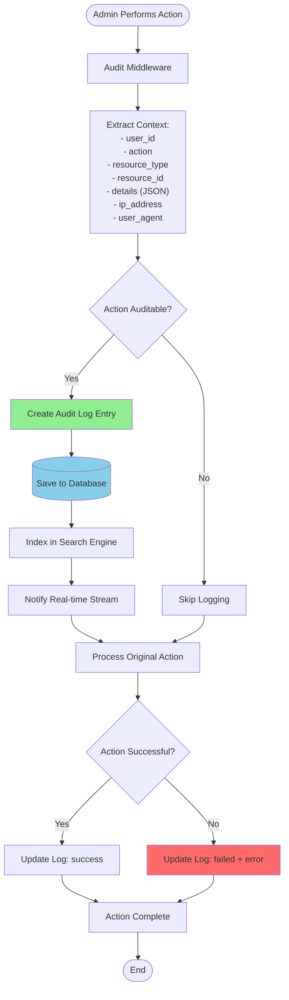
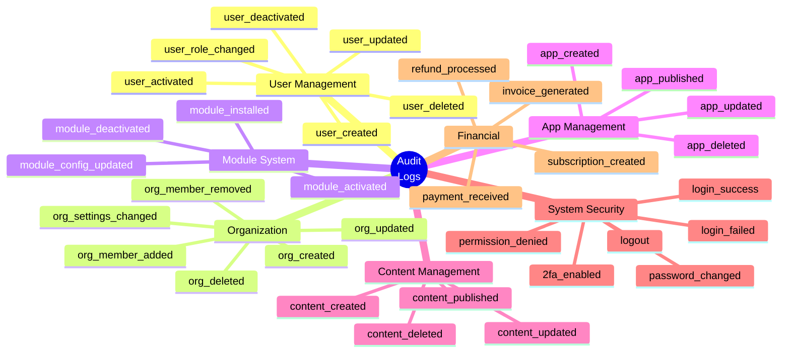
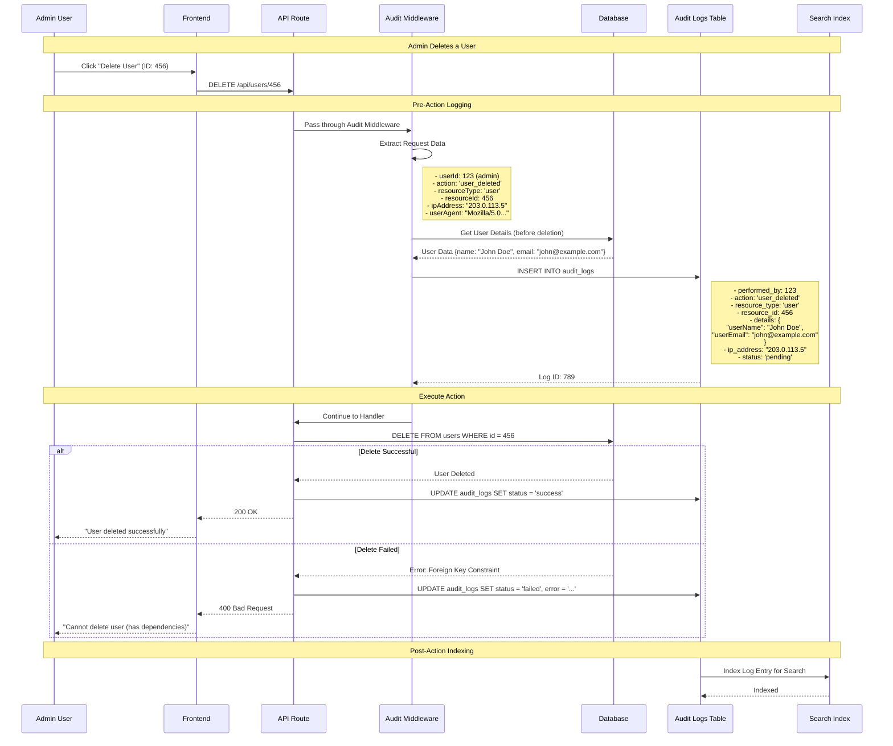
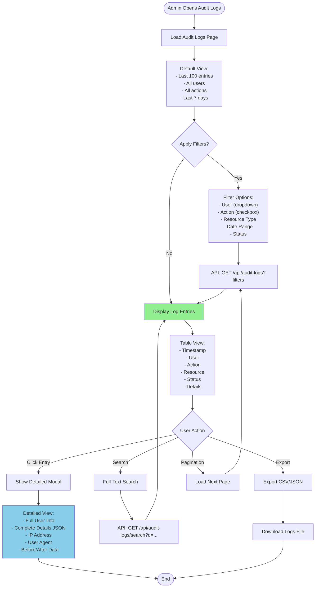
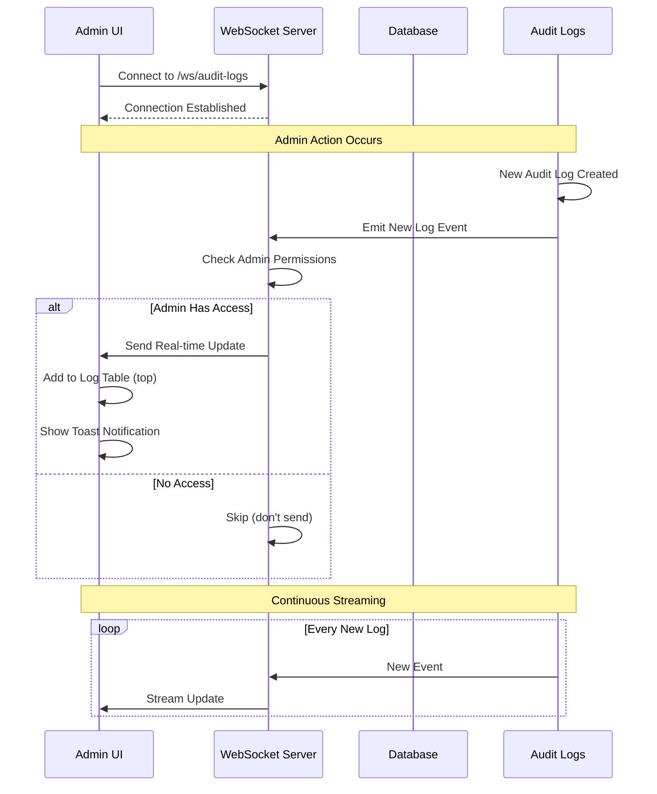

# Audit Logs System

:::warning PRODUCTION QUALITY REQUIREMENTS
Audit Logging MUST include:
- ✅ **Comprehensive Coverage** - Log ALL admin actions (create, update, delete)
- 🔒 **Tamper Protection** - Prevent log modification or deletion
- 📊 **Structured Data** - Use consistent JSON format for details
- ⚠️ **Performance** - Async logging to avoid blocking main operations
- 🎯 **Retention Policy** - Archive old logs, maintain searchable history

See [Production Standards](/en/production-standards/) for complete requirements.
:::

## Overview

WytNet's **Audit Logs System** provides comprehensive tracking of all administrative actions across the platform, enabling security monitoring, compliance, debugging, and accountability with filtering, pagination, search, and detailed activity timelines.

**Key Features:**
- Tracks ALL admin actions (create, update, delete)
- User identification and IP tracking
- Resource-level event logging
- Advanced filtering and search
- Timeline visualization
- Export capabilities (CSV, JSON)
- Real-time event streaming

---

## Audit Log Architecture

### Complete Logging System



---

## Logged Events

### Comprehensive Event Categories



---

## Audit Log Creation Flow

### Event Capture Sequence



---

## Audit Logs Viewing Flow

### Admin UI Interaction



---

## Database Schema

### Audit Logs Table

```sql
-- Audit Logs Table
CREATE TABLE audit_logs (
  id SERIAL PRIMARY KEY,
  performed_by INTEGER NOT NULL REFERENCES users(id),
  action VARCHAR(100) NOT NULL,
  resource_type VARCHAR(100) NOT NULL,
  resource_id INTEGER,
  details JSONB,
  ip_address VARCHAR(45),
  user_agent TEXT,
  status VARCHAR(50) DEFAULT 'success',  -- 'success', 'failed', 'pending'
  error TEXT,
  created_at TIMESTAMP DEFAULT NOW()
);

-- Indexes for Performance
CREATE INDEX idx_audit_logs_user ON audit_logs(performed_by);
CREATE INDEX idx_audit_logs_action ON audit_logs(action);
CREATE INDEX idx_audit_logs_resource ON audit_logs(resource_type, resource_id);
CREATE INDEX idx_audit_logs_created ON audit_logs(created_at DESC);
CREATE INDEX idx_audit_logs_status ON audit_logs(status);
CREATE INDEX idx_audit_logs_details ON audit_logs USING GIN(details);  -- JSONB index

-- Example Entry
{
  "id": 12345,
  "performed_by": 123,
  "action": "user_deleted",
  "resource_type": "user",
  "resource_id": 456,
  "details": {
    "userName": "John Doe",
    "userEmail": "john@example.com",
    "userRole": "member",
    "deletedBy": "Admin",
    "reason": "Account closure request"
  },
  "ip_address": "203.0.113.5",
  "user_agent": "Mozilla/5.0 (Windows NT 10.0; Win64; x64)...",
  "status": "success",
  "error": null,
  "created_at": "2025-10-21T16:45:30Z"
}
```

---

## Audit Middleware Implementation

### Express Middleware

```typescript
// middleware/auditLog.ts
export function auditLog(action: string, resourceType: string) {
  return async (req: Request, res: Response, next: NextFunction) => {
    const startTime = Date.now();
    const userId = req.session?.userId;
    
    if (!userId) {
      return next(); // Skip audit for unauthenticated requests
    }
    
    // Extract resource ID from URL params or body
    const resourceId = req.params.id || req.body.id;
    
    // Capture request details
    const ipAddress = req.ip || req.headers['x-forwarded-for'] as string;
    const userAgent = req.headers['user-agent'];
    
    // Get original data before modification (for updates/deletes)
    let originalData;
    if (['update', 'delete'].some(a => action.includes(a)) && resourceId) {
      originalData = await getResourceData(resourceType, resourceId);
    }
    
    // Create audit log entry
    const logEntry = await db.auditLogs.create({
      performed_by: userId,
      action,
      resource_type: resourceType,
      resource_id: resourceId ? parseInt(resourceId) : null,
      details: {
        originalData,
        requestBody: sanitizeBody(req.body),
        path: req.path,
        method: req.method
      },
      ip_address: ipAddress,
      user_agent: userAgent,
      status: 'pending'
    });
    
    // Store log ID in request for later update
    req.auditLogId = logEntry.id;
    
    // Capture response
    const originalSend = res.send;
    res.send = function(data: any) {
      const responseTime = Date.now() - startTime;
      
      // Update audit log with result
      db.auditLogs.update(req.auditLogId, {
        status: res.statusCode < 400 ? 'success' : 'failed',
        error: res.statusCode >= 400 ? data : null,
        details: {
          ...logEntry.details,
          responseTime,
          statusCode: res.statusCode
        }
      });
      
      return originalSend.call(this, data);
    };
    
    next();
  };
}

// Usage in routes
app.delete('/api/users/:id',
  requirePermission('users:delete'),
  auditLog('user_deleted', 'user'),
  async (req, res) => {
    await db.users.delete(req.params.id);
    res.json({ message: 'User deleted' });
  }
);
```

---

## API Endpoints

### Audit Logs Routes

```typescript
// Get audit logs with filters
GET /api/audit-logs
Query Parameters:
  - userId: Filter by user
  - action: Filter by action type
  - resourceType: Filter by resource
  - startDate: Date range start
  - endDate: Date range end
  - status: success | failed
  - page: Pagination page
  - limit: Results per page
Response: {
  logs: [...],
  total: 1234,
  page: 1,
  totalPages: 13
}

// Get single audit log details
GET /api/audit-logs/:id
Response: Detailed log entry with full JSON

// Search audit logs (full-text)
GET /api/audit-logs/search
Query: ?q=user+deleted&startDate=2025-10-01
Response: Matching log entries

// Export audit logs
GET /api/audit-logs/export
Query: ?format=csv|json&filters=...
Response: File download

// Get audit logs for specific resource
GET /api/audit-logs/resource/:type/:id
Example: /api/audit-logs/resource/user/123
Response: All logs related to user ID 123

// Get activity timeline
GET /api/audit-logs/timeline
Query: ?userId=123&startDate=...
Response: Chronological timeline of user actions
```

---

## Frontend Implementation

### Audit Logs UI Component

```typescript
// pages/admin/AuditLogs.tsx
export function AuditLogsPage() {
  const [filters, setFilters] = useState({
    userId: null,
    action: null,
    resourceType: null,
    startDate: null,
    endDate: null,
    status: null
  });
  
  const { data, isLoading } = useQuery({
    queryKey: ['/api/audit-logs', filters],
    queryFn: () => fetch(`/api/audit-logs?${new URLSearchParams(filters)}`).then(r => r.json())
  });
  
  const exportMutation = useMutation({
    mutationFn: async (format: 'csv' | 'json') => {
      const response = await fetch(`/api/audit-logs/export?format=${format}&${new URLSearchParams(filters)}`);
      const blob = await response.blob();
      const url = window.URL.createObjectURL(blob);
      const a = document.createElement('a');
      a.href = url;
      a.download = `audit-logs.${format}`;
      a.click();
    }
  });
  
  return (
    <div className="space-y-6">
      <div className="flex justify-between items-center">
        <h1 className="text-2xl font-bold">Audit Logs</h1>
        
        <div className="flex gap-2">
          <Button onClick={() => exportMutation.mutate('csv')}>
            Export CSV
          </Button>
          <Button onClick={() => exportMutation.mutate('json')}>
            Export JSON
          </Button>
        </div>
      </div>
      
      <AuditLogFilters filters={filters} onChange={setFilters} />
      
      <Table>
        <TableHeader>
          <TableRow>
            <TableHead>Timestamp</TableHead>
            <TableHead>User</TableHead>
            <TableHead>Action</TableHead>
            <TableHead>Resource</TableHead>
            <TableHead>Status</TableHead>
            <TableHead>Actions</TableHead>
          </TableRow>
        </TableHeader>
        
        <TableBody>
          {data?.logs.map((log) => (
            <TableRow key={log.id}>
              <TableCell>{formatDate(log.created_at)}</TableCell>
              <TableCell>{log.userName}</TableCell>
              <TableCell>
                <Badge variant={getActionVariant(log.action)}>
                  {formatAction(log.action)}
                </Badge>
              </TableCell>
              <TableCell>
                {log.resource_type} #{log.resource_id}
              </TableCell>
              <TableCell>
                <Badge variant={log.status === 'success' ? 'success' : 'destructive'}>
                  {log.status}
                </Badge>
              </TableCell>
              <TableCell>
                <Button
                  variant="ghost"
                  size="sm"
                  onClick={() => openDetailsModal(log)}
                >
                  <Eye className="h-4 w-4" />
                </Button>
              </TableCell>
            </TableRow>
          ))}
        </TableBody>
      </Table>
      
      <Pagination
        currentPage={data?.page}
        totalPages={data?.totalPages}
        onPageChange={handlePageChange}
      />
    </div>
  );
}
```

---

## Real-Time Event Streaming

### WebSocket Audit Stream



---

## Advanced Features

### 1. Activity Timeline

```typescript
// Get user activity timeline
GET /api/audit-logs/timeline?userId=123

Response:
{
  "timeline": [
    {
      "date": "2025-10-21",
      "events": [
        {
          "time": "16:45",
          "action": "user_deleted",
          "details": "Deleted user John Doe"
        },
        {
          "time": "14:30",
          "action": "org_created",
          "details": "Created organization 'Tech Startup'"
        }
      ]
    }
  ]
}
```

### 2. Full-Text Search

```typescript
// Search across all log details
GET /api/audit-logs/search?q=john+doe

// Uses PostgreSQL full-text search
SELECT * FROM audit_logs
WHERE to_tsvector('english', details::text) @@ plainto_tsquery('english', 'john doe')
ORDER BY created_at DESC;
```

### 3. Retention Policy

```sql
-- Auto-delete logs older than 1 year (compliance)
DELETE FROM audit_logs
WHERE created_at < NOW() - INTERVAL '1 year';

-- Or archive to cold storage
INSERT INTO audit_logs_archive
SELECT * FROM audit_logs
WHERE created_at < NOW() - INTERVAL '90 days';

DELETE FROM audit_logs
WHERE created_at < NOW() - INTERVAL '90 days';
```

---

## Security & Compliance

### 1. Access Control
```typescript
// Only Super Admins and specific roles can view audit logs
app.get('/api/audit-logs',
  requirePermission('audit:view'),
  async (req, res) => {
    // Fetch logs
  }
);
```

### 2. Immutable Logs
```sql
-- Audit logs cannot be updated or deleted (except by system)
-- No UPDATE or DELETE grants to application users
REVOKE UPDATE, DELETE ON audit_logs FROM app_user;
GRANT INSERT, SELECT ON audit_logs TO app_user;
```

### 3. Sensitive Data Masking
```typescript
function sanitizeBody(body: any): any {
  const sanitized = { ...body };
  const sensitiveFields = ['password', 'apiKey', 'secret', 'token'];
  
  for (const field of sensitiveFields) {
    if (field in sanitized) {
      sanitized[field] = '***REDACTED***';
    }
  }
  
  return sanitized;
}
```

---

## Performance Optimization

### 1. Partitioning
```sql
-- Partition by month for faster queries
CREATE TABLE audit_logs_2025_10 PARTITION OF audit_logs
FOR VALUES FROM ('2025-10-01') TO ('2025-11-01');
```

### 2. Async Logging
```typescript
// Don't block request processing for logging
async function logAuditEvent(event: AuditEvent) {
  // Queue for background processing
  await auditQueue.add(event);
}
```

---

## Related Flows

- [RBAC Role-Based Access Control](/en/use-case-flows/rbac-permissions) - Permission tracking
- [Super Admin Panel Switching](/en/use-case-flows/admin-panel-switching) - Admin actions
- [WytAI Agent Workflow](/en/use-case-flows/wytai-agent-workflow) - AI usage logs
- [App Subscription Flow](/en/use-case-flows/app-subscription-flow) - Payment logs

---

**Complete:** All 10 use case flows documented with comprehensive diagrams and workflows.
