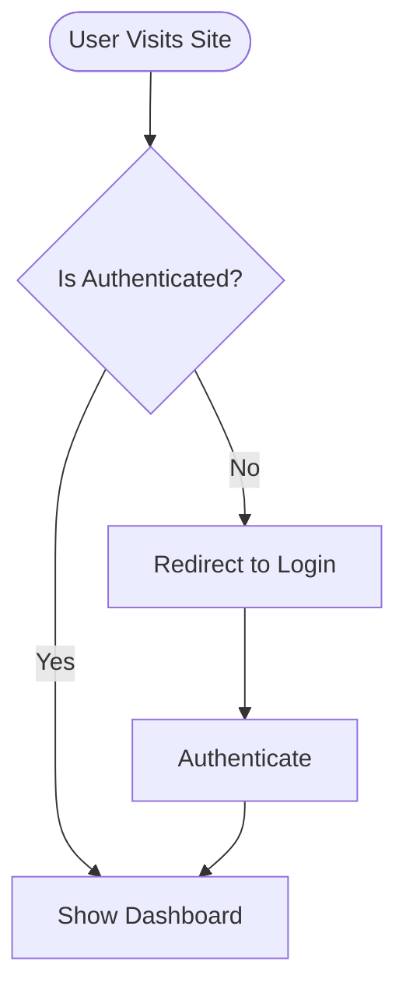
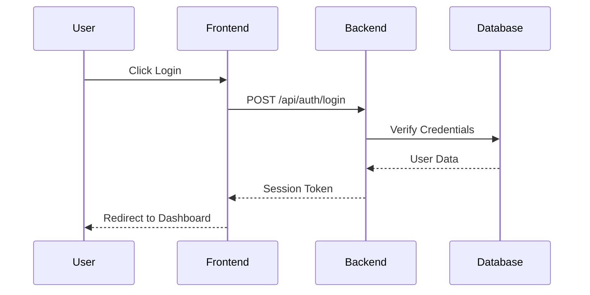
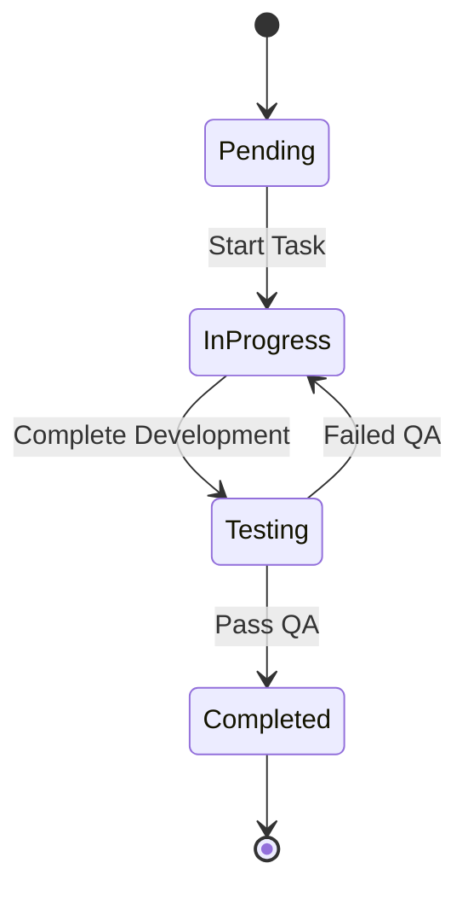

# Use Case Flows & Diagrams

Welcome to the **Use Case Flows & Diagrams** section of WytNet Developer Documentation. This section provides visual workflow documentation for all critical platform features using interactive Mermaid diagrams.

## Overview

Use case flows help developers understand:
- **User Journeys**: Step-by-step paths users take through features
- **System Workflows**: How different components interact
- **Decision Points**: Conditional logic and branching paths
- **Data Flow**: How information moves through the system
- **Integration Points**: Where external services connect

## Available Use Case Flows

### 1. [Public Pages & Unauthorized Visitor](/en/use-case-flows/public-pages-unauthorized-visitor)
Understand how unauthorized visitors browse public pages, encounter restricted content, and get redirected to login.

### 2. [Unified Header Authentication](/en/use-case-flows/unified-header-authentication)
Complete authentication flows for Registration, Login, Forgot Password, and Session Management with multi-method support.

### 3. [WytPass Authentication System](/en/use-case-flows/wytpass-authentication)
Deep dive into WytPass OAuth implementation covering Email OTP, Google OAuth, and Email/Password authentication methods.

### 4. [Multi-Tenant Architecture](/en/use-case-flows/multi-tenant-architecture)
Learn how User→Organization→Hub isolation works with Row Level Security enforcement and tenant switching.

### 5. [RBAC Role-Based Access Control](/en/use-case-flows/rbac-permissions)
Comprehensive guide to permission checking, role assignment, and protected route access with 64 granular permissions.

### 6. [Super Admin Panel Switching](/en/use-case-flows/admin-panel-switching)
Triple session management workflow for seamless context switching between Engine Admin, Hub Admin, and MyPanel.

### 7. [WytAI Agent Workflow](/en/use-case-flows/wytai-agent-workflow)
AI assistant interaction flow from user query to multi-model processing to streaming responses.

### 8. [Module Installation & Activation](/en/use-case-flows/module-installation)
Complete workflow from Super Admin installation to Hub Admin activation and user feature access.

### 9. [App Subscription Flow](/en/use-case-flows/app-subscription-flow)
End-to-end journey from app browsing to Razorpay payment to MyPanel/OrgPanel activation.

### 10. [Audit Logs System](/en/use-case-flows/audit-logs-system)
Admin action tracking, log creation, filtering, search, and timeline view workflow.

---

## Diagram Types Used

### Flowchart Diagrams
Best for: Decision trees, process flows, conditional logic



### Sequence Diagrams
Best for: Component interactions, API calls, time-based workflows



### State Diagrams
Best for: Status transitions, lifecycle flows



---

## Color Coding Standards

Our diagrams use consistent color coding for clarity:

- **🟢 Green**: Success states, approved actions, valid data
- **🔴 Red**: Error states, rejected actions, invalid data
- **🟡 Yellow**: Warning states, pending actions, validation checks
- **🔵 Blue**: Information states, neutral actions, data flow
- **🟣 Purple**: Admin-only actions, elevated permissions
- **🟠 Orange**: External services, third-party integrations

---

## Best Practices for Reading Diagrams

### 1. Start with the Entry Point
Look for nodes marked with `[*]` or `Start` to identify where the flow begins.

### 2. Follow the Arrows
Arrows show the direction of flow. Solid arrows are primary paths, dashed arrows are alternative or error paths.

### 3. Read Decision Points
Diamond shapes `{}` represent decision points with multiple possible outcomes.

### 4. Identify Actors
Sequence diagrams show different participants (User, Frontend, Backend, Database, External Services).

### 5. Note Loops and Cycles
Some flows contain loops for retry logic or iterative processes.

---

## Creating Your Own Flows

When documenting new features, follow this template:

```markdown
# Feature Name

## Overview
Brief description of the feature and its purpose.

## User Journey
Step-by-step narrative of the user experience.

## System Workflow
Technical flow showing component interactions.

## Flowchart Diagram
\`\`\`mermaid
flowchart TD
    Start --> Step1
    Step1 --> Step2
\`\`\`

## Sequence Diagram
\`\`\`mermaid
sequenceDiagram
    Actor1->>Actor2: Action
\`\`\`

## Key Decision Points
List important conditional logic.

## Error Handling
Document error scenarios and recovery paths.

## Security Considerations
Note authentication, authorization, and validation steps.
```

---

## Mermaid Syntax Quick Reference

### Flowchart Nodes
```
[Circle Node]
(Rounded Node)
{Diamond Decision}
[(Database)]
[[Subroutine]]
```

### Flowchart Arrows
```
--> Solid Arrow
-.-> Dotted Arrow
-.- Thick Arrow
-->|Label| Arrow with text
```

### Sequence Diagram Actions
```
->> Solid arrow message
-->> Dashed arrow response
-x Cross (failed/rejected)
-) Async message
```

---

## Additional Resources

- [Mermaid Official Documentation](https://mermaid.js.org/)
- [VitePress Mermaid Plugin Guide](/en/implementation/vitepress-guide#mermaid-diagrams)
- [WytNet Architecture Overview](/en/architecture/)
- [API Reference](/en/api/)

---

## Contributing

To add or update use case flows:

1. Create markdown file in `docs/en/use-case-flows/`
2. Add Mermaid diagrams using triple backtick code blocks
3. Update sidebar navigation in `docs/.vitepress/config.ts`
4. Build and preview: `npm run docs:dev`
5. Create Tamil translation in `docs/ta/use-case-flows/`

---

**Next:** Explore individual use case flows to understand WytNet platform workflows in depth.
