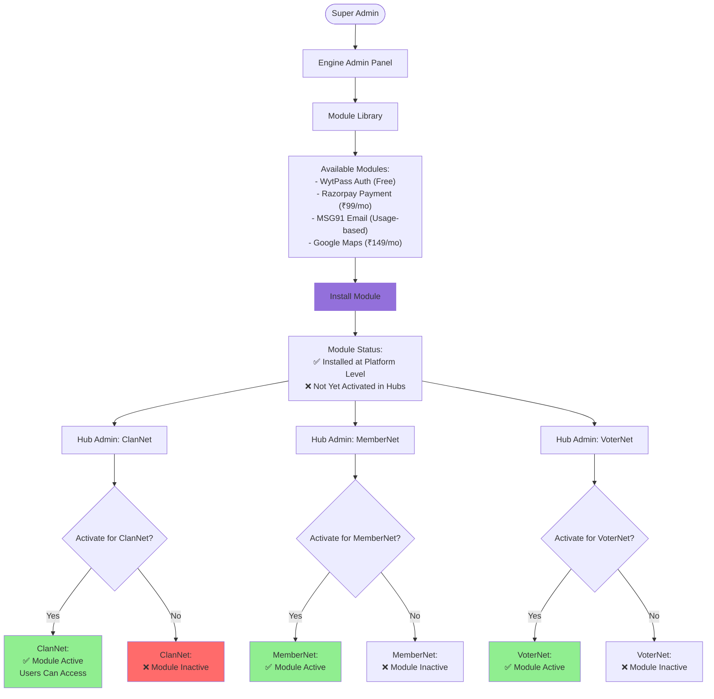
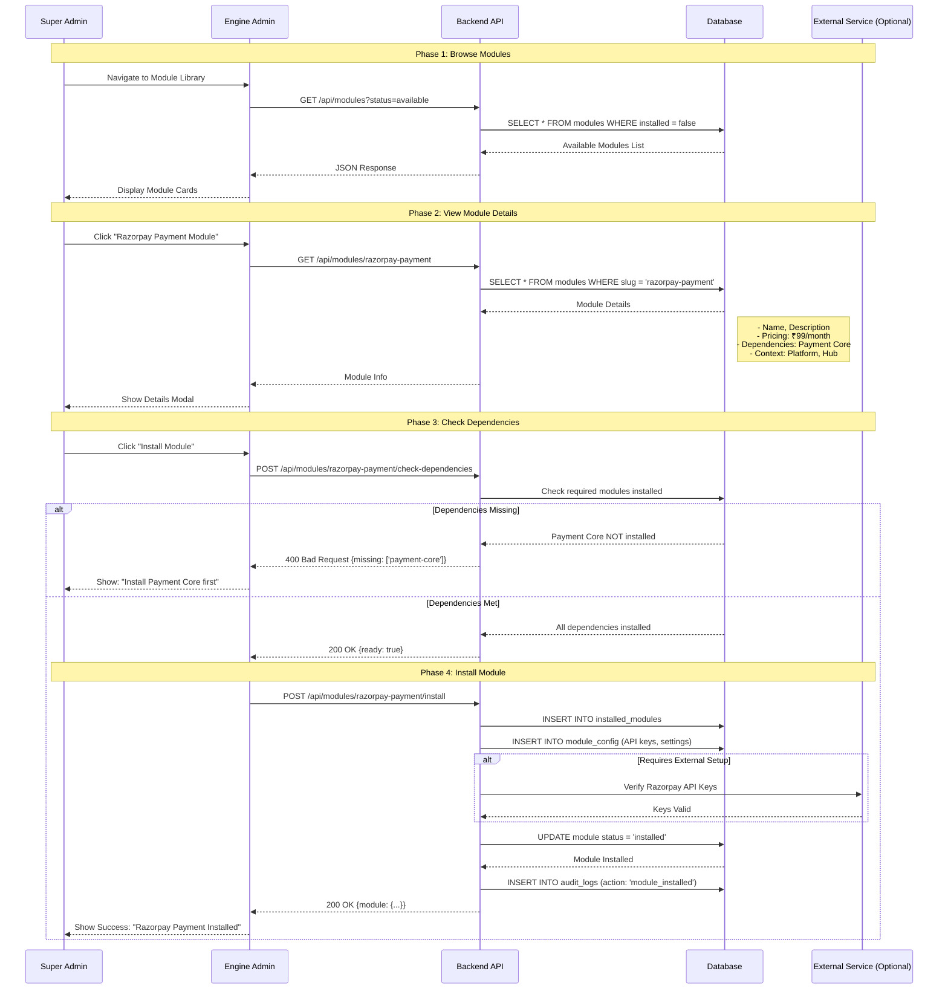
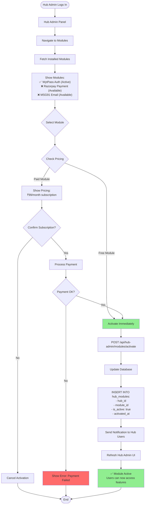
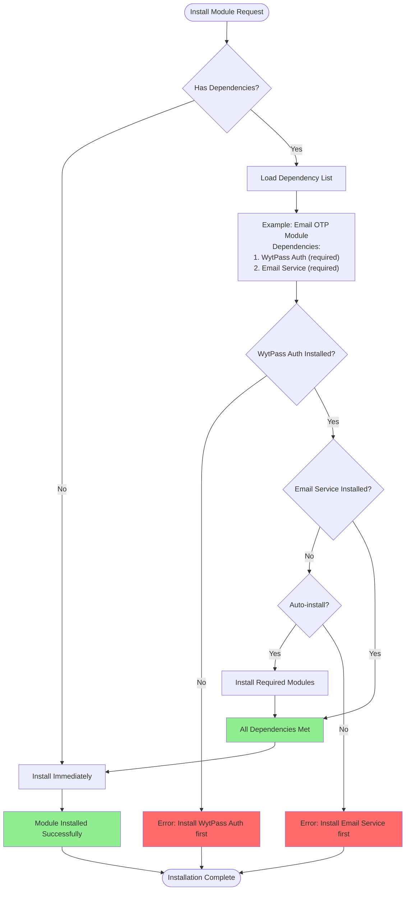
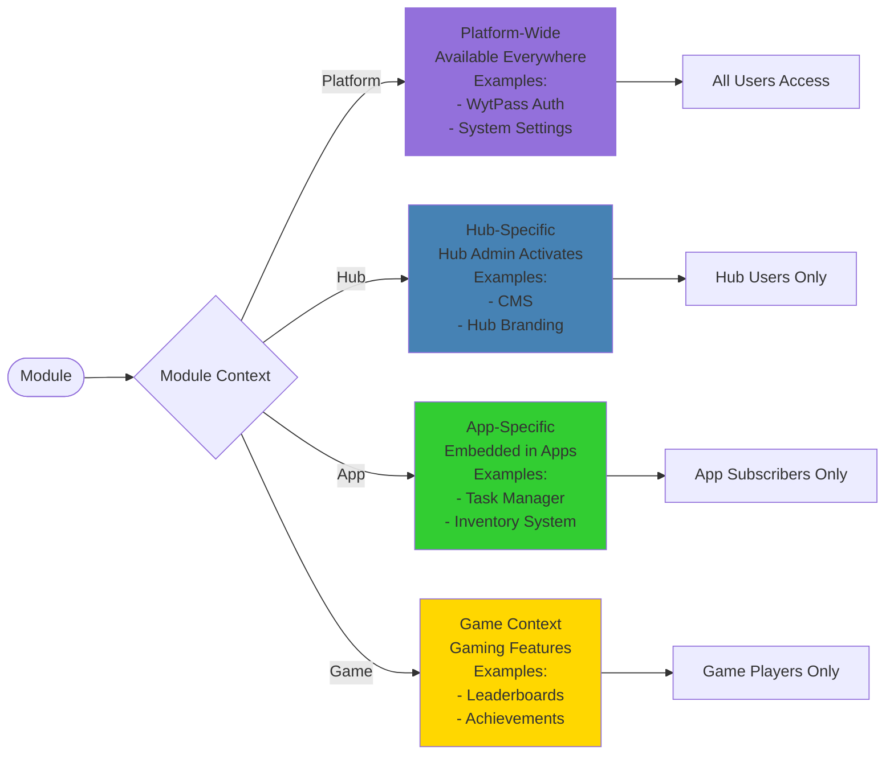

# Module Installation & Activation Flow

:::warning PRODUCTION QUALITY REQUIREMENTS
Module operations MUST include:
- ✅ **Dependency Validation** - Check all required modules before installation
- 🔒 **Permission Verification** - Only Super Admins can install, Hub Admins can activate
- 📊 **Version Control** - Track module versions and prevent downgrades
- ⚠️ **Rollback Support** - Enable safe rollback if activation fails
- 🎯 **Hub Isolation** - Module activation isolated per hub

See [Production Standards](/en/production-standards/) for complete requirements.
:::

## Overview

WytNet's **Module System** provides extensible platform features through a two-tier activation process: Super Admin installs modules at the platform level, then Hub Admins activate them for their specific hubs with context-based access control.

**Module Lifecycle:**
1. Super Admin installs module in Engine (platform-wide availability)
2. Hub Admin activates module for their hub (hub-level enablement)
3. Users access module features based on hub activation
4. Module updates and version management

**Key Features:**
- Context-based modules (Platform, Hub, App, Game)
- Dependency management (modules can require other modules)
- Version control and update tracking
- Hub-level activation control
- Usage-based and subscription pricing models

---

## Module Installation Hierarchy

### Two-Tier Activation System



---

## Complete Installation Flow

### Super Admin Installation Process



---

## Hub Activation Flow

### Hub Admin Activation Process



---

## Module Dependency Management

### Dependency Resolution



---

## Module Context System

### Context-Based Availability



---

## Database Schema

### Module Tables

```sql
-- Modules (Platform Module Library)
CREATE TABLE modules (
  id SERIAL PRIMARY KEY,
  slug VARCHAR(100) UNIQUE NOT NULL,
  name VARCHAR(255) NOT NULL,
  description TEXT,
  category VARCHAR(100),
  context VARCHAR(50),  -- 'platform', 'hub', 'app', 'game'
  pricing_model VARCHAR(50),  -- 'free', 'subscription', 'usage_based'
  price_monthly DECIMAL(10,2),
  dependencies TEXT[],  -- Array of required module slugs
  is_active BOOLEAN DEFAULT true,
  created_at TIMESTAMP DEFAULT NOW()
);

-- Installed Modules (Platform-Level Installation)
CREATE TABLE installed_modules (
  id SERIAL PRIMARY KEY,
  module_id INTEGER NOT NULL REFERENCES modules(id),
  installed_by INTEGER NOT NULL REFERENCES users(id),
  config JSONB,  -- Module-specific configuration
  installed_at TIMESTAMP DEFAULT NOW(),
  UNIQUE(module_id)
);

-- Hub Modules (Hub-Level Activation)
CREATE TABLE hub_modules (
  id SERIAL PRIMARY KEY,
  hub_id INTEGER NOT NULL REFERENCES hubs(id),
  module_id INTEGER NOT NULL REFERENCES modules(id),
  is_active BOOLEAN DEFAULT true,
  activated_by INTEGER NOT NULL REFERENCES users(id),
  activated_at TIMESTAMP DEFAULT NOW(),
  config JSONB,  -- Hub-specific module config
  UNIQUE(hub_id, module_id)
);
CREATE INDEX idx_hub_modules_hub ON hub_modules(hub_id);
CREATE INDEX idx_hub_modules_active ON hub_modules(hub_id, is_active);

-- Module Subscriptions (Payment Tracking)
CREATE TABLE module_subscriptions (
  id SERIAL PRIMARY KEY,
  hub_id INTEGER NOT NULL REFERENCES hubs(id),
  module_id INTEGER NOT NULL REFERENCES modules(id),
  status VARCHAR(50) DEFAULT 'active',  -- 'active', 'cancelled', 'expired'
  amount DECIMAL(10,2) NOT NULL,
  billing_cycle VARCHAR(20),  -- 'monthly', 'yearly'
  next_billing_date DATE,
  created_at TIMESTAMP DEFAULT NOW()
);
```

---

## API Endpoints

### Module Management Routes

```typescript
// Super Admin - Module Installation
GET /api/modules
Response: List of all available modules

GET /api/modules/:slug
Response: Detailed module information

POST /api/modules/:slug/install
Body: { config: {...} }
Response: Installed module data

DELETE /api/modules/:slug/uninstall
Response: { message: "Module uninstalled" }

GET /api/modules/:slug/dependencies
Response: { dependencies: [...], allInstalled: boolean }

// Hub Admin - Module Activation
GET /api/hub-admin/modules
Response: Installed modules available for activation

POST /api/hub-admin/modules/:slug/activate
Body: { hubId: number, config?: {...} }
Response: Activated module data

POST /api/hub-admin/modules/:slug/deactivate
Body: { hubId: number }
Response: { message: "Module deactivated" }

GET /api/hub-admin/modules/active
Response: Currently active modules for hub

// User - Module Access Check
GET /api/modules/check-access/:slug
Response: { hasAccess: boolean, reason?: string }
```

---

## Module Pricing Models

### Pricing Types

| Pricing Model | Description | Example |
|---------------|-------------|---------|
| **Free** | No cost, always available | WytPass Auth, Content Upload |
| **Monthly Subscription** | Fixed monthly fee per hub | Razorpay Payment (₹99/mo) |
| **Usage-Based** | Pay per transaction/API call | MSG91 SMS (₹0.10/SMS) |
| **One-Time** | Single payment for lifetime access | Custom Theme Builder (₹2,999) |
| **Tiered** | Different pricing tiers by usage | Email Service (Free 1K/mo, ₹199 for 10K) |

---

## Frontend Implementation

### Module Installation UI

```typescript
// components/ModuleLibrary.tsx
function ModuleLibrary() {
  const { data: modules } = useQuery({
    queryKey: ['/api/modules'],
  });
  
  const installMutation = useMutation({
    mutationFn: async (slug: string) => {
      return apiRequest(`/api/modules/${slug}/install`, {
        method: 'POST'
      });
    },
    onSuccess: () => {
      toast.success('Module installed successfully');
      queryClient.invalidateQueries({ queryKey: ['/api/modules'] });
    }
  });
  
  async function handleInstall(module: Module) {
    // Check dependencies
    const depsRes = await fetch(`/api/modules/${module.slug}/dependencies`);
    const { dependencies, allInstalled } = await depsRes.json();
    
    if (!allInstalled) {
      toast.error(`Please install dependencies first: ${dependencies.join(', ')}`);
      return;
    }
    
    // Confirm installation
    const confirmed = await confirm({
      title: 'Install Module',
      description: `Install ${module.name}? ${module.pricingModel === 'subscription' ? `This will cost ₹${module.priceMonthly}/month` : ''}`
    });
    
    if (confirmed) {
      installMutation.mutate(module.slug);
    }
  }
  
  return (
    <div className="grid grid-cols-3 gap-4">
      {modules?.map(module => (
        <ModuleCard
          key={module.id}
          module={module}
          onInstall={() => handleInstall(module)}
        />
      ))}
    </div>
  );
}
```

---

## Security Considerations

### 1. Installation Authorization
```typescript
// Only Super Admins can install modules
app.post('/api/modules/:slug/install', 
  requirePermission('modules:install'),
  async (req, res) => {
    if (!req.session.user.isSuperAdmin) {
      return res.status(403).json({ error: 'Super Admin access required' });
    }
    // Install module
  }
);
```

### 2. Hub Activation Authorization
```typescript
// Only Hub Admins can activate modules for their hub
app.post('/api/hub-admin/modules/:slug/activate',
  requirePermission('modules:activate'),
  async (req, res) => {
    const hasHubAccess = await checkHubAdminRole(req.session.userId, req.body.hubId);
    if (!hasHubAccess) {
      return res.status(403).json({ error: 'Not authorized for this hub' });
    }
    // Activate module
  }
);
```

### 3. Module Isolation
- Hub A's activated modules invisible to Hub B
- Module data scoped by `hub_id`
- Row Level Security (RLS) enforcement

---

## Common Use Cases

### Use Case 1: Install Payment Module

1. Super Admin installs "Razorpay Payment" module
2. Module requires "Payment Core" dependency (auto-installed)
3. ClanNet Hub Admin activates Razorpay for their hub
4. ClanNet users can now process payments
5. MemberNet does NOT have access (not activated)

### Use Case 2: Free Module Auto-Activation

1. Super Admin installs free "Content Upload" module
2. No payment required
3. All hubs automatically get access (optional)
4. Hub Admins can deactivate if not needed

---

## Performance Optimization

### 1. Module Caching
```typescript
// Cache active modules per hub
const activeModules = await redis.get(`hub:${hubId}:modules`);
if (!activeModules) {
  const modules = await db.query('SELECT * FROM hub_modules WHERE hub_id = ? AND is_active = true', [hubId]);
  await redis.set(`hub:${hubId}:modules`, JSON.stringify(modules), 'EX', 3600);
}
```

### 2. Lazy Loading
- Load module features only when accessed
- Code-split module bundles
- On-demand initialization

---

## Related Flows

- [RBAC Role-Based Access Control](/en/use-case-flows/rbac-permissions) - Permission checks
- [Multi-Tenant Architecture](/en/use-case-flows/multi-tenant-architecture) - Hub isolation
- [Super Admin Panel Switching](/en/use-case-flows/admin-panel-switching) - Admin contexts
- [App Subscription Flow](/en/use-case-flows/app-subscription-flow) - App activation

---

**Next:** Explore [App Subscription Flow](/en/use-case-flows/app-subscription-flow) for user app activation.
