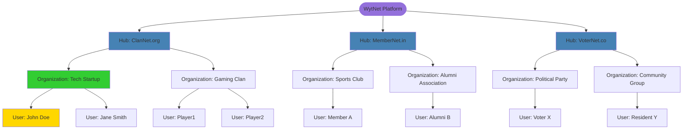
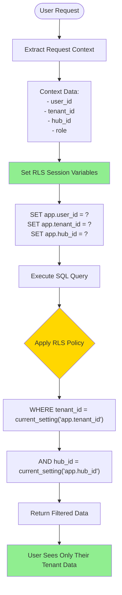
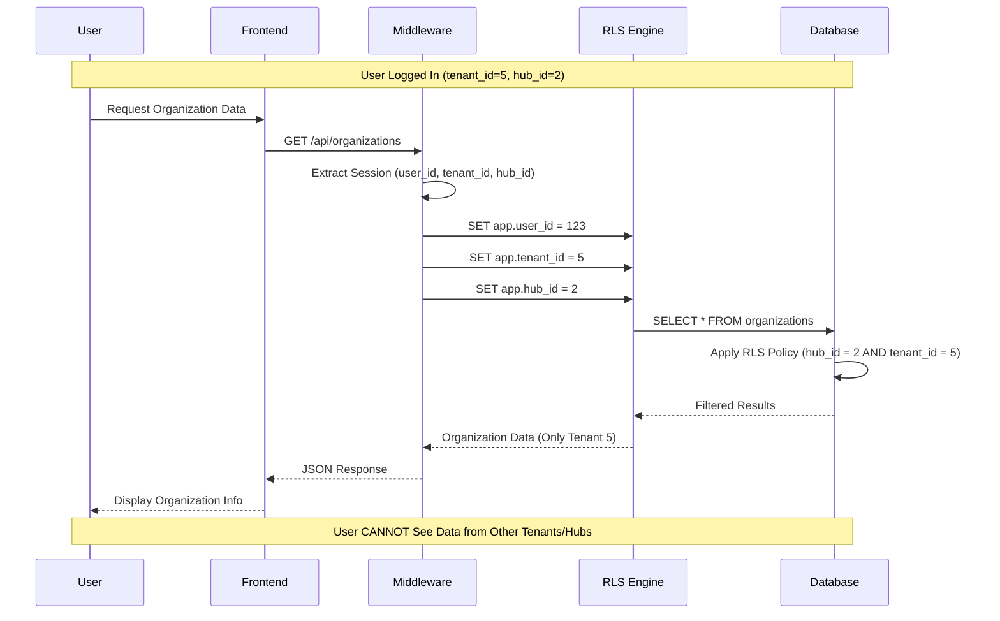
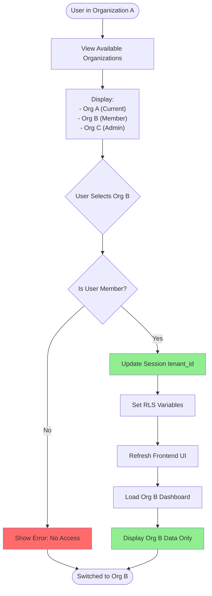
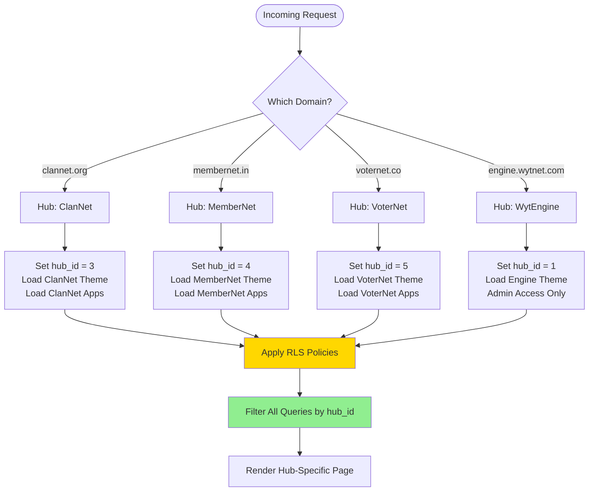
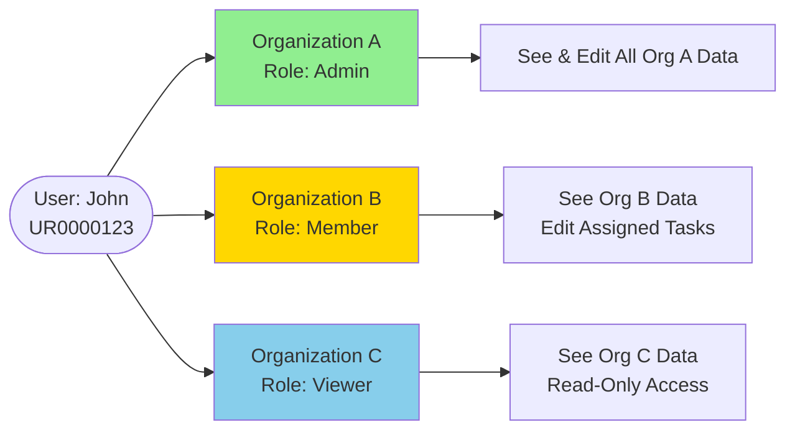

# Multi-Tenant Architecture Flow

## Overview

WytNet's **Multi-Tenant Architecture** provides complete data isolation between users, organizations, and hubs using PostgreSQL Row Level Security (RLS), tenant-based data partitioning, and context-aware access control.

**Hierarchy:**
```
Platform (WytNet)
  └── Hub (ClanNet, MemberNet, VoterNet)
      └── Organization (Company, Community, Agency)
          └── User (Individual Member)
```

**Key Features:**
- Complete data isolation per tenant
- Row Level Security (RLS) enforcement
- Automatic tenant_id injection
- Context-based access control
- Seamless tenant switching
- Hub-level branding and configuration

:::warning PRODUCTION QUALITY REQUIREMENTS
Every tenant-aware operation MUST include:
- ✅ **Tenant Isolation** - ALL queries filter by tenant_id
- 🔒 **Row Level Security (RLS)** - PostgreSQL policies enforce data boundaries
- 📊 **Cross-Tenant Prevention** - Verify no data leakage between tenants
- ⚠️ **Audit Logging** - Track all cross-tenant access attempts
- 🎯 **Database Indexes** - Index all tenant_id columns for performance

See [Production Standards](/en/production-standards/) for complete requirements.
:::

---

## Multi-Tenancy Hierarchy

### Complete Tenant Structure



---

## Row Level Security (RLS) Implementation

### Database Security Policies



### PostgreSQL RLS Policies

```sql
-- Enable RLS on organizations table
ALTER TABLE organizations ENABLE ROW LEVEL SECURITY;

-- Policy: Users can only see organizations in their hub
CREATE POLICY organizations_hub_isolation ON organizations
  FOR SELECT
  USING (hub_id = current_setting('app.hub_id')::INTEGER);

-- Policy: Users can only access their organization's data
CREATE POLICY organizations_tenant_isolation ON organizations
  FOR ALL
  USING (
    id = current_setting('app.tenant_id')::INTEGER
    OR
    EXISTS (
      SELECT 1 FROM org_members
      WHERE org_id = organizations.id
      AND user_id = current_setting('app.user_id')::INTEGER
    )
  );

-- Apply to all tenant-aware tables
ALTER TABLE users ENABLE ROW LEVEL SECURITY;
ALTER TABLE projects ENABLE ROW LEVEL SECURITY;
ALTER TABLE tasks ENABLE ROW LEVEL SECURITY;
ALTER TABLE documents ENABLE ROW LEVEL SECURITY;
```

---

## User Access Flow

### Multi-Context Data Access



---

## Tenant Switching Flow

### Organization Context Switching



---

## Hub Isolation

### Multi-Domain Hub Routing



---

## Data Isolation Examples

### Example 1: Organization Data Access

**Scenario:** User in Org A tries to access Org B's data

```typescript
// User Session
{
  user_id: 123,
  tenant_id: 5,  // Organization A
  hub_id: 2      // ClanNet
}

// Malicious Request (Frontend bypassed)
GET /api/organizations/8/projects

// Backend Middleware
app.use((req, res, next) => {
  if (req.session.userId) {
    db.query(`SET app.user_id = ${req.session.userId}`);
    db.query(`SET app.tenant_id = ${req.session.tenantId}`);
    db.query(`SET app.hub_id = ${req.session.hubId}`);
  }
  next();
});

// SQL Query with RLS
SELECT * FROM projects WHERE organization_id = 8;

// RLS Policy Applied
WHERE organization_id = 8
AND organization_id = current_setting('app.tenant_id')::INTEGER;
-- (8 != 5) → Query returns 0 rows

// Result: User sees NOTHING from Org B
```

### Example 2: Hub-Level Isolation

**Scenario:** ClanNet user tries to access MemberNet data

```sql
-- User logged into ClanNet (hub_id = 3)
SET app.hub_id = 3;

-- Query organizations
SELECT * FROM organizations;

-- RLS Policy Enforcement
WHERE hub_id = current_setting('app.hub_id')::INTEGER;
-- Returns only hub_id = 3 (ClanNet) organizations

-- Cross-hub access: IMPOSSIBLE
-- MemberNet data (hub_id = 4) is completely invisible
```

---

## Multi-Tenant Database Schema

### Key Tables with Tenant Columns

```sql
-- Organizations (Tenants)
CREATE TABLE organizations (
  id SERIAL PRIMARY KEY,
  display_id VARCHAR(20) UNIQUE NOT NULL,  -- OR00001
  hub_id INTEGER NOT NULL REFERENCES hubs(id),
  name VARCHAR(255) NOT NULL,
  subdomain VARCHAR(100),
  created_at TIMESTAMP DEFAULT NOW()
);
CREATE INDEX idx_org_hub ON organizations(hub_id);

-- Users (Cross-Tenant)
CREATE TABLE users (
  id SERIAL PRIMARY KEY,
  display_id VARCHAR(20) UNIQUE NOT NULL,  -- UR0000001
  email VARCHAR(255) UNIQUE NOT NULL,
  name VARCHAR(255),
  created_at TIMESTAMP DEFAULT NOW()
);

-- Organization Members (Junction Table)
CREATE TABLE org_members (
  id SERIAL PRIMARY KEY,
  user_id INTEGER NOT NULL REFERENCES users(id),
  org_id INTEGER NOT NULL REFERENCES organizations(id),
  role VARCHAR(50) DEFAULT 'member',
  joined_at TIMESTAMP DEFAULT NOW(),
  UNIQUE(user_id, org_id)
);
CREATE INDEX idx_member_user ON org_members(user_id);
CREATE INDEX idx_member_org ON org_members(org_id);

-- Projects (Tenant-Scoped)
CREATE TABLE projects (
  id SERIAL PRIMARY KEY,
  organization_id INTEGER NOT NULL REFERENCES organizations(id),
  name VARCHAR(255) NOT NULL,
  created_at TIMESTAMP DEFAULT NOW()
);
CREATE INDEX idx_project_org ON projects(organization_id);

-- Tasks (Tenant-Scoped)
CREATE TABLE tasks (
  id SERIAL PRIMARY KEY,
  project_id INTEGER NOT NULL REFERENCES projects(id),
  organization_id INTEGER NOT NULL REFERENCES organizations(id),
  assigned_to INTEGER REFERENCES users(id),
  title VARCHAR(255) NOT NULL,
  created_at TIMESTAMP DEFAULT NOW()
);
CREATE INDEX idx_task_org ON tasks(organization_id);
```

---

## Access Control Matrix

### Permission Levels Across Contexts

| Context | User Type | Can See | Can Edit | Can Delete |
|---------|-----------|---------|----------|------------|
| **Platform** | Super Admin | All hubs, all orgs | All data | All data |
| **Hub** | Hub Admin | Own hub, all orgs | Hub settings, org configs | Hub data only |
| **Organization** | Org Admin | Own org data | Org data | Org data (soft delete) |
| **Organization** | Member | Own org data (limited) | Assigned tasks only | Nothing |
| **User** | Individual | Own data only | Own profile | Own account |

---

## Security Guarantees

### 1. Database-Level Enforcement
- RLS policies enforced at PostgreSQL level
- Cannot be bypassed by application code
- Applies to all queries automatically

### 2. Session-Based Context
```typescript
// Middleware sets context per request
app.use(async (req, res, next) => {
  if (req.session?.userId) {
    await db.query('SET app.user_id = $1', [req.session.userId]);
    await db.query('SET app.tenant_id = $1', [req.session.tenantId]);
    await db.query('SET app.hub_id = $1', [req.session.hubId]);
  }
  next();
});
```

### 3. Automatic Tenant Injection
```typescript
// ORM automatically adds tenant_id
await db.organizations.create({
  name: 'New Org',
  hub_id: req.session.hubId,
  // tenant_id added automatically by RLS
});
```

---

## Common Use Cases

### Use Case 1: User Joins Multiple Organizations



### Use Case 2: Cross-Hub User (Super Admin)

```typescript
// Super Admin can switch between hubs
async function switchHub(userId: number, hubId: number) {
  const session = await getSession(userId);
  
  // Update session hub context
  session.hubId = hubId;
  session.tenantId = null;  // Clear org context
  
  // Set RLS variables
  await db.query('SET app.hub_id = $1', [hubId]);
  
  // Load hub-specific data
  const orgs = await db.organizations.find({ hub_id: hubId });
  return orgs;
}
```

---

## Performance Optimization

### 1. Index Strategy
```sql
-- Composite indexes for tenant queries
CREATE INDEX idx_projects_org_created ON projects(organization_id, created_at DESC);
CREATE INDEX idx_tasks_org_status ON tasks(organization_id, status);
CREATE INDEX idx_members_org_role ON org_members(org_id, role);
```

### 2. Query Optimization
- RLS policies use indexed columns (hub_id, tenant_id)
- Partitioning for large tables by hub_id
- Connection pooling per tenant context

### 3. Caching Strategy
- Cache tenant metadata (org name, settings)
- Cache user membership list
- Invalidate cache on tenant switch

---

## Related Flows

- [RBAC Role-Based Access Control](/en/use-case-flows/rbac-permissions) - Permission enforcement
- [WytPass Authentication System](/en/use-case-flows/wytpass-authentication) - User authentication
- [Super Admin Panel Switching](/en/use-case-flows/admin-panel-switching) - Multi-context switching
- [Module Installation & Activation](/en/use-case-flows/module-installation) - Tenant-scoped modules

---

**Next:** Explore [RBAC Role-Based Access Control](/en/use-case-flows/rbac-permissions) for permission system implementation.
