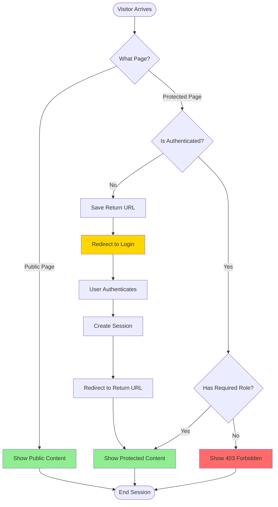
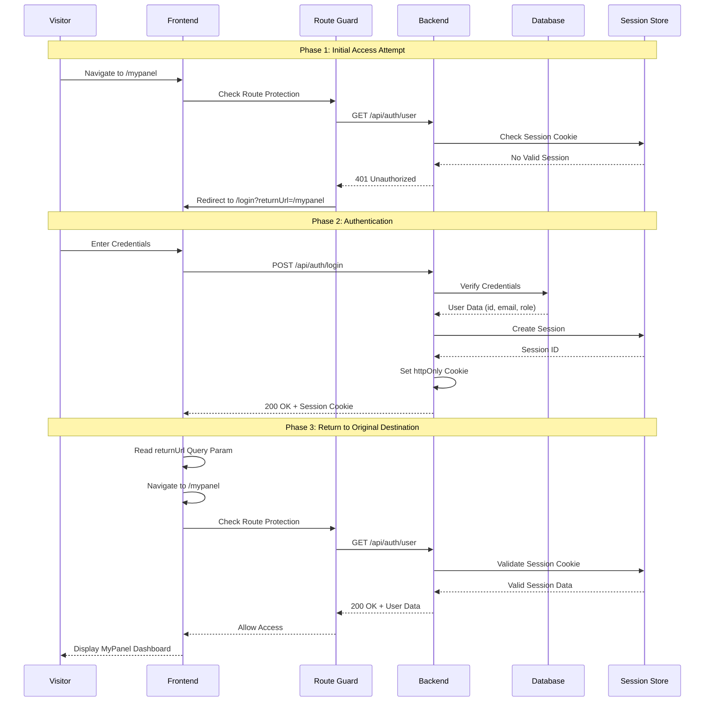
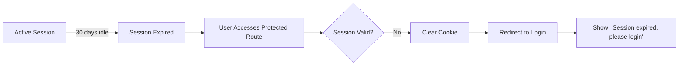

# Public Pages & Unauthorized Visitor Flow

## Overview

This use case documents how **unauthorized visitors** (non-authenticated users) interact with WytNet platform's public pages, encounter restricted content, and get redirected to authentication when trying to access protected resources.

**Key Scenarios:**
- Visitor browses public landing pages
- Visitor encounters protected content (apps, features, admin panels)
- System redirects to login with return URL preservation
- Post-authentication redirect back to intended destination

---

## User Journey

### Scenario 1: Public Browsing (Success Path)

1. **Visitor arrives** at WytNet.com homepage
2. **Browses** public pages: Home, About, Features, Pricing, Contact
3. **Views** marketing content, feature descriptions, pricing tables
4. **No authentication required** - full access to public resources

### Scenario 2: Restricted Access (Login Required)

1. **Visitor clicks** "My Apps" or "Organization Panel" link
2. **System checks** authentication status via session cookie
3. **No valid session found** - user is not authenticated
4. **System redirects** to `/login` with `returnUrl=/mypanel`
5. **Visitor authenticates** using WytPass (Email OTP, Google, or Password)
6. **System redirects back** to originally requested URL (`/mypanel`)
7. **Visitor accesses** protected content successfully

### Scenario 3: Direct URL Access (Protected Route)

1. **Visitor types** `wytnet.com/engine` directly in browser
2. **System intercepts** request via route guard
3. **Checks authentication** - no valid admin session
4. **Redirects to** `/engine-admin-login?returnUrl=/engine`
5. **Admin authenticates** with credentials
6. **System validates** admin role and permissions
7. **Redirects to** Engine Admin panel

---

## System Workflow

### High-Level Flow



---

## Detailed Sequence Diagram

### Unauthorized Visitor → Login → Access Flow



---

## Route Protection Levels

### Public Routes (No Authentication)
```
/ (Homepage)
/about
/features
/pricing
/contact
/apps-marketplace (Browse only)
/devdoc-login
```

### Protected Routes (Authentication Required)
```
/mypanel (Regular User)
/orgpanel (Organization Member)
/hub-admin (Hub Admin)
/engine (Super Admin only)
```

---

## Frontend Route Guard Implementation

### React Router Protection

```typescript
// Route guard checks session before rendering
function ProtectedRoute({ children, requireAdmin = false }) {
  const { user, isLoading } = useAuth();
  const [location] = useLocation();
  
  if (isLoading) {
    return <LoadingSpinner />;
  }
  
  if (!user) {
    // Save current URL for post-login redirect
    const returnUrl = location;
    return <Redirect to={`/login?returnUrl=${returnUrl}`} />;
  }
  
  if (requireAdmin && !user.isAdmin) {
    return <Redirect to="/403" />;
  }
  
  return children;
}
```

### Backend Session Validation

```typescript
// Express middleware checks session
app.get('/api/auth/user', (req, res) => {
  if (!req.session?.userId) {
    return res.status(401).json({ message: 'Not authenticated' });
  }
  
  const user = await db.getUserById(req.session.userId);
  res.json(user);
});
```

---

## Key Decision Points

### 1. Route Type Detection
**Question:** Is this a public or protected route?
- **Public:** Serve content immediately
- **Protected:** Check authentication status

### 2. Session Validation
**Question:** Does user have valid session cookie?
- **Yes:** Proceed to role check
- **No:** Redirect to login with returnUrl

### 3. Role Authorization
**Question:** Does user have required role/permissions?
- **Yes:** Grant access to resource
- **No:** Show 403 Forbidden error

### 4. Return URL Handling
**Question:** Is there a returnUrl query parameter?
- **Yes:** Redirect after successful login
- **No:** Redirect to default dashboard

---

## Error Handling

### Common Error Scenarios

| Scenario | HTTP Code | User Experience |
|----------|-----------|-----------------|
| No session | 401 | Redirect to /login |
| Insufficient permissions | 403 | Show "Access Denied" page |
| Session expired | 401 | Redirect to /login with message |
| Invalid returnUrl | 400 | Redirect to default dashboard |
| Server error | 500 | Show error page with retry |

### Session Expiry Flow



---

## Security Considerations

### 1. Session Cookie Security
```javascript
{
  httpOnly: true,        // Prevent XSS access
  secure: true,          // HTTPS only
  sameSite: 'lax',      // CSRF protection
  maxAge: 30 * 24 * 60 * 60 * 1000  // 30 days
}
```

### 2. Return URL Validation
```typescript
// Prevent open redirect attacks
function validateReturnUrl(url: string): boolean {
  const allowedPaths = ['/mypanel', '/orgpanel', '/hub-admin', '/engine'];
  return allowedPaths.some(path => url.startsWith(path));
}
```

### 3. Role-Based Filtering
- Public pages: No role check
- User pages: Authenticated user only
- Admin pages: Admin role + specific permissions

---

## Performance Optimization

### Session Caching
- Frontend caches user session in React Context
- Reduces repeated `/api/auth/user` calls
- Refreshes on page load and 401 responses

### Route Pre-fetching
- Public routes loaded immediately
- Protected routes code-split and lazy-loaded
- Reduces initial bundle size

---

## Related Flows

- [Unified Header Authentication](/en/use-case-flows/unified-header-authentication) - Login/Register flows
- [WytPass Authentication System](/en/use-case-flows/wytpass-authentication) - OAuth implementation
- [RBAC Role-Based Access Control](/en/use-case-flows/rbac-permissions) - Permission checking
- [Super Admin Panel Switching](/en/use-case-flows/admin-panel-switching) - Admin authentication

---

**Next:** Learn about [Unified Header Authentication](/en/use-case-flows/unified-header-authentication) for detailed login/register workflows.
