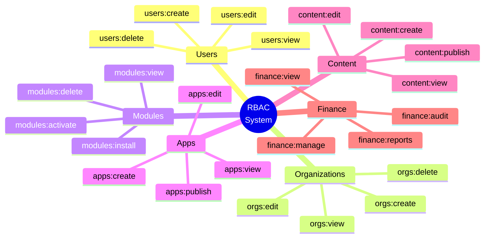
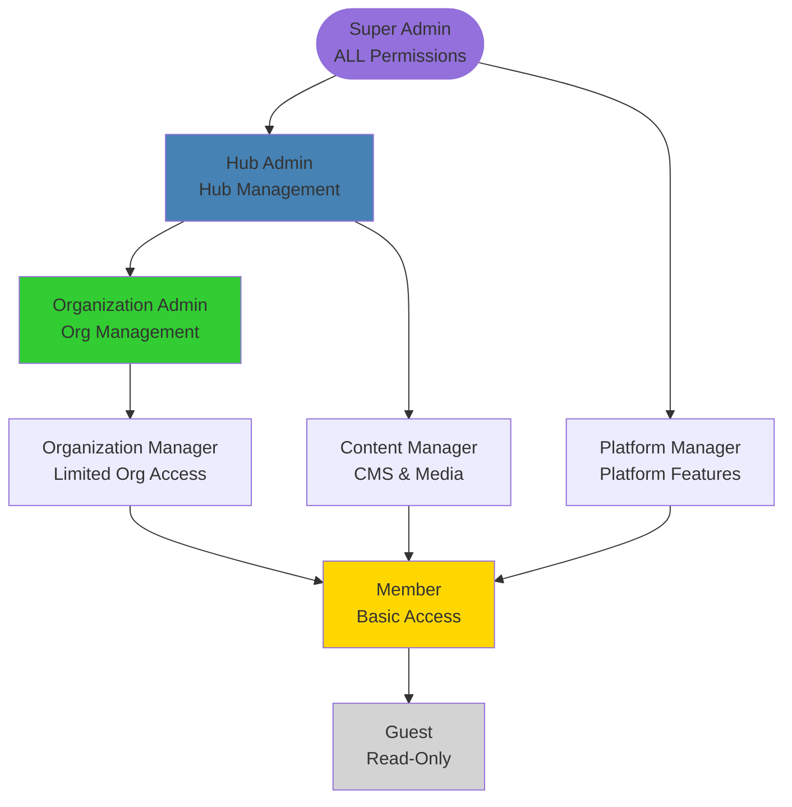
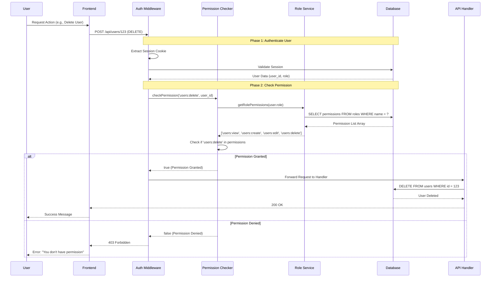
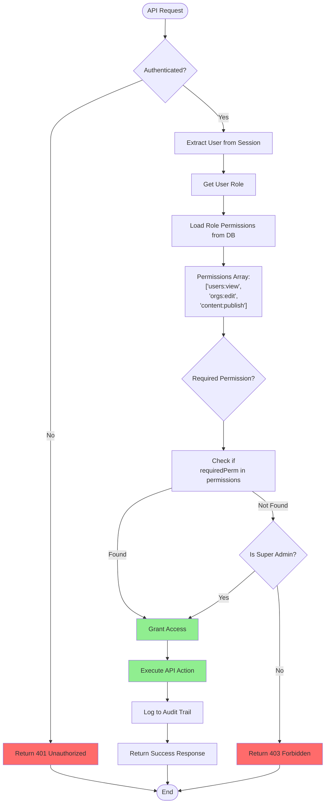
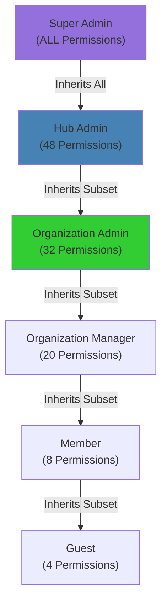

# RBAC Role-Based Access Control

## Overview

WytNet's **Role-Based Access Control (RBAC)** system provides granular permission management with 64 fine-grained permissions across 16 resource categories, 8 default roles, and protected API route enforcement.

**Key Features:**
- 64 granular permissions across 16 resource sections
- 8 predefined roles (Super Admin, Hub Admin, Org Admin, etc.)
- Dynamic permission checking per request
- Role inheritance and hierarchy
- Resource-level access control
- API route protection middleware

:::warning PRODUCTION QUALITY REQUIREMENTS
Every RBAC permission check MUST include:
- ✅ **Permission Validation** - Verify user has required permissions before allowing access
- 🔒 **Database-Driven Logic** - NO hardcoded role checks, read from database
- 📊 **Audit Logging** - Log all permission checks and denials
- ⚠️ **Graceful Denial** - Clear error messages when permission denied
- 🎯 **Performance** - Cache permissions per session, refresh on role changes

See [Production Standards](/en/production-standards/) for complete requirements.
:::

---

## Permission Structure

### 16 Resource Categories



### Complete Permission List (64 Permissions)

| Category | Permissions (4 each) |
|----------|---------------------|
| **Users** | `users:view`, `users:create`, `users:edit`, `users:delete` |
| **Organizations** | `orgs:view`, `orgs:create`, `orgs:edit`, `orgs:delete` |
| **Entities** | `entities:view`, `entities:create`, `entities:edit`, `entities:delete` |
| **Modules** | `modules:view`, `modules:install`, `modules:activate`, `modules:delete` |
| **Apps** | `apps:view`, `apps:create`, `apps:edit`, `apps:publish` |
| **CMS** | `cms:view`, `cms:create`, `cms:edit`, `cms:publish` |
| **Themes** | `themes:view`, `themes:create`, `themes:edit`, `themes:delete` |
| **Plans & Pricing** | `plans:view`, `plans:create`, `plans:edit`, `plans:delete` |
| **Finance** | `finance:view`, `finance:manage`, `finance:reports`, `finance:audit` |
| **Analytics** | `analytics:view`, `analytics:export`, `analytics:custom`, `analytics:admin` |
| **System Settings** | `settings:view`, `settings:edit`, `settings:security`, `settings:integrations` |
| **Audit Logs** | `audit:view`, `audit:export`, `audit:search`, `audit:admin` |
| **Media** | `media:view`, `media:upload`, `media:edit`, `media:delete` |
| **DataSets** | `datasets:view`, `datasets:create`, `datasets:edit`, `datasets:delete` |
| **Support** | `support:view`, `support:create`, `support:edit`, `support:admin` |
| **Integrations** | `integrations:view`, `integrations:create`, `integrations:edit`, `integrations:delete` |

---

## Role Hierarchy

### 8 Default Roles



### Role Permission Matrix

| Role | Total Permissions | Key Capabilities |
|------|-------------------|------------------|
| **Super Admin** | 64/64 (100%) | Full platform control, all hubs, system settings |
| **Hub Admin** | 48/64 (75%) | Hub management, organizations, modules, apps |
| **Organization Admin** | 32/64 (50%) | Organization data, members, content, finance |
| **Platform Manager** | 40/64 (62%) | Platform features, analytics, integrations |
| **Content Manager** | 24/64 (37%) | CMS, media, themes, publishing |
| **Organization Manager** | 20/64 (31%) | Limited org access, members, basic content |
| **Member** | 8/64 (12%) | View data, basic operations, personal settings |
| **Guest** | 4/64 (6%) | Read-only access to public content |

---

## Permission Checking Flow

### Request Authorization Process



---

## Complete Authorization Flowchart



---

## Database Schema

### Roles & Permissions Tables

```sql
-- Roles Table
CREATE TABLE roles (
  id SERIAL PRIMARY KEY,
  name VARCHAR(100) UNIQUE NOT NULL,
  display_name VARCHAR(255) NOT NULL,
  description TEXT,
  permissions TEXT[] NOT NULL,  -- Array of permission strings
  is_system_role BOOLEAN DEFAULT false,
  created_at TIMESTAMP DEFAULT NOW()
);

-- Insert Default Roles
INSERT INTO roles (name, display_name, permissions, is_system_role) VALUES
('super_admin', 'Super Admin', ARRAY[
  'users:view', 'users:create', 'users:edit', 'users:delete',
  'orgs:view', 'orgs:create', 'orgs:edit', 'orgs:delete',
  'modules:view', 'modules:install', 'modules:activate', 'modules:delete',
  'apps:view', 'apps:create', 'apps:edit', 'apps:publish',
  'finance:view', 'finance:manage', 'finance:reports', 'finance:audit',
  'settings:view', 'settings:edit', 'settings:security', 'settings:integrations',
  'audit:view', 'audit:export', 'audit:search', 'audit:admin'
  -- ... all 64 permissions
], true);

INSERT INTO roles (name, display_name, permissions, is_system_role) VALUES
('hub_admin', 'Hub Admin', ARRAY[
  'users:view', 'users:create', 'users:edit',
  'orgs:view', 'orgs:create', 'orgs:edit',
  'modules:view', 'modules:activate',
  'apps:view', 'apps:edit',
  'cms:view', 'cms:create', 'cms:edit', 'cms:publish'
], true);

-- User Roles (Many-to-Many)
CREATE TABLE user_roles (
  id SERIAL PRIMARY KEY,
  user_id INTEGER NOT NULL REFERENCES users(id),
  role_id INTEGER NOT NULL REFERENCES roles(id),
  scope VARCHAR(50),  -- 'platform', 'hub', 'organization'
  scope_id INTEGER,   -- hub_id or org_id
  granted_at TIMESTAMP DEFAULT NOW(),
  UNIQUE(user_id, role_id, scope, scope_id)
);
CREATE INDEX idx_user_roles_user ON user_roles(user_id);
CREATE INDEX idx_user_roles_scope ON user_roles(scope, scope_id);
```

---

## Middleware Implementation

### Express Permission Middleware

```typescript
// middleware/checkPermission.ts
export function requirePermission(permission: string) {
  return async (req: Request, res: Response, next: NextFunction) => {
    try {
      const userId = req.session?.userId;
      
      if (!userId) {
        return res.status(401).json({ error: 'Not authenticated' });
      }
      
      const user = await db.users.findById(userId);
      
      // Super Admin bypasses all checks
      if (user.isSuperAdmin) {
        return next();
      }
      
      // Get user's role permissions
      const rolePerms = await getUserPermissions(userId, req.session.tenantId);
      
      // Check if user has required permission
      const hasPermission = rolePerms.includes(permission);
      
      if (!hasPermission) {
        // Log unauthorized attempt
        await logAuditEvent({
          userId,
          action: 'permission_denied',
          resource: permission,
          details: { path: req.path, method: req.method }
        });
        
        return res.status(403).json({ 
          error: 'Insufficient permissions',
          required: permission
        });
      }
      
      next();
    } catch (error) {
      console.error('Permission check failed:', error);
      res.status(500).json({ error: 'Permission check failed' });
    }
  };
}

// Helper: Get all permissions for user
async function getUserPermissions(
  userId: number, 
  tenantId?: number
): Promise<string[]> {
  const userRoles = await db.query(`
    SELECT r.permissions
    FROM user_roles ur
    JOIN roles r ON ur.role_id = r.id
    WHERE ur.user_id = $1
    AND (ur.scope_id = $2 OR ur.scope = 'platform')
  `, [userId, tenantId]);
  
  // Flatten and deduplicate permissions
  const allPerms = userRoles.flatMap(row => row.permissions);
  return [...new Set(allPerms)];
}
```

---

## Protected Route Examples

### API Route Protection

```typescript
// routes/users.ts
import { requirePermission } from '../middleware/checkPermission';

// View users list
app.get('/api/users', 
  requirePermission('users:view'),
  async (req, res) => {
    const users = await db.users.findAll();
    res.json(users);
  }
);

// Create new user
app.post('/api/users',
  requirePermission('users:create'),
  async (req, res) => {
    const newUser = await db.users.create(req.body);
    res.json(newUser);
  }
);

// Edit user
app.patch('/api/users/:id',
  requirePermission('users:edit'),
  async (req, res) => {
    const updated = await db.users.update(req.params.id, req.body);
    res.json(updated);
  }
);

// Delete user
app.delete('/api/users/:id',
  requirePermission('users:delete'),
  async (req, res) => {
    await db.users.delete(req.params.id);
    res.json({ message: 'User deleted' });
  }
);
```

---

## Frontend Permission Checks

### React Permission Hook

```typescript
// hooks/usePermission.ts
export function usePermission(permission: string): boolean {
  const { user } = useAuth();
  
  if (!user) return false;
  if (user.isSuperAdmin) return true;
  
  return user.permissions?.includes(permission) || false;
}

// Usage in components
function UserManagementPage() {
  const canView = usePermission('users:view');
  const canCreate = usePermission('users:create');
  const canDelete = usePermission('users:delete');
  
  if (!canView) {
    return <AccessDenied />;
  }
  
  return (
    <div>
      <UserList />
      
      {canCreate && (
        <Button onClick={openCreateModal}>
          Create User
        </Button>
      )}
      
      {canDelete && (
        <DeleteButton />
      )}
    </div>
  );
}
```

---

## Permission Inheritance

### Role Hierarchy Chain



**Inheritance Rules:**
- Lower roles inherit permissions from higher roles
- Additional permissions can be granted per role
- Permissions cannot be revoked from higher roles
- Super Admin always has all permissions

---

## Dynamic Permission Assignment

### Granting Permissions to Users

```typescript
// Grant role to user (Hub context)
async function assignRole(
  userId: number,
  roleName: string,
  scope: 'platform' | 'hub' | 'organization',
  scopeId?: number
) {
  const role = await db.roles.findByName(roleName);
  
  await db.userRoles.create({
    user_id: userId,
    role_id: role.id,
    scope: scope,
    scope_id: scopeId
  });
  
  // Log audit event
  await logAuditEvent({
    userId: req.session.userId,
    action: 'role_assigned',
    resource: 'user_roles',
    details: { targetUserId: userId, roleName, scope, scopeId }
  });
}

// Example: Make user Hub Admin for ClanNet
await assignRole(123, 'hub_admin', 'hub', 3);
```

---

## Security Considerations

### 1. Permission Bypass Prevention
```typescript
// NEVER trust frontend permission checks
// Always validate on backend

// ❌ WRONG - Frontend only
if (userHasPermission('users:delete')) {
  await deleteUser(id);  // API call not protected
}

// ✅ CORRECT - Backend enforced
app.delete('/api/users/:id',
  requirePermission('users:delete'),  // Middleware enforces
  async (req, res) => {
    await db.users.delete(req.params.id);
  }
);
```

### 2. Super Admin Protection
```typescript
// Prevent role changes to Super Admins
if (targetUser.isSuperAdmin && !currentUser.isSuperAdmin) {
  throw new Error('Cannot modify Super Admin roles');
}
```

### 3. Audit Logging
```typescript
// Log all permission checks and denials
await logAuditEvent({
  userId,
  action: hasPermission ? 'permission_granted' : 'permission_denied',
  resource: permission,
  timestamp: new Date()
});
```

---

## Common Use Cases

### Use Case 1: Content Manager Role

**Scenario:** User can publish blog posts but cannot delete users

```typescript
const contentManager = {
  permissions: [
    'cms:view',
    'cms:create',
    'cms:edit',
    'cms:publish',
    'media:view',
    'media:upload'
  ]
};

// ✅ Can publish content
await checkPermission('cms:publish', userId);  // true

// ❌ Cannot delete users
await checkPermission('users:delete', userId);  // false
```

### Use Case 2: Multi-Role User

**Scenario:** User is Org Admin in Org A and Member in Org B

```sql
-- User Roles
SELECT * FROM user_roles WHERE user_id = 123;

-- Results:
-- role: 'org_admin', scope: 'organization', scope_id: 5 (Org A)
-- role: 'member', scope: 'organization', scope_id: 8 (Org B)

-- In Org A: Full admin permissions
-- In Org B: Limited member permissions
```

---

## Performance Optimization

### 1. Permission Caching
```typescript
// Cache user permissions in session
req.session.permissions = await getUserPermissions(userId);

// Avoid repeated DB queries
function hasPermission(permission: string): boolean {
  return req.session.permissions.includes(permission);
}
```

### 2. Batch Permission Checks
```typescript
// Check multiple permissions at once
const requiredPerms = ['users:view', 'users:edit', 'users:delete'];
const hasAll = requiredPerms.every(p => userPerms.includes(p));
```

---

## Related Flows

- [Multi-Tenant Architecture](/en/use-case-flows/multi-tenant-architecture) - Tenant isolation
- [Super Admin Panel Switching](/en/use-case-flows/admin-panel-switching) - Role context switching
- [Audit Logs System](/en/use-case-flows/audit-logs-system) - Permission tracking
- [WytPass Authentication System](/en/use-case-flows/wytpass-authentication) - User authentication

---

**Next:** Explore [Super Admin Panel Switching](/en/use-case-flows/admin-panel-switching) for multi-context role management.
