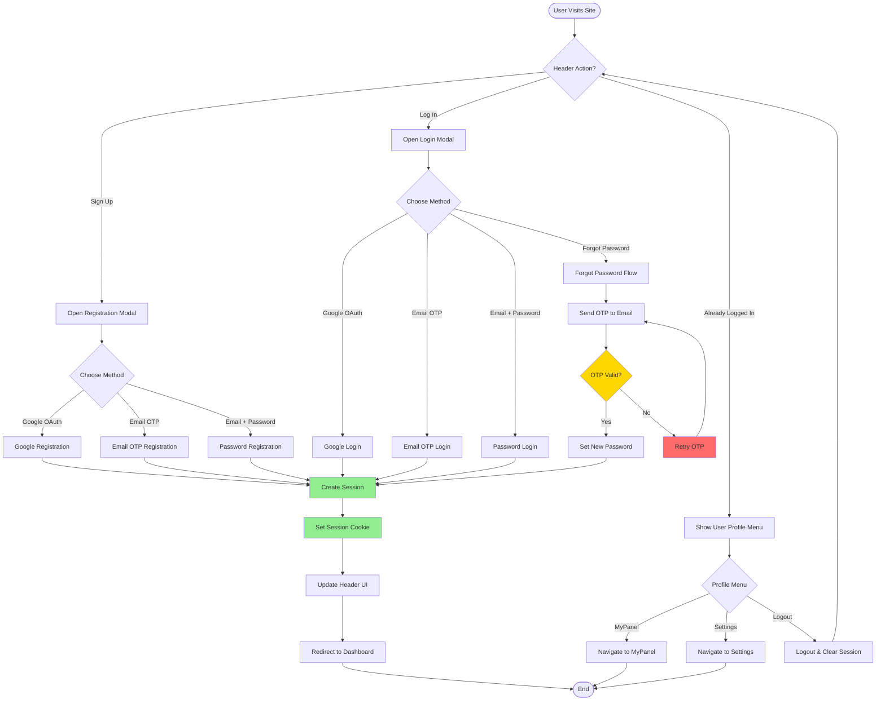
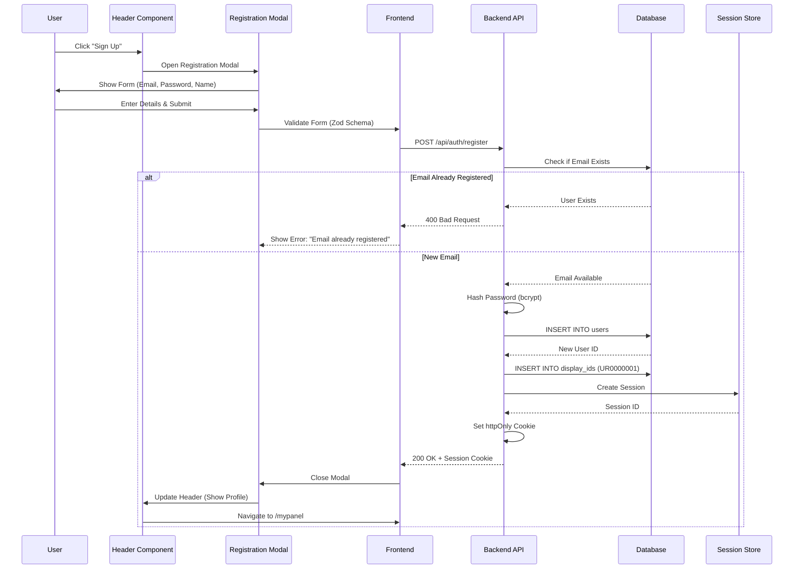
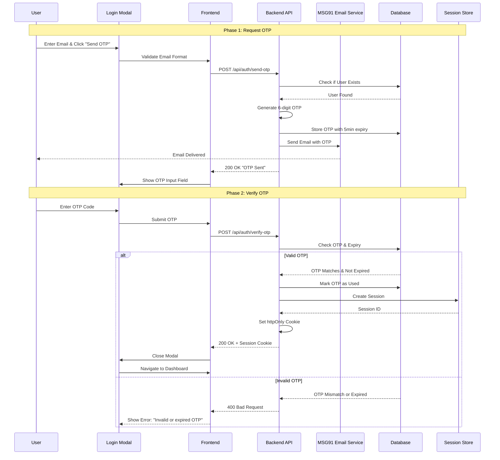
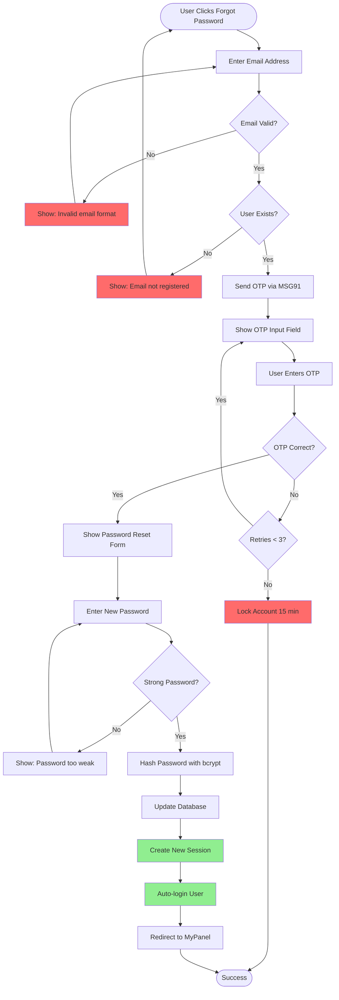
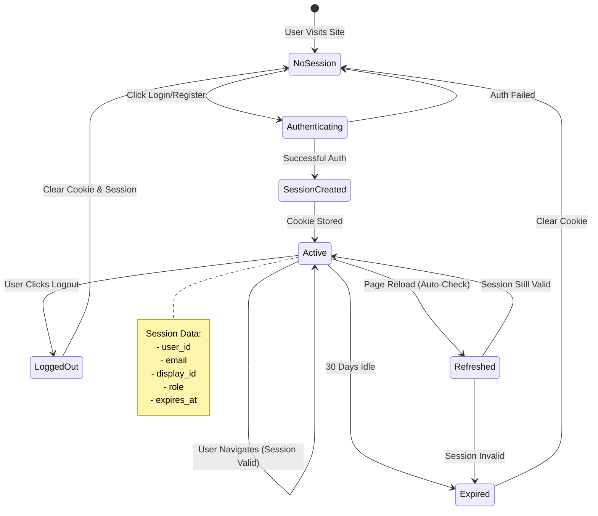
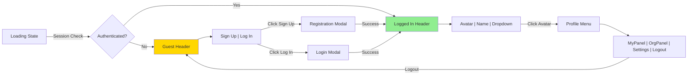

# Unified Header Authentication Flow

## Overview

The **Unified Header** in WytNet provides a consistent authentication experience across all platform pages. It includes user registration, login, forgot password, and session management with support for multiple authentication methods.

**Authentication Methods:**
- **Email OTP** (One-Time Password via MSG91)
- **Google OAuth** (Social login)
- **Email + Password** (Traditional credentials)

**Key Features:**
- Persistent header across all pages
- Real-time authentication status
- Smooth modal-based auth flows
- Return URL preservation
- Session persistence (30 days)

---

## User Journey

### Scenario 1: New User Registration

1. **User visits** WytNet.com homepage
2. **Clicks** "Sign Up" button in header
3. **Registration modal opens** with three options:
   - Continue with Google
   - Continue with Email OTP
   - Sign up with Email + Password
4. **User selects method** and completes registration
5. **Account created** → Session established
6. **Modal closes** → User redirected to MyPanel dashboard
7. **Header updates** to show user profile

### Scenario 2: Existing User Login

1. **User clicks** "Log In" button in header
2. **Login modal opens** with authentication options
3. **User enters credentials** (email + password or OTP)
4. **System validates** credentials
5. **Session created** with httpOnly cookie
6. **Modal closes** → User stays on current page or redirected
7. **Header shows** user name + avatar

### Scenario 3: Forgot Password Recovery

1. **User clicks** "Forgot Password?" link in login modal
2. **Forgot Password modal opens**
3. **User enters** registered email address
4. **System sends** OTP to email via MSG91
5. **User enters** OTP code
6. **OTP verified** → Password reset form shown
7. **User sets** new password
8. **Password updated** → Auto-login with new session
9. **Modal closes** → User redirected to dashboard

### Scenario 4: Session Persistence

1. **User logs in** successfully
2. **Session cookie set** with 30-day expiry
3. **User closes browser** and returns next day
4. **Frontend checks** session on page load
5. **Valid session found** → Auto-authenticate
6. **Header shows** logged-in state immediately
7. **No re-login required** for 30 days

---

## Complete Authentication Flow

### High-Level Flowchart



---

## Registration Flow - Detailed Sequence

### Email + Password Registration



---

## Login Flow - Detailed Sequence

### Email OTP Login



---

## Forgot Password Flow

### Password Reset with Email OTP



---

## Session Management

### Session Lifecycle



---

## Header Component States

### UI State Transitions



---

## Authentication Methods Comparison

| Method | Speed | Security | UX | Use Case |
|--------|-------|----------|-------|----------|
| **Email OTP** | ⚡⚡⚡ Fast | 🔒🔒🔒 High | ⭐⭐⭐⭐⭐ Excellent | Passwordless login |
| **Google OAuth** | ⚡⚡⚡⚡ Fastest | 🔒🔒🔒🔒 Very High | ⭐⭐⭐⭐⭐ Excellent | Quick registration |
| **Email + Password** | ⚡⚡ Moderate | 🔒🔒🔒 High | ⭐⭐⭐ Good | Traditional users |

---

## Key Decision Points

### 1. Authentication Method Selection
**User Choice:**
- Google OAuth → Fast social login
- Email OTP → No password to remember
- Email + Password → Full control

### 2. Session Duration
**Server Decision:**
- Standard: 30 days
- "Remember Me": 90 days
- Admin: 7 days (shorter for security)

### 3. OTP Expiry
**System Rule:**
- OTP valid for 5 minutes
- Max 3 retry attempts
- Lock account for 15 minutes after failed attempts

### 4. Password Strength
**Validation Rules:**
- Minimum 8 characters
- At least 1 uppercase letter
- At least 1 number
- At least 1 special character

---

## Error Handling

### Common Error Scenarios

| Error | Cause | User Message | Recovery |
|-------|-------|--------------|----------|
| Email exists | Duplicate registration | "Email already registered. Try logging in." | Redirect to login |
| Invalid OTP | Wrong code | "Invalid OTP. Please try again." | Allow retry (3 max) |
| OTP expired | >5 minutes | "OTP expired. Request a new one." | Resend OTP |
| Weak password | Security validation | "Password must be at least 8 characters..." | Show requirements |
| Account locked | Too many attempts | "Too many failed attempts. Try again in 15 min." | Wait or contact support |
| Session expired | >30 days idle | "Your session expired. Please log in again." | Redirect to login |

---

## Security Considerations

### 1. Password Security
```typescript
// Hashing with bcrypt (salt rounds: 10)
const hashedPassword = await bcrypt.hash(password, 10);

// Verification
const isValid = await bcrypt.compare(inputPassword, hashedPassword);
```

### 2. Session Cookie Settings
```javascript
{
  httpOnly: true,        // Cannot be accessed by JavaScript
  secure: true,          // HTTPS only in production
  sameSite: 'lax',      // CSRF protection
  maxAge: 30 * 24 * 60 * 60 * 1000  // 30 days
}
```

### 3. OTP Security
- Random 6-digit code
- 5-minute expiry
- One-time use only
- Rate limiting: Max 3 requests per hour per email

### 4. CSRF Protection
- SameSite cookie attribute
- Origin header validation
- Session token validation

---

## Frontend Implementation

### Header Component Logic

```typescript
function UnifiedHeader() {
  const { user, isLoading } = useAuth();
  const [showLoginModal, setShowLoginModal] = useState(false);
  const [showRegisterModal, setShowRegisterModal] = useState(false);
  
  if (isLoading) {
    return <HeaderSkeleton />;
  }
  
  return (
    <header>
      <Logo />
      <Navigation />
      
      {!user ? (
        <div className="auth-buttons">
          <Button onClick={() => setShowRegisterModal(true)}>
            Sign Up
          </Button>
          <Button onClick={() => setShowLoginModal(true)}>
            Log In
          </Button>
        </div>
      ) : (
        <UserProfileDropdown user={user} />
      )}
      
      <LoginModal 
        open={showLoginModal} 
        onClose={() => setShowLoginModal(false)} 
      />
      <RegisterModal 
        open={showRegisterModal} 
        onClose={() => setShowRegisterModal(false)} 
      />
    </header>
  );
}
```

---

## Backend API Endpoints

### Authentication Routes

```typescript
// Registration
POST /api/auth/register
Body: { email, password, name, method: 'password' | 'google' | 'otp' }

// Login
POST /api/auth/login
Body: { email, password }

// Send OTP
POST /api/auth/send-otp
Body: { email }

// Verify OTP
POST /api/auth/verify-otp
Body: { email, otp }

// Forgot Password
POST /api/auth/forgot-password
Body: { email }

// Reset Password
POST /api/auth/reset-password
Body: { email, otp, newPassword }

// Logout
POST /api/auth/logout

// Check Session
GET /api/auth/user
Response: { id, email, displayId, name, role }
```

---

## Performance Optimization

### 1. Modal Code Splitting
```typescript
// Lazy load auth modals
const LoginModal = lazy(() => import('./LoginModal'));
const RegisterModal = lazy(() => import('./RegisterModal'));
```

### 2. Session Caching
- Cache user data in React Context
- Refresh only on authentication events
- Reduce API calls by 90%

### 3. OTP Rate Limiting
- Prevent spam: 1 OTP per minute per email
- Server-side cooldown tracking
- Client-side button disabled state

---

## Related Flows

- [Public Pages & Unauthorized Visitor](/en/use-case-flows/public-pages-unauthorized-visitor) - Route protection
- [WytPass Authentication System](/en/use-case-flows/wytpass-authentication) - Deep OAuth implementation
- [Super Admin Panel Switching](/en/use-case-flows/admin-panel-switching) - Admin authentication
- [Multi-Tenant Architecture](/en/use-case-flows/multi-tenant-architecture) - Session isolation

---

**Next:** Explore [WytPass Authentication System](/en/use-case-flows/wytpass-authentication) for detailed OAuth flows.
