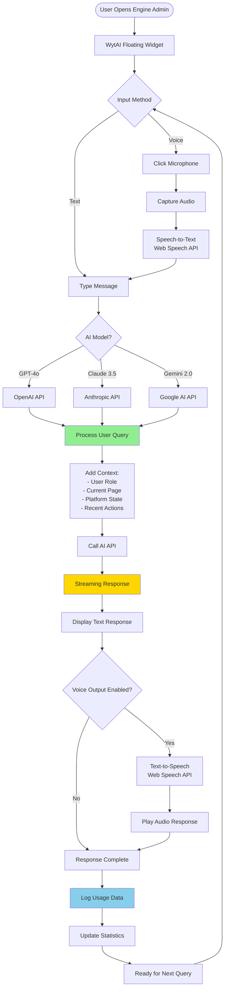
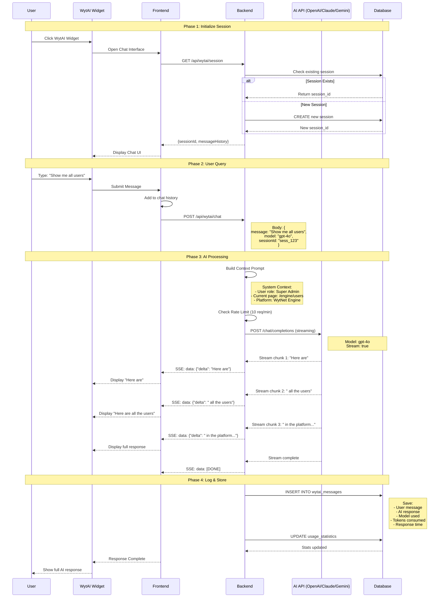
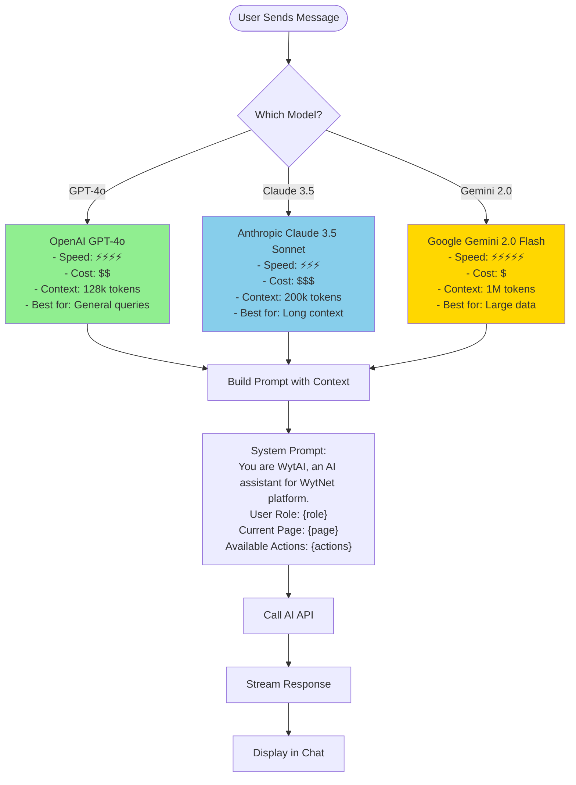
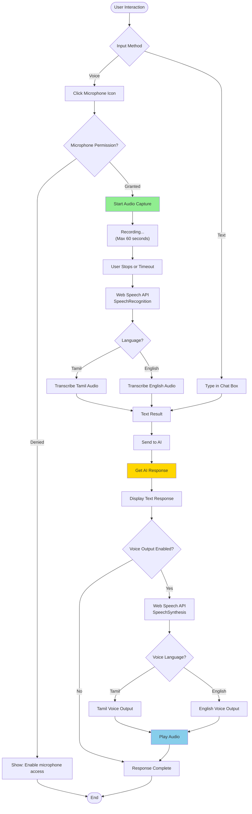
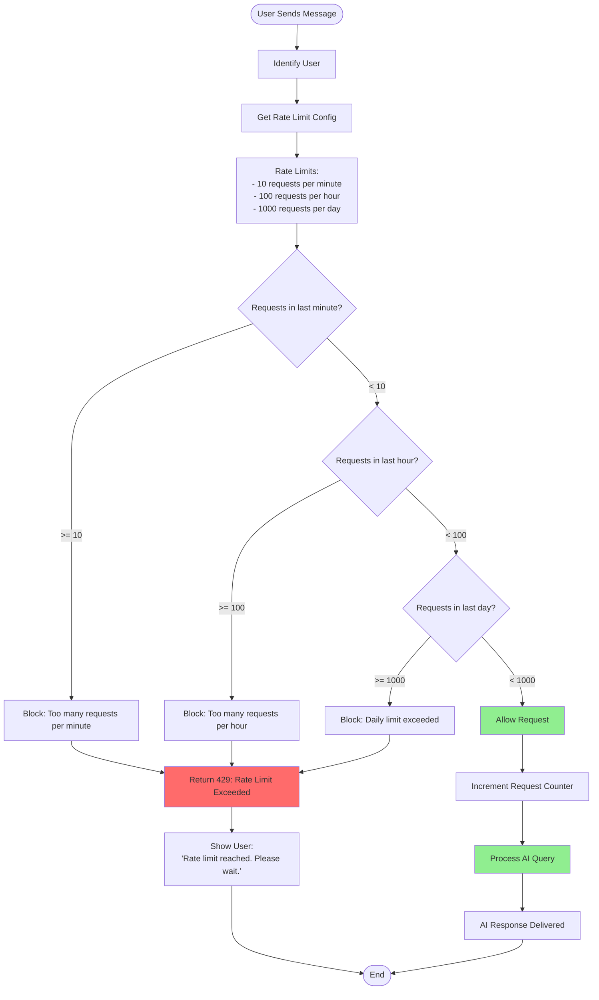

# WytAI Agent Workflow

## Overview

**WytAI Agent** is an intelligent AI assistant embedded in the Engine Admin portal, offering conversational platform management with multi-model AI support, voice interaction, and comprehensive usage tracking.

**Key Features:**
- Multiple AI models (GPT-4o, Claude 3.5 Sonnet, Gemini 2.0 Flash)
- Voice input/output in Tamil and English
- Streaming responses for real-time interaction
- Context-aware platform management
- Rate limiting and usage tracking
- Floating chat widget UI

---

## WytAI Architecture

### Complete AI Workflow



---

## User Interaction Flow

### Chat Session Lifecycle



---

## AI Model Selection

### Multi-Model Support



---

## Voice Interaction Flow

### Speech-to-Text & Text-to-Speech



---

## Rate Limiting System

### Request Throttling



---

## Database Schema

### WytAI Tables

```sql
-- WytAI Sessions
CREATE TABLE wytai_sessions (
  id SERIAL PRIMARY KEY,
  session_id VARCHAR(100) UNIQUE NOT NULL,
  user_id INTEGER NOT NULL REFERENCES users(id),
  created_at TIMESTAMP DEFAULT NOW(),
  last_activity TIMESTAMP DEFAULT NOW(),
  is_active BOOLEAN DEFAULT true
);
CREATE INDEX idx_wytai_session_user ON wytai_sessions(user_id);

-- WytAI Messages
CREATE TABLE wytai_messages (
  id SERIAL PRIMARY KEY,
  session_id VARCHAR(100) NOT NULL REFERENCES wytai_sessions(session_id),
  role VARCHAR(20) NOT NULL,  -- 'user' or 'assistant'
  content TEXT NOT NULL,
  model VARCHAR(50),  -- 'gpt-4o', 'claude-3.5-sonnet', 'gemini-2.0-flash'
  tokens_used INTEGER,
  response_time_ms INTEGER,
  created_at TIMESTAMP DEFAULT NOW()
);
CREATE INDEX idx_wytai_messages_session ON wytai_messages(session_id);
CREATE INDEX idx_wytai_messages_created ON wytai_messages(created_at DESC);

-- Usage Statistics
CREATE TABLE wytai_usage_stats (
  id SERIAL PRIMARY KEY,
  user_id INTEGER NOT NULL REFERENCES users(id),
  model VARCHAR(50) NOT NULL,
  total_requests INTEGER DEFAULT 0,
  total_tokens INTEGER DEFAULT 0,
  total_cost_usd DECIMAL(10,4) DEFAULT 0,
  period_start TIMESTAMP NOT NULL,
  period_end TIMESTAMP NOT NULL
);
CREATE INDEX idx_wytai_usage_user ON wytai_usage_stats(user_id);
CREATE INDEX idx_wytai_usage_period ON wytai_usage_stats(period_start, period_end);
```

---

## Backend Implementation

### AI Chat Endpoint

```typescript
// routes/wytai.ts
app.post('/api/wytai/chat', async (req, res) => {
  const { message, model = 'gpt-4o', sessionId } = req.body;
  const userId = req.session.userId;
  
  // Check rate limit
  const rateLimitOk = await checkRateLimit(userId);
  if (!rateLimitOk) {
    return res.status(429).json({ error: 'Rate limit exceeded' });
  }
  
  // Build context
  const systemPrompt = buildSystemPrompt(req.session);
  
  // Select AI provider
  const aiProvider = getAIProvider(model);
  
  // Set up streaming response
  res.setHeader('Content-Type', 'text/event-stream');
  res.setHeader('Cache-Control', 'no-cache');
  res.setHeader('Connection', 'keep-alive');
  
  let fullResponse = '';
  let tokensUsed = 0;
  const startTime = Date.now();
  
  try {
    // Stream AI response
    const stream = await aiProvider.chat({
      messages: [
        { role: 'system', content: systemPrompt },
        { role: 'user', content: message }
      ],
      stream: true
    });
    
    for await (const chunk of stream) {
      const delta = chunk.choices[0]?.delta?.content || '';
      fullResponse += delta;
      
      // Send to client
      res.write(`data: ${JSON.stringify({ delta })}\n\n`);
    }
    
    // Complete
    res.write('data: [DONE]\n\n');
    res.end();
    
    tokensUsed = estimateTokens(message + fullResponse);
    const responseTime = Date.now() - startTime;
    
    // Log to database
    await logAIMessage({
      sessionId,
      userMessage: message,
      aiResponse: fullResponse,
      model,
      tokensUsed,
      responseTime
    });
    
  } catch (error) {
    console.error('AI chat error:', error);
    res.write(`data: ${JSON.stringify({ error: 'AI error occurred' })}\n\n`);
    res.end();
  }
});
```

---

## Frontend Implementation

### WytAI Chat Widget

```typescript
// components/WytAIWidget.tsx
export function WytAIWidget() {
  const [isOpen, setIsOpen] = useState(false);
  const [messages, setMessages] = useState<Message[]>([]);
  const [input, setInput] = useState('');
  const [isListening, setIsListening] = useState(false);
  const [selectedModel, setSelectedModel] = useState<'gpt-4o' | 'claude-3.5-sonnet' | 'gemini-2.0-flash'>('gpt-4o');
  
  async function sendMessage() {
    if (!input.trim()) return;
    
    const userMessage = { role: 'user', content: input };
    setMessages(prev => [...prev, userMessage]);
    setInput('');
    
    try {
      const response = await fetch('/api/wytai/chat', {
        method: 'POST',
        headers: { 'Content-Type': 'application/json' },
        body: JSON.stringify({
          message: input,
          model: selectedModel,
          sessionId: sessionStorage.getItem('wytai_session')
        })
      });
      
      const reader = response.body?.getReader();
      const decoder = new TextDecoder();
      let aiResponse = '';
      
      while (true) {
        const { done, value } = await reader.read();
        if (done) break;
        
        const chunk = decoder.decode(value);
        const lines = chunk.split('\n');
        
        for (const line of lines) {
          if (line.startsWith('data: ')) {
            const data = line.slice(6);
            if (data === '[DONE]') break;
            
            const parsed = JSON.parse(data);
            aiResponse += parsed.delta;
            
            // Update UI in real-time
            setMessages(prev => {
              const last = prev[prev.length - 1];
              if (last?.role === 'assistant') {
                return [...prev.slice(0, -1), { ...last, content: aiResponse }];
              } else {
                return [...prev, { role: 'assistant', content: aiResponse }];
              }
            });
          }
        }
      }
      
      // Optional: Text-to-speech
      if (voiceOutputEnabled) {
        speak(aiResponse);
      }
      
    } catch (error) {
      console.error('Chat error:', error);
      toast.error('Failed to get AI response');
    }
  }
  
  function startVoiceInput() {
    if (!('webkitSpeechRecognition' in window)) {
      toast.error('Voice input not supported');
      return;
    }
    
    const recognition = new webkitSpeechRecognition();
    recognition.lang = 'en-US';  // or 'ta-IN' for Tamil
    recognition.continuous = false;
    
    recognition.onstart = () => setIsListening(true);
    recognition.onend = () => setIsListening(false);
    
    recognition.onresult = (event) => {
      const transcript = event.results[0][0].transcript;
      setInput(transcript);
    };
    
    recognition.start();
  }
  
  return (
    <>
      <FloatingButton onClick={() => setIsOpen(true)}>
        <Bot /> WytAI
      </FloatingButton>
      
      <Dialog open={isOpen} onOpenChange={setIsOpen}>
        <DialogContent className="max-w-2xl h-[600px]">
          <DialogHeader>
            <DialogTitle>WytAI Assistant</DialogTitle>
          </DialogHeader>
          
          <div className="flex-1 overflow-y-auto">
            {messages.map((msg, i) => (
              <ChatMessage key={i} role={msg.role} content={msg.content} />
            ))}
          </div>
          
          <div className="flex gap-2">
            <Select value={selectedModel} onValueChange={setSelectedModel}>
              <SelectItem value="gpt-4o">GPT-4o</SelectItem>
              <SelectItem value="claude-3.5-sonnet">Claude 3.5</SelectItem>
              <SelectItem value="gemini-2.0-flash">Gemini 2.0</SelectItem>
            </Select>
            
            <Input
              value={input}
              onChange={(e) => setInput(e.target.value)}
              onKeyDown={(e) => e.key === 'Enter' && sendMessage()}
              placeholder="Ask WytAI anything..."
            />
            
            <Button onClick={startVoiceInput} variant="outline">
              <Mic className={isListening ? 'text-red-500' : ''} />
            </Button>
            
            <Button onClick={sendMessage}>
              <Send />
            </Button>
          </div>
        </DialogContent>
      </Dialog>
    </>
  );
}
```

---

## Cost Tracking

### AI Model Pricing

| Model | Cost per 1K Tokens | Avg Response Cost |
|-------|-------------------|-------------------|
| GPT-4o | $0.005 (input) / $0.015 (output) | $0.02 |
| Claude 3.5 Sonnet | $0.003 (input) / $0.015 (output) | $0.018 |
| Gemini 2.0 Flash | $0.0001 (input) / $0.0004 (output) | $0.0005 |

---

## Related Flows

- [Super Admin Panel Switching](/en/use-case-flows/admin-panel-switching) - Admin context
- [Audit Logs System](/en/use-case-flows/audit-logs-system) - Usage tracking
- [RBAC Role-Based Access Control](/en/use-case-flows/rbac-permissions) - Access control

---

**Next:** Explore [Module Installation & Activation](/en/use-case-flows/module-installation) for platform extensibility.
