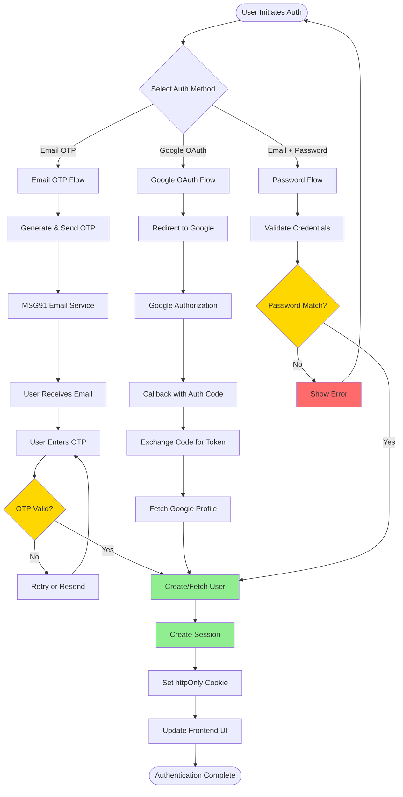
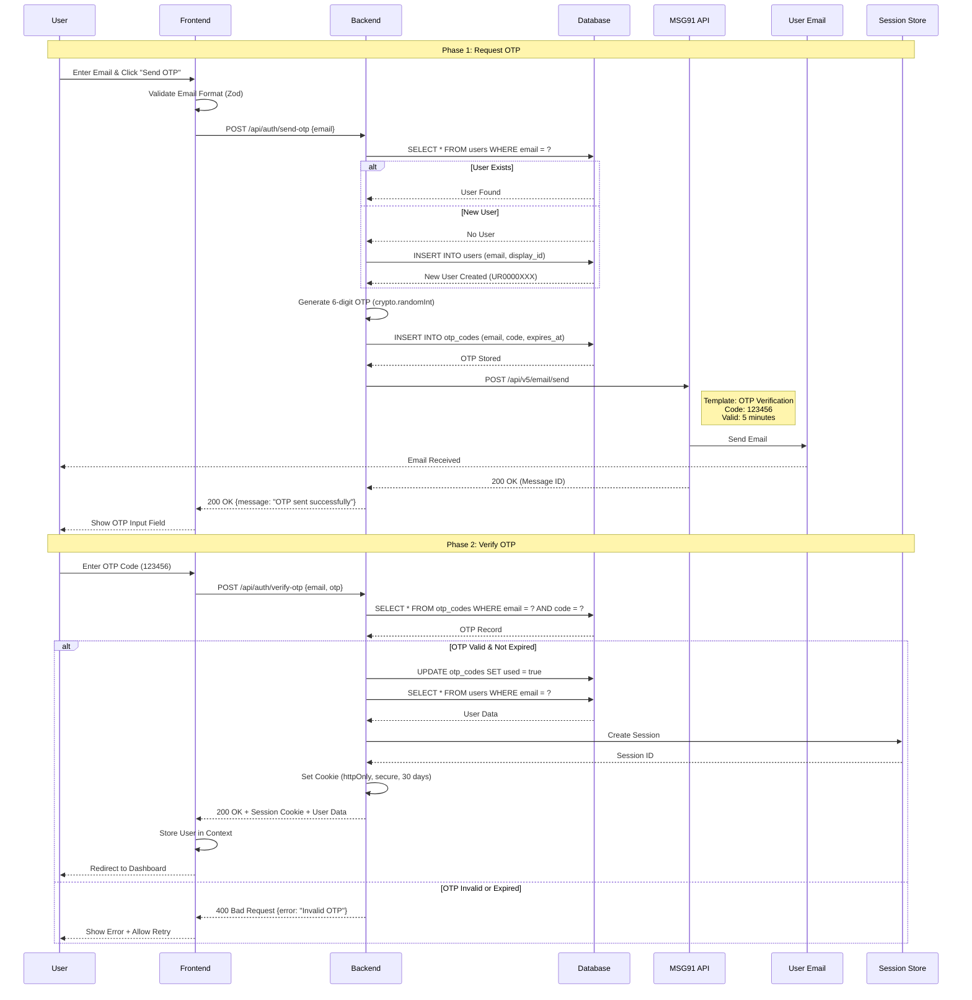
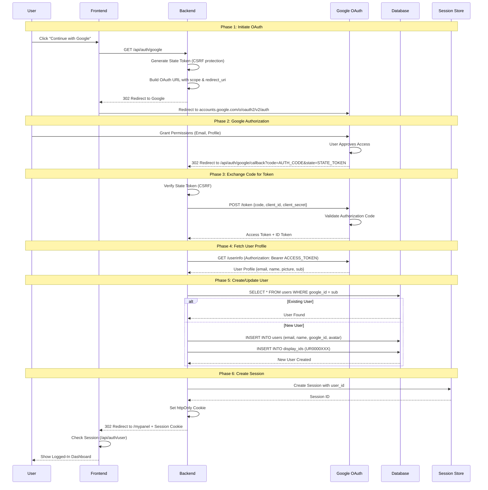
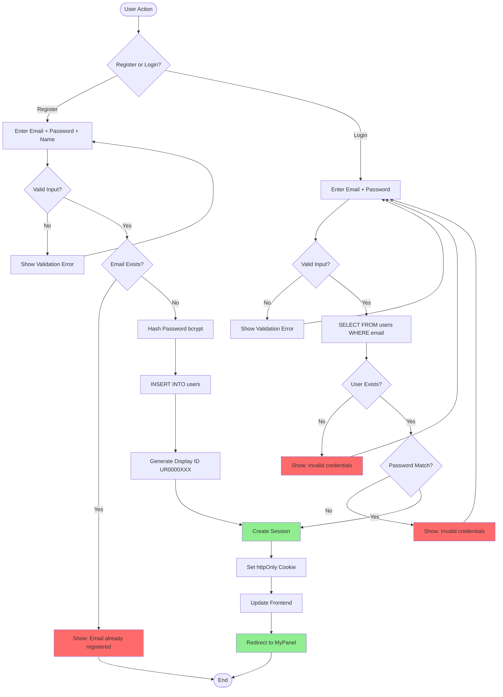
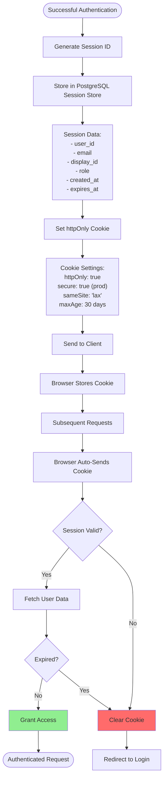

# WytPass Authentication System

## Overview

**WytPass** is WytNet's universal authentication system that provides secure, multi-method user authentication with session management, OAuth integration, and seamless cross-platform support.

**Supported Authentication Methods:**
1. **Email OTP** (One-Time Password via MSG91)
2. **Google OAuth 2.0** (Social login)
3. **Email + Password** (Traditional credentials)

**Key Features:**
- Universal single sign-on across all WytNet services
- Session-based authentication with httpOnly cookies
- OAuth 2.0 integration (Google, LinkedIn, Facebook ready)
- OTP-based passwordless login
- Secure password hashing with bcrypt
- 30-day session persistence
- Cross-device session management

---

## WytPass Architecture

### Complete Authentication System



---

## Email OTP Authentication Flow

### Detailed Sequence Diagram



---

## Google OAuth 2.0 Flow

### Complete OAuth Implementation



---

## Email + Password Authentication

### Registration & Login Flow



---

## Session Management System

### Session Creation & Validation



---

## Database Schema

### WytPass Tables

```sql
-- Users Table
CREATE TABLE users (
  id SERIAL PRIMARY KEY,
  display_id VARCHAR(20) UNIQUE NOT NULL,  -- UR0000001
  email VARCHAR(255) UNIQUE NOT NULL,
  password_hash TEXT,                       -- NULL for OAuth users
  name VARCHAR(255),
  avatar TEXT,
  google_id VARCHAR(255) UNIQUE,           -- Google OAuth
  linkedin_id VARCHAR(255) UNIQUE,         -- LinkedIn OAuth
  role VARCHAR(50) DEFAULT 'user',
  is_active BOOLEAN DEFAULT true,
  created_at TIMESTAMP DEFAULT NOW(),
  updated_at TIMESTAMP DEFAULT NOW()
);

-- OTP Codes Table
CREATE TABLE otp_codes (
  id SERIAL PRIMARY KEY,
  email VARCHAR(255) NOT NULL,
  code VARCHAR(6) NOT NULL,
  used BOOLEAN DEFAULT false,
  expires_at TIMESTAMP NOT NULL,
  created_at TIMESTAMP DEFAULT NOW(),
  INDEX idx_email_code (email, code),
  INDEX idx_expires_at (expires_at)
);

-- Sessions Table (managed by connect-pg-simple)
CREATE TABLE session (
  sid VARCHAR PRIMARY KEY,
  sess JSON NOT NULL,
  expire TIMESTAMP(6) NOT NULL
);
CREATE INDEX idx_session_expire ON session (expire);
```

---

## Security Features

### 1. Password Security

```typescript
// Password Hashing (Registration)
import bcrypt from 'bcryptjs';

const SALT_ROUNDS = 10;
const hashedPassword = await bcrypt.hash(plainPassword, SALT_ROUNDS);

// Password Verification (Login)
const isValid = await bcrypt.compare(inputPassword, storedHash);
```

**Requirements:**
- Minimum 8 characters
- At least 1 uppercase letter
- At least 1 lowercase letter
- At least 1 number
- At least 1 special character (!@#$%^&*)

### 2. OTP Security

```typescript
// Generate Secure OTP
import crypto from 'crypto';

function generateOTP(): string {
  return crypto.randomInt(100000, 999999).toString();
}

// Set Expiry
const expiresAt = new Date(Date.now() + 5 * 60 * 1000); // 5 minutes
```

**Features:**
- 6-digit random code
- 5-minute expiry
- One-time use only
- Rate limiting (1 per minute per email)
- Max 3 failed attempts before lockout

### 3. OAuth Security

```typescript
// State Token for CSRF Protection
const state = crypto.randomBytes(32).toString('hex');

// OAuth URL with PKCE
const authUrl = new URL('https://accounts.google.com/o/oauth2/v2/auth');
authUrl.searchParams.append('client_id', GOOGLE_CLIENT_ID);
authUrl.searchParams.append('redirect_uri', CALLBACK_URL);
authUrl.searchParams.append('response_type', 'code');
authUrl.searchParams.append('scope', 'email profile');
authUrl.searchParams.append('state', state);
```

### 4. Session Security

```javascript
// Cookie Configuration
{
  name: 'wytnet.sid',
  secret: process.env.SESSION_SECRET,
  resave: false,
  saveUninitialized: false,
  cookie: {
    httpOnly: true,        // Prevent XSS attacks
    secure: true,          // HTTPS only in production
    sameSite: 'lax',      // CSRF protection
    maxAge: 30 * 24 * 60 * 60 * 1000  // 30 days
  },
  store: new PostgresStore({ pool: db })
}
```

---

## API Endpoints

### Authentication Routes

```typescript
// Email OTP Flow
POST /api/auth/send-otp
Body: { email: string }
Response: { message: "OTP sent successfully" }

POST /api/auth/verify-otp
Body: { email: string, otp: string }
Response: { user: User, displayId: string }
Cookies: wytnet.sid (httpOnly, 30 days)

// Google OAuth Flow
GET /api/auth/google
Response: 302 Redirect to Google OAuth

GET /api/auth/google/callback?code=XXX&state=YYY
Response: 302 Redirect to /mypanel
Cookies: wytnet.sid (httpOnly, 30 days)

// Email + Password Flow
POST /api/auth/register
Body: { email: string, password: string, name: string }
Response: { user: User, displayId: string }
Cookies: wytnet.sid (httpOnly, 30 days)

POST /api/auth/login
Body: { email: string, password: string }
Response: { user: User, displayId: string }
Cookies: wytnet.sid (httpOnly, 30 days)

// Session Management
GET /api/auth/user
Response: { id, email, displayId, name, role, avatar }
401 if not authenticated

POST /api/auth/logout
Response: { message: "Logged out successfully" }
Clears: wytnet.sid cookie

// Password Reset
POST /api/auth/forgot-password
Body: { email: string }
Response: { message: "OTP sent to email" }

POST /api/auth/reset-password
Body: { email: string, otp: string, newPassword: string }
Response: { message: "Password reset successful" }
```

---

## Error Handling

### Authentication Errors

| Error Code | Scenario | User Message | Action |
|------------|----------|--------------|--------|
| 400 | Invalid email format | "Please enter a valid email address" | Validate input |
| 400 | Weak password | "Password must be at least 8 characters with uppercase, number, and special character" | Show requirements |
| 400 | Invalid OTP | "Incorrect OTP. Please try again." | Allow retry (3 max) |
| 400 | OTP expired | "OTP has expired. Please request a new one." | Resend OTP |
| 400 | Email already exists | "Email already registered. Try logging in." | Redirect to login |
| 401 | Wrong password | "Invalid email or password" | Generic message for security |
| 401 | User not found | "Invalid email or password" | Generic message for security |
| 403 | Account locked | "Too many failed attempts. Try again in 15 minutes." | Wait or contact support |
| 429 | Rate limit exceeded | "Too many requests. Please try again later." | Wait 1 minute |
| 500 | OAuth error | "Unable to authenticate with Google. Please try again." | Retry or use different method |

---

## Frontend Implementation

### WytPass Hook

```typescript
// useWytPass.ts
export function useWytPass() {
  const [user, setUser] = useState<User | null>(null);
  const [isLoading, setIsLoading] = useState(true);
  
  // Check session on mount
  useEffect(() => {
    checkSession();
  }, []);
  
  async function checkSession() {
    try {
      const res = await fetch('/api/auth/user');
      if (res.ok) {
        const userData = await res.json();
        setUser(userData);
      }
    } catch (error) {
      console.error('Session check failed:', error);
    } finally {
      setIsLoading(false);
    }
  }
  
  async function loginWithOTP(email: string, otp: string) {
    const res = await apiRequest('/api/auth/verify-otp', {
      method: 'POST',
      body: { email, otp }
    });
    setUser(res.user);
    return res;
  }
  
  async function loginWithGoogle() {
    window.location.href = '/api/auth/google';
  }
  
  async function logout() {
    await apiRequest('/api/auth/logout', { method: 'POST' });
    setUser(null);
  }
  
  return { user, isLoading, loginWithOTP, loginWithGoogle, logout };
}
```

---

## Performance Optimization

### 1. Session Caching
- Store user data in React Context
- Avoid repeated `/api/auth/user` calls
- Refresh only on auth events

### 2. OAuth Callback Optimization
- Fast token exchange (<200ms)
- Parallel profile fetch and DB query
- Efficient redirect handling

### 3. OTP Delivery Speed
- MSG91 Email API (<1 second delivery)
- Background job for email sending
- Non-blocking response to user

---

## Related Flows

- [Unified Header Authentication](/en/use-case-flows/unified-header-authentication) - UI implementation
- [Public Pages & Unauthorized Visitor](/en/use-case-flows/public-pages-unauthorized-visitor) - Route protection
- [Super Admin Panel Switching](/en/use-case-flows/admin-panel-switching) - Multi-session management
- [Multi-Tenant Architecture](/en/use-case-flows/multi-tenant-architecture) - Tenant isolation

---

**Next:** Explore [Multi-Tenant Architecture](/en/use-case-flows/multi-tenant-architecture) for user isolation and Row Level Security.
