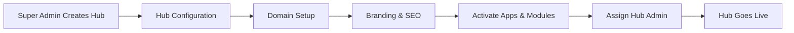

# WytHubs - Multi-Tenant Hub System

WytHubs are independent, branded digital environments within the WytNet platform. Each hub operates as a separate tenant with its own domain, branding, apps, modules, and user base—while sharing the same underlying Engine infrastructure.

## What is a WytHub?

A **WytHub** is a white-label, multi-tenant instance of the WytNet platform that can serve a specific community, organization, or business vertical. Think of it as a franchise model for digital platforms—each hub gets its own identity but leverages the shared WytNet ecosystem.

### Hub vs App vs Module

| Feature | WytHub | WytApp | WytModule |
|---------|--------|--------|-----------|
| **Purpose** | Complete branded platform | Specific functionality | Small plugin feature |
| **Domain** | Own domain/subdomain | Lives within hub | Embedded in apps |
| **Branding** | Fully customizable | Hub branding | System-level |
| **Tenancy** | Separate tenant | Within tenant | Shared infrastructure |
| **Users** | Own user base | Inherits hub users | System-wide |
| **Admin** | Hub Admin | App Manager | Engine Admin |

## Hub Architecture

### Multi-Domain Routing System

WytNet's intelligent routing system directs traffic to the correct hub based on domain:

```
wytnet.com → Platform Portal (main landing page)
engine.wytnet.com → Engine Admin (Super Admin)
clannet.org → ClanNet Hub
membernet.in → MemberNet Hub
voternet.co → VoterNet Hub
```

Each hub operates independently with:
- **Isolated Data**: Row Level Security (RLS) ensures data separation
- **Custom Branding**: Logo, colors, fonts, favicon
- **Independent Apps**: Hub Admin decides which apps to activate
- **Separate Users**: Own authentication and user management
- **Hub-level RBAC**: Hub Admin, Hub Manager, Member roles

### Hub Lifecycle



## WytNet Platform Hubs

WytNet currently operates **5 active hubs** across different verticals:

### 1. WytEngine (Platform Control Center)

**Domain**: `engine.wytnet.com`

**Purpose**: The central administrative hub where Super Admins manage the entire WytNet ecosystem.

**Key Features**:
- Module & App creation and management
- Global platform settings
- Multi-hub orchestration
- Audit logs and analytics
- Pricing plan configuration
- WytAI Agent integration

**Access**: Restricted to Super Admins only

**Admin Panels**: Engine Admin (Super Admin Panel)

---

### 2. WytNet.com (Public Platform Portal)

**Domain**: `wytnet.com`

**Purpose**: The main public-facing website showcasing WytNet's capabilities and serving as the platform marketplace.

**Key Features**:
- WytApps marketplace
- WytSuites bundles showcase
- Platform features documentation
- Pricing and plans
- User sign-up and onboarding
- Company information and branding

**Access**: Public (anyone can visit)

**Admin Panels**: None (managed by Engine Admin via CMS)

**Special Note**: WytNet.com is the **only hub** that does not have its own Hub Admin—it's directly managed by Super Admins through the Engine Admin portal.

---

### 3. ClanNet (Community & Social Hub)

**Domain**: `clannet.org`

**Purpose**: A community-driven social platform for groups, clubs, and interest-based communities.

**Key Features**:
- Social networking and profiles
- Community groups and forums
- Event management and calendars
- Content sharing and feeds
- Member directory
- Activity streams

**Activated Apps**:
- WytConnect (Social Networking)
- WytEvents (Event Management)
- WytChat (Real-time Messaging)
- WytFeed (Activity Feed)
- WytProfile (User Profiles)

**Activated Modules**:
- WytPass Authentication
- Push Notifications
- Real-time Chat System
- Calendar Module
- User Profile Manager

**Access**: Public registration, member-based features

**Hub Admin**: ClanNet Administrator

**Target Audience**: Community organizers, clubs, interest groups, alumni networks

---

### 4. MemberNet (Membership & Subscription Hub)

**Domain**: `membernet.in`

**Purpose**: A membership management platform for organizations, gyms, clubs, and subscription-based businesses.

**Key Features**:
- Member registration and KYC
- Subscription and renewal management
- Payment processing (Razorpay integration)
- Member directory and profiles
- Attendance tracking
- Invoice generation

**Activated Apps**:
- WytMembership (Membership Management)
- WytInvoice (Invoicing & Billing)
- WytAttendance (Attendance Tracking)
- WytProfile (Member Profiles)
- WytPayments (Payment Processing)

**Activated Modules**:
- WytPass Authentication
- WytKYC - Identity Verification (Digio)
- Razorpay Payment Gateway
- User Profile Manager
- Organisation Manager
- Email Service

**Access**: Organization-managed registration

**Hub Admin**: MemberNet Administrator

**Target Audience**: Gyms, co-working spaces, professional associations, clubs, coaching centers

---

### 5. VoterNet (Civic Engagement Hub)

**Domain**: `voternet.co`

**Purpose**: A civic engagement platform for political parties, NGOs, and community leaders to connect with voters and manage grassroots campaigns.

**Key Features**:
- Voter registration and verification
- Campaign management
- Polling and surveys
- Event organization (rallies, town halls)
- Volunteer coordination
- Constituency management

**Activated Apps**:
- WytVote (Voting & Polls)
- WytCampaign (Campaign Management)
- WytEvents (Event Organization)
- WytForms (Surveys & Feedback)
- WytMap (Geo-mapping)

**Activated Modules**:
- WytPass Authentication
- WytKYC - Identity Verification (Aadhaar eSign via Digio)
- Mappls (MapmyIndia) for Indian maps
- WytGeo - Location Data (India states, cities)
- SMS Service (Voter outreach)
- Email Service

**Access**: Controlled registration (verified voters/members)

**Hub Admin**: VoterNet Administrator

**Target Audience**: Political parties, NGOs, community organizers, election campaigns

---

## Hub Management Workflows

### Creating a New Hub (Super Admin)

1. **Navigate to Engine Admin** → Hubs Management
2. **Click "Create New Hub"**
3. **Fill Hub Details**:
   - Hub name (e.g., "HealthNet")
   - Hub ID (auto-generated: `HB00001`)
   - Primary domain (e.g., `healthnet.care`)
   - Hub description and tagline
4. **Set Branding**:
   - Upload logo (PNG, 512×512px)
   - Choose primary color
   - Set font family
   - Upload favicon
5. **Configure SEO**:
   - Meta title and description
   - Open Graph tags
   - Sitemap settings
6. **Assign Hub Admin** (optional):
   - Email of Hub Admin
   - Send invitation email
7. **Click "Create Hub"**
8. **DNS Configuration**: Point domain to WytNet platform
9. **Hub goes live** once DNS propagates

### Hub Configuration (Hub Admin)

1. **Access Hub Admin Panel** (e.g., `healthnet.care/hub-admin`)
2. **Customize Branding**: Update logo, colors, theme
3. **Activate Apps**: Browse WytApps catalog and activate needed apps
4. **Activate Modules**: Enable required modules (authentication, payment, etc.)
5. **Configure Settings**:
   - API keys (Razorpay, Google Maps, etc.)
   - Email/SMS provider settings
   - Notification preferences
6. **Set Up Roles**: Create Hub Manager, Content Manager roles
7. **Manage Members**: Invite team members and assign roles
8. **Configure Permissions**: Set RBAC policies for hub-specific access

### Multi-Domain Routing Setup

WytNet's routing system automatically handles requests based on the domain:

```javascript
// Automatic hub detection
const getHubByDomain = (domain) => {
  if (domain === 'engine.wytnet.com') return 'ENGINE';
  if (domain === 'wytnet.com') return 'PLATFORM';
  if (domain === 'clannet.org') return 'HB00001';
  if (domain === 'membernet.in') return 'HB00002';
  if (domain === 'voternet.co') return 'HB00003';
  // Custom domains
  return fetchHubByCustomDomain(domain);
};
```

**DNS Requirements**:
- **A Record**: Point domain to WytNet server IP
- **CNAME (optional)**: Subdomain redirects
- **SSL Certificate**: Auto-provisioned via Let's Encrypt

## Hub Tenancy & Data Isolation

### Row Level Security (RLS)

Every database row includes a `hub_id` (mapped to `tenant_id`) field:

```sql
-- Example: Users table with RLS
CREATE TABLE users (
  id UUID PRIMARY KEY,
  hub_id UUID NOT NULL,  -- Ensures data belongs to specific hub
  email TEXT UNIQUE,
  ...
);

-- RLS Policy: Users can only see their hub's data
CREATE POLICY hub_isolation ON users
  USING (hub_id = current_setting('app.current_hub_id')::UUID);
```

**Benefits**:
- ✅ Automatic data separation
- ✅ No cross-hub data leaks
- ✅ Single database, isolated queries
- ✅ Simplified compliance (GDPR, CCPA)

### Hub-Level RBAC

Each hub has its own role hierarchy:

```
Super Admin (Engine-level)
  └─ Hub Admin (hub-level)
      ├─ Hub Manager
      ├─ Content Manager
      ├─ App Manager
      └─ Member (default)
```

**Permissions**:
- **Super Admin**: Can create/delete hubs, manage all hub admins
- **Hub Admin**: Full control within own hub, cannot access other hubs
- **Hub Manager**: Manage apps, modules, settings (no user management)
- **Content Manager**: Edit CMS content, upload media
- **App Manager**: Configure activated apps (no hub settings)
- **Member**: Regular user access

## Hub Activation & Pricing Models

### Hub Creation

- **Free**: Up to 1 hub per Engine instance (e.g., WytNet.com default hub)
- **Premium**: ₹999/month per additional hub (e.g., ClanNet, MemberNet, VoterNet)

### Hub Features

Each hub can:
- Activate unlimited **free modules** (WytPass, CSV Import, etc.)
- Subscribe to **premium modules** (₹29–₹249/month per module)
- Activate **free apps** or subscribe to **premium apps** (₹199–₹999/month)
- Bundle apps via **WytSuites** (WytWorks, WytStax, WytCRM)

**Example**: MemberNet Hub monthly cost:
- Hub: ₹999/month
- WytMembership App: ₹499/month
- WytInvoice App: ₹399/month
- Razorpay Module: ₹2/transaction (usage-based)
- **Total**: ₹1,897/month + transaction fees

## Roadmap: Upcoming Hubs

### Q1 2026
- **LearnNet**: E-learning and course management hub
- **ShopNet**: E-commerce and marketplace hub

### Q2 2026
- **HealthNet**: Healthcare and wellness management hub
- **WorkNet**: Freelance and gig work platform hub

### Q3 2026
- **EventNet**: Event planning and ticketing hub
- **FoodNet**: Restaurant and food delivery hub

## Related Documentation

- [WytApps - Application Layer](/en/wytapps/)
- [WytModules - Plugin System](/en/wytmodules/)
- [Engine Admin - Hub Management](/en/admin-panels/engine-admin)
- [Multi-Tenancy Architecture](/en/architecture/)
