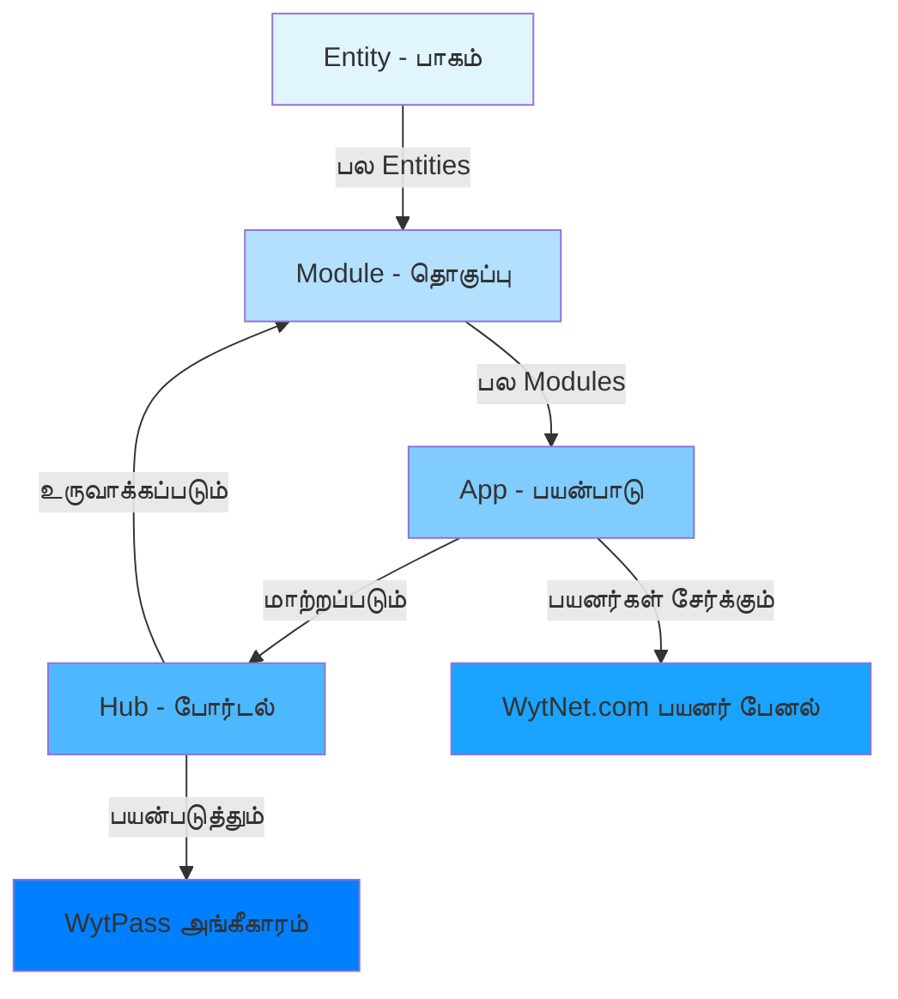
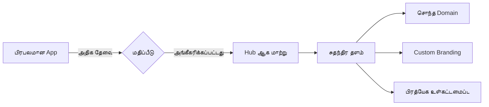
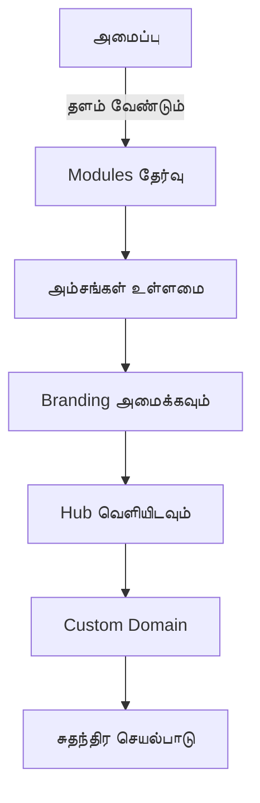
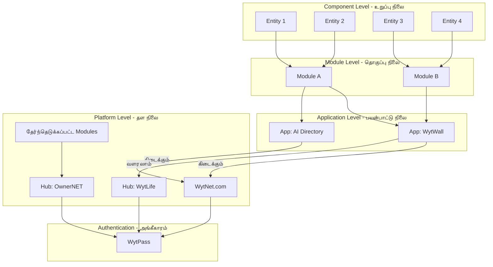

# முக்கிய கருத்துக்கள்

## தளத்தின் கட்டமைப்பு வரிசைப்படி

WytNet ஒரு படிநிலை கட்டமைப்பை பின்பற்றுகிறது, இது சிறிய உறுப்புகளிலிருந்து முழுமையான சுதந்திர தளங்களாக உருவாகிறது:



## 1. Entity (பாகம்)

**வரை முறை**: தளத்தின் மிகச்சிறிய செயல்பாட்டு கூறு.

- **என்ன**: ஒரு தனி, சுயமாக செயல்படும் செயல்பாட்டு அல்லது தரவு அமைப்பு
- **உதாரணங்கள்**:
  - பயனர் சுயவிவர படிவம்
  - கருத்து பிரிவு
  - விரும்பு பொத்தான்
  - இடுகை அட்டை
  - படம் பதிவேற்ற விட்ஜெட்
  - தேதி தேர்வி

**பண்புகள்**:
- பல்வேறு சூழல்களில் மீண்டும் பயன்படுத்தக்கூடியது
- ஒரே பொறுப்பு
- பண்புகளுடன் உள்ளமைக்க முடியும்
- தரவுத்தள அட்டவணை பிரதிநிதித்துவம்

---

## 2. Module (தொகுப்பு)

**வரை முறை**: தொடர்புடைய பல Entity களின் தொகுப்பு, ஒன்றாக இணைந்து முழுமையான அம்சத்தை வழங்குகிறது.

- **என்ன**: பல Entities ஒருங்கிணைந்து ஒரு ஒருங்கிணைந்த செயல்பாட்டை உருவாக்குகின்றன
- **உதாரணங்கள்**:
  - **பயனர் மேலாண்மை Module**:
    - பயனர் சுயவிவர Entity
    - பயனர் அமைப்புகள் Entity
    - பயனர் அவதார் Entity
    - பயனர் விருப்பங்கள் Entity
  
  - **சமூக Feed Module**:
    - இடுகை Entity
    - கருத்து Entity
    - விரும்பு Entity
    - பகிர்வு Entity
    - ஊடக Entity

**பண்புகள்**:
- பல தொடர்புடைய Entities உள்ளடங்கியது
- முழுமையான அம்ச தொகுப்பை வழங்குகிறது
- பல்வேறு Apps முழுவதும் பயன்படுத்த முடியும்
- சொந்த API endpoints உள்ளன
- தொடர்புடைய தரவுத்தள அட்டவணைகளை நிர்வகிக்கிறது

**Module அமைப்பு**:
```
Module
├── Entities (பல)
├── வணிக தர்க்கம்
├── API Routes
├── தரவுத்தள Schema
└── UI கூறுகள்
```

---

## 3. App (பயன்பாடு)

**வரை முறை**: WytNet.com க்குள் பயனர் முகப்பு பயன்பாட்டை உருவாக்கும் Modules தொகுப்பு.

- **என்ன**: பல Modules ஒருங்கிணைந்து முழுமையான பயனர் பயன்பாட்டை வழங்குகின்றன
- **எங்கே இருக்கும்**: WytNet.com தளத்திற்குள்
- **பயனர்கள் எப்படி பயன்படுத்துவார்கள்**: பயனர்கள் தங்கள் "MyWyt Apps" பேனலில் Apps ஐ "சேர்க்கலாம்"

**உதாரணங்கள்**:

### **WytWall App**
```
WytWall
├── Social Feed Module
│   ├── Post Entity
│   ├── Comment Entity
│   ├── Like Entity
│   └── Share Entity
├── Media Module
│   ├── Image Upload Entity
│   ├── Video Upload Entity
│   └── Media Gallery Entity
├── Moderation Module
│   ├── Admin Approval Entity
│   ├── Content Filter Entity
│   └── Report Entity
└── Notification Module
    ├── Real-time Notification Entity
    └── Notification History Entity
```

### **AI Directory App**
```
AI Directory
├── Directory Listing Module
│   ├── Tool Card Entity
│   ├── Search Entity
│   └── Filter Entity
├── Category Module
│   ├── Category Browser Entity
│   └── Tag Entity
└── User Interaction Module
    ├── Rating Entity
    ├── Review Entity
    └── Bookmark Entity
```

**பண்புகள்**:
- பல Modules இணைந்து உருவாக்கப்பட்டது
- WytNet.com பயனர் பேனலில் கிடைக்கும்
- பயனர்கள் Apps ஐ இயக்க/முடக்க முடியும்
- ஒவ்வொரு App க்கும் அதன் சொந்த பிரிவு உண்டு
- WytPass அங்கீகாரத்தை பகிர்ந்து கொள்கிறது
- பகிரப்பட்ட பயனர் தரவை அணுக முடியும்

**App வாழ்க்கை சுழற்சி**:
1. **உருவாக்கம்**: Modules மற்றும் Entities பயன்படுத்தி கட்டப்பட்டது
2. **வெளியீடு**: WytNet App Store இல் கிடைக்கச் செய்யப்படுகிறது
3. **கண்டுபிடிப்பு**: பயனர்கள் கிடைக்கும் Apps ஐ உலாவுகிறார்கள்
4. **நிறுவல்**: பயனர்கள் தங்கள் பேனலில் App ஐ சேர்க்கிறார்கள்
5. **பயன்பாடு**: பயனர்கள் App அம்சங்களை அணுகுகிறார்கள்
6. **வளர்ச்சி**: பிரபலமான Apps Hubs ஆக மாறலாம்

---

## 4. Hub (தன்னிச்சையான போர்டல்)

**வரை முறை**: முழுமையாக சுதந்திரமாக செயல்படும் வெப் போர்டல் அல்லது மொபைல் பயன்பாடு.

- **என்ன**: சுதந்திரமாக இருக்கக்கூடிய தனித்த தளம்
- **அங்கீகாரம்**: WytPass அங்கீகார அமைப்பை பயன்படுத்துகிறது
- **உள்ளமைவு**: Modules பயன்படுத்தி கட்டப்பட்டது

**Hub உருவாக்க முறைகள்**:

### **முறை 1: App வளர்ச்சி**
ஒரு App குறிப்பிடத்தக்க பயனர் ஏற்றுக்கொள்ளல் மற்றும் தேவையை பெறும்போது:



**உதாரணம்**: 
- WytLife ஒரு App ஆக WytNet.com க்குள் தொடங்குகிறது
- 100,000+ செயலில் உள்ள பயனர்களைப் பெறுகிறது
- அதிக அம்ச கோரிக்கை தேவை
- தளம் அதை Hub நிலைக்கு உயர்த்த முடிவு செய்கிறது
- life.wytnet.com அல்லது wytlife.com ஆகிறது
- சுதந்திரமாக செயல்படுகிறது ஆனால் WytPass பயன்படுத்துகிறது

### **முறை 2: Custom Hub உருவாக்கம்**
டெவலப்பர்கள், நிறுவனங்கள் அல்லது அமைப்புகள் custom Hubs உருவாக்குகின்றன:



**உதாரணங்கள்**:
- **OwnerNET Hub**: சொத்து மேலாண்மை தளம்
  - சொத்து மேலாண்மை Module
  - குத்தகைதாரர் மேலாண்மை Module
  - பராமரிப்பு Module
  - கட்டண Module

- **MarketPlace Hub**: மின்-வணிக தளம்
  - தயாரிப்பு பட்டியல் Module
  - Shopping Cart Module
  - கட்டண வாயில் Module
  - ஆர்டர் மேலாண்மை Module

**Hub பண்புகள்**:
- முழுமையாக சுதந்திர செயல்பாடு
- சொந்த domain பெயர் (custom அல்லது subdomain)
- Custom branding மற்றும் theming
- அங்கீகாரத்திற்கு WytPass பயன்படுத்துகிறது
- Hub-குறிப்பிட்ட அம்சங்கள் இருக்கலாம்
- Multi-tenant திறன்
- சொந்த நிர்வாக பேனல்
- தேர்ந்தெடுக்கப்பட்ட WytNet Apps ஐ ஒருங்கிணைக்க முடியும்

**Hub vs App**:

| அம்சம் | App | Hub |
|--------|-----|-----|
| **இடம்** | WytNet.com க்குள் | சுதந்திர தளம் |
| **Domain** | wytnet.com/app-name | custom.com அல்லது hub.wytnet.com |
| **Branding** | WytNet branding | Custom branding |
| **நிர்வாகம்** | WytNet Admin | Hub Admin + WytNet Super Admin |
| **சுதந்திரம்** | WytNet.com சார்ந்தது | முழுமையாக சுயாதீனம் |
| **பயனர்கள்** | WytNet பயனர்கள் | சொந்த பயனர் தளம் (WytPass மூலம்) |
| **வெளியீடு** | WytNet இன் பகுதி | தனி வெளியீடு |

---

## கட்டமைப்பு ஓட்டம்

கூறுகள் எப்படி சிறியதிலிருந்து பெரியதாக செல்கின்றன என்பது இங்கே:



---

## நடைமுறை உதாரணம்: சமூக இடுகை அம்சம்

ஒரு சமூக இடுகை அம்சத்தை எல்லா நிலைகளிலும் பார்ப்போம்:

### நிலை 1: Entities
```
- Post Text Entity (உள்ளீட்டு புலம், எழுத்து எண்ணி)
- Post Media Entity (படம் பதிவேற்றம், வீடியோ பதிவேற்றம்)
- Post Privacy Entity (பொது/தனிப்பட்ட தேர்வி)
- Post Actions Entity (திருத்து, நீக்கு பொத்தான்கள்)
```

### நிலை 2: Module
```
Social Feed Module
├── Post Creation - இடுகை உருவாக்கம்
│   ├── Post Text Entity
│   ├── Post Media Entity
│   └── Post Privacy Entity
├── Post Display - இடுகை காட்சி
│   ├── Post Card Entity
│   ├── Author Info Entity
│   └── Timestamp Entity
└── Post Interaction - இடுகை தொடர்பு
    ├── Like Entity
    ├── Comment Entity
    └── Share Entity
```

### நிலை 3: App
```
WytWall App (WytNet.com க்குள்)
├── Social Feed Module
├── User Profile Module
├── Notification Module
└── Media Gallery Module

பயனர்கள் WytWall ஐ தங்கள் MyWyt Apps பேனலில் சேர்க்கலாம்
```

### நிலை 4: Hub
```
WytWall மிகவும் பிரபலமானால்:
→ WytWall Hub ஆக மாறுகிறது
→ சொந்த domain: wytwall.com
→ சுதந்திர செயல்பாடு
→ இன்னும் WytPass அங்கீகாரம் பயன்படுத்துகிறது
→ சமூக வலைப்பின்னலுக்கான custom அம்சங்கள்
```

---

## முக்கிய கொள்கைகள்

1. **இணைப்பு தன்மை**: சிறிய கூறுகள் பெரிய அமைப்புகளாக கட்டமைக்கப்படுகின்றன
2. **மீண்டும் பயன்படுத்துதல்**: Entities மற்றும் Modules Apps மற்றும் Hubs முழுவதும் மீண்டும் பயன்படுத்தப்படலாம்
3. **அளவிடுதல்**: Apps தேவை அதிகரிக்கும்போது Hubs ஆக வளரலாம்
4. **நெகிழ்வுத்தன்மை**: அமைப்புகள் ஏற்கனவே உள்ள Modules இலிருந்து custom Hubs உருவாக்க முடியும்
5. **ஒருங்கிணைந்த அங்கீகாரம்**: அனைத்து நிலைகளும் WytPass அங்கீகாரம் பயன்படுத்துகின்றன
6. **Multi-tenancy**: ஒவ்வொரு Hub சுதந்திரமாக செயல்படுகிறது ஆனால் உள்கட்டமைப்பை பகிர்ந்து கொள்கிறது

---

## அடுத்த படிகள்

- [WytPass அங்கீகாரம் →](/ta/features/wytpass)
- [தரவுத்தள Schema →](/ta/architecture/database-schema)
- [Module அமைப்பு →](/ta/architecture/system-overview)
- [Hub மேலாண்மை →](/ta/admin/hub-panel)
