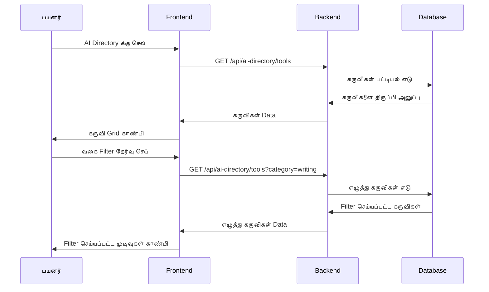
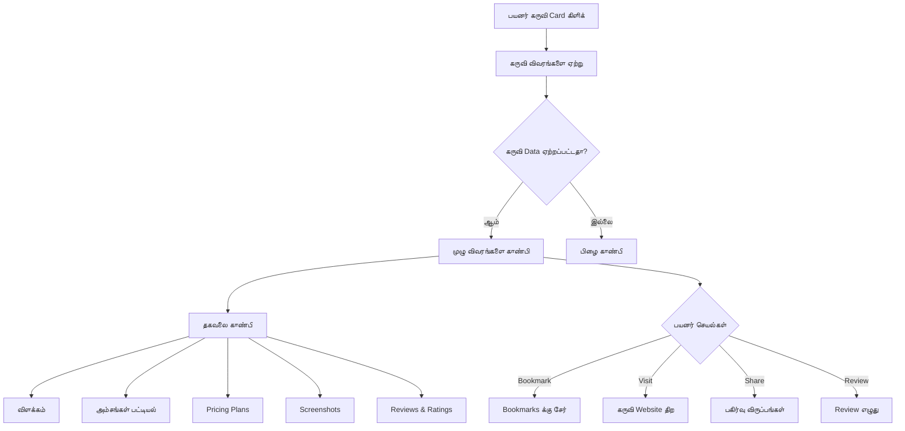
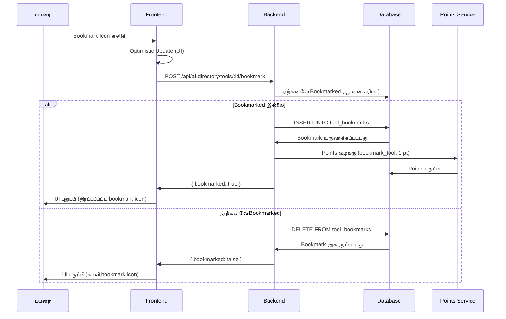
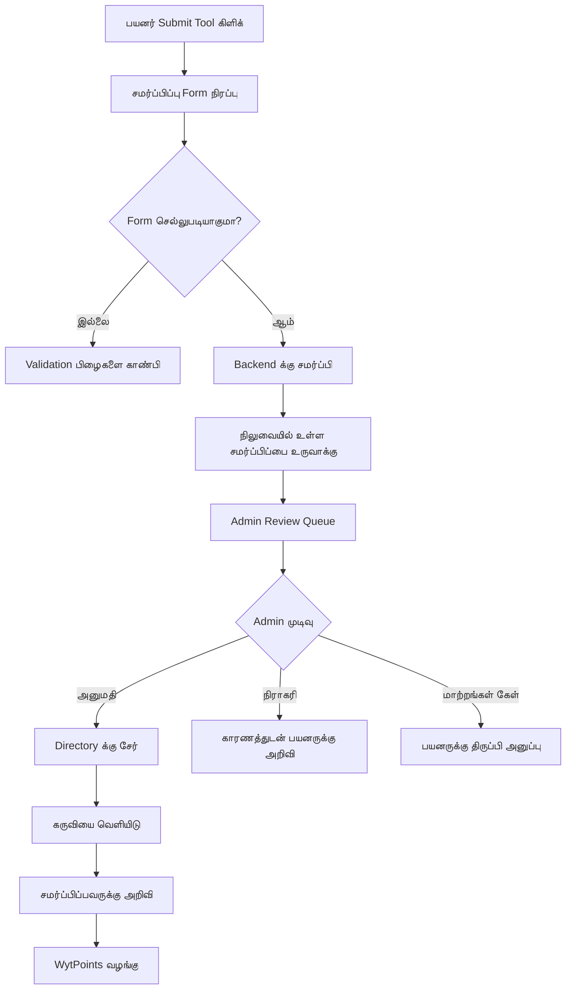

# AI Directory - தேர்ந்தெடுக்கப்பட்ட AI கருவிகள் Database

## கண்ணோட்டம்

**AI Directory** என்பது WytNet இல் உள்ள ஒரு விரிவான, தேர்ந்தெடுக்கப்பட்ட AI கருவிகள் மற்றும் platforms இன் directory ஆகும். இது பயனர்களுக்கு பல்வேறு வகைகளில், உற்பத்தித்திறன் முதல் படைப்பாற்றல் வரை, AI கருவிகளை கண்டுபிடிக்க, ஆராய மற்றும் சேமிக்க உதவுகிறது, விரிவான தகவல், ratings மற்றும் ஒவ்வொரு கருவிக்கும் நேரடி links உடன்.

### முக்கிய அம்சங்கள்

- **தேர்ந்தெடுக்கப்பட்ட தொகுப்பு**: 20+ வகைகளில் கையால் தேர்ந்தெடுக்கப்பட்ட AI கருவிகள்
- **மேம்பட்ட தேடல்**: வகை, அம்சங்கள், pricing மற்றும் பயன்பாட்டு வழக்கின் மூலம் கருவிகளை கண்டுபிடி
- **கருவி Ratings & Reviews**: சமூக ratings மற்றும் விரிவான reviews
- **Bookmark அமைப்பு**: விருப்பமான கருவிகளை தனிப்பட்ட collection இல் சேமி
- **ஒப்பீட்டு கருவி**: பல AI கருவிகளை side-by-side ஒப்பிடு
- **சமர்ப்பிப்பு அமைப்பு**: பயனர்கள் புதிய AI கருவிகளை review க்கு சமர்ப்பிக்கலாம்
- **ஒருங்கிணைப்பு Links**: கருவி websites மற்றும் documentation க்கு நேரடி links
- **வழக்கமான புதுப்பிப்புகள்**: வாரந்தோறும் புதிய கருவிகள் சேர்க்கப்படுகின்றன

---

## பயன்பாட்டு வழக்குகள்

### வெவ்வேறு பயனர் வகைகளுக்கு

**1. வணிக தொழில் வல்லுநர்கள்**
- தன்னியக்கத்திற்கான AI கருவிகளை கண்டுபிடி
- உற்பத்தித்திறன் மேம்படுத்திகளை கண்டறி
- Pricing plans ஒப்பிடு
- உண்மையான பயனர் reviews படி

**2. Content உருவாக்குபவர்கள்**
- படைப்பாற்றல் AI கருவிகளை ஆராய்
- Image/video generators கண்டுபிடி
- எழுத்து உதவியாளர்களை கண்டறி
- அம்சங்களை ஒப்பிடு

**3. Developers**
- AI APIs மற்றும் SDKs கண்டுபிடி
- மேம்பாட்டு கருவிகளை ஆராய்
- தொழில்நுட்ப விவரக்குறிப்புகளை ஒப்பிடு
- Documentation அணுகு

**4. மாணவர்கள் & கல்வியாளர்கள்**
- கற்றல் AI கருவிகளை கண்டுபிடி
- ஆராய்ச்சி உதவியாளர்களை கண்டறி
- கல்வி platforms ஆராய்
- இலவச கருவிகள் அணுகு

---

## பயனர் Workflow

### 1. Directory உலாவுதல்



**Directory பக்க அமைப்பு**:

```
┌──────────────────────────────────────────────────┐
│  AI Directory            [Submit Tool] [My Bookmarks]│
│  எந்த பணிக்கும் சிறந்த AI கருவிகளை கண்டுபிடி  │
├──────────────────────────────────────────────────┤
│                                                  │
│  [Search: "கருவிகளை தேடு..."]                   │
│                                                  │
│  வகைகள்:                                        │
│  [All] [Writing] [Image Gen] [Video] [Code]    │
│  [Data] [Marketing] [Design] [Audio] [More...]  │
│                                                  │
│  Filters:                                        │
│  Pricing: [All] [Free] [Freemium] [Paid]       │
│  Platform: [Web] [API] [Desktop] [Mobile]       │
│                                                  │
├──────────────────────────────────────────────────┤
│                                                  │
│  சிறப்பு AI கருவிகள் (24 கருவிகள் கண்டுபிடிக்கப்பட்டன) │
│                                                  │
│  ┌────────────────────────────────────────┐    │
│  │ 🤖 ChatGPT                  [Bookmark] │    │
│  │ Conversational AI Assistant             │    │
│  │ OpenAI • Writing, Chat, Code            │    │
│  │ ⭐⭐⭐⭐⭐ 4.9 (12.5k reviews)            │    │
│  │ Pricing: Freemium • Platform: Web       │    │
│  │ [View Details] [Visit Tool →]          │    │
│  └────────────────────────────────────────┘    │
│                                                  │
│  ┌────────────────────────────────────────┐    │
│  │ 🎨 Midjourney                [Bookmark] │    │
│  │ AI Image Generation                     │    │
│  │ Midjourney • Design, Art                │    │
│  │ ⭐⭐⭐⭐ 4.7 (8.2k reviews)              │    │
│  │ Pricing: Paid • Platform: Web + Discord │    │
│  │ [View Details] [Visit Tool →]          │    │
│  └────────────────────────────────────────┘    │
│                                                  │
└──────────────────────────────────────────────────┘
```

---

### 2. கருவி விவர காட்சி



**கருவி விவர பக்க அமைப்பு**:

```
┌──────────────────────────────────────────────────┐
│  🤖 ChatGPT                                      │
│  by OpenAI                          [Bookmark ⭐]│
├──────────────────────────────────────────────────┤
│                                                  │
│  🏷️ வகைகள்: Writing, Chat, Code, Research      │
│  💰 Pricing: Freemium (Free + $20/mo Pro)       │
│  🌐 Platform: Web, iOS, Android, API            │
│  📅 சேர்க்கப்பட்டது: Jan 2023 • புதுப்பிக்கப்பட்டது: Oct 2025 │
│                                                  │
│  ⭐⭐⭐⭐⭐ 4.9/5 (12,543 reviews)                 │
│                                                  │
│  [Visit Tool →] [Read Documentation] [Compare]  │
│                                                  │
├──────────────────────────────────────────────────┤
│                                                  │
│  ## பற்றி                                       │
│  ChatGPT ஒரு conversational AI assistant ஆகும்  │
│  GPT-4 ஆல் இயக்கப்படுகிறது. இது எழுத்து,       │
│  coding, ஆராய்ச்சி மற்றும் படைப்பாற்றல் பணிகளுக்கு உதவும்... │
│                                                  │
│  ## முக்கிய அம்சங்கள்                           │
│  ✓ இயற்கை மொழி உரையாடல்கள்                     │
│  ✓ Code generation மற்றும் debugging             │
│  ✓ Content உருவாக்கம் மற்றும் திருத்துதல்       │
│  ✓ Data பகுப்பாய்வு மற்றும் visualization       │
│  ✓ பல மொழிகள் ஆதரவு                            │
│  ✓ Custom instructions                           │
│                                                  │
│  ## Pricing Plans                                │
│  ┌─────────────────────────────────────┐       │
│  │ இலவச Plan                          │       │
│  │ • அடிப்படை GPT-3.5 அணுகல்          │       │
│  │ • நிலையான response நேரம்           │       │
│  │ • Web அணுகல்                        │       │
│  └─────────────────────────────────────┘       │
│                                                  │
│  ┌─────────────────────────────────────┐       │
│  │ Plus Plan - $20/month               │       │
│  │ • GPT-4 அணுகல்                     │       │
│  │ • முன்னுரிமை அணுகல்                │       │
│  │ • வேகமான response நேரங்கள்         │       │
│  │ • மேம்பட்ட அம்சங்கள்               │       │
│  └─────────────────────────────────────┘       │
│                                                  │
│  ## Screenshots                                  │
│  [Image Gallery]                                 │
│                                                  │
│  ## பயனர் Reviews (12,543)                      │
│  ⭐⭐⭐⭐⭐ "உற்பத்தித்திறனுக்கு game changer!"  │
│  by @john_doe • 2 நாட்களுக்கு முன்             │
│                                                  │
│  ⭐⭐⭐⭐ "சிறந்தது ஆனால் சில நேரங்களில் மெதுவாக இருக்கும்" │
│  by @jane_smith • 1 வாரத்திற்கு முன்           │
│                                                  │
│  [Write a Review]                                │
│                                                  │
└──────────────────────────────────────────────────┘
```

---

### 3. தேடல் & Filter

**மேம்பட்ட தேடல் திறன்கள்**:

```typescript
interface SearchFilters {
  query?: string;                  // Text search
  category?: string[];             // Multiple categories
  pricing?: "free" | "freemium" | "paid";
  platform?: string[];             // "web", "api", "mobile"
  minRating?: number;              // 0-5
  features?: string[];             // Required features
  sortBy?: "rating" | "popular" | "recent" | "name";
}
```

**API Endpoint**: `GET /api/ai-directory/tools`

**Query Parameters உதாரணம்**:
```http
GET /api/ai-directory/tools?
  category=writing,code&
  pricing=freemium&
  platform=web&
  minRating=4.0&
  sortBy=rating&
  page=1&
  limit=20
```

---

### 4. கருவிகளை Bookmarking



**Bookmarks பார்**: `GET /api/ai-directory/my-bookmarks`

---

### 5. புதிய கருவியை சமர்ப்பித்தல்

பயனர்கள் review மற்றும் approval க்கு புதிய AI கருவிகளை சமர்ப்பிக்கலாம்.



**சமர்ப்பிப்பு Form புலங்கள்**:

```typescript
interface ToolSubmission {
  name: string;
  description: string;
  longDescription?: string;
  websiteUrl: string;
  logoUrl?: string;
  categories: string[];            // Max 3
  pricing: "free" | "freemium" | "paid";
  pricingDetails?: string;
  platforms: string[];             // "web", "api", "mobile", etc.
  features: string[];
  screenshots?: string[];          // Max 5
  submitterEmail: string;
  submitterNotes?: string;
}
```

**API Endpoint**: `POST /api/ai-directory/submit-tool`

**Admin Review**: `GET /api/admin/ai-directory/pending-submissions`

---

## Data Model

### Database Schema

```typescript
// AI Tools
interface AITool {
  id: string;                      // UUID
  displayId: string;               // AIT0001
  
  // Basic Info
  name: string;
  slug: string;                    // URL-friendly: "chatgpt"
  description: string;             // Short description (200 chars)
  longDescription?: string;        // Full description
  
  // Company/Creator
  company: string;                 // "OpenAI"
  websiteUrl: string;
  documentationUrl?: string;
  apiUrl?: string;
  
  // Classification
  categories: string[];            // ["writing", "chat", "code"]
  tags: string[];
  
  // Pricing
  pricing: "free" | "freemium" | "paid";
  pricingDetails: {
    plans: Array<{
      name: string,
      price: number,
      currency: string,
      interval: "month" | "year" | "one-time",
      features: string[]
    }>
  };
  
  // Platform Support
  platforms: string[];             // ["web", "ios", "android", "api"]
  
  // Media
  logoUrl: string;
  screenshots: string[];
  videoUrl?: string;
  
  // Features
  features: string[];
  
  // Stats
  rating: number;                  // 0-5
  ratingCount: number;
  bookmarkCount: number;
  viewCount: number;
  clickCount: number;              // Clicks to website
  
  // Status
  status: "active" | "beta" | "deprecated";
  featured: boolean;
  verified: boolean;               // Verified by admins
  
  // SEO
  metaTitle?: string;
  metaDescription?: string;
  
  // Submission Info
  submittedBy?: string;            // User ID
  approvedBy?: string;             // Admin ID
  
  createdAt: Date;
  updatedAt: Date;
  publishedAt?: Date;
}

// Tool Bookmarks
interface ToolBookmark {
  id: string;
  toolId: string;
  userId: string;
  notes?: string;                  // Personal notes
  createdAt: Date;
}

// Tool Reviews
interface ToolReview {
  id: string;
  toolId: string;
  userId: string;
  rating: number;                  // 1-5
  title?: string;
  review: string;
  pros?: string[];
  cons?: string[];
  helpfulCount: number;
  createdAt: Date;
  updatedAt: Date;
}

// Tool Submissions (pending review)
interface ToolSubmission {
  id: string;
  displayId: string;               // TS0001
  
  // Tool data (same as AITool)
  toolData: Partial<AITool>;
  
  // Submission info
  submittedBy: string;             // User ID
  submitterEmail: string;
  submitterNotes?: string;
  
  // Review
  status: "pending" | "approved" | "rejected";
  reviewedBy?: string;             // Admin ID
  reviewNotes?: string;
  
  createdAt: Date;
  reviewedAt?: Date;
}
```

---

## API Endpoints

### கருவிகளை பெறு
```http
GET /api/ai-directory/tools
```

**Query Parameters**:
```typescript
{
  category?: string,
  pricing?: string,
  platform?: string,
  minRating?: number,
  search?: string,
  featured?: boolean,
  sortBy?: "rating" | "popular" | "recent",
  page?: number,
  limit?: number
}
```

### ஒரு கருவியை பெறு
```http
GET /api/ai-directory/tools/:slug
```

### கருவியை Bookmark செய்
```http
POST /api/ai-directory/tools/:id/bookmark
```

### Bookmarks பெறு
```http
GET /api/ai-directory/my-bookmarks
```

### கருவியை சமர்ப்பி
```http
POST /api/ai-directory/submit-tool
Content-Type: application/json

{
  "name": "New AI Tool",
  "description": "...",
  "websiteUrl": "https://...",
  "categories": ["writing"],
  "pricing": "freemium"
}
```

### Review எழுது
```http
POST /api/ai-directory/tools/:id/reviews
Content-Type: application/json

{
  "rating": 5,
  "title": "Excellent tool!",
  "review": "This tool has transformed my workflow...",
  "pros": ["Easy to use", "Great results"],
  "cons": ["Can be expensive"]
}
```

### கருவிகளை ஒப்பிடு
```http
GET /api/ai-directory/compare?tools=chatgpt,claude,gemini
```

---

## Frontend Components

### Tool Card Component

```tsx
import { Card } from "@/components/ui/card";
import { Button } from "@/components/ui/button";
import { Badge } from "@/components/ui/badge";
import { Star, Bookmark, ExternalLink } from "lucide-react";
import { Link } from "wouter";

interface ToolCardProps {
  tool: {
    id: string;
    slug: string;
    name: string;
    description: string;
    company: string;
    logoUrl: string;
    categories: string[];
    rating: number;
    ratingCount: number;
    pricing: string;
    platforms: string[];
    isBookmarked: boolean;
  };
}

export function ToolCard({ tool }: ToolCardProps) {
  return (
    <Card className="p-4 hover:shadow-lg transition-shadow">
      <div className="flex items-start gap-4">
        
        
        <div className="flex-1">
          <div className="flex items-start justify-between mb-2">
            <div>
              <Link href={`/ai-directory/${tool.slug}`}>
                <h3 className="text-lg font-semibold hover:underline">
                  {tool.name}
                </h3>
              </Link>
              <p className="text-sm text-muted-foreground">
                by {tool.company}
              </p>
            </div>
            <Button variant="ghost" size="icon">
              <Bookmark className={tool.isBookmarked ? "fill-current" : ""} />
            </Button>
          </div>
          
          <p className="text-sm mb-3 line-clamp-2">{tool.description}</p>
          
          <div className="flex flex-wrap gap-2 mb-3">
            {tool.categories.slice(0, 3).map(cat => (
              <Badge key={cat} variant="secondary">{cat}</Badge>
            ))}
          </div>
          
          <div className="flex items-center justify-between">
            <div className="flex items-center gap-2">
              <div className="flex items-center">
                {[...Array(5)].map((_, i) => (
                  <Star
                    key={i}
                    className={`w-4 h-4 ${
                      i < Math.floor(tool.rating)
                        ? "fill-yellow-400 text-yellow-400"
                        : "text-gray-300"
                    }`}
                  />
                ))}
              </div>
              <span className="text-sm">
                {tool.rating} ({tool.ratingCount})
              </span>
            </div>
            
            <div className="flex gap-2">
              <Badge variant="outline">{tool.pricing}</Badge>
              <Link href={`/ai-directory/${tool.slug}`}>
                <Button variant="default" size="sm">
                  View Details
                </Button>
              </Link>
            </div>
          </div>
        </div>
      </div>
    </Card>
  );
}
```

---

## தளத்துடன் ஒருங்கிணைப்பு

### WytPoints ஒருங்கிணைப்பு

| செயல் | Points |
|--------|--------|
| கருவியை சமர்ப்பி (approved) | 50 |
| Review எழுது | 5 |
| கருவியை Bookmark செய் | 1 |
| கருவி Featured | 100 bonus |

### தேடல் ஒருங்கிணைப்பு

AI Directory கருவிகள் உலகளாவிய WytNet தேடலில் indexed செய்யப்பட்டுள்ளன, தளத்தில் எங்கிருந்தும் பயனர்கள் கருவிகளை கண்டுபிடிக்க அனுமதிக்கும்.

---

## வகைகள்

AI Directory கருவிகளை 20+ வகைகளில் ஒழுங்கமைக்கிறது:

- **எழுத்து & Content** - AI எழுத்து உதவியாளர்கள், content generators
- **படம் உருவாக்கம்** - AI கலை, படம் உருவாக்கும் கருவிகள்
- **Video உருவாக்கம்** - Video திருத்துதல், உருவாக்கம்
- **Code & மேம்பாடு** - Code உதவியாளர்கள், debugging கருவிகள்
- **Data & பகுப்பாய்வு** - Data பகுப்பாய்வு, visualization
- **சந்தைப்படுத்தல்** - SEO, விளம்பர copy, social media
- **வடிவமைப்பு** - UI/UX, graphic வடிவமைப்பு
- **ஆடியோ & இசை** - இசை உருவாக்கம், குரல் synthesis
- **ஆராய்ச்சி** - கல்வி கருவிகள், ஆராய்ச்சி உதவியாளர்கள்
- **உற்பத்தித்திறன்** - பணி தன்னியக்கம், workflow கருவிகள்
- **வாடிக்கையாளர் சேவை** - Chatbots, ஆதரவு கருவிகள்
- **விற்பனை** - Lead உருவாக்கம், outreach
- **கல்வி** - கற்றல் platforms, tutoring
- **சுகாதாரம்** - மருத்துவ AI, நோய் கண்டறிதல் ஆதரவு
- **நிதி** - வர்த்தகம், நிதி பகுப்பாய்வு
- **சட்ட** - ஒப்பந்த பகுப்பாய்வு, சட்ட ஆராய்ச்சி
- **HR & ஆட்சேர்ப்பு** - Resume screening, candidate matching
- **மொழிபெயர்ப்பு** - மொழி மொழிபெயர்ப்பு கருவிகள்
- **விளையாட்டு** - Game AI, NPCs
- **மற்றவை** - பல்வேறு AI கருவிகள்

---

## தொடர்புடைய ஆவணங்கள்

- [MyWyt Apps](./mywyt-apps.md)
- [தேடல் அமைப்பு](../architecture/search.md)
- [Points அமைப்பு](../architecture/points-system.md)
- [பயனர் Reviews அமைப்பு](../features/reviews.md)
