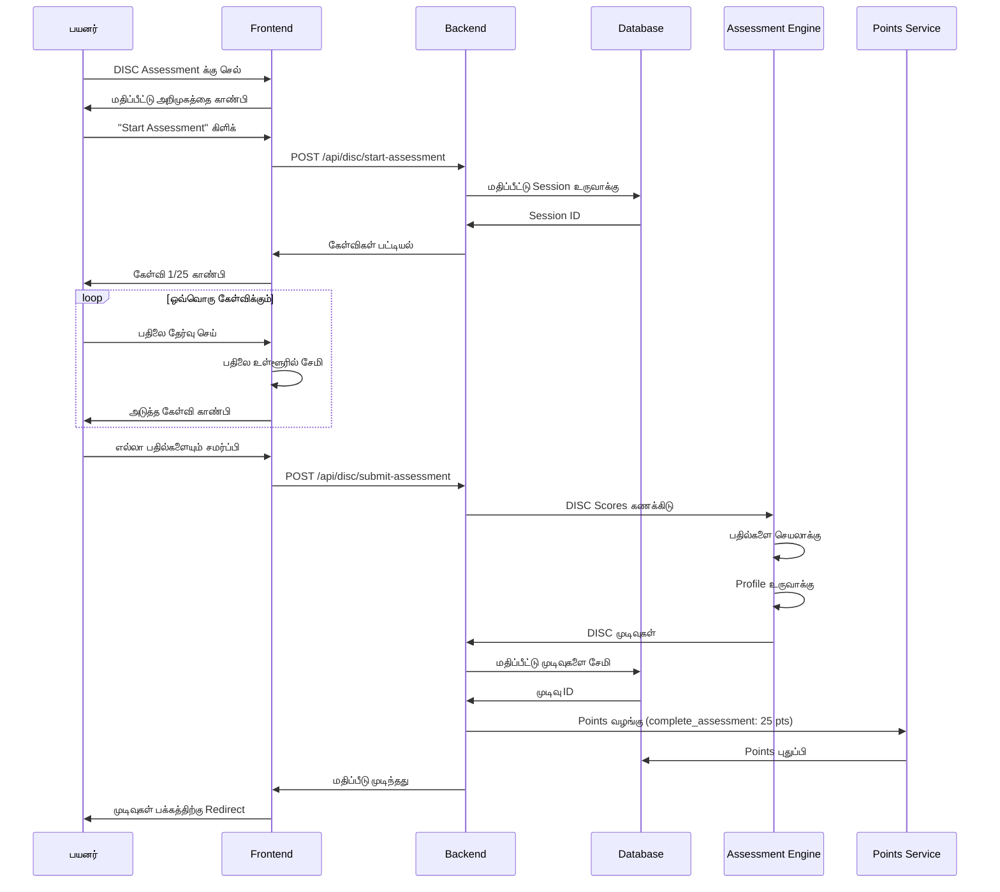
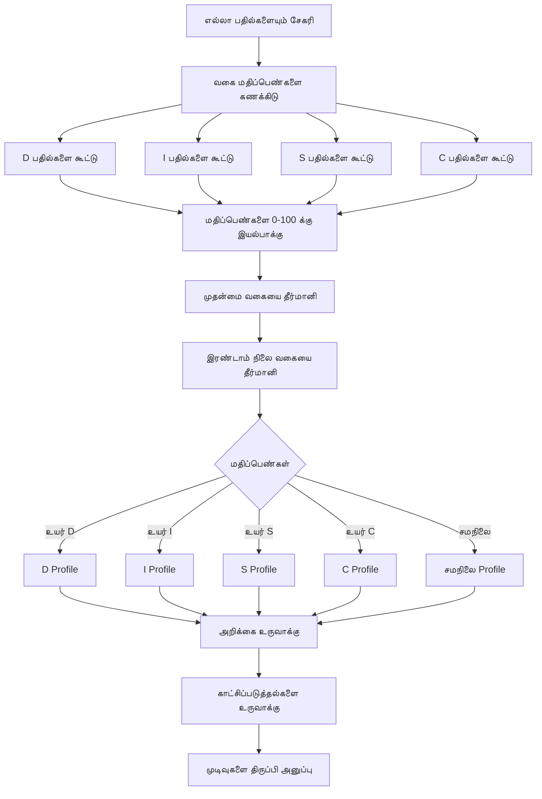
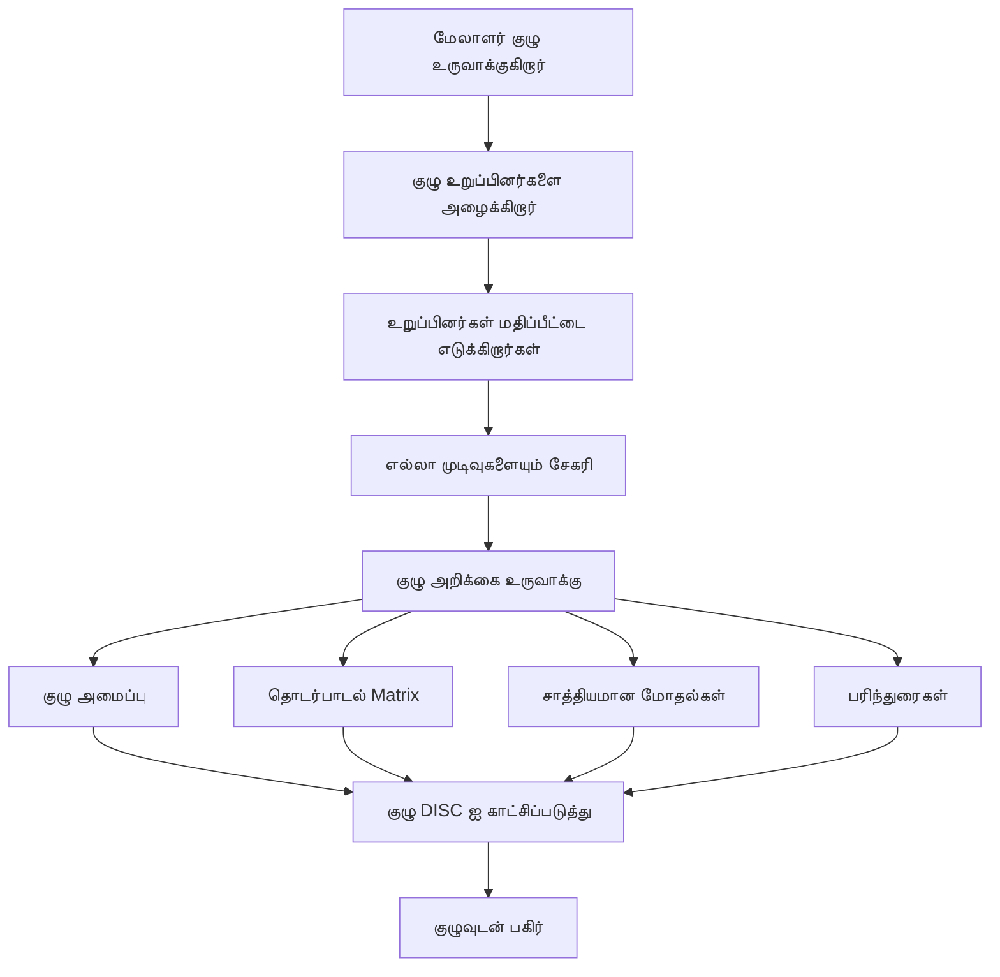

# DISC Assessment - ஆளுமை விவரக்குறிப்பு கருவி

## கண்ணோட்டம்

**DISC Assessment** என்பது DISC ஆளுமை மாதிரியை அடிப்படையாகக் கொண்ட WytNet இல் உள்ள ஒரு விரிவான ஆளுமை மதிப்பீட்டு கருவியாகும். இது பயனர்களுக்கு அவர்களின் நடத்தை பாணிகளை புரிந்துகொள்ள, தொடர்பாடலை மேம்படுத்த மற்றும் குழு ஒத்துழைப்பை மேம்படுத்த உதவுகிறது. மதிப்பீடு ஆளுமைகளை நான்கு முக்கிய வகைகளாக வகைப்படுத்துகிறது: Dominance, Influence, Steadiness மற்றும் Conscientiousness.

### DISC என்றால் என்ன?

DISC என்பது உளவியலாளர் William Moulton Marston இன் DISC கோட்பாட்டை அடிப்படையாகக் கொண்ட ஒரு நடத்தை மதிப்பீட்டு கருவியாகும். இது நான்கு வெவ்வேறு ஆளுமை பண்புகளை மையமாகக் கொண்டுள்ளது:

- **D - Dominance**: நேரடியான, முடிவு-சார்ந்த, தீர்மானகரமான, சிக்கல்-தீர்ப்பவர்கள்
- **I - Influence**: வெளிப்புற, உற்சாகமான, நம்பிக்கை நிறைந்த, வற்புறுத்துபவர்கள்
- **S - Steadiness**: சமமான மனநிலை, இணக்கமான, பொறுமையான, தாழ்மையான
- **C - Conscientiousness**: பகுப்பாய்வு, ஒதுக்கப்பட்ட, துல்லியமான, முறையான

### முக்கிய அம்சங்கள்

- **25-கேள்வி மதிப்பீடு**: விரைவான மற்றும் துல்லியமான ஆளுமை மதிப்பீடு
- **விரிவான அறிக்கைகள்**: விரிவான ஆளுமை பிரிவு
- **காட்சி Graphs**: DISC profile visualization
- **பலங்கள் & பலவீனங்கள்**: தனிப்பட்ட பண்புகளை அடையாளம் காணுதல்
- **தொழில் வழிகாட்டுதல்**: Profile அடிப்படையில் பொருத்தமான தொழில் பாதைகள்
- **இணக்கம் பகுப்பாய்வு**: மற்றவர்களுடன் profiles ஒப்பிடுதல்
- **குழு அறிக்கைகள்**: Aggregate குழு DISC profiles
- **PDF Export**: முடிவுகளை Download செய்து பகிர்தல்
- **முன்னேற்ற கண்காணிப்பு**: மாற்றங்களை கண்காணிக்க மீண்டும் மதிப்பீடு செய்தல்

---

## DISC ஆளுமை வகைகள்

### D - Dominance

**பண்புகள்**:
- முடிவு-சார்ந்த
- நேரடி மற்றும் தீர்மானகரமான
- சிக்கல்-தீர்ப்பவர்
- ரிஸ்க் எடுப்பவர்
- போட்டித்தன்மையுள்ள
- வலுவான விருப்பமுள்ள

**பலங்கள்**:
- விஷயங்களை முடிக்கிறார்
- முன்முயற்சி எடுக்கிறார்
- விரைவான முடிவுகள் எடுக்கிறார்
- சவால்களை ஏற்றுக்கொள்கிறார்

**பலவீனங்கள்**:
- பொறுமையின்மையாக இருக்கலாம்
- உணர்வற்றவராக தோன்றலாம்
- கோரிக்கையுடன் இருக்கலாம்
- வழக்கத்தை விரும்பாதவர்

**சிறந்த பாத்திரங்கள்**: CEO, தொழில்முனைவோர், விற்பனை மேலாளர், திட்ட மேலாளர்

---

### I - Influence

**பண்புகள்**:
- வெளிப்புற மற்றும் உற்சாகமான
- நம்பிக்கை நிறைந்த
- வற்புறுத்தும்
- நம்பிக்கையுள்ள
- உந்துதல் நிறைந்த
- படைப்பாற்றல் உள்ள

**பலங்கள்**:
- சிறந்த தொடர்பாடலாளர்
- மற்றவர்களை ஊக்குவிக்கிறார்
- உற்சாகத்தை உருவாக்குகிறார்
- உறவுகளை உருவாக்குகிறார்

**பலவீனங்கள்**:
- ஒழுங்கற்றவராக இருக்கலாம்
- அதிக உறுதி அளிக்கலாம்
- புறக்கணிக்கப்படுவதை விரும்பாதவர்
- அதிகம் நம்புபவராக இருக்கலாம்

**சிறந்த பாத்திரங்கள்**: சந்தைப்படுத்தல், பொது உறவுகள், விற்பனை, நிகழ்வு திட்டமிடல்

---

### S - Steadiness

**பண்புகள்**:
- நம்பகமான மற்றும் நிலையான
- பொறுமையான மற்றும் அமைதியான
- விசுவாசமான மற்றும் ஆதரவான
- நல்ல கேட்பவர்
- குழு வீரர்
- மாற்றத்தை எதிர்க்கும்

**பலங்கள்**:
- சிறந்த கேட்பவர்
- குழு-சார்ந்த
- பொறுமையான மற்றும் அமைதியான
- நம்பகமான மற்றும் நிலையான

**பலவீனங்கள்**:
- மாற்றத்தை எதிர்க்கிறார்
- தீர்மானமற்றவராக இருக்கலாம்
- மோதலை தவிர்க்கிறார்
- முன்முயற்சி இல்லாதவராக இருக்கலாம்

**சிறந்த பாத்திரங்கள்**: வாடிக்கையாளர் சேவை, HR, கற்பித்தல், சுகாதாரம்

---

### C - Conscientiousness

**பண்புகள்**:
- பகுப்பாய்வு மற்றும் முறையான
- விவர-சார்ந்த
- உயர் தரநிலைகள்
- எச்சரிக்கையான
- இராஜதந்திரமான
- துல்லியமான

**பலங்கள்**:
- உயர் தர வேலை
- பகுப்பாய்வு சிந்தனை
- ஒழுங்கமைக்கப்பட்ட மற்றும் முறையான
- நடைமுறைகளை பின்பற்றுகிறார்

**பலவீனங்கள்**:
- அதிகமாக விமர்சனமாக இருக்கலாம்
- முடிவுகள் எடுக்க மெதுவாக
- உணர்வற்றவராக தோன்றலாம்
- விமர்சனத்திற்கு பயப்படுகிறார்

**சிறந்த பாத்திரங்கள்**: கணக்கியல், பொறியியல், தர உறுதி, ஆராய்ச்சி

---

## பயனர் Workflow

### 1. மதிப்பீட்டை எடுத்தல்



**API Endpoint**: `POST /api/disc/start-assessment`

**Response**:
```typescript
{
  success: true,
  sessionId: string,
  questions: [
    {
      id: string,
      questionNumber: number,
      question: string,
      options: [
        { id: "a", text: "I am very direct and to the point" },
        { id: "b", text: "I am enthusiastic and persuasive" },
        { id: "c", text: "I am patient and a good listener" },
        { id: "d", text: "I am analytical and detail-oriented" }
      ]
    }
  ]
}
```

---

### 2. மதிப்பீட்டு கேள்விகள்

கேள்விகள் நடத்தை விருப்பங்களை அளவிட வடிவமைக்கப்பட்டுள்ளன:

```typescript
interface AssessmentQuestion {
  id: string;
  questionNumber: number;
  question: string;
  options: Array<{
    id: string;              // "a", "b", "c", "d"
    text: string;
    discType: "D" | "I" | "S" | "C";
    weight: number;          // 1-4 (how strongly it indicates the type)
  }>;
}
```

**கேள்விகள் உதாரணம்**:

1. **"குழு திட்டத்தில் வேலை செய்யும்போது, நான் பொதுவாக..."**
   - A) பொறுப்பு எடுத்து முடிவுகள் எடுக்கிறேன் (D)
   - B) குழு உறுப்பினர்களை ஊக்குவித்து உற்சாகத்தை உருவாக்குகிறேன் (I)
   - C) மற்றவர்களை ஆதரித்து நல்லிணக்கத்தை பராமரிக்கிறேன் (S)
   - D) விவரங்களை பகுப்பாய்வு செய்து துல்லியத்தை உறுதி செய்கிறேன் (C)

2. **"மன அழுத்த சூழ்நிலைகளில், நான் பொதுவாக..."**
   - A) உடனடியாக நடவடிக்கை எடுக்கிறேன் (D)
   - B) மற்றவர்களுடன் பேசிக்கொள்கிறேன் (I)
   - C) அமைதியாகவும் பொறுமையாகவும் இருக்கிறேன் (S)
   - D) சூழ்நிலையை கவனமாக பகுப்பாய்வு செய்கிறேன் (C)

3. **"என் சிறந்த வேலை சூழல்..."**
   - A) வேகமான மற்றும் சவாலான (D)
   - B) ஒத்துழைப்பு மற்றும் சமூக (I)
   - C) நிலையான மற்றும் ஆதரவான (S)
   - D) கட்டமைக்கப்பட்ட மற்றும் ஒழுங்கமைக்கப்பட்ட (C)

---

### 3. மதிப்பெண் அல்காரிதம்



**மதிப்பெண் தர்க்கம்**:

```typescript
function calculateDISCScores(answers: Answer[]): DISCScores {
  const scores = { D: 0, I: 0, S: 0, C: 0 };
  
  // Sum scores for each type
  answers.forEach(answer => {
    const option = findOption(answer.questionId, answer.selectedOption);
    scores[option.discType] += option.weight;
  });
  
  // Normalize to 0-100 scale
  const maxPossibleScore = answers.length * 4; // If all answers were max weight
  const normalized = {
    D: (scores.D / maxPossibleScore) * 100,
    I: (scores.I / maxPossibleScore) * 100,
    S: (scores.S / maxPossibleScore) * 100,
    C: (scores.C / maxPossibleScore) * 100
  };
  
  // Determine primary and secondary types
  const sorted = Object.entries(normalized).sort((a, b) => b[1] - a[1]);
  const primary = sorted[0][0];
  const secondary = sorted[1][0];
  
  return {
    scores: normalized,
    primary,
    secondary,
    profile: determineProfile(normalized)
  };
}

function determineProfile(scores: Record<string, number>): string {
  const threshold = 70;
  
  if (scores.D > threshold) return "Dominant";
  if (scores.I > threshold) return "Influential";
  if (scores.S > threshold) return "Steady";
  if (scores.C > threshold) return "Conscientious";
  
  // Combined profiles
  if (scores.D > 60 && scores.I > 60) return "DI - Driver/Influencer";
  if (scores.I > 60 && scores.S > 60) return "IS - Influencer/Supporter";
  if (scores.S > 60 && scores.C > 60) return "SC - Supporter/Analyst";
  if (scores.C > 60 && scores.D > 60) return "CD - Analyst/Driver";
  
  return "Balanced";
}
```

---

### 4. முடிவுகள் காட்சி

```
┌──────────────────────────────────────────────────┐
│  உங்கள் DISC மதிப்பீட்டு முடிவுகள்              │
│  முடிக்கப்பட்ட தேதி: October 20, 2025           │
├──────────────────────────────────────────────────┤
│                                                  │
│  உங்கள் Profile: DI - Driver/Influencer         │
│  முதன்மை: Dominance (D) - 78%                   │
│  இரண்டாம் நிலை: Influence (I) - 65%             │
│                                                  │
│  ┌────────────────────────────────────────┐    │
│  │        DISC Profile Graph              │    │
│  │                                        │    │
│  │  D ████████████████████░░░░ 78%       │    │
│  │  I ████████████████░░░░░░░░ 65%       │    │
│  │  S ████████░░░░░░░░░░░░░░░░ 35%       │    │
│  │  C ███████░░░░░░░░░░░░░░░░░ 28%       │    │
│  │                                        │    │
│  └────────────────────────────────────────┘    │
│                                                  │
│  📊 விளக்கம்                                    │
│  நீங்கள் ஒரு இயல்பான தலைவர் ஆவீர்கள், முடிவுகளை │
│  பெறும் அதே நேரத்தில் மற்றவர்களை ஊக்குவித்து    │
│  ஊக்குவிக்கிறீர்கள். நீங்கள் நேரடியானவர், உற்சாகமானவர் │
│  மற்றும் வற்புறுத்துபவர்.                        │
│                                                  │
│  ✅ உங்கள் பலங்கள்                              │
│  • முன்முயற்சி எடுத்து முடிவுகளை உந்துகிறார்     │
│  • சிறந்த தொடர்பாடலாளர் மற்றும் ஊக்குவிப்பவர்    │
│  • சவால்கள் மற்றும் மாற்றத்தை ஏற்றுக்கொள்கிறார்   │
│  • வலுவான உறவுகளை உருவாக்குகிறார்              │
│                                                  │
│  ⚠️ மேம்பாட்டிற்கான பகுதிகள்                   │
│  • மெதுவாக்கி அதிகம் கேட்க வேண்டும்             │
│  • விவரங்களில் பொறுமையற்றவராக இருக்கலாம்        │
│  • அதிக தீவிரமாக தோன்றலாம்                     │
│  • உறுதிமொழிகளை பின்பற்ற வேண்டும்              │
│                                                  │
│  💼 சிறந்த தொழில் பாதைகள்                      │
│  • விற்பனை & வணிக மேம்பாடு                      │
│  • தொழில்முனைவு                                 │
│  • சந்தைப்படுத்தல் & PR                         │
│  • குழு தலைமைத்துவம்                           │
│                                                  │
│  🤝 தொடர்பாடல் குறிப்புகள்                     │
│  D உடன்: நேரடியாக இருங்கள், முடிவுகளில் கவனம் செலுத்துங்கள் │
│  I உடன்: நட்பாக இருங்கள், விவாதத்திற்கு நேரம் அனுமதியுங்கள் │
│  S உடன்: பொறுமையாக இருங்கள், ஆதரவு வழங்குங்கள்  │
│  C உடன்: Data வழங்குங்கள், துல்லியம் தேவையை மதியுங்கள் │
│                                                  │
│  [Download PDF] [Share Results] [Retake]        │
│                                                  │
└──────────────────────────────────────────────────┘
```

---

### 5. குழு மதிப்பீடு

நிறுவனங்கள் குழு கட்டமைப்புக்காக DISC ஐ பயன்படுத்தலாம்:



**குழு DISC விநியோகம்**:

```
┌──────────────────────────────────────────────────┐
│  குழு DISC மதிப்பீடு - சந்தைப்படுத்தல் குழு     │
│  12 உறுப்பினர்கள் • முடிக்கப்பட்டது Oct 20, 2025 │
├──────────────────────────────────────────────────┤
│                                                  │
│  குழு அமைப்பு:                                  │
│  🔴 D: 3 உறுப்பினர்கள் (25%) - Drivers         │
│  🟡 I: 5 உறுப்பினர்கள் (42%) - Influencers     │
│  🟢 S: 2 உறுப்பினர்கள் (17%) - Supporters      │
│  🔵 C: 2 உறுப்பினர்கள் (16%) - Analysts        │
│                                                  │
│  ┌────────────────────────────────────────┐    │
│  │   குழு DISC Radar Chart               │    │
│  │                                        │    │
│  │        D (25%)                         │    │
│  │          •                             │    │
│  │         / \                            │    │
│  │        /   \                           │    │
│  │  C (16%)   I (42%)                     │    │
│  │       \   /                            │    │
│  │        \ /                             │    │
│  │         •                              │    │
│  │      S (17%)                           │    │
│  │                                        │    │
│  └────────────────────────────────────────┘    │
│                                                  │
│  குழு பலங்கள்:                                 │
│  ✅ உயர் ஆற்றல் மற்றும் உற்சாகம் (I)           │
│  ✅ வலுவான தொடர்பாடல் திறன்கள்                │
│  ✅ Drivers மற்றும் Supporters இன் நல்ல சமநிலை  │
│                                                  │
│  சாத்தியமான சவால்கள்:                          │
│  ⚠️ விவரங்களில் கவனம் இல்லாமல் இருக்கலாம் (குறைந்த C) │
│  ⚠️ அதிக பகுப்பாய்வு சிந்தனையிலிருந்து பயனடையலாம் │
│                                                  │
│  பரிந்துரைகள்:                                  │
│  💡 விவர வேலையை C-types க்கு ஒதுக்குங்கள்      │
│  💡 வாடிக்கையாளர் தொடர்பாடலுக்கு I-types ஐ பயன்படுத்துங்கள் │
│  💡 திட்ட முடிவுக்கு D-types ஐ பயன்படுத்துங்கள்  │
│  💡 குழு நல்லிணக்கத்திற்கு S-types ஐ நம்புங்கள் │
│                                                  │
└──────────────────────────────────────────────────┘
```

---

## Data Model

### Database Schema

```typescript
// Assessment Sessions
interface AssessmentSession {
  id: string;
  userId: string;
  status: "in_progress" | "completed" | "abandoned";
  startedAt: Date;
  completedAt?: Date;
}

// Assessment Answers
interface AssessmentAnswer {
  id: string;
  sessionId: string;
  questionId: string;
  selectedOption: string;          // "a", "b", "c", "d"
  answeredAt: Date;
}

// Assessment Results
interface AssessmentResult {
  id: string;
  displayId: string;               // DISC0001
  userId: string;
  sessionId: string;
  
  // Scores
  scoreD: number;                  // 0-100
  scoreI: number;
  scoreS: number;
  scoreC: number;
  
  // Profile
  primaryType: "D" | "I" | "S" | "C";
  secondaryType?: "D" | "I" | "S" | "C";
  profileName: string;             // "DI - Driver/Influencer"
  
  // Report Data
  interpretation: string;
  strengths: string[];
  weaknesses: string[];
  careerPaths: string[];
  communicationTips: string[];
  
  // Metadata
  questionCount: number;
  completionTime: number;          // Seconds
  
  // Sharing
  isPublic: boolean;
  shareToken?: string;
  
  createdAt: Date;
}

// Team Assessments
interface TeamAssessment {
  id: string;
  teamId: string;
  name: string;
  description?: string;
  
  // Members
  memberIds: string[];
  
  // Aggregate Results
  avgScoreD: number;
  avgScoreI: number;
  avgScoreS: number;
  avgScoreC: number;
  
  distribution: {
    D: number,                     // Percentage
    I: number,
    S: number,
    C: number
  };
  
  // Report
  teamStrengths: string[];
  teamChallenges: string[];
  recommendations: string[];
  
  createdAt: Date;
  updatedAt: Date;
}
```

---

## API Endpoints

### மதிப்பீட்டை தொடங்கு
```http
POST /api/disc/start-assessment
```

**Response**: Session ID + கேள்விகள்

### மதிப்பீட்டை சமர்ப்பி
```http
POST /api/disc/submit-assessment
Content-Type: application/json

{
  "sessionId": "sess_123",
  "answers": [
    { "questionId": "q1", "selectedOption": "a" },
    { "questionId": "q2", "selectedOption": "c" }
  ]
}
```

### என் முடிவுகளை பெறு
```http
GET /api/disc/my-results
```

### ஒரு முடிவை பெறு
```http
GET /api/disc/results/:id
```

### PDF அறிக்கை Download
```http
GET /api/disc/results/:id/download-pdf
```

### முடிவை பகிர்
```http
POST /api/disc/results/:id/share
```

### குழு மதிப்பீட்டை உருவாக்கு
```http
POST /api/disc/teams
Content-Type: application/json

{
  "name": "Marketing Team",
  "memberIds": ["user1", "user2", "user3"]
}
```

### குழு அறிக்கை பெறு
```http
GET /api/disc/teams/:id/report
```

---

## Frontend Components

### Assessment Question Component

```tsx
import { Card } from "@/components/ui/card";
import { Button } from "@/components/ui/button";
import { RadioGroup, RadioGroupItem } from "@/components/ui/radio-group";
import { Label } from "@/components/ui/label";

interface QuestionProps {
  question: {
    id: string;
    questionNumber: number;
    question: string;
    options: Array<{
      id: string;
      text: string;
    }>;
  };
  selectedAnswer?: string;
  onAnswer: (optionId: string) => void;
  onNext: () => void;
  onPrevious: () => void;
  isFirst: boolean;
  isLast: boolean;
}

export function AssessmentQuestion({
  question,
  selectedAnswer,
  onAnswer,
  onNext,
  onPrevious,
  isFirst,
  isLast
}: QuestionProps) {
  return (
    <Card className="p-6 max-w-2xl mx-auto">
      <div className="mb-4">
        <span className="text-sm text-muted-foreground">
          கேள்வி {question.questionNumber} / 25
        </span>
        <div className="w-full bg-gray-200 rounded-full h-2 mt-2">
          <div
            className="bg-blue-600 h-2 rounded-full transition-all"
            style={{ width: `${(question.questionNumber / 25) * 100}%` }}
          />
        </div>
      </div>
      
      <h3 className="text-xl font-semibold mb-6">{question.question}</h3>
      
      <RadioGroup value={selectedAnswer} onValueChange={onAnswer}>
        {question.options.map((option) => (
          <div
            key={option.id}
            className="flex items-center space-x-3 p-4 border rounded-lg hover:bg-gray-50 cursor-pointer"
          >
            <RadioGroupItem value={option.id} id={option.id} />
            <Label htmlFor={option.id} className="cursor-pointer flex-1">
              {option.text}
            </Label>
          </div>
        ))}
      </RadioGroup>
      
      <div className="flex justify-between mt-6">
        <Button
          variant="outline"
          onClick={onPrevious}
          disabled={isFirst}
        >
          முந்தைய
        </Button>
        
        <Button
          onClick={onNext}
          disabled={!selectedAnswer}
        >
          {isLast ? "சமர்ப்பி" : "அடுத்து"}
        </Button>
      </div>
    </Card>
  );
}
```

---

## தளத்துடன் ஒருங்கிணைப்பு

### WytPoints ஒருங்கிணைப்பு

| செயல் | Points |
|--------|--------|
| மதிப்பீட்டை முடி | 25 |
| முடிவுகளை பகிர் | 5 |
| மீண்டும் மதிப்பீடு செய் (30 நாட்களுக்கு பிறகு) | 10 |
| குழு மதிப்பீட்டில் சேர் | 5 |

### Profile ஒருங்கிணைப்பு

DISC முடிவுகள் பயனர் profiles இல் தோன்றும்:

```typescript
{
  userId: "UR0001",
  profile: {
    discType: "DI",
    discScores: {
      D: 78,
      I: 65,
      S: 35,
      C: 28
    },
    lastAssessment: "2025-10-20"
  }
}
```

---

## பயன்பாட்டு வழக்குகள்

### 1. தனிப்பட்ட மேம்பாடு
- உங்கள் தொடர்பாடல் பாணியை புரிந்துகொள்ளுங்கள்
- பலங்கள் மற்றும் பார்வையற்ற இடங்களை அடையாளம் காணுங்கள்
- தொழில் மேம்பாட்டை திட்டமிடுங்கள்
- சுய-விழிப்புணர்வை மேம்படுத்துங்கள்

### 2. குழு கட்டமைப்பு
- குழு இயக்கவியலை புரிந்துகொள்ளுங்கள்
- குழு தொடர்பாடலை மேம்படுத்துங்கள்
- பலங்களின் அடிப்படையில் பாத்திரங்களை ஒதுக்குங்கள்
- மோதல்களை தீர்க்கவும்

### 3. வேலைக்கு எடுத்தல் & ஆட்சேர்ப்பு
- வேட்பாளர் பொருத்தத்தை மதிப்பிடுங்கள்
- வேலை பாணி விருப்பங்களை புரிந்துகொள்ளுங்கள்
- சமநிலையான குழுக்களை உருவாக்குங்கள்
- வேலை செயல்திறனை முன்னறிவியுங்கள்

### 4. தலைமைத்துவ மேம்பாடு
- தலைமைத்துவ பாணியை தழுவுங்கள்
- குழு மேலாண்மையை மேம்படுத்துங்கள்
- தொடர்பாடலை மேம்படுத்துங்கள்
- பல்வேறு குழுக்களை உருவாக்குங்கள்

---

## தொடர்புடைய ஆவணங்கள்

- [MyWyt Apps](./mywyt-apps.md)
- [பயனர் Profile](./user-registration.md)
- [Points அமைப்பு](../architecture/points-system.md)
- [PDF உருவாக்கம்](../architecture/pdf-generation.md)
