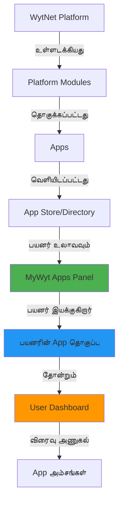
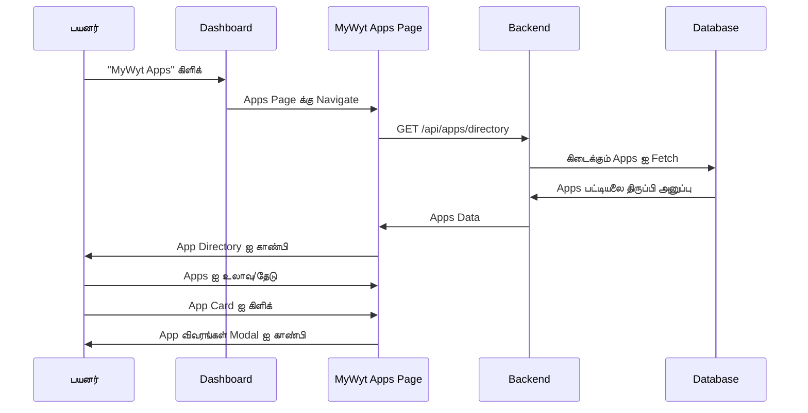
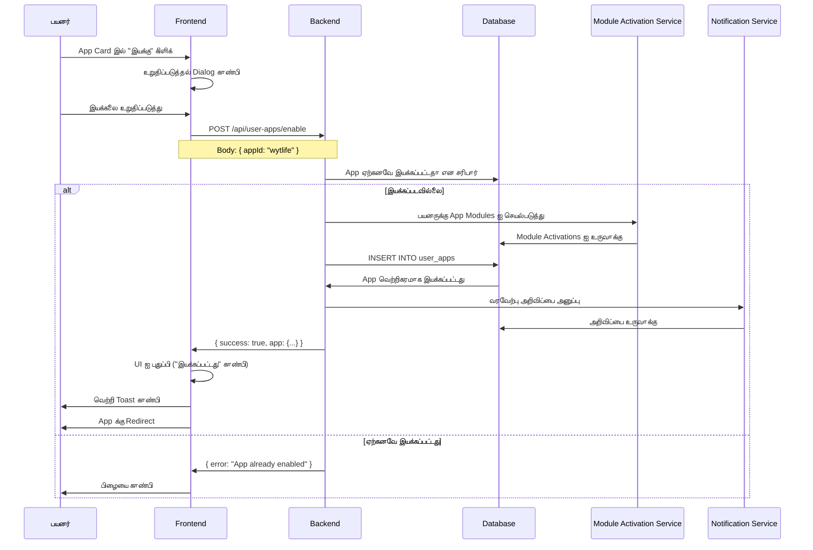
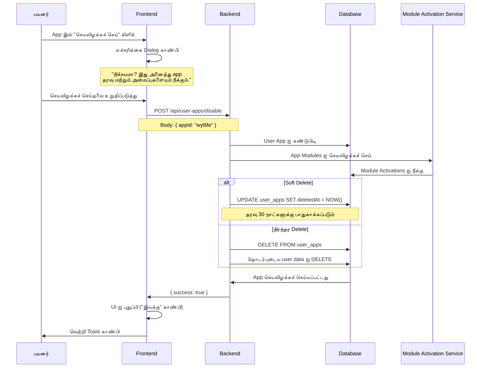
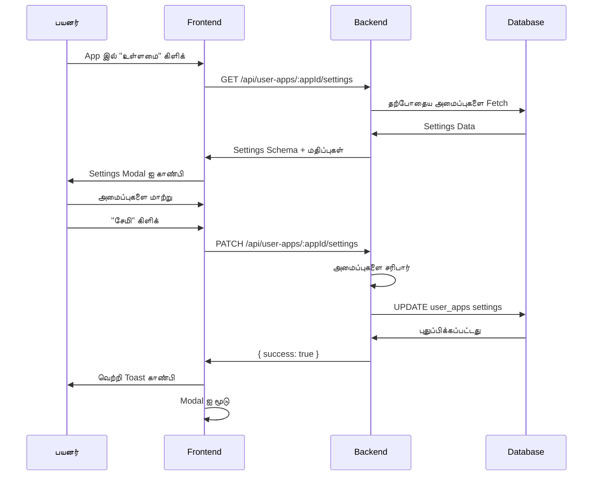

# MyWyt Apps - தனிப்பட்ட App Dashboard

## கண்ணோட்டம்

**MyWyt Apps** என்பது WytNet.com இல் உள்ள தனிப்பட்ட application dashboard, பயனர்கள் கண்டுபிடிக்க, இயக்க, மற்றும் தங்கள் applications தொகுப்பை நிர்வகிக்க முடியும். இது WytNet தளத்தில் கிடைக்கும் அனைத்து apps க்கும் ஒரு மையப்படுத்தப்பட்ட கட்டுப்பாட்டு பேனலாக செயல்படுகிறது, பயனர்கள் தாங்கள் பயன்படுத்த விரும்பும் apps ஐ தேர்வு செய்வதன் மூலம் தங்கள் அனுபவத்தை தனிப்பயனாக்க அனுமதிக்கிறது.

### முக்கிய கருத்துக்கள்

- **App கண்டுபிடிப்பு**: WytNet ecosystem இல் கிடைக்கும் apps ஐ உலாவவும் தேடவும்
- **இயக்கு/செயலிழக்கச் செய்**: உங்கள் தனிப்பட்ட panel இல் apps ஐ on அல்லது off செய்யவும்
- **App உள்ளமைவு**: ஒவ்வொரு இயக்கப்பட்ட app க்கும் அமைப்புகளை தனிப்பயனாக்கவும்
- **Dashboard ஒருங்கிணைப்பு**: உங்கள் அனைத்து செயலில் உள்ள apps க்கும் தடையற்ற அணுகல்
- **Module அடிப்படையிலான**: Apps platform modules இலிருந்து உருவாக்கப்படுகின்றன

---

## கட்டமைப்பு கண்ணோட்டம்



**பாய்வு**:
1. Platform Modules நிர்வாகிகளால் உருவாக்கப்படுகின்றன
2. Modules தொகுக்கப்பட்டு Apps உருவாக்கப்படுகின்றன
3. Apps App Directory இல் வெளியிடப்படுகின்றன
4. பயனர்கள் MyWyt Apps panel இல் apps ஐ உலாவுகிறார்கள்
5. பயனர்கள் தாங்கள் விரும்பும் apps ஐ இயக்குகிறார்கள்
6. இயக்கப்பட்ட apps user dashboard இல் தோன்றும்
7. பயனர்கள் dashboard இலிருந்து app அம்சங்களை அணுகுகிறார்கள்

---

## பயனர் Workflow

### 1. Apps ஐ கண்டுபிடித்தல்



**App Directory Page அமைப்பு**:

```
┌──────────────────────────────────────────────────┐
│  MyWyt Apps                                      │
│  உங்கள் applications ஐ கண்டுபிடித்து நிர்வகிக்கவும் │
├──────────────────────────────────────────────────┤
│                                                  │
│  [Search: "Apps ஐ தேடு..."]  [Filter ▼]         │
│                                                  │
│  வகைகள்:                                         │
│  [அனைத்தும்] [சமூக] [வணிகம்] [உற்பத்தித்திறன்]  │
│  [தொடர்பு] [கருவிகள்] [விளையாட்டுகள்]            │
│                                                  │
├──────────────────────────────────────────────────┤
│                                                  │
│  🌐 WytWall         [✓ இயக்கப்பட்டது]  [உள்ளமை]    │
│  சமூக வர்த்தக Feed                              │
│  தேவைகளை இடு, சலுகைகளை கண்டுபிடி, உள்நாட்டில் இணை │
│  ⭐⭐⭐⭐⭐ 4.8 (1.2k பயனர்கள்)                     │
│                                                  │
├──────────────────────────────────────────────────┤
│                                                  │
│  🤖 AI Directory    [+ இயக்கு]                   │
│  தேர்ந்தெடுக்கப்பட்ட AI கருவிகள் Database       │
│  உங்கள் தேவைகளுக்கான AI கருவிகளை ஆராயவும் கண்டுபிடிக்கவும் │
│  ⭐⭐⭐⭐ 4.6 (850 பயனர்கள்)                        │
│                                                  │
├──────────────────────────────────────────────────┤
│                                                  │
│  📋 DISC Assessment [+ இயக்கு]                   │
│  ஆளுமை மதிப்பீட்டு கருவி                         │
│  உங்கள் DISC ஆளுமை சுயவிவரத்தை கண்டுபிடிக்கவும்   │
│  ⭐⭐⭐⭐⭐ 4.9 (2.3k பயனர்கள்)                     │
│                                                  │
└──────────────────────────────────────────────────┘
```

---

### 2. App ஐ இயக்குதல்



**API Endpoint**: `POST /api/user-apps/enable`

**Request Body**:
```typescript
{
  appId: string // எ.கா., "wytwall", "ai-directory"
}
```

**Response**:
```typescript
{
  success: true,
  app: {
    id: string,
    appId: string,
    userId: string,
    enabledAt: Date,
    settings: {
      // App-specific அமைப்புகள்
      notifications: boolean,
      visibility: "public" | "private"
    }
  },
  modulesActivated: string[] // செயல்படுத்தப்பட்ட module IDs பட்டியல்
}
```

---

### 3. App ஐ செயலிழக்கச் செய்தல்



**API Endpoint**: `POST /api/user-apps/disable`

**Request Body**:
```typescript
{
  appId: string,
  permanent?: boolean // இயல்புநிலை: false (soft delete)
}
```

**Response**:
```typescript
{
  success: true,
  message: "App வெற்றிகரமாக செயலிழக்கச் செய்யப்பட்டது",
  dataRetentionDays: 30 // Soft delete என்றால்
}
```

---

### 4. App ஐ உள்ளமைத்தல்

ஒவ்வொரு app க்கும் அதன் சொந்த உள்ளமைவு அமைப்புகள் இருக்கலாம்.



**அமைப்புகளை பெறு**: `GET /api/user-apps/:appId/settings`

**Response**:
```typescript
{
  success: true,
  settings: {
    notifications: {
      type: "boolean",
      label: "அறிவிப்புகளை இயக்கு",
      description: "App செயல்பாடுகளுக்கான அறிவிப்புகளை பெறு",
      value: true
    },
    visibility: {
      type: "select",
      label: "காணல்தன்மை",
      description: "உங்கள் app செயல்பாடுகளை யார் பார்க்க முடியும்",
      options: ["public", "private", "connections"],
      value: "public"
    },
    theme: {
      type: "select",
      label: "தீம்",
      options: ["light", "dark", "auto"],
      value: "auto"
    }
  }
}
```

**அமைப்புகளை புதுப்பி**: `PATCH /api/user-apps/:appId/settings`

**Request Body**:
```typescript
{
  notifications: true,
  visibility: "private",
  theme: "dark"
}
```

---

## Dashboard ஒருங்கிணைப்பு

### Apps உடன் User Dashboard

```
┌──────────────────────────────────────────────────┐
│  மீண்டும் வரவேற்கிறோம், John! (UR0001)          │
│  புதன்கிழமை, அக்டோபர் 20, 2025                  │
├──────────────────────────────────────────────────┤
│                                                  │
│  📊 விரைவு புள்ளிவிவரங்கள்                      │
│  ┌──────┬──────┬──────┬──────┐                 │
│  │இடுகை│ Apps │புள்ளி│ Level│                 │
│  │  12  │  5   │ 245  │Silver│                 │
│  └──────┴──────┴──────┴──────┘                 │
│                                                  │
├──────────────────────────────────────────────────┤
│                                                  │
│  🚀 எனது Apps                  [Apps நிர்வகி →]│
│                                                  │
│  ┌─────────┬─────────┬─────────┬─────────┐    │
│  │🌐       │🤖       │📋       │💼       │    │
│  │WytWall  │AI Dir   │DISC     │WytLife │    │
│  │         │         │         │         │    │
│  │[திற]    │[திற]    │[திற]    │[திற]    │    │
│  └─────────┴─────────┴─────────┴─────────┘    │
│                                                  │
│  ┌─────────┬─────────┐                         │
│  │📱       │         │                         │
│  │QR Gen   │ + மேலும்│                         │
│  │         │ Apps    │                         │
│  │[திற]    │ சேர்     │                         │
│  └─────────┴─────────┘                         │
│                                                  │
├──────────────────────────────────────────────────┤
│                                                  │
│  📰 சமீபத்திய செயல்பாடு                         │
│  • WytWall இல் ஒரு Need இடுகை - 2 மணி முன்பு   │
│  • DISC Assessment நிறைவு - 1 நாள் முன்பு        │
│  • AI Directory இல் 3 AI கருவிகள் சேமிப்பு - 2 நாட்கள் முன்பு │
│                                                  │
└──────────────────────────────────────────────────┘
```

---

## App Card Component

### Frontend செயல்படுத்தல்

```tsx
import { Card, CardHeader, CardTitle, CardDescription, CardContent } from "@/components/ui/card";
import { Button } from "@/components/ui/button";
import { Badge } from "@/components/ui/badge";
import { Star, Settings } from "lucide-react";
import { useMutation } from "@tanstack/react-query";
import { apiRequest, queryClient } from "@/lib/queryClient";

interface AppCardProps {
  app: {
    id: string;
    name: string;
    description: string;
    icon: string;
    category: string;
    rating: number;
    userCount: number;
    isEnabled: boolean;
  };
}

export function AppCard({ app }: AppCardProps) {
  const enableApp = useMutation({
    mutationFn: () => apiRequest("/api/user-apps/enable", "POST", { appId: app.id }),
    onSuccess: () => {
      queryClient.invalidateQueries({ queryKey: ["/api/apps/directory"] });
      queryClient.invalidateQueries({ queryKey: ["/api/user-apps"] });
    }
  });
  
  const disableApp = useMutation({
    mutationFn: () => apiRequest("/api/user-apps/disable", "POST", { appId: app.id }),
    onSuccess: () => {
      queryClient.invalidateQueries({ queryKey: ["/api/apps/directory"] });
      queryClient.invalidateQueries({ queryKey: ["/api/user-apps"] });
    }
  });
  
  return (
    <Card>
      <CardHeader>
        <div className="flex items-start justify-between">
          <div className="flex items-center gap-3">
            <div className="text-4xl">{app.icon}</div>
            <div>
              <CardTitle>{app.name}</CardTitle>
              <CardDescription>{app.category}</CardDescription>
            </div>
          </div>
          {app.isEnabled && (
            <Badge variant="default" className="bg-green-500">
              இயக்கப்பட்டது
            </Badge>
          )}
        </div>
      </CardHeader>
      
      <CardContent>
        <p className="text-sm text-muted-foreground mb-4">
          {app.description}
        </p>
        
        <div className="flex items-center gap-2 mb-4">
          <div className="flex items-center">
            {[...Array(5)].map((_, i) => (
              <Star
                key={i}
                className={`w-4 h-4 ${
                  i < Math.floor(app.rating)
                    ? "fill-yellow-400 text-yellow-400"
                    : "text-gray-300"
                }`}
              />
            ))}
          </div>
          <span className="text-sm text-muted-foreground">
            {app.rating} ({app.userCount.toLocaleString()} பயனர்கள்)
          </span>
        </div>
        
        <div className="flex gap-2">
          {app.isEnabled ? (
            <>
              <Button variant="outline" size="sm" onClick={() => disableApp.mutate()}>
                செயலிழக்கச் செய்
              </Button>
              <Button variant="default" size="sm">
                <Settings className="w-4 h-4 mr-1" />
                உள்ளமை
              </Button>
            </>
          ) : (
            <Button
              variant="default"
              size="sm"
              onClick={() => enableApp.mutate()}
              disabled={enableApp.isPending}
            >
              {enableApp.isPending ? "இயக்குகிறது..." : "+ இயக்கு"}
            </Button>
          )}
        </div>
      </CardContent>
    </Card>
  );
}
```

---

## தரவு மாதிரி

### Database Schema

```typescript
// Apps Catalog (Platform-wide கிடைக்கும் apps)
interface App {
  id: string;                      // UUID
  appId: string;                   // தனிப்பட்ட identifier: "wytwall", "ai-directory"
  displayId: string;               // APP0001
  name: string;
  description: string;
  longDescription?: string;
  icon: string;                    // Emoji அல்லது படம் URL
  category: string;                // "social", "business", "productivity"
  version: string;                 // "1.0.0"
  status: "active" | "beta" | "deprecated";
  
  // இந்த app ஐ உருவாக்கும் Modules
  moduleIds: string[];             // ["social-feed", "post-management", "moderation"]
  
  // மதிப்பீடுகள் & புள்ளிவிவரங்கள்
  rating: number;                  // 0-5
  userCount: number;
  installCount: number;
  
  // விலை நிர்ணயம்
  pricing: "free" | "freemium" | "premium";
  price?: number;
  currency?: string;
  
  // உள்ளமைவு
  configSchema?: object;           // App அமைப்புகளுக்கான JSON Schema
  defaultSettings?: object;
  
  // வெளியீடு
  publishedAt?: Date;
  publishedBy?: string;            // நிர்வாகி ID
  
  createdAt: Date;
  updatedAt: Date;
}

// பயனரின் இயக்கப்பட்ட Apps
interface UserApp {
  id: string;                      // UUID
  userId: string;                  // users க்கு FK
  appId: string;                   // apps.appId க்கு FK
  
  // அமைப்புகள்
  settings: object;                // பயனர்-குறிப்பிட்ட app உள்ளமைவு
  
  // நிலை
  isActive: boolean;
  enabledAt: Date;
  lastUsedAt?: Date;
  usageCount: number;
  
  // Soft Delete
  deletedAt?: Date;
  
  createdAt: Date;
  updatedAt: Date;
}

// Module Activations (இந்த பயனருக்கு என்ன modules செயலில் உள்ளன)
interface ModuleActivation {
  id: string;
  userId: string;
  moduleId: string;
  context: "user" | "hub" | "app";
  contextId?: string;              // context "app" என்றால் appId
  isActive: boolean;
  settings?: object;
  activatedAt: Date;
}
```

---

## API குறிப்பு

### App Directory ஐ பெறு

**Endpoint**: `GET /api/apps/directory`

**Query Parameters**:
```typescript
{
  category?: string,
  search?: string,
  status?: "all" | "enabled" | "disabled",
  page?: number,
  limit?: number
}
```

**Response**:
```typescript
{
  success: true,
  apps: [
    {
      id: string,
      appId: string,
      name: string,
      description: string,
      icon: string,
      category: string,
      rating: number,
      userCount: number,
      pricing: string,
      isEnabled: boolean, // தற்போதைய பயனருக்கு
      isNew: boolean,
      isBeta: boolean
    }
  ],
  pagination: {
    page: number,
    limit: number,
    total: number,
    hasMore: boolean
  }
}
```

---

### பயனரின் இயக்கப்பட்ட Apps ஐ பெறு

**Endpoint**: `GET /api/user-apps`

**Response**:
```typescript
{
  success: true,
  apps: [
    {
      id: string,
      appId: string,
      name: string,
      icon: string,
      category: string,
      enabledAt: Date,
      lastUsedAt: Date,
      usageCount: number,
      settings: object
    }
  ],
  total: number
}
```

---

### App ஐ இயக்கு

**Endpoint**: `POST /api/user-apps/enable`

**Request Body**:
```typescript
{
  appId: string
}
```

**Response**:
```typescript
{
  success: true,
  app: UserApp,
  modulesActivated: string[]
}
```

---

### App ஐ செயலிழக்கச் செய்

**Endpoint**: `POST /api/user-apps/disable`

**Request Body**:
```typescript
{
  appId: string,
  permanent?: boolean
}
```

**Response**:
```typescript
{
  success: true,
  message: string,
  dataRetentionDays?: number
}
```

---

### App அமைப்புகளை பெறு

**Endpoint**: `GET /api/user-apps/:appId/settings`

**Response**:
```typescript
{
  success: true,
  settings: {
    [key: string]: {
      type: "boolean" | "string" | "number" | "select",
      label: string,
      description?: string,
      options?: any[],
      value: any
    }
  }
}
```

---

### App அமைப்புகளை புதுப்பி

**Endpoint**: `PATCH /api/user-apps/:appId/settings`

**Request Body**:
```typescript
{
  [key: string]: any
}
```

**Response**:
```typescript
{
  success: true,
  settings: object
}
```

---

## Module செயல்படுத்தல் அமைப்பு

ஒரு பயனர் app ஐ இயக்கும் போது, அமைப்பு தானாக தேவையான modules ஐ செயல்படுத்துகிறது.

```typescript
// உதாரணம்: WytWall app ஐ இயக்குதல்
async function enableApp(userId: string, appId: string) {
  // 1. App விவரங்களை பெறு
  const app = await db.select().from(apps).where(eq(apps.appId, appId));
  
  // 2. தேவையான modules ஐ பெறு
  const moduleIds = app.moduleIds; // ["social-feed", "post-management"]
  
  // 3. பயனருக்கு ஒவ்வொரு module ஐயும் செயல்படுத்து
  for (const moduleId of moduleIds) {
    await db.insert(moduleActivations).values({
      userId,
      moduleId,
      context: "user",
      contextId: appId,
      isActive: true,
      activatedAt: new Date()
    });
  }
  
  // 4. user_app record ஐ உருவாக்கு
  await db.insert(userApps).values({
    userId,
    appId,
    isActive: true,
    enabledAt: new Date(),
    settings: app.defaultSettings || {}
  });
  
  return { success: true };
}
```

---

## App வகைகள்

MyWyt இல் Apps வகைகளாக ஒழுங்கமைக்கப்பட்டுள்ளன:

| வகை | விளக்கம் | உதாரணங்கள் |
|----------|-------------|----------|
| **சமூக** | சமூக வலைப்பின்னல் மற்றும் சமூகம் | WytWall, Social Circles |
| **வணிகம்** | வணிக மேலாண்மை கருவிகள் | Invoicing, CRM, Leads |
| **உற்பத்தித்திறன்** | செயல்திறனை மேம்படுத்தும் கருவிகள் | Task Manager, Calendar |
| **தொடர்பு** | செய்தி மற்றும் தொடர்பு | Chat, Video Call |
| **கருவிகள்** | பயன்பாட்டு applications | QR Generator, Image Editor |
| **பொழுதுபோக்கு** | விளையாட்டுகள் மற்றும் வேடிக்கை apps | Trivia, Puzzles |
| **கற்றல்** | கல்வி உள்ளடக்கம் | DISC Assessment, Courses |
| **நிதி** | நிதி மேலாண்மை | Expense Tracker, Budget |

---

## பயனர் அனுமதிகள்

| செயல் | பொது பயனர் | உள்நுழைந்த பயனர் | நிர்வாகி |
|--------|-------------|----------------|-------|
| App Directory உலாவு | ✓ | ✓ | ✓ |
| App இயக்கு | ✗ | ✓ | ✓ |
| App செயலிழக்கச் செய் | ✗ | ✓ | ✓ |
| App உள்ளமை | ✗ | ✓ (சொந்த apps) | ✓ |
| App வெளியிடு | ✗ | ✗ | ✓ |
| App நீக்கு | ✗ | ✗ | ✓ |

---

## Screenshots விளக்கம்

### 1. MyWyt Apps Directory
**அமைப்பு**: வடிப்பான்களுடன் app cards இன் Grid
**உறுப்புகள்**:
- மேலே தேடல் பட்டை
- வகை tabs (அனைத்தும், சமூக, வணிகம், போன்றவை)
- Grid அமைப்பில் app cards (desktop இல் 3-4 நெடுவரிசைகள்)
- ஒவ்வொரு card காட்டுகிறது: icon, பெயர், விளக்கம், மதிப்பீடு, பயனர் எண்ணிக்கை, இயக்கு/செயலிழக்கச் செய் பொத்தான்

### 2. App விவரம் Modal
**அமைப்பு**: விரிவான app தகவலுடன் modal overlay
**உறுப்புகள்**:
- பெரிய app icon
- App பெயர் மற்றும் வகை
- அம்சங்கள் பட்டியலுடன் நீண்ட விளக்கம்
- Screenshots carousel
- மதிப்பீடுகள் மற்றும் மதிப்புரைகள் பிரிவு
- இயக்கு/உள்ளமை பொத்தான்கள்
- "புதிதாக என்ன" version குறிப்புகள்

### 3. My Apps Dashboard Widget
**அமைப்பு**: விரைவு அணுகலுடன் இயக்கப்பட்ட apps இன் Grid
**உறுப்புகள்**:
- Grid இல் app icons (2x3 அல்லது 3x3)
- Icons கீழே app பெயர்கள்
- Hover இல் "திற" பொத்தான்
- இறுதியில் "+ மேலும் Apps சேர்" card

### 4. App அமைப்புகள் Modal
**அமைப்பு**: App-specific அமைப்புகளுடன் படிவம்
**உறுப்புகள்**:
- அமைப்புகள் பிரிவுகள் (அறிவிப்புகள், தனியுரிமை, தோற்றம்)
- Boolean அமைப்புகளுக்கு Toggle switches
- விருப்பங்களுக்கு Dropdown selects
- சேமி/ரத்து பொத்தான்கள்

---

## தொடர்புடைய ஆவணங்கள்

- [முக்கிய கருத்துக்கள்](../core-concepts.md)
- [Platform Modules](../architecture/modules.md)
- [WytWall App](./wytwall.md)
- [AI Directory App](./ai-directory.md)
- [DISC Assessment App](./disc-assessment.md)
- [QR Generator App](./qr-generator.md)
- [WytLife App](./wytlife.md)
