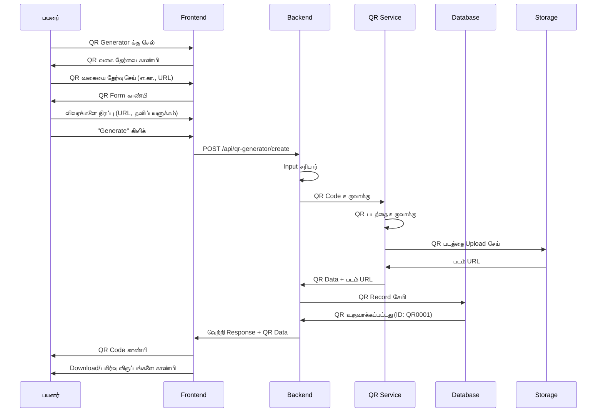
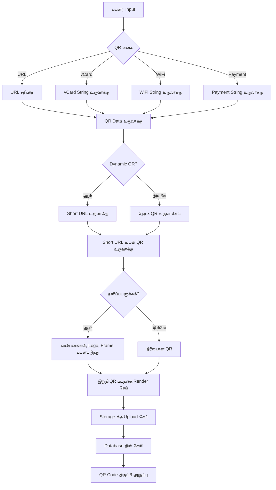
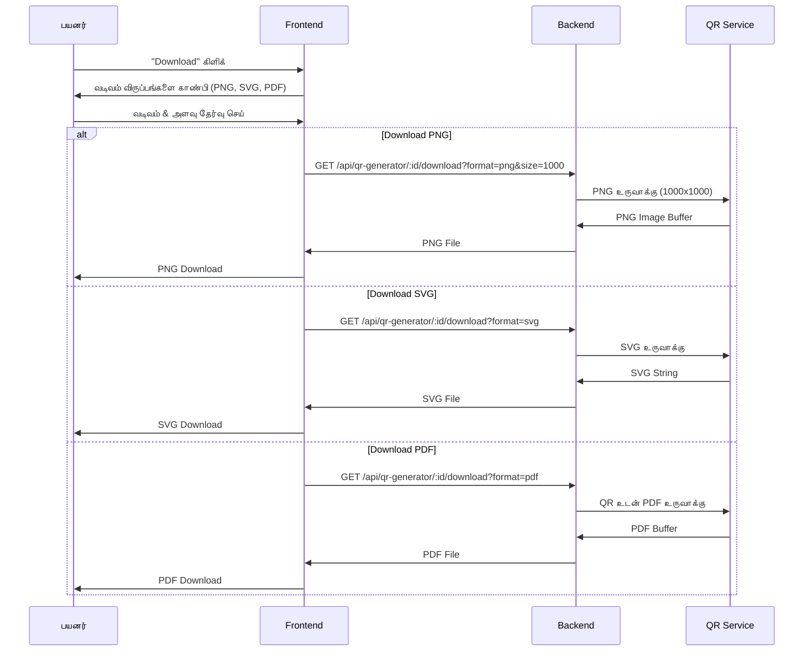
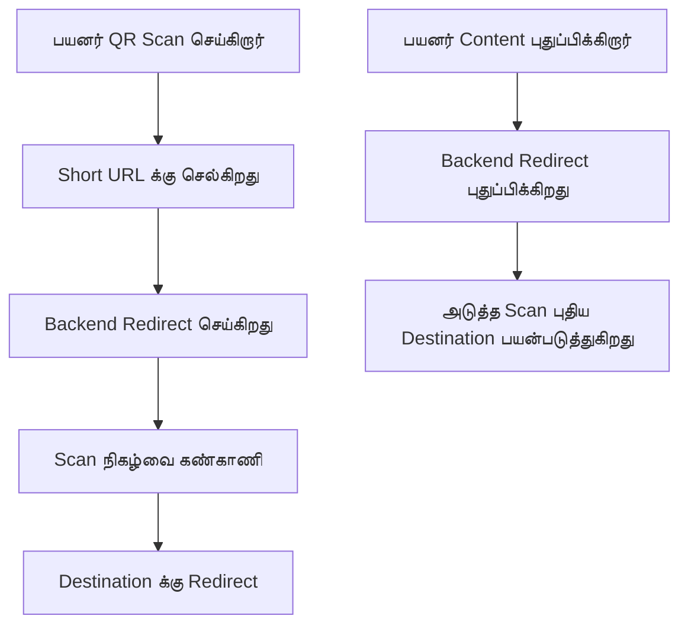
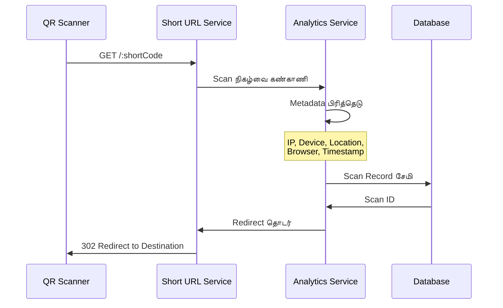

# QR Generator - QR Code உருவாக்கும் கருவி

## கண்ணோட்டம்

**QR Generator** என்பது WytNet இல் உள்ள ஒரு பல்துறை QR code உருவாக்கும் கருவியாகும், இது பல்வேறு நோக்கங்களுக்காக QR codes ஐ உருவாக்க, தனிப்பயனாக்க மற்றும் நிர்வகிக்க பயனர்களுக்கு உதவுகிறது. எளிய URL links முதல் சிக்கலான vCards, WiFi credentials மற்றும் payment தகவல் வரை, QR Generator tracking மற்றும் analytics உடன் தொழில்முறை QR codes ஐ உருவாக்குவதை எளிதாக்குகிறது.

### முக்கிய அம்சங்கள்

- **பல QR வகைகள்**: URLs, Text, vCards, WiFi, Email, SMS, Payments
- **தனிப்பயனாக்கம்**: வண்ணங்கள், logos, frames, shapes
- **Batch உருவாக்கம்**: ஒரே நேரத்தில் பல QR codes உருவாக்கு
- **பகுப்பாய்வு & கண்காணிப்பு**: Scans, இடங்கள், சாதனங்களை கண்காணி
- **Download வடிவங்கள்**: PNG, SVG, PDF
- **Dynamic QR Codes**: QR code ஐ மாற்றாமல் content ஐ திருத்து
- **QR Code மேலாண்மை**: உங்கள் எல்லா QR codes ஐ ஒழுங்கமைத்து நிர்வகி
- **பகிரக்கூடிய Links**: Link மூலம் QR codes ஐ பகிர்

---

## QR Code வகைகள்

### 1. URL QR Code
Websites க்கு link செய்யும் QR codes ஐ உருவாக்கு

**பயன்பாட்டு வழக்குகள்**:
- வணிக websites
- Social media profiles
- தயாரிப்பு பக்கங்கள்
- நிகழ்வு பதிவுகள்

### 2. Text QR Code
சாதாரண text தகவல்

**பயன்பாட்டு வழக்குகள்**:
- அறிவுறுத்தல்கள்
- செய்திகள்
- Serial எண்கள்
- தயாரிப்பு தகவல்

### 3. vCard QR Code
Digital வணிக அட்டை

**பயன்பாட்டு வழக்குகள்**:
- தொடர்பு தகவல்
- தொழில்முறை networking
- நிகழ்வு பங்கேற்பாளர்கள்

### 4. WiFi QR Code
WiFi network credentials

**பயன்பாட்டு வழக்குகள்**:
- Cafes & உணவகங்கள்
- Hotels
- அலுவலகங்கள்
- வீட்டு networks

### 5. Email QR Code
முன்-நிரப்பப்பட்ட email

**பயன்பாட்டு வழக்குகள்**:
- வாடிக்கையாளர் ஆதரவு
- கருத்து சேகரிப்பு
- தொடர்பு படிவங்கள்

### 6. SMS QR Code
முன்-நிரப்பப்பட்ட text message

**பயன்பாட்டு வழக்குகள்**:
- Opt-in பிரச்சாரங்கள்
- வாடிக்கையாளர் சேவை
- வாக்களிப்பு/வாக்கெடுப்பு

### 7. Payment QR Code
Payment தகவல் (UPI, PayPal, etc.)

**பயன்பாட்டு வழக்குகள்**:
- வணிகர் payments
- நன்கொடைகள்
- பில் பிரித்தல்
- Tips

---

## பயனர் Workflow

### 1. QR Code உருவாக்குதல்



**API Endpoint**: `POST /api/qr-generator/create`

**Request Body**:
```typescript
{
  type: "url" | "text" | "vcard" | "wifi" | "email" | "sms" | "payment",
  data: {
    // For URL type
    url?: string,
    
    // For vCard type
    firstName?: string,
    lastName?: string,
    phone?: string,
    email?: string,
    company?: string,
    title?: string,
    
    // For WiFi type
    ssid?: string,
    password?: string,
    encryption?: "WPA" | "WEP" | "none",
    
    // For Payment type
    upiId?: string,
    amount?: number,
    note?: string,
    
    // Generic
    text?: string
  },
  customization: {
    foregroundColor?: string,     // Hex color
    backgroundColor?: string,
    logoUrl?: string,             // Center logo
    frameStyle?: "none" | "simple" | "rounded",
    dotStyle?: "square" | "rounded" | "dots",
    size?: number                 // 300-2000 px
  },
  settings: {
    isDynamic?: boolean,          // Can edit content later
    expiresAt?: Date,
    maxScans?: number,
    trackingEnabled?: boolean
  },
  name?: string,                  // Internal name for organization
  description?: string
}
```

**Response**:
```typescript
{
  success: true,
  qrCode: {
    id: string,
    displayId: "QR0001",
    type: "url",
    imageUrl: string,             // PNG image URL
    shortUrl: string,             // Short tracking URL
    data: object,                 // Original data
    customization: object,
    scanCount: 0,
    createdAt: Date
  }
}
```

---

### 2. QR Code உருவாக்கும் செயல்முறை



---

### 3. QR Codes ஐ Download செய்தல்



---

### 4. Dynamic QR Codes

Dynamic QR codes QR code ஐ மீண்டும் அச்சிடாமல் destination ஐ மாற்ற அனுமதிக்கின்றன.



**Dynamic QR Content புதுப்பி**:
```http
PATCH /api/qr-generator/:id/content
Content-Type: application/json

{
  "url": "https://new-destination.com",
  "expiresAt": "2026-01-01T00:00:00Z"
}
```

---

### 5. கண்காணிப்பு & பகுப்பாய்வு



**Scan Data சேகரிக்கப்பட்டது**:
```typescript
interface QRScan {
  id: string;
  qrCodeId: string;
  timestamp: Date;
  ip: string;
  country?: string;
  city?: string;
  device: string;              // "mobile", "desktop", "tablet"
  os: string;                  // "iOS", "Android", "Windows"
  browser: string;             // "Chrome", "Safari", etc.
  referer?: string;
}
```

**Analytics API**: `GET /api/qr-generator/:id/analytics`

**Response**:
```typescript
{
  success: true,
  analytics: {
    totalScans: 245,
    uniqueScans: 189,
    scansByDate: [
      { date: "2025-10-20", scans: 15 },
      { date: "2025-10-19", scans: 23 }
    ],
    scansByDevice: {
      mobile: 180,
      desktop: 50,
      tablet: 15
    },
    scansByCountry: {
      "India": 200,
      "USA": 30,
      "UK": 15
    },
    topCities: [
      { city: "Chennai", scans: 85 },
      { city: "Mumbai", scans: 60 }
    ]
  }
}
```

---

## QR Code மேலாண்மை

### என் QR Codes Dashboard

```
┌──────────────────────────────────────────────────┐
│  என் QR Codes                   [+ Create New]   │
├──────────────────────────────────────────────────┤
│                                                  │
│  [QR codes தேடு...]  [Filter ▼]  [Sort ▼]      │
│                                                  │
│  செயலில் உள்ள QR Codes (12)                    │
│                                                  │
│  ┌────────────────────────────────────────┐    │
│  │ [QR படம்]  Website முகப்புப்பக்கம்      │    │
│  │             URL • Dynamic                │    │
│  │             245 scans • உருவாக்கப்பட்டது Oct 1  │    │
│  │             [View Analytics] [Edit] [⋮]  │    │
│  └────────────────────────────────────────┘    │
│                                                  │
│  ┌────────────────────────────────────────┐    │
│  │ [QR படம்]  WiFi - அலுவலக Network        │    │
│  │             WiFi • Static                │    │
│  │             89 scans • உருவாக்கப்பட்டது Sep 15  │    │
│  │             [View Details] [Download] [⋮]│    │
│  └────────────────────────────────────────┘    │
│                                                  │
│  ┌────────────────────────────────────────┐    │
│  │ [QR படம்]  என் வணிக அட்டை              │    │
│  │             vCard • Static               │    │
│  │             156 scans • உருவாக்கப்பட்டது Aug 20 │    │
│  │             [View Details] [Download] [⋮]│    │
│  └────────────────────────────────────────┘    │
│                                                  │
└──────────────────────────────────────────────────┘
```

---

## Data Model

### Database Schema

```typescript
// QR Codes
interface QRCode {
  id: string;                      // UUID
  displayId: string;               // QR0001
  userId: string;                  // FK to users
  
  // QR Details
  type: "url" | "text" | "vcard" | "wifi" | "email" | "sms" | "payment";
  name?: string;                   // User-defined name
  description?: string;
  
  // QR Data
  data: object;                    // Type-specific data
  
  // QR Image
  imageUrl: string;                // URL to generated QR image
  shortUrl?: string;               // For dynamic QRs
  shortCode?: string;              // Short code part
  
  // Customization
  customization: {
    foregroundColor: string,
    backgroundColor: string,
    logoUrl?: string,
    frameStyle: string,
    dotStyle: string,
    size: number
  };
  
  // Settings
  isDynamic: boolean;
  trackingEnabled: boolean;
  expiresAt?: Date;
  maxScans?: number;
  
  // Stats
  scanCount: number;
  uniqueScanCount: number;
  lastScannedAt?: Date;
  
  // Status
  status: "active" | "expired" | "disabled";
  
  createdAt: Date;
  updatedAt: Date;
}

// QR Scans
interface QRScan {
  id: string;
  qrCodeId: string;                // FK to qr_codes
  
  // Scan metadata
  timestamp: Date;
  ip: string;
  country?: string;
  city?: string;
  latitude?: number;
  longitude?: number;
  
  // Device info
  device: string;                  // mobile, desktop, tablet
  os: string;
  browser: string;
  userAgent: string;
  
  // Referrer
  referer?: string;
  
  createdAt: Date;
}
```

---

## API Endpoints

### QR Code உருவாக்கு
```http
POST /api/qr-generator/create
Content-Type: application/json

{
  "type": "url",
  "data": { "url": "https://example.com" },
  "customization": {
    "foregroundColor": "#000000",
    "backgroundColor": "#FFFFFF"
  },
  "settings": {
    "isDynamic": true,
    "trackingEnabled": true
  }
}
```

### என் QR Codes பெறு
```http
GET /api/qr-generator/my-codes?page=1&limit=20
```

### ஒரு QR Code பெறு
```http
GET /api/qr-generator/:id
```

### QR Code புதுப்பி
```http
PATCH /api/qr-generator/:id
Content-Type: application/json

{
  "name": "Updated Name",
  "data": { "url": "https://new-url.com" }
}
```

### QR Code நீக்கு
```http
DELETE /api/qr-generator/:id
```

### QR Code Download
```http
GET /api/qr-generator/:id/download?format=png&size=1000
```

### Analytics பெறு
```http
GET /api/qr-generator/:id/analytics
```

### Scan கண்காணி (Short URL redirect)
```http
GET /qr/:shortCode
```

---

## Frontend Components

### QR Generator Form Component

```tsx
import { useState } from "react";
import { Card } from "@/components/ui/card";
import { Button } from "@/components/ui/button";
import { Input } from "@/components/ui/input";
import { Label } from "@/components/ui/label";
import { Select } from "@/components/ui/select";
import { useMutation } from "@tanstack/react-query";
import { apiRequest } from "@/lib/queryClient";

export function QRGeneratorForm() {
  const [qrType, setQRType] = useState("url");
  const [url, setUrl] = useState("");
  const [foregroundColor, setForegroundColor] = useState("#000000");
  const [backgroundColor, setBackgroundColor] = useState("#FFFFFF");
  
  const generateQR = useMutation({
    mutationFn: (data) => apiRequest("/api/qr-generator/create", "POST", data),
    onSuccess: (result) => {
      // Show generated QR code
      console.log("QR Generated:", result.qrCode);
    }
  });
  
  const handleGenerate = () => {
    generateQR.mutate({
      type: qrType,
      data: { url },
      customization: {
        foregroundColor,
        backgroundColor,
        size: 500
      },
      settings: {
        isDynamic: true,
        trackingEnabled: true
      }
    });
  };
  
  return (
    <Card className="p-6">
      <h2 className="text-2xl font-bold mb-4">Generate QR Code</h2>
      
      <div className="space-y-4">
        <div>
          <Label>QR வகை</Label>
          <Select value={qrType} onValueChange={setQRType}>
            <option value="url">URL</option>
            <option value="text">Text</option>
            <option value="vcard">vCard</option>
            <option value="wifi">WiFi</option>
          </Select>
        </div>
        
        {qrType === "url" && (
          <div>
            <Label>URL</Label>
            <Input
              type="url"
              value={url}
              onChange={(e) => setUrl(e.target.value)}
              placeholder="https://example.com"
            />
          </div>
        )}
        
        <div className="grid grid-cols-2 gap-4">
          <div>
            <Label>Foreground வண்ணம்</Label>
            <Input
              type="color"
              value={foregroundColor}
              onChange={(e) => setForegroundColor(e.target.value)}
            />
          </div>
          <div>
            <Label>Background வண்ணம்</Label>
            <Input
              type="color"
              value={backgroundColor}
              onChange={(e) => setBackgroundColor(e.target.value)}
            />
          </div>
        </div>
        
        <Button
          onClick={handleGenerate}
          disabled={generateQR.isPending}
          className="w-full"
        >
          {generateQR.isPending ? "உருவாக்குகிறது..." : "Generate QR Code"}
        </Button>
      </div>
    </Card>
  );
}
```

---

## தளத்துடன் ஒருங்கிணைப்பு

### WytPoints ஒருங்கிணைப்பு

| செயல் | Points |
|--------|--------|
| QR Code உருவாக்கு | 2 |
| QR Scan செய்யப்பட்டது (ஒவ்வொரு 10 scans க்கும்) | 1 |
| QR Code பகிர் | 1 |

### WytWall ஒருங்கிணைப்பு

பயனர்கள் தங்கள் QR codes ஐ WytWall இல் பகிரலாம்:
```typescript
{
  postType: "qr_code",
  title: "என் புதிய website ஐ பாருங்கள்!",
  description: "வருகை தர Scan செய்யுங்கள்",
  media: [qrCode.imageUrl],
  metadata: {
    qrCodeId: qrCode.id,
    qrType: qrCode.type
  }
}
```

---

## பயன்பாட்டு வழக்கு உதாரணங்கள்

### 1. உணவகம் மெனு
```typescript
{
  type: "url",
  data: {
    url: "https://restaurant.com/menu"
  },
  name: "உணவக மெனு QR",
  customization: {
    foregroundColor: "#8B4513",
    logoUrl: "https://restaurant.com/logo.png"
  },
  settings: {
    isDynamic: true,  // பருவகாலமாக மெனு புதுப்பி
    trackingEnabled: true
  }
}
```

### 2. WiFi அணுகல்
```typescript
{
  type: "wifi",
  data: {
    ssid: "CafeWiFi",
    password: "coffee123",
    encryption: "WPA"
  },
  name: "Cafe WiFi QR",
  customization: {
    foregroundColor: "#4A90E2",
    frameStyle: "rounded"
  }
}
```

### 3. வணிக அட்டை
```typescript
{
  type: "vcard",
  data: {
    firstName: "John",
    lastName: "Doe",
    phone: "+91-9876543210",
    email: "john@example.com",
    company: "Tech Corp",
    title: "CEO",
    website: "https://johndoe.com"
  },
  name: "என் வணிக அட்டை",
  customization: {
    logoUrl: "https://johndoe.com/photo.jpg"
  }
}
```

---

## தொடர்புடைய ஆவணங்கள்

- [MyWyt Apps](./mywyt-apps.md)
- [Media Upload](../architecture/media-upload.md)
- [Analytics அமைப்பு](../architecture/analytics.md)
- [Points அமைப்பு](../architecture/points-system.md)
