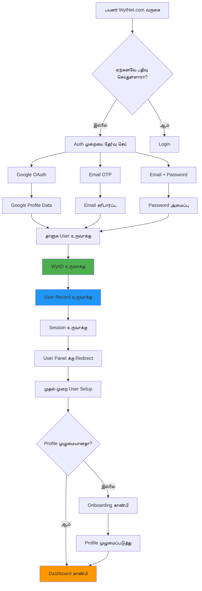
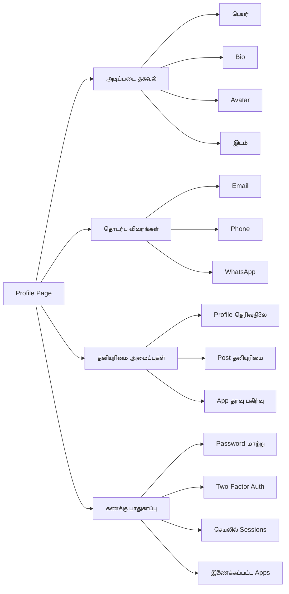
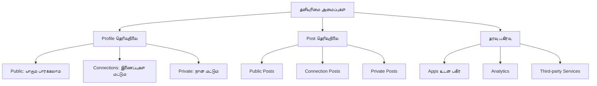
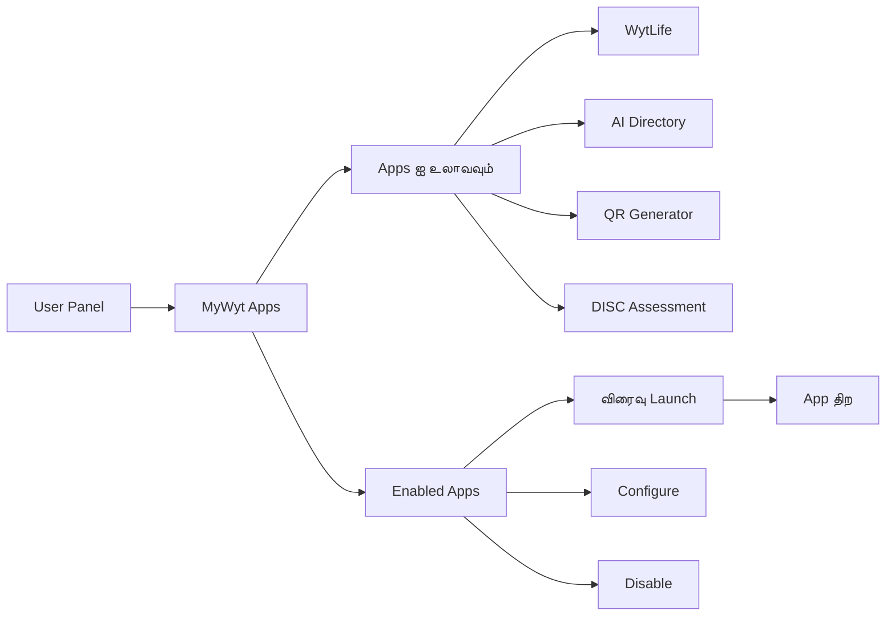

# பயனர் பதிவு & பயனர் Panel

## பயனர் பதிவு Workflow

### முழுமையான பதிவு பாய்வு



### பதிவு தரவு பாய்வு

**படி 1: அங்கீகார முறையை தேர்வு செய்**
```typescript
// பயனர் மூன்று முறைகளில் ஒன்றை தேர்ந்தெடுக்கிறார்
type AuthMethod = 'google' | 'email_otp' | 'email_password';
```

**படி 2: பயனர் தகவலை சேகரி**
```typescript
interface RegistrationData {
  // Google OAuth இலிருந்து
  email: string;
  name?: string;
  avatar?: string;
  googleId?: string;
  
  // Email/Password க்கு
  password?: string;
  
  // System மூலம் உருவாக்கப்பட்டது
  displayId: string; // எ.கா., UR0000001
  authProvider: AuthMethod;
  emailVerified: boolean;
}
```

**படி 3: User Record உருவாக்கு**
```sql
INSERT INTO users (
  id,
  display_id,
  email,
  name,
  avatar,
  auth_provider,
  email_verified,
  created_at
) VALUES (
  gen_random_uuid(),
  generate_display_id('UR'), -- UR0000001
  'user@example.com',
  'John Doe',
  'https://avatar.url',
  'google',
  true,
  NOW()
);
```

**படி 4: Session உருவாக்கு**
- Session PostgreSQL இல் சேமிக்கப்படுகிறது
- httpOnly cookie அமைக்கப்படுகிறது
- 7-நாள் காலாவதி
- பயனர் dashboard க்கு redirect செய்யப்படுகிறார்

---

## User Panel கண்ணோட்டம்

User Panel என்பது login செய்த பிறகு பதிவு செய்யப்பட்ட பயனர்களுக்கான முக்கிய dashboard.

### Panel அமைப்பு

```
┌─────────────────────────────────────────────────┐
│  Header: Logo | Search | Notifications | Avatar │
├─────────────────────────────────────────────────┤
│ ┌─────────┬─────────────────────────────────┐  │
│ │         │                                 │  │
│ │ Sidebar │      Main Content Area          │  │
│ │         │                                 │  │
│ │  Menu   │  - Dashboard / Home             │  │
│ │  Items  │  - MyWyt Apps                   │  │
│ │         │  - WytWall Feed                 │  │
│ │         │  - Profile Settings             │  │
│ │         │  - Notifications                │  │
│ └─────────┴─────────────────────────────────┘  │
├─────────────────────────────────────────────────┤
│  Footer: Links | Copyright | Social             │
└─────────────────────────────────────────────────┘
```

### Desktop Navigation (Sidebar)
```
📊 Dashboard
📱 MyWyt Apps
🌐 WytWall
🔔 Notifications
⚙️ Settings
👤 Profile
📝 Posts
❤️ Saved Items
🚪 Logout
```

### Mobile Navigation (Bottom Nav)
```
🏠 Home    📱 Apps    🌐 Wall    👤 Profile
```

---

## User Dashboard அம்சங்கள்

### 1. Profile Overview Card

```typescript
interface UserProfile {
  displayId: string;          // UR0000001
  name: string;
  email: string;
  phoneNumber?: string;
  whatsappNumber?: string;
  avatar?: string;
  bio?: string;
  location?: string;
  joinedDate: Date;
  
  // புள்ளிவிவரங்கள்
  stats: {
    postsCount: number;
    appsEnabled: number;
    connectionsCount: number;
  }
}
```

**காட்சி உதாரணம்**:
```
┌─────────────────────────────────────┐
│  [Avatar]  John Doe (UR0000001)    │
│            user@example.com         │
│            +91 98765 43210          │
│                                     │
│  Bio: Full-stack developer          │
│  Location: Chennai, India           │
│  Joined: Jan 20, 2025               │
│                                     │
│  📝 12 Posts  📱 5 Apps  👥 24 Conn │
└─────────────────────────────────────┘
```

### 2. Quick Actions

- **Edit Profile**: தனிப்பட்ட தகவலை புதுப்பி
- **Manage Apps**: MyWyt Apps ஐ enable/disable செய்
- **Create Post**: WytWall க்கு விரைவு post
- **View Notifications**: சமீபத்திய செயல்பாடு
- **Settings**: கணக்கு மற்றும் தனியுரிமை அமைப்புகள்

### 3. Recent Activity

- சமீபத்திய WytWall posts
- App இடைச்செயல்கள்
- இணைப்பு கோரிக்கைகள்
- System அறிவிப்புகள்

### 4. Enabled Apps Widget

தற்போது செயலில் உள்ள MyWyt Apps ஐ விரைவு அணுகலுடன் காட்டுகிறது:
- WytLife
- AI Directory
- QR Generator
- DISC Assessment

---

## Profile மேலாண்மை

### தனிப்பட்ட தகவல்



### Profile புதுப்பிப்பு பாய்வு

```typescript
// Update profile API
PATCH /api/user/profile

Request:
{
  "name": "John Doe",
  "bio": "Full-stack developer",
  "phoneNumber": "+919876543210",
  "avatar": "https://cdn.wytnet.com/avatars/user.jpg"
}

Response:
{
  "success": true,
  "user": { /* புதுப்பிக்கப்பட்ட user object */ }
}
```

---

## அறிவிப்பு அமைப்பு

### அறிவிப்பு வகைகள்

```typescript
type NotificationType =
  | 'post_approved'      // உங்கள் WytWall post ஒப்புதல் செய்யப்பட்டது
  | 'post_rejected'      // உங்கள் post நிராகரிக்கப்பட்டது
  | 'post_liked'         // யாரோ உங்கள் post ஐ விரும்பினார்
  | 'post_commented'     // உங்கள் post இல் புதிய comment
  | 'new_follower'       // யாரோ உங்களை follow செய்தார்
  | 'app_enabled'        // புதிய app enabled செய்யப்பட்டது
  | 'system_update'      // தள அறிவிப்பு
  | 'security_alert';    // பாதுகாப்பு தொடர்பான அறிவிப்பு

interface Notification {
  id: string;
  type: NotificationType;
  title: string;
  message: string;
  read: boolean;
  actionUrl?: string;
  createdAt: Date;
}
```

### அறிவிப்பு காட்சி

**படிக்காத எண்ணிக்கை Badge**:
```
🔔 (3)  ← படிக்காத எண்ணிக்கையை காட்டுகிறது
```

**அறிவிப்பு பட்டியல்**:
```
┌──────────────────────────────────────┐
│ 🎉 Post ஒப்புதல் செய்யப்பட்டது       │
│    உங்கள் post "Welcome..." live ஆகிவிட்டது │
│    2 மணிநேரம் முன்பு              [×] │
├──────────────────────────────────────┤
│ ❤️ புதிய Like                        │
│    John உங்கள் post ஐ விரும்பினார்    │
│    5 மணிநேரம் முன்பு              [×] │
├──────────────────────────────────────┤
│ 💬 புதிய Comment                     │
│    Sarah உங்கள் post இல் comment செய்தார் │
│    1 நாள் முன்பு                   [×] │
└──────────────────────────────────────┘
```

### Real-time புதுப்பிப்புகள்
- Live அறிவிப்புகளுக்கு WebSocket connection
- Browser push அறிவிப்புகள் (PWA)
- Email அறிவிப்புகள் (உள்ளமைக்கக்கூடியது)

---

## அமைப்புகள் & விருப்பத்தேர்வுகள்

### கணக்கு அமைப்புகள்

```typescript
interface UserSettings {
  // தனியுரிமை
  profileVisibility: 'public' | 'connections' | 'private';
  showEmail: boolean;
  showPhone: boolean;
  
  // அறிவிப்புகள்
  emailNotifications: boolean;
  pushNotifications: boolean;
  notificationTypes: NotificationType[];
  
  // App விருப்பத்தேர்வுகள்
  enabledApps: string[]; // App IDs
  defaultLandingPage: '/dashboard' | '/apps' | '/wall';
  
  // காட்சி
  theme: 'light' | 'dark' | 'auto';
  language: 'en' | 'ta';
}
```

### தனியுரிமை கட்டுப்பாடுகள்



---

## Session மேலாண்மை

### செயலில் Sessions

பயனர்கள் எல்லா செயலில் உள்ள login sessions ஐ பார்க்கலாம் மற்றும் நிர்வகிக்கலாம்:

```
┌─────────────────────────────────────────┐
│ தற்போதைய Session (நீங்கள்)              │
│ 🖥️ Chrome on Windows                    │
│ Chennai, India                          │
│ கடைசியாக செயலில்: இப்போதுதான்      [×] │
├─────────────────────────────────────────┤
│ 📱 Mobile Safari                        │
│ Mumbai, India                           │
│ கடைசியாக செயலில்: 2 மணிநேரம் முன்பு [×] │
└─────────────────────────────────────────┘

[மற்ற எல்லா Sessions இலிருந்தும் Logout]
```

### Session பாதுகாப்பு
- IP முகவரிகளை பார்
- சாதனம் மற்றும் browser தகவலை பார்
- கடைசியாக செயலில் இருந்த timestamps
- தனிப்பட்ட sessions ஐ revoke செய்
- எல்லா சாதனங்களிலிருந்தும் logout

---

## App ஒருங்கிணைப்பு

### MyWyt Apps அணுகல்

User Panel இலிருந்து, பயனர்கள்:

1. **Apps ஐ கண்டுபிடி**: கிடைக்கும் MyWyt Apps ஐ உலாவவும்
2. **Apps ஐ Enable செய்**: தங்கள் கணக்கிற்கு apps ஐ activate செய்
3. **Apps ஐ Configure செய்**: App-குறிப்பிட்ட விருப்பத்தேர்வுகளை அமை
4. **Apps ஐ Launch செய்**: Enabled apps க்கு விரைவு அணுகல்



---

## Mobile அனுபவம்

### Responsive வடிவமைப்பு

**Mobile அமைப்பு**:
- கீழ் navigation bar (fixed)
- Swipeable panels
- Touch-optimized controls
- Optimized images மற்றும் lazy loading

**Touch Gestures**:
- வலதுபுறம் Swipe: Menu திற
- இடதுபுறம் Swipe: Menu மூடு
- கீழே Pull: Refresh
- Posts இல் மேலே Swipe: மேலும் load செய்

### PWA அம்சங்கள்

- **Home Screen இல் Install**: WytNet ஐ app ஆக சேர்
- **Offline Mode**: முக்கிய pages ஐ cache செய்
- **Push Notifications**: Real-time alerts
- **Background Sync**: மீண்டும் online ஆகும்போது upload

---

## API Endpoints

### User Profile பெறு
```http
GET /api/user/profile

Response 200:
{
  "id": "uuid",
  "displayId": "UR0000001",
  "name": "John Doe",
  "email": "user@example.com",
  ...
}
```

### Profile புதுப்பி
```http
PATCH /api/user/profile
Content-Type: application/json

{
  "name": "John Doe",
  "bio": "Developer",
  "phoneNumber": "+919876543210"
}

Response 200:
{
  "success": true,
  "user": { ... }
}
```

### அறிவிப்புகளை பெறு
```http
GET /api/user/notifications?page=1&limit=20

Response 200:
{
  "notifications": [...],
  "total": 45,
  "unread": 3
}
```

### அறிவிப்பை படிக்கப்பட்டதாக குறி
```http
PATCH /api/user/notifications/:id/read

Response 200:
{
  "success": true
}
```

### User அமைப்புகளை பெறு
```http
GET /api/user/settings

Response 200:
{
  "profileVisibility": "public",
  "emailNotifications": true,
  ...
}
```

### அமைப்புகளை புதுப்பி
```http
PATCH /api/user/settings
Content-Type: application/json

{
  "profileVisibility": "connections",
  "pushNotifications": true
}

Response 200:
{
  "success": true,
  "settings": { ... }
}
```

---

## அடுத்த படிகள்

- [WytWall Feature →](/ta/features/wytwall)
- [MyWyt Apps →](/ta/features/mywyt-apps)
- [API குறிப்பு →](/ta/api/user)
