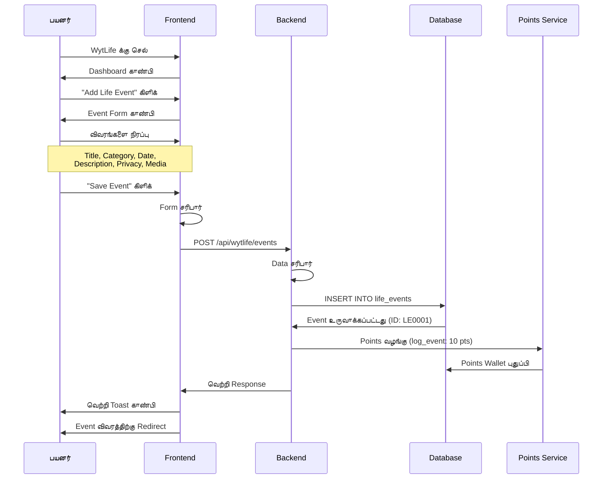
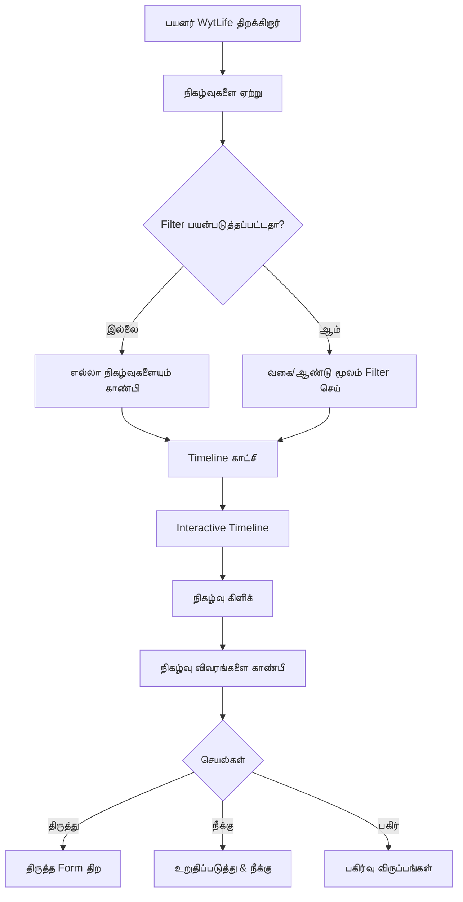
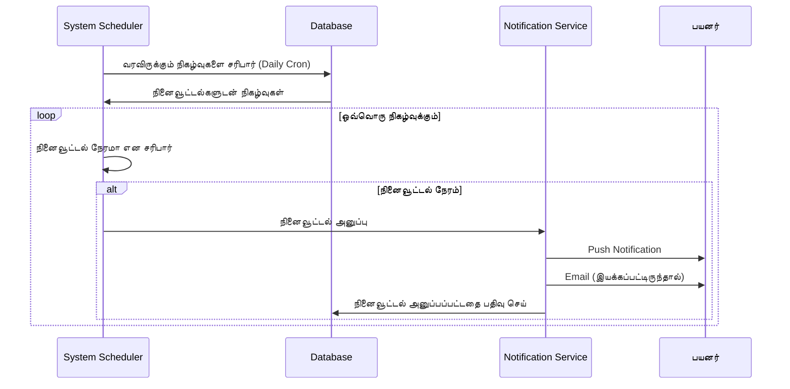
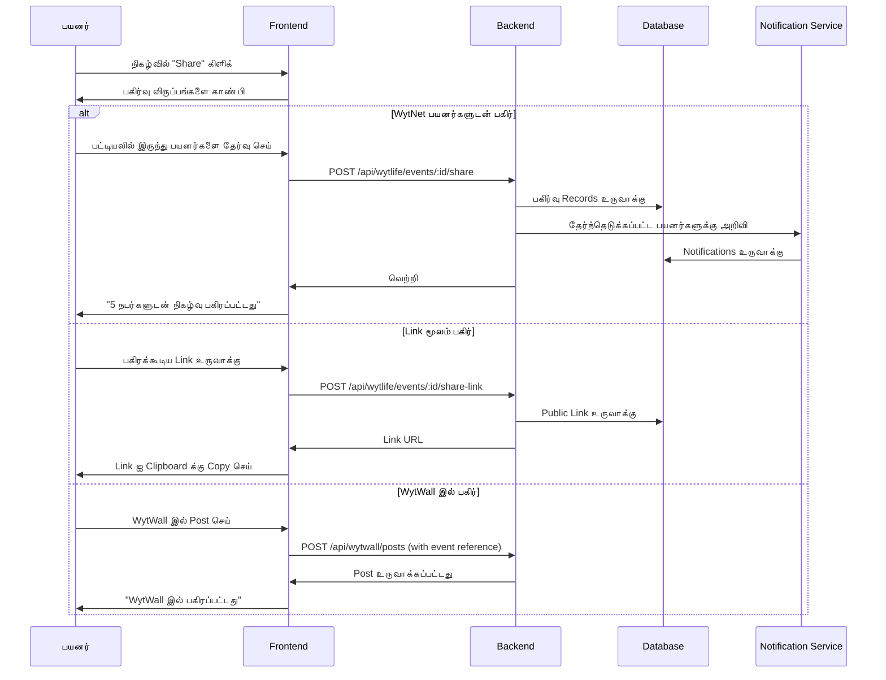

# WytLife - வாழ்க்கை முறை & வாழ்க்கை நிகழ்வுகள் மேலாண்மை

## கண்ணோட்டம்

**WytLife** என்பது WytNet இல் உள்ள ஒரு விரிவான வாழ்க்கை முறை மற்றும் வாழ்க்கை நிகழ்வுகள் மேலாண்மை app ஆகும், இது பயனர்கள் தங்கள் வாழ்க்கையின் முக்கியமான தருணங்களை ஒழுங்கமைக்க, கொண்டாட மற்றும் நினைவுபடுத்த உதவுகிறது. இது ஒரு digital journal ஆக செயல்படுகிறது, நிகழ்வு திட்டமிடல் மற்றும் மைல்கல் கண்காணிப்புடன் இணைந்து, WytNet இன் சமூக அம்சங்களுடன் ஒருங்கிணைக்கப்பட்டுள்ளது.

### முக்கிய அம்சங்கள்

- **வாழ்க்கை நிகழ்வுகள் கண்காணிப்பு**: முக்கிய வாழ்க்கை நிகழ்வுகளை பதிவு செய்து வகைப்படுத்துதல்
- **மைல்கல் மேலாண்மை**: தனிப்பட்ட மற்றும் குடும்ப மைல்கற்களை அமைத்து கண்காணித்தல்
- **நிகழ்வு திட்டமிடல்**: கொண்டாட்டங்கள், கூட்டங்கள் மற்றும் சிறப்பு நிகழ்வுகளை திட்டமிடுதல்
- **நினைவக Timeline**: வாழ்க்கையின் முக்கியமான தருணங்களின் காட்சி timeline
- **பகிரப்பட்ட நிகழ்வுகள்**: குடும்பம் மற்றும் நண்பர்களுடன் நிகழ்வுகளில் ஒத்துழைத்தல்
- **நினைவூட்டல்கள் & அறிவிப்புகள்**: முக்கியமான தேதிகளை ஒருபோதும் மறக்காதீர்கள்
- **புகைப்படம் & Media ஒருங்கிணைப்பு**: நிகழ்வுகளுக்கு புகைப்படங்கள், videos மற்றும் documents இணைத்தல்
- **WytPoints ஒருங்கிணைப்பு**: வாழ்க்கை நிகழ்வுகளை பதிவு செய்வதற்கு points சம்பாதித்தல்

---

## பயன்பாட்டு வழக்குகள்

### தனிப்பட்ட பயன்பாட்டு வழக்குகள்

1. **வாழ்க்கை மைல்கற்கள்**
   - திருமணம்
   - குழந்தை பிறப்பு
   - பட்டம் பெறுதல்
   - வேலை மாற்றங்கள்
   - வீடு வாங்குதல்
   - ஓய்வு பெறுதல்

2. **குடும்ப நிகழ்வுகள்**
   - பிறந்தநாள்கள்
   - ஆண்டு விழாக்கள்
   - குடும்ப மீண்டும் சந்திப்பு
   - விடுமுறை நாட்கள்
   - விடுமுறை பயணங்கள்

3. **ஆரோக்கியம் & நல்வாழ்வு**
   - மருத்துவ சந்திப்புகள்
   - உடற்பயிற்சி மைல்கற்கள்
   - உணவு கண்காணிப்பு
   - நல்வாழ்வு இலக்குகள்

4. **நிதி மைல்கற்கள்**
   - முதல் சம்பளம்
   - கடன் செலுத்துதல்
   - முதலீட்டு மைல்கற்கள்
   - சொத்து கையகப்படுத்துதல்

5. **தனிப்பட்ட வளர்ச்சி**
   - கற்றல் சாதனைகள்
   - திறன் மேம்பாடு
   - சான்றிதழ்கள்
   - விருதுகள் & அங்கீகாரம்

---

## பயனர் Workflow

### 1. வாழ்க்கை நிகழ்வை உருவாக்குதல்



**API Endpoint**: `POST /api/wytlife/events`

**Request Body**:
```typescript
{
  title: string,                   // "My Wedding Day"
  category: string,                // "marriage", "birth", "graduation"
  eventDate: Date,                 // Date of the event
  description?: string,            // Details about the event
  location?: string,               // Where it happened
  tags?: string[],                 // ["wedding", "family", "celebration"]
  media?: string[],                // URLs to uploaded photos/videos
  privacy: "private" | "family" | "public",
  participants?: string[],         // User IDs of people involved
  reminderDays?: number[],         // [7, 1] (remind 7 days and 1 day before)
  isRecurring?: boolean,           // For annual events like birthdays
  recurrencePattern?: string       // "yearly", "monthly", etc.
}
```

**Response**:
```typescript
{
  success: true,
  event: {
    id: string,
    displayId: "LE0001",
    userId: string,
    title: "My Wedding Day",
    category: "marriage",
    eventDate: "2025-10-20T00:00:00Z",
    description: "...",
    location: "Chennai",
    tags: ["wedding", "family"],
    media: ["https://..."],
    privacy: "family",
    participants: ["UR0001", "UR0002"],
    createdAt: "2025-10-20T10:30:00Z"
  },
  pointsAwarded: 10
}
```

---

### 2. Timeline காட்சி

பயனர்கள் தங்கள் வாழ்க்கை நிகழ்வுகளை காலவரிசை timeline இல் பார்க்கலாம்.



**Timeline அமைப்பு**:

```
┌──────────────────────────────────────────────────┐
│  என் வாழ்க்கை Timeline              [+ Add Event] │
│                                                  │
│  Filters: [All] [Family] [Career] [Health]      │
│  ஆண்டுகள்: [2025] [2024] [2023] [முந்தைய]     │
├──────────────────────────────────────────────────┤
│                                                  │
│  2025                                            │
│  ━━━━━━━━━━━━━━━━━━━━━━━━━━━━━━━━━━━━━━━━━━━━   │
│                                                  │
│  Oct 20 │ 💍 என் திருமண நாள்                   │
│         │ Marriage • Private                    │
│         │ [View] [Edit] [Share]                 │
│         │ [Photo Gallery 📷 12 photos]          │
│                                                  │
│  Sep 15 │ 🎓 MBA பட்டம் பெறுதல்                │
│         │ Education • Public                    │
│         │ [View] [Edit] [Share]                 │
│                                                  │
│  2024                                            │
│  ━━━━━━━━━━━━━━━━━━━━━━━━━━━━━━━━━━━━━━━━━━━━   │
│                                                  │
│  Dec 31 │ 🏠 எங்கள் முதல் வீடு வாங்கினோம்     │
│         │ Property • Family                     │
│         │ [View] [Edit] [Share]                 │
│                                                  │
└──────────────────────────────────────────────────┘
```

**API Endpoint**: `GET /api/wytlife/events`

**Query Parameters**:
```typescript
{
  category?: string,
  year?: number,
  startDate?: Date,
  endDate?: Date,
  privacy?: "private" | "family" | "public",
  page?: number,
  limit?: number
}
```

**Response**:
```typescript
{
  success: true,
  events: [
    {
      id: string,
      displayId: string,
      title: string,
      category: string,
      eventDate: Date,
      description: string,
      location: string,
      tags: string[],
      media: string[],
      privacy: string,
      participantCount: number,
      createdAt: Date
    }
  ],
  stats: {
    totalEvents: number,
    categoryCounts: {
      marriage: 1,
      birth: 2,
      graduation: 1,
      career: 5
    }
  },
  pagination: {
    page: number,
    limit: number,
    total: number
  }
}
```

---

### 3. நிகழ்வு வகைகள்

WytLife சிறந்த ஒழுங்கமைப்புக்காக முன்னரே வரையறுக்கப்பட்ட வகைகளில் நிகழ்வுகளை ஒழுங்கமைக்கிறது:

| வகை | Icon | உதாரணங்கள் |
|----------|------|----------|
| **திருமணம்** | 💍 | Wedding, Anniversary |
| **பிறப்பு** | 👶 | குழந்தை பிறப்பு, தத்தெடுப்பு |
| **கல்வி** | 🎓 | பட்டம் பெறுதல், பட்டம் முடித்தல் |
| **தொழில்** | 💼 | வேலை தொடக்கம், பதவி உயர்வு, ஓய்வு பெறுதல் |
| **சொத்து** | 🏠 | வீடு வாங்குதல், ரியல் எஸ்டேட் |
| **பயணம்** | ✈️ | விடுமுறைகள், பயணங்கள் |
| **ஆரோக்கியம்** | 🏥 | மருத்துவ மைல்கற்கள், மீட்பு |
| **சாதனை** | 🏆 | விருதுகள், அங்கீகாரம் |
| **இழப்பு** | 🕊️ | அன்புக்குரியவர்கள் மறைவு (private) |
| **மற்றவை** | 📌 | Custom நிகழ்வுகள் |

---

### 4. நினைவூட்டல்கள் & அறிவிப்புகள்



**நினைவூட்டல் வகைகள்**:

1. **முன்-நிகழ்வு நினைவூட்டல்கள்**
   - 30 நாட்களுக்கு முன்
   - 7 நாட்களுக்கு முன்
   - 1 நாளுக்கு முன்
   - அன்று

2. **ஆண்டு நினைவூட்டல்கள்** (மீண்டும் வரும் நிகழ்வுகளுக்கு)
   - பிறந்தநாள்கள்
   - ஆண்டு விழாக்கள்
   - வருடாந்திர மைல்கற்கள்

**அறிவிப்பு உதாரணம்**:
```
📅 வரவிருக்கும் நிகழ்வு நினைவூட்டல்
உங்கள் திருமண ஆண்டு விழா 7 நாட்களில் (Oct 20, 2025)
[View Event] [Add to Calendar]
```

---

### 5. நிகழ்வுகளை பகிர்தல்

பயனர்கள் சிறப்பு நிகழ்வுகளை குடும்பம் மற்றும் நண்பர்களுடன் பகிரலாம்.



---

## தொழில்நுட்ப செயல்படுத்தல்

### Data Model

```typescript
// Life Events Table
interface LifeEvent {
  id: string;                      // UUID
  displayId: string;               // LE0001
  userId: string;                  // FK to users
  
  // Event Details
  title: string;
  category: string;
  eventDate: Date;
  description?: string;
  location?: string;
  tags: string[];
  
  // Media
  media: string[];                 // Array of URLs
  
  // Privacy & Sharing
  privacy: "private" | "family" | "public";
  participants: string[];          // User IDs
  sharedWith: string[];            // User IDs who can view
  
  // Reminders
  isRecurring: boolean;
  recurrencePattern?: string;      // "yearly", "monthly"
  reminderDays: number[];          // [30, 7, 1]
  lastReminderSent?: Date;
  
  // Stats
  views: number;
  likes: number;
  comments: number;
  
  // Soft Delete
  deletedAt?: Date;
  
  createdAt: Date;
  updatedAt: Date;
}

// Event Shares
interface EventShare {
  id: string;
  eventId: string;                 // FK to life_events
  sharedBy: string;                // User ID
  sharedWith: string;              // User ID
  message?: string;                // Optional message
  createdAt: Date;
}

// Event Comments
interface EventComment {
  id: string;
  eventId: string;
  userId: string;
  content: string;
  createdAt: Date;
}

// Event Likes
interface EventLike {
  id: string;
  eventId: string;
  userId: string;
  createdAt: Date;
}
```

---

## API Endpoints

### நிகழ்வை உருவாக்கு
```http
POST /api/wytlife/events
Content-Type: application/json

{
  "title": "My Wedding Day",
  "category": "marriage",
  "eventDate": "2025-10-20",
  "description": "...",
  "privacy": "family",
  "media": ["url1", "url2"]
}
```

### நிகழ்வுகளை பெறு (Timeline)
```http
GET /api/wytlife/events?category=marriage&year=2025
```

### ஒரு நிகழ்வை பெறு
```http
GET /api/wytlife/events/:id
```

### நிகழ்வை புதுப்பி
```http
PATCH /api/wytlife/events/:id
Content-Type: application/json

{
  "title": "Updated Title",
  "description": "New description"
}
```

### நிகழ்வை நீக்கு
```http
DELETE /api/wytlife/events/:id
```

### நிகழ்வை பகிர்
```http
POST /api/wytlife/events/:id/share
Content-Type: application/json

{
  "userIds": ["UR0001", "UR0002"],
  "message": "Sharing this special moment with you!"
}
```

### நிகழ்வை Like செய்
```http
POST /api/wytlife/events/:id/like
```

### நிகழ்வில் Comment செய்
```http
POST /api/wytlife/events/:id/comments
Content-Type: application/json

{
  "content": "Congratulations!"
}
```

---

## Frontend Components

### Event Card Component

```tsx
import { Card } from "@/components/ui/card";
import { Button } from "@/components/ui/button";
import { Badge } from "@/components/ui/badge";
import { Calendar, MapPin, Eye, Heart, MessageCircle, Share2 } from "lucide-react";

interface EventCardProps {
  event: LifeEvent;
}

export function EventCard({ event }: EventCardProps) {
  const categoryIcons: Record<string, string> = {
    marriage: "💍",
    birth: "👶",
    graduation: "🎓",
    career: "💼",
    property: "🏠"
  };
  
  return (
    <Card className="p-4 hover:shadow-lg transition-shadow">
      <div className="flex items-start gap-4">
        <div className="text-4xl">
          {categoryIcons[event.category] || "📌"}
        </div>
        
        <div className="flex-1">
          <div className="flex items-start justify-between mb-2">
            <div>
              <h3 className="text-lg font-semibold">{event.title}</h3>
              <div className="flex items-center gap-2 text-sm text-muted-foreground">
                <Calendar className="w-4 h-4" />
                <span>{new Date(event.eventDate).toLocaleDateString()}</span>
                {event.location && (
                  <>
                    <MapPin className="w-4 h-4 ml-2" />
                    <span>{event.location}</span>
                  </>
                )}
              </div>
            </div>
            <Badge variant="secondary">{event.privacy}</Badge>
          </div>
          
          {event.description && (
            <p className="text-sm mb-3 line-clamp-2">{event.description}</p>
          )}
          
          {event.media && event.media.length > 0 && (
            <div className="flex gap-2 mb-3">
              {event.media.slice(0, 3).map((url, i) => (
                
              ))}
              {event.media.length > 3 && (
                <div className="w-20 h-20 bg-gray-200 rounded flex items-center justify-center text-sm">
                  +{event.media.length - 3}
                </div>
              )}
            </div>
          )}
          
          <div className="flex items-center gap-4 text-sm text-muted-foreground">
            <span className="flex items-center gap-1">
              <Eye className="w-4 h-4" />
              {event.views}
            </span>
            <span className="flex items-center gap-1">
              <Heart className="w-4 h-4" />
              {event.likes}
            </span>
            <span className="flex items-center gap-1">
              <MessageCircle className="w-4 h-4" />
              {event.comments}
            </span>
            <Button variant="ghost" size="sm" className="ml-auto">
              <Share2 className="w-4 h-4" />
            </Button>
          </div>
        </div>
      </div>
    </Card>
  );
}
```

---

## தளத்துடன் ஒருங்கிணைப்பு

### WytPoints ஒருங்கிணைப்பு

WytLife செயல்பாடுகளுக்கு பயனர்கள் WytPoints சம்பாதிக்கிறார்கள்:

| செயல் | Points |
|--------|--------|
| வாழ்க்கை நிகழ்வு பதிவு செய் | 10 |
| புகைப்படங்கள் சேர் | ஒரு புகைப்படத்திற்கு 2 (அதிகபட்சம் 10) |
| நிகழ்வை பகிர் | 5 |
| நிகழ்வில் Comment | 2 |
| Profile Timeline முழுமையாக்கு | 50 bonus |

### WytWall ஒருங்கிணைப்பு

நிகழ்வுகளை WytWall இல் posts ஆக பகிரலாம், பயனர்களின் feeds இல் தோன்றும்:

```typescript
// நிகழ்வை WytWall க்கு பகிரும்போது
{
  postType: "life_event",
  title: event.title,
  description: event.description,
  media: event.media,
  metadata: {
    eventId: event.id,
    category: event.category,
    eventDate: event.eventDate
  }
}
```

---

## தனியுரிமை & பாதுகாப்பு

### தனியுரிமை நிலைகள்

1. **Private**: பயனருக்கு மட்டும் தெரியும்
2. **Family**: குடும்ப உறுப்பினர்களாக சேர்க்கப்பட்ட பயனர்களுக்கு தெரியும்
3. **Public**: எல்லா WytNet பயனர்களுக்கும் தெரியும்

### Data பாதுகாப்பு

- எல்லா sensitive நிகழ்வுகளும் (எ.கா., ஆரோக்கியம், இழப்பு) default ஆக private
- பயனர்கள் bulk-change தனியுரிமை அமைப்புகள் செய்யலாம்
- நிகழ்வுகளை நிரந்தரமாக நீக்கலாம் (மீட்க முடியாது)
- Media பாதுகாப்பாக access control உடன் சேமிக்கப்படுகிறது

---

## Screenshots விளக்கம்

### 1. WytLife Dashboard
**அமைப்பு**: காலவரிசையாக ஒழுங்கமைக்கப்பட்ட நிகழ்வுகளுடன் Timeline காட்சி
**உறுப்புகள்**:
- Filter buttons (All, Family, Career, etc.)
- Year selector
- Timeline format இல் Event cards
- "+ Add Event" floating action button

### 2. Add Event Modal
**அமைப்பு**: பல-படி form
**உறுப்புகள்**:
- Event title input
- Icons உடன் category selector
- Date picker
- Description textarea
- Map உடன் location input
- Photo upload area
- Privacy selector
- Participants selector
- Reminder settings

### 3. Event Detail Page
**அமைப்பு**: முழு-பக்க event காட்சி
**உறுப்புகள்**:
- பெரிய category icon
- Event title மற்றும் date
- Map preview உடன் location
- முழு description
- Lightbox உடன் photo gallery
- Participants avatars
- Like, comment, share buttons
- Comments section

---

## தொடர்புடைய ஆவணங்கள்

- [MyWyt Apps](./mywyt-apps.md)
- [WytWall ஒருங்கிணைப்பு](./wytwall.md)
- [Points அமைப்பு](../architecture/points-system.md)
- [பயனர் Profile](./user-registration.md)
