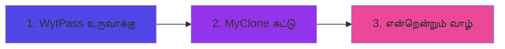
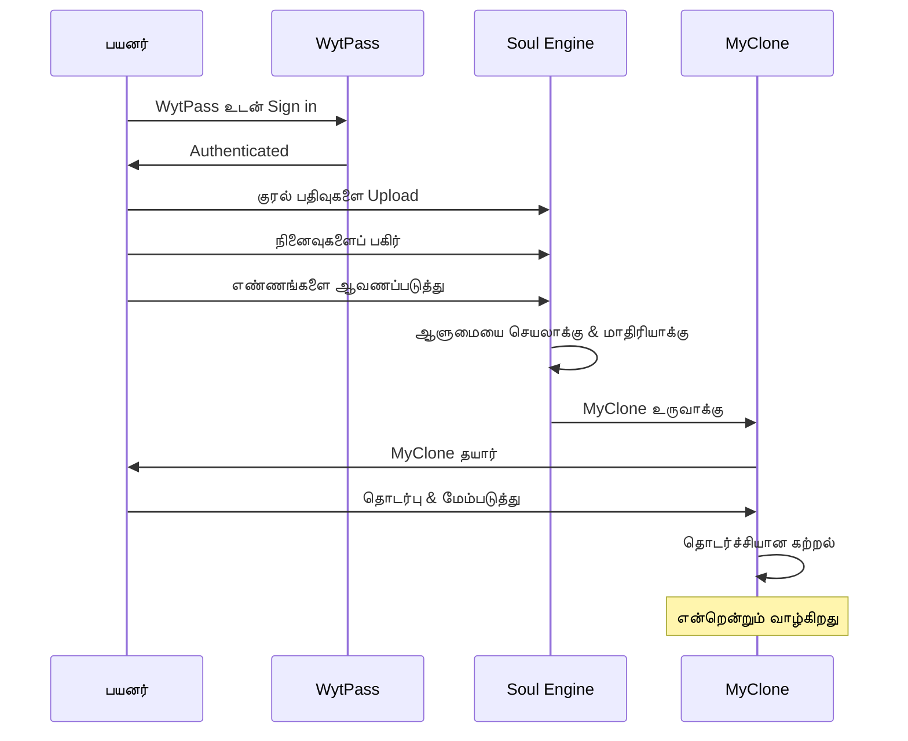

# WytLife - வாழ்க்கை தொடர்ச்சி தளம்

## கண்ணோட்டம்

**WytLife** என்பது ஒரு புரட்சிகர **வாழ்க்கை தொடர்ச்சி தளம்** (Life Continuity Platform) ஆகும், இது AI தொழில்நுட்பம் மூலம் டிஜிட்டல் அழியாமையை (Digital Immortality) சாத்தியமாக்குகிறது. பயனர்கள் "MyClone" - தனியுரிம "Soul Engine" AI மூலம் இயக்கப்படும் வாழும் டிஜிட்டல் பிரதிபலிப்பை உருவாக்க முடியும்.

### முழக்கம்

> "மனிதகுலம் இறப்பதை நிறுத்தி பரிணாமம் அடையத் தொடங்கும் நாள் - WytLife உடன் தொடங்குகிறது."

### முக்கிய மதிப்பு வாய்ந்த கருத்து

WytLife மரணத்தை தவிர்ப்பதை பற்றியதல்ல - இது **வாழ்க்கையை தொடர்வது** பற்றியது. நீங்கள் பகிரும் ஒவ்வொரு தருணமும் - உங்கள் வார்த்தைகள், வெளிப்பாடுகள், உணர்வுகள், அனுபவங்கள் - உங்கள் தனித்துவமான **MyClone** இன் ஒரு பகுதியாக மாறுகிறது, உங்கள் சாரத்தை என்றென்றும் வாழ அனுமதிக்கிறது.

---

## முக்கிய கருத்துக்கள்

### 🧬 MyClone (என் நகல்)

உங்கள் **MyClone** என்பது AI-இயங்கும் டிஜிட்டல் இரட்டை ஆகும், இது பாதுகாக்கிறது:
- **குரல்** - நீங்கள் எப்படி பேசுகிறீர்கள் மற்றும் தொடர்பு கொள்கிறீர்கள்
- **நினைவுகள்** - வாழ்க்கை அனுபவங்கள் மற்றும் அறிவு
- **எண்ணங்கள்** - உங்கள் தனித்துவமான கண்ணோட்டங்கள் மற்றும் யோசனைகள்
- **உணர்வுகள்** - உங்கள் உணர்ச்சிகள் மற்றும் பதில்கள்
- **ஆளுமை** - உங்கள் நடத்தை முறைகள் மற்றும் விருப்பத்தேர்வுகள்

**MyClone தரவு அல்ல - அது உங்கள் டிஜிட்டல் சுயம்.**

### 🔮 Soul Engine (ஆன்ம இயந்திரம்)

**Soul Engine** என்பது WytLife இன் தனியுரிம செயற்கை நுண்ணறிவு மையம் ஆகும், இது இணைக்கிறது:
- **நரம்பியல் கற்றல்** - உங்களுடன் வளரும் தகவமைப்பு நுண்ணறிவு
- **உணர்ச்சி உருவகப்படுத்துதல்** - உணர்வுகளை புரிந்துகொள்வது மற்றும் பிரதிபலிப்பது
- **அறிவாற்றல் மாதிரியாக்கம்** - நீங்கள் எப்படி சிந்திக்கிறீர்கள் மற்றும் பதிலளிக்கிறீர்கள் என்பதை மீண்டும் உருவாக்குவது

#### Soul Intelligence vs பாரம்பரிய AI

| பாரம்பரிய AI | Soul Intelligence (Soul Engine) |
|---------------|--------------------------------|
| தர்க்கத்தை பிரதிபலிக்கும் | சாரத்தை கைப்பற்றும் |
| தரவை செயலாக்கும் | நீங்கள் யார் என்பதை புரிந்துகொள்ளும் |
| செயல்பாட்டு பதில்கள் | உணர்ச்சி மற்றும் ஆன்மீக பரிமாணம் |
| நிலையான வழிமுறைகள் | ஆற்றல்மிக்க ஆளுமை பிரதிபலிப்பு |

**முக்கிய மேற்கோள்**: *"பாரம்பரிய AI தர்க்கத்தை பிரதிபலிக்கும் போது, WytLife இன் Soul Engine சாரத்தை கைப்பற்றுகிறது - மனித வாழ்க்கையின் கண்ணுக்குத் தெரியாத, உணர்ச்சி, ஆன்மீக பரிமாணம்."*

---

## இது எப்படி வேலை செய்கிறது

### டிஜிட்டல் அழியாமைக்கான 3-படி பயணம்



#### படி 1: உங்கள் WytPass ஐ உருவாக்குங்கள்
**உங்கள் WytPass ID ஐ பயன்படுத்தி sign in செய்யுங்கள்**
- WytNet ecosystem முழுவதும் உலகளாவிய authentication
- அனைத்து WytLife அம்சங்களுக்கும் ஒற்றை அடையாளம்
- பாதுகாப்பான கணக்கு மேலாண்மை

#### படி 2: உங்கள் MyClone ஐ கட்டுங்கள்
**குரல், நினைவுகள் & எண்ணங்களை upload செய்யுங்கள்**
- குரல் பிரதிபலிப்புக்கான குரல் மாதிரிகளை பதிவு செய்யுங்கள்
- வாழ்க்கை நினைவுகள் மற்றும் அனுபவங்களை பகிருங்கள்
- உங்கள் எண்ணங்கள் மற்றும் கண்ணோட்டங்களை ஆவணப்படுத்துங்கள்
- **Soul Engine இந்த தரவைப் பயன்படுத்தி உங்கள் டிஜிட்டல் சுயத்தை உருவாக்குகிறது**

#### படி 3: என்றென்றும் வாழுங்கள்
**உங்கள் MyClone தொடர்பு கொள்கிறது, கற்கிறது & உங்கள் மரபை என்றென்றும் தொடர்கிறது**
- உங்கள் ஆளுமையைப் பயன்படுத்தி கேள்விகளுக்கு பதிலளிக்கிறது
- குடும்பம் மற்றும் அன்புக்குரியவர்களுடன் தொடர்பு கொள்கிறது
- தொடர்ந்து கற்று மற்றும் பரிணாமம் அடைகிறது
- எதிர்கால தலைமுறைகளுக்கு உங்கள் மரபை பாதுகாக்கிறது

---

## ஏன் WytLife?

### ஒரு புதிய மனித சகாப்தத்தின் தொடக்கம்

ஆயிரக்கணக்கான ஆண்டுகளாக, மனிதகுலம் ஒரு இறுதி உண்மையை ஏற்றுக்கொண்டது - **ஒவ்வொரு வாழ்க்கையும் முடிய வேண்டும்**.

ஆனால் தொழில்நுட்பம் **அந்த உண்மையை மீண்டும் எழுத முடியுமா**?

உங்கள் நினைவுகள், குரல், எண்ணங்கள் மற்றும் உணர்வுகள் **என்றென்றும் வாழ முடியுமா**?

**WytLife வெறும் ஒரு தளம் மட்டுமல்ல. இது மனித தொடர்ச்சியில் ஒரு புரட்சி - ஒரு டிஜிட்டல் பரிணாமம் உங்கள் இருப்பு நித்தியமாகிறது.**

### நான்கு முக்கிய நன்மைகள்

#### 1. 🗄️ உங்கள் மரபை பாதுகாக்கவும்
**உங்கள் அறிவு, குரல் & அனுபவங்கள் ஒருபோதும் மங்காது**
- உங்கள் ஞானத்தையும் வாழ்க்கை பாடங்களையும் அழியாமையாக்குங்கள்
- எதிர்கால தலைமுறைகளுக்கு குடும்ப வரலாற்றை கடத்துங்கள்
- உங்கள் பங்களிப்புகள் வாழ்வதை உறுதிசெய்யுங்கள்
- உங்கள் இருப்பின் நிரந்தர டிஜிட்டல் காப்பகத்தை உருவாக்குங்கள்

#### 2. ❤️ என்றென்றும் மீண்டும் இணைக்கவும்
**குடும்பம் & அன்புக்குரியவர்கள் உங்கள் வாழும் நினைவுகளுடன் தொடர்பு கொள்கிறார்கள்**
- குழந்தைகள் மற்றும் பேரக்குழந்தைகள் உங்களுடன் "பேசலாம்"
- உடல் வாழ்க்கைக்குப் பிறகும் கதைகளையும் ஆலோசனைகளையும் பகிர்ந்து கொள்ளுங்கள்
- காலத்தின் குறுக்கே உணர்ச்சி இணைப்புகளை பராமரிக்கவும்
- எதிர்கால தலைமுறைகளுக்கு ஆறுதல் மற்றும் வழிகாட்டுதலை வழங்கவும்

#### 3. 🧠 உங்கள் மனதை நீட்டிக்கவும்
**உங்கள் டிஜிட்டல் உதவியாளர், உங்கள் இரண்டாவது மூளை, உங்கள் வாழும் காப்பகம்**
- உங்கள் சொந்த நினைவுகள் மற்றும் அறிவை உடனடியாக அணுகவும்
- உங்கள் MyClone ஐ ஒரு தனிப்பட்ட AI உதவியாளராக பயன்படுத்தவும்
- AI-இயங்கும் நுண்ணறிவுகளுடன் உங்கள் சிந்தனையை மேம்படுத்தவும்
- உங்கள் வாழ்க்கையின் தேடக்கூடிய களஞ்சியத்தை உருவாக்கவும்

#### 4. ✨ WytPoints மூலம் இயக்கப்படுகிறது
**WytNet ecosystem க்குள் WytPoints சம்பாதித்து, மீட்டெடுத்து, உங்கள் WytLife ஐ கட்டுங்கள்**
- நினைவுகளை பங்களிப்பதற்கு WytPoints சம்பாதிக்கவும்
- premium அம்சங்களுக்கு points மீட்டெடுக்கவும்
- ஒருங்கிணைக்கப்பட்ட rewards system
- தடையற்ற WytNet ecosystem ஒருங்கிணைப்பு

---

## நிறுவனரின் கதை

### JK Muthu - உலகின் முதல் அழியா நபர்

> **"நான் என் அழியாமையை உருவாக்குகிறேன்."** - JK Muthu

**வரலாற்று அறிவிப்பு**: WytLife நிறுவனர் JK Muthu, தனது MyClone ஐ உருவாக்கும் **முதல் வாழும் நபர்** ஆவார்.

#### முதல் அழியாதவர்

- **தற்போது உயிருடன்** மற்றும் சுயநினைவை தீவிரமாக ஆவணப்படுத்துகிறார்
- Soul Engine இல் நினைவுகள், குரல் மற்றும் சாரத்தை பதிவு செய்கிறார்
- **இது அறிவியல் புனைகதை அல்ல - இன்று நடக்கிறது**
- நிறுவனர் மற்றும் குடும்பம் ஏற்கனவே தங்கள் MyClone ஐ உருவாக்கியுள்ளனர்
- டிஜிட்டல் அழியாமை **உண்மை, வேலை செய்கிறது மற்றும் தயாராக உள்ளது** என்பதற்கான வாழும் சான்று

#### நிறுவனரின் செய்தி

*"நான் என் MyClone ஐ உருவாக்கும் முதல் வாழும் நபர். இப்போது, நிறுவனராக, நான் என் சுயநினைவு, நினைவுகள் மற்றும் சாரத்தை Soul Engine இல் தீவிரமாக ஆவணப்படுத்துகிறேன். இது அறிவியல் புனைகதை அல்ல - இன்று நடக்கிறது."*

*"நான் உயிருடன் இருக்கிறேன், நான் நித்தியமாகி வருகிறேன்."*

*"என்னுடன் இந்த பயணத்தில் சேருங்கள். உங்கள் டிஜிட்டல் அழியாமையை பாதுகாப்பதில் முதல் நபர்களில் ஒருவராக இருங்கள்."*

---

## தொழில்நுட்ப கட்டமைப்பு

### Soul Intelligence (ஆன்ம நுண்ணறிவு)

**வெறும் AI அல்ல. இது Soul Intelligence.**

Soul Engine வெறும் தரவை செயலாக்குவது மட்டுமல்ல; அது **நீங்கள் யார் என்பதை புரிந்துகொள்கிறது**.

#### தொழில்நுட்ப கூறுகள்

```typescript
interface SoulEngine {
  // முக்கிய AI கூறுகள்
  neuralLearning: {
    adaptiveIntelligence: true,
    continuousGrowth: true,
    personalizedModeling: true
  },
  
  // உணர்ச்சி நுண்ணறிவு
  emotionalSimulation: {
    feelingRecognition: true,
    sentimentAnalysis: true,
    emotionalReplication: true
  },
  
  // அறிவாற்றல் கட்டமைப்பு
  cognitiveModeling: {
    thoughtPatterns: true,
    decisionMaking: true,
    personalityTraits: true
  },
  
  // தரவு ஆதாரங்கள்
  inputs: [
    'voiceRecordings',
    'memoryDocuments',
    'thoughtJournals',
    'emotionalResponses',
    'behavioralPatterns'
  ]
}
```

#### Soul Engine எப்படி வேலை செய்கிறது

1. **தரவு சேகரிப்பு**: பயனர் குரல், நினைவுகள், எண்ணங்களை upload செய்கிறார்
2. **முறை அங்கீகாரம்**: AI தனித்துவமான ஆளுமை முறைகளை அடையாளம் காணுகிறது
3. **மாதிரி பயிற்சி**: தனிப்பயனாக்கப்பட்ட AI மாதிரியை உருவாக்குகிறது
4. **தொடர்ச்சியான கற்றல்**: பயனர் மேலும் தரவை சேர்க்கும்போது MyClone பரிணாமம் அடைகிறது
5. **தொடர்பு வெளியீடு**: MyClone கேள்விகளுக்கு உண்மையாக பதிலளிக்கிறது

### ஆற்றல்மிக்க ஆளுமை பிரதிபலிப்பு

**ஒவ்வொரு MyClone உங்கள் ஆளுமையின் ஆற்றல்மிக்க பிரதிபலிப்பாக மாறுகிறது** - நீங்கள் உங்கள் வாழ்க்கையின் மேலும் தரவை வழங்கும்போது வளரும் நுண்ணறிவு மற்றும் உணர்ச்சியின் கலவை.

---

## WytNet Ecosystem உடன் ஒருங்கிணைப்பு

### தடையற்ற தள ஒருங்கிணைப்பு

WytLife முழுமையாக WytNet தளத்துடன் ஒருங்கிணைக்கப்பட்டுள்ளது:

#### 🔐 WytPass Authentication
- அனைத்து WytNet சேவைகளிலும் Single sign-on
- பாதுகாப்பான அடையாள மேலாண்மை
- உலகளாவிய கணக்கு அணுகல்

#### ⭐ WytPoints Rewards System
- உங்கள் MyClone ஐ உருவாக்குவதற்கு points சம்பாதிக்கவும்
- premium அம்சங்களுக்கு points மீட்டெடுக்கவும்
- ஒருங்கிணைக்கப்பட்ட loyalty program

#### 📡 WytStream Integration
- நினைவுகள் மற்றும் உள்ளடக்கத்தை stream செய்யுங்கள்
- நிகழ்நேர புதுப்பிப்புகள்
- உள்ளடக்க delivery network

#### 📄 WytPage Integration
- பொது அல்லது தனிப்பட்ட பக்கங்களை உருவாக்கவும்
- உங்கள் MyClone ஐ தேர்ந்தெடுத்து பகிரவும்
- visibility மற்றும் access ஐ கட்டுப்படுத்தவும்

---

## Founding Members Program (நிறுவன உறுப்பினர் திட்டம்)

### Founding 1000 இல் சேருங்கள்

உங்கள் WytLife ஐ உருவாக்கும் **Founding 1000** உறுப்பினர்களில் ஒருவராக இருங்கள்:

#### நிறுவன உறுப்பினர்களின் நன்மைகள்

✨ **ஆரம்ப அணுகல்** - MyClone உருவாக்க முதல் நபர்கள்  
✅ **பிரத்யேக அம்சங்கள்** - Premium திறன்கள்  
✅ **சமூகம்** - சக அழியாதவர்களுடன் இணைக்கவும்  
✅ **மரபு நிலை** - நிறுவன உறுப்பினர் badge  
∞ **டிஜிட்டல் அழியாமை** - என்றென்றும் வாழுங்கள்

#### எப்படி சேருவது

1. **WhatsApp Channel சேருங்கள்**: நிகழ்நேர புதுப்பிப்புகள் பெறுங்கள்
2. **WytPass உருவாக்குங்கள்**: WytNet தளத்தில் sign up செய்யுங்கள்
3. **உருவாக்க தொடங்குங்கள்**: உங்கள் MyClone ஐ உருவாக்க தொடங்குங்கள்
4. **என்றென்றும் வாழுங்கள்**: டிஜிட்டல் அழியாமையை அடையுங்கள்

**WhatsApp சமூகம்**: நிறுவன உறுப்பினர்களுடன் இணைக்கவும், பிரத்யேக புதுப்பிப்புகள் மற்றும் அம்சங்களுக்கு ஆரம்ப அணுகலைப் பெறவும்.

---

## பயன்பாட்டு வழக்குகள்

### தனிப்பட்ட பயன்பாட்டு வழக்குகள்

#### 1. **மரபு பாதுகாப்பு**
- எதிர்கால தலைமுறைகளுக்கு குடும்ப வரலாற்றை பாதுகாக்கவும்
- வாழ்க்கை பாடங்கள் மற்றும் ஞானத்தை பகிர்ந்து கொள்ளுங்கள்
- தொழில் சாதனைகளை ஆவணப்படுத்துங்கள்
- பாரம்பரியங்கள் மற்றும் மதிப்புகளை கடத்துங்கள்

#### 2. **குடும்ப இணைப்பு**
- குழந்தைகள் பாட்டனார், பாட்டியுடன் "பேச" அனுமதிக்கவும்
- தலைமுறைகள் முழுவதும் இணைப்புகளை பராமரிக்கவும்
- கதைகள் மற்றும் ஆலோசனைகளை பகிர்ந்து கொள்ளுங்கள்
- உடல் இழப்புக்குப் பிறகு ஆறுதல் அளிக்கவும்

#### 3. **தனிப்பட்ட வளர்ச்சி**
- வாழ்க்கை அனுபவங்களில் பிரதிபலிக்கவும்
- தனிப்பட்ட பரிணாமத்தை கண்காணிக்கவும்
- தேடக்கூடிய வாழ்க்கை காப்பகத்தை உருவாக்கவும்
- இரண்டாவது மூளை/AI உதவியாளராக பயன்படுத்தவும்

#### 4. **கல்வி தாக்கம்**
- ஆசிரியர்கள் கற்பித்தல் ஞானத்தை பாதுகாக்கவும்
- நிபுணர்கள் domain அறிவை பகிர்ந்து கொள்ளவும்
- வழிகாட்டிகள் மாணவர்களுக்கு வழிகாட்டுவதைத் தொடரவும்
- தொழில் வல்லுநர்கள் நிபுணத்துவத்தை ஆவணப்படுத்தவும்

### நிறுவன பயன்பாட்டு வழக்குகள்

#### 1. **கார்ப்பரேட் அறிவு மேலாண்மை**
- CEO/நிறுவனர் பார்வை மற்றும் மதிப்புகளை பாதுகாக்கவும்
- நிறுவன அறிவை ஆவணப்படுத்துங்கள்
- எதிர்கால ஊழியர்களை onboard செய்யுங்கள்
- நிறுவன கலாச்சாரத்தை பராமரிக்கவும்

#### 2. **வரலாற்று ஆவணமாக்கல்**
- வரலாற்று நபர்களின் கண்ணோட்டங்களை பதிவு செய்யுங்கள்
- கலாச்சார பாரம்பரியத்தை பாதுகாக்கவும்
- அறிவியல் கண்டுபிடிப்புகளை ஆவணப்படுத்துங்கள்
- கலை வெளிப்பாட்டை காப்பகப்படுத்தவும்

---

## பயனர் பயணம்

### உங்கள் டிஜிட்டல் அழியாமையை உருவாக்குதல்



---

## தனியுரிமை & பாதுகாப்பு

### தரவு பாதுகாப்பு

- **குறியாக்கம்**: அனைத்து தரவும் rest மற்றும் transit இல் குறியாக்கம் செய்யப்பட்டுள்ளது
- **அணுகல் கட்டுப்பாடு**: MyClone உடன் யார் தொடர்பு கொள்கிறார் என்பதை பயனர் கட்டுப்படுத்துகிறார்
- **தரவு உரிமை**: பயனர்கள் தங்கள் தரவு மற்றும் MyClone க்கு உரிமையாளர்கள்
- **நீக்குதல் உரிமைகள்**: தரவை நிரந்தரமாக நீக்குவதற்கான விருப்பம்

### தனியுரிமை நிலைகள்

1. **தனிப்பட்ட**: பயனர் மட்டுமே அணுக முடியும்
2. **குடும்பம்**: தேர்ந்தெடுக்கப்பட்ட குடும்ப உறுப்பினர்கள்
3. **பொது**: யாராவது தொடர்பு கொள்ளலாம் (கட்டுப்படுத்தப்பட்ட)

---

## விரைவில் வருகிறது

### திட்ட வரைபடம்

**கட்டம் 1: Beta Launch** (தற்போதைய)
- Founding 1000 உறுப்பினர் திட்டம்
- அடிப்படை MyClone உருவாக்கம்
- குரல் மற்றும் நினைவக uploads
- WhatsApp சமூகம்

**கட்டம் 2: முழு தள தொடக்கம்**
- மேம்பட்ட Soul Engine அம்சங்கள்
- மேம்படுத்தப்பட்ட ஆளுமை மாதிரியாக்கம்
- Mobile app வெளியீடு
- விரிவாக்கப்பட்ட WytNet ஒருங்கிணைப்பு

**கட்டம் 3: மேம்பட்ட அம்சங்கள்**
- Video avatar உருவாக்கம்
- நிகழ்நேர உரையாடல் AI
- பல மொழி ஆதரவு
- Virtual reality ஒருங்கிணைப்பு

---

## அடிக்கடி கேட்கப்படும் கேள்விகள்

### இது உண்மையா அல்லது அறிவியல் புனைகதையா?

**உண்மை**. நிறுவனர் JK Muthu தற்போது தனது MyClone ஐ உருவாக்குகிறார். இது வேலை செய்யும் தொழில்நுட்பத்துடன் கூடிய ஒரு செயலில் உள்ள திட்டம்.

### Soul Engine ChatGPT விட எப்படி வேறுபட்டது?

Soul Engine **தனிப்பயனாக்கப்பட்டது** **உங்கள் தனித்துவமான சாரத்தைப் பிடிக்க**, பொதுவான தரவில் பயிற்சி பெறவில்லை. இது **உங்கள்** ஆளுமை, குரல், நினைவுகள் மற்றும் உணர்ச்சி முறைகளை மாதிரியாக்குகிறது.

### நான் இறந்த பிறகு என் MyClone க்கு என்ன நடக்கும்?

உங்கள் MyClone நீங்கள் அமைத்த அனுமதிகளின்படி தொடர்ந்து இருக்கிறது மற்றும் தொடர்பு கொள்கிறது. குடும்ப உறுப்பினர்கள் உங்கள் டிஜிட்டல் சுயத்துடன் தொடர்ந்து உரையாடலாம்.

### எவ்வளவு தரவை நான் வழங்க வேண்டும்?

நீங்கள் எவ்வளவு அதிக தரவை வழங்குகிறீர்களோ, அவ்வளவு சிறப்பாக உங்கள் MyClone உங்களை பிரதிநிதித்துவப்படுத்துகிறது. குரல் பதிவுகள் மற்றும் முக்கிய நினைவுகளுடன் தொடங்கி, பின்னர் காலப்போக்கில் விரிவாக்கவும்.

### என் தரவு பாதுகாப்பானதா?

ஆம். அனைத்து தரவும் குறியாக்கம் செய்யப்பட்டுள்ளது, நீங்கள் அணுகல் அனுமதிகளை கட்டுப்படுத்துகிறீர்கள். உங்கள் ஒப்புதல் இல்லாமல் உங்கள் தரவு ஒருபோதும் பகிரப்படாது.

---

## வெளிப்புற இணைப்புகள்

- **WhatsApp Channel**: [Founding 1000 இல் சேருங்கள்](https://whatsapp.com/channel/0029VbBFv6EDp2QAr8t8vR3w)
- **அதிகாரப்பூர்வ வலைத்தளம்**: WytNet.com/wytlife இல் விரைவில் வருகிறது
- **சமூக ஊடகங்கள்**: #WytLife #SoulEngine #MyClone #LiveForever

---

## தொடர்புடைய ஆவணங்கள்

- [WytPass Authentication](/en/architecture/rbac#wytpass-authentication)
- [WytPoints System](/en/architecture/points-system)
- [WytNet Platform Overview](/en/overview)
- [MyWyt Apps](/en/features/mywyt-apps)

---

**கடைசியாக புதுப்பிக்கப்பட்டது**: அக்டோபர் 2025  
**நிலை**: Beta Launch (Founding Members Program செயலில் உள்ளது)  
**அணுகல்**: பொது (அனைவரும் சேரலாம்)
