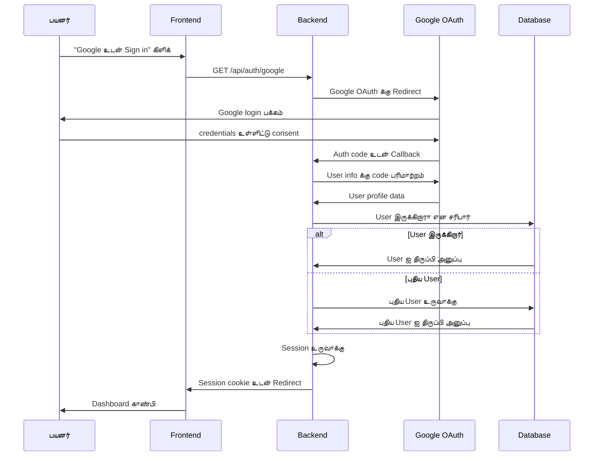
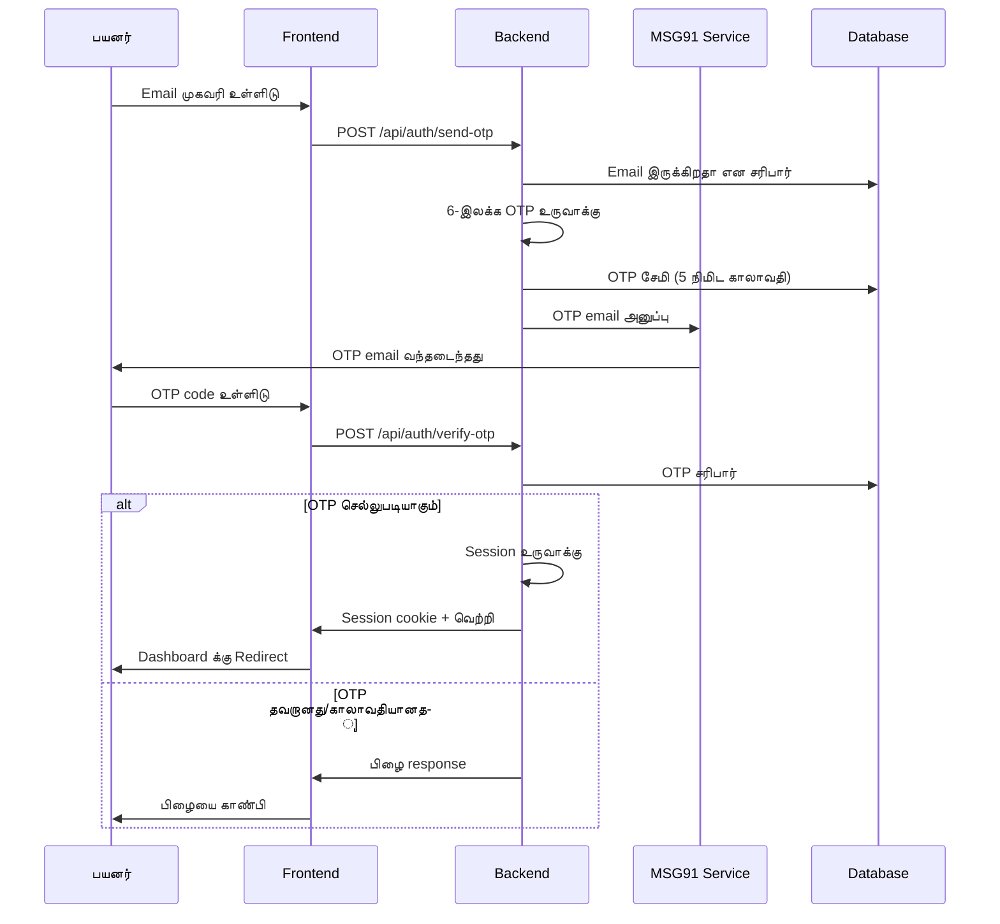
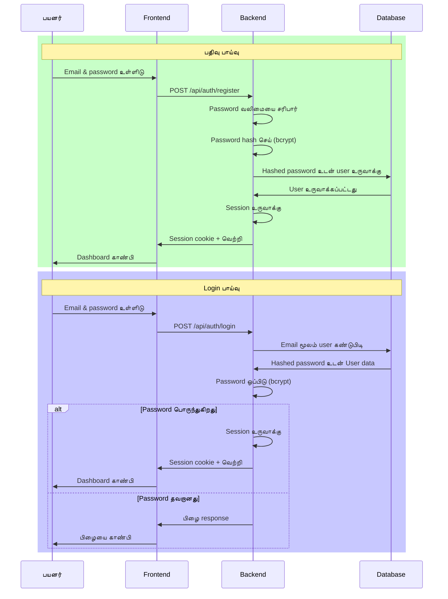
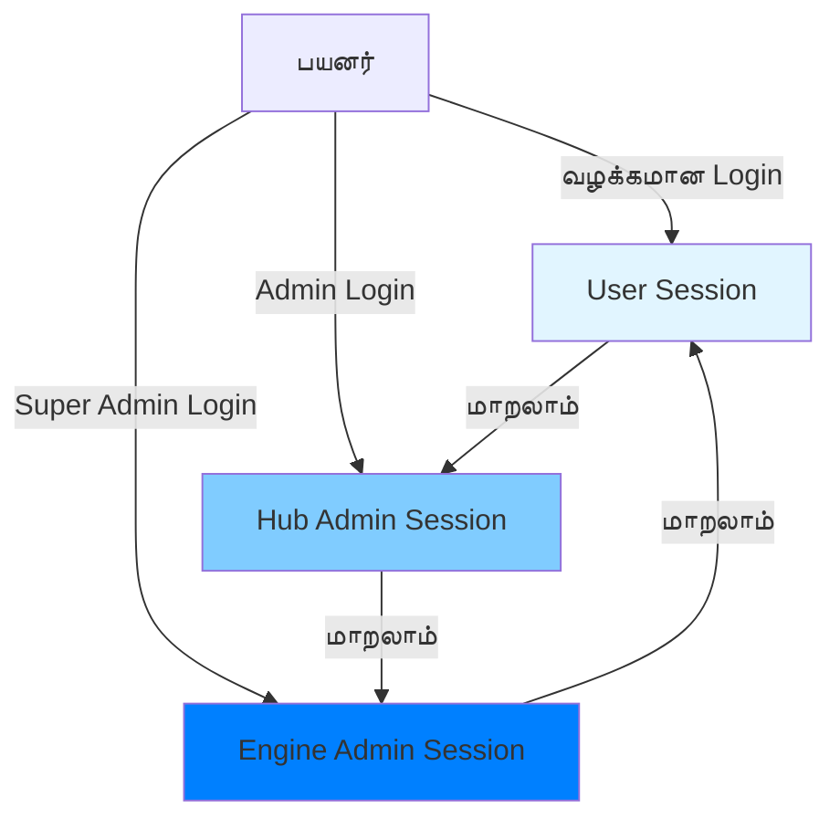

# WytPass அங்கீகாரம்

## கண்ணோட்டம்

**WytPass** என்பது WytNet இன் ஒருங்கிணைந்த அங்கீகார அமைப்பு, எல்லா தளங்கள், apps மற்றும் hubs முழுவதும் தடையற்ற அடையாள மேலாண்மையை வழங்குகிறது. ஒரே பயனர் அடையாளத்தை பராமரிக்கும் போது பல அங்கீகார முறைகளை ஆதரிக்கிறது.

## அங்கீகார முறைகள்

### 1. Google OAuth

Google கணக்கைப் பயன்படுத்தி விரைவான signup/login.



**பாய்வு படிகள்**:
1. பயனர் "Google உடன் Sign in" கிளிக் செய்கிறார்
2. Frontend `/api/auth/google` க்கு redirect செய்கிறது
3. Backend Google OAuth consent screen க்கு redirect செய்கிறது
4. பயனர் Google உடன் அங்கீகரிக்கிறார்
5. Google authorization code உடன் callback URL க்கு redirect செய்கிறது
6. Backend user profile க்கு code பரிமாற்றம் செய்கிறது
7. System database இல் user இருக்கிறாரா என சரிபார்க்கிறது
8. புதிய user என்றால், கணக்கை தானாக உருவாக்குகிறது
9. Session உருவாக்கி httpOnly cookie அமைக்கிறது
10. User dashboard க்கு redirect செய்கிறது

---

### 2. Email OTP (கடவுச்சொல் இல்லாமல்)

பாதுகாப்பான, கடவுச்சொல்-இல்லாத அங்கீகாரத்திற்காக email க்கு அனுப்பப்படும் one-time password.



**பாய்வு படிகள்**:
1. பயனர் email முகவரியை உள்ளிடுகிறார்
2. Backend 6-இலக்க OTP உருவாக்குகிறது
3. OTP database இல் 5-நிமிட காலாவதியுடன் சேமிக்கப்படுகிறது
4. OTP MSG91 email service மூலம் அனுப்பப்படுகிறது
5. பயனர் OTP code உடன் email பெறுகிறார்
6. பயனர் frontend இல் OTP உள்ளிடுகிறார்
7. Backend database க்கு எதிராக OTP சரிபார்க்கிறது
8. செல்லுபடியாகும் மற்றும் காலாவதியாகவில்லை என்றால், session உருவாக்குகிறது
9. பயனர் logged in ஆகிறார்

**பாதுகாப்பு அம்சங்கள்**:
- OTP 5 நிமிடங்களுக்கு பிறகு காலாவதியாகிறது
- Rate limiting (15 நிமிடங்களுக்கு அதிகபட்சம் 3 முயற்சிகள்)
- OTP ஒரு முறை மட்டும் பயன்படுத்த முடியும்
- பாதுகாப்பான random generation

---

### 3. Email & கடவுச்சொல்

பாதுகாப்பான password hashing உடன் பாரம்பரிய email/password அங்கீகாரம்.



**கடவுச்சொல் தேவைகள்**:
- குறைந்தபட்சம் 8 எழுத்துக்கள்
- குறைந்தது ஒரு பெரிய எழுத்து
- குறைந்தது ஒரு சிறிய எழுத்து
- குறைந்தது ஒரு எண்
- குறைந்தது ஒரு சிறப்பு எழுத்து

**பாதுகாப்பு அம்சங்கள்**:
- Passwords bcrypt பயன்படுத்தி hash செய்யப்படுகின்றன (cost factor 10)
- Plain text இல் ஒருபோதும் சேமிக்கப்படுவதில்லை
- Login முயற்சிகளில் rate limiting
- 5 தோல்வி முயற்சிகளுக்கு பிறகு கணக்கு lockout

---

## Session மேலாண்மை

### Session உருவாக்கம்

```javascript
// Session PostgreSQL இல் connect-pg-simple பயன்படுத்தி சேமிக்கப்படுகிறது
{
  sid: "session-uuid",
  sess: {
    userId: "UR0000001",
    email: "user@example.com",
    role: "user",
    contexts: ["user"], // இருக்கலாம்: user, hub_admin, super_admin
    createdAt: "2025-01-20T10:00:00Z",
    expiresAt: "2025-01-27T10:00:00Z" // 7 நாட்கள்
  },
  expire: "2025-01-27T10:00:00Z"
}
```

### Session சேமிப்பு
- **Engine**: PostgreSQL `session` அட்டவணை
- **Cookie**: httpOnly, secure, sameSite=strict
- **கால அளவு**: 7 நாட்கள் (உள்ளமைக்கக்கூடியது)
- **புதுப்பித்தல்**: செயல்பாட்டின் போது தானாக புதுப்பிக்கப்படுகிறது

### Multi-Context Sessions

WytPass உயர்த்தப்பட்ட அனுமதிகளைக் கொண்ட பயனர்களுக்கு பல ஒரே நேர contexts ஐ ஆதரிக்கிறது:



**Context வகைகள்**:
1. **User Context**: WytNet.com க்கு வழக்கமான பயனர் அணுகல்
2. **Hub Admin Context**: குறிப்பிட்ட hub க்கு admin அணுகல்
3. **Super Admin Context**: முழு Engine-level admin அணுகல்

**Context மாற்றம்**:
- பயனர்கள் மீண்டும் அங்கீகாரம் இல்லாமல் contexts இடையே மாறலாம்
- ஒவ்வொரு context க்கும் அதன் சொந்த session உண்டு
- ஒவ்வொரு context க்கும் அனுமதிகள் சரிபார்க்கப்படுகின்றன

---

## ஒருங்கிணைந்த பயனர் அடையாளம்

### WytID அமைப்பு

ஒவ்வொரு பயனரும் ஒரு தனித்துவமான identifier பெறுகிறார்:
- **வடிவம்**: `UR` + 7-இலக்க எண் (எ.கா., UR0000001)
- **Global**: எல்லா hubs மற்றும் apps முழுவதும் வேலை செய்கிறது
- **நிரந்தர**: ஒருபோதும் மாறாது
- **மனிதர்-வாசிக்கக்கூடியது**: குறிப்பிட எளிதானது

### பயனர் சுயவிவரம்

```typescript
interface User {
  id: string;                    // Database UUID
  displayId: string;              // WytID (எ.கா., UR0000001)
  email: string;                  // முதன்மை email
  phoneNumber?: string;           // விரும்பினால் phone
  whatsappNumber?: string;        // விரும்பினால் WhatsApp
  name?: string;                  // முழு பெயர்
  avatar?: string;                // Profile picture URL
  authProvider: 'google' | 'email' | 'otp';
  emailVerified: boolean;
  phoneVerified: boolean;
  createdAt: Date;
  updatedAt: Date;
}
```

### Profile Sync
- எல்லா தளங்களிலும் ஒரே profile
- மாற்றங்கள் எல்லா இடங்களிலும் உடனடியாக பிரதிபலிக்கின்றன
- நிலையான பயனர் அனுபவம்

---

## பாதுகாப்பு அம்சங்கள்

### 1. CSRF பாதுகாப்பு
- Synchronizer token முறை
- ஒவ்வொரு state-மாற்றும் கோரிக்கையிலும் சரிபார்க்கப்படுகிறது
- ஒவ்வொரு session க்கும் தானாக உருவாக்கப்படுகிறது

### 2. பாதுகாப்பான Cookies
```javascript
{
  httpOnly: true,      // JavaScript மூலம் அணுக முடியாது
  secure: true,        // HTTPS மட்டும்
  sameSite: 'strict',  // CSRF தடுக்கிறது
  maxAge: 7 * 24 * 60 * 60 * 1000  // 7 நாட்கள்
}
```

### 3. Rate Limiting
- Login முயற்சிகள்: ஒரு IP க்கு 15 நிமிடங்களுக்கு 5
- OTP கோரிக்கைகள்: ஒரு email க்கு 15 நிமிடங்களுக்கு 3
- பதிவு: ஒரு IP க்கு மணிக்கு 10

### 4. Session பாதுகாப்பு
- Sessions PostgreSQL இல் சேமிக்கப்படுகின்றன, memory இல் அல்ல
- செயலற்ற நிலைக்கு பிறகு தானாக காலாவதியாகும்
- பாதுகாப்பான session ID உருவாக்கம்
- Session hijacking தடுப்பு

---

## API Endpoints

### Email/Password உடன் பதிவு
```http
POST /api/auth/register
Content-Type: application/json

{
  "email": "user@example.com",
  "password": "SecureP@ss123",
  "name": "John Doe"
}

Response 201:
{
  "success": true,
  "user": {
    "id": "uuid",
    "displayId": "UR0000001",
    "email": "user@example.com",
    "name": "John Doe"
  }
}
```

### Email/Password உடன் Login
```http
POST /api/auth/login
Content-Type: application/json

{
  "email": "user@example.com",
  "password": "SecureP@ss123"
}

Response 200:
{
  "success": true,
  "user": { ... }
}
```

### OTP அனுப்பு
```http
POST /api/auth/send-otp
Content-Type: application/json

{
  "email": "user@example.com"
}

Response 200:
{
  "success": true,
  "message": "OTP email க்கு அனுப்பப்பட்டது"
}
```

### OTP சரிபார்
```http
POST /api/auth/verify-otp
Content-Type: application/json

{
  "email": "user@example.com",
  "otp": "123456"
}

Response 200:
{
  "success": true,
  "user": { ... }
}
```

### Google OAuth
```http
GET /api/auth/google
Google OAuth consent screen க்கு Redirect செய்கிறது

Callback:
GET /api/auth/google/callback?code=...
Session உருவாக்கி dashboard க்கு redirect செய்கிறது
```

### Logout
```http
POST /api/auth/logout

Response 200:
{
  "success": true,
  "message": "வெற்றிகரமாக logged out செய்யப்பட்டது"
}
```

### தற்போதைய பயனரை பெறு
```http
GET /api/auth/user

Response 200:
{
  "id": "uuid",
  "displayId": "UR0000001",
  "email": "user@example.com",
  "name": "John Doe",
  ...
}
```

---

## செயல்படுத்தல் உதாரணம்

### Frontend (React)
```typescript
// Email/Password உடன் Login
const handleLogin = async (email: string, password: string) => {
  const response = await apiRequest('/api/auth/login', {
    method: 'POST',
    body: JSON.stringify({ email, password }),
    headers: { 'Content-Type': 'application/json' }
  });
  
  if (response.success) {
    // Session cookie தானாக அமைக்கப்படுகிறது
    navigate('/dashboard');
  }
};

// அங்கீகார நிலையை சரிபார்
const { data: user, isLoading } = useQuery({
  queryKey: ['/api/auth/user'],
  retry: false
});

if (isLoading) return <Loading />;
if (!user) return <Redirect to="/login" />;
```

### Backend (Express)
```typescript
// அங்கீகார middleware
app.use('/api/protected/*', requireAuth);

function requireAuth(req, res, next) {
  if (!req.session?.userId) {
    return res.status(401).json({ message: 'அங்கீகரிக்கப்படவில்லை' });
  }
  next();
}
```

---

## சிறந்த நடைமுறைகள்

1. **எப்போதும் HTTPS பயன்படுத்தவும்** production இல்
2. **ஒருபோதும் passwords log செய்ய வேண்டாம்** அல்லது sensitive data
3. **Inputs ஐ சரிபார்க்கவும்** client மற்றும் server இரண்டிலும்
4. **Rate limit** செய்யவும் authentication endpoints ஐ
5. **கண்காணிக்கவும்** சந்தேகத்திற்குரிய login patterns
6. **செயல்படுத்தவும்** account recovery flows
7. **பாதுகாப்பான** session storage பயன்படுத்தவும் (PostgreSQL)
8. **Rotate** செய்யவும் session secrets ஐ வழக்கமாக

---

## அடுத்த படிகள்

- [பயனர் பதிவு Workflow →](/ta/features/user-registration)
- [தரவுத்தள Schema →](/ta/architecture/database-schema)
- [API குறிப்பு →](/ta/api/authentication)
