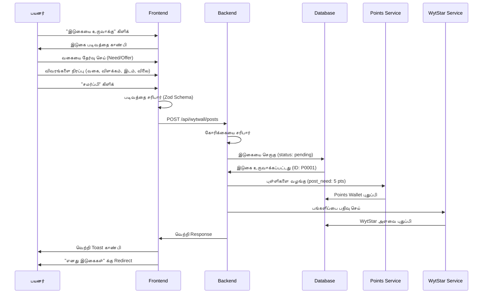
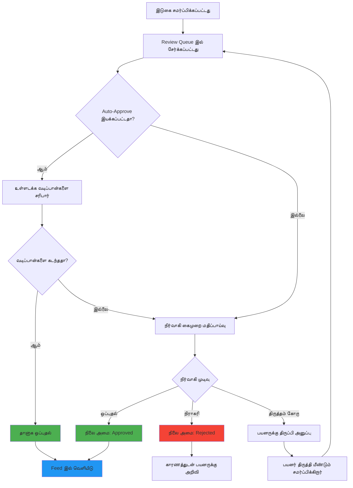
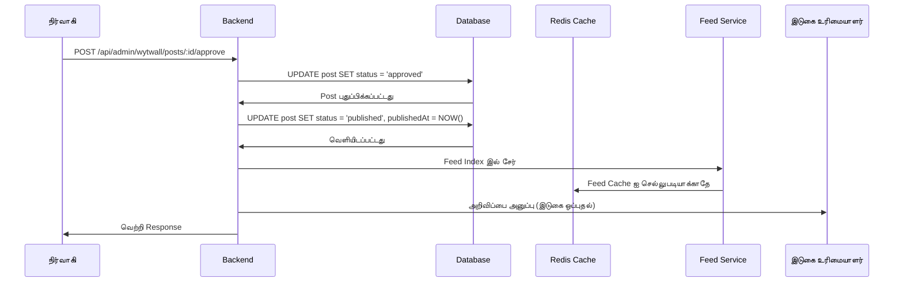
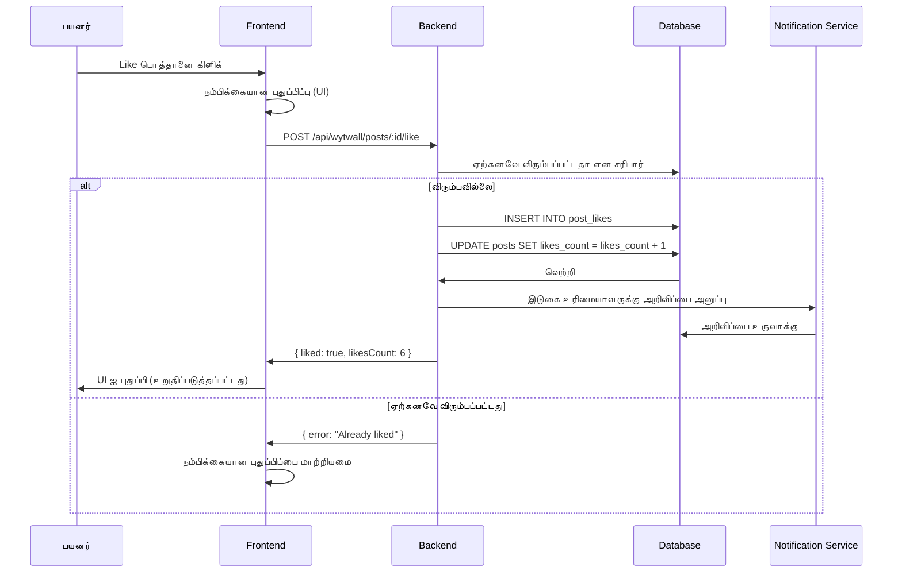
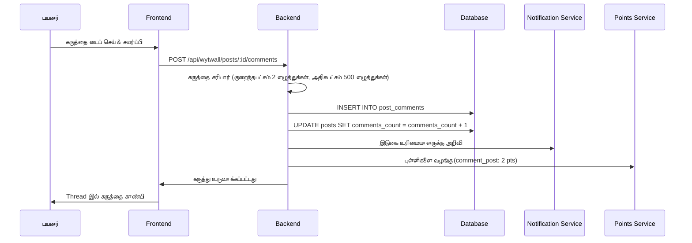
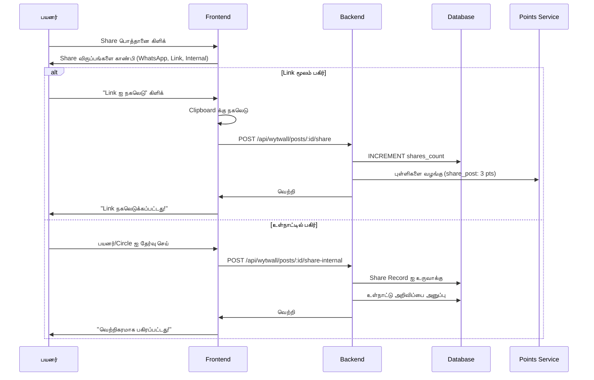
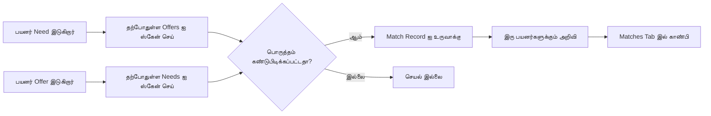

# WytWall - சமூக வர்த்தக Feed

## கண்ணோட்டம்

**WytWall** என்பது WytNet இன் சமூக வர்த்தக தளம், வாங்குபவர்கள் மற்றும் விற்பவர்களை Needs (தேவைகள்) மற்றும் Offers (சலுகைகள்) இன் மாறும் feed மூலம் இணைக்கிறது. இது சமூக வலைப்பின்னலை சந்தை செயல்பாட்டுடன் இணைக்கிறது, பயனர்கள் தங்களுக்கு என்ன தேவை அல்லது அவர்கள் என்ன வழங்குகிறார்கள் என்பதை இடுகையிட உதவுகிறது, மற்றும் ஒரு அறிவார்ந்த feed algorithm மூலம் பொருத்தமான வாய்ப்புகளை கண்டறிய உதவுகிறது.

### முக்கிய அம்சங்கள்

- **இரட்டை இடுகை வகைகள்**: பயனர்கள் "Need" அல்லது "Offer" இடுகைகளை உருவாக்க முடியும்
- **ஸ்மார்ட் பொருத்தம்**: Algorithm Needs ஐ Offers உடன் பொருத்துகிறது (WytMatch)
- **சமூக தொடர்புகள்**: இடுகைகளை விரும்பவும், கருத்து தெரிவிக்கவும், பகிரவும், சேமிக்கவும்
- **நிர்வாக மதிப்பீடு**: ஒப்புதல் workflow உடன் review queue
- **கேமிஃபிகேஷன்**: இடுகையிடுதல் மற்றும் ஈடுபாட்டிற்காக WytPoints மற்றும் WytStars சம்பாதிக்கவும்
- **இடம் அடிப்படையிலான**: இடுகைகளை இடம் மற்றும் ஆரம் மூலம் வடிகட்ட முடியும்
- **வகை அமைப்பு**: தயாரிப்பு/சேவை வகைகளால் ஒழுங்கமைக்கப்பட்டது

---

## இடுகை வாழ்க்கைச் சுழற்சி & நிலைகள்

### இடுகை நிலைகள்

```mermaid
stateDiagram-v2
    [*] --> Draft
    Draft --> Pending: பயனர் சமர்ப்பிக்கிறார்
    Pending --> Approved: நிர்வாகி ஒப்புதல் அளிக்கிறார்
    Pending --> Rejected: நிர்வாகி நிராகரிக்கிறார்
    Approved --> Published: தானாக வெளியிடு
    Published --> Fulfilled: பரிவர்த்தனை நிறைவு
    Published --> Closed: பயனர் மூடுகிறார்
    Published --> Flagged: பயனர் புகார் செய்கிறார்
    Flagged --> Published: நிர்வாகி மதிப்பாய்வு (சரி)
    Flagged --> Removed: நிர்வாகி நீக்குகிறார்
    Rejected --> Draft: பயனர் திருத்துகிறார்
    Closed --> [*]
    Fulfilled --> [*]
    Removed --> [*]
```



**நிலை விளக்கங்கள்**:

| நிலை | விளக்கம் | பயனர் செயல்கள் | நிர்வாக செயல்கள் |
|-------|-------------|--------------|---------------|
| `draft` | இடுகை உருவாக்கப்படுகிறது (இன்னும் சமர்ப்பிக்கப்படவில்லை) | திருத்து, சமர்ப்பி, நீக்கு | இல்லை |
| `pending` | நிர்வாக ஒப்புதலுக்காக காத்திருக்கிறது | ரத்து செய், பார் | ஒப்புதல், நிராகரி, திருத்து |
| `approved` | நிர்வாகி ஒப்புதல் அளித்தார், வெளியிட தயார் | இல்லை (தானாக வெளியிடப்படும்) | வெளியீட்டை நிறுத்து |
| `published` | Feed இல் நேரடியாக, பயனர்களுக்கு காணலாம் | நிறைவுற்றதாக குறி, மூடு, திருத்து | வெளியீட்டை நிறுத்து, Flag |
| `fulfilled` | பரிவர்த்தனை வெற்றிகரமாக நிறைவு | இல்லை | காப்பகம் |
| `closed` | பயனர் கைமுறையாக இடுகையை மூடினார் | மீண்டும் திற | காப்பகம் |
| `flagged` | பயனர்களால் மதிப்பாய்வுக்காக புகார் செய்யப்பட்டது | இல்லை | நீக்கு, மீட்டமை |
| `removed` | நிர்வாகி தளத்திலிருந்து நீக்கினார் | இல்லை | மீட்டமை |
| `rejected` | நிர்வாகி இடுகையை நிராகரித்தார் | திருத்து & மீண்டும் சமர்ப்பி | காப்பகம் |

---

## முழுமையான Workflow: இடுகை உருவாக்கம் முதல் Feed வரை

### 1. பயனர் இடுகையை உருவாக்குகிறார்



**API Endpoint**: `POST /api/wytwall/posts`

**Request Body**:
```typescript
{
  postType: "need" | "offer",
  category: string,
  description: string,
  location?: string,
  radius?: number, // km
  price?: number,
  currency?: string,
  tags?: string[],
  media?: string[], // பதிவேற்றப்பட்ட படங்களுக்கான URLs
  visibility: "public" | "private",
  circleIds?: string[] // தனிப்பட்ட இடுகைகளுக்கு
}
```

**Response**:
```typescript
{
  success: true,
  post: {
    id: "P0001",
    displayId: "P0001",
    userId: "UR0001",
    postType: "need",
    category: "product_for_use",
    description: "50k க்குள் laptop தேவை",
    location: "Chennai",
    radius: 10,
    price: null,
    budget: 50000,
    currency: "INR",
    status: "pending",
    createdAt: "2025-10-20T10:30:00Z"
  },
  pointsAwarded: 5,
  wytStarContribution: true
}
```

---

### 2. நிர்வாக மதிப்பீடு Workflow



**நிர்வாக மதிப்பாய்வு பேனல்**:

நிர்வாகி pending இடுகைகளின் queue ஐ பின்வரும் தகவல்களுடன் பார்க்கிறார்:

```
┌─────────────────────────────────────────────────┐
│ Pending இடுகைகள் Queue (FIFO)                  │
├─────────────────────────────────────────────────┤
│                                                 │
│ [P0001] Need - பயன்பாட்டுக்கான தயாரிப்பு       │
│ பயனர்: John Doe (UR0001)                       │
│ விளக்கம்: "50k க்குள் laptop தேவை"             │
│ இடம்: Chennai (10km ஆரம்)                       │
│ பட்ஜெட்: ₹50,000                               │
│ உருவாக்கப்பட்டது: 2 நிமிடங்களுக்கு முன்பு      │
│                                                 │
│ [✓ ஒப்புதல்] [✗ நிராகரி] [✏️ திருத்தம் கோரு]  │
│                                                 │
├─────────────────────────────────────────────────┤
│                                                 │
│ [P0002] Offer - சேவை வழங்குநர்                 │
│ பயனர்: Jane Smith (UR0002)                     │
│ ...                                            │
│                                                 │
└─────────────────────────────────────────────────┘
```

**API Endpoints**:

**Pending இடுகைகளை பெறு**:
```http
GET /api/admin/wytwall/pending-posts
```

**Response**:
```typescript
{
  success: true,
  posts: [
    {
      id: "P0001",
      displayId: "P0001",
      userId: "UR0001",
      userName: "John Doe",
      userAvatar: "https://...",
      postType: "need",
      category: "product_for_use",
      description: "50k க்குள் laptop தேவை",
      location: "Chennai",
      radius: 10,
      budget: 50000,
      currency: "INR",
      status: "pending",
      createdAt: "2025-10-20T10:30:00Z",
      reportCount: 0
    }
  ],
  total: 15,
  page: 1,
  limit: 10
}
```

**இடுகையை ஒப்புதல் செய்**:
```http
POST /api/admin/wytwall/posts/:id/approve
```

**இடுகையை நிராகரி**:
```http
POST /api/admin/wytwall/posts/:id/reject

Body: {
  reason: string
}
```

---

### 3. Feed இல் வெளியிடுதல்

ஒப்புதல் அளிக்கப்பட்டவுடன், இடுகை தானாக WytWall feed இல் வெளியிடப்படுகிறது.



**Feed Indexing**: இடுகை பின்வரும் அடிப்படையில் தொடர்புடைய மதிப்பெண்ணுடன் feed index இல் சேர்க்கப்படுகிறது:
- **இட நெருக்கம்** (பயனருக்கு இடம் இருந்தால்)
- **வகை விருப்பத்தேர்வுகள்** (பயனரின் browsing வரலாறு)
- **புதிய நிலை** (புதிய இடுகைகள் அதிக மதிப்பெண்)
- **ஈடுபாடு** (அதிக likes/comments உள்ள இடுகைகள் அதிகம் தோன்றும்)
- **WytMatch சாத்தியம்** (Needs பொருத்தமான Offers உடன் பொருந்தியது)

---

## Feed Algorithm

### Feed தரவரிசை காரணிகள்

```typescript
interface FeedScore {
  locationScore: number;    // 0-10 (km தூரம் அடிப்படையில்)
  categoryScore: number;    // 0-10 (பயனர் விருப்பத்தேர்வுகள்)
  freshnessScore: number;   // 0-10 (நேர சிதைவு)
  engagementScore: number;  // 0-10 (likes, comments, shares)
  matchScore: number;       // 0-10 (Need-Offer பொருத்தம்)
  totalScore: number;       // Weighted தொகை
}
```

**மதிப்பெண் Algorithm**:

```javascript
function calculateFeedScore(post, user) {
  const scores = {
    location: calculateLocationScore(post.location, user.location, post.radius),
    category: calculateCategoryScore(post.category, user.preferences),
    freshness: calculateFreshnessScore(post.publishedAt),
    engagement: calculateEngagementScore(post.likes, post.comments, post.shares),
    match: calculateMatchScore(post, user.posts)
  };
  
  // Weighted மதிப்பெண்
  const weights = {
    location: 0.25,
    category: 0.20,
    freshness: 0.15,
    engagement: 0.20,
    match: 0.20
  };
  
  return Object.keys(scores).reduce((total, key) => {
    return total + (scores[key] * weights[key]);
  }, 0);
}

// இட மதிப்பெண்: நெருக்கமானது = அதிக மதிப்பெண்
function calculateLocationScore(postLocation, userLocation, radius) {
  if (!postLocation || !userLocation) return 5; // நடுநிலை
  
  const distance = getDistance(postLocation, userLocation); // km இல்
  
  if (distance > radius) return 0;
  if (distance < 1) return 10;
  
  // ஆரத்திற்குள் நேரியல் சிதைவு
  return 10 * (1 - (distance / radius));
}

// புதிய நிலை மதிப்பெண்: அதிவேக சிதைவு
function calculateFreshnessScore(publishedAt) {
  const hoursOld = (Date.now() - new Date(publishedAt)) / (1000 * 60 * 60);
  
  if (hoursOld < 1) return 10;
  if (hoursOld > 168) return 1; // 1 வாரம் பழைய
  
  // அதிவேக சிதைவு: score = 10 * e^(-0.02 * hours)
  return Math.max(1, 10 * Math.exp(-0.02 * hoursOld));
}

// ஈடுபாடு மதிப்பெண்
function calculateEngagementScore(likes, comments, shares) {
  const engagementPoints = (likes * 1) + (comments * 3) + (shares * 5);
  
  // ஈடுபாட்டிற்கான மடக்கை அளவுகோல்
  return Math.min(10, Math.log10(engagementPoints + 1) * 2);
}

// பொருத்த மதிப்பெண்: இந்த Offer எனது Needs உடன் பொருந்துமா?
function calculateMatchScore(post, userPosts) {
  if (!userPosts || userPosts.length === 0) return 5;
  
  const myNeeds = userPosts.filter(p => p.postType === 'need' && p.status === 'published');
  const myOffers = userPosts.filter(p => p.postType === 'offer' && p.status === 'published');
  
  if (post.postType === 'offer' && myNeeds.length > 0) {
    // இந்த offer எனது எந்த needs உடனும் பொருந்துமா என சரிபார்
    const matchingNeeds = myNeeds.filter(need => 
      need.category === post.category &&
      (!post.price || !need.budget || post.price <= need.budget)
    );
    
    return matchingNeeds.length > 0 ? 10 : 3;
  }
  
  if (post.postType === 'need' && myOffers.length > 0) {
    // இந்த need எனது எந்த offers உடனும் பொருந்துமா என சரிபார்
    const matchingOffers = myOffers.filter(offer => 
      offer.category === post.category &&
      (!post.budget || !offer.price || offer.price <= post.budget)
    );
    
    return matchingOffers.length > 0 ? 10 : 3;
  }
  
  return 5; // நடுநிலை
}
```

**Feed API Endpoint**: `GET /api/wytwall/feed`

**Query Parameters**:
```typescript
{
  page?: number,
  limit?: number, // இயல்புநிலை: 20
  postType?: "need" | "offer" | "all",
  category?: string,
  location?: string,
  radius?: number, // km
  sortBy?: "relevance" | "recent" | "popular"
}
```

**Response**:
```typescript
{
  success: true,
  posts: [
    {
      id: "P0001",
      displayId: "P0001",
      user: {
        id: "UR0001",
        name: "John Doe",
        avatar: "https://...",
        wytStarLevel: "silver"
      },
      postType: "need",
      category: "product_for_use",
      categoryLabel: "எனது பயன்பாட்டுக்கான தயாரிப்பு",
      description: "50k க்குள் laptop தேவை",
      location: "Chennai",
      radius: 10,
      budget: 50000,
      currency: "INR",
      media: ["https://..."],
      tags: ["laptop", "electronics"],
      stats: {
        likes: 5,
        comments: 2,
        shares: 1,
        views: 45
      },
      userInteraction: {
        liked: false,
        saved: false,
        commented: false
      },
      relevanceScore: 8.5,
      distance: 2.3, // பயனரிடமிருந்து km
      publishedAt: "2025-10-20T11:00:00Z",
      expiresAt: null
    }
  ],
  pagination: {
    page: 1,
    limit: 20,
    total: 156,
    hasMore: true
  }
}
```

---

## சமூக தொடர்புகள்

### 1. இடுகையை விரும்பு



**API Endpoint**: `POST /api/wytwall/posts/:id/like`

**Response**:
```typescript
{
  success: true,
  liked: true,
  likesCount: 6
}
```

**விருப்பத்தை நீக்கு**: `DELETE /api/wytwall/posts/:id/like`

---

### 2. இடுகையில் கருத்து



**API Endpoint**: `POST /api/wytwall/posts/:id/comments`

**Request Body**:
```typescript
{
  content: string, // 2-500 எழுத்துக்கள்
  parentId?: string // கருத்துக்கு பதிலுக்கு
}
```

**Response**:
```typescript
{
  success: true,
  comment: {
    id: "C0001",
    postId: "P0001",
    userId: "UR0002",
    user: {
      id: "UR0002",
      name: "Jane Smith",
      avatar: "https://..."
    },
    content: "என்னிடம் நல்ல நிலையில் Dell laptop உள்ளது, ஆர்வம் உள்ளதா?",
    parentId: null,
    likes: 0,
    replies: [],
    createdAt: "2025-10-20T11:15:00Z"
  },
  pointsAwarded: 2
}
```

**கருத்துகளை பெறு**: `GET /api/wytwall/posts/:id/comments?page=1&limit=10`

**கருத்தை நீக்கு**: `DELETE /api/wytwall/posts/:id/comments/:commentId` (சொந்த கருத்துகள் மட்டும்)

---

### 3. இடுகையை பகிர்



**API Endpoint**: `POST /api/wytwall/posts/:id/share`

**Request Body**:
```typescript
{
  medium: "link" | "whatsapp" | "internal",
  targetUserId?: string, // உள்நாட்டு பகிர்வுகளுக்கு
  targetCircleId?: string // circle பகிர்வுகளுக்கு
}
```

---

### 4. இடுகையை சேமி

பயனர்கள் பின்னர் பார்க்க இடுகைகளை சேமிக்க முடியும்.

**API Endpoint**: `POST /api/wytwall/posts/:id/save`

**Response**:
```typescript
{
  success: true,
  saved: true
}
```

**சேமித்த இடுகைகளை பெறு**: `GET /api/wytwall/saved-posts`

**சேமிப்பை நீக்கு**: `DELETE /api/wytwall/posts/:id/save`

---

## WytMatch அம்சம்

**WytMatch** Needs மற்றும் Offers இடையே பொருத்தமான இணைப்புகளை தானாக பரிந்துரைக்கிறது.



**பொருத்த அளவுகோல்**:
1. அதே வகை
2. ஆரத்திற்குள் இடம் (குறிப்பிட்டிருந்தால்)
3. விலை ≤ பட்ஜெட் (இரண்டும் குறிப்பிட்டிருந்தால்)
4. இரு இடுகைகளும் வெளியிடப்பட்டவை
5. பயனர்கள் ஒருவரையொருவர் தடுக்கவில்லை

**API Endpoint**: `GET /api/wytwall/matches`

**Response**:
```typescript
{
  success: true,
  matches: [
    {
      id: "M0001",
      yourPost: {
        id: "P0001",
        postType: "need",
        description: "50k க்குள் laptop தேவை"
      },
      matchedPost: {
        id: "P0055",
        postType: "offer",
        description: "Dell Latitude 5000 series விற்பனை - 45k",
        user: {
          id: "UR0042",
          name: "Tech Store",
          avatar: "https://...",
          wytStarLevel: "gold"
        }
      },
      matchScore: 95, // 100 இல்
      matchReasons: [
        "அதே வகை",
        "பட்ஜெட்டுக்குள்",
        "இடம்: 3km தூரம்"
      ],
      createdAt: "2025-10-20T11:05:00Z"
    }
  ],
  total: 3
}
```

**பொருந்திய பயனரை தொடர்பு கொள்**: `POST /api/wytwall/matches/:id/contact`

இது இரு பயனர்களுக்கும் இடையே chat thread ஐ உருவாக்குகிறது.

---

## தரவு மாதிரி

### Database Schema

```typescript
// Posts அட்டவணை
interface Post {
  id: string;                    // UUID
  displayId: string;             // P0001, P0002, etc.
  userId: string;                // users க்கு FK
  postType: "need" | "offer";
  category: string;
  description: string;
  location?: string;
  latitude?: number;
  longitude?: number;
  radius?: number;               // km
  price?: number;
  budget?: number;
  currency: string;              // INR, USD, etc.
  media: string[];               // படம் URLs இன் Array
  tags: string[];
  visibility: "public" | "private";
  circleIds: string[];           // தனிப்பட்ட இடுகைகளுக்கு
  status: "draft" | "pending" | "approved" | "published" | "fulfilled" | "closed" | "flagged" | "removed" | "rejected";
  rejectionReason?: string;
  publishedAt?: Date;
  expiresAt?: Date;
  
  // புள்ளிவிவரங்கள்
  views: number;
  likes: number;
  comments: number;
  shares: number;
  
  // மதிப்பீடு
  moderatedBy?: string;          // நிர்வாகி ID
  moderatedAt?: Date;
  flagCount: number;
  
  // Soft Delete
  deletedAt?: Date;
  deletedBy?: string;
  
  createdAt: Date;
  updatedAt: Date;
}

// Post Likes
interface PostLike {
  id: string;
  postId: string;
  userId: string;
  createdAt: Date;
}

// Post Comments
interface PostComment {
  id: string;
  displayId: string;             // C0001
  postId: string;
  userId: string;
  content: string;
  parentId?: string;             // nested பதில்களுக்கு
  likes: number;
  deletedAt?: Date;
  createdAt: Date;
  updatedAt: Date;
}

// Post Shares
interface PostShare {
  id: string;
  postId: string;
  userId: string;                // யார் பகிர்ந்தார்
  medium: "link" | "whatsapp" | "internal";
  targetUserId?: string;
  targetCircleId?: string;
  createdAt: Date;
}

// சேமித்த இடுகைகள்
interface SavedPost {
  id: string;
  postId: string;
  userId: string;
  createdAt: Date;
}

// WytMatch
interface WytMatch {
  id: string;
  displayId: string;             // M0001
  needPostId: string;
  offerPostId: string;
  needUserId: string;
  offerUserId: string;
  matchScore: number;            // 0-100
  matchReasons: string[];
  status: "pending" | "contacted" | "accepted" | "rejected" | "completed";
  contactedAt?: Date;
  createdAt: Date;
}
```

---

## குறியீடு எடுத்துக்காட்டுகள்

### Frontend: Post Card Component

```tsx
import { Card } from "@/components/ui/card";
import { Avatar } from "@/components/ui/avatar";
import { Button } from "@/components/ui/button";
import { Heart, MessageCircle, Share2, Bookmark } from "lucide-react";
import { useMutation } from "@tanstack/react-query";
import { apiRequest, queryClient } from "@/lib/queryClient";

interface PostCardProps {
  post: Post;
}

export function PostCard({ post }: PostCardProps) {
  const likePost = useMutation({
    mutationFn: () => apiRequest(`/api/wytwall/posts/${post.id}/like`, "POST"),
    onSuccess: () => {
      queryClient.invalidateQueries({ queryKey: ["/api/wytwall/feed"] });
    }
  });
  
  return (
    <Card className="p-4">
      {/* பயனர் தகவல் */}
      <div className="flex items-center gap-3 mb-3">
        <Avatar src={post.user.avatar} alt={post.user.name} />
        <div>
          <p className="font-semibold">{post.user.name}</p>
          <p className="text-sm text-muted-foreground">{post.location}</p>
        </div>
      </div>
      
      {/* இடுகை உள்ளடக்கம் */}
      <p className="mb-3">{post.description}</p>
      
      {post.postType === "offer" && post.price && (
        <p className="text-lg font-bold text-green-600">₹{post.price}</p>
      )}
      
      {post.postType === "need" && post.budget && (
        <p className="text-lg font-bold text-blue-600">பட்ஜெட்: ₹{post.budget}</p>
      )}
      
      {/* செயல்கள் */}
      <div className="flex items-center gap-4 mt-4 pt-4 border-t">
        <Button 
          variant="ghost" 
          size="sm"
          onClick={() => likePost.mutate()}
          className={post.userInteraction.liked ? "text-red-500" : ""}
        >
          <Heart className="w-4 h-4 mr-1" />
          {post.stats.likes}
        </Button>
        
        <Button variant="ghost" size="sm">
          <MessageCircle className="w-4 h-4 mr-1" />
          {post.stats.comments}
        </Button>
        
        <Button variant="ghost" size="sm">
          <Share2 className="w-4 h-4 mr-1" />
          {post.stats.shares}
        </Button>
        
        <Button variant="ghost" size="sm" className="ml-auto">
          <Bookmark className="w-4 h-4" />
        </Button>
      </div>
    </Card>
  );
}
```

---

## Screenshots விளக்கம்

### 1. WytWall Feed
**அமைப்பு**: செங்குத்து scroll feed இடுகை cards உடன்
**உறுப்புகள்**:
- மேலே filter tabs (அனைத்தும், Needs, Offers)
- வகை dropdown filter
- இட ஆரம் slider
- பயனர் தகவல், விளக்கம், விலை/பட்ஜெட், மற்றும் தொடர்பு பொத்தான்கள் உடன் இடுகை cards

### 2. இடுகையை உருவாக்கு Modal
**அமைப்பு**: படிவத்துடன் modal dialog
**உறுப்புகள்**:
- Need/Offer தேர்வுக்கு toggle பொத்தான்கள் (தனிப்படுத்தப்பட்டவை)
- வகை dropdown (styled select)
- எழுத்து counter உடன் விளக்க textarea (200 அதிகபட்சம்)
- Map picker உடன் இட input
- ஆரம் slider (1-50 km)
- விலை/பட்ஜெட் number input (வகையின் அடிப்படையில் காண்பிக்கப்படும்)
- Media பதிவேற்ற பகுதி (drag & drop அல்லது click)
- சமர்ப்பி பொத்தான் (சமர்ப்பிப்பின் போது செயலிழக்கச் செய்யப்பட்டது)

### 3. நிர்வாக மதிப்பீடு பேனல்
**அமைப்பு**: இடுகை previews உடன் அட்டவணை/queue பார்வை
**உறுப்புகள்**:
- Pending இடுகைகள் பட்டியல் (FIFO வரிசை)
- அனைத்து விவரங்களையும் காட்டும் இடுகை preview cards
- மூன்று செயல் பொத்தான்கள்: ஒப்புதல் (பச்சை), நிராகரி (சிவப்பு), திருத்தம் கோரு (மஞ்சள்)
- காரண textarea உடன் நிராகரி modal
- மேலே புள்ளிவிவரங்கள்: Pending (15), இன்று ஒப்புதல் (42), நிராகரிக்கப்பட்டது (3)

### 4. இடுகை விவரம் பக்கம்
**அமைப்பு**: கருத்துகள் பிரிவுடன் ஒற்றை இடுகை பார்வை
**உறுப்புகள்**:
- அனைத்து விவரங்களுடன் முழு இடுகை உள்ளடக்கம்
- WytStar level badge உடன் பயனர் சுயவிவர பிரிவு
- தொடர்பு பொத்தான்கள் (Like, Comment, Share, Save)
- nested பதில்களுடன் கீழே கருத்துகள் பிரிவு
- கீழே தொடர்புடைய இடுகைகள் பிரிவு

### 5. WytMatch Tab
**அமைப்பு**: பொருந்திய needs/offers பட்டியல்
**உறுப்புகள்**:
- இரு இடுகைகளையும் side-by-side காட்டும் match cards
- Match score badge (எ.கா., "95% பொருத்தம்")
- பொருத்த காரணங்கள் பட்டியல்
- "பயனரை தொடர்பு கொள்" பொத்தான்
- தூர காட்டி

---

## பயனர் அனுமதிகள்

| செயல் | பொது பயனர் | உள்நுழைந்த பயனர் | இடுகை உரிமையாளர் | நிர்வாகி |
|--------|-------------|----------------|------------|-------|
| Feed பார் | ✓ | ✓ | ✓ | ✓ |
| இடுகையை விரும்பு | ✗ | ✓ | ✓ | ✓ |
| கருத்து | ✗ | ✓ | ✓ | ✓ |
| இடுகையை உருவாக்கு | ✗ | ✓ | ✓ | ✓ |
| சொந்த இடுகையை திருத்து | ✗ | ✗ | ✓ (draft/pending என்றால்) | ✓ |
| சொந்த இடுகையை நீக்கு | ✗ | ✗ | ✓ | ✓ |
| இடுகையை ஒப்புதல் செய் | ✗ | ✗ | ✗ | ✓ |
| இடுகையை நிராகரி | ✗ | ✗ | ✗ | ✓ |
| இடுகையை Flag செய் | ✗ | ✓ | ✓ | ✓ |
| இடுகையை நீக்கு | ✗ | ✗ | ✗ | ✓ |

---

## கேமிஃபிகேஷன் ஒருங்கிணைப்பு

### WytPoints

பயனர்கள் WytWall செயல்பாடுகளுக்காக WytPoints சம்பாதிக்கிறார்கள்:

| செயல் | புள்ளிகள் |
|--------|--------|
| Need இடு | 5 |
| Offer இடு | 3 |
| Need சரிபார் | 10 |
| Offer சரிபார் | 10 |
| இடுகையில் கருத்து | 2 |
| இடுகையை பகிர் | 3 |
| தினசரி Login போனஸ் | 1 |

### WytStars

WytWall க்கான பங்களிப்புகள் WytStar அளவை அதிகரிக்கிறது:

- **Bronze**: 0-99 புள்ளிகள்
- **Silver**: 100-499 புள்ளிகள்
- **Gold**: 500-1999 புள்ளிகள்
- **Platinum**: 2000-9999 புள்ளிகள்
- **Diamond**: 10000+ புள்ளிகள்

அதிக WytStar அளவுகள் feed algorithm இல் இடுகை visibility ஐ அதிகரிக்கின்றன.

---

## எதிர்கால மேம்பாடுகள்

1. **வீடியோ இடுகைகள்**: பயனர்கள் குறுகிய வீடியோக்களை பதிவேற்ற அனுமதி
2. **நேரடி Chat**: பொருத்தம் ஏற்றுக்கொள்ளப்படும் போது நேரடி chat
3. **பணம் செலுத்துதல் ஒருங்கிணைப்பு**: தளத்திற்குள் பரிவர்த்தனைகளை நிறைவு செய்
4. **சரிபார்க்கப்பட்ட விற்பவர்கள் Badge**: நம்பகமான விற்பவர்களுக்கு
5. **மேம்பட்ட வடிப்பான்கள்**: விலை வரம்பு, சரிபார்க்கப்பட்டவை மட்டும், WytStar அளவு மூலம் வடிகட்டு
6. **AI-இயக்கப்பட்ட விளக்கங்கள்**: AI பயன்படுத்தி விளக்கங்களை தானாக பரிந்துரை
7. **குரல் இடுகைகள்**: ஆடியோ விளக்கங்களை பதிவு செய்
8. **Stories**: 24-மணி நேர மறையும் இடுகைகள்

---

## தொடர்புடைய ஆவணங்கள்

- [WytPass அங்கீகாரம்](./wytpass.md)
- [பயனர் பதிவு](./user-registration.md)
- [MyWyt Apps](./mywyt-apps.md)
- [புள்ளிகள் அமைப்பு](../architecture/points-system.md)
- [WytStar கேமிஃபிகேஷன்](../architecture/wytstar.md)
