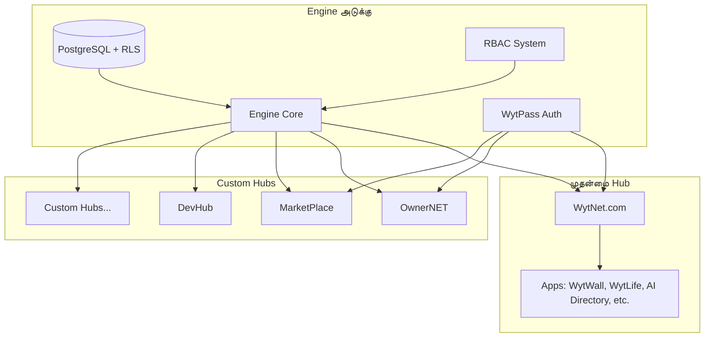

# தள கண்ணோட்டம்

## WytNet என்றால் என்ன?

WytNet என்பது "Engine" கட்டமைப்பில் கட்டப்பட்ட ஒரு **white-label, multi-tenant SaaS தளம்**, பயன்பாடுகளை உருவாக்குதல், உள்ளடக்கத்தை நிர்வகித்தல், மற்றும் சுதந்திர hubs உருவாக்குதல் ஆகியவற்றுக்கு விரிவான கருவிகளை வழங்குகிறது. இது ஒரு தளம் மற்றும் custom டிஜிட்டல் அனுபவங்களை உருவாக்குவதற்கான அடித்தளம் இரண்டுமாகும்.

## தள நோக்கம்

WytNet மூன்று முக்கிய தேவைகளை நிவர்த்தி செய்கிறது:

1. **இறுதி பயனர்களுக்கு**: ஒரே அடையாளத்துடன் (WytPass) பல பயன்பாடுகளை அணுக ஒருங்கிணைந்த தளம்
2. **டெவலப்பர்களுக்கு**: முன்-கட்டமைக்கப்பட்ட கூறுகளைப் பயன்படுத்தி பயன்பாடுகளை விரைவாக உருவாக்கி வெளியிட modular அமைப்பு
3. **அமைப்புகளுக்கு**: குறிப்பிட்ட தேவைகளுக்கு ஏற்ப custom, branded தளங்களை (Hubs) உருவாக்க கட்டமைப்பு

## முக்கிய கூறுகள்

### Engine
எல்லாவற்றையும் இயக்கும் அடிப்படை அடுக்கு:
- Row Level Security உடன் Multi-tenancy கட்டமைப்பு
- WytPass Universal Identity & Validation
- Module மேலாண்மை மற்றும் இணைப்பு
- RBAC (Role-Based Access Control)
- Audit logging மற்றும் தள அமைப்புகள்

### WytNet.com
தள திறன்களைக் காட்டும் முதன்மை hub:
- App மேலாண்மையுடன் பயனர் dashboard
- சமூக அம்சங்கள் (WytWall)
- வாழ்க்கை முறை & சமூக கருவிகள் (WytLife)
- AI கருவிகள் directory
- பயன்பாட்டு apps (QR Generator, DISC Assessment)

### Custom Hubs
Engine இல் கட்டப்பட்ட சுதந்திர தளங்கள்:
- OwnerNET (சொத்து மேலாண்மை)
- MarketPlace (மின்-வணிகம்)
- DevHub (டெவலப்பர் கருவிகள்)
- Custom வாடிக்கையாளர் hubs

## முக்கிய திறன்கள்

### 1. Modular கட்டமைப்பு
```
Entity → Module → App → Hub
```
எளிய அம்சங்களிலிருந்து முழுமையான தளங்கள் வரை அளவிடும் மீண்டும் பயன்படுத்தக்கூடிய கூறுகளிலிருந்து உருவாக்கவும்.

### 2. Universal அங்கீகாரம்
**WytPass** எல்லா தளங்களிலும் ஒருங்கிணைந்த அடையாளத்தை வழங்குகிறது:
- Google OAuth
- Email OTP (கடவுச்சொல் இல்லாமல்)
- Email/Password
- Session மேலாண்மை
- Multi-context ஆதரவு (User, Hub Admin, Super Admin)

### 3. Multi-Tenancy
முழுமையான தரவு தனிமைப்படுத்தல் மற்றும் tenant மேலாண்மை:
- PostgreSQL இல் Row Level Security (RLS)
- Tenant-குறிப்பிட்ட உள்ளமைவுகள்
- தனிமைப்படுத்தப்பட்ட தரவு மற்றும் வளங்கள்
- Global Display IDs

### 4. White-Label திறன்
ஒவ்வொரு hub-ம் முழுமையாக தனிப்பயனாக்கப்படலாம்:
- Custom branding மற்றும் theming
- சொந்த domain பெயர்கள்
- தளம்-குறிப்பிட்ட அம்சங்கள்
- சுதந்திர செயல்பாடு

### 5. Low-Code கருவிகள்
- CRUD builders
- Content Management System (CMS)
- App இணைப்பு கருவிகள்
- Hub ஒருங்கிணைப்பு

## தள படிநிலை



## தொழில்நுட்ப Stack

### Frontend
- **Framework**: TypeScript உடன் React 18
- **Build Tool**: Vite
- **Routing**: Wouter
- **State Management**: TanStack Query
- **UI Library**: shadcn/ui (Radix UI + Tailwind CSS)
- **Forms**: React Hook Form + Zod validation

### Backend
- **Runtime**: Node.js
- **Framework**: TypeScript உடன் Express.js
- **API Pattern**: RESTful APIs
- **Authentication**: Passport.js + Custom WytPass
- **Session Store**: connect-pg-simple (PostgreSQL)

### Database
- **Database**: PostgreSQL (Neon serverless)
- **ORM**: Drizzle ORM
- **Schema**: RLS உடன் Multi-tenant
- **Migrations**: Drizzle Kit

### Infrastructure
- **Deployment**: Replit
- **CI/CD**: தானியங்கு workflows
- **Monitoring**: Audit logs மற்றும் analytics
- **PWA**: முழு Progressive Web App ஆதரவு

## குறுகிய கால இலக்குகள்

1. **Phase 1: பயனர் மேலாண்மை** (தற்போது)
   - பயனர் பதிவு & அங்கீகாரம்
   - பயனர் சுயவிவர மேலாண்மை
   - MyWyt Apps dashboard

2. **Phase 2: WytWall** (அடுத்தது)
   - இடுகை உருவாக்கம் மற்றும் மேலாண்மை
   - நிர்வாக ஒப்புதல் workflow
   - தொடர்புகளுடன் பொது feed
   - பயனர் ஈடுபாடு அம்சங்கள்

3. **Phase 3: App Ecosystem**
   - WytLife அம்சங்கள்
   - AI Directory
   - QR Generator
   - DISC Assessment
   - App marketplace

## நீண்ட கால தொலைநோக்கு

### தள பரிணாமம்
- **அளவிடுதல்**: ஆயிரக்கணக்கான custom hubs ஆதரவு
- **Marketplace**: App மற்றும் module marketplace
- **Ecosystem**: டெவலப்பர் சமூகம் மற்றும் ஆவணங்கள்
- **Intelligence**: AI-இயக்கப்படும் தள மேலாண்மை

### அம்ச விரிவாக்கம்
- மொபைல் பயன்பாடுகள் (iOS & Android)
- நேரடி collaboration கருவிகள்
- மேம்பட்ட analytics மற்றும் reporting
- அடையாள சரிபார்ப்புக்கான Blockchain ஒருங்கிணைப்பு
- மூன்றாம் தரப்பு ஒருங்கிணைப்புகளுக்கான API marketplace

### வணிக மாதிரி
- **Free Tier**: அடிப்படை WytNet.com அணுகல்
- **Pro Tier**: மேம்பட்ட apps மற்றும் அம்சங்கள்
- **Hub License**: Custom hub உருவாக்கம்
- **Enterprise**: SLA உடன் White-label தீர்வுகள்

## மதிப்பு முன்மொழிவுகள்

### இறுதி பயனர்களுக்கு
- ✅ பல தளங்களில் ஒரே அடையாளம்
- ✅ தனிப்பயனாக்கப்பட்ட app dashboard
- ✅ தனியுரிமை மற்றும் தரவு கட்டுப்பாடு
- ✅ Hubs முழுவதும் தடையற்ற அனுபவம்

### டெவலப்பர்களுக்கு
- ✅ முன்-கட்டமைக்கப்பட்ட modules மற்றும் கூறுகள்
- ✅ Type-safe development (TypeScript)
- ✅ விரிவான API ஆவணங்கள்
- ✅ வேகமான deployment மற்றும் scaling

### அமைப்புகளுக்கு
- ✅ விரைவான தள development
- ✅ முழுமையான தனிப்பயனாக்கம்
- ✅ Multi-tenant கட்டமைப்பு
- ✅ உள்ளமைக்கப்பட்ட பாதுகாப்பு மற்றும் இணக்கம்

## பாதுகாப்பு & இணக்கம்

- **அங்கீகாரம்**: Multi-factor, session-அடிப்படையிலான
- **அங்கீகரிப்பு**: Fine-grained RBAC (64 permissions)
- **தரவு பாதுகாப்பு**: Row Level Security
- **Audit**: முழுமையான செயல்பாடு logging
- **தனியுரிமை**: GDPR-இணக்க வடிவமைப்பு
- **பாதுகாப்பு**: CSRF protection, பாதுகாப்பான cookies

## தொடங்குதல்

1. [முக்கிய கருத்துக்களைப் புரிந்து கொள்ளுங்கள்](/ta/core-concepts) - கட்டமைப்பைக் கற்றுக் கொள்ளுங்கள்
2. [அம்சங்களை ஆராயுங்கள்](/ta/features/wytpass) - என்ன சாத்தியம் என்பதைப் பாருங்கள்
3. [தரவுத்தள Schema ஐ மதிப்பாய்வு செய்யுங்கள்](/ta/architecture/database-schema) - தரவு அமைப்பைப் புரிந்து கொள்ளுங்கள்
4. [செயல்படுத்தல் வழிகாட்டியைப் பின்பற்றுங்கள்](/ta/implementation/getting-started) - உருவாக்க தொடங்குங்கள்

## ஆதரவு & வளங்கள்

- **ஆவணங்கள்**: இந்த தளம் (docs.wytnet.com)
- **API குறிப்பு**: [API ஆவணங்கள்](/ta/api/authentication)
- **சமூகம்**: டெவலப்பர் மன்றங்கள் மற்றும் விவாதங்கள்
- **ஆதரவு**: Enterprise-க்கு Email மற்றும் chat ஆதரவு

---

**அடுத்தது**: [முக்கிய கருத்துக்கள் →](/ta/core-concepts)
