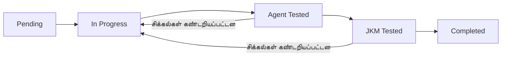

# அம்சங்கள் சரிபார்ப்பு பட்டியல் அமைப்பு

## கண்ணோட்டம்

**அம்சங்கள் சரிபார்ப்பு பட்டியல் அமைப்பு** என்பது WytNet Engine Admin Portal-ல் உள்ளமைக்கப்பட்ட ஒரு விரிவான திட்ட மேலாண்மை கருவியாகும், இது தளத்தின் மேம்பாட்டு முன்னேற்றத்தை கண்காணிக்கிறது. deployment-க்கு முன் அம்சங்கள் முழுமையாக சரிபார்க்கப்படுவதை உறுதி செய்ய இரட்டை-நிலை சோதனை முறையை செயல்படுத்துகிறது.

**நேரடி அமைப்பு**: [Engine Admin → Features Checklist](/engine/features-checklist)

---

## நோக்கம்

- **மேம்பாட்டு முன்னேற்றத்தை கண்காணித்தல்**: அனைத்து WytNet தள அம்சங்கள் மற்றும் அவற்றின் செயல்படுத்தல் நிலையை கண்காணித்தல்
- **இரட்டை-சோதனை முறை**: இரண்டு-நிலை சரிபார்ப்பு (Agent Testing → JKM Testing) தரத்தை உறுதி செய்கிறது
- **பணி மேலாண்மை**: அம்சங்களை தெளிவான வெற்றி அளவுகோல்களுடன் செயல்படுத்தக்கூடிய பணிகளாக பிரித்தல்
- **URL கண்காணிப்பு**: எளிதான சரிபார்ப்புக்காக அம்சங்களை நேரடி செயல்படுத்தல்களுடன் இணைத்தல்
- **முன்னேற்ற தெரிவுநிலை**: அனைத்து அம்சங்களிலும் நேரடி முன்னேற்ற கண்காணிப்பு

---

## அமைப்பு கட்டமைப்பு

### தரவு மாதிரி

**அம்சங்கள் அட்டவணை**:
```typescript
{
  id: UUID
  displayId: string        // FT0001, FT0002, போன்றவை
  title: string            // அம்சத்தின் பெயர்
  description: string      // அம்சத்தின் விளக்கம்
  category: string         // அம்ச வகை
  priority: number         // 1-5 முன்னுரிமை நிலை
  status: enum             // pending | in_progress | agent_tested | jkm_tested | completed
  url: string             // நேரடி அம்ச URL (விரும்பினால்)
  agentTestedAt: timestamp
  jkmTestedAt: timestamp
  createdAt: timestamp
  updatedAt: timestamp
}
```

**பணிகள் அட்டவணை**:
```typescript
{
  id: UUID
  featureId: UUID         // அம்சங்களுக்கான Foreign key
  title: string           // பணியின் தலைப்பு
  description: string     // பணி விவரங்கள்
  status: enum            // pending | in_progress | completed
  order: number           // காட்சி வரிசை
  url: string            // பணி-குறிப்பிட்ட URL (விரும்பினால்)
  createdAt: timestamp
}
```

---

## இரட்டை-சோதனை முறை

இந்த அமைப்பு கடுமையான இரண்டு-நிலை சோதனை செயல்முறையை செயல்படுத்துகிறது:

### நிலை 1: Agent சோதனை
- **யார்**: Replit AI Agent ஆரம்ப சரிபார்ப்பு செய்கிறது
- **நோக்கம்**: தொழில்நுட்ப செயல்படுத்தல், குறியீடு தரம், மற்றும் அடிப்படை செயல்பாட்டை சரிபார்த்தல்
- **நிலை**: `agent_tested`
- **நேர முத்திரை**: `agentTestedAt`-ல் பதிவு செய்யப்படுகிறது

### நிலை 2: JKM சோதனை
- **யார்**: திட்ட மேலாளர் (JKM) பயனர் ஏற்றுக்கொள்ளல் சோதனை செய்கிறார்
- **நோக்கம்**: வணிக தேவைகள், பயனர் அனுபவம், மற்றும் நிஜ-உலக பயன்பாட்டை சரிபார்த்தல்
- **நிலை**: `jkm_tested`
- **நேர முத்திரை**: `jkmTestedAt`-ல் பதிவு செய்யப்படுகிறது

### நிலை ஓட்டம்



**நிலை மதிப்புகள்**:
1. `pending` - அம்சம் இன்னும் தொடங்கவில்லை
2. `in_progress` - தீவிர மேம்பாடு
3. `agent_tested` - AI Agent சரிபார்ப்பை தேர்ச்சி பெற்றது
4. `jkm_tested` - திட்ட மேலாளர் சரிபார்ப்பை தேர்ச்சி பெற்றது
5. `completed` - முழுமையாக deploy செய்யப்பட்டு சரிபார்க்கப்பட்டது

---

## பயனர் இடைமுகம்

### அம்சங்கள் பட்டியல் காட்சி

முக்கிய காட்சி அனைத்து அம்சங்களையும் விரிவாக்கக்கூடிய accordion அமைப்பில் காட்டுகிறது:

**அம்சங்கள் Card கூறுகள்**:
- **அம்சத்தின் தலைப்பு** - நிலை badge-உடன் முக்கிய காட்சி
- **Display ID** - தனித்துவமான அடையாளங்காட்டி (எ.கா., FT0001)
- **விளக்கம்** - அம்ச கண்ணோட்டம்
- **முன்னுரிமை Badge** - காட்சி முன்னுரிமை குறிகாட்டி (1-5)
- **நிலை Badge** - வண்ண-குறியீட்டு நிலை
- **URL Link** - நேரடி அம்சத்திற்கு கிளிக் செய்யக்கூடிய இணைப்பு (இருந்தால்)
- **சோதனை நேர முத்திரைகள்** - Agent/JKM சோதனை எப்போது முடிந்தது
- **முன்னேற்ற பட்டை** - பணி முடிவு சதவீதம்
- **செயல் பொத்தான்கள்** - திருத்து, நீக்கு, சோதனை செய்ததாக குறி

### பணிகள் பிரிவு (விரிவாக்கக்கூடியது)

ஒவ்வொரு அம்சமும் அதன் பணிகளை காட்ட விரிவாக்க முடியும்:

**பணி Card கூறுகள்**:
- **பணியின் தலைப்பு** - தெளிவான பணி பெயர்
- **விளக்கம்** - பணி விவரங்கள்
- **நிலை Checkbox** - முடிவாக குறி
- **URL Link** - பணி-குறிப்பிட்ட URL (பொருந்தினால்)
- **வரிசை எண்** - பணி வரிசை

---

## அம்சங்கள்

### முக்கிய திறன்கள்

1. **அம்ச மேலாண்மை**
   - தலைப்பு, விளக்கம், வகை, முன்னுரிமை கொண்ட புதிய அம்சங்களை உருவாக்கு
   - இருக்கும் அம்சங்களை திருத்து
   - அம்சங்களை நீக்கு (உறுதிப்படுத்தலுடன்)
   - நேரடி செயல்படுத்தல்களுக்கு அம்ச URLs-ஐ அமை

2. **பணி மேலாண்மை**
   - ஒவ்வொரு அம்சத்திற்கும் பல பணிகளை சேர்
   - பணிகளை முடிவாக குறி
   - drag-drop மூலம் பணிகளை மறுவரிசைப்படுத்து (எதிர்கால மேம்பாடு)
   - பணிகளை குறிப்பிட்ட URLs-உடன் இணை

3. **சோதனை முறை**
   - அம்சத்தை "Agent Tested"-ஆக குறி (நேர முத்திரையை பதிவு செய்கிறது)
   - அம்சத்தை "JKM Tested"-ஆக குறி (நேர முத்திரையை பதிவு செய்கிறது)
   - இரண்டு சோதனைகளும் தேர்ச்சி பெற்ற பிறகு "Completed" நிலைக்கு நகர்

4. **முன்னேற்ற கண்காணிப்பு**
   - ஒவ்வொரு அம்சத்திற்கும் நேரடி முன்னேற்ற பட்டைகள்
   - உலகளாவிய முன்னேற்ற புள்ளிவிவரங்கள் (மொத்த அம்சங்கள், முடிந்த எண்ணிக்கை)
   - வகை-அடிப்படையில் வடிகட்டுதல்
   - முன்னுரிமை-அடிப்படையில் வடிகட்டுதல்

5. **URL சரிபார்ப்பு**
   - செல்லுபடியாகும் URL pattern சரிபார்ப்பு
   - உள்ளக பாதைகள் (`/engine/...`) மற்றும் வெளிப்புற URLs-க்கு ஆதரவு
   - எளிதான சரிபார்ப்புக்காக கிளிக் செய்யக்கூடிய இணைப்புகள்

---

## பயன்பாட்டு வழிகாட்டி

### புதிய அம்சத்தை உருவாக்குதல்

1. **Engine Admin → Features Checklist**-க்கு செல்லவும்
2. **"+ Add Feature"** பொத்தானை கிளிக் செய்யவும்
3. படிவத்தை நிரப்பவும்:
   - **Title**: தெளிவான, விளக்கமான அம்ச பெயர்
   - **Description**: விரிவான அம்ச கண்ணோட்டம்
   - **Category**: பொருத்தமான வகையை தேர்ந்தெடு
   - **Priority**: முன்னுரிமை நிலையை அமை (1-5)
   - **URL** (விரும்பினால்): நேரடி செயல்படுத்தலுக்கான இணைப்பு
4. **"Create Feature"**-ஐ கிளிக் செய்யவும்

### அம்சத்திற்கு பணிகளை சேர்த்தல்

1. அம்ச card-ஐ விரிவாக்க கிளிக் செய்யவும்
2. **"+ Add Task"** பொத்தானை கிளிக் செய்யவும்
3. பணி விவரங்களை உள்ளிடவும்:
   - **Title**: குறிப்பிட்ட பணி பெயர்
   - **Description**: பணி தேவைகள் மற்றும் ஏற்றுக்கொள்ளல் அளவுகோல்கள்
   - **URL** (விரும்பினால்): பணி-குறிப்பிட்ட இணைப்பு
4. **"Add Task"**-ஐ கிளிக் செய்யவும்

### சோதனை முறை

**Agent சோதனை** (Replit AI Agent):
1. அம்ச செயல்படுத்தலை முடிக்கவும்
2. **"Mark as Agent Tested"** பொத்தானை கிளிக் செய்யவும்
3. அமைப்பு நேர முத்திரையை பதிவு செய்து நிலையை `agent_tested`-க்கு புதுப்பிக்கிறது
4. Agent குறியீடு மற்றும் செயல்பாட்டை மதிப்பாய்வு செய்கிறது

**JKM சோதனை** (திட்ட மேலாளர்):
1. அம்சம் `agent_tested` நிலையில் இருக்க வேண்டும்
2. **"Mark as JKM Tested"** பொத்தானை கிளிக் செய்யவும்
3. அமைப்பு நேர முத்திரையை பதிவு செய்து நிலையை `jkm_tested`-க்கு புதுப்பிக்கிறது
4. PM வணிக தேவைகள் மற்றும் UX-ஐ சரிபார்க்கிறார்

**முடிவு**:
1. இரண்டு சோதனைகளும் தேர்ச்சி பெற்றவுடன், அம்ச நிலை தானாக `completed` ஆகிறது
2. அம்சம் "Completed" வடிகட்டியில் தோன்றுகிறது
3. முன்னேற்ற புள்ளிவிவரங்கள் புதுப்பிக்கப்படுகின்றன

---

## தொழில்நுட்ப செயல்படுத்தல்

### Frontend Stack

- **React 18** TypeScript-உடன்
- **react-hook-form** படிவ சரிபார்ப்புக்காக
- **TanStack Query** நிலை மேலாண்மைக்காக
- **shadcn/ui** கூறுகள் (Accordion, Card, Badge, போன்றவை)
- **Tailwind CSS** styling-க்காக
- **Lucide Icons** காட்சி கூறுகளுக்காக

### Backend Stack

- **Express.js** REST API
- **PostgreSQL** தரவுத்தளம் (Neon)
- **Drizzle ORM** type-safe queries-க்காக
- **Zod** schema சரிபார்ப்பு

---

## சிறந்த நடைமுறைகள்

### அம்ச உருவாக்கம்

1. **தெளிவான தலைப்புகள்**: விளக்கமான, செயல்-சார்ந்த அம்ச பெயர்களை பயன்படுத்தவும்
   - ✅ நல்லது: "பயனர் Profile மேலாண்மை அமைப்பு"
   - ❌ மோசம்: "Profile விஷயங்கள்"

2. **விரிவான விளக்கங்கள்**: நோக்கம், நன்மைகள், மற்றும் ஏற்றுக்கொள்ளல் அளவுகோல்களை சேர்க்கவும்

3. **சரியான வகைப்படுத்தல்**: எளிதான வடிகட்டுதலுக்காக தொடர்புடைய அம்சங்களை குழுவாக்கவும்

4. **முன்னுரிமை அமைத்தல்**: முன்னுரிமை நிலைகளை தந்திரமாக பயன்படுத்தவும்

---

## தொடர்புடைய ஆவணங்கள்

- [Engine Admin Panel கண்ணோட்டம்](/ta/admin/engine-admin)
- [RBAC அமைப்பு](/ta/architecture/rbac)
- [தரவுத்தள Schema](/ta/architecture/database-schema)
- [API குறிப்பு](/ta/api/admin)

---

## அணுகல் கட்டுப்பாடு

**தேவையான அனுமதி**: `features_checklist.manage` (Super Admin மட்டும்)

Super Admin சலுகைகள் உள்ள பயனர்கள் மட்டுமே அம்சங்கள் சரிபார்ப்பு பட்டியல் அமைப்பை அணுக முடியும்.
